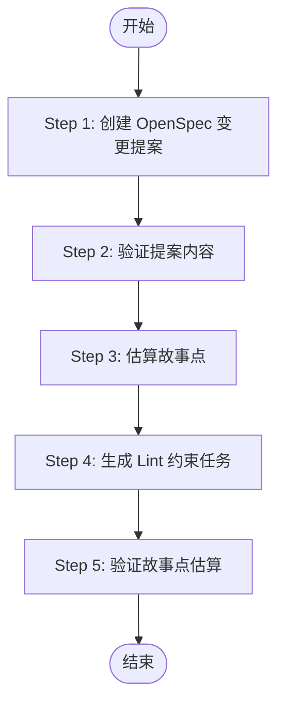

# Project Manager - 完整项目管理流程

基于 PRD 和 Design 文档，执行完整的项目管理工作流程：创建 OpenSpec 变更提案 → 验证内容 → 估算故事点 → 生成 Lint 约束任务 → 验证故事点。

## 工作流程



## 执行约束（必须遵守）

**禁止人工确认**：不得向用户询问以下问题，必须自动执行完整 5 步流程：

- ❌ 不得询问「PRD 和 Design 文档是否已就绪？」
- ❌ 不得询问「需要处理的变更名称是什么？」
- ❌ 不得要求用户确认后再开始执行

**自动执行原则**：

- **直接开始**：触发技能后立即执行 Step 1，无需等待用户确认
- **自动推断变更名称**：若用户未显式指定，从 PRD/Design 内容自动确定 kebab-case 变更名称
- **自动检测文档**：若 PRD 或 DESIGN 不存在，按「错误处理」流程中止并提示，不询问用户
- **自动定位变更目录**：Step 2-5 使用 Step 1 生成的变更名称，无需用户指定

**文档路径**：

- **必须**从 prompt 中获取 PRD、DESIGN、审查报告输出路径（与上游 MRD/PRD/DESIGN 的 `docs/{{gitBranch}}/` 结构一致）

---

## 前置条件（自动检测，不询问用户）

执行 Step 1 前，自动检测以下条件：

- PRD 已存在且完整（路径由 prompt 指定，如 `docs/{{gitBranch}}/PRD.md`）
- DESIGN 已存在且完整（路径由 prompt 指定，如 `docs/{{gitBranch}}/DESIGN.md`）
- `AGENTS.md` 项目开发指南已存在

若任一条件不满足，按「错误处理」章节中止流程并提示，**不向用户询问**。

---

## Step 1: 创建 OpenSpec 变更提案

**目标**：一次性创建 proposal + specs + design + tasks。

**执行流程**：

1. **准备输入上下文**：读取 PRD、Design（路径见「文档路径」）、AGENTS.md、docs/dev-spec/ 等
2. **确定变更名称**：根据 PRD/Design 内容**自动**确定 kebab-case 变更名称，不向用户询问；若用户已显式指定则优先使用
3. **执行 openspec-propose 技能**：读取并执行 openspec-propose 技能，传入变更名称和从 PRD/Design 提取的需求描述
4. **技能输出**：生成 `openspec/changes/{变更名称}/` 下的 proposal.md、specs/、design.md、tasks.md

**保留的业务约束**：

- 任务清单只包含**开发实现任务**（数据库设计、后端实现、前端实现等）
- ❌ 不要生成「测试与验证」章节
- ❌ 不要生成「文档与部署」章节
- 必须参考 docs/dev-spec/ 和模板代码（ainative-app/、ainative-mobile/、ainative-backend/、ainative-shadow/）

**菜单注入任务**（当 Design 第 4.5 章存在时）：

- 在 `tasks.md` 中添加菜单数据库注入任务
- 任务描述必须包含：**生成 `{module}_menu.sql` 并执行 `make sqlimport` 导入**
- 验收标准必须包含：**执行 `make sqlimport ./doc/sql/yanxue/{module}_menu.sql` 成功**

---

## Step 2: 验证提案内容（openspec-validator）

**目标**：基于 PRD 和 Design 文档审查 OpenSpec 规范内容，检查冲突、缺失和错误，确保规范完整覆盖需求。

**执行流程**：读取并执行 `.agents/skills/openspec-validator/SKILL.md` 中定义的审查流程。

1. **定位 openspec 变更目录**：`openspec/changes/{变更名称}/`
2. **收集基准文档**：PRD、design.md、proposal.md
3. **遍历审查所有 openspec 规范文件**：
   - **冲突检查**：与 PRD/design 不一致的内容
   - **缺失检查**：PRD/design 中有但规范中缺失的内容
   - **错误检查**：规范内部的逻辑错误
4. **自动修正**发现的问题
5. **生成审查报告**：**必须**写入 prompt 指定的路径（如 `docs/{{gitBranch}}/openspecValidatorReport.md`），覆盖写入，非追加

**文档优先级**：`PRD > design.md > proposal.md > 现有 spec`

**验收标准**：

- 生成审查报告（路径由 prompt 指定）
- 所有规范文件与 PRD/Design 一致
- 若审查有结构性变更（新建 spec、补充缺失需求），同步更新 tasks.md

---

## Step 3: 估算故事点

**目标**：为任务清单中的每个任务估算故事点（Story Points）。

**执行流程**：

1. **定位任务文件**：`openspec/changes/{变更名称}/tasks.md`
2. **读取基准文档**：`.claude/skills/project-manager/references/story-points-baseline.md`（评估标准）
3. **分析任务复杂度**：按「技术模块拆分模型」和「模块复杂度分级」分析
   - 识别任务涉及的技术模块（数据模型、业务逻辑、接口、数据访问、UI、状态管理等）
   - 为每个模块确定复杂度等级（L1/L2/L3）
   - 识别协作加权（前后端协作、跨服务调用、权限系统、缓存一致性、异步消息，最多 +3）
4. **计算并映射故事点**：
   - 总复杂度值 = Σ（模块复杂度权重） + 协作加权
   - 映射表：1-4→0, 5-8→1, 9-12→2, 13-16→3, 17-20→5, ≥21→8
5. **在 tasks.md 中添加**：
   - 格式：`**故事点: X**`（在任务描述后）
   - 必须添加：`*评估说明：[模块列表]，总复杂度值 = X → 故事点 Y*`
6. **跳过**「Lint 约束」章节中的任务，不为其填写故事点

**严格遵守**：

- **禁止主观调整**：不允许在映射后人为提升或降低故事点
- **映射表是强制性的**：总复杂度值必须严格按照映射表转换

---

## Step 4: 生成 Lint 约束任务

**目标**：根据 tasks.md 中任务涉及的端（ainative-app / ainative-mobile / ainative-shadow / ainative-backend），在任务清单末尾追加对应的 lint 约束任务。**核心原则：如果没有修改该端代码，则不生成该端的 lint 任务。** lint 任务不填故事点。

**执行流程**：

1. **读取**：`openspec/changes/{变更名称}/tasks.md`、`.claude/skills/project-manager/references/lint-task-rules.md`
2. **分析任务涉及的端**：扫描 tasks.md，**仅当任务涉及修改该端可被 lint 检查的代码时**才判定涉及：
   - **ainative-app**：新增/修改 .vue、.ts、.js 等
   - **ainative-mobile**：新增/修改移动端 .tsx、.ts、.js 等
   - **ainative-shadow**：新增/修改路由、视图、组件等
   - **ainative-backend**：新增/修改 Go 代码；**仅 init.sql 或纯 SQL 不生成 backend lint**
3. **追加 Lint 任务**：
   - 若已存在「Lint 约束」章节且已覆盖所有涉及的端，跳过
   - 在 tasks.md 末尾新增「## N. Lint 约束」章节
   - 仅追加**涉及的端**对应的任务：`- [ ] N.x Lint 约束：{端名} 执行 \`{lint 命令}\` 通过`
   - **不填故事点**，不添加评估说明

**Lint 命令**：

- ainative-app：`cd ainative-app && pnpm lint`
- ainative-mobile：`cd ainative-mobile && pnpm lint`
- ainative-shadow：`cd ainative-shadow && pnpm lint`
- ainative-backend：`cd ainative-backend && make lint`

---

## Step 5: 验证故事点估算

**目标**：确认所有非 Lint 任务都有故事点评估，没有遗漏。

**执行流程**：

1. 读取 `openspec/changes/{变更名称}/tasks.md`
2. 统计「Lint 约束」章节中的任务数量（这些任务**无需**故事点）
3. 统计非 Lint 任务中包含 `**故事点: X**` 的数量，X 必须为 0、1、2、3、5、8
4. 验证是否所有**非 Lint** 任务都有故事点评估

**返回结果**（JSON 格式）：

```json
{
  "result": "SUCCESS",
  "totalTasks": 10,
  "estimatedTasks": 10,
  "reason": "所有任务都已完成故事点评估"
}
```

或

```json
{
  "result": "INCOMPLETE",
  "totalTasks": 10,
  "estimatedTasks": 8,
  "reason": "有 2 个任务未评估故事点"
}
```

若 `result` 为 `INCOMPLETE`，返回 Step 3 补充评估后重新执行 Step 5。

---

## 流程输出

完成所有步骤后，输出以下总结：

```markdown
## 项目管理流程完成

### 执行摘要

✅ Step 1: OpenSpec 变更提案已创建
✅ Step 2: 提案内容审查完成（修正 X 处问题）
✅ Step 3: 故事点估算完成（共 Y 个任务）
✅ Step 4: Lint 约束任务已生成（涉及 Z 个端）
✅ Step 5: 故事点验证通过

### 输出文件

- openspec/changes/{变更名称}/proposal.md - 变更提案
- openspec/changes/{变更名称}/design.md - 技术设计
- openspec/changes/{变更名称}/specs/ - 规范文件
- openspec/changes/{变更名称}/tasks.md - 任务清单（含故事点及 Lint 约束）
- 审查报告（路径由 prompt 指定）

### 统计信息

- 任务总数：Y 个（含 Lint 约束任务）
- 总故事点：Z 点（不含 Lint 任务）

### 下一步行动

- [ ] 审查任务清单和故事点评估
- [ ] 根据优先级和依赖关系安排开发顺序
- [ ] 开始执行开发任务
```

---

## 错误处理

**缺少前置文档**：找不到 PRD 或 Design 文档 → 中止流程并提示用户先完成 PRD/Design

**故事点验证失败**：Step 5 返回 INCOMPLETE → 返回 Step 3 补充评估后重新执行 Step 5

---

## 注意事项

1. **严格按顺序执行**：每个步骤都有依赖关系，不能跳过或调换顺序
2. **验证通过才继续**：Step 5 的故事点验证必须通过才能结束
3. **保持文件一致性**：修改文件时注意与其他文档的一致性
4. **使用中文输出**：所有输出文件和描述都使用中文
5. **报告必须落盘**：Step 2 审查报告必须写入 prompt 指定的路径，不可仅输出到终端
6. **禁止人工确认**：严格执行「执行约束」章节，不得在流程中插入需用户确认的步骤

---

## 相关技能

- `openspec-propose` - 核心依赖（Step 1）
- `openspec-validator` - 内容验证（Step 2）
- `backend-dev` - 后端开发流程（任务执行阶段使用）
- `prd` - PRD 生成（前置步骤）
- `design` - Design 生成（前置步骤）

---

## 使用场景

1. PRD 和 Design 文档都已完成，需要生成 OpenSpec 变更提案
2. 需要任务拆解和故事点估算
3. 用户明确提到「项目管理」「任务拆解」「故事点估算」等关键词
