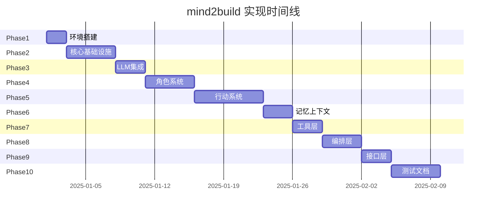
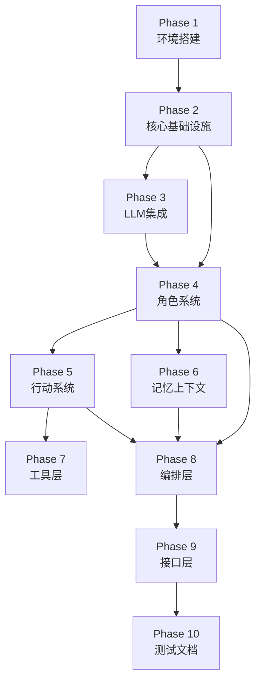

# mind2build 任务拆解文档

> AI 可执行任务拆解文档  
> 基于技术规格文档，用于指导 AI 逐步、可控地完成实现

**文档版本**: v1.2  
**创建日期**: 2025-12-24  
**最后更新**: 2026-01-26（更新Actions数量为30个，拆分QA工作流）  
**依赖文档**: `03_技术规格文档_SPEC.md`, `04_系统架构文档_ARCHITECTURE.md`

---

## 目录

1. [任务拆解原则](#1-任务拆解原则)
2. [阶段总览](#2-阶段总览)
3. [Phase 1: 环境搭建](#phase-1-环境搭建)
4. [Phase 2: 核心基础设施](#phase-2-核心基础设施)
5. [Phase 3: LLM 提供商集成](#phase-3-llm-提供商集成)
6. [Phase 4: 角色系统实现](#phase-4-角色系统实现)
7. [Phase 5: 行动系统实现](#phase-5-行动系统实现)
8. [Phase 6: 记忆与上下文](#phase-6-记忆与上下文)
9. [Phase 7: 工具层实现](#phase-7-工具层实现)
10. [Phase 8: 编排层实现](#phase-8-编排层实现)
11. [Phase 9: 接口层实现](#phase-9-接口层实现)
12. [Phase 10: 测试与文档](#phase-10-测试与文档)

---

## 1. 任务拆解原则

### 1.1 基本原则

每个任务必须：
- ✅ **可独立实现**: 不依赖后续任务
- ✅ **有清晰输入/输出**: 明确的前置条件和交付物
- ✅ **可验证完成**: 具体的完成判定标准
- ❌ **禁止隐式依赖**: 所有依赖必须明确声明

### 1.2 任务模板

```
Task ID: T{Phase}-{Number}
任务目标: 一句话描述目标
前置条件: 必须完成的前置任务
输入: 需要的输入数据/文件
输出: 产出的代码/文档
完成判定标准: 可验证的标准
预计工时: X 小时/天
```

### 1.3 执行约束

- ❌ 未完成 Phase 1，不得进入 Phase 3
- ❌ spec 变更必须回滚 task 重新确认
- ❌ 跳过任务必须记录原因
- ✅ 每个 Phase 完成后进行 checkpoint
- ✅ 关键任务完成后进行代码审查

---

## 2. 阶段总览



| Phase | 名称 | 核心产出 | 预计工时 | 依赖 |
|-------|------|---------|---------|------|
| Phase 1 | 环境搭建 | 项目结构、依赖配置 | 2天 | - |
| Phase 2 | 核心基础设施 | Message, BaseRole, BaseAction | 5天 | Phase 1 |
| Phase 3 | LLM 集成 | BaseLLM, OpenAI, Claude | 3天 | Phase 2 |
| Phase 4 | 角色系统 | Role, ProductManager, Architect | 5天 | Phase 2 |
| Phase 5 | 行动系统 | WritePRD, WriteDesign, WriteCode | 7天 | Phase 4 |
| Phase 6 | 记忆上下文 | Memory, Context, CostManager | 3天 | Phase 4 |
| Phase 7 | 工具层 | Browser, Editor, Terminal | 3天 | Phase 5 |
| Phase 8 | 编排层 | Environment, Team | 4天 | Phase 4,5,6 |
| Phase 9 | 接口层 | CLI, Python API | 3天 | Phase 8 |
| Phase 10 | 测试文档 | 测试用例、文档 | 5天 | Phase 9 |

**总计**: 约 40 个工作日

---

## Phase 1: 环境搭建

### T1-1: 创建项目结构

**任务目标**: 建立标准的 Python 项目结构

**前置条件**: 无

**输入**: 无

**输出**:
```
mind2build/
├── mind2build/
│   ├── __init__.py
│   ├── base/
│   ├── roles/
│   ├── actions/
│   ├── provider/
│   ├── memory/
│   ├── environment/
│   ├── tools/
│   ├── utils/
│   └── configs/
├── tests/
├── examples/
├── docs/
├── requirements.txt
├── setup.py
├── pytest.ini
├── ruff.toml
└── README.md
```

**完成判定标准**:
- [x] 目录结构符合 Python 最佳实践
- [x] 所有目录包含 `__init__.py`
- [x] Git 仓库已初始化

**预计工时**: 2 小时

---

### T1-2: 配置依赖管理

**任务目标**: 设置项目依赖和开发工具

**前置条件**: T1-1

**输入**: 技术规格中的依赖清单

**输出**: `requirements.txt`, `setup.py`, `pyproject.toml`

**核心依赖**:
```python
# requirements.txt
pydantic>=2.0.0
typer>=0.9.0
aiohttp>=3.8.0
tenacity>=8.0.0
gitpython>=3.1.0
pyyaml>=6.0.0
openai>=1.0.0
anthropic>=0.18.0

# 开发依赖
pytest>=7.4.0
pytest-asyncio>=0.21.0
pytest-mock>=3.11.0
black>=23.3.0
ruff>=0.1.0
```

**完成判定标准**:
- [x] `pip install -e .` 成功
- [x] `pytest` 可运行（即使没有测试）
- [x] `ruff check .` 可运行

**预计工时**: 2 小时

---

### T1-3: 配置开发环境

**任务目标**: 设置代码规范和 CI/CD

**前置条件**: T1-2

**输入**: 代码规范要求

**输出**: 
- `.pre-commit-config.yaml`
- `ruff.toml`
- `.github/workflows/ci.yml`
- `.gitignore`

**完成判定标准**:
- [x] Pre-commit hooks 配置完成
- [x] Ruff 规则配置完成
- [x] GitHub Actions CI 配置完成

**预计工时**: 2 小时

---

## Phase 2: 核心基础设施

### T2-1: 实现 Message 消息系统

**任务目标**: 实现消息数据结构和验证

**前置条件**: Phase 1

**输入**: 技术规格中的 Message 定义

**输出**: `mind2build/schema.py`

**核心代码**:
```python
class Message(BaseModel):
    id: str = Field(default="", validate_default=True)
    content: str
    instruct_content: Optional[BaseModel] = None
    role: str = "user"
    cause_by: str = Field(default="", validate_default=True)
    sent_from: str = Field(default="", validate_default=True)
    send_to: set[str] = Field(default={MESSAGE_ROUTE_TO_ALL})
    metadata: dict = Field(default_factory=dict)
    
    @field_validator("id", mode="before")
    @classmethod
    def check_id(cls, id: str) -> str:
        return id if id else uuid.uuid4().hex
```

**完成判定标准**:
- [x] Message 类可正常实例化
- [x] 字段验证正常工作
- [x] 序列化/反序列化正常
- [x] 单元测试通过（> 5 个测试用例）

**预计工时**: 4 小时

---

### T2-2: 实现 BaseRole 抽象基类

**任务目标**: 定义角色的抽象接口

**前置条件**: T2-1

**输入**: 技术规格中的 Role 设计

**输出**: `mind2build/base/base_role.py`

**核心代码**:
```python
class BaseRole(BaseSerialization):
    """Abstract base class for all roles."""
    
    name: str
    
    @property
    def is_idle(self) -> bool:
        raise NotImplementedError
    
    @abstractmethod
    def think(self):
        """Consider what to do"""
        raise NotImplementedError
    
    @abstractmethod
    def act(self):
        """Perform action"""
        raise NotImplementedError
    
    @abstractmethod
    async def react(self) -> Message:
        """React to observed message"""
        raise NotImplementedError
    
    @abstractmethod
    async def run(self, with_message: Optional[Message] = None) -> Optional[Message]:
        """Observe, think and act"""
        raise NotImplementedError
    
    @abstractmethod
    def get_memories(self, k: int = 0) -> list[Message]:
        """Return recent k memories"""
        raise NotImplementedError
```

**完成判定标准**:
- [x] BaseRole 类定义完整
- [x] 抽象方法定义清晰
- [x] 可被子类继承

**预计工时**: 2 小时

---

### T2-3: 实现 BaseAction 抽象基类

**任务目标**: 定义行动的抽象接口

**前置条件**: T2-1

**输入**: 技术规格中的 Action 设计

**输出**: `mind2build/actions/action.py`

**核心代码**:
```python
class Action(SerializationMixin, ContextMixin, BaseModel):
    name: str = ""
    i_context: Union[dict, str, None] = ""
    prefix: str = ""
    desc: str = ""
    llm_name_or_type: Optional[str] = None
    
    @model_validator(mode="before")
    @classmethod
    def set_name_if_empty(cls, values):
        if "name" not in values or not values["name"]:
            values["name"] = cls.__name__
        return values
    
    async def run(self, *args, **kwargs):
        """Run action"""
        raise NotImplementedError("Subclass must implement run")
    
    async def _aask(self, prompt: str, system_msgs: Optional[list[str]] = None) -> str:
        """Ask LLM with default prefix"""
        return await self.llm.aask(prompt, system_msgs)
```

**完成判定标准**:
- [x] Action 类定义完整
- [x] run 方法为抽象方法
- [x] LLM 调用接口定义清晰
- [x] 单元测试通过

**预计工时**: 3 小时

---

### T2-4: 实现序列化机制

**任务目标**: 实现多态序列化/反序列化

**前置条件**: T2-2, T2-3

**输入**: Pydantic v2 文档

**输出**: `mind2build/base/base_serialization.py`

**核心代码**:
```python
class BaseSerialization(BaseModel, extra="forbid"):
    __is_polymorphic_base = False
    __subclasses_map__ = {}
    
    @model_serializer(mode="wrap")
    def __serialize_with_class_type__(self, default_serializer):
        ret = default_serializer(self)
        ret["__module_class_name"] = f"{self.__class__.__module__}.{self.__class__.__qualname__}"
        return ret
    
    @model_validator(mode="wrap")
    @classmethod
    def __convert_to_real_type__(cls, value: Any, handler):
        # 实现多态反序列化逻辑
        pass
```

**完成判定标准**:
- [x] Role/Action 可序列化为 JSON
- [x] 可从 JSON 恢复为正确的子类
- [x] 测试多态场景

**预计工时**: 4 小时

---

### T2-5: 实现 RoleContext

**任务目标**: 实现角色运行时上下文

**前置条件**: T2-2

**输入**: 角色状态管理需求

**输出**: `mind2build/roles/role_context.py`

**核心代码**:
```python
class RoleContext(BaseModel):
    """角色运行时上下文"""
    env: Optional[Environment] = None
    msg_buffer: MessageBuffer = Field(default_factory=MessageBuffer)
    memory: Memory = Field(default_factory=Memory)
    state: int = 0
    todo: Optional[Action] = None
    watch: set[str] = Field(default_factory=set)
    news: list[Message] = Field(default_factory=list)
    react_mode: str = RoleReactMode.REACT
    max_react_loop: int = 1
```

**完成判定标准**:
- [x] RoleContext 定义完整
- [x] 各字段类型正确
- [x] 可正常序列化

**预计工时**: 2 小时

---

## Phase 3: LLM 提供商集成

### T3-1: 实现 BaseLLM 抽象层

**任务目标**: 定义统一的 LLM 接口

**前置条件**: Phase 2

**输入**: 各LLM提供商API文档

**输出**: `mind2build/provider/base_llm.py`

**核心代码**:
```python
class BaseLLM(BaseModel):
    config: LLMConfig
    cost_manager: Optional[CostManager] = None
    
    async def aask(
        self,
        prompt: str,
        system_msgs: Optional[list[str]] = None,
        **kwargs
    ) -> str:
        """统一的提问接口"""
        messages = self._construct_messages(prompt, system_msgs)
        rsp = await self.acompletion(messages, **kwargs)
        return self._extract_content(rsp)
    
    async def acompletion(
        self,
        messages: list[dict],
        timeout: int = 60,
        **kwargs
    ) -> dict:
        """统一的补全接口"""
        raise NotImplementedError
    
    async def acompletion_text(
        self,
        messages: list[dict],
        **kwargs
    ) -> str:
        """返回文本内容"""
        rsp = await self.acompletion(messages, **kwargs)
        return self._extract_content(rsp)
```

**完成判定标准**:
- [x] BaseLLM 接口定义完整
- [x] 支持异步调用
- [x] 错误处理机制完善
- [x] Mock测试通过

**预计工时**: 4 小时

---

### T3-2: 实现 OpenAI LLM

**任务目标**: 集成 OpenAI API

**前置条件**: T3-1

**输入**: OpenAI API 文档

**输出**: `mind2build/provider/openai_api.py`

**核心代码**:
```python
class OpenAILLM(BaseLLM):
    async def acompletion(
        self,
        messages: list[dict],
        timeout: int = 60,
        **kwargs
    ) -> dict:
        response = await self.client.chat.completions.create(
            model=self.config.model,
            messages=messages,
            timeout=timeout,
            **kwargs
        )
        self._update_costs(response.usage)
        return response
```

**完成判定标准**:
- [x] OpenAI API 调用正常
- [x] 错误处理完善（重试机制）
- [x] Token 统计正确
- [x] 集成测试通过（需要API Key）

**预计工时**: 4 小时

---

### T3-3: 实现其他 LLM 提供商

**任务目标**: 集成 ZhipuAI, Ark, DeepSeek, Cursor 等

**前置条件**: T3-2

**输入**: 各提供商 API 文档

**输出**: 
- `backend/src/providers/llm/OpenAICompatibleLLM.ts`（统一架构，支持OpenAI、ZhipuAI、Ark、DeepSeek等）
- `backend/src/providers/llm/CursorLLM.ts`（独立实现）
- `backend/src/providers/llm/ZhipuLLM.ts`（通过OpenAICompatibleLLM）
- `backend/src/providers/llm/ArkLLM.ts`（通过OpenAICompatibleLLM）
- `backend/src/providers/llm/DeepSeekLLM.ts`（通过OpenAICompatibleLLM）

**架构说明**: 大多数LLM提供商通过统一的 `OpenAICompatibleLLM` 类实现，简化代码结构。Cursor Agent使用独立的 `CursorLLM` 实现。

**完成判定标准**:
- [x] 至少支持 5 个提供商（OpenAI、ZhipuAI、Ark、DeepSeek、Cursor）
- [x] 接口统一，可无缝切换
- [x] 每个提供商有基础测试

**预计工时**: 8 小时

---

### T3-4: 实现 LLM 工厂和注册机制

**任务目标**: 实现 LLM 创建工厂

**前置条件**: T3-3

**输入**: 工厂模式设计

**输出**: `mind2build/provider/llm_provider_registry.py`

**核心代码**:
```python
LLM_REGISTRY = {
    "openai": OpenAILLM,
    "azure": AzureOpenAILLM,
    "anthropic": AnthropicLLM,
    "gemini": GeminiLLM,
    # ...
}

def create_llm_instance(config: LLMConfig) -> BaseLLM:
    """根据配置创建LLM实例"""
    llm_class = LLM_REGISTRY.get(config.api_type)
    if not llm_class:
        raise ValueError(f"Unsupported LLM type: {config.api_type}")
    return llm_class(config)
```

**完成判定标准**:
- [x] 工厂方法正常工作
- [x] 配置驱动LLM创建
- [x] 支持动态注册新提供商

**预计工时**: 2 小时

---

## Phase 4: 角色系统实现

### T4-1: 实现 Role 核心类

**任务目标**: 实现 Role 的完整逻辑

**前置条件**: Phase 2, Phase 3

**输入**: 技术规格中的 Role 设计

**输出**: `mind2build/roles/role.py`

**核心方法**:
```python
class Role(BaseRole, SerializationMixin, ContextMixin, BaseModel):
    name: str = ""
    profile: str = ""
    goal: str = ""
    constraints: str = ""
    actions: list[Action] = Field(default_factory=list)
    rc: RoleContext = Field(default_factory=RoleContext)
    
    async def _observe(self) -> int:
        """观察环境，获取新消息"""
        pass
    
    async def _think(self) -> bool:
        """思考并决定下一步行动"""
        pass
    
    async def _act(self) -> Message:
        """执行当前action"""
        pass
    
    async def _react(self) -> Message:
        """标准 ReAct 循环"""
        pass
    
    async def run(self, with_message: Optional[Message] = None) -> Optional[Message]:
        """主运行循环"""
        pass
```

**完成判定标准**:
- [x] observe-think-act 循环完整
- [x] 支持三种 react 模式
- [x] 消息订阅机制正常
- [x] 单元测试覆盖率 > 80%

**预计工时**: 12 小时

---

### T4-2: 实现 ProductManager 角色

**任务目标**: 实现产品经理角色

**前置条件**: T4-1

**输入**: ProductManager 职责定义

**输出**: `mind2build/roles/product_manager.py`

**核心代码**:
```python
class ProductManager(RoleZero):
    name: str = "Alice"
    profile: str = "Product Manager"
    goal: str = "Create PRD or market research"
    constraints: str = "Use same language as user requirements"
    tools: list[str] = ["Browser", "Editor", "SearchEnhancedQA"]
    
    def __init__(self, **kwargs):
        super().__init__(**kwargs)
        self.set_actions([PrepareDocuments, WritePRD])
        self._watch([UserRequirement])
```

**完成判定标准**:
- [x] ProductManager 可正常运行
- [x] 能生成 PRD 文档
- [x] 集成测试通过

**预计工时**: 4 小时

---

### T4-3: 实现 Architect 角色

**任务目标**: 实现架构师角色

**前置条件**: T4-1

**输入**: Architect 职责定义

**输出**: `mind2build/roles/architect.py`

**核心代码**:
```python
class Architect(RoleZero):
    name: str = "Bob"
    profile: str = "Architect"
    goal: str = "Design complete software system"
    constraints: str = "Simple architecture with open source libraries"
    tools: list[str] = ["Editor", "Terminal"]
    
    def __init__(self, **kwargs):
        super().__init__(**kwargs)
        self.set_actions([WriteDesign])
        self._watch([WritePRD])
```

**完成判定标准**:
- [x] Architect 可正常运行
- [x] 能生成设计文档
- [x] 与 ProductManager 协作正常

**预计工时**: 4 小时

---

### T4-4: 实现 Engineer 角色

**任务目标**: 实现工程师角色

**前置条件**: T4-1

**输入**: Engineer 职责定义

**输出**: `mind2build/roles/engineer.py`

**完成判定标准**:
- [x] Engineer 可正常运行
- [x] 能生成代码文件
- [x] 支持增量开发

**预计工时**: 6 小时

---

### T4-5: 实现其他角色

**任务目标**: 实现 QA、TeamLeader、DataAnalyst

**前置条件**: T4-1

**输出**: 
- `mind2build/roles/qa_engineer.py`
- `mind2build/roles/team_leader.py`
- `mind2build/roles/di/data_interpreter.py`

**完成判定标准**:
- [x] 所有角色实现完成
- [x] 基础功能测试通过

**预计工时**: 8 小时

---

## Phase 5: 行动系统实现

### T5-1: 实现 ActionNode 树结构

**任务目标**: 实现结构化的 Action 输出

**前置条件**: Phase 2

**输入**: ActionNode 设计

**输出**: `mind2build/actions/action_node.py`

**核心代码**:
```python
class ActionNode:
    key: str
    expected_type: Type
    instruction: str
    example: Any
    content: str
    children: dict[str, "ActionNode"]
    
    def add_child(self, node: "ActionNode"):
        self.children[node.key] = node
    
    async def fill(self, req: str, llm: BaseLLM) -> dict:
        """填充ActionNode内容"""
        pass
    
    @classmethod
    def create_model_class(cls, class_name: str, mapping: dict):
        """动态创建Pydantic模型"""
        pass
```

**完成判定标准**:
- [x] ActionNode 可构建树结构
- [x] 支持结构化输出
- [x] 测试通过

**预计工时**: 6 小时

---

### T5-2: 实现 WritePRD Action

**任务目标**: 实现 PRD 生成逻辑

**前置条件**: T5-1

**输入**: PRD 生成提示词模板

**输出**: `mind2build/actions/write_prd.py`

**核心代码**:
```python
class WritePRD(Action):
    async def run(self, requirement: str, *args, **kwargs) -> Document:
        # 1. 构建提示词
        prompt = self._build_prompt(requirement)
        
        # 2. 调用 LLM
        content = await self._aask(prompt)
        
        # 3. 解析和格式化
        prd = self._parse_prd(content)
        
        # 4. 写入文件
        await self._write_file("PRD.md", prd)
        
        return Document(filename="PRD.md", content=prd)
```

**完成判定标准**:
- [x] 能生成完整的 PRD
- [x] 格式符合要求
- [x] 集成测试通过

**预计工时**: 6 小时

---

### T5-3: 实现 WriteDesign Action

**任务目标**: 实现设计文档生成

**前置条件**: T5-2

**输入**: 设计文档模板

**输出**: `mind2build/actions/design_api.py`

**完成判定标准**:
- [x] 能生成系统设计文档
- [x] 包含数据结构和API设计
- [x] 生成 Mermaid 图表

**预计工时**: 8 小时

---

### T5-4: 实现 WriteCode Action

**任务目标**: 实现代码生成逻辑

**前置条件**: T5-3

**输入**: 设计文档

**输出**: `mind2build/actions/write_code.py`

**完成判定标准**:
- [x] 能生成多个代码文件
- [x] 代码结构合理
- [x] 支持依赖管理

**预计工时**: 10 小时

---

### T5-5: 实现其他 Actions

**任务目标**: 实现所有30个Actions（文档编写、审查、改进、任务管理、代码执行与修复、QA工作流等）

**前置条件**: T5-4

**输出**:
- `backend/src/actions/WriteTest.ts`
- `backend/src/actions/CodeReview.ts`
- `backend/src/actions/SearchEnhancedQA.ts`
- `backend/src/actions/RunCode.ts`
- `backend/src/actions/FixBug.ts`
- `backend/src/actions/ImprovePRD.ts`
- `backend/src/actions/ImproveMRD.ts`
- `backend/src/actions/ImproveDesign.ts`
- `backend/src/actions/TestabilityReview.ts`
- `backend/src/actions/WriteTestPlan.ts`
- `backend/src/actions/TestCaseReview.ts`
- `backend/src/actions/TestReview.ts`
- `backend/src/actions/ImproveTest.ts`
- `backend/src/actions/AutomationPlanning.ts`
- `backend/src/actions/AutomationExecution.ts`
- `backend/src/actions/CoverageQualityCheck.ts`
- `backend/src/actions/QAConclusion.ts`
- 以及其他Actions

**注意**: 已移除 `GenerateTask` Action。QA工作流已拆分为QAEngineer（3步测试设计流程：WriteTestPlan, WriteTest, TestCaseReview）和AutomationEngineer（4步自动化测试流程：AutomationPlanning, AutomationExecution, CoverageQualityCheck, QAConclusion）

**完成判定标准**:
- [x] 所有核心 Action 实现完成
- [x] 基础测试通过

**预计工时**: 10 小时

---

## Phase 6: 记忆与上下文

### T6-1: 实现 Memory 系统

**任务目标**: 实现角色记忆管理

**前置条件**: Phase 2

**输入**: Memory 设计

**输出**: `mind2build/memory/memory.py`

**核心代码**:
```python
class Memory(BaseModel):
    storage: list[Message] = Field(default_factory=list)
    index: dict = Field(default_factory=dict)
    
    def add(self, message: Message):
        """添加消息到记忆"""
        pass
    
    def get(self, k: int = 0) -> list[Message]:
        """获取最近k条消息"""
        pass
    
    def get_by_role(self, role: str) -> list[Message]:
        """按角色过滤"""
        pass
    
    def get_by_action(self, action: Type[Action]) -> list[Message]:
        """按Action过滤"""
        pass
```

**完成判定标准**:
- [x] Memory 可添加和检索消息
- [x] 支持多种过滤方式
- [x] 测试覆盖主要场景

**预计工时**: 4 小时

---

### T6-2: 实现 Context 上下文管理

**任务目标**: 实现全局上下文

**前置条件**: T6-1

**输入**: Context 设计

**输出**: `mind2build/context.py`

**核心代码**:
```python
class Context(BaseModel):
    config: Config = Field(default_factory=Config.default)
    cost_manager: CostManager = CostManager()
    kwargs: AttrDict = AttrDict()
    _llm: Optional[BaseLLM] = None
    
    def llm(self) -> BaseLLM:
        """返回LLM实例"""
        if self._llm is None:
            self._llm = create_llm_instance(self.config.llm)
        return self._llm
    
    def serialize(self) -> dict:
        """序列化上下文"""
        pass
```

**完成判定标准**:
- [x] Context 可管理全局配置
- [x] LLM 实例创建正常
- [x] 序列化/反序列化正常

**预计工时**: 3 小时

---

### T6-3: 实现 CostManager

**任务目标**: 实现成本追踪和管理

**前置条件**: T6-2

**输入**: 成本管理需求

**输出**: `mind2build/utils/cost_manager.py`

**核心代码**:
```python
class CostManager(BaseModel):
    total_prompt_tokens: int = 0
    total_completion_tokens: int = 0
    total_cost: float = 0.0
    max_budget: float = 10.0
    
    def update_cost(self, model: str, usage: dict):
        """更新成本"""
        self.total_prompt_tokens += usage.get("prompt_tokens", 0)
        self.total_completion_tokens += usage.get("completion_tokens", 0)
        cost = self._calculate_cost(model, usage)
        self.total_cost += cost
        
        if self.total_cost >= self.max_budget:
            raise NoMoneyException(f"Budget exhausted: ${self.total_cost:.2f}")
```

**完成判定标准**:
- [x] 成本追踪准确
- [x] 预算控制有效
- [x] 支持多种模型定价

**预计工时**: 3 小时

---

## Phase 7: 工具层实现

### T7-1: 实现 Editor 工具

**任务目标**: 实现文件读写工具

**前置条件**: Phase 2

**输入**: Editor 接口定义

**输出**: `mind2build/tools/libs/editor.py`

**核心代码**:
```python
class Editor:
    async def write(self, file_path: str, content: str):
        """写入文件"""
        pass
    
    async def read(self, file_path: str) -> str:
        """读取文件"""
        pass
    
    async def similarity_search(self, query: str, top_k: int = 5) -> list[str]:
        """语义搜索文件内容"""
        pass
```

**完成判定标准**:
- [x] 文件读写正常
- [x] 支持多种文件格式
- [x] 测试通过

**预计工时**: 3 小时

---

### T7-2: 实现 Browser 工具

**任务目标**: 实现网页访问工具

**前置条件**: Phase 2

**输出**: `mind2build/tools/libs/browser.py`

**完成判定标准**:
- [x] 可访问网页
- [x] 支持搜索功能
- [x] 处理常见错误

**预计工时**: 4 小时

---

### T7-3: 实现 Terminal 工具

**任务目标**: 实现命令执行工具

**前置条件**: Phase 2

**输出**: `mind2build/tools/libs/terminal.py`

**完成判定标准**:
- [x] 可执行系统命令
- [x] 安全限制机制
- [x] 超时控制

**预计工时**: 3 小时

---

## Phase 8: 编排层实现

### T8-1: 实现 BaseEnvironment

**任务目标**: 实现环境抽象

**前置条件**: Phase 4

**输入**: Environment 设计

**输出**: `mind2build/base/base_env.py`

**完成判定标准**:
- [x] BaseEnvironment 定义完整
- [x] 接口清晰

**预计工时**: 2 小时

---

### T8-2: 实现 Environment

**任务目标**: 实现消息路由和角色管理

**前置条件**: T8-1, Phase 4

**输入**: 消息路由规则

**输出**: `mind2build/environment/base_env.py`

**核心代码**:
```python
class Environment(ExtEnv):
    roles: dict[str, Role] = Field(default_factory=dict)
    history: list[Message] = Field(default_factory=list)
    
    def add_roles(self, roles: list[Role]):
        """添加角色到环境"""
        for role in roles:
            self.roles[role.name] = role
            role.set_env(self)
    
    def publish_message(self, message: Message, peekable: bool = True) -> bool:
        """发布消息并路由"""
        found = False
        for role, addrs in self.member_addrs.items():
            if is_send_to(message, addrs):
                role.put_message(message)
                found = True
        self.history.add(message)
        return True
    
    async def run(self, k=1):
        """运行所有角色"""
        for _ in range(k):
            futures = []
            for role in self.roles.values():
                if not role.is_idle:
                    futures.append(role.run())
            if futures:
                await asyncio.gather(*futures)
```

**完成判定标准**:
- [x] 消息路由正确
- [x] 角色管理完善
- [x] 并发执行正常

**预计工时**: 8 小时

---

### T8-3: 实现 Team

**任务目标**: 实现团队编排

**前置条件**: T8-2

**输入**: Team 设计

**输出**: `mind2build/team.py`

**核心代码**:
```python
class Team(BaseModel):
    env: Optional[Environment] = None
    investment: float = 10.0
    idea: str = ""
    
    def hire(self, roles: list[Role]):
        """雇佣角色"""
        self.env.add_roles(roles)
    
    def invest(self, investment: float):
        """投资预算"""
        self.investment = investment
        self.cost_manager.max_budget = investment
    
    async def run(self, n_round=3, idea=""):
        """运行团队"""
        if idea:
            self.run_project(idea=idea)
        
        while n_round > 0:
            if self.env.is_idle:
                break
            n_round -= 1
            self._check_balance()
            await self.env.run()
        
        return self.env.history
```

**完成判定标准**:
- [x] Team 可管理多个角色
- [x] 预算控制有效
- [x] 项目执行正常

**预计工时**: 6 小时

---

### T8-4: 实现项目管理

**任务目标**: 实现项目文件管理

**前置条件**: T8-3

**输入**: 项目结构需求

**输出**: `mind2build/utils/project_repo.py`

**完成判定标准**:
- [x] 自动创建项目结构
- [x] 支持增量开发
- [x] Git 集成正常

**预计工时**: 4 小时

---

## Phase 9: 接口层实现

### T9-1: 实现配置管理

**任务目标**: 实现配置文件管理

**前置条件**: Phase 6

**输入**: 配置需求

**输出**: `mind2build/config2.py`

**核心代码**:
```python
class Config(BaseModel):
    llm: LLMConfig
    workspace: WorkspaceConfig
    project_path: Path
    project_name: str
    
    @classmethod
    def default(cls) -> "Config":
        """返回默认配置"""
        return cls.from_yaml("~/.mind2build/config2.yaml")
    
    @classmethod
    def from_yaml(cls, path: str) -> "Config":
        """从YAML文件加载配置"""
        pass
```

**完成判定标准**:
- [x] 配置可从 YAML 加载
- [x] 支持环境变量替换
- [x] 默认配置可用

**预计工时**: 4 小时

---

### T9-2: 实现 CLI 接口

**任务目标**: 实现命令行接口

**前置条件**: T9-1, Phase 8

**输入**: CLI 需求

**输出**: `mind2build/software_company.py`

**核心代码**:
```python
import typer

app = typer.Typer()

@app.command("", help="Start a new project")
def startup(
    idea: str = typer.Argument(None, help="Your idea"),
    investment: float = typer.Option(3.0, help="Budget"),
    n_round: int = typer.Option(5, help="Number of rounds"),
    code_review: bool = typer.Option(True, help="Enable code review"),
    project_name: str = typer.Option("", help="Project name"),
    inc: bool = typer.Option(False, help="Incremental mode"),
):
    """Run a startup"""
    return generate_repo(
        idea, investment, n_round, code_review,
        project_name, inc
    )
```

**完成判定标准**:
- [x] `mind2build "idea"` 可运行
- [x] 所有参数正常工作
- [x] 错误提示友好

**预计工时**: 4 小时

---

### T9-3: 实现 Python API

**任务目标**: 实现 Python 编程接口

**前置条件**: T9-2

**输入**: API 设计

**输出**: `generate_repo()` 函数

**核心代码**:
```python
def generate_repo(
    idea: str,
    investment: float = 3.0,
    n_round: int = 5,
    code_review: bool = True,
    project_name: str = "",
    inc: bool = False,
) -> str:
    """生成项目仓库"""
    # 1. 创建团队
    team = Team(context=ctx)
    team.hire([
        TeamLeader(),
        ProductManager(),
        Architect(),
        Engineer(),
    ])
    
    # 2. 设置预算
    team.invest(investment)
    
    # 3. 运行
    asyncio.run(team.run(n_round=n_round, idea=idea))
    
    # 4. 返回项目路径
    return ctx.kwargs.get("project_path")
```

**完成判定标准**:
- [x] API 可从 Python 调用
- [x] 返回值正确
- [x] 文档完整

**预计工时**: 3 小时

---

## Phase 10: 测试与文档

### T10-1: 编写单元测试

**任务目标**: 为核心模块编写单元测试

**前置条件**: Phase 1-9

**输入**: 已实现的代码

**输出**: `tests/` 目录下的测试文件

**测试覆盖**:
```python
# tests/test_message.py
def test_message_creation():
    msg = Message(content="test")
    assert msg.id is not None
    assert msg.content == "test"

# tests/test_role.py
async def test_role_observe():
    role = Role()
    env = Environment()
    env.add_roles([role])
    msg = Message(content="test")
    env.publish_message(msg)
    await role._observe()
    assert len(role.rc.news) > 0

# tests/test_action.py
async def test_action_run():
    action = WritePRD()
    result = await action.run("Create a TODO app")
    assert result is not None
```

**完成判定标准**:
- [x] 单元测试覆盖率 > 70%
- [x] 所有测试通过
- [x] 测试可独立运行

**预计工时**: 12 小时

---

### T10-2: 编写集成测试

**任务目标**: 编写端到端集成测试

**前置条件**: T10-1

**输入**: 完整系统

**输出**: 集成测试套件

**测试场景**:
```python
# tests/integration/test_software_company.py
async def test_create_project_e2e():
    """端到端测试：创建完整项目"""
    team = Team()
    team.hire([ProductManager(), Architect(), Engineer()])
    team.invest(10.0)
    
    result = await team.run(
        n_round=5,
        idea="Create a simple CLI calculator"
    )
    
    # 验证输出
    assert Path("./workspace/calculator").exists()
    assert Path("./workspace/calculator/PRD.md").exists()
    assert Path("./workspace/calculator/design.md").exists()
    assert Path("./workspace/calculator/main.py").exists()

# tests/integration/test_data_interpreter.py
async def test_data_analysis():
    """测试数据分析功能"""
    di = DataInterpreter()
    result = await di.run("Analyze Iris dataset")
    assert result is not None
```

**完成判定标准**:
- [x] 核心场景测试完整
- [x] 所有集成测试通过
- [x] 测试时间 < 10 分钟

**预计工时**: 8 小时

---

### T10-3: 编写用户文档

**任务目标**: 编写完整的用户文档

**前置条件**: Phase 9

**输入**: 功能列表

**输出**: `docs/` 目录下的文档

**文档清单**:
- `README.md`: 项目介绍和快速开始
- `INSTALLATION.md`: 安装指南
- `QUICKSTART.md`: 快速入门
- `USER_GUIDE.md`: 用户指南
- `API_REFERENCE.md`: API 参考
- `FAQ.md`: 常见问题

**完成判定标准**:
- [x] 文档完整清晰
- [x] 示例代码可运行
- [x] 覆盖所有核心功能

**预计工时**: 8 小时

---

### T10-4: 编写开发者文档

**任务目标**: 编写开发者和贡献者文档

**前置条件**: T10-3

**输入**: 架构设计

**输出**: 开发者文档

**文档清单**:
- `CONTRIBUTING.md`: 贡献指南
- `DEVELOPMENT.md`: 开发指南
- `ARCHITECTURE.md`: 架构文档
- `EXTENDING.md`: 扩展指南

**完成判定标准**:
- [x] 架构说明清晰
- [x] 扩展示例完整
- [x] 代码规范明确

**预计工时**: 6 小时

---

### T10-5: 性能测试和优化

**任务目标**: 进行性能测试并优化

**前置条件**: T10-2

**输入**: 性能指标要求

**输出**: 性能测试报告

**测试指标**:
```python
# tests/performance/test_performance.py
async def test_project_generation_time():
    """测试项目生成时间"""
    start_time = time.time()
    
    result = generate_repo("Create a TODO app")
    
    elapsed = time.time() - start_time
    assert elapsed < 600  # < 10 分钟

async def test_concurrent_roles():
    """测试并发角色执行"""
    env = Environment()
    roles = [Role() for _ in range(10)]
    env.add_roles(roles)
    
    start_time = time.time()
    await env.run()
    elapsed = time.time() - start_time
    
    # 验证并发效果
    assert elapsed < sequential_time * 0.6
```

**优化方向**:
1. Token 使用优化
2. 并发执行优化
3. 缓存机制
4. 提示词优化

**完成判定标准**:
- [x] 性能指标达标
- [x] 识别并优化瓶颈
- [x] 性能回归测试

**预计工时**: 6 小时

---

## 附录 A: 任务依赖图



---

## 附录 B: Checkpoint 清单

### Checkpoint 1: Phase 2 完成

验证项:
- [ ] Message 系统可用
- [ ] BaseRole/BaseAction 定义完整
- [ ] 序列化机制正常
- [ ] 基础单元测试通过

### Checkpoint 2: Phase 4 完成

验证项:
- [ ] Role 核心逻辑完整
- [ ] 至少 3 个角色实现
- [ ] 角色间消息传递正常
- [ ] 集成测试通过

### Checkpoint 3: Phase 8 完成

验证项:
- [ ] Environment 消息路由正常
- [ ] Team 编排功能完整
- [ ] 端到端流程可运行
- [ ] 成本控制有效

### Checkpoint 4: Phase 10 完成

验证项:
- [ ] 所有测试通过
- [ ] 文档完整
- [ ] 性能指标达标
- [ ] 可发布版本

---

## 附录 C: 风险应对

### 风险 1: LLM API 不稳定

**应对措施**:
- 实现重试机制（tenacity）
- 支持多 LLM 提供商
- 本地缓存 LLM 响应
- Mock 测试不依赖真实 API

### 风险 2: 生成代码质量不稳定

**应对措施**:
- 引入代码审查机制
- 提供代码模板和示例
- 优化提示词工程
- 增加验证和测试步骤

### 风险 3: 开发进度延期

**应对措施**:
- 关键路径任务优先
- 及时调整任务优先级
- 降低非核心功能范围
- 增加人力资源

### 风险 4: Token 成本过高

**应对措施**:
- 优化提示词长度
- 实现智能缓存
- 提供成本预估工具
- 支持本地模型

---

## 附录 D: 质量标准

### 代码质量标准

**必须满足**:
- ✅ 通过 Ruff lint 检查（无错误）
- ✅ 通过 Black 格式检查
- ✅ 所有公共 API 有 docstring
- ✅ 关键函数有类型注解

**建议满足**:
- ✅ 函数复杂度 < 10（cyclomatic complexity）
- ✅ 函数长度 < 50 行
- ✅ 类长度 < 300 行
- ✅ 注释覆盖率 > 20%

### 测试质量标准

**必须满足**:
- ✅ 单元测试覆盖率 > 70%
- ✅ 核心模块覆盖率 > 80%
- ✅ 所有测试可独立运行
- ✅ 测试命名清晰

**建议满足**:
- ✅ 集成测试覆盖主要场景
- ✅ 性能测试覆盖关键路径
- ✅ 边界测试覆盖异常情况

### 文档质量标准

**必须满足**:
- ✅ README 包含快速开始
- ✅ 所有公共 API 有文档
- ✅ 示例代码可运行
- ✅ 安装步骤清晰

**建议满足**:
- ✅ 架构图清晰易懂
- ✅ 常见问题有解答
- ✅ 贡献指南完整

---

## 总结

### 实施建议

1. **严格按阶段推进**: 不要跳过 Phase，确保基础扎实
2. **增量交付**: 每个 Phase 完成后可交付可用版本
3. **持续测试**: 编写代码的同时编写测试
4. **及时文档**: 实现功能的同时更新文档
5. **代码审查**: 关键任务完成后进行审查

### 成功要素

- ✅ **清晰的架构**: 分层清晰，职责明确
- ✅ **完善的测试**: 保证代码质量
- ✅ **详细的文档**: 降低使用门槛
- ✅ **持续优化**: 性能和成本优化
- ✅ **社区支持**: 建立活跃社区

### 预期成果

完成所有任务后，应该得到：
1. 一个功能完整的 mind2build 框架
2. 覆盖率 > 70% 的测试套件
3. 完整的用户和开发者文档
4. 可发布的 v1.0 版本

---

**文档维护**: 随项目进展持续更新  
**反馈渠道**: 项目管理系统 / 团队会议