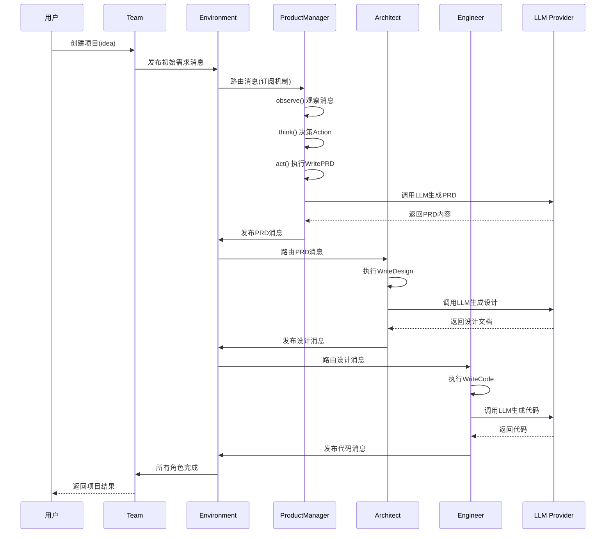
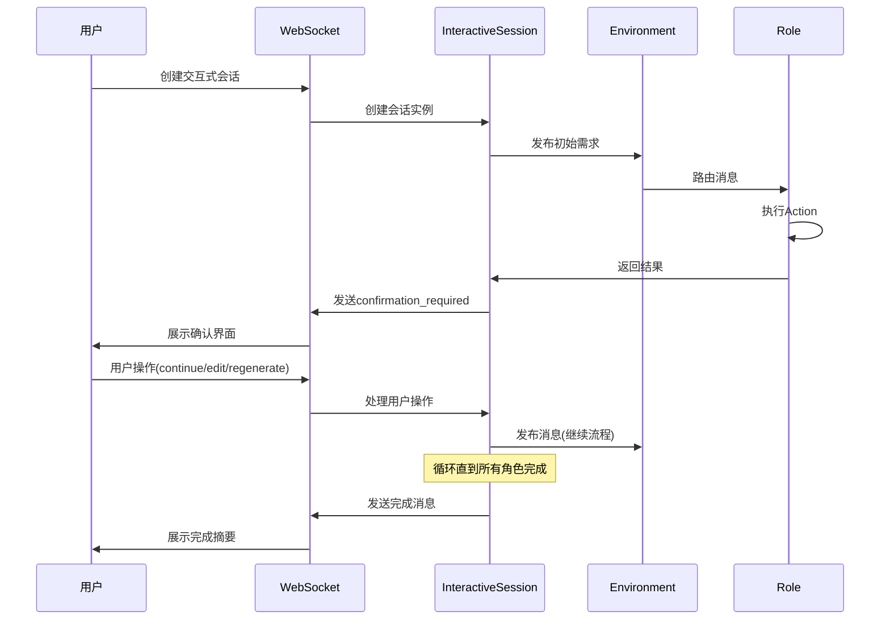

# Mind2Build 设计方案文档

**文档版本**: v1.2  
**创建日期**: 2025-12-25  
**最后更新**: 2026-01-26（拆分QAEngineer和AutomationEngineer的工作流Actions）  
**项目名称**: Mind2Build (即思即成)

---

## 目录

1. [系统概述](#1-系统概述)
2. [架构设计](#2-架构设计)
3. [核心模块设计](#3-核心模块设计)
4. [技术选型](#4-技术选型)
5. [数据模型设计](#5-数据模型设计)
6. [接口设计](#6-接口设计)
7. [安全设计](#7-安全设计)
8. [性能设计](#8-性能设计)

---

## 1. 系统概述

### 1.1 项目定位

Mind2Build 是一个多代理（Multi-Agent）AI协作框架，通过模拟软件公司团队协作的方式，实现从用户需求到完整软件项目的自动化生成。

**核心理念**: `Code = SOP(Team)` - 通过标准化操作流程和团队协作实现软件开发自动化。

### 1.2 系统特点

- **多角色协作**: 模拟真实软件公司的角色分工（产品经理、架构师、工程师等）
- **消息驱动**: 基于发布/订阅的消息系统实现角色间通信
- **交互式确认**: 支持在每个SOP节点进行人工确认和修改
- **多LLM支持**: 抽象层设计支持多种LLM提供商
- **全栈架构**: Node.js/TypeScript后端 + Vue3前端 + PostgreSQL数据库

### 1.3 系统边界

**包含的功能**:
- ✅ 多角色代理系统
- ✅ 标准操作流程（SOP）
- ✅ 消息路由和通信
- ✅ 交互式确认模式（CLI + Web）
- ✅ 项目生成和管理
- ✅ 成本追踪和预算控制
- ✅ Web界面和WebSocket实时通信

**不包含的功能**:
- ❌ 分布式部署（当前为单机部署）
- ❌ 多租户和权限管理
- ❌ 插件市场和社区生态
- ❌ 持续学习和模型微调

---

## 2. 架构设计

### 2.1 整体架构

系统采用**分层架构**设计，共分为六层：

```
┌─────────────────────────────────────────┐
│        用户接口层 (Interface Layer)       │  
│  CLI命令行 | Web UI | REST API | WebSocket
├─────────────────────────────────────────┤
│        编排层 (Orchestration Layer)      │  
│  Team团队管理 | Environment环境 | InteractiveSession会话
├─────────────────────────────────────────┤
│        角色层 (Role Layer)               │  
│  Role基类 | ProductManager | Architect | Engineer | QA
├─────────────────────────────────────────┤
│        行动层 (Action Layer)             │  
│  BaseAction | WritePRD | WriteDesign | WriteCode
├─────────────────────────────────────────┤
│      基础设施层 (Infrastructure Layer)   │  
│  Message消息 | Memory记忆 | Context上下文 | CostManager成本
├─────────────────────────────────────────┤
│       提供商层 (Provider Layer)          │  
│  BaseLLM | OpenAI | Anthropic | ZhipuAI | Tools工具
└─────────────────────────────────────────┘
```

### 2.2 架构特点

#### 2.2.1 分层职责

| 层次 | 职责 | 关键组件 |
|------|------|---------|
| **用户接口层** | 提供多种交互方式 | CLI、Web UI、REST API、WebSocket |
| **编排层** | 管理角色生命周期和协作流程 | Team、Environment、InteractiveSession |
| **角色层** | 定义AI角色的行为和职责 | Role、ProductManager、Architect、Engineer |
| **行动层** | 实现具体的任务执行逻辑 | BaseAction、WritePRD、WriteCode |
| **基础设施层** | 提供核心支撑服务 | Message、Memory、Context、CostManager |
| **提供商层** | 对接外部服务 | BaseLLM、各种LLM实现、Tools |

#### 2.2.2 设计模式应用

- **观察者模式**: 消息发布/订阅机制
- **策略模式**: 多种React模式（REACT、BY_ORDER、PLAN_AND_ACT）
- **命令模式**: Action执行机制
- **工厂模式**: LLM提供商创建
- **模板方法模式**: Role生命周期管理

### 2.3 核心交互流程

#### 2.3.1 标准模式（自动执行）



#### 2.3.2 交互模式（人工确认）



---

## 3. 核心模块设计

### 3.1 编排层 (Orchestration Layer)

#### 3.1.1 Team (团队)

**职责**: 高层封装，提供简单的API接口

**核心方法**:
```typescript
class Team {
  // 雇佣角色
  hire(roles: Role[]): void
  
  // 设置预算
  invest(amount: number): void
  
  // 运行团队
  async run(idea: string, nRound?: number): Promise<Result>
  
  // 获取环境
  getEnvironment(): Environment
}
```

**设计要点**:
- 封装Environment的复杂性
- 提供统一的成本管理接口
- 支持序列化和恢复

#### 3.1.2 Environment (环境)

**职责**: 管理角色容器和消息路由

**核心方法**:
```typescript
class Environment {
  // 添加角色
  addRoles(roles: Role[]): void
  
  // 发布消息并路由
  publishMessage(message: Message): boolean
  
  // 运行所有活跃角色
  async run(): Promise<void>
  
  // 运行指定轮数
  async runForRounds(rounds: number): Promise<void>
}
```

**消息路由机制**:
1. **广播模式**: `sendTo = {MESSAGE_ROUTE_TO_ALL}`
2. **定向模式**: `sendTo = {"RoleName"}`
3. **订阅模式**: `role.watch([ActionType])`

**执行模式**:
- **并行模式**: 所有活跃角色同时执行（非交互模式）
- **串行模式**: 逐个执行并等待确认（交互模式）

#### 3.1.3 InteractiveSession (交互式会话)

**职责**: 管理Web交互式会话的生命周期

**核心方法**:
```typescript
class InteractiveSession {
  // 启动会话
  async start(): Promise<void>
  
  // 等待用户确认
  private async waitForUserConfirmation(roleInfo): Promise<UserActionMessage>
  
  // 处理用户操作
  handleUserAction(message: UserActionMessage): void
  
  // 发送WebSocket消息
  private sendMessage(type: string, data: any): void
}
```

**状态管理**:
- `isPaused`: 是否暂停等待用户确认
- `userActionResolver`: Promise解析器，等待用户操作
- `lastActivity`: 最后活动时间（用于超时检测）

### 3.2 角色层 (Role Layer)

#### 3.2.1 Role (角色)

**职责**: 实现角色的完整生命周期

**核心属性**:
```typescript
class Role extends BaseRole {
  name: string              // 角色名称
  profile: string           // 角色类型
  goal: string              // 角色目标
  constraints: string       // 约束条件
  actions: BaseAction[]     // 可执行的行动列表
  rc: RoleContext           // 运行时上下文
  context: Context          // 全局上下文
}
```

**生命周期方法**:
```typescript
// 观察: 获取新消息
async observe(): Promise<number>

// 思考: 决定下一步行动
async think(): Promise<boolean>

// 行动: 执行当前Action
async act(): Promise<Message | null>

// 运行: 主循环 observe -> think -> act
async run(): Promise<Message | null>
```

**React模式**:
1. **REACT模式**: LLM动态选择Action（当前简化实现）
2. **BY_ORDER模式**: 按actions列表顺序执行
3. **PLAN_AND_ACT模式**: 先规划后执行（待实现）

#### 3.2.2 RoleContext (角色上下文)

**职责**: 管理角色的运行时状态

**核心属性**:
```typescript
class RoleContext {
  state: number = -1              // 当前状态索引
  todo: BaseAction | null = null  // 下一个要执行的Action
  watch: Set<string> = new Set()  // 订阅的Action类型
  news: Message[] = []            // 新消息队列
  memory: Memory                  // 记忆系统
  msgBuffer: MessageBuffer        // 消息缓冲区
  reactMode: RoleReactMode        // React模式
  env?: Environment               // 环境引用
}
```

### 3.3 行动层 (Action Layer)

#### 3.3.1 BaseAction (行动基类)

**职责**: 定义所有Action的统一接口

**核心方法**:
```typescript
abstract class BaseAction {
  name: string
  description?: string
  protected llm?: BaseLLM
  
  // 执行Action（子类必须实现）
  abstract run(...args: any[]): Promise<IActionOutput>
  
  // 设置LLM实例
  setLLM(llm: BaseLLM): void
  
  // 调用LLM的辅助方法
  protected async aask(prompt: string, systemMsgs?: string[]): Promise<string>
}
```

#### 3.3.2 核心Actions

**WritePRD** (编写产品需求文档):
- 输入: 用户需求或需求说明文档
- 输出: PRD Markdown文档
- 使用角色: ProductManager

**WriteDesign** (编写系统设计):
- 输入: PRD文档
- 输出: 系统设计文档
- 使用角色: Architect

**WriteCode** (编写代码):
- 输入: 设计文档
- 输出: 源代码文件列表
- 使用角色: Engineer

**WriteTest** (编写测试):
- 输入: 代码和PRD文档
- 输出: 测试代码
- 使用角色: QAEngineer

**QA工作流Actions**（QAEngineer - 3步测试设计流程）:
- WriteTestPlan: 制定测试计划
- WriteTest: 编写测试用例
- TestCaseReview: 用例评审与补充

**自动化测试Actions**（AutomationEngineer - 4步自动化测试流程）:
- AutomationPlanning: 自动化测试规划
- AutomationExecution: 自动化测试执行
- CoverageQualityCheck: 覆盖率与质量检查
- QAConclusion: QA结论输出

### 3.4 基础设施层 (Infrastructure Layer)

#### 3.4.1 Message (消息)

**职责**: 角色间通信的载体

**核心属性**:
```typescript
class Message {
  id: string                    // 唯一标识
  content: string               // 自然语言内容
  instructContent?: any         // 结构化内容
  role: string                  // 角色类型
  causeBy: string               // 触发的Action类名
  sentFrom: string             // 发送者
  sendTo: Set<string>           // 接收者集合
  metadata?: Record<string, any> // 元数据
  timestamp: Date               // 时间戳
}
```

**消息路由规则**:
- `MESSAGE_ROUTE_TO_ALL`: 广播给所有角色
- `MESSAGE_ROUTE_TO_SELF`: 发送给自己
- 角色名: 定向发送给指定角色
- Action类型: 通过watch机制订阅

#### 3.4.2 Memory (记忆)

**职责**: 为角色提供上下文记忆能力

**记忆类型**:
- **短期记忆**: MessageBuffer，保留最近N条消息
- **长期记忆**: 持久化存储（当前未实现）
- **工作记忆**: 当前任务相关的临时信息

**核心方法**:
```typescript
class Memory {
  // 添加消息
  add(message: Message): void
  
  // 按角色获取消息
  getByRole(role: string): Message[]
  
  // 按Action类型获取消息
  getByAction(actionType: string): Message[]
  
  // 获取最近N条消息
  getRecent(k: number): Message[]
}
```

#### 3.4.3 Context (上下文)

**职责**: 管理全局配置和共享资源

**核心属性**:
```typescript
class Context {
  config: Config                // 全局配置
  costManager: CostManager     // 成本管理
  llm: BaseLLM                  // LLM实例
  projectPath?: string          // 项目路径
}
```

#### 3.4.4 CostManager (成本管理)

**职责**: 追踪和控制LLM调用成本

**核心属性**:
```typescript
class CostManager {
  totalPromptTokens: number = 0      // 总输入Token数
  totalCompletionTokens: number = 0  // 总输出Token数
  totalCost: number = 0               // 总成本
  maxBudget: number = 10.0           // 最大预算
  
  // 更新成本
  updateCost(usage: TokenUsage): void
  
  // 获取报告
  getReport(): CostReport
}
```

### 3.5 提供商层 (Provider Layer)

#### 3.5.1 BaseLLM (LLM抽象层)

**职责**: 定义统一的LLM调用接口

**核心方法**:
```typescript
abstract class BaseLLM {
  // 异步提问
  abstract async aask(prompt: string, systemMsgs?: string[]): Promise<string>
  
  // 异步补全
  abstract async acompletion(messages: Message[]): Promise<CompletionResult>
  
  // 获取成本
  abstract getCost(usage: TokenUsage): number
}
```

#### 3.5.2 LLM实现

**支持的提供商**:
- OpenAI (GPT-4, GPT-3.5) - 通过 OpenAICompatibleLLM
- ZhipuAI (GLM-4) - 通过 OpenAICompatibleLLM
- 火山引擎 Ark (豆包) - 通过 OpenAICompatibleLLM
- DeepSeek - 通过 OpenAICompatibleLLM
- Cursor Agent - 独立 CursorLLM 实现
- 其他国内厂商（百度、阿里、讯飞等）- 可通过 OpenAICompatibleLLM 配置支持

**统一接口设计**:
- 所有LLM实现继承BaseLLM
- 大多数提供商通过统一的 OpenAICompatibleLLM 类实现
- Cursor Agent使用独立的 CursorLLM 实现（非OpenAI兼容API）
- 统一的错误处理和重试机制
- 统一的成本计算接口

---

## 4. 技术选型

### 4.1 后端技术栈

| 类别 | 技术选型 | 版本 | 选型理由 |
|------|---------|------|---------|
| **运行时** | Node.js | v18+ | 异步支持良好，生态成熟 |
| **语言** | TypeScript | v5.3+ | 类型安全，开发效率高 |
| **框架** | Express | v4.18+ | 轻量高效，中间件丰富 |
| **数据库** | PostgreSQL | v14+ | 开源稳定，功能强大 |
| **ORM** | 原生SQL | - | 简单直接，性能可控 |
| **WebSocket** | ws | v8.18+ | 标准WebSocket实现 |
| **日志** | Winston + Pino | latest | 功能完善，性能优秀 |
| **验证** | Zod | v3.22+ | 类型安全的运行时验证 |

### 4.2 前端技术栈

| 类别 | 技术选型 | 版本 | 选型理由 |
|------|---------|------|---------|
| **框架** | Vue 3 | v3.4+ | 渐进式，易学易用 |
| **构建工具** | Vite | v5.0+ | 快速冷启动，HMR性能卓越 |
| **状态管理** | Pinia | v2.1+ | Vue官方推荐，简单易用 |
| **路由** | Vue Router | v4.2+ | Vue官方路由 |
| **UI组件** | Element Plus | v2.13+ | 功能完善，文档清晰 |
| **HTTP客户端** | Axios | v1.6+ | 功能丰富，拦截器支持 |
| **Markdown渲染** | markdown-it | v14.1+ | 功能强大，插件丰富 |

### 4.3 开发工具

| 工具 | 用途 | 版本 |
|------|------|------|
| **pnpm** | 包管理 | v8+ |
| **TypeScript** | 类型检查 | v5.3+ |
| **ESLint** | 代码检查 | v8.56+ |
| **Prettier** | 代码格式化 | v3.1+ |
| **Jest** | 单元测试 | v29.7+ |

### 4.4 部署工具

| 工具 | 用途 | 说明 |
|------|------|------|
| **Docker** | 容器化 | 可选，用于生产部署 |
| **PM2** | 进程管理 | 可选，用于Node.js进程管理 |

---

## 5. 数据模型设计

### 5.1 数据库设计

#### 5.1.1 核心表结构

**projects** (项目表):
```sql
CREATE TABLE projects (
  id UUID PRIMARY KEY DEFAULT gen_random_uuid(),
  name VARCHAR(255) NOT NULL,
  description TEXT,
  idea TEXT NOT NULL,
  status VARCHAR(50) NOT NULL, -- pending, running, completed, failed
  mode VARCHAR(20) NOT NULL,  -- auto, interactive
  investment DECIMAL(10, 2),
  total_cost DECIMAL(10, 2) DEFAULT 0,
  total_tokens INTEGER DEFAULT 0,
  created_at TIMESTAMP DEFAULT NOW(),
  updated_at TIMESTAMP DEFAULT NOW(),
  completed_at TIMESTAMP
);
```

**documents** (文档表):
```sql
CREATE TABLE documents (
  id UUID PRIMARY KEY DEFAULT gen_random_uuid(),
  project_id UUID REFERENCES projects(id),
  type VARCHAR(50) NOT NULL, -- prd, design, code, test
  role VARCHAR(100) NOT NULL,
  action VARCHAR(100) NOT NULL,
  content TEXT NOT NULL,
  file_path VARCHAR(500),
  created_at TIMESTAMP DEFAULT NOW()
);
```

**messages** (消息表):
```sql
CREATE TABLE messages (
  id UUID PRIMARY KEY DEFAULT gen_random_uuid(),
  project_id UUID REFERENCES projects(id),
  role VARCHAR(100),
  cause_by VARCHAR(100),
  sent_from VARCHAR(100),
  content TEXT,
  instruct_content JSONB,
  metadata JSONB,
  created_at TIMESTAMP DEFAULT NOW()
);
```

**interactive_sessions** (交互式会话表):
```sql
CREATE TABLE interactive_sessions (
  id UUID PRIMARY KEY DEFAULT gen_random_uuid(),
  project_id UUID REFERENCES projects(id),
  status VARCHAR(50) NOT NULL, -- active, paused, completed
  current_role VARCHAR(100),
  current_action VARCHAR(100),
  interaction_history JSONB,
  created_at TIMESTAMP DEFAULT NOW(),
  updated_at TIMESTAMP DEFAULT NOW()
);
```

### 5.2 内存数据结构

#### 5.2.1 Message (消息)

```typescript
interface Message {
  id: string                    // UUID
  content: string               // 自然语言内容
  instructContent?: any         // 结构化内容（JSON）
  role: 'system' | 'user' | 'assistant'
  causeBy: string               // Action类名
  sentFrom: string             // 发送者标识
  sendTo: Set<string>           // 接收者集合
  metadata?: Record<string, any>
  timestamp: Date
}
```

#### 5.2.2 RoleContext (角色上下文)

```typescript
interface RoleContext {
  state: number                 // 当前状态索引
  todo: BaseAction | null       // 待执行的Action
  watch: Set<string>            // 订阅的Action类型
  news: Message[]                // 新消息队列
  memory: Memory                // 记忆系统
  msgBuffer: MessageBuffer      // 消息缓冲区
  reactMode: RoleReactMode      // React模式
  env?: Environment             // 环境引用
}
```

---

## 6. 接口设计

### 6.1 REST API

#### 6.1.1 项目相关接口

**创建项目**:
```http
POST /api/projects
Content-Type: application/json

{
  "name": "项目名称",
  "idea": "项目需求描述",
  "mode": "auto" | "interactive",
  "investment": 10.0
}

Response: 201 Created
{
  "id": "uuid",
  "name": "项目名称",
  "status": "pending",
  ...
}
```

**获取项目列表**:
```http
GET /api/projects?page=1&limit=10

Response: 200 OK
{
  "data": [...],
  "total": 100,
  "page": 1,
  "limit": 10
}
```

**获取项目详情**:
```http
GET /api/projects/:id

Response: 200 OK
{
  "id": "uuid",
  "name": "项目名称",
  "status": "completed",
  "documents": [...],
  "messages": [...],
  ...
}
```

#### 6.1.2 交互式会话接口

**创建交互式会话**:
```http
POST /api/projects/interactive
Content-Type: application/json

{
  "idea": "项目需求",
  "investment": 10.0
}

Response: 201 Created
{
  "sessionId": "uuid",
  "projectId": "uuid",
  "wsUrl": "ws://localhost:3000/api/interactive/:sessionId"
}
```

### 6.2 WebSocket API

#### 6.2.1 连接

```typescript
// 连接WebSocket
const ws = new WebSocket('ws://localhost:3000/api/interactive/:sessionId');

// 监听消息
ws.onmessage = (event) => {
  const message = JSON.parse(event.data);
  switch (message.type) {
    case 'progress':
      // 进度更新
      break;
    case 'confirmation_required':
      // 需要用户确认
      break;
    case 'completed':
      // 完成
      break;
    case 'error':
      // 错误
      break;
  }
};
```

#### 6.2.2 消息格式

**服务端 -> 客户端**:
```typescript
// 进度更新
{
  type: 'progress',
  data: {
    message: string,
    currentRound: number,
    totalCost: number
  }
}

// 需要确认
{
  type: 'confirmation_required',
  data: {
    role: string,
    action: string,
    content: string,
    outputFiles?: Array<{path: string, content: string}>
  }
}

// 完成
{
  type: 'completed',
  data: {
    projectId: string,
    summary: {...}
  }
}
```

**客户端 -> 服务端**:
```typescript
// 用户操作
{
  action: 'continue' | 'edit' | 'regenerate' | 'skip' | 'quit',
  modifiedContent?: string  // 编辑后的内容
}
```

---

## 7. 安全设计

### 7.1 API Key管理

**策略**:
- API Key存储在环境变量中
- 配置文件不提交到版本控制
- 日志中不输出完整API Key（只显示前后4位）

**实现**:
```typescript
// 从环境变量读取
const apiKey = process.env.OPENAI_API_KEY;
if (!apiKey) {
  throw new Error('API Key not found');
}

// 日志脱敏
function safeLog(apiKey: string): string {
  if (apiKey.length > 8) {
    return `${apiKey.slice(0, 4)}****${apiKey.slice(-4)}`;
  }
  return '****';
}
```

### 7.2 输入验证

**策略**:
- 使用Zod进行运行时验证
- 限制输入长度和格式
- 防止SQL注入和XSS攻击

**实现**:
```typescript
import { z } from 'zod';

const CreateProjectSchema = z.object({
  name: z.string().min(1).max(255),
  idea: z.string().min(10).max(10000),
  mode: z.enum(['auto', 'interactive']),
  investment: z.number().min(0).max(1000)
});
```

### 7.3 WebSocket安全

**策略**:
- 验证连接路径格式
- 会话ID验证
- 超时自动断开

**实现**:
```typescript
const wss = new WebSocketServer({
  verifyClient: (info) => {
    const path = info.req.url || '';
    // 只接受 /api/interactive/:sessionId 格式的路径
    return path.startsWith('/api/interactive/') && 
           path.split('/').length >= 4;
  }
});
```

---

## 8. 性能设计

### 8.1 并发处理

**策略**:
- 非交互模式：角色并行执行
- 交互模式：角色串行执行（需要用户确认）
- 使用Promise.allSettled处理并发

**实现**:
```typescript
// 并行执行
private async runRolesInParallel(roles: Role[]): Promise<void> {
  const results = await Promise.allSettled(
    roles.map(role => role.run())
  );
  // 处理结果...
}

// 串行执行
private async runRolesSequentially(roles: Role[]): Promise<void> {
  for (const role of roles) {
    await role.run();
    // 等待用户确认...
  }
}
```

### 8.2 消息路由优化

**策略**:
- 使用Set数据结构快速查找
- 消息路由缓存（可选）
- 批量处理消息

**实现**:
```typescript
// 快速判断消息是否应该路由给角色
private isMessageFor(message: Message, role: Role): boolean {
  // 广播消息
  if (message.sendTo.has(MESSAGE_ROUTE_TO_ALL)) {
    return true;
  }
  // 订阅机制
  if (role.rc.watch.has(message.causeBy)) {
    return true;
  }
  // 定向发送
  return hasIntersection(message.sendTo, role.getAddresses());
}
```

### 8.3 内存管理

**策略**:
- 限制消息历史数量
- 定期清理旧消息
- 使用流式处理大文件

**实现**:
```typescript
// 限制消息缓冲区大小
class MessageBuffer {
  private buffer: Message[] = [];
  private maxSize: number = 100;
  
  add(message: Message): void {
    this.buffer.push(message);
    if (this.buffer.length > this.maxSize) {
      this.buffer.shift(); // 移除最旧的消息
    }
  }
}
```

### 8.4 LLM调用优化

**策略**:
- 请求超时设置
- 自动重试机制
- Token使用优化

**实现**:
```typescript
// 带超时的LLM调用
async aask(prompt: string, timeout: number = 60000): Promise<string> {
  return Promise.race([
    this.llm.aask(prompt),
    new Promise((_, reject) => 
      setTimeout(() => reject(new Error('Timeout')), timeout)
    )
  ]);
}
```

---

## 9. 扩展性设计

### 9.1 自定义角色

**扩展方式**:
```typescript
class CustomRole extends Role {
  constructor(context: Context) {
    super({
      name: 'CustomRole',
      profile: 'Custom Profile',
      goal: 'Custom Goal',
      constraints: 'Custom Constraints'
    }, context);
    
    // 设置Actions
    this.setActions([CustomAction1, CustomAction2]);
    
    // 订阅消息
    this.watch(['SomeAction']);
  }
}
```

### 9.2 自定义Action

**扩展方式**:
```typescript
class CustomAction extends BaseAction {
  name = 'CustomAction';
  description = 'Custom action description';
  
  async run(input: string): Promise<IActionOutput> {
    // 实现Action逻辑
    const result = await this.aask(`Process: ${input}`);
    return {
      content: result,
      data: { /* 结构化数据 */ }
    };
  }
}
```

### 9.3 自定义LLM提供商

**扩展方式**:
```typescript
class CustomLLM extends BaseLLM {
  async aask(prompt: string, systemMsgs?: string[]): Promise<string> {
    // 实现LLM调用逻辑
    const response = await customApiCall(prompt);
    return response.text;
  }
  
  async acompletion(messages: Message[]): Promise<CompletionResult> {
    // 实现补全逻辑
  }
  
  getCost(usage: TokenUsage): number {
    // 实现成本计算
  }
}
```

---

## 10. 总结

### 10.1 设计亮点

1. **清晰的分层架构**: 职责明确，易于维护和扩展
2. **灵活的消息路由**: 支持广播、定向、订阅三种模式
3. **交互式确认**: 支持CLI和Web两种交互方式
4. **LLM抽象层**: 支持多种LLM提供商，易于切换
5. **成本控制**: 完善的成本追踪和预算管理

### 10.2 技术优势

- **TypeScript**: 类型安全，减少运行时错误
- **异步架构**: 高效的并发处理能力
- **模块化设计**: 易于测试和维护
- **WebSocket实时通信**: 良好的用户体验

### 10.3 未来扩展方向

- 分布式部署支持
- 更多LLM提供商集成
- 插件系统
- 持续学习和优化
- 多模态支持

---

**文档维护**: 本文档随系统演进持续更新  
**反馈渠道**: GitHub Issues / 项目文档

**更新记录**:
- 2026-01-21: 更新LLM提供商架构说明（统一OpenAICompatibleLLM、添加DeepSeek），更新QA工作流Actions

