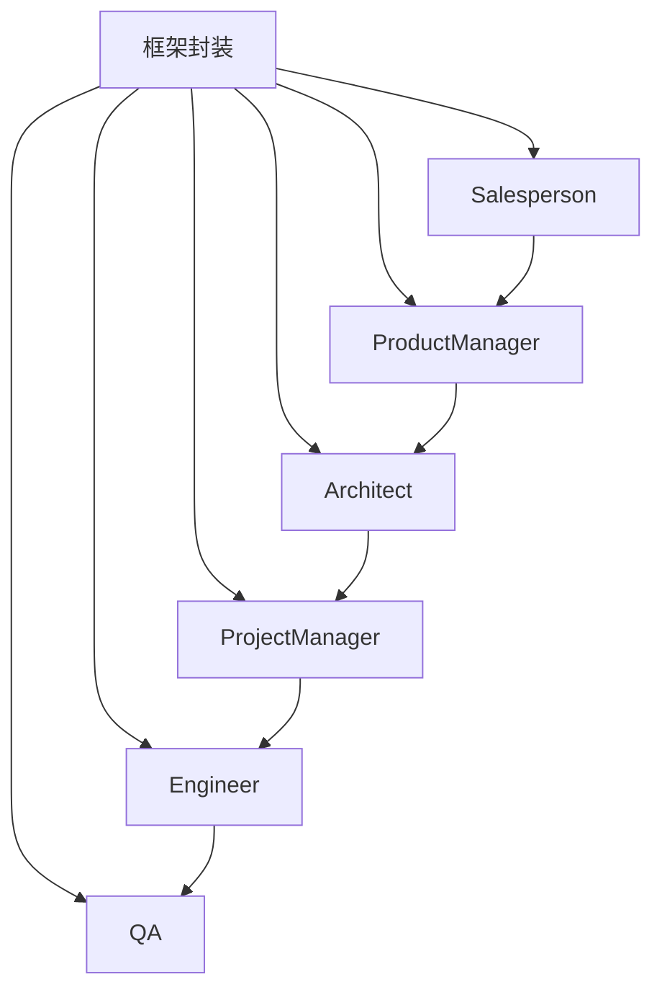
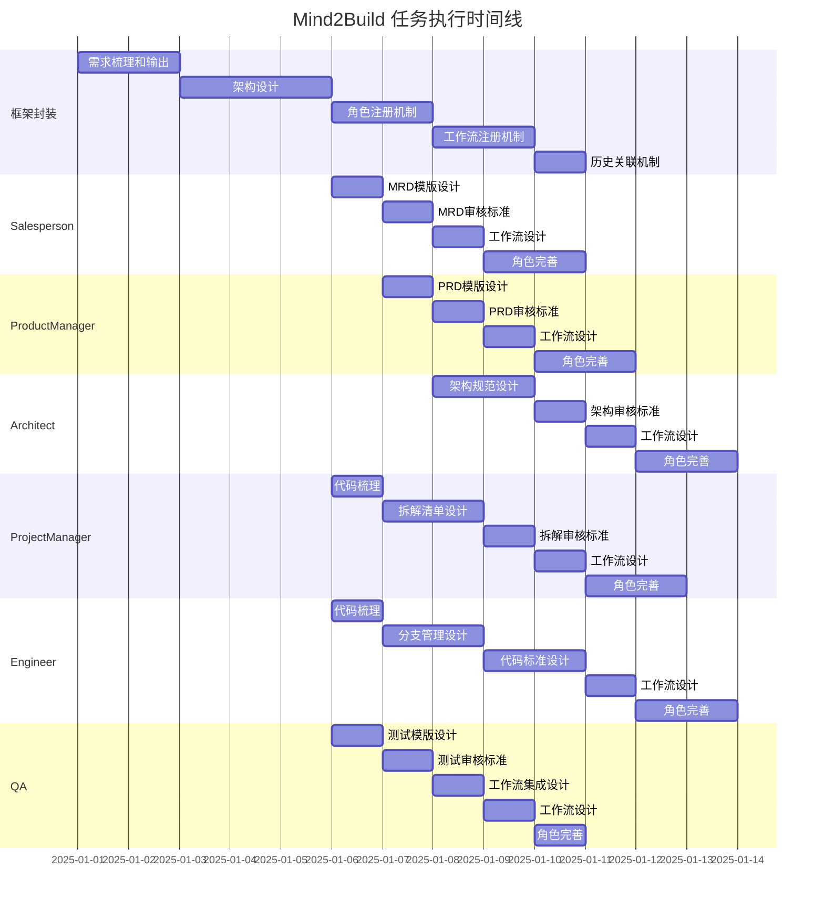

# Mind2Build 详细任务清单与执行明细

**文档版本**: v1.2  
**创建日期**: 2025-12-25  
**最后更新**: 2026-01-26（拆分QAEngineer和AutomationEngineer的工作流）  
**项目名称**: Mind2Build (即思即成)

---

## 目录

1. [任务总览](#1-任务总览)
2. [框架封装任务](#2-框架封装任务)
3. [角色定义任务](#3-角色定义任务)
4. [任务执行计划](#4-任务执行计划)
5. [验收标准](#5-验收标准)

---

## 1. 任务总览

### 1.1 任务分类

| 任务类别 | 负责人 | 优先级 | 预计工时 |
|---------|--------|--------|---------|
| **框架封装** | @刘卿 | P0 | 10天 |
| **Salesperson (MRD)** | @赵逸君 @吕展斌 | P0 | 5天 |
| **ProductManager (PRD)** | @付智斐 @赵逸君 | P0 | 5天 |
| **Architect (系统架构)** | @莫双飞 @付智斐 | P0 | 5天 |
| **ProjectManager (任务拆分)** | @杨冬 | P0 | 7天 |
| **Engineer (coding)** | @陈剑枫 @莫双飞 | P0 | 7天 |
| **QA (自动化测试)** | @邓阳武 | P0 | 5天 |

### 1.2 任务依赖关系



---

## 2. 框架封装任务

**负责人**: @刘卿  
**优先级**: P0  
**预计工时**: 10天

### 2.1 任务1: 重新梳理需求并完成需求输出

**任务ID**: FRAMEWORK-001  
**状态**: 🔴 待开始  
**预计工时**: 2天

#### 任务描述
基于现有文档和代码实现，重新梳理框架的核心需求，明确框架的定位、边界和核心能力。

#### 具体工作项

1. **需求调研与分析** (4小时)
   - [ ] 分析现有文档（PRD、架构文档、角色设计文档）
   - [ ] 分析现有代码实现（角色系统、工作流系统）
   - [ ] 识别需求缺口和待完善点
   - [ ] 整理需求清单

2. **需求文档编写** (8小时)
   - [ ] 编写框架需求文档（FRD - Framework Requirements Document）
   - [ ] 明确框架的核心能力边界
   - [ ] 定义框架扩展点和接口规范
   - [ ] 描述历史PRD/代码与需求的关联机制

3. **需求评审** (4小时)
   - [ ] 组织需求评审会议
   - [ ] 收集反馈并完善需求
   - [ ] 输出最终需求文档

#### 输出物
- `doc/28_框架需求文档_FRD.md`
- 需求清单（Excel/表格）
- 需求评审记录

#### 验收标准
- [ ] 需求文档完整，包含框架定位、核心能力、扩展机制
- [ ] 历史PRD/代码与需求的关联机制设计清晰
- [ ] 需求评审通过，团队认可

---

### 2.2 任务2: 重新梳理架构并完成技术架构设计

**任务ID**: FRAMEWORK-002  
**状态**: 🔴 待开始  
**预计工时**: 3天

#### 任务描述
基于重新梳理的需求，设计灵活可扩展的框架架构，支持角色和工作流的灵活接入。

#### 具体工作项

1. **架构分析** (8小时)
   - [ ] 分析现有架构（六层架构设计）
   - [ ] 识别架构痛点（角色接入、工作流配置）
   - [ ] 分析扩展性需求
   - [ ] 设计架构改进方案

2. **角色接入机制设计** (8小时)
   - [ ] 设计角色注册机制
   - [ ] 设计角色配置接口（标准模版、审核标准、工作流）
   - [ ] 设计角色发现和加载机制
   - [ ] 设计角色生命周期管理

3. **工作流接入机制设计** (8小时)
   - [ ] 设计工作流定义规范（YAML/JSON Schema）
   - [ ] 设计工作流注册和发现机制
   - [ ] 设计工作流执行引擎接口
   - [ ] 设计工作流与角色的绑定机制

4. **历史关联机制设计** (8小时)
   - [ ] 设计PRD/代码与需求的关联数据结构
   - [ ] 设计关联关系的存储和检索机制
   - [ ] 设计关联关系的可视化展示
   - [ ] 设计关联关系的版本管理

#### 输出物
- `doc/29_框架架构设计文档_FAD.md`
- 角色接入机制设计文档
- 工作流接入机制设计文档
- 历史关联机制设计文档
- 架构设计评审记录

#### 验收标准
- [ ] 架构设计文档完整，包含角色和工作流接入机制
- [ ] 角色接入机制支持灵活配置（标准模版、审核标准、工作流）
- [ ] 工作流接入机制支持动态加载和配置
- [ ] 历史关联机制设计清晰，支持追溯和检索
- [ ] 架构评审通过

---

### 2.3 任务3: 实现角色注册和发现机制

**任务ID**: FRAMEWORK-003  
**状态**: 🔴 待开始  
**预计工时**: 2天

#### 任务描述
实现角色注册和发现机制，支持动态加载和配置角色。

#### 具体工作项

1. **角色注册机制实现** (8小时)
   - [ ] 实现 `RoleRegistry` 类
   - [ ] 实现角色注册接口 `registerRole(roleClass, config)`
   - [ ] 实现角色配置验证
   - [ ] 实现角色元数据管理

2. **角色发现机制实现** (8小时)
   - [ ] 实现角色自动发现（扫描 `roles/` 目录）
   - [ ] 实现角色配置加载（从数据库/配置文件）
   - [ ] 实现角色实例化工厂
   - [ ] 实现角色依赖解析

3. **角色配置管理** (8小时)
   - [ ] 实现角色配置存储（数据库表设计）
   - [ ] 实现角色配置CRUD接口
   - [ ] 实现角色配置验证和迁移
   - [ ] 实现角色配置版本管理

#### 输出物
- `backend/src/core/registry/RoleRegistry.ts`
- `backend/src/core/registry/RoleDiscovery.ts`
- `backend/src/database/repositories/RoleConfigRepository.ts`
- 单元测试（覆盖率 > 80%）

#### 验收标准
- [ ] 角色注册机制正常工作，支持动态注册
- [ ] 角色发现机制正常工作，支持自动扫描和加载
- [ ] 角色配置管理完善，支持CRUD和版本管理
- [ ] 单元测试通过，覆盖率 > 80%

---

### 2.4 任务4: 实现工作流注册和配置机制

**任务ID**: FRAMEWORK-004  
**状态**: 🔴 待开始  
**预计工时**: 2天

#### 任务描述
实现工作流注册和配置机制，支持灵活定义和动态加载工作流。

#### 具体工作项

1. **工作流定义规范** (4小时)
   - [ ] 定义工作流YAML/JSON Schema
   - [ ] 定义工作流节点类型（角色节点、条件节点、并行节点）
   - [ ] 定义工作流执行规则
   - [ ] 编写工作流定义示例

2. **工作流注册机制实现** (8小时)
   - [ ] 实现 `WorkflowRegistry` 类
   - [ ] 实现工作流注册接口 `registerWorkflow(name, definition)`
   - [ ] 实现工作流定义验证
   - [ ] 实现工作流元数据管理

3. **工作流执行引擎** (8小时)
   - [ ] 实现工作流解析器（YAML/JSON → 执行图）
   - [ ] 实现工作流执行器（按定义执行节点）
   - [ ] 实现工作流状态管理
   - [ ] 实现工作流错误处理和重试

4. **工作流配置管理** (4小时)
   - [ ] 实现工作流配置存储（数据库表设计）
   - [ ] 实现工作流配置CRUD接口
   - [ ] 实现工作流配置版本管理

#### 输出物
- `backend/src/core/workflow/WorkflowRegistry.ts`
- `backend/src/core/workflow/WorkflowEngine.ts`
- `backend/src/core/workflow/WorkflowParser.ts`
- `backend/src/database/repositories/WorkflowConfigRepository.ts`
- 工作流定义Schema文档
- 单元测试（覆盖率 > 80%）

#### 验收标准
- [ ] 工作流定义规范清晰，支持复杂工作流定义
- [ ] 工作流注册机制正常工作，支持动态注册
- [ ] 工作流执行引擎正常工作，支持按定义执行
- [ ] 工作流配置管理完善，支持CRUD和版本管理
- [ ] 单元测试通过，覆盖率 > 80%

---

### 2.5 任务5: 实现历史关联机制

**任务ID**: FRAMEWORK-005  
**状态**: 🔴 待开始  
**预计工时**: 1天

#### 任务描述
实现PRD/代码与需求的关联机制，支持追溯和检索。

#### 具体工作项

1. **关联数据结构设计** (2小时)
   - [ ] 设计关联关系数据模型
   - [ ] 设计关联关系存储表结构
   - [ ] 设计关联关系索引策略

2. **关联关系建立** (4小时)
   - [ ] 实现需求到PRD的关联建立
   - [ ] 实现PRD到代码的关联建立
   - [ ] 实现代码到需求的追溯
   - [ ] 实现关联关系的自动更新

3. **关联关系检索** (4小时)
   - [ ] 实现按需求检索PRD/代码
   - [ ] 实现按PRD检索需求和代码
   - [ ] 实现按代码检索需求和PRD
   - [ ] 实现关联关系的可视化展示

4. **关联关系管理** (2小时)
   - [ ] 实现关联关系的CRUD接口
   - [ ] 实现关联关系的版本管理
   - [ ] 实现关联关系的批量操作

#### 输出物
- `backend/src/database/migrations/XXX_requirement_relations.sql`
- `backend/src/database/repositories/RequirementRelationRepository.ts`
- `backend/src/services/RequirementRelationService.ts`
- 关联关系API接口文档

#### 验收标准
- [ ] 关联关系数据结构设计合理，支持多对多关系
- [ ] 关联关系建立机制正常工作，支持自动和手动建立
- [ ] 关联关系检索功能完善，支持多种检索方式
- [ ] 关联关系管理接口完善，支持CRUD和版本管理

---

## 3. 角色定义任务

### 3.1 Salesperson (MRD) 角色定义

**负责人**: @赵逸君 @吕展斌  
**优先级**: P0  
**预计工时**: 5天

#### 任务3.1.1: MRD标准模版设计

**任务ID**: ROLE-SALES-001  
**状态**: 🔴 待开始  
**预计工时**: 1天

##### 任务描述
设计MRD（市场研究文档）的标准模版，确保MRD文档结构完整、内容规范。

##### 具体工作项

1. **模版结构设计** (4小时)
   - [ ] 分析现有MRD文档结构
   - [ ] 设计MRD标准模版结构（Markdown格式）
   - [ ] 定义各章节的必填项和选填项
   - [ ] 设计模版变量和占位符

2. **模版内容规范** (4小时)
   - [ ] 定义各章节的内容要求
   - [ ] 定义各章节的格式规范
   - [ ] 定义各章节的示例内容
   - [ ] 编写模版使用指南

3. **模版实现** (4小时)
   - [ ] 实现MRD模版文件（`templates/mrd_template.md`）
   - [ ] 实现模版解析和填充逻辑
   - [ ] 实现模版验证机制
   - [ ] 编写模版单元测试

##### 输出物
- `templates/mrd_template.md`
- `backend/src/prompts/mrd.ts` (更新)
- `doc/30_MRD标准模版文档.md`
- 模版使用指南

##### 验收标准
- [ ] MRD模版结构完整，包含所有必要章节
- [ ] 模版内容规范清晰，有明确的格式要求
- [ ] 模版解析和填充逻辑正常工作
- [ ] 模版验证机制完善，能检测必填项缺失

---

#### 任务3.1.2: MRD审核标准设计

**任务ID**: ROLE-SALES-002  
**状态**: 🔴 待开始  
**预计工时**: 1天

##### 任务描述
设计MRD文档的审核标准，确保MRD文档质量。

##### 具体工作项

1. **审核标准设计** (4小时)
   - [ ] 定义MRD文档质量维度（完整性、准确性、可行性等）
   - [ ] 设计审核检查清单（Checklist）
   - [ ] 定义审核评分标准（1-10分）
   - [ ] 设计审核报告格式

2. **审核逻辑实现** (4小时)
   - [ ] 实现 `MRDReview` Action（如未实现）
   - [ ] 实现审核标准检查逻辑
   - [ ] 实现审核报告生成逻辑
   - [ ] 实现审核结果反馈机制

3. **审核提示词优化** (4小时)
   - [ ] 优化MRD审核的LLM提示词
   - [ ] 设计审核示例和最佳实践
   - [ ] 实现审核提示词模板
   - [ ] 测试审核效果

##### 输出物
- `backend/src/actions/MRDReview.ts` (更新/实现)
- `doc/31_MRD审核标准文档.md`
- 审核检查清单（Checklist）
- 审核提示词模板

##### 验收标准
- [ ] 审核标准清晰，覆盖所有质量维度
- [ ] 审核检查清单完整，可操作性强
- [ ] 审核逻辑正常工作，能生成准确的审核报告
- [ ] 审核提示词优化后，审核质量提升

---

#### 任务3.1.3: Salesperson工作流设计

**任务ID**: ROLE-SALES-003  
**状态**: 🔴 待开始  
**预计工时**: 1天

##### 任务描述
设计Salesperson角色的工作流，定义角色执行流程和Action序列。

##### 具体工作项

1. **工作流设计** (4小时)
   - [ ] 分析Salesperson角色的职责和输入输出
   - [ ] 设计工作流节点（监听User消息 → WriteMRD → MRDReview → ImproveDocument）
   - [ ] 定义工作流执行规则（顺序执行、条件分支）
   - [ ] 设计工作流错误处理和重试机制

2. **工作流配置实现** (4小时)
   - [ ] 实现工作流YAML配置（`workflows/salesperson.yaml`）
   - [ ] 实现工作流加载和解析
   - [ ] 实现工作流执行逻辑
   - [ ] 实现工作流状态管理

3. **工作流测试** (4小时)
   - [ ] 编写工作流单元测试
   - [ ] 编写工作流集成测试
   - [ ] 测试工作流错误处理
   - [ ] 测试工作流重试机制

##### 输出物
- `workflows/salesperson.yaml`
- `backend/src/roles/Salesperson.ts` (更新)
- `doc/32_Salesperson工作流设计文档.md`
- 工作流测试用例

##### 验收标准
- [ ] 工作流设计合理，符合Salesperson角色职责
- [ ] 工作流配置正确，能正常加载和执行
- [ ] 工作流错误处理和重试机制完善
- [ ] 工作流测试通过，覆盖率 > 80%

---

#### 任务3.1.4: Salesperson角色完善

**任务ID**: ROLE-SALES-004  
**状态**: 🔴 待开始  
**预计工时**: 2天

##### 任务描述
完善Salesperson角色的实现，集成标准模版、审核标准和工作流。

##### 具体工作项

1. **角色实现更新** (8小时)
   - [ ] 更新 `Salesperson` 类，集成工作流配置
   - [ ] 实现角色配置加载（从数据库/配置文件）
   - [ ] 实现角色Action序列配置
   - [ ] 实现角色监听机制配置

2. **模版和审核集成** (8小时)
   - [ ] 集成MRD标准模版到WriteMRD Action
   - [ ] 集成MRD审核标准到MRDReview Action
   - [ ] 实现模版和审核标准的动态加载
   - [ ] 实现模版和审核标准的版本管理

3. **测试和文档** (8小时)
   - [ ] 编写角色单元测试
   - [ ] 编写角色集成测试
   - [ ] 编写角色使用文档
   - [ ] 更新角色设计文档

##### 输出物
- `backend/src/roles/Salesperson.ts` (完善)
- `backend/src/actions/WriteMRD.ts` (更新)
- `backend/src/actions/MRDReview.ts` (更新)
- 角色测试用例（覆盖率 > 80%）
- 角色使用文档

##### 验收标准
- [ ] Salesperson角色实现完善，支持工作流配置
- [ ] 模版和审核标准集成正常，能动态加载
- [ ] 角色测试通过，覆盖率 > 80%
- [ ] 角色使用文档完整，易于理解

---

### 3.2 ProductManager (PRD) 角色定义

**负责人**: @付智斐 @赵逸君  
**优先级**: P0  
**预计工时**: 5天

#### 任务3.2.1: PRD标准模版设计

**任务ID**: ROLE-PM-001  
**状态**: 🔴 待开始  
**预计工时**: 1天

##### 任务描述
设计PRD（产品需求文档）的标准模版，确保PRD文档结构完整、内容规范。

##### 具体工作项

1. **模版结构设计** (4小时)
   - [ ] 分析现有PRD文档结构（参考 `doc/02_产品需求文档_PRD.md`）
   - [ ] 设计PRD标准模版结构（Markdown格式）
   - [ ] 定义各章节的必填项和选填项
   - [ ] 设计模版变量和占位符

2. **模版内容规范** (4小时)
   - [ ] 定义各章节的内容要求
   - [ ] 定义各章节的格式规范
   - [ ] 定义各章节的示例内容
   - [ ] 编写模版使用指南

3. **模版实现** (4小时)
   - [ ] 实现PRD模版文件（`templates/prd_template.md`）
   - [ ] 实现模版解析和填充逻辑
   - [ ] 实现模版验证机制
   - [ ] 编写模版单元测试

##### 输出物
- `templates/prd_template.md`
- `backend/src/prompts/prd.ts` (更新)
- `doc/33_PRD标准模版文档.md`
- 模版使用指南

##### 验收标准
- [ ] PRD模版结构完整，包含所有必要章节
- [ ] 模版内容规范清晰，有明确的格式要求
- [ ] 模版解析和填充逻辑正常工作
- [ ] 模版验证机制完善，能检测必填项缺失

---

#### 任务3.2.2: PRD审核标准设计

**任务ID**: ROLE-PM-002  
**状态**: 🔴 待开始  
**预计工时**: 1天

##### 任务描述
设计PRD文档的审核标准，确保PRD文档质量。

##### 具体工作项

1. **审核标准设计** (4小时)
   - [ ] 定义PRD文档质量维度（完整性、准确性、可执行性等）
   - [ ] 设计审核检查清单（Checklist）
   - [ ] 定义审核评分标准（1-10分）
   - [ ] 设计审核报告格式

2. **审核逻辑实现** (4小时)
   - [ ] 实现 `PRDReview` Action（如未实现）
   - [ ] 实现审核标准检查逻辑
   - [ ] 实现审核报告生成逻辑
   - [ ] 实现审核结果反馈机制

3. **审核提示词优化** (4小时)
   - [ ] 优化PRD审核的LLM提示词
   - [ ] 设计审核示例和最佳实践
   - [ ] 实现审核提示词模板
   - [ ] 测试审核效果

##### 输出物
- `backend/src/actions/PRDReview.ts` (更新/实现)
- `doc/34_PRD审核标准文档.md`
- 审核检查清单（Checklist）
- 审核提示词模板

##### 验收标准
- [ ] 审核标准清晰，覆盖所有质量维度
- [ ] 审核检查清单完整，可操作性强
- [ ] 审核逻辑正常工作，能生成准确的审核报告
- [ ] 审核提示词优化后，审核质量提升

---

#### 任务3.2.3: ProductManager工作流设计

**任务ID**: ROLE-PM-003  
**状态**: 🔴 待开始  
**预计工时**: 1天

##### 任务描述
设计ProductManager角色的工作流，定义角色执行流程和Action序列。

##### 具体工作项

1. **工作流设计** (4小时)
   - [ ] 分析ProductManager角色的职责和输入输出
   - [ ] 设计工作流节点（监听WriteMRD → WritePRD → PRDReview → ImproveDocument）
   - [ ] 定义工作流执行规则（顺序执行、条件分支）
   - [ ] 设计工作流错误处理和重试机制

2. **工作流配置实现** (4小时)
   - [ ] 实现工作流YAML配置（`workflows/product_manager.yaml`）
   - [ ] 实现工作流加载和解析
   - [ ] 实现工作流执行逻辑
   - [ ] 实现工作流状态管理

3. **工作流测试** (4小时)
   - [ ] 编写工作流单元测试
   - [ ] 编写工作流集成测试
   - [ ] 测试工作流错误处理
   - [ ] 测试工作流重试机制

##### 输出物
- `workflows/product_manager.yaml`
- `backend/src/roles/ProductManager.ts` (更新)
- `doc/35_ProductManager工作流设计文档.md`
- 工作流测试用例

##### 验收标准
- [ ] 工作流设计合理，符合ProductManager角色职责
- [ ] 工作流配置正确，能正常加载和执行
- [ ] 工作流错误处理和重试机制完善
- [ ] 工作流测试通过，覆盖率 > 80%

---

#### 任务3.2.4: ProductManager角色完善

**任务ID**: ROLE-PM-004  
**状态**: 🔴 待开始  
**预计工时**: 2天

##### 任务描述
完善ProductManager角色的实现，集成标准模版、审核标准和工作流。

##### 具体工作项

1. **角色实现更新** (8小时)
   - [ ] 更新 `ProductManager` 类，集成工作流配置
   - [ ] 实现角色配置加载（从数据库/配置文件）
   - [ ] 实现角色Action序列配置
   - [ ] 实现角色监听机制配置

2. **模版和审核集成** (8小时)
   - [ ] 集成PRD标准模版到WritePRD Action
   - [ ] 集成PRD审核标准到PRDReview Action
   - [ ] 实现模版和审核标准的动态加载
   - [ ] 实现模版和审核标准的版本管理

3. **测试和文档** (8小时)
   - [ ] 编写角色单元测试
   - [ ] 编写角色集成测试
   - [ ] 编写角色使用文档
   - [ ] 更新角色设计文档

##### 输出物
- `backend/src/roles/ProductManager.ts` (完善)
- `backend/src/actions/WritePRD.ts` (更新)
- `backend/src/actions/PRDReview.ts` (更新)
- 角色测试用例（覆盖率 > 80%）
- 角色使用文档

##### 验收标准
- [ ] ProductManager角色实现完善，支持工作流配置
- [ ] 模版和审核标准集成正常，能动态加载
- [ ] 角色测试通过，覆盖率 > 80%
- [ ] 角色使用文档完整，易于理解

---

### 3.3 Architect (系统架构) 角色定义

**负责人**: @莫双飞 @付智斐  
**优先级**: P0  
**预计工时**: 5天

#### 任务3.3.1: 技术架构规范输出

**任务ID**: ROLE-ARCH-001  
**状态**: 🔴 待开始  
**预计工时**: 1.5天

##### 任务描述
设计技术架构规范，定义架构文档的标准格式和内容要求。

##### 具体工作项

1. **架构规范设计** (6小时)
   - [ ] 分析现有架构文档（参考 `doc/04_系统架构文档_ARCHITECTURE.md`）
   - [ ] 设计架构文档标准模版（Markdown格式）
   - [ ] 定义各章节的必填项和选填项
   - [ ] 设计模版变量和占位符

2. **架构内容规范** (4小时)
   - [ ] 定义各章节的内容要求（架构概述、分层设计、核心模块等）
   - [ ] 定义各章节的格式规范（Mermaid图表、代码示例等）
   - [ ] 定义各章节的示例内容
   - [ ] 编写架构规范使用指南

3. **架构规范实现** (2小时)
   - [ ] 实现架构模版文件（`templates/architecture_template.md`）
   - [ ] 实现模版解析和填充逻辑
   - [ ] 实现模版验证机制

##### 输出物
- `templates/architecture_template.md`
- `backend/src/prompts/design.ts` (更新)
- `doc/36_技术架构规范文档.md`
- 架构规范使用指南

##### 验收标准
- [ ] 架构规范结构完整，包含所有必要章节
- [ ] 架构内容规范清晰，有明确的格式要求
- [ ] 架构模版解析和填充逻辑正常工作
- [ ] 架构模版验证机制完善

---

#### 任务3.3.2: 架构审核标准设计

**任务ID**: ROLE-ARCH-002  
**状态**: 🔴 待开始  
**预计工时**: 1天

##### 任务描述
设计架构文档的审核标准，确保架构文档质量。

##### 具体工作项

1. **审核标准设计** (4小时)
   - [ ] 定义架构文档质量维度（完整性、合理性、可实施性等）
   - [ ] 设计审核检查清单（Checklist）
   - [ ] 定义审核评分标准（1-10分）
   - [ ] 设计审核报告格式

2. **审核逻辑实现** (4小时)
   - [ ] 实现 `DesignReview` Action（如未实现）
   - [ ] 实现审核标准检查逻辑
   - [ ] 实现审核报告生成逻辑
   - [ ] 实现审核结果反馈机制

3. **审核提示词优化** (4小时)
   - [ ] 优化架构审核的LLM提示词
   - [ ] 设计审核示例和最佳实践
   - [ ] 实现审核提示词模板
   - [ ] 测试审核效果

##### 输出物
- `backend/src/actions/DesignReview.ts` (更新/实现)
- `doc/37_架构审核标准文档.md`
- 审核检查清单（Checklist）
- 审核提示词模板

##### 验收标准
- [ ] 审核标准清晰，覆盖所有质量维度
- [ ] 审核检查清单完整，可操作性强
- [ ] 审核逻辑正常工作，能生成准确的审核报告
- [ ] 审核提示词优化后，审核质量提升

---

#### 任务3.3.3: Architect工作流设计

**任务ID**: ROLE-ARCH-003  
**状态**: 🔴 待开始  
**预计工时**: 1天

##### 任务描述
设计Architect角色的工作流，定义角色执行流程和Action序列。

##### 具体工作项

1. **工作流设计** (4小时)
   - [ ] 分析Architect角色的职责和输入输出
   - [ ] 设计工作流节点（监听WritePRD → WriteDesign → DesignReview → ImproveDocument）
   - [ ] 定义工作流执行规则（顺序执行、条件分支）
   - [ ] 设计工作流错误处理和重试机制

2. **工作流配置实现** (4小时)
   - [ ] 实现工作流YAML配置（`workflows/architect.yaml`）
   - [ ] 实现工作流加载和解析
   - [ ] 实现工作流执行逻辑
   - [ ] 实现工作流状态管理

3. **工作流测试** (4小时)
   - [ ] 编写工作流单元测试
   - [ ] 编写工作流集成测试
   - [ ] 测试工作流错误处理
   - [ ] 测试工作流重试机制

##### 输出物
- `workflows/architect.yaml`
- `backend/src/roles/Architect.ts` (更新)
- `doc/38_Architect工作流设计文档.md`
- 工作流测试用例

##### 验收标准
- [ ] 工作流设计合理，符合Architect角色职责
- [ ] 工作流配置正确，能正常加载和执行
- [ ] 工作流错误处理和重试机制完善
- [ ] 工作流测试通过，覆盖率 > 80%

---

#### 任务3.3.4: Architect角色完善

**任务ID**: ROLE-ARCH-004  
**状态**: 🔴 待开始  
**预计工时**: 1.5天

##### 任务描述
完善Architect角色的实现，集成架构规范、审核标准和工作流。

##### 具体工作项

1. **角色实现更新** (6小时)
   - [ ] 更新 `Architect` 类，集成工作流配置
   - [ ] 实现角色配置加载（从数据库/配置文件）
   - [ ] 实现角色Action序列配置
   - [ ] 实现角色监听机制配置

2. **规范和审核集成** (6小时)
   - [ ] 集成架构规范到WriteDesign Action
   - [ ] 集成架构审核标准到DesignReview Action
   - [ ] 实现规范和审核标准的动态加载
   - [ ] 实现规范和审核标准的版本管理

3. **测试和文档** (6小时)
   - [ ] 编写角色单元测试
   - [ ] 编写角色集成测试
   - [ ] 编写角色使用文档
   - [ ] 更新角色设计文档

##### 输出物
- `backend/src/roles/Architect.ts` (完善)
- `backend/src/actions/WriteDesign.ts` (更新)
- `backend/src/actions/DesignReview.ts` (更新)
- 角色测试用例（覆盖率 > 80%）
- 角色使用文档

##### 验收标准
- [ ] Architect角色实现完善，支持工作流配置
- [ ] 架构规范和审核标准集成正常，能动态加载
- [ ] 角色测试通过，覆盖率 > 80%
- [ ] 角色使用文档完整，易于理解

---

### 3.4 ProjectManager (任务拆分) 角色定义

**负责人**: @杨冬  
**优先级**: P0  
**预计工时**: 7天

#### 任务3.4.1: 梳理代码并跑通项目

**任务ID**: ROLE-PMGR-001  
**状态**: 🔴 待开始  
**预计工时**: 1天

##### 任务描述
梳理ProjectManager相关代码，确保项目能正常运行。

##### 具体工作项

1. **代码梳理** (4小时)
   - [ ] 阅读 `backend/src/roles/ProjectManager.ts`
   - [ ] 阅读相关Actions（BreakdownTasks, WriteSubProjectDesign, SubProjectDesignReview）
   - [ ] 理解角色工作流程和依赖关系
   - [ ] 识别代码问题和改进点

2. **项目运行** (4小时)
   - [ ] 配置开发环境
   - [ ] 运行项目，验证基本功能
   - [ ] 修复发现的bug
   - [ ] 编写运行文档

##### 输出物
- 代码梳理文档
- 项目运行文档
- Bug修复记录

##### 验收标准
- [ ] 代码梳理完成，理解角色实现逻辑
- [ ] 项目能正常运行，基本功能正常
- [ ] 发现的bug已修复或记录

---

#### 任务3.4.2: 项目拆解清单设计

**任务ID**: ROLE-PMGR-002  
**状态**: 🔴 待开始  
**预计工时**: 2天

##### 任务描述
设计项目拆解清单的标准格式和内容要求，介入openSpec + sdd规范完善指南标准规范。

##### 具体工作项

1. **规范研究** (4小时)
   - [ ] 研究openSpec规范
   - [ ] 研究sdd规范
   - [ ] 研究完善指南标准规范
   - [ ] 整理规范要点

2. **拆解清单模版设计** (8小时)
   - [ ] 设计任务拆解清单标准模版（Markdown格式）
   - [ ] 定义各章节的必填项和选填项（任务列表、依赖关系、优先级、工时估算等）
   - [ ] 设计模版变量和占位符
   - [ ] 基于openSpec和sdd规范完善模版结构
   - [ ] 定义任务拆解的最小颗粒度原则（1-3天可完成）

3. **拆解清单内容规范** (4小时)
   - [ ] 定义各章节的内容要求
   - [ ] 定义各章节的格式规范
   - [ ] 定义各章节的示例内容
   - [ ] 编写拆解清单使用指南

##### 输出物
- `templates/task_breakdown_template.md`
- `backend/src/prompts/task.ts` (更新)
- `doc/39_项目拆解清单标准文档.md`
- 拆解清单使用指南

##### 验收标准
- [ ] 拆解清单模版结构完整，符合openSpec和sdd规范
- [ ] 模版内容规范清晰，有明确的格式要求
- [ ] 模版支持最小颗粒度原则
- [ ] 模版使用指南完整

---

#### 任务3.4.3: 项目拆解审核标准设计

**任务ID**: ROLE-PMGR-003  
**状态**: 🔴 待开始  
**预计工时**: 1天

##### 任务描述
设计项目拆解清单的审核标准，确保拆解清单质量。

##### 具体工作项

1. **审核标准设计** (4小时)
   - [ ] 定义拆解清单质量维度（完整性、合理性、可执行性等）
   - [ ] 设计审核检查清单（Checklist）
   - [ ] 定义审核评分标准（1-10分）
   - [ ] 设计审核报告格式

2. **审核逻辑实现** (4小时)
   - [ ] 检查 `BreakdownTasks` Action的实现
   - [ ] 实现审核标准检查逻辑
   - [ ] 实现审核报告生成逻辑
   - [ ] 实现审核结果反馈机制

3. **审核提示词优化** (4小时)
   - [ ] 优化任务拆解审核的LLM提示词
   - [ ] 设计审核示例和最佳实践
   - [ ] 实现审核提示词模板
   - [ ] 测试审核效果

##### 输出物
- `backend/src/actions/BreakdownTasks.ts` (更新)
- `doc/40_项目拆解审核标准文档.md`
- 审核检查清单（Checklist）
- 审核提示词模板

##### 验收标准
- [ ] 审核标准清晰，覆盖所有质量维度
- [ ] 审核检查清单完整，可操作性强
- [ ] 审核逻辑正常工作，能生成准确的审核报告
- [ ] 审核提示词优化后，审核质量提升

---

#### 任务3.4.4: ProjectManager工作流设计

**任务ID**: ROLE-PMGR-004  
**状态**: 🔴 待开始  
**预计工时**: 1天

##### 任务描述
设计ProjectManager角色的工作流，定义角色执行流程和Action序列。

##### 具体工作项

1. **工作流设计** (4小时)
   - [ ] 分析ProjectManager角色的职责和输入输出
   - [ ] 设计工作流节点（监听WritePRD和WriteDesign → BreakdownTasks → WriteSubProjectDesign → SubProjectDesignReview）
   - [ ] 定义工作流执行规则（顺序执行、条件分支、并行等待）
   - [ ] 设计工作流错误处理和重试机制

2. **工作流配置实现** (4小时)
   - [ ] 实现工作流YAML配置（`workflows/project_manager.yaml`）
   - [ ] 实现工作流加载和解析
   - [ ] 实现工作流执行逻辑
   - [ ] 实现工作流状态管理

3. **工作流测试** (4小时)
   - [ ] 编写工作流单元测试
   - [ ] 编写工作流集成测试
   - [ ] 测试工作流错误处理
   - [ ] 测试工作流重试机制

##### 输出物
- `workflows/project_manager.yaml`
- `backend/src/roles/ProjectManager.ts` (更新)
- `doc/41_ProjectManager工作流设计文档.md`
- 工作流测试用例

##### 验收标准
- [ ] 工作流设计合理，符合ProjectManager角色职责
- [ ] 工作流配置正确，能正常加载和执行
- [ ] 工作流错误处理和重试机制完善
- [ ] 工作流测试通过，覆盖率 > 80%

---

#### 任务3.4.5: ProjectManager角色完善

**任务ID**: ROLE-PMGR-005  
**状态**: 🔴 待开始  
**预计工时**: 2天

##### 任务描述
完善ProjectManager角色的实现，集成拆解清单模版、审核标准和工作流。

##### 具体工作项

1. **角色实现更新** (8小时)
   - [ ] 更新 `ProjectManager` 类，集成工作流配置
   - [ ] 实现角色配置加载（从数据库/配置文件）
   - [ ] 实现角色Action序列配置
   - [ ] 实现角色监听机制配置（监听WritePRD和WriteDesign）

2. **模版和审核集成** (8小时)
   - [ ] 集成拆解清单模版到BreakdownTasks Action
   - [ ] 集成拆解审核标准到审核逻辑
   - [ ] 实现模版和审核标准的动态加载
   - [ ] 实现模版和审核标准的版本管理

3. **测试和文档** (8小时)
   - [ ] 编写角色单元测试
   - [ ] 编写角色集成测试
   - [ ] 编写角色使用文档
   - [ ] 更新角色设计文档

##### 输出物
- `backend/src/roles/ProjectManager.ts` (完善)
- `backend/src/actions/BreakdownTasks.ts` (更新)
- `backend/src/actions/WriteSubProjectDesign.ts` (更新)
- `backend/src/actions/SubProjectDesignReview.ts` (更新)
- 角色测试用例（覆盖率 > 80%）
- 角色使用文档

##### 验收标准
- [ ] ProjectManager角色实现完善，支持工作流配置
- [ ] 拆解清单模版和审核标准集成正常，能动态加载
- [ ] 角色测试通过，覆盖率 > 80%
- [ ] 角色使用文档完整，易于理解

---

### 3.5 Engineer (coding) 角色定义

**负责人**: @陈剑枫 @莫双飞  
**优先级**: P0  
**预计工时**: 7天

#### 任务3.5.1: 梳理代码并跑通项目

**任务ID**: ROLE-ENG-001  
**状态**: 🔴 待开始  
**预计工时**: 1天

##### 任务描述
梳理Engineer相关代码，确保项目能正常运行。

##### 具体工作项

1. **代码梳理** (4小时)
   - [ ] 阅读 `backend/src/roles/Engineer.ts`
   - [ ] 阅读相关Actions（WriteCode, ExecuteSubtask, RunCode, FixBug, CodeReview）
   - [ ] 理解角色工作流程和依赖关系
   - [ ] 识别代码问题和改进点
   - [ ] 分析CLI集成工作流的需求

2. **项目运行** (4小时)
   - [ ] 配置开发环境
   - [ ] 运行项目，验证基本功能
   - [ ] 修复发现的bug
   - [ ] 编写运行文档

##### 输出物
- 代码梳理文档
- 项目运行文档
- Bug修复记录

##### 验收标准
- [ ] 代码梳理完成，理解角色实现逻辑
- [ ] 项目能正常运行，基本功能正常
- [ ] 发现的bug已修复或记录

---

#### 任务3.5.2: 分支管理和代码管理设计

**任务ID**: ROLE-ENG-002  
**状态**: 🔴 待开始  
**预计工时**: 1.5天

##### 任务描述
设计Engineer角色的分支管理和代码管理机制，简化分支管理流程。

##### 具体工作项

1. **分支管理策略设计** (4小时)
   - [ ] 设计Git分支管理策略（主分支、开发分支、功能分支）
   - [ ] 设计代码提交规范（Commit Message规范）
   - [ ] 设计代码合并流程（Pull Request流程）
   - [ ] 设计代码审查流程

2. **代码管理机制设计** (4小时)
   - [ ] 设计代码组织结构（目录结构、文件命名规范）
   - [ ] 设计代码版本管理机制
   - [ ] 设计代码依赖管理机制
   - [ ] 设计代码质量检查机制（Lint、Format、Test）

3. **CLI集成工作流设计** (4小时)
   - [ ] 设计CLI命令接口（创建分支、提交代码、合并代码等）
   - [ ] 设计CLI与Git的集成方式
   - [ ] 设计CLI与代码审查的集成方式
   - [ ] 设计CLI错误处理和提示

##### 输出物
- `doc/42_Engineer分支管理和代码管理规范.md`
- `backend/src/utils/git/GitManager.ts` (设计文档)
- CLI集成工作流设计文档

##### 验收标准
- [ ] 分支管理策略清晰，易于执行
- [ ] 代码管理机制完善，支持版本控制
- [ ] CLI集成工作流设计合理，易于使用

---

#### 任务3.5.3: 代码生成标准设计

**任务ID**: ROLE-ENG-003  
**状态**: 🔴 待开始  
**预计工时**: 1.5天

##### 任务描述
设计代码生成的标准和规范，确保生成的代码可用于生产。

##### 具体工作项

1. **代码标准设计** (4小时)
   - [ ] 定义代码质量标准（可读性、可维护性、性能等）
   - [ ] 定义代码规范（命名规范、注释规范、格式规范）
   - [ ] 定义代码结构规范（模块划分、依赖管理）
   - [ ] 定义代码测试规范（单元测试、集成测试）

2. **代码生成模版设计** (4小时)
   - [ ] 设计代码文件模版（TypeScript/JavaScript）
   - [ ] 设计代码模块模版（类、函数、接口等）
   - [ ] 设计代码注释模版
   - [ ] 设计代码测试模版

3. **代码生成提示词优化** (4小时)
   - [ ] 优化WriteCode Action的LLM提示词
   - [ ] 优化ExecuteSubtask Action的LLM提示词
   - [ ] 设计代码生成示例和最佳实践
   - [ ] 测试代码生成效果

##### 输出物
- `templates/code_template.ts`
- `backend/src/prompts/code.ts` (更新)
- `doc/43_代码生成标准文档.md`
- 代码生成提示词模板

##### 验收标准
- [ ] 代码标准清晰，覆盖所有质量维度
- [ ] 代码生成模版完善，易于使用
- [ ] 代码生成提示词优化后，代码质量提升

---

#### 任务3.5.4: Engineer工作流设计

**任务ID**: ROLE-ENG-004  
**状态**: 🔴 待开始  
**预计工时**: 1天

##### 任务描述
设计Engineer角色的工作流，定义角色执行流程和Action序列，包括CLI集成。

##### 具体工作项

1. **工作流设计** (4小时)
   - [ ] 分析Engineer角色的职责和输入输出
   - [ ] 设计工作流节点（监听WritePRD、WriteDesign、BreakdownTasks → WriteCode/ExecuteSubtask → RunCode → FixBug → CodeReview）
   - [ ] 设计CLI集成工作流（创建分支 → 编写代码 → 提交代码 → 代码审查 → 合并代码）
   - [ ] 定义工作流执行规则（顺序执行、条件分支）
   - [ ] 设计工作流错误处理和重试机制

2. **工作流配置实现** (4小时)
   - [ ] 实现工作流YAML配置（`workflows/engineer.yaml`）
   - [ ] 实现工作流加载和解析
   - [ ] 实现工作流执行逻辑
   - [ ] 实现工作流状态管理
   - [ ] 实现CLI集成逻辑

3. **工作流测试** (4小时)
   - [ ] 编写工作流单元测试
   - [ ] 编写工作流集成测试
   - [ ] 测试工作流错误处理
   - [ ] 测试CLI集成功能

##### 输出物
- `workflows/engineer.yaml`
- `backend/src/roles/Engineer.ts` (更新)
- `backend/src/utils/git/GitManager.ts` (实现)
- `doc/44_Engineer工作流设计文档.md`
- 工作流测试用例

##### 验收标准
- [ ] 工作流设计合理，符合Engineer角色职责
- [ ] 工作流配置正确，能正常加载和执行
- [ ] CLI集成工作流正常工作
- [ ] 工作流错误处理和重试机制完善
- [ ] 工作流测试通过，覆盖率 > 80%

---

#### 任务3.5.5: Engineer角色完善

**任务ID**: ROLE-ENG-005  
**状态**: 🔴 待开始  
**预计工时**: 2天

##### 任务描述
完善Engineer角色的实现，集成代码标准、分支管理、代码管理和工作流。

##### 具体工作项

1. **角色实现更新** (8小时)
   - [ ] 更新 `Engineer` 类，集成工作流配置
   - [ ] 实现角色配置加载（从数据库/配置文件）
   - [ ] 实现角色Action序列配置
   - [ ] 实现角色监听机制配置（监听WritePRD、WriteDesign、BreakdownTasks）

2. **代码标准和分支管理集成** (8小时)
   - [ ] 集成代码标准到WriteCode和ExecuteSubtask Actions
   - [ ] 集成分支管理到代码生成流程
   - [ ] 实现Git操作封装（GitManager）
   - [ ] 实现CLI命令集成
   - [ ] 实现代码审查流程集成

3. **测试和文档** (8小时)
   - [ ] 编写角色单元测试
   - [ ] 编写角色集成测试
   - [ ] 编写CLI使用文档
   - [ ] 编写角色使用文档
   - [ ] 更新角色设计文档

##### 输出物
- `backend/src/roles/Engineer.ts` (完善)
- `backend/src/actions/WriteCode.ts` (更新)
- `backend/src/actions/ExecuteSubtask.ts` (更新)
- `backend/src/actions/RunCode.ts` (更新)
- `backend/src/actions/FixBug.ts` (更新)
- `backend/src/utils/git/GitManager.ts` (实现)
- `backend/src/cli/engineer.ts` (CLI命令)
- 角色测试用例（覆盖率 > 80%）
- CLI使用文档
- 角色使用文档

##### 验收标准
- [ ] Engineer角色实现完善，支持工作流配置
- [ ] 代码标准和分支管理集成正常
- [ ] CLI集成正常工作，易于使用
- [ ] 角色测试通过，覆盖率 > 80%
- [ ] 角色使用文档完整，易于理解

---

### 3.6 QA (自动化测试) 角色定义

**负责人**: @邓阳武  
**优先级**: P0  
**预计工时**: 5天

#### 任务3.6.1: 测试标准模版设计

**任务ID**: ROLE-QA-001  
**状态**: 🔴 待开始  
**预计工时**: 1天

##### 任务描述
设计自动化测试的标准模版，确保测试用例结构完整、内容规范。

##### 具体工作项

1. **模版结构设计** (4小时)
   - [ ] 分析现有测试用例结构
   - [ ] 设计测试用例标准模版（单元测试、集成测试、E2E测试）
   - [ ] 定义各章节的必填项和选填项（测试描述、前置条件、测试步骤、预期结果等）
   - [ ] 设计模版变量和占位符

2. **模版内容规范** (4小时)
   - [ ] 定义各章节的内容要求
   - [ ] 定义各章节的格式规范
   - [ ] 定义各章节的示例内容
   - [ ] 编写模版使用指南

3. **模版实现** (4小时)
   - [ ] 实现测试模版文件（`templates/test_template.ts`）
   - [ ] 实现模版解析和填充逻辑
   - [ ] 实现模版验证机制
   - [ ] 编写模版单元测试

##### 输出物
- `templates/test_template.ts`
- `backend/src/prompts/test.ts` (更新)
- `doc/45_测试标准模版文档.md`
- 模版使用指南

##### 验收标准
- [ ] 测试模版结构完整，包含所有必要章节
- [ ] 模版内容规范清晰，有明确的格式要求
- [ ] 模版解析和填充逻辑正常工作
- [ ] 模版验证机制完善，能检测必填项缺失

---

#### 任务3.6.2: 测试审核标准设计

**任务ID**: ROLE-QA-002  
**状态**: 🔴 待开始  
**预计工时**: 1天

##### 任务描述
设计测试用例的审核标准，确保测试用例质量。

##### 具体工作项

1. **审核标准设计** (4小时)
   - [ ] 定义测试用例质量维度（完整性、准确性、覆盖率等）
   - [ ] 设计审核检查清单（Checklist）
   - [ ] 定义审核评分标准（1-10分）
   - [ ] 设计审核报告格式

2. **审核逻辑实现** (4小时)
   - [ ] 检查QA工作流Actions的实现（TestabilityReview, WriteTestPlan, WriteTest, TestCaseReview等）
   - [ ] 实现审核标准检查逻辑
   - [ ] 实现审核报告生成逻辑
   - [ ] 实现审核结果反馈机制

3. **审核提示词优化** (4小时)
   - [ ] 优化测试审核的LLM提示词
   - [ ] 设计审核示例和最佳实践
   - [ ] 实现审核提示词模板
   - [ ] 测试审核效果

##### 输出物
- `backend/src/actions/TestabilityReview.ts` (更新)
- `backend/src/actions/WriteTestPlan.ts` (更新)
- `backend/src/actions/WriteTest.ts` (更新)
- `backend/src/actions/TestCaseReview.ts` (更新)
- `backend/src/actions/ImproveTest.ts` (更新)
- `doc/46_测试审核标准文档.md`
- 审核检查清单（Checklist）
- 审核提示词模板

##### 验收标准
- [ ] 审核标准清晰，覆盖所有质量维度
- [ ] 审核检查清单完整，可操作性强
- [ ] 审核逻辑正常工作，能生成准确的审核报告
- [ ] 审核提示词优化后，审核质量提升

---

#### 任务3.6.3: 工作流集成设计

**任务ID**: ROLE-QA-003  
**状态**: 🔴 待开始  
**预计工时**: 1天

##### 任务描述
设计QA角色如何集成到现有工作流中，包括测试报告抛回给coding的机制。

##### 具体工作项

1. **工作流集成分析** (4小时)
   - [ ] 分析现有工作流（从需求到代码的完整流程）
   - [ ] 识别QA角色的集成点（代码生成后、代码审查后）
   - [ ] 设计测试执行时机（自动触发、手动触发）
   - [ ] 设计测试报告反馈机制

2. **测试报告反馈设计** (4小时)
   - [ ] 设计测试报告格式（测试结果、失败用例、覆盖率等）
   - [ ] 设计测试报告抛回给Engineer的机制
   - [ ] 设计测试失败后的处理流程（自动修复、人工介入）
   - [ ] 设计测试报告的可视化展示

3. **集成实现** (4小时)
   - [ ] 实现测试报告生成逻辑
   - [ ] 实现测试报告消息发送机制
   - [ ] 实现测试报告解析和展示
   - [ ] 实现测试失败处理流程

##### 输出物
- `backend/src/services/TestReportService.ts` (设计/实现)
- `doc/47_QA工作流集成设计文档.md`
- 测试报告格式规范
- 集成测试用例

##### 验收标准
- [ ] 工作流集成设计合理，QA角色能无缝集成
- [ ] 测试报告反馈机制完善，能及时反馈给Engineer
- [ ] 测试失败处理流程清晰，支持自动和手动处理
- [ ] 集成测试通过

---

#### 任务3.6.4: QA工作流设计

**任务ID**: ROLE-QA-004  
**状态**: 🔴 待开始  
**预计工时**: 1天

##### 任务描述
设计QA角色的工作流，定义角色执行流程和Action序列。

##### 具体工作项

1. **工作流设计** (4小时)
   - [ ] 分析QA角色的职责和输入输出
   - [ ] 设计工作流节点（QAEngineer监听WritePRD和ImprovePRD → 3步测试设计流程：WriteTestPlan → WriteTest → TestCaseReview；AutomationEngineer监听TestCaseReview → 4步自动化测试流程：AutomationPlanning → AutomationExecution → CoverageQualityCheck → QAConclusion）
   - [ ] 定义工作流执行规则（顺序执行、条件分支）
   - [ ] 设计工作流错误处理和重试机制

2. **工作流配置实现** (4小时)
   - [ ] 实现工作流YAML配置（`workflows/qa.yaml`）
   - [ ] 实现工作流加载和解析
   - [ ] 实现工作流执行逻辑
   - [ ] 实现工作流状态管理

3. **工作流测试** (4小时)
   - [ ] 编写工作流单元测试
   - [ ] 编写工作流集成测试
   - [ ] 测试工作流错误处理
   - [ ] 测试工作流重试机制

##### 输出物
- `workflows/qa.yaml`
- `backend/src/roles/QAEngineer.ts` (更新)
- `doc/48_QA工作流设计文档.md`
- 工作流测试用例

##### 验收标准
- [ ] 工作流设计合理，符合QA角色职责
- [ ] 工作流配置正确，能正常加载和执行
- [ ] 工作流错误处理和重试机制完善
- [ ] 工作流测试通过，覆盖率 > 80%

---

#### 任务3.6.5: QA角色完善

**任务ID**: ROLE-QA-005  
**状态**: 🔴 待开始  
**预计工时**: 1天

##### 任务描述
完善QA角色的实现，集成测试标准、审核标准和工作流。

##### 具体工作项

1. **角色实现更新** (4小时)
   - [ ] 更新 `QAEngineer` 类，集成工作流配置
   - [ ] 实现角色配置加载（从数据库/配置文件）
   - [ ] 实现角色Action序列配置
   - [ ] 实现角色监听机制配置（监听WritePRD和WriteCode）

2. **标准和审核集成** (4小时)
   - [ ] 集成测试标准模版到QA工作流Actions（WriteTestPlan, WriteTest等）
   - [ ] 集成测试审核标准到审核逻辑（TestCaseReview, ImproveTest等）
   - [ ] 实现测试报告生成和反馈机制（CoverageQualityCheck, QAConclusion）
   - [ ] 实现标准和审核标准的动态加载

3. **测试和文档** (4小时)
   - [ ] 编写角色单元测试
   - [ ] 编写角色集成测试
   - [ ] 编写角色使用文档
   - [ ] 更新角色设计文档

##### 输出物
- `backend/src/roles/QAEngineer.ts` (完善)
- `backend/src/actions/TestabilityReview.ts` (更新)
- `backend/src/actions/WriteTestPlan.ts` (更新)
- `backend/src/actions/WriteTest.ts` (更新)
- `backend/src/actions/TestCaseReview.ts` (更新)
- `backend/src/actions/ImproveTest.ts` (更新)
- `backend/src/actions/AutomationPlanning.ts` (更新)
- `backend/src/actions/AutomationExecution.ts` (更新)
- `backend/src/actions/CoverageQualityCheck.ts` (更新)
- `backend/src/actions/QAConclusion.ts` (更新)
- `backend/src/services/TestReportService.ts` (实现)
- 角色测试用例（覆盖率 > 80%）
- 角色使用文档

##### 验收标准
- [ ] QA角色实现完善，支持工作流配置
- [ ] 测试标准和审核标准集成正常，能动态加载
- [ ] 测试报告反馈机制正常工作
- [ ] 角色测试通过，覆盖率 > 80%
- [ ] 角色使用文档完整，易于理解

---

## 4. 任务执行计划

### 4.1 时间线规划



### 4.2 里程碑

| 里程碑 | 日期 | 交付物 | 负责人 |
|--------|------|--------|--------|
| **M1: 框架设计完成** | 2025-01-08 | 需求文档、架构设计文档 | @刘卿 |
| **M2: 角色模版和标准完成** | 2025-01-15 | 所有角色的模版和审核标准 | 各角色负责人 |
| **M3: 工作流设计完成** | 2025-01-22 | 所有角色的工作流配置 | 各角色负责人 |
| **M4: 角色实现完成** | 2025-01-29 | 所有角色的完善实现 | 各角色负责人 |
| **M5: 集成测试完成** | 2025-02-05 | 端到端测试通过 | 全体 |

### 4.3 并行任务

以下任务可以并行执行：

1. **框架设计阶段**（第1周）
   - 框架需求梳理（@刘卿）
   - 各角色代码梳理（各角色负责人）

2. **模版和标准设计阶段**（第2周）
   - Salesperson MRD模版（@赵逸君 @吕展斌）
   - ProductManager PRD模版（@付智斐 @赵逸君）
   - Architect架构规范（@莫双飞 @付智斐）
   - ProjectManager拆解清单（@杨冬）
   - Engineer代码标准（@陈剑枫 @莫双飞）
   - QA测试模版（@邓阳武）

3. **工作流设计阶段**（第3周）
   - 各角色工作流设计（各角色负责人）

4. **角色实现阶段**（第4周）
   - 各角色实现完善（各角色负责人）

### 4.4 关键路径

关键路径（最长路径）：
```
框架需求梳理 → 框架架构设计 → 角色注册机制 → 工作流注册机制 → 
角色模版设计 → 角色工作流设计 → 角色实现完善 → 集成测试
```

**预计总工期**: 约35个工作日（7周）

---

## 5. 验收标准

### 5.1 框架封装验收标准

#### 5.1.1 需求文档验收
- [ ] 需求文档完整，包含框架定位、核心能力、扩展机制
- [ ] 历史PRD/代码与需求的关联机制设计清晰
- [ ] 需求评审通过，团队认可

#### 5.1.2 架构设计验收
- [ ] 架构设计文档完整，包含角色和工作流接入机制
- [ ] 角色接入机制支持灵活配置（标准模版、审核标准、工作流）
- [ ] 工作流接入机制支持动态加载和配置
- [ ] 历史关联机制设计清晰，支持追溯和检索
- [ ] 架构评审通过

#### 5.1.3 实现验收
- [ ] 角色注册机制正常工作，支持动态注册
- [ ] 工作流注册机制正常工作，支持动态注册
- [ ] 历史关联机制正常工作，支持追溯和检索
- [ ] 单元测试通过，覆盖率 > 80%

### 5.2 角色定义验收标准

#### 5.2.1 标准模版验收
- [ ] 模版结构完整，包含所有必要章节
- [ ] 模版内容规范清晰，有明确的格式要求
- [ ] 模版解析和填充逻辑正常工作
- [ ] 模版验证机制完善，能检测必填项缺失

#### 5.2.2 审核标准验收
- [ ] 审核标准清晰，覆盖所有质量维度
- [ ] 审核检查清单完整，可操作性强
- [ ] 审核逻辑正常工作，能生成准确的审核报告
- [ ] 审核提示词优化后，审核质量提升

#### 5.2.3 工作流验收
- [ ] 工作流设计合理，符合角色职责
- [ ] 工作流配置正确，能正常加载和执行
- [ ] 工作流错误处理和重试机制完善
- [ ] 工作流测试通过，覆盖率 > 80%

#### 5.2.4 角色实现验收
- [ ] 角色实现完善，支持工作流配置
- [ ] 模版和审核标准集成正常，能动态加载
- [ ] 角色测试通过，覆盖率 > 80%
- [ ] 角色使用文档完整，易于理解

### 5.3 端到端验收标准

#### 5.3.1 完整流程验收
- [ ] 从用户需求到完整项目的端到端流程能正常运行
- [ ] 各角色能按工作流正确执行
- [ ] 各角色产出物符合标准模版要求
- [ ] 审核机制能正确检测质量问题

#### 5.3.2 集成验收
- [ ] 角色注册机制与角色实现集成正常
- [ ] 工作流注册机制与工作流执行集成正常
- [ ] 历史关联机制与各角色产出物集成正常
- [ ] CLI集成工作流正常工作

#### 5.3.3 性能验收
- [ ] 单个项目生成时间 < 10分钟
- [ ] 角色切换时间 < 5秒
- [ ] 工作流执行无阻塞
- [ ] 系统资源占用合理

### 5.4 文档验收标准

- [ ] 所有设计文档完整，包含必要章节
- [ ] 所有使用文档完整，包含示例和最佳实践
- [ ] 所有API文档完整，包含参数说明和返回值
- [ ] 文档格式统一，易于阅读

---

## 6. 风险与应对

### 6.1 技术风险

| 风险 | 影响 | 概率 | 应对措施 |
|------|------|------|---------|
| 框架架构设计不合理 | 高 | 中 | 充分评审，多轮迭代 |
| 角色接入机制复杂 | 中 | 高 | 简化设计，提供示例 |
| 工作流执行性能问题 | 中 | 中 | 性能测试，优化实现 |
| 历史关联机制数据量大 | 低 | 中 | 分页查询，索引优化 |

### 6.2 进度风险

| 风险 | 影响 | 概率 | 应对措施 |
|------|------|------|---------|
| 任务延期 | 高 | 中 | 预留缓冲时间，及时调整 |
| 人员变动 | 高 | 低 | 文档完善，知识共享 |
| 需求变更 | 中 | 中 | 需求冻结，变更控制 |

### 6.3 质量风险

| 风险 | 影响 | 概率 | 应对措施 |
|------|------|------|---------|
| 模版质量不高 | 中 | 中 | 多轮评审，示例验证 |
| 审核标准不准确 | 中 | 中 | 人工验证，持续优化 |
| 工作流执行错误 | 高 | 低 | 充分测试，错误处理 |

---

## 7. 附录

### 7.1 任务清单汇总

| 任务类别 | 任务数 | 预计工时 | 负责人 |
|---------|--------|---------|--------|
| 框架封装 | 5 | 10天 | @刘卿 |
| Salesperson | 4 | 5天 | @赵逸君 @吕展斌 |
| ProductManager | 4 | 5天 | @付智斐 @赵逸君 |
| Architect | 4 | 5天 | @莫双飞 @付智斐 |
| ProjectManager | 5 | 7天 | @杨冬 |
| Engineer | 5 | 7天 | @陈剑枫 @莫双飞 |
| QA | 5 | 5天 | @邓阳武 |
| **总计** | **32** | **44天** | - |

### 7.2 文档清单

| 文档名称 | 状态 | 负责人 |
|---------|------|--------|
| 28_框架需求文档_FRD.md | 🔴 待创建 | @刘卿 |
| 29_框架架构设计文档_FAD.md | 🔴 待创建 | @刘卿 |
| 30_MRD标准模版文档.md | 🔴 待创建 | @赵逸君 @吕展斌 |
| 31_MRD审核标准文档.md | 🔴 待创建 | @赵逸君 @吕展斌 |
| 32_Salesperson工作流设计文档.md | 🔴 待创建 | @赵逸君 @吕展斌 |
| 33_PRD标准模版文档.md | 🔴 待创建 | @付智斐 @赵逸君 |
| 34_PRD审核标准文档.md | 🔴 待创建 | @付智斐 @赵逸君 |
| 35_ProductManager工作流设计文档.md | 🔴 待创建 | @付智斐 @赵逸君 |
| 36_技术架构规范文档.md | 🔴 待创建 | @莫双飞 @付智斐 |
| 37_架构审核标准文档.md | 🔴 待创建 | @莫双飞 @付智斐 |
| 38_Architect工作流设计文档.md | 🔴 待创建 | @莫双飞 @付智斐 |
| 39_项目拆解清单标准文档.md | 🔴 待创建 | @杨冬 |
| 40_项目拆解审核标准文档.md | 🔴 待创建 | @杨冬 |
| 41_ProjectManager工作流设计文档.md | 🔴 待创建 | @杨冬 |
| 42_Engineer分支管理和代码管理规范.md | 🔴 待创建 | @陈剑枫 @莫双飞 |
| 43_代码生成标准文档.md | 🔴 待创建 | @陈剑枫 @莫双飞 |
| 44_Engineer工作流设计文档.md | 🔴 待创建 | @陈剑枫 @莫双飞 |
| 45_测试标准模版文档.md | 🔴 待创建 | @邓阳武 |
| 46_测试审核标准文档.md | 🔴 待创建 | @邓阳武 |
| 47_QA工作流集成设计文档.md | 🔴 待创建 | @邓阳武 |
| 48_QA工作流设计文档.md | 🔴 待创建 | @邓阳武 |

### 7.3 代码清单

| 代码文件 | 状态 | 负责人 |
|---------|------|--------|
| backend/src/core/registry/RoleRegistry.ts | 🔴 待实现 | @刘卿 |
| backend/src/core/registry/RoleDiscovery.ts | 🔴 待实现 | @刘卿 |
| backend/src/core/workflow/WorkflowRegistry.ts | 🔴 待实现 | @刘卿 |
| backend/src/core/workflow/WorkflowEngine.ts | 🔴 待实现 | @刘卿 |
| workflows/salesperson.yaml | 🔴 待创建 | @赵逸君 @吕展斌 |
| workflows/product_manager.yaml | 🔴 待创建 | @付智斐 @赵逸君 |
| workflows/architect.yaml | 🔴 待创建 | @莫双飞 @付智斐 |
| workflows/project_manager.yaml | 🔴 待创建 | @杨冬 |
| workflows/engineer.yaml | 🔴 待创建 | @陈剑枫 @莫双飞 |
| workflows/qa.yaml | 🔴 待创建 | @邓阳武 |
| backend/src/utils/git/GitManager.ts | 🔴 待实现 | @陈剑枫 @莫双飞 |
| backend/src/services/TestReportService.ts | 🔴 待实现 | @邓阳武 |

---

**文档状态**: ✅ 已完成  
**最后更新**: 2026-01-21  
**下一步行动**: 各负责人开始执行各自任务

---

## 8. 更新记录

### v1.1 (2026-01-21)
- 更新版本号和最后更新日期
- 更新ProjectManager相关任务，移除GenerateTask，添加SubProjectDesignReview
- 更新Engineer相关任务，添加RunCode和FixBug Actions
- 更新QAEngineer相关任务，反映3步测试设计工作流（WriteTestPlan, WriteTest, TestCaseReview）
- 添加AutomationEngineer相关任务，反映4步自动化测试工作流（AutomationPlanning, AutomationExecution, CoverageQualityCheck, QAConclusion）