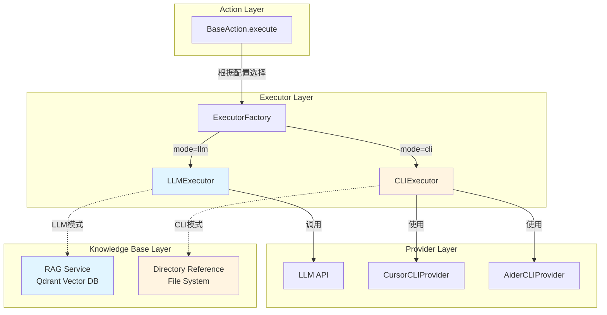
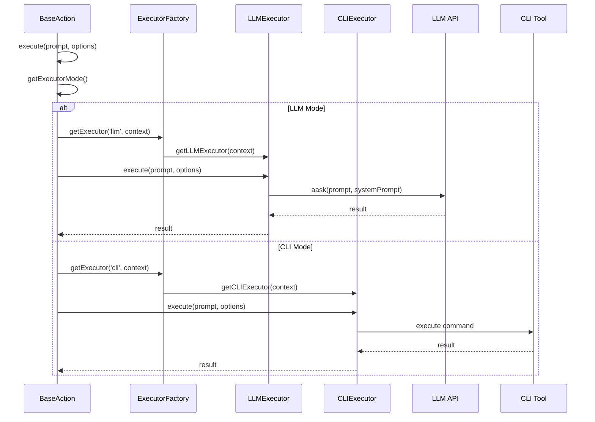
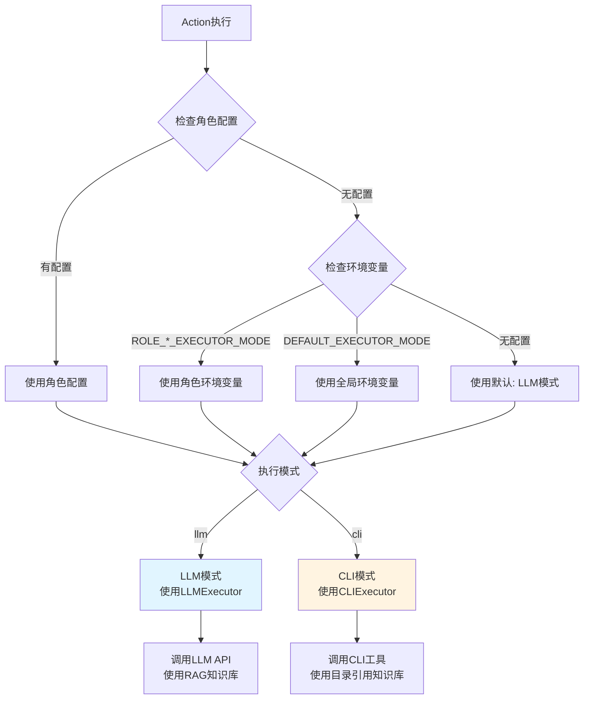

# 双模式执行器设计文档

## 文档信息

- **文档版本**: 2.0
- **创建日期**: 2026-01-23
- **最后更新**: 2026-01-26（更新为双模式设计文档，反映当前实现）
- **文档状态**: 已实现
- **相关文档**: 
  - `06_角色系统设计_ROLES.md`
  - `07_行动系统设计_ACTIONS.md`
  - `08_LLM提供商集成_PROVIDERS.md`
  - `31_CLI知识库设计方案_CLI_KNOWLEDGE_BASE.md`

---

## 1. 概述

### 1.1 背景

系统已实现双模式执行器架构，支持两种执行模式：

- **LLM模式**（默认）：使用大模型API执行任务，支持多种LLM提供商（OpenAI、Zhipu AI、DeepSeek等），通过RAG（Retrieval-Augmented Generation）检索历史文档作为上下文
- **CLI模式**：使用命令行工具执行任务，支持Cursor CLI、Aider等工具，直接利用CLI工具的原生上下文能力访问文件系统和代码库

两种模式可以根据场景灵活选择，实现优势互补。系统通过统一的执行器接口（`IExecutor`）抽象两种模式，Action层无需关心具体执行方式，只需调用统一的`execute()`方法。

### 1.2 目标

双模式设计的目标：

- **灵活选择**: 根据场景选择最适合的执行模式（LLM模式或CLI模式）
- **优势互补**: LLM模式提供快速响应和成本控制，CLI模式提供完整代码理解和高质量文档生成
- **统一接口**: 通过统一的执行器接口，Action层代码无需修改即可切换模式
- **向后兼容**: 默认使用LLM模式，保持现有功能不受影响
- **配置灵活**: 支持全局配置、角色级配置、环境变量配置等多种配置方式
- **知识库分离**: CLI模式使用目录引用方式，LLM模式继续使用RAG，两种模式的知识库策略完全分离

### 1.3 已实现功能

当前系统已完整实现双模式架构：

- ✅ **执行器系统**: `LLMExecutor`、`CLIExecutor`、`ExecutorFactory`
- ✅ **CLI提供商系统**: `CursorCLIProvider`、`AiderCLIProvider`、`CLIProviderFactory`
- ✅ **角色配置系统**: `RoleExecutorConfig`，支持数据库、环境变量、默认配置三级优先级
- ✅ **BaseAction双模式支持**: 统一的`execute()`方法，自动根据配置选择执行模式
- ✅ **文档处理Handler**: `DocumentWriteHandler`、`DocumentReviewHandler`、`DocumentImproveHandler`均支持双模式
- ✅ **知识库系统**: CLI模式使用目录引用，LLM模式使用RAG，完全分离
- ✅ **30个Action**: 所有Action均支持双模式执行

---

## 2. 双模式架构设计

### 2.0 架构概览

系统采用双模式执行器架构，通过统一的执行器接口抽象两种执行模式：



### 2.0.1 执行流程



### 2.0.2 模式选择决策流程



---

### 2.1 当前实现方式

系统已实现双模式执行器架构，支持两种执行模式：

#### 2.1.1 LLM模式（默认）

使用大模型API执行任务，通过统一的`LLMExecutor`执行器：

```typescript
// BaseAction.execute() 自动选择执行模式
protected async execute(prompt: string, options?: ExecutorOptions): Promise<string> {
  const mode = this.getExecutorMode();
  if (mode === 'cli') {
    return await this.executeCLI(prompt, options);
  } else {
    return await this.executeLLM(prompt, options);
  }
}

// LLM模式执行
protected async executeLLM(prompt: string, options?: ExecutorOptions): Promise<string> {
  const currentLLM = this.llm;
  const systemMsgs = options?.systemPrompt ? [options.systemPrompt] : undefined;
  return await currentLLM.aask(prompt, systemMsgs, this.abortSignal);
}
```

**特点**:
- 通过`BaseAction.llm`获取LLM实例（来自Context或角色特定配置）
- 使用`LLMExecutor`统一封装LLM调用
- 支持多种LLM提供商（OpenAI、Zhipu AI、DeepSeek等）
- 使用RAG（Retrieval-Augmented Generation）检索历史文档作为上下文
- 需要配置API密钥、模型参数等

#### 2.1.2 CLI模式

使用命令行工具执行任务，通过统一的`CLIExecutor`执行器：

```typescript
// CLI模式执行
protected async executeCLI(prompt: string, options?: ExecutorOptions): Promise<string> {
  const workDir = options?.workDir || this.getDefaultWorkDir();
  const cliConfig = this.getCLIConfig();
  const executor = new CLIExecutor({
    providerType: cliConfig.provider,
    providerConfig: cliConfig.config,
    defaultWorkDir: workDir,
  });
  return await executor.execute(prompt, {
    ...options,
    workDir,
    abortSignal: this.abortSignal,
  });
}
```

**特点**:
- 使用`CLIExecutor`统一封装CLI调用
- 支持多种CLI提供商（Cursor CLI、Aider等）
- 直接利用CLI工具的原生上下文能力访问文件系统
- 使用目录引用方式提供知识库上下文，无需向量数据库
- 工作目录隔离（每个项目独立workspace）

### 2.2 架构对比

| 维度 | LLM模式 | CLI模式 |
|------|---------|---------|
| **执行方式** | HTTP API调用 | Shell命令执行 |
| **执行器** | LLMExecutor | CLIExecutor |
| **知识库** | RAG（向量数据库） | 目录引用（文件系统） |
| **上下文长度** | 受模型token限制 | 无限制（可读取完整文件） |
| **代码理解** | 有限 | 强大（CLI工具原生能力） |
| **响应速度** | 秒级 | 分钟级 |
| **成本** | 按token计费 | CLI工具使用限制 |
| **依赖** | API密钥 | 本地CLI工具 |
| **适用场景** | 简单文档、快速原型 | 复杂代码理解、大型项目 |

### 2.3 模式优劣对比

#### LLM模式优势

- ✅ **API调用灵活**：支持多种LLM提供商（OpenAI、Zhipu、DeepSeek等）
- ✅ **成本可控**：按token计费，可精确控制成本
- ✅ **无需本地工具**：只需API密钥即可使用
- ✅ **响应速度快**：API调用通常秒级返回
- ✅ **支持流式输出**：可实时获取生成内容
- ✅ **模型选择灵活**：可根据需求选择不同能力的模型

#### LLM模式劣势

- ❌ **上下文长度限制**：受模型最大token限制
- ❌ **代码理解能力有限**：难以理解复杂代码结构
- ❌ **需要向量数据库**：RAG需要Qdrant等向量数据库，增加系统复杂度
- ❌ **知识库依赖RAG检索**：检索精度可能有限
- ❌ **无法直接访问文件系统**：需要预先准备上下文
- ❌ **对长文档处理能力有限**：可能需要分块处理

#### CLI模式优势

- ✅ **完整代码理解**：CLI工具具备强大的代码分析能力
- ✅ **文件系统直接访问**：可读取完整文件不受限制
- ✅ **无需向量数据库**：知识库使用简化（目录引用）
- ✅ **知识库简化**：直接利用CLI工具的原生上下文能力
- ✅ **支持大项目**：可处理大型代码库和文档
- ✅ **功能冲突检测**：可自动识别新需求与现有实现的冲突
- ✅ **文档生成质量高**：基于完整上下文生成更准确的文档

#### CLI模式劣势

- ❌ **依赖本地工具**：需要安装Cursor CLI等工具
- ❌ **执行时间较长**：CLI工具执行可能需要数分钟到数十分钟
- ❌ **资源消耗较大**：需要更多CPU和内存资源
- ❌ **工具可用性要求**：需要确保CLI工具在环境中可用
- ❌ **成本可能较高**：Cursor CLI可能有使用限制
- ❌ **调试困难**：CLI执行过程不如API调用透明

#### 使用场景建议

**推荐使用LLM模式**：
- 简单文档生成
- 快速原型开发
- 成本敏感场景
- 无本地工具环境
- 需要快速响应的场景

**推荐使用CLI模式**：
- 复杂代码理解
- 大型项目文档生成
- 高质量文档生成需求
- 需要冲突检测的场景
- 已有完整代码库的项目

### 2.4 支持双模式的角色和Action

所有30个Action均支持双模式执行，包括：

**文档生成类**：
- WriteMRD, WritePRD, WriteDesign, WriteTest, WriteTestPlan, WriteSubProjectDesign

**文档审查类**：
- MRDReview, PRDReview, DesignReview, TestReview, TestCaseReview, SubProjectDesignReview

**文档改进类**：
- ImproveMRD, ImprovePRD, ImproveDesign, ImproveTest

**代码相关**：
- WriteCode, CodeReview, RunCode, FixBug

**任务管理**：
- BreakdownTasks, ExecuteSubtask, Coordinate

**测试相关**：
- TestabilityReview, CoverageQualityCheck, AutomationPlanning, AutomationExecution

**其他**：
- SearchEnhancedQA, QAConclusion, DataAnalysis

---

## 3. 核心组件设计

### 3.1 执行器架构

系统通过统一的执行器接口抽象两种执行模式，Action层无需关心具体实现细节。

#### 3.1.1 执行器接口

**文件**: `backend/src/executors/types.ts`

```typescript
/**
 * 执行模式类型
 * - llm: 使用大模型 API 执行
 * - cli: 使用命令行工具执行（如 Cursor CLI, Aider）
 */
export type ExecutorMode = 'llm' | 'cli';

/**
 * 执行器选项
 */
export interface ExecutorOptions {
  /** 系统提示词 */
  systemPrompt?: string;
  /** 工作目录 */
  workDir?: string;
  /** 超时时间（毫秒） */
  timeout?: number;
  /** 输出文件路径（CLI 模式下指定输出文件） */
  outputFile?: string;
  /** 环境变量 */
  env?: Record<string, string>;
  /** AbortSignal 用于取消执行 */
  abortSignal?: AbortSignal;
}

/**
 * 执行器接口
 */
export interface IExecutor {
  /**
   * 执行提示词
   * @param prompt 提示词内容
   * @param options 执行选项
   * @returns 执行结果字符串
   */
  execute(prompt: string, options?: ExecutorOptions): Promise<string>;

  /**
   * 获取执行模式
   */
  getMode(): ExecutorMode;
}
```

#### 3.1.2 LLMExecutor（LLM执行器）

**文件**: `backend/src/executors/LLMExecutor.ts`

LLM执行器封装LLM API调用，提供统一的执行接口：

```typescript
export class LLMExecutor implements IExecutor {
  private context: LLMExecutorContext;

  constructor(context: LLMExecutorContext) {
    this.context = context;
  }

  getMode(): ExecutorMode {
    return 'llm';
  }

  async execute(prompt: string, options?: ExecutorOptions): Promise<string> {
    const { llm, abortSignal } = this.context;

    if (!llm) {
      throw new Error('LLMExecutor: LLM instance not available');
    }

    if (options?.systemPrompt) {
      // 使用 aask 方法（带系统提示词）
      return await llm.aask(prompt, [options.systemPrompt], abortSignal);
    } else {
      // 使用 aask 方法（不带系统提示词）
      return await llm.aask(prompt, undefined, abortSignal);
    }
  }
}
```

**特点**:
- 封装LLM API调用逻辑
- 支持系统提示词
- 支持取消信号（AbortSignal）
- 统一的错误处理和日志记录

#### 3.1.3 CLIExecutor（CLI执行器）

**文件**: `backend/src/executors/CLIExecutor.ts`

CLI执行器封装CLI工具调用，支持多种CLI提供商：

```typescript
export class CLIExecutor implements IExecutor {
  private config: CLIExecutorConfig;

  constructor(config?: CLIExecutorConfig) {
    this.config = {
      providerType: config?.providerType || CLIProviderFactory.getDefaultProviderType(),
      maxRetries: config?.maxRetries || 0,
      ...config,
    };
  }

  getMode(): ExecutorMode {
    return 'cli';
  }

  async execute(prompt: string, options?: ExecutorOptions): Promise<string> {
    const workDir = options?.workDir || this.config.defaultWorkDir;

    if (!workDir) {
      throw new Error('CLIExecutor: workDir is required for CLI execution');
    }

    // 获取 CLI 提供商
    const provider = CLIProviderFactory.getProvider(
      this.config.providerType,
      this.config.providerConfig
    );

    // 构建完整提示词（包含系统提示词）
    let fullPrompt = prompt;
    if (options?.systemPrompt) {
      fullPrompt = `${options.systemPrompt}\n\n## 任务\n\n${prompt}`;
    }

    // 执行命令
    const result = await provider.execute(fullPrompt, workDir, {
      timeout: options?.timeout || this.config.providerConfig?.timeout,
      env: options?.env,
    });

    return result.output;
  }

  /**
   * 带重试的执行
   */
  async executeWithRetry(
    prompt: string,
    checkPrompt: string,
    options?: ExecutorOptions & { maxRetries?: number; isComplete?: (output: string) => boolean }
  ): Promise<{ output: string; iterations: number; isCompleted: boolean }> {
    // 实现重试逻辑
  }
}
```

**特点**:
- 支持多种CLI提供商（Cursor、Aider等）
- 自动构建完整提示词（包含系统提示词）
- 支持重试机制
- 统一的工作目录管理

#### 3.1.4 ExecutorFactory（执行器工厂）

**文件**: `backend/src/executors/ExecutorFactory.ts`

执行器工厂根据配置创建对应的执行器实例：

```typescript
export class ExecutorFactory {
  /** 缓存的 LLM 执行器 */
  private static llmExecutorCache: WeakMap<any, LLMExecutor> = new WeakMap();

  /**
   * 获取执行器
   * @param mode 执行模式
   * @param context 执行器上下文
   */
  static getExecutor(mode: ExecutorMode, context: ExecutorContext): IExecutor {
    if (mode === 'llm') {
      return this.getLLMExecutor(context);
    } else {
      return this.getCLIExecutor(context);
    }
  }

  /**
   * 获取 LLM 执行器（带缓存）
   */
  static getLLMExecutor(context: ExecutorContext): LLMExecutor {
    if (!context.llm) {
      throw new Error('ExecutorFactory: LLM instance is required for LLM mode');
    }

    // 检查缓存
    let executor = this.llmExecutorCache.get(context.llm);
    if (executor) {
      return executor;
    }

    // 创建新实例
    const llmContext: LLMExecutorContext = {
      llm: context.llm,
      abortSignal: context.abortSignal,
    };

    executor = new LLMExecutor(llmContext);
    this.llmExecutorCache.set(context.llm, executor);
    return executor;
  }

  /**
   * 获取 CLI 执行器
   */
  static getCLIExecutor(context: ExecutorContext): CLIExecutor {
    const config: CLIExecutorConfig = {
      providerType: context.cliProvider,
      providerConfig: context.cliConfig,
      defaultWorkDir: context.workDir,
    };

    return new CLIExecutor(config);
  }

  /**
   * 获取默认执行模式
   * 从环境变量读取，默认为 llm
   */
  static getDefaultMode(): ExecutorMode {
    const envMode = process.env.DEFAULT_EXECUTOR_MODE;
    if (envMode === 'cli' || envMode === 'llm') {
      return envMode;
    }
    return 'llm';
  }
}
```

**特点**:
- 统一的执行器创建接口
- LLM执行器缓存机制
- 支持默认模式配置
- 根据角色配置自动选择模式

### 3.2 CLI提供商系统

CLI提供商系统抽象了不同CLI工具的实现细节，支持Cursor CLI、Aider等多种工具。

#### 3.2.1 CLI提供商接口

**文件**: `backend/src/executors/types.ts`

```typescript
/**
 * CLI 提供商类型
 */
export type CLIProviderType = 'cursor' | 'aider' | 'cline' | 'custom';

/**
 * CLI 提供商配置
 */
export interface CLIProviderConfig {
  /** 提供商类型 */
  type: CLIProviderType;
  /** CLI 命令（如 'cursor-agent', 'aider'） */
  command?: string;
  /** 模型名称（如 'composer-1'） */
  model?: string;
  /** 额外参数 */
  args?: string[];
  /** 超时时间（毫秒） */
  timeout?: number;
  /** 环境变量 */
  env?: Record<string, string>;
  /** AbortSignal 用于取消执行 */
  abortSignal?: AbortSignal;
}

/**
 * CLI 执行结果
 */
export interface CLIExecutionResult {
  /** 输出内容 */
  output: string;
  /** 退出码 */
  exitCode: number;
  /** 执行时间（毫秒） */
  executionTime: number;
  /** 标准错误输出 */
  stderr?: string;
}

/**
 * CLI 提供商接口
 */
export interface ICLIProvider {
  /**
   * 执行 CLI 命令
   * @param prompt 提示词
   * @param workDir 工作目录
   * @param config 配置选项
   */
  execute(prompt: string, workDir: string, config?: Partial<CLIProviderConfig>): Promise<CLIExecutionResult>;

  /**
   * 检查 CLI 工具是否可用
   */
  checkAvailability(): Promise<boolean>;

  /**
   * 获取 CLI 工具版本
   */
  getVersion(): Promise<string>;

  /**
   * 获取提供商类型
   */
  getType(): CLIProviderType;
}
```

#### 3.2.2 CursorCLIProvider

**文件**: `backend/src/executors/cli/CursorCLIProvider.ts`

Cursor CLI提供商实现：

```typescript
export class CursorCLIProvider extends BaseCLIProvider {
  constructor(defaultConfig?: Partial<CLIProviderConfig>) {
    super('cursor', {
      command: 'cursor-agent',
      model: 'composer-1',
      timeout: 3600000, // 60 分钟
      ...defaultConfig,
    });
  }

  async execute(
    prompt: string,
    workDir: string,
    config?: Partial<CLIProviderConfig>
  ): Promise<CLIExecutionResult> {
    const mergedConfig = this.mergeConfig(config);
    const command = mergedConfig.command || 'cursor-agent';
    const model = mergedConfig.model || 'composer-1';
    const timeout = mergedConfig.timeout || 3600000;

    // 构建命令
    const escapedPrompt = this.escapePrompt(prompt);
    const fullCommand = `${command} --model ${model} --print "${escapedPrompt}"`;

    const output = await executeCommandSimple(fullCommand, {
      cwd: workDir,
      timeout,
      env: mergedConfig.env,
      abortSignal: mergedConfig.abortSignal,
    });

    return {
      output,
      exitCode: 0,
      executionTime: Date.now() - startTime,
    };
  }

  async checkAvailability(): Promise<boolean> {
    try {
      await executeCommandSimple('cursor-agent --version', {
        timeout: 10000,
      });
      return true;
    } catch {
      return false;
    }
  }
}
```

**特点**:
- 使用`cursor-agent`命令执行
- 支持模型选择（默认`composer-1`）
- 自动转义提示词中的特殊字符
- 支持超时和取消信号

#### 3.2.3 AiderCLIProvider

**文件**: `backend/src/executors/cli/AiderCLIProvider.ts`

Aider CLI提供商实现：

```typescript
export class AiderCLIProvider extends BaseCLIProvider {
  constructor(defaultConfig?: Partial<CLIProviderConfig>) {
    super('aider', {
      command: 'aider',
      timeout: 3600000,
      ...defaultConfig,
    });
  }

  async execute(
    prompt: string,
    workDir: string,
    config?: Partial<CLIProviderConfig>
  ): Promise<CLIExecutionResult> {
    // Aider特定的执行逻辑
  }
}
```

#### 3.2.4 CLIProviderFactory

**文件**: `backend/src/executors/cli/CLIProviderFactory.ts`

CLI提供商工厂管理和创建CLI提供商实例：

```typescript
export class CLIProviderFactory {
  /** 已注册的提供商 */
  private static providers: Map<CLIProviderType, ICLIProvider> = new Map();

  /**
   * 初始化默认提供商
   */
  private static initialize(): void {
    if (this.initialized) return;

    // 注册默认提供商
    this.providers.set('cursor', new CursorCLIProvider());
    this.providers.set('aider', new AiderCLIProvider());

    this.initialized = true;
  }

  /**
   * 获取 CLI 提供商
   * @param type 提供商类型
   * @param config 可选配置（用于创建新实例）
   */
  static getProvider(
    type: CLIProviderType = 'cursor',
    config?: Partial<CLIProviderConfig>
  ): ICLIProvider {
    this.initialize();

    // 如果提供了配置，创建新实例
    if (config) {
      return this.createProvider(type, config);
    }

    // 返回缓存的实例
    const provider = this.providers.get(type);
    if (!provider) {
      throw new Error(`CLI provider '${type}' not found`);
    }

    return provider;
  }

  /**
   * 获取默认提供商类型
   * 从环境变量读取，默认为 cursor
   */
  static getDefaultProviderType(): CLIProviderType {
    const envProvider = process.env.DEFAULT_CLI_PROVIDER;
    if (envProvider && ['cursor', 'aider', 'cline', 'custom'].includes(envProvider)) {
      return envProvider as CLIProviderType;
    }
    return 'cursor';
  }
}
```

**特点**:
- 单例模式管理提供商实例
- 支持动态注册自定义提供商
- 支持从环境变量读取默认提供商
- 自动初始化默认提供商

### 3.2 容器化架构设计

#### 3.2.1 工作流容器结构

每个工作流在独立容器中运行，包含：

```
Workflow Container
├── Runtime Environment
│   ├── Node.js Runtime
│   ├── Cursor CLI Tool (cursor-agent)
│   └── System Dependencies
│
├── Application Code
│   ├── Role Classes (ProductManager, Architect, etc.)
│   ├── Action Classes (WritePRD, WriteDesign, etc.)
│   ├── CursorCLIExecutor
│   └── WorkflowExecutor
│
├── Workspace (Volume Mount)
│   └── workspace/{applicationId}/{projectId}/
│       ├── MRD/
│       ├── PRD/
│       ├── DESIGN/
│       ├── CODE/
│       └── TEST/
│
└── State (External)
    └── PostgreSQL (workflow_executions table)
```

#### 3.2.2 容器间隔离

- **文件系统隔离**: 每个工作流容器挂载独立的workspace卷
- **状态隔离**: 通过`project_id`在数据库中隔离状态
- **资源隔离**: 每个容器有独立的CPU/内存限制
- **网络隔离**: 容器间通过API Gateway通信

### 3.3 执行模式设计

#### 3.3.1 本地开发模式 vs 容器模式

系统支持两种执行模式：

**本地开发模式**:
- 直接在本地环境运行，无需Docker容器
- 使用本地文件系统workspace
- 适合开发和调试
- 快速迭代和测试

**容器模式**:
- 在Docker/K8s容器中运行
- 使用容器卷挂载workspace
- 适合生产环境
- 资源隔离和扩展

**模式切换**:
```typescript
// 通过环境变量控制
const isContainerMode = !!process.env.CONTAINER_WORKSPACE_ROOT;
const workspacePath = isContainerMode 
  ? WorkspaceManager.getContainerWorkspacePath(options)
  : WorkspaceManager.getProjectWorkspacePath(options);
```

### 3.4 核心组件设计

#### 3.4.1 CLI提供商抽象接口

**文件**: `backend/src/utils/cli/CLIProvider.ts`

```typescript
export type CLIProviderType = 'cursor' | 'aider' | 'cline' | 'custom';

export interface CLIProviderConfig {
  type: CLIProviderType;
  command: string;              // CLI命令（如 'cursor-agent', 'aider'）
  model?: string;               // 模型名称（如 'composer-1'）
  args?: string[];              // 额外参数
  timeout?: number;             // 超时时间
  env?: Record<string, string>; // 环境变量
}

export interface CLIExecutionResult {
  output: string;
  exitCode: number;
  executionTime: number;
}

/**
 * CLI提供商抽象接口
 */
export interface ICLIProvider {
  /**
   * 执行CLI命令
   */
  execute(command: string, options: CLIProviderConfig): Promise<CLIExecutionResult>;
  
  /**
   * 检查CLI工具是否可用
   */
  checkAvailability(): Promise<boolean>;
  
  /**
   * 获取CLI工具版本
   */
  getVersion(): Promise<string>;
}

/**
 * Cursor CLI提供商（默认）
 */
export class CursorCLIProvider implements ICLIProvider {
  async execute(command: string, config: CLIProviderConfig): Promise<CLIExecutionResult> {
    const model = config.model || 'composer-1';
    const fullCommand = `cursor-agent --model ${model} --print "${command}"`;
    
    const startTime = Date.now();
    const result = await executeCommand(fullCommand, {
      cwd: config.workDir,
      timeout: config.timeout || 3600000,
      env: config.env,
    });
    
    return {
      output: result.stdout,
      exitCode: result.exitCode || 0,
      executionTime: Date.now() - startTime,
    };
  }

  async checkAvailability(): Promise<boolean> {
    try {
      await executeCommand('cursor-agent --version');
      return true;
    } catch {
      return false;
    }
  }

  async getVersion(): Promise<string> {
    const result = await executeCommand('cursor-agent --version');
    return result.stdout.trim();
  }
}

/**
 * Aider CLI提供商
 */
export class AiderCLIProvider implements ICLIProvider {
  async execute(command: string, config: CLIProviderConfig): Promise<CLIExecutionResult> {
    const fullCommand = `aider "${command}"`;
    
    const startTime = Date.now();
    const result = await executeCommand(fullCommand, {
      cwd: config.workDir,
      timeout: config.timeout || 3600000,
      env: config.env,
    });
    
    return {
      output: result.stdout,
      exitCode: result.exitCode || 0,
      executionTime: Date.now() - startTime,
    };
  }

  async checkAvailability(): Promise<boolean> {
    try {
      await executeCommand('aider --version');
      return true;
    } catch {
      return false;
    }
  }

  async getVersion(): Promise<string> {
    const result = await executeCommand('aider --version');
    return result.stdout.trim();
  }
}

/**
 * CLI提供商工厂
 */
export class CLIProviderFactory {
  private static providers: Map<CLIProviderType, ICLIProvider> = new Map([
    ['cursor', new CursorCLIProvider()],
    ['aider', new AiderCLIProvider()],
    // 可以添加更多提供商
  ]);

  static getProvider(type: CLIProviderType = 'cursor'): ICLIProvider {
    const provider = this.providers.get(type);
    if (!provider) {
      throw new Error(`CLI provider '${type}' not found`);
    }
    return provider;
  }

  static registerProvider(type: CLIProviderType, provider: ICLIProvider): void {
    this.providers.set(type, provider);
  }
}
```

#### 3.4.2 CLIExecutor（通用CLI执行器）

统一的CLI执行器，支持多种CLI提供商：

**文件**: `backend/src/utils/CLIExecutor.ts`

```typescript
import { ICLIProvider, CLIProviderFactory, CLIProviderType, CLIProviderConfig } from './cli/CLIProvider';

export interface CLIExecutorOptions {
  workDir: string;              // 工作目录
  timeout?: number;             // 超时时间（毫秒）
  maxRetries?: number;          // 最大重试次数
  provider?: CLIProviderType;    // CLI提供商类型（默认cursor）
  providerConfig?: CLIProviderConfig; // 提供商特定配置
  env?: Record<string, string>;  // 环境变量
}

export interface CLIExecutorResult {
  output: string;               // 命令输出
  isCompleted: boolean;         // 是否完成
  iterations: number;          // 迭代次数
  executionTime: number;       // 执行时间（毫秒）
  provider: CLIProviderType;   // 使用的提供商
}

export class CLIExecutor {
  /**
   * 执行CLI命令
   * @param command 要执行的指令
   * @param options 执行选项
   * @returns 命令输出
   */
  static async execute(
    command: string,
    options: CLIExecutorOptions
  ): Promise<string> {
    const providerType = options.provider || 'cursor';
    const provider = CLIProviderFactory.getProvider(providerType);
    
    const config: CLIProviderConfig = {
      type: providerType,
      command: '',
      workDir: options.workDir,
      timeout: options.timeout || 3600000,
      env: options.env,
      ...options.providerConfig,
    };
    
    const result = await provider.execute(command, config);
    return result.output;
  }

  /**
   * 执行带重试的命令
   * @param command 要执行的指令
   * @param checkCommand 检查命令（用于判断是否完成）
   * @param options 执行选项
   * @returns 所有迭代的输出
   */
  static async executeWithRetry(
    command: string,
    checkCommand: string,
    options: CLIExecutorOptions
  ): Promise<CLIExecutorResult> {
    const providerType = options.provider || 'cursor';
    const provider = CLIProviderFactory.getProvider(providerType);
    const maxRetries = options.maxRetries || 10;
    
    let retryCount = 0;
    let isCompleted = false;
    let allOutputs: string[] = [];
    const startTime = Date.now();

    const config: CLIProviderConfig = {
      type: providerType,
      command: '',
      workDir: options.workDir,
      timeout: options.timeout || 3600000,
      env: options.env,
      ...options.providerConfig,
    };

    while (!isCompleted && retryCount < maxRetries) {
      retryCount++;
      
      // 执行主命令
      const outputResult = await provider.execute(command, config);
      allOutputs.push(`=== Iteration ${retryCount} - Execute ===\n${outputResult.output}`);
      
      // 执行检查命令
      const checkResult = await provider.execute(checkCommand, config);
      allOutputs.push(`=== Iteration ${retryCount} - Check ===\n${checkResult.output}`);
      
      // 判断是否完成
      if (checkResult.output.includes('已完成') || checkResult.output.includes('SUCCESS')) {
        isCompleted = true;
      }
    }

    return {
      output: allOutputs.join('\n\n'),
      isCompleted,
      iterations: retryCount,
      executionTime: Date.now() - startTime,
      provider: providerType,
    };
  }

  /**
   * 检查CLI提供商是否可用
   */
  static async checkProviderAvailability(providerType: CLIProviderType = 'cursor'): Promise<boolean> {
    try {
      const provider = CLIProviderFactory.getProvider(providerType);
      return await provider.checkAvailability();
    } catch {
      return false;
    }
  }
}
```

**向后兼容的CursorCLIExecutor**:

```typescript
// 为了向后兼容，保留CursorCLIExecutor作为CLIExecutor的别名
export const CursorCLIExecutor = CLIExecutor;
export type CursorCLIOptions = CLIExecutorOptions;
export type CursorCLIResult = CLIExecutorResult;
```

#### 3.3.1 RoleExecutorConfig（角色执行器配置）

**文件**: `backend/src/roles/RoleExecutorConfig.ts`

角色执行器配置管理角色的执行模式（LLM或CLI）和CLI提供商配置，支持三级优先级：数据库配置 > 环境变量 > 默认配置。

```typescript
/**
 * 角色执行器配置数据
 */
export interface RoleExecutorConfigData {
  /** 执行模式 */
  mode?: ExecutorMode;
  /** CLI 提供商类型 */
  cliProvider?: CLIProviderType;
  /** CLI 提供商配置 */
  cliConfig?: Partial<CLIProviderConfig>;
}

/**
 * 角色执行器配置类
 */
export class RoleExecutorConfig {
  private profile: string;
  private context: Context;
  private cachedConfig?: RoleExecutorConfigData;
  private initialized: boolean = false;
  private loadPromise?: Promise<void>;

  constructor(profile: string, context: Context) {
    this.profile = profile;
    this.context = context;
  }

  /**
   * 开始异步加载配置
   */
  startLoading(): Promise<void> {
    if (!this.loadPromise) {
      this.loadPromise = this.loadConfig();
    }
    return this.loadPromise;
  }

  /**
   * 获取执行器配置
   * 优先级: 数据库配置 > 环境变量 > 默认配置
   */
  async getConfig(): Promise<RoleExecutorConfigData> {
    if (this.loadPromise) {
      await this.loadPromise;
    }

    if (this.cachedConfig) {
      return this.cachedConfig;
    }

    await this.loadConfig();
    return this.cachedConfig!;
  }

  /**
   * 获取执行模式
   */
  async getMode(): Promise<ExecutorMode> {
    const config = await this.getConfig();
    return config.mode || 'llm';
  }

  /**
   * 同步获取执行模式
   */
  getModeSync(): ExecutorMode {
    return this.cachedConfig?.mode || this.getEnvMode() || 'llm';
  }

  /**
   * 获取 CLI 提供商类型
   */
  async getCLIProvider(): Promise<CLIProviderType | undefined> {
    const config = await this.getConfig();
    return config.cliProvider;
  }

  /**
   * 从环境变量加载配置
   */
  private loadFromEnv(): RoleExecutorConfigData {
    const profileUpper = this.profile.toUpperCase();

    // 执行模式
    const mode = this.getEnvMode();

    // CLI 提供商
    const cliProviderEnv = process.env[`ROLE_${profileUpper}_CLI_PROVIDER`];
    const cliProvider = this.isValidCLIProvider(cliProviderEnv) ? cliProviderEnv : undefined;

    // CLI 模型
    const cliModel = process.env[`ROLE_${profileUpper}_CLI_MODEL`];

    const config: RoleExecutorConfigData = {};

    if (mode) {
      config.mode = mode;
    }

    if (cliProvider) {
      config.cliProvider = cliProvider;
    }

    if (cliModel) {
      config.cliConfig = {
        model: cliModel,
      };
    }

    return config;
  }

  /**
   * 获取默认配置
   */
  private getDefaultConfig(): RoleExecutorConfigData {
    return {
      mode: 'llm', // 默认使用 LLM 模式，保持向后兼容
    };
  }
}
```

**角色配置示例**:

```typescript
// 在Role构造函数中
export class ProductManager extends Role {
  private cliConfig: RoleCLIConfig;

  constructor(context: Context, name: string = 'ProductManager') {
    // ... 其他初始化代码
    
    this.cliConfig = new RoleCLIConfig(this.profile, context);
  }

  /**
   * 获取CLI配置
   */
  async getCLIConfig(): Promise<RoleCLIConfig> {
    return await this.cliConfig.getConfig();
  }
}
```

#### 3.4.4 WorkflowContainer（新增）

工作流容器封装类，管理单个工作流的完整生命周期：

**文件**: `backend/src/workflow/WorkflowContainer.ts`

```typescript
export interface WorkflowContainerConfig {
  projectId: string;
  applicationId: string;
  workflowConfig: WorkflowConfig;
  workspacePath: string;        // 容器内workspace路径
  stateService: WorkflowExecutionService; // 状态服务（外部）
}

export class WorkflowContainer {
  private executor: WorkflowExecutor;
  private config: WorkflowContainerConfig;
  private context: Context;

  constructor(config: WorkflowContainerConfig) {
    this.config = config;
    this.context = new Context();
    this.context.set('projectId', config.projectId);
    this.context.set('applicationId', config.applicationId);
    
    // 创建工作流执行器
    this.executor = new WorkflowExecutor({
      workspacePath: config.workspacePath,
      stateService: config.stateService,
    });
  }

  /**
   * 启动工作流执行
   */
  async start(): Promise<void> {
    await this.executor.execute(this.config.projectId);
  }

  /**
   * 停止工作流执行
   */
  async stop(): Promise<void> {
    this.executor.stop();
  }

  /**
   * 获取工作流状态
   */
  async getState(): Promise<WorkflowState> {
    return await this.config.stateService.getCurrentState(this.config.projectId);
  }

  /**
   * 获取workspace路径
   */
  getWorkspacePath(): string {
    return this.config.workspacePath;
  }
}
```

### 3.4 BaseAction双模式支持

BaseAction提供了统一的执行接口，自动根据配置选择LLM模式或CLI模式执行。

**文件**: `backend/src/core/base/BaseAction.ts`

```typescript
import { ExecutorMode, ExecutorOptions } from '../../executors/types';
import { CLIExecutor } from '../../executors/CLIExecutor';

export abstract class BaseAction {
  /**
   * 统一执行入口
   * 根据配置自动选择 LLM 或 CLI 模式执行
   */
  protected async execute(prompt: string, options?: ExecutorOptions): Promise<string> {
    const mode = this.getExecutorMode();

    if (mode === 'cli') {
      return await this.executeCLI(prompt, options);
    } else {
      return await this.executeLLM(prompt, options);
    }
  }

  /**
   * 使用 LLM 模式执行
   */
  protected async executeLLM(prompt: string, options?: ExecutorOptions): Promise<string> {
    const currentLLM = this.llm;
    if (!currentLLM) {
      throw new Error('LLM not available: Context not set for action');
    }

    const systemMsgs = options?.systemPrompt ? [options.systemPrompt] : undefined;
    return await currentLLM.aask(prompt, systemMsgs, this.abortSignal);
  }

  /**
   * 使用 CLI 模式执行
   */
  protected async executeCLI(prompt: string, options?: ExecutorOptions): Promise<string> {
    const workDir = options?.workDir || this.getDefaultWorkDir();
    
    if (!workDir) {
      throw new Error('BaseAction: workDir is required for CLI mode execution');
    }

    const cliConfig = this.getCLIConfig();
    const executor = new CLIExecutor({
      providerType: cliConfig.provider,
      providerConfig: cliConfig.config,
      defaultWorkDir: workDir,
    });

    return await executor.execute(prompt, {
      ...options,
      workDir,
      abortSignal: this.abortSignal,
    });
  }

  /**
   * 获取当前执行模式
   * 优先级: 角色配置 > 环境变量 > 默认(llm)
   */
  protected getExecutorMode(): ExecutorMode {
    // 1. 检查角色配置
    const roleConfig = this.role?.getExecutorConfig?.();
    if (roleConfig) {
      const modeSync = roleConfig.getModeSync?.();
      if (modeSync) {
        return modeSync;
      }
    }

    // 2. 检查角色特定的环境变量
    const roleProfile = this.role?.profile;
    if (roleProfile) {
      const roleEnvMode = process.env[`ROLE_${roleProfile.toUpperCase()}_EXECUTOR_MODE`];
      if (roleEnvMode === 'cli' || roleEnvMode === 'llm') {
        return roleEnvMode;
      }
    }

    // 3. 检查全局环境变量
    const envMode = process.env.DEFAULT_EXECUTOR_MODE;
    if (envMode === 'cli' || envMode === 'llm') {
      return envMode;
    }

    // 4. 默认使用 LLM 模式
    return 'llm';
  }

  /**
   * 构建知识输入引用指令（CLI模式）
   * 指示 CLI 参考工作目录中的历史文档和代码
   */
  protected buildKnowledgeInputReference(): string {
    return `
【重要：知识输入】
请参考工作目录中的以下内容作为知识输入（这些是重要依据）：

1. 归档历史文档：docs-archive/mrd/, docs-archive/prd/
2. 业务知识库：docs/business-knowledge/
3. 当前文档：docs/mrd/, docs/prd/
4. 开发规范：docs/dev-spec/
5. 代码实现：ainative-app/src/, ainative-backend/, ainative-shadow/src/, ainative-pc/src/

【功能冲突检测】
如果发现新需求/功能与现有实现存在冲突，请明确指出冲突点和建议解决方案。
`;
  }
}
```

#### 3.4.6 本地开发模式支持

**文件**: `backend/src/utils/WorkspaceManager.ts`

```typescript
export class WorkspaceManager {
  /**
   * 判断是否在容器环境中
   */
  static isContainerEnvironment(): boolean {
    return !!process.env.CONTAINER_WORKSPACE_ROOT;
  }

  /**
   * 判断是否为本地开发模式
   */
  static isLocalDevelopmentMode(): boolean {
    return process.env.NODE_ENV === 'development' || 
           process.env.LOCAL_DEV === 'true' ||
           !this.isContainerEnvironment();
  }

  /**
   * 获取workspace路径（自动判断环境）
   */
  static getWorkspacePath(options: WorkspaceOptions): string {
    if (this.isContainerEnvironment()) {
      return this.getContainerWorkspacePath(options);
    }
    return this.getProjectWorkspacePath(options);
  }

  /**
   * 获取本地开发workspace路径
   */
  static getLocalWorkspacePath(options: WorkspaceOptions): string {
    const projectRoot = this.getProjectRoot();
    return path.join(
      projectRoot,
      'workspace',
      options.applicationId || 'default',
      options.projectId || 'default'
    );
  }
}
```

**本地开发配置**:

```env
# .env.local (本地开发环境)
NODE_ENV=development
LOCAL_DEV=true
WORKSPACE_PATH=./workspace

# 角色CLI配置（可选，覆盖默认Cursor CLI）
ROLE_PRODUCTMANAGER_CLI_PROVIDER=cursor
ROLE_ARCHITECT_CLI_PROVIDER=cursor
ROLE_ENGINEER_CLI_PROVIDER=cursor
```

#### 3.4.7 提示词管理

保留提示词系统，但改为Cursor CLI命令的一部分：

```typescript
// 之前: 作为system prompt传递给LLM
const systemPrompt = await loadPrompt(userId, 'prd', 'system_prompt', PRD_SYSTEM_PROMPT);
const result = await this.aask(prompt, [systemPrompt]);

// 之后: 作为命令的一部分传递给Cursor CLI
const systemPrompt = await loadPrompt(userId, 'prd', 'system_prompt', PRD_SYSTEM_PROMPT);
const command = `${systemPrompt}\n\n## 任务\n\n${prompt}\n\n请生成完整的PRD文档，保存到PRD/PRD.md文件中。`;
const result = await this.executeCursorCLI(command, options);
```

### 3.5 文档处理Handler双模式支持

文档处理Handler提供了统一的文档生成、审查和改进流程，支持双模式执行。

#### 3.5.1 DocumentWriteHandler

**文件**: `backend/src/utils/document/DocumentWriteHandler.ts`

文档生成处理器，支持LLM模式和CLI模式：

```typescript
export class DocumentWriteHandler {
  private action: BaseAction;
  private config: WriteConfig;
  private cliHandler: CLIModeHandler;

  /**
   * 执行文档生成
   * 根据模式自动选择使用 LLM 分步骤生成或 CLI 完整文档生成
   */
  async execute(input: string, options: WriteOptions): Promise<WriteResult> {
    const isCLIMode = this.cliHandler.isCLIMode();

    if (isCLIMode) {
      // CLI模式：使用文件路径，生成完整文档
      return await this.writeWithCLI(options);
    } else {
      // LLM模式：使用文件内容，分步骤生成
      return await this.writeWithLLM(input, options);
    }
  }
}
```

#### 3.5.2 DocumentReviewHandler

**文件**: `backend/src/utils/document/DocumentReviewHandler.ts`

文档审查处理器，支持双模式：

```typescript
export class DocumentReviewHandler {
  /**
   * 执行文档审核
   * CLI模式：使用文件路径进行审核
   * LLM模式：使用文件内容进行审核
   */
  async execute(content: string, options: ReviewOptions): Promise<ReviewResult> {
    const isCLIMode = this.cliHandler.isCLIMode();

    if (isCLIMode || options.useFilePath) {
      // CLI模式：使用文件路径进行审核
      return await this.reviewWithFilePath(workspaceDir, options);
    } else {
      // LLM模式：使用文件内容进行审核
      return await this.reviewWithContent(content, workspaceDir, options);
    }
  }
}
```

#### 3.5.3 DocumentImproveHandler

**文件**: `backend/src/utils/document/DocumentImproveHandler.ts`

文档改进处理器，支持双模式：

```typescript
export class DocumentImproveHandler {
  /**
   * 执行文档改进
   * CLI模式：使用文件路径输入，整体改进
   * LLM模式：使用文件内容输入，支持分章节改进
   */
  async execute(input: string, options: ImproveOptions): Promise<ImproveResult> {
    const isCLIMode = this.cliHandler.isCLIMode();

    if (isCLIMode) {
      // CLI模式：整体改进
      return await this.improveWithCLI(options);
    } else {
      // LLM模式：分章节改进
      return await this.improveWithLLM(input, options);
    }
  }
}
```

### 3.6 知识库系统（双模式分离）

双模式架构中，知识库的使用策略完全分离：

#### 3.6.1 CLI模式知识库

CLI模式使用简化的知识库方式，直接利用CLI工具的原生上下文能力：

**核心思路**：
- 在prompt中明确指定参考目录，CLI会自动读取这些目录中的文件
- 使用`docs-archive/`存放历史文档，区分当前文档和历史文档
- 添加功能冲突检测指令，让CLI自动识别并报告冲突

**知识输入引用协议**：

**文件**: `backend/src/utils/document/CLIPromptBuilder.ts`

```typescript
export const CLI_KNOWLEDGE_INPUT_REFERENCE = `
【核心原则 - 必须遵守】
你生成的 MRD / PRD 内容，必须严格基于工作目录中的已有文档与代码实现。

【强制知识输入范围（按优先级）】
1. 归档历史文档：docs-archive/mrd/, docs-archive/prd/
2. 业务知识库：docs/business-knowledge/
3. 当前文档：docs/mrd/, docs/prd/, docs/design/, docs/test/
4. 开发与架构规范：docs/dev-spec/
5. 代码实现：ainative-app/src/, ainative-backend/, ainative-shadow/src/, ainative-pc/src/

【功能实现状态检测 - 必须执行】
- ✅ 已实现功能清单
- ⚠️ 存在冲突的需求与处理建议
- 🕳️ 信息缺失或需要补充决策的点
`;
```

**BaseAction支持方法**：

```typescript
protected buildKnowledgeInputReference(): string {
  // 返回知识输入引用文本
}

protected buildPromptWithKnowledgeInput(
  basePrompt: string,
  includeKnowledgeInput: boolean = true
): string {
  if (!includeKnowledgeInput || !this.isCLIMode()) {
    return basePrompt;
  }
  return `${this.buildKnowledgeInputReference()}\n\n${basePrompt}`;
}
```

**工作目录结构**：

```
workspace/
├── docs/                    # 当前正在生成的文档
│   ├── mrd/
│   └── prd/
├── docs-archive/            # 归档的历史文档
│   ├── mrd/
│   └── prd/
├── docs/business-knowledge/ # 业务知识库
├── docs/dev-spec/           # 开发规范
├── ainative-app/src/        # 移动端代码
├── ainative-backend/        # 后端代码
├── ainative-pc/src/         # PC端代码
└── ainative-shadow/src/     # 管理后台代码
```

#### 3.6.2 LLM模式知识库

LLM模式继续使用RAG（Retrieval-Augmented Generation）：

**RAG流程**：
1. 使用`RAGService`检索相似文档
2. 从Qdrant向量数据库获取相关chunks
3. 将检索结果作为上下文传递给LLM
4. LLM基于上下文生成文档

**特点**：
- 使用向量数据库（Qdrant）进行语义检索
- 支持相似度检索和相关性排序
- 保持现有RAG流程不变
- 向后兼容，不影响现有功能

#### 3.6.3 模式分离原则

**重要原则**：CLI模式和LLM模式的知识库使用策略完全分离

- **CLI模式**：
  - ✅ 必须使用CLI知识库（目录引用），不使用RAG
  - ✅ CLI工具可以直接读取文件系统，无需向量数据库
  - ✅ 利用CLI工具的代码和文档理解能力

- **LLM模式**：
  - ✅ 继续使用RAG，不使用CLI知识库
  - ✅ 保持现有RAG流程不变
  - ✅ 向后兼容，不影响现有功能

### 3.7 工作目录和状态管理

#### 3.7.1 Workspace管理

每个工作流容器有独立的workspace卷：

```
容器内路径: /workspace/{applicationId}/{projectId}/
├── MRD/
│   └── MRD.md
├── PRD/
│   └── PRD.md
├── DESIGN/
│   └── DESIGN.md
├── CODE/
│   └── ...
└── TEST/
    └── ...
```

**WorkspaceManager增强**:

```typescript
export class WorkspaceManager {
  /**
   * 获取容器内workspace路径
   * @param options workspace选项
   * @returns 容器内绝对路径
   */
  static getContainerWorkspacePath(options: WorkspaceOptions): string {
    const containerWorkspaceRoot = process.env.CONTAINER_WORKSPACE_ROOT || '/workspace';
    return path.join(
      containerWorkspaceRoot,
      options.applicationId || 'default',
      options.projectId || 'default'
    );
  }

  /**
   * 初始化容器workspace
   * 确保所有必要的目录结构存在
   */
  static async initializeContainerWorkspace(options: WorkspaceOptions): Promise<void> {
    const workspacePath = this.getContainerWorkspacePath(options);
    const directories = ['MRD', 'PRD', 'DESIGN', 'CODE', 'TEST'];
    
    for (const dir of directories) {
      await fs.mkdir(path.join(workspacePath, dir), { recursive: true });
    }
  }
}
```

#### 3.4.2 状态持久化（数据库）

工作流状态存储在PostgreSQL的`workflow_executions`表中：

- **状态隔离**: 通过`project_id`隔离不同项目
- **状态快照**: `workflow_snapshot`保存工作流配置
- **步骤状态**: `steps`数组保存所有步骤的执行状态
- **执行上下文**: `execution_context`保存中间数据

### 3.6 错误处理和重试

统一的重试机制（已在CursorCLIExecutor中实现）：

```typescript
// 使用CursorCLIExecutor.executeWithRetry
const result = await this.executeCursorCLIWithRetry(
  command,
  checkCommand,
  {
    workDir: workspacePath,
    timeout: 3600000,
    maxRetries: 10,
  }
);
```

### 3.7 容器编排设计

#### 3.6.1 容器生命周期管理

```typescript
export class WorkflowContainerManager {
  private containers: Map<string, WorkflowContainer> = new Map();

  /**
   * 创建工作流容器
   */
  async createContainer(config: WorkflowContainerConfig): Promise<WorkflowContainer> {
    // 初始化workspace
    await WorkspaceManager.initializeContainerWorkspace({
      applicationId: config.applicationId,
      projectId: config.projectId,
    });

    // 创建容器实例
    const container = new WorkflowContainer(config);
    this.containers.set(config.projectId, container);

    return container;
  }

  /**
   * 启动工作流容器
   */
  async startContainer(projectId: string): Promise<void> {
    const container = this.containers.get(projectId);
    if (!container) {
      throw new Error(`Container not found for project: ${projectId}`);
    }
    await container.start();
  }

  /**
   * 停止工作流容器
   */
  async stopContainer(projectId: string): Promise<void> {
    const container = this.containers.get(projectId);
    if (container) {
      await container.stop();
    }
  }

  /**
   * 销毁工作流容器
   */
  async destroyContainer(projectId: string): Promise<void> {
    const container = this.containers.get(projectId);
    if (container) {
      await container.stop();
      this.containers.delete(projectId);
    }
  }
}
```

---

## 4. 配置管理

双模式执行器支持灵活的配置方式，配置优先级：数据库配置 > 环境变量 > 默认配置。

### 4.1 环境变量配置

#### 4.1.1 全局配置

```env
# 全局默认执行模式（llm 或 cli）
DEFAULT_EXECUTOR_MODE=llm

# 默认CLI提供商（cursor, aider, cline）
DEFAULT_CLI_PROVIDER=cursor
```

#### 4.1.2 角色级配置

```env
# 角色特定执行模式
ROLE_PRODUCTMANAGER_EXECUTOR_MODE=cli
ROLE_ARCHITECT_EXECUTOR_MODE=cli
ROLE_ENGINEER_EXECUTOR_MODE=cli

# 角色CLI提供商
ROLE_PRODUCTMANAGER_CLI_PROVIDER=cursor
ROLE_ARCHITECT_CLI_PROVIDER=aider
ROLE_ENGINEER_CLI_PROVIDER=cursor

# 角色CLI模型
ROLE_PRODUCTMANAGER_CLI_MODEL=composer-1
ROLE_ARCHITECT_CLI_MODEL=gpt-4
```

#### 4.1.3 配置优先级

1. **数据库配置**：`role_definitions`表的`metadata.executor_config`字段
2. **环境变量**：`ROLE_{PROFILE}_EXECUTOR_MODE`等
3. **默认配置**：LLM模式（`llm`）

### 4.2 数据库配置

#### 4.2.1 角色执行器配置

在`role_definitions`表的`metadata`字段中存储执行器配置：

```sql
-- 更新角色定义，添加执行器配置
UPDATE role_definitions 
SET metadata = jsonb_set(
  metadata, 
  '{executor_config}', 
  '{
    "mode": "cli",
    "cliProvider": "cursor",
    "cliConfig": {
      "model": "composer-1"
    }
  }'::jsonb
)
WHERE profile = 'ProductManager';
```

#### 4.2.2 配置结构

```typescript
interface RoleExecutorConfigData {
  mode?: ExecutorMode;              // 'llm' | 'cli'
  cliProvider?: CLIProviderType;    // 'cursor' | 'aider' | 'cline'
  cliConfig?: {
    model?: string;                 // CLI模型名称
    command?: string;               // CLI命令
    timeout?: number;               // 超时时间（毫秒）
    args?: string[];                // 额外参数
  };
}
```

### 4.3 配置示例

#### 4.3.1 全部使用LLM模式（默认）

```env
# 无需配置，默认使用LLM模式
```

#### 4.3.2 全部使用CLI模式

```env
DEFAULT_EXECUTOR_MODE=cli
DEFAULT_CLI_PROVIDER=cursor
```

#### 4.3.3 混合模式（不同角色使用不同模式）

```env
# ProductManager使用CLI模式
ROLE_PRODUCTMANAGER_EXECUTOR_MODE=cli
ROLE_PRODUCTMANAGER_CLI_PROVIDER=cursor

# Architect使用CLI模式（Aider）
ROLE_ARCHITECT_EXECUTOR_MODE=cli
ROLE_ARCHITECT_CLI_PROVIDER=aider

# QAEngineer使用LLM模式
ROLE_QAENGINEER_EXECUTOR_MODE=llm
```

### 4.4 运行时配置检查

```typescript
// 检查当前执行模式
const mode = action.getExecutorMode(); // 'llm' | 'cli'

// 检查是否为CLI模式
const isCLIMode = action.isCLIMode(); // boolean

// 获取CLI配置
const cliConfig = await action.getCLIConfig();
```

---

## 5. 本地开发模式

### 4.1 本地开发环境设置

#### 4.1.1 环境配置

创建 `.env.local` 文件：

```env
# 本地开发模式
NODE_ENV=development
LOCAL_DEV=true

# Workspace路径（本地文件系统）
WORKSPACE_PATH=./workspace

# 数据库配置（本地PostgreSQL）
DATABASE_URL=postgresql://localhost:5432/testflow

# CLI配置（默认使用Cursor CLI）
DEFAULT_CLI_PROVIDER=cursor
CURSOR_CLI_MODEL=composer-1

# 角色CLI配置（可选，每个角色可以配置不同的CLI）
# ROLE_PRODUCTMANAGER_CLI_PROVIDER=cursor
# ROLE_ARCHITECT_CLI_PROVIDER=aider
# ROLE_ENGINEER_CLI_PROVIDER=cursor
```

#### 4.1.2 启动本地开发

```bash
# 1. 安装依赖
pnpm install

# 2. 启动数据库（如果使用Docker）
docker-compose up -d postgres

# 3. 运行数据库迁移
pnpm run db:migrate

# 4. 启动开发服务器
pnpm run dev

# 5. 在另一个终端启动前端
cd frontend
pnpm run dev
```

#### 4.1.3 本地调试工作流

```typescript
// 本地直接执行工作流（无需容器）
import { WorkflowExecutor } from './workflow/WorkflowExecutor';

const executor = new WorkflowExecutor();
await executor.execute('project-id');
```

### 4.2 角色CLI配置示例

#### 4.2.1 通过环境变量配置

```bash
# 为不同角色配置不同的CLI工具
export ROLE_PRODUCTMANAGER_CLI_PROVIDER=cursor
export ROLE_ARCHITECT_CLI_PROVIDER=aider
export ROLE_ENGINEER_CLI_PROVIDER=cursor
export ROLE_QAENGINEER_CLI_PROVIDER=cursor
```

#### 4.2.2 通过数据库配置

```sql
-- 更新角色定义，添加CLI配置
UPDATE role_definitions 
SET metadata = jsonb_set(
  metadata, 
  '{cli_config}', 
  '{"provider": "aider", "model": "gpt-4"}'
)
WHERE profile = 'Architect';
```

#### 4.2.3 通过代码配置

```typescript
// 在角色构造函数中配置
export class Architect extends Role {
  constructor(context: Context, name: string = 'Architect') {
    // ... 其他初始化
    
    // 配置使用Aider CLI
    this.cliConfig = new RoleCLIConfig(this.profile, context);
    this.cliConfig.updateConfig({
      provider: 'aider',
      providerConfig: {
        model: 'gpt-4',
      },
    });
  }
}
```

### 4.3 本地开发调试工具

#### 4.3.1 CLI工具检查脚本

**文件**: `scripts/check-cli-tools.ts`

```typescript
import { CLIProviderFactory } from '../backend/src/utils/cli/CLIProvider';

async function checkCLITools() {
  const providers = ['cursor', 'aider', 'cline'];
  
  console.log('Checking CLI tools availability...\n');
  
  for (const provider of providers) {
    try {
      const cliProvider = CLIProviderFactory.getProvider(provider as any);
      const available = await cliProvider.checkAvailability();
      const version = available ? await cliProvider.getVersion() : 'Not installed';
      
      console.log(`${provider}: ${available ? '✅' : '❌'} ${version}`);
    } catch (error) {
      console.log(`${provider}: ❌ Not available`);
    }
  }
}

checkCLITools();
```

#### 4.3.2 本地测试Action

```typescript
// 本地测试WritePRD Action
import { WritePRD } from './actions/WritePRD';

const action = new WritePRD();
const result = await action.run(mrdContent, {
  applicationId: 'test-app',
  projectId: 'test-project',
});

console.log('PRD generated:', result.content);
```

---

## 5. 容器化部署方案

### 4.1 Docker容器设计

#### 4.1.1 工作流容器镜像

**Dockerfile**: `docker/workflow-container/Dockerfile`

```dockerfile
FROM node:20-alpine

# 安装系统依赖
RUN apk add --no-cache \
    git \
    curl \
    bash \
    python3 \
    make \
    g++

# 安装Cursor CLI工具
# 注意: 需要根据实际安装方式调整
COPY cursor-agent /usr/local/bin/cursor-agent
RUN chmod +x /usr/local/bin/cursor-agent

# 设置工作目录
WORKDIR /app

# 复制应用代码
COPY backend/package.json backend/pnpm-lock.yaml ./
RUN npm install -g pnpm && pnpm install --frozen-lockfile

COPY backend/ ./backend/
RUN cd backend && pnpm build

# 创建workspace目录
RUN mkdir -p /workspace

# 设置环境变量
ENV NODE_ENV=production
ENV CONTAINER_WORKSPACE_ROOT=/workspace
ENV CURSOR_CLI_MODEL=composer-1

# 暴露端口（如果需要）
EXPOSE 3000

# 启动命令
CMD ["node", "backend/dist/workflow/container-entry.js"]
```

#### 4.1.2 容器入口脚本

**文件**: `backend/src/workflow/container-entry.ts`

```typescript
import { WorkflowContainerManager } from './WorkflowContainerManager';
import { WorkflowExecutionService } from './WorkflowExecutionService';

async function main() {
  const projectId = process.env.PROJECT_ID;
  const applicationId = process.env.APPLICATION_ID;
  
  if (!projectId || !applicationId) {
    throw new Error('PROJECT_ID and APPLICATION_ID must be set');
  }

  const manager = new WorkflowContainerManager();
  const stateService = new WorkflowExecutionService();
  
  // 获取工作流配置
  const workflowConfig = await stateService.getWorkflowConfig(projectId);
  
  // 创建容器
  const container = await manager.createContainer({
    projectId,
    applicationId,
    workflowConfig,
    workspacePath: `/workspace/${applicationId}/${projectId}`,
    stateService,
  });

  // 启动工作流
  await container.start();
}

main().catch(console.error);
```

### 4.2 Kubernetes部署

#### 4.2.1 Deployment配置

**文件**: `k8s/workflow-deployment.yaml`

```yaml
apiVersion: apps/v1
kind: Deployment
metadata:
  name: workflow-executor
spec:
  replicas: 1
  selector:
    matchLabels:
      app: workflow-executor
  template:
    metadata:
      labels:
        app: workflow-executor
    spec:
      containers:
      - name: workflow-container
        image: workflow-executor:latest
        env:
        - name: PROJECT_ID
          valueFrom:
            fieldRef:
              fieldPath: metadata.labels['project-id']
        - name: APPLICATION_ID
          valueFrom:
            fieldRef:
              fieldPath: metadata.labels['application-id']
        - name: DATABASE_URL
          valueFrom:
            secretKeyRef:
              name: database-secret
              key: url
        volumeMounts:
        - name: workspace
          mountPath: /workspace
        resources:
          requests:
            memory: "2Gi"
            cpu: "1"
          limits:
            memory: "4Gi"
            cpu: "2"
      volumes:
      - name: workspace
        persistentVolumeClaim:
          claimName: workspace-pvc
```

#### 4.2.2 工作流Pod创建

```typescript
// 为每个项目创建工作流Pod
async function createWorkflowPod(projectId: string, applicationId: string) {
  const k8s = require('@kubernetes/client-node');
  const k8sApi = k8s.KubeConfig.defaultClient();
  
  const deployment = {
    metadata: {
      name: `workflow-${projectId}`,
      labels: {
        'project-id': projectId,
        'application-id': applicationId,
      },
    },
    spec: {
      // ... deployment spec
    },
  };

  await k8sApi.createNamespacedDeployment('default', deployment);
}
```

### 4.3 工作流迁移到其他容器

#### 4.3.1 工作流导出

```typescript
export interface WorkflowExport {
  projectId: string;
  applicationId: string;
  workflowConfig: WorkflowConfig;
  workspaceSnapshot: WorkspaceSnapshot;
  stateSnapshot: WorkflowState;
}

export class WorkflowExporter {
  /**
   * 导出工作流到可移植格式
   */
  async exportWorkflow(projectId: string): Promise<WorkflowExport> {
    const stateService = new WorkflowExecutionService();
    const state = await stateService.getCurrentState(projectId);
    
    // 导出workspace文件
    const workspaceSnapshot = await this.exportWorkspace(projectId);
    
    // 导出工作流配置
    const workflowConfig = await stateService.getWorkflowConfig(projectId);
    
    return {
      projectId,
      applicationId: state.applicationId,
      workflowConfig,
      workspaceSnapshot,
      stateSnapshot: state,
    };
  }

  /**
   * 导出workspace为tar包
   */
  private async exportWorkspace(projectId: string): Promise<WorkspaceSnapshot> {
    const workspacePath = WorkspaceManager.getContainerWorkspacePath({
      projectId,
    });
    
    // 创建tar包
    const tar = require('tar');
    const tarPath = `/tmp/workspace-${projectId}.tar.gz`;
    await tar.create(
      {
        gzip: true,
        file: tarPath,
        cwd: workspacePath,
      },
      ['.']
    );
    
    return {
      tarPath,
      size: (await fs.stat(tarPath)).size,
    };
  }
}
```

#### 4.3.2 工作流导入

```typescript
export class WorkflowImporter {
  /**
   * 导入工作流到新容器
   */
  async importWorkflow(
    exportData: WorkflowExport,
    targetProjectId: string,
    targetApplicationId: string
  ): Promise<void> {
    // 1. 恢复workspace
    await this.importWorkspace(
      exportData.workspaceSnapshot,
      targetProjectId,
      targetApplicationId
    );
    
    // 2. 恢复状态
    const stateService = new WorkflowExecutionService();
    await stateService.importState(
      targetProjectId,
      exportData.stateSnapshot,
      exportData.workflowConfig
    );
  }

  /**
   * 导入workspace
   */
  private async importWorkspace(
    snapshot: WorkspaceSnapshot,
    projectId: string,
    applicationId: string
  ): Promise<void> {
    const workspacePath = WorkspaceManager.getContainerWorkspacePath({
      projectId,
      applicationId,
    });
    
    // 解压tar包
    const tar = require('tar');
    await tar.extract({
      file: snapshot.tarPath,
      cwd: workspacePath,
    });
  }
}
```

---

## 6. 实现状态

### 6.1 已实现功能

双模式执行器架构已完整实现，所有核心组件均已就绪：

#### 6.1.1 执行器系统 ✅

- ✅ `IExecutor` 接口：统一的执行器接口
- ✅ `LLMExecutor`：LLM模式执行器实现
- ✅ `CLIExecutor`：CLI模式执行器实现
- ✅ `ExecutorFactory`：执行器工厂，支持缓存和自动选择

#### 6.1.2 CLI提供商系统 ✅

- ✅ `ICLIProvider` 接口：CLI提供商抽象接口
- ✅ `CursorCLIProvider`：Cursor CLI提供商实现
- ✅ `AiderCLIProvider`：Aider CLI提供商实现
- ✅ `CLIProviderFactory`：CLI提供商工厂，支持动态注册

#### 6.1.3 角色配置系统 ✅

- ✅ `RoleExecutorConfig`：角色执行器配置管理
- ✅ 三级配置优先级：数据库 > 环境变量 > 默认
- ✅ 支持执行模式配置（LLM/CLI）
- ✅ 支持CLI提供商配置（Cursor/Aider等）

#### 6.1.4 BaseAction双模式支持 ✅

- ✅ 统一的`execute()`方法：自动根据配置选择执行模式
- ✅ `executeLLM()`：LLM模式执行
- ✅ `executeCLI()`：CLI模式执行
- ✅ `getExecutorMode()`：模式获取逻辑
- ✅ `buildKnowledgeInputReference()`：CLI模式知识库引用

#### 6.1.5 文档处理Handler ✅

- ✅ `DocumentWriteHandler`：文档生成，支持双模式
- ✅ `DocumentReviewHandler`：文档审查，支持双模式
- ✅ `DocumentImproveHandler`：文档改进，支持双模式
- ✅ `CLIModeHandler`：CLI模式处理器

#### 6.1.6 知识库系统 ✅

- ✅ CLI模式知识库：目录引用方式，利用CLI工具原生能力
- ✅ LLM模式知识库：RAG检索，使用Qdrant向量数据库
- ✅ 模式分离：两种模式的知识库策略完全分离

#### 6.1.7 Action支持 ✅

所有30个Action均支持双模式执行：
- ✅ 文档生成类（WriteMRD, WritePRD, WriteDesign等）
- ✅ 文档审查类（MRDReview, PRDReview, DesignReview等）
- ✅ 文档改进类（ImproveMRD, ImprovePRD, ImproveDesign等）
- ✅ 代码相关（WriteCode, CodeReview, RunCode, FixBug）
- ✅ 任务管理（BreakdownTasks, ExecuteSubtask, Coordinate）
- ✅ 测试相关（WriteTest, TestReview, TestCaseReview等）

### 6.2 支持的CLI提供商

- ✅ **Cursor CLI**：默认提供商，使用`cursor-agent`命令
- ✅ **Aider**：支持Aider CLI工具
- ✅ **自定义提供商**：支持注册自定义CLI提供商

### 6.3 已知限制

- ⚠️ CLI模式执行时间较长，可能需要数分钟到数十分钟
- ⚠️ CLI工具需要在环境中可用
- ⚠️ CLI模式资源消耗较大
- ⚠️ 调试CLI执行过程不如API调用透明

### 6.4 未来改进方向

- 🔄 支持更多CLI提供商（Cline等）
- 🔄 优化CLI执行性能
- 🔄 增强CLI执行过程的监控和调试能力
- 🔄 支持CLI执行结果的流式输出
- 🔄 优化知识库检索策略

## 7. 使用示例

### 7.1 BaseAction中使用双模式

#### 7.1.1 统一执行接口

```typescript
// BaseAction中的统一执行方法
export abstract class BaseAction {
  protected async execute(prompt: string, options?: ExecutorOptions): Promise<string> {
    const mode = this.getExecutorMode();
    
    if (mode === 'cli') {
      return await this.executeCLI(prompt, options);
    } else {
      return await this.executeLLM(prompt, options);
    }
  }
}
```

#### 7.1.2 Action中使用示例

```typescript
// WritePRD.ts - 使用统一执行接口
export class WritePRD extends BaseAction {
  async run(input: string, options?: WritePRDOptions): Promise<IActionOutput> {
    const systemPrompt = await loadPrompt(userId, 'prd', 'system_prompt', PRD_SYSTEM_PROMPT);
    const prompt = buildPRDPrompt(input);
    
    // 统一执行接口，自动根据配置选择LLM或CLI模式
    const prdContent = await this.execute(prompt, {
      systemPrompt,
      workDir: this.getDefaultWorkDir(),
    });
    
    return {
      content: prdContent,
      data: { type: 'prd' }
    };
  }
}
```

### 7.2 CLI模式知识库使用示例

#### 7.2.1 使用知识输入引用

```typescript
// WritePRD.ts - CLI模式自动包含知识输入
export class WritePRD extends BaseAction {
  async run(input: string, options?: WritePRDOptions): Promise<IActionOutput> {
    const basePrompt = buildPRDPrompt(input);
    
    // CLI模式下自动包含知识输入引用
    const prompt = this.buildPromptWithKnowledgeInput(basePrompt);
    
    const prdContent = await this.execute(prompt, {
      workDir: this.getDefaultWorkDir(),
    });
    
    return { content: prdContent };
  }
}
```

#### 7.2.2 手动构建知识输入

```typescript
// 手动构建包含知识输入的prompt
const knowledgeInput = this.buildKnowledgeInputReference();
const prompt = `${knowledgeInput}\n\n## 任务\n\n${basePrompt}`;
```

### 7.3 LLM模式RAG使用示例

#### 7.3.1 在Controller层使用RAG

```typescript
// PRDController.ts - LLM模式使用RAG
export class PRDController {
  async generatePRD(req: Request, res: Response) {
    const { input, useRAG = true } = req.body;
    
    if (useRAG) {
      // LLM模式：使用RAG检索相似PRD
      const similarPRDs = await ragService.searchSimilarPRDsByApplication(applicationId);
      const relevantChunks = combinePRDResults(similarPRDs);
      
      const result = await writePRDAction.run(input, {
        useRAG: true,
        relevantChunks,
      });
      
      return res.json(result);
    } else {
      // 不使用RAG的标准生成
      const result = await writePRDAction.run(input);
      return res.json(result);
    }
  }
}
```

### 7.4 配置切换示例

#### 7.4.1 通过环境变量切换模式

```bash
# 全部使用CLI模式
export DEFAULT_EXECUTOR_MODE=cli

# 特定角色使用CLI模式
export ROLE_PRODUCTMANAGER_EXECUTOR_MODE=cli
export ROLE_ARCHITECT_EXECUTOR_MODE=cli

# 其他角色使用LLM模式（默认）
```

#### 7.4.2 通过数据库配置切换模式

```sql
-- 为ProductManager配置CLI模式
UPDATE role_definitions 
SET metadata = jsonb_set(
  metadata, 
  '{executor_config}', 
  '{"mode": "cli", "cliProvider": "cursor"}'::jsonb
)
WHERE profile = 'ProductManager';
```

### 7.5 混合模式使用示例

```typescript
// 不同角色使用不同模式
// ProductManager使用CLI模式（高质量文档生成）
ROLE_PRODUCTMANAGER_EXECUTOR_MODE=cli

// QAEngineer使用LLM模式（快速测试生成）
ROLE_QAENGINEER_EXECUTOR_MODE=llm

// Engineer使用CLI模式（代码理解）
ROLE_ENGINEER_EXECUTOR_MODE=cli
```
    expect(result).toBeDefined();
  });
});
```

### 9.3 本地开发模式测试

测试本地开发模式下的功能：

```typescript
describe('Local Development Mode', () => {
  it('should use local workspace path', () => {
    process.env.LOCAL_DEV = 'true';
    const path = WorkspaceManager.getWorkspacePath({
      applicationId: 'test-app',
      projectId: 'test-project',
    });
    expect(path).toContain('workspace');
    expect(path).not.toContain('/workspace'); // 不是容器路径
  });

  it('should use role CLI config', async () => {
    process.env.ROLE_PRODUCTMANAGER_CLI_PROVIDER = 'aider';
    const role = new ProductManager(context);
    const config = await role.getCLIConfig();
    expect(config.provider).toBe('aider');
  });
});
```

### 9.4 容器化测试

测试工作流在容器中的执行：

```typescript
describe('WorkflowContainer', () => {
  it('should execute workflow in container', async () => {
    const container = await WorkflowContainerManager.createContainer({
      projectId: 'test-project',
      applicationId: 'test-app',
      workflowConfig: testWorkflowConfig,
      workspacePath: '/tmp/test-workspace',
      stateService: mockStateService,
    });

    await container.start();
    const state = await container.getState();
    expect(state.state).toBe('running');
  });
});
```

### 9.5 工作流迁移测试

测试工作流导出和导入：

```typescript
describe('Workflow Migration', () => {
  it('should export and import workflow', async () => {
    // 导出工作流
    const exporter = new WorkflowExporter();
    const exportData = await exporter.exportWorkflow('source-project');

    // 导入到新容器
    const importer = new WorkflowImporter();
    await importer.importWorkflow(
      exportData,
      'target-project',
      'target-app'
    );

    // 验证状态和文件
    const state = await stateService.getCurrentState('target-project');
    expect(state).toBeDefined();
  });
});
```

### 9.6 CLI提供商切换测试

测试不同CLI提供商的切换：

```typescript
describe('CLI Provider Switching', () => {
  it('should switch between CLI providers', async () => {
    // 测试Cursor CLI
    const cursorResult = await CLIExecutor.execute('test command', {
      workDir: '/tmp',
      provider: 'cursor',
    });
    expect(cursorResult).toBeDefined();

    // 测试Aider CLI（如果可用）
    if (await CLIExecutor.checkProviderAvailability('aider')) {
      const aiderResult = await CLIExecutor.execute('test command', {
        workDir: '/tmp',
        provider: 'aider',
      });
      expect(aiderResult).toBeDefined();
    }
  });
});
```

### 9.7 回归测试

确保现有功能不受影响：

- 所有现有的API端点
- 前端交互功能
- 工作流执行

---

## 10. 风险评估和缓解

### 10.1 风险识别

| 风险 | 影响 | 可能性 | 缓解措施 |
|------|------|--------|----------|
| Cursor CLI不可用 | 高 | 低 | 保留LLM作为fallback选项 |
| 命令执行超时 | 中 | 中 | 增加超时时间，优化命令 |
| 输出格式不一致 | 中 | 中 | 统一输出格式规范 |
| 工作目录冲突 | 低 | 低 | 使用独立的workspace目录（容器隔离） |
| 迁移工作量大 | 中 | 高 | 分阶段迁移，充分测试 |
| 容器资源不足 | 中 | 中 | 配置资源限制和监控 |
| 状态同步问题 | 高 | 低 | 使用数据库事务和乐观锁 |
| 工作流迁移失败 | 中 | 低 | 实现完整的导出/导入测试 |
| 容器间通信问题 | 中 | 低 | 使用API Gateway统一管理 |
| CLI工具不可用 | 高 | 中 | 提供CLI检查工具，支持fallback |
| 本地开发环境不一致 | 中 | 中 | 提供环境检查脚本和文档 |
| 角色CLI配置错误 | 中 | 低 | 提供配置验证和默认值 |

### 10.2 回滚方案

如果迁移出现问题，可以：

1. **快速回滚**: 恢复使用LLM API的代码版本
2. **部分回滚**: 只回滚有问题的Action，其他继续使用Cursor CLI
3. **混合模式**: 部分Action使用Cursor CLI，部分使用LLM API
4. **容器回滚**: 停止问题容器，恢复到之前的容器版本
5. **工作流回滚**: 使用工作流导出功能恢复到之前的状态

---

## 11. 实施计划

### 11.1 时间线

| 阶段 | 时间 | 任务 |
|------|------|------|
| **阶段0: 基础设施** | 7-10天 | CLI提供商抽象, CLIExecutor, RoleCLIConfig, 本地开发支持, WorkflowContainer, Docker/K8s配置 |
| **阶段1: Action迁移** | 10-15天 | 迁移所有Action到CLI（支持角色自定义CLI） |
| **阶段2: 容器化** | 5-7天 | 容器入口, 导出/导入功能, 容器测试 |
| **阶段3: 优化** | 3-5天 | 性能优化, 监控, 文档更新 |

**总计**: 约25-37个工作日（约1-1.5个月）

### 11.2 详细时间分配

#### 阶段0: 基础设施准备（7-10天）
- Day 1-2: CLI提供商抽象接口设计和实现
- Day 3: CursorCLIProvider和其他提供商实现
- Day 4: CLIExecutor实现和测试
- Day 5: RoleCLIConfig实现（环境变量和数据库支持）
- Day 6: WorkspaceManager改造（本地/容器模式）
- Day 7-8: WorkflowContainer和WorkflowContainerManager实现
- Day 9-10: Docker镜像和K8s配置

#### 阶段1: Action迁移（10-15天）
- Day 1-2: BaseAction改造
- Day 3-5: 文档生成类Action（WritePRD, WriteDesign, WriteMRD）
- Day 6-7: Review类Action
- Day 8-9: Improve类Action
- Day 10-12: 测试相关Action
- Day 13-15: 其他Action和测试

#### 阶段2: 容器化（5-7天）
- Day 1-2: 容器入口脚本实现
- Day 3-4: 工作流导出/导入功能
- Day 5-6: 容器测试和调试
- Day 7: 迁移单个工作流到容器

#### 阶段3: 优化（3-5天）
- Day 1-2: 性能优化和监控
- Day 3: 清理和文档
- Day 4-5: 最终测试和发布准备

### 11.3 资源需求

- **开发人员**: 2-3人（1人负责CLI抽象和Action迁移，1人负责容器化，1人负责测试）
- **DevOps**: 1人（负责Docker/K8s配置和本地开发环境）
- **测试人员**: 1-2人
- **文档人员**: 1人（兼职）

### 11.4 里程碑

- [ ] **M0**: 基础设施完成（CLI提供商抽象, CLIExecutor, RoleCLIConfig, 本地开发支持, WorkflowContainer, Docker/K8s）
- [ ] **M1**: BaseAction改造完成，文档生成类Action迁移完成（支持角色CLI配置）
- [ ] **M2**: 所有Action迁移完成，测试通过（本地开发模式可用）
- [ ] **M3**: 容器化完成，单个工作流成功迁移到容器
- [ ] **M4**: 工作流导出/导入功能完成
- [ ] **M5**: 所有工作流迁移到容器，性能优化完成
- [ ] **M6**: 文档更新完成，正式发布

---

## 12. 后续优化

### 12.1 性能优化

- 命令执行缓存
- 并行执行多个命令
- 优化超时设置
- 容器资源优化（CPU/内存分配）
- Workspace文件增量同步

### 12.2 功能增强

- 支持更多Cursor CLI参数
- 支持命令模板
- 支持命令链式执行
- 工作流版本管理
- 工作流快照和回滚
- 多容器负载均衡

### 12.3 监控和日志

- 命令执行时间监控
- 失败率统计
- 详细的执行日志
- 容器资源使用监控
- 工作流执行状态监控
- 告警和通知机制

### 12.4 CLI提供商扩展

- 支持更多CLI工具（Cline, Continue等）
- 支持自定义CLI提供商
- CLI工具版本管理
- CLI工具自动安装和更新

### 12.5 容器化增强

- 自动扩缩容（基于工作流队列长度）
- 容器健康检查
- 优雅关闭和重启
- 容器镜像版本管理
- 多区域部署支持

---

## 13. 工作流迁移到其他容器的完整流程

### 12.1 迁移场景

1. **开发环境 → 生产环境**: 将开发环境的工作流迁移到生产容器
2. **容器故障恢复**: 将故障容器的工作流迁移到新容器
3. **资源优化**: 将工作流迁移到资源更充足的容器
4. **多区域部署**: 将工作流迁移到不同区域的容器

### 12.2 迁移步骤

#### 步骤1: 导出工作流

```typescript
// 1. 停止当前工作流执行
await container.stop();

// 2. 导出工作流
const exporter = new WorkflowExporter();
const exportData = await exporter.exportWorkflow(projectId);

// 3. 保存导出数据（可以保存到对象存储）
await saveToObjectStorage(`workflow-${projectId}.json`, exportData);
```

#### 步骤2: 创建目标容器

```typescript
// 1. 创建新的容器实例
const targetContainer = await WorkflowContainerManager.createContainer({
  projectId: targetProjectId,
  applicationId: targetApplicationId,
  workflowConfig: exportData.workflowConfig,
  workspacePath: `/workspace/${targetApplicationId}/${targetProjectId}`,
  stateService: targetStateService,
});
```

#### 步骤3: 导入工作流

```typescript
// 1. 导入workspace文件
const importer = new WorkflowImporter();
await importer.importWorkspace(
  exportData.workspaceSnapshot,
  targetProjectId,
  targetApplicationId
);

// 2. 导入状态
await importer.importState(
  targetProjectId,
  exportData.stateSnapshot,
  exportData.workflowConfig
);
```

#### 步骤4: 验证和启动

```typescript
// 1. 验证导入结果
const state = await targetContainer.getState();
console.log('Imported state:', state);

// 2. 启动工作流
await targetContainer.start();
```

### 12.3 迁移API

```typescript
export class WorkflowMigrationService {
  /**
   * 迁移工作流到新容器
   */
  async migrateWorkflow(
    sourceProjectId: string,
    targetProjectId: string,
    targetApplicationId: string
  ): Promise<void> {
    // 1. 导出源工作流
    const exporter = new WorkflowExporter();
    const exportData = await exporter.exportWorkflow(sourceProjectId);

    // 2. 导入到目标容器
    const importer = new WorkflowImporter();
    await importer.importWorkflow(
      exportData,
      targetProjectId,
      targetApplicationId
    );

    // 3. 启动目标工作流
    const manager = new WorkflowContainerManager();
    const container = await manager.createContainer({
      projectId: targetProjectId,
      applicationId: targetApplicationId,
      workflowConfig: exportData.workflowConfig,
      workspacePath: `/workspace/${targetApplicationId}/${targetProjectId}`,
      stateService: new WorkflowExecutionService(),
    });
    await container.start();
  }
}
```

### 12.4 迁移检查清单

- [ ] 源工作流已停止
- [ ] 工作流状态已导出
- [ ] Workspace文件已导出
- [ ] 目标容器已创建
- [ ] Workspace文件已导入
- [ ] 工作流状态已导入
- [ ] 状态验证通过
- [ ] 目标工作流启动成功
- [ ] 功能验证通过

---

## 14. 本地开发调试指南

### 14.1 快速开始

```bash
# 1. 克隆项目
git clone <repository>
cd testflow

# 2. 安装依赖
pnpm install

# 3. 配置环境变量
cp config/env.template .env.local
# 编辑 .env.local，设置 LOCAL_DEV=true

# 4. 启动数据库（如果使用Docker）
docker-compose up -d postgres

# 5. 运行数据库迁移
pnpm run db:migrate

# 6. 启动后端开发服务器
pnpm run dev

# 7. 启动前端（另一个终端）
cd frontend
pnpm run dev
```

### 14.2 配置角色CLI

#### 方式1: 环境变量（推荐用于本地开发）

```bash
# .env.local
ROLE_PRODUCTMANAGER_CLI_PROVIDER=cursor
ROLE_ARCHITECT_CLI_PROVIDER=aider
ROLE_ENGINEER_CLI_PROVIDER=cursor
```

#### 方式2: 数据库配置（推荐用于生产）

```sql
UPDATE role_definitions 
SET metadata = jsonb_set(
  COALESCE(metadata, '{}'), 
  '{cli_config}', 
  '{"provider": "aider"}'
)
WHERE profile = 'Architect';
```

### 14.3 检查CLI工具可用性

```bash
# 运行CLI检查脚本
pnpm run check-cli-tools

# 或手动检查
cursor-agent --version
aider --version
```

### 14.4 调试单个Action

```typescript
// test-action.ts
import { WritePRD } from './backend/src/actions/WritePRD';

async function test() {
  const action = new WritePRD();
  const result = await action.run('MRD内容', {
    applicationId: 'test-app',
    projectId: 'test-project',
  });
  console.log(result.content);
}

test();
```

### 14.5 调试完整工作流

```typescript
// test-workflow.ts
import { WorkflowExecutor } from './backend/src/workflow/WorkflowExecutor';

async function test() {
  const executor = new WorkflowExecutor();
  await executor.execute('project-id');
}

test();
```

---

## 15. 附录

### 15.1 参考实现

- `backend/src/actions/WriteCode.ts` - Cursor CLI代码生成实现
- `backend/src/actions/BreakdownTasks.ts` - Cursor CLI任务拆解实现
- `backend/src/utils/commandExecutor.ts` - 命令执行工具

### 15.2 相关文档

- `06_角色系统设计_ROLES.md` - 角色系统设计
- `07_行动系统设计_ACTIONS.md` - Action系统设计
- `08_LLM提供商集成_PROVIDERS.md` - LLM集成文档（迁移后可能需要更新）

### 15.3 命令格式规范

统一使用以下格式：

```bash
cursor-agent --model composer-1 --print "<command>"
```

其中`<command>`是具体的任务指令，应该：
- 清晰描述任务目标
- 包含必要的上下文信息
- 指定输出文件位置
- 使用中文（根据项目要求）

### 15.4 CLI提供商配置示例

#### Cursor CLI配置

```typescript
// 默认配置
{
  provider: 'cursor',
  providerConfig: {
    model: 'composer-1',
    command: 'cursor-agent',
  }
}
```

#### Aider CLI配置

```typescript
{
  provider: 'aider',
  providerConfig: {
    command: 'aider',
    model: 'gpt-4',
  }
}
```

#### 自定义CLI配置

```typescript
// 注册自定义CLI提供商
import { CLIProviderFactory, ICLIProvider } from './cli/CLIProvider';

class CustomCLIProvider implements ICLIProvider {
  async execute(command: string, config: CLIProviderConfig) {
    // 自定义实现
  }
  // ... 其他方法
}

CLIProviderFactory.registerProvider('custom', new CustomCLIProvider());
```

### 15.5 容器化部署示例

#### Docker Compose示例

```yaml
version: '3.8'
services:
  workflow-executor:
    build:
      context: .
      dockerfile: docker/workflow-container/Dockerfile
    environment:
      - PROJECT_ID=${PROJECT_ID}
      - APPLICATION_ID=${APPLICATION_ID}
      - DATABASE_URL=${DATABASE_URL}
      - CONTAINER_WORKSPACE_ROOT=/workspace
    volumes:
      - workspace-data:/workspace
    networks:
      - workflow-network

volumes:
  workspace-data:

networks:
  workflow-network:
    driver: bridge
```

#### Kubernetes Job示例

```yaml
apiVersion: batch/v1
kind: Job
metadata:
  name: workflow-${PROJECT_ID}
spec:
  template:
    spec:
      containers:
      - name: workflow-container
        image: workflow-executor:latest
        env:
        - name: PROJECT_ID
          value: "${PROJECT_ID}"
        - name: APPLICATION_ID
          value: "${APPLICATION_ID}"
        volumeMounts:
        - name: workspace
          mountPath: /workspace
      volumes:
      - name: workspace
        persistentVolumeClaim:
          claimName: workspace-pvc
      restartPolicy: Never
```

---

## 8. 模式选择指南

### 8.1 何时选择LLM模式

**推荐场景**：
- ✅ 简单文档生成任务
- ✅ 快速原型开发
- ✅ 成本敏感场景
- ✅ 无本地CLI工具环境
- ✅ 需要快速响应的场景
- ✅ 小型项目或简单需求

**优势**：
- 响应速度快（秒级）
- 成本可控（按token计费）
- 无需本地工具
- 支持流式输出

**限制**：
- 上下文长度受限
- 代码理解能力有限
- 需要向量数据库（RAG）

### 8.2 何时选择CLI模式

**推荐场景**：
- ✅ 复杂代码理解任务
- ✅ 大型项目文档生成
- ✅ 高质量文档生成需求
- ✅ 需要冲突检测的场景
- ✅ 已有完整代码库的项目
- ✅ 需要完整上下文理解

**优势**：
- 完整代码理解能力
- 文件系统直接访问
- 无需向量数据库
- 功能冲突检测
- 文档生成质量高

**限制**：
- 执行时间较长（分钟级）
- 依赖本地工具
- 资源消耗较大

### 8.3 混合使用策略

**推荐配置**：
- **文档生成角色**（ProductManager, Architect）：使用CLI模式，获得高质量文档
- **测试角色**（QAEngineer）：使用LLM模式，快速生成测试用例
- **代码角色**（Engineer）：使用CLI模式，完整代码理解
- **数据分析角色**（DataAnalyst）：根据任务复杂度选择

**配置示例**：
```env
# 文档生成使用CLI模式
ROLE_PRODUCTMANAGER_EXECUTOR_MODE=cli
ROLE_ARCHITECT_EXECUTOR_MODE=cli

# 测试使用LLM模式
ROLE_QAENGINEER_EXECUTOR_MODE=llm

# 代码使用CLI模式
ROLE_ENGINEER_EXECUTOR_MODE=cli
```

### 8.4 模式切换指南

#### 8.4.1 从LLM模式切换到CLI模式

1. 设置环境变量或数据库配置
2. 确保CLI工具可用
3. 重启服务或重新加载配置
4. 验证执行模式

#### 8.4.2 从CLI模式切换到LLM模式

1. 移除或修改执行模式配置
2. 确保LLM API配置正确
3. 重启服务或重新加载配置
4. 验证执行模式

---

## 9. 总结

双模式执行器设计实现了LLM模式和CLI模式的灵活切换，为不同场景提供了最优的执行方式。

### 9.1 核心价值

**灵活选择**：
- 根据场景选择最适合的执行模式
- 支持全局配置、角色级配置
- 运行时动态切换

**优势互补**：
- LLM模式：快速响应、成本可控
- CLI模式：完整理解、高质量输出
- 两种模式相互补充，覆盖不同需求

**统一接口**：
- Action层代码无需修改即可切换模式
- 统一的执行器接口抽象
- 向后兼容，平滑过渡

### 9.2 架构优势

- ✅ **双模式支持**：LLM模式和CLI模式完整实现
- ✅ **统一接口**：通过`IExecutor`接口抽象两种模式
- ✅ **灵活配置**：支持数据库、环境变量、默认配置三级优先级
- ✅ **知识库分离**：CLI模式使用目录引用，LLM模式使用RAG
- ✅ **向后兼容**：默认使用LLM模式，保持现有功能

### 9.3 技术优势

- ✅ **执行器系统**：`LLMExecutor`、`CLIExecutor`、`ExecutorFactory`
- ✅ **CLI提供商系统**：支持Cursor、Aider等多种工具
- ✅ **角色配置系统**：灵活的配置管理机制
- ✅ **文档处理Handler**：统一的双模式支持
- ✅ **知识库系统**：模式分离的知识库策略

### 9.4 注意事项

- ⚠️ CLI模式需要确保CLI工具在环境中可用
- ⚠️ CLI模式执行时间较长，需要合理设置超时
- ⚠️ CLI模式资源消耗较大，需要合理配置资源限制
- ⚠️ 两种模式的知识库策略不同，需要正确理解和使用
- ⚠️ 模式切换需要重启服务或重新加载配置

### 9.5 未来改进

- 🔄 支持更多CLI提供商（Cline等）
- 🔄 优化CLI执行性能
- 🔄 增强CLI执行过程的监控和调试能力
- 🔄 支持CLI执行结果的流式输出
- 🔄 优化知识库检索策略

---

**文档版本**: 2.0  
**最后更新**: 2026-01-26  
**文档状态**: 已实现  
**相关文档**: 
- `31_CLI知识库设计方案_CLI_KNOWLEDGE_BASE.md`
- `06_角色系统设计_ROLES.md`
- `07_行动系统设计_ACTIONS.md`
