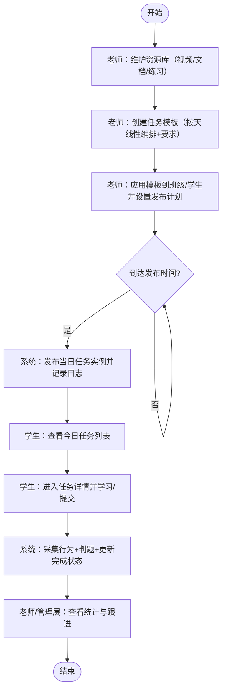

# 自习室任务管理系统 PRD

> 本 PRD 由 `doc/prd-template/自习室任务管理系统-MRD.md` 自动转写生成，并按 `doc/prd-template/prd-template.md` 的结构组织，用于范围对齐与研发落地。

---

## 0. 基本信息

| 项 | 内容 |
|---|---|
| PRD 标题 | 自习室任务管理系统（资源库 / 任务编排与模板 / 自动发布 / 学生执行与数据统计 / AI 分析） |
| PRD 编号 | PRD-001 |
| 版本 | v0.1 |
| 状态 | 草稿 |
| MRD 来源 | 自习室任务管理系统 MRD（v1.0，生成日期 2026-01-08，文件：`doc/prd-template/自习室任务管理系统-MRD.md`） |
| 负责人 | PM：产品组 / UI：设计组 / FE：前端组 / BE：后端组 / QA：测试组 |
| 里程碑 | 评审：立项后第 3 个工作日 / 联调：立项后第 15 个工作日 / 提测：立项后第 20 个工作日 / 灰度：立项后第 25 个工作日 / 全量：立项后第 30 个工作日 |
| 相关链接 | 原型：无（以 PRD 为准） / 视觉稿：无（以组件库+页面规范为准） / 接口文档：由后端在联调前提供（以 OpenAPI/Swagger 为准） / 埋点文档：见第 9 章 / 看板：无（项目看板由团队自选工具维护） |

---

## 1. 背景与目标

### 1.1 背景说明
- 现状与问题：自习室业务升级为“自习+教学”的培训机构模式，教研管理后台已覆盖排课/课时等教务流程，但学生的日常学习任务管理缺失，导致任务布置低效、资源分散、学生过程不可见、数据无法沉淀。
- 触发原因：需要以“资源沉淀 → 任务模板复用 → 自动发布 → 学习行为采集 → 统计与干预（→ AI 洞察）”形成闭环，提升教学效率与学习效果，并与现有 CRM 打通学员信息。

### 1.2 目标（必须可量化）
- 业务目标：减少老师重复性任务布置工作量；沉淀可复用的优质内容；提升学生学习完成度；形成可运营的数据资产支撑续费与教学管理。
- 产品目标：支持资源库+任务模板编排+自动定时发布+学生端任务执行+老师端完成追踪；一期实现闭环可用，二期逐步引入 AI 分析与可视化。

### 1.3 成功标准（Outcome）
- 指标口径与数据来源：
  - 任务布置时间：老师在后台完成“创建模板+绑定班级+激活发布计划”的耗时（埋点：模板保存、计划激活；后台操作时长）。
  - 学生任务完成率：周期内“已完成任务实例数 / 已发布任务实例数”（数据源：任务实例状态表）。
  - 按时完成率：截止时间前完成的任务实例数 / 已发布任务实例数（数据源：完成时间与截止时间）。
  - 练习正确率：客观题正确数 / 总题数，按任务、学生、班级聚合（数据源：练习提交记录）。
- 达标阈值（上线后 30 天）：
  - 老师任务布置从“每天约 30 分钟”降低为“首次配置 30 分钟内完成，日常仅异常处理”（效率提升目标 90%+）。
  - 学生任务完成率 ≥ 70%，按时完成率 ≥ 60%。
  - 练习平均正确率较上线前基线提升 ≥ 10%（以同类练习题对比/同班级期中前后对比为准）。

---

## 2. 范围

### 2.1 需求范围（In Scope）
- [x] R1：资源库管理（视频/文档/练习题）与分类标签、搜索筛选（P0）
- [x] R2：任务编排与模板管理（线性按天编排、保存模板、应用到班级/学生、共享给老师） （P0）
- [x] R3：自动定时发布（设置发布时间与周期、激活/暂停、发布日志、可选手动补发） （P0）
- [x] R4：学生端任务执行与行为采集（任务列表/详情、视频进度、练习提交判题、文档手动完成） （P0）
- [x] R5：统计后台（班级/个人完成率、正确率、学习时长、学生详情时间线、导出） （P0）
- [x] R6：学员信息与 CRM 集成（CRM→任务系统同步学员档案；提供同步状态与兜底导入） （P0）
- [x] R7：AI 学习报告/预警/知识点掌握与个性化建议（按周/月；不足数据时降级） （P1）
- [x] R8：可视化数据看板（完成率趋势、雷达图、排行榜等） （P1）

### 2.2 非目标（Out of Scope）
- 复杂任务依赖（前置条件/网状依赖/知识图谱式编排）
- 学生互动（讨论区、PK、社交）
- 微信/App 主动推送通知（本期仅系统内展示）
- 直播课与在线授课体系（当前为线下+录播）
- 学生自助选课/选任务（老师统一安排）
- 任务模板交易市场、付费分发
- 家长端功能

### 2.3 约束与假设
- 依赖：
  - CRM 系统提供可调用的同步能力（REST API 或定时导出），至少能获取学员基本信息（姓名、手机号、年级、报名课程、班级归属）。
  - 视频/文档采用云对象存储或视频点播服务（含转码、防盗链），以满足上传、播放与成本可控。
- 约束：
  - 学员隐私与安全：个人信息加密存储；访问需鉴权；关键操作需审计。
  - 数据保留：学习行为数据至少保留 1 年；历史任务记录不可物理删除，仅归档/软删除。
  - 兼容性：老师端为 PC 浏览器；学生端为移动端优先（H5/小程序），并可在 PC 端访问基础功能。
- 假设与影响：
  - 假设 CRM 无法提供实时 API：则采用“定时批量同步（例如每小时）+ Excel 导入兜底”，影响为学员信息可能延迟更新，且需要运维/教务参与数据维护。
  - 假设自托管视频成本不可控：优先支持第三方视频链接，影响为部分播放行为采集能力受第三方限制（仅能采集打开/完成标记，无法采集精细心跳）。
  - 假设 AI 数据不足（少于 2 周有效行为数据）：AI 模块默认关闭或降级为规则引擎提示，影响为仅提供基础统计与预警，不提供个性化建议。

---

## 3. 用户与场景

### 3.1 目标用户
| 用户/角色 | 入口 | 使用频率 | 关键诉求 | 权限/限制 |
|---|---|---|---|---|
| 老师 | 管理后台（PC Web） | 每天 1–2 次 | 资源沉淀复用；快速布置任务；掌握学生完成情况；导出统计 | 可管理本人资源/模板/班级任务；不可查看非授权班级数据 |
| 学生 | 学生端（H5/小程序） | 每天多次 | 清晰任务指引；便捷完成与提交；即时反馈 | 仅可访问分配给自己的任务与个人数据 |
| 教务/管理层 | 管理后台（PC Web） | 每周 1–3 次 | 全局数据概览；识别问题与优秀案例；查看 AI 报告 | 具备跨班级/跨老师查看与管理权限 |
| 管理员 | 管理后台（PC Web） | 按需 | 资源审核（可选）；用户与权限；系统配置与集成 | 拥有全量资源/数据管理权限 |

### 3.2 核心场景（建议 3–5 条）
- S1：老师在备课时整理视频/文档/练习题到资源库，并打标签，便于后续复用与共享。
- S2：老师在新学期开始时按章节创建“按天线性任务模板”，一键应用到班级，减少重复创建。
- S3：系统在每天固定时间自动发布当日任务到学生端，老师无需手动提醒。
- S4：学生在自习室学习时打开任务，完成视频与练习并提交，系统采集学习行为并更新完成状态。
- S5：老师在每日复盘时查看班级/个人完成率与练习正确率，定位未完成学生并跟进；管理层按周查看报表与（P1）AI 报告。

---

## 4. 核心流程

### 4.1 主流程（Happy Path）
1. 老师在管理后台进入资源库，上传/新增资源（视频文件或第三方链接、文档、练习题），并完成分类与标签。
2. 老师创建任务模板：按天添加任务条目，选择对应资源并设置要求（例如视频需观看 90%+、练习正确率 ≥ 80%）。
3. 老师将模板应用到班级/学生，生成任务计划，并设置自动发布时间（例如每天 08:00）与开始日期、持续天数。
4. 系统到点自动发布当日任务实例到学生端，并记录发布日志。
5. 学生端展示今日任务；学生进入任务详情，观看视频、完成练习、阅读文档并提交/标记完成。
6. 系统采集行为数据与提交记录，自动计算完成状态与逾期状态。
7. 老师端查看统计：班级/个人完成率、正确率、学习时长；对未完成学生进行跟进。

### 4.2 分支与回退（关键）
- 分支：CRM 同步失败 -> 使用最近一次成功同步的学员信息继续使用；同时提示管理员处理并支持 Excel 导入兜底。
- 分支：自动发布任务失败 -> 定时任务重试；仍失败时标记为“发布失败”并支持老师手动补发。
- 分支：视频为第三方链接 -> 行为采集降级为“打开/退出/完成标记（手动或基于观看时长估算）”，并在统计中标识“采集精度低”。
- 回退：老师误激活发布计划 -> 支持暂停计划；已发布任务实例不撤回但可设置“不计入统计/归档”。
- 回退：学生误提交练习 -> 支持在截止时间内“重新提交”（以最后一次为准或取最高分，取决于任务要求配置）。

### 4.3 流程图（必填，使用 Mermaid）

---

## 5. 功能与交互

### 5.1 页面/入口清单
| 页面/路由 | 入口 | 权限 | 说明 |
|---|---|---|---|
| `/admin/resources` | 管理后台导航-资源库 | 老师/管理员 | 资源列表、搜索筛选、上传、新建链接 |
| `/admin/resources/:id` | 资源列表 | 老师/管理员 | 资源详情、编辑、关联任务查看 |
| `/admin/questions` | 管理后台导航-题库 | 老师/管理员 | 练习题创建、编辑、预览与解析 |
| `/admin/templates` | 管理后台导航-任务模板 | 老师/管理员 | 模板列表、复制、共享、应用到班级 |
| `/admin/templates/:id/edit` | 模板列表 | 老师/管理员 | 模板编排编辑器（按天线性任务） |
| `/admin/plans` | 管理后台导航-发布计划 | 老师/管理员 | 模板应用后的计划管理：设置发布时间、激活/暂停、补发 |
| `/admin/tasks` | 管理后台导航-任务实例 | 老师/管理员 | 已发布任务实例查询与状态概览 |
| `/admin/students` | 管理后台导航-学员 | 老师/管理员/教务 | 学员列表（来源 CRM）、筛选、详情入口 |
| `/admin/students/:id` | 学员列表 | 老师/管理员/教务 | 学员任务时间线、完成与正确率明细 |
| `/admin/reports` | 管理后台导航-统计/报表 | 老师/管理员/教务 | 完成率/正确率/学习时长聚合与导出 |
| `/admin/ai-reports` | 管理后台导航-AI 报告 | 管理员/教务 | （P1）周/月学习报告、预警列表 |
| `/admin/settings/integrations` | 管理后台导航-设置-集成 | 管理员 | CRM 同步状态、手动触发同步、导入 |
| `/m/tasks/today` | 学生端首页/今日任务 | 学生 | 今日任务列表、进度摘要 |
| `/m/tasks/:taskId` | 今日任务列表 | 学生 | 任务详情、资源学习与提交入口 |
| `/m/resources/video/:resourceId` | 任务详情 | 学生 | 视频播放页（含进度采集） |
| `/m/exercises/:exerciseId` | 任务详情 | 学生 | 在线练习作答、提交与解析 |
| `/m/resources/doc/:resourceId` | 任务详情 | 学生 | 文档预览/下载，完成标记 |
| `/m/me/progress` | 学生端-我的 | 学生 | 历史任务、连续完成、学习时长 |

### 5.2 功能清单（用于评审与拆分）
| 模块 | 功能点 | 优先级 | 说明 | 负责人 |
|---|---|---|---|---|
| 资源库 | 视频上传/链接新增 | P0 | 支持文件上传与第三方链接；可预览 | FE/BE |
| 资源库 | 文档上传/预览/下载 | P0 | PDF/Word/PPT/图片；在线预览优先 | FE/BE |
| 题库 | 题目创建与管理 | P0 | 选择/填空/判断/简答；客观题判题 | FE/BE |
| 资源库 | 分类标签、搜索筛选 | P0 | 科目/年级/章节/知识点/难度等 | FE/BE |
| 模板 | 模板创建/编辑/复制 | P0 | 按天线性编排；支持调整顺序 | FE/BE |
| 模板 | 模板应用到班级/学生 | P0 | 生成发布计划与任务实例 | FE/BE |
| 模板 | 模板共享 | P0 | 共享给同机构老师；受权限控制 | FE/BE |
| 发布 | 定时发布任务 | P0 | Cron/队列调度；记录发布日志 | BE |
| 发布 | 暂停/补发/调整发布时间 | P0 | 计划级暂停；单日补发 | FE/BE |
| 学生端 | 今日任务列表/详情 | P0 | 展示要求、截止时间、进度 | FE |
| 学生端 | 视频播放与进度采集 | P0 | 心跳采集；可配置防拖拽 | FE/BE |
| 学生端 | 练习作答与判题 | P0 | 客观题即时判题；提交记录 | FE/BE |
| 学生端 | 文档学习与完成标记 | P0 | 下载/预览；手动完成 | FE/BE |
| 统计 | 完成率/正确率/时长统计 | P0 | 班级/个人/时间维度聚合 | FE/BE |
| 统计 | 学员详情时间线 | P0 | 任务状态、用时、提交记录 | FE/BE |
| 统计 | Excel 导出 | P0 | 指定筛选条件导出 | FE/BE |
| 集成 | CRM 同步与状态 | P0 | 定时/手动同步；失败告警 | BE |
| AI | 周/月学习报告 | P1 | 数据足够时生成；不足时降级 | BE/AI |
| AI | 学情预警 | P1 | 连续 N 天未完成、完成率下降 | BE/AI |
| AI | 知识点掌握与建议 | P1 | 基于题目-知识点映射与表现 | BE/AI |
| 看板 | 趋势图/排行榜 | P1 | ECharts/AntV 展示 | FE |

### 5.3 关键页面说明（按页面或任务流拆）
#### 资源库（`/admin/resources`）
- 目标：老师高效沉淀与复用教学资源，供模板编排调用。
- 核心操作（用户动作 -> 系统反馈）：
  - O-1：上传视频文件（入口：`上传视频`；前置：老师/管理员权限；输入：文件类型 MP4/AVI、大小限制、标题、科目/年级/章节/知识点/难度标签；请求：`POST /api/v1/resources`；成功：资源进入“处理中/可用”状态并可预览；失败：提示失败原因与重试；副作用：记录上传事件与转码任务ID）
  - O-2：新增第三方视频链接（入口：`新增链接`；输入：链接 URL、标题、标签；成功：资源可用并可在任务中引用；失败：提示链接不可访问/格式不合法）
  - O-3：上传文档（入口：`上传文档`；输入：PDF/Word/PPT/图片；成功：资源可预览/下载；失败：提示格式不支持/文件过大）
  - O-4：搜索与筛选（入口：搜索框/筛选器；输入：关键字、类型、标签；成功：列表刷新并保留筛选条件；异常：网络失败展示重试）
  - 列表类：分页（默认 20 条/页）、空态（无资源时提示“先上传资源或新增链接”）、异常态（服务不可用提示）、操作列（编辑/禁用/删除[软删除]/查看引用）
- 文案：删除资源二次确认提示“删除后将无法被新任务引用，历史任务不受影响（资源仍保留归档副本）”。
- 状态：空 / 加载 / 成功 / 失败 / 无权限 / 无数据 / 禁用

#### 任务模板编辑器（`/admin/templates/:id/edit`）
- 目标：老师按章节将“每天学习任务”线性编排成可复用模板。
- 核心操作（用户动作 -> 系统反馈）：
  - O-1：新增一天任务（入口：`新增第 N 天`；输入：当天标题、截止规则（相对发布日 +N 天/当日 23:59）、关联资源（视频/练习/文档）、要求（视频完成度、练习正确率、是否允许重做）；成功：当天卡片加入列表；失败：提示必填项缺失）
  - O-2：从资源库选择资源（入口：`选择资源`；方式：搜索/筛选；成功：资源被添加到当天任务；失败：提示资源不可用/权限不足）
  - O-3：调整顺序（入口：拖拽排序或上移/下移；成功：顺序即时更新并保存；失败：提示冲突并回滚）
  - O-4：保存模板（入口：`保存`；请求：`PUT /api/v1/templates/:id`；成功：提示“已保存”；失败：保留草稿并提示错误）
  - O-5：共享模板（入口：`共享`；输入：共享范围（同机构老师/指定老师）；成功：被共享方可在模板列表看到；失败：提示无共享权限）
- 文案：模板说明示例“高中数学-函数-7天计划”；共享提示“共享后对方可复制使用，原模板不被修改”。
- 状态：空 / 加载 / 成功 / 失败 / 无权限 / 无数据 / 禁用

#### 发布计划（`/admin/plans`）
- 目标：将模板落到具体班级/学生，设置并运行自动发布。
- 核心操作（用户动作 -> 系统反馈）：
  - O-1：创建计划（入口：`从模板创建计划`；输入：模板、班级/学生、开始日期、每天发布时间、持续天数；成功：计划创建为“未激活”；失败：提示缺少班级/学生或时间配置不合法）
  - O-2：预览计划（入口：`预览`；内容：未来 N 天将发布的任务清单与要求；成功：可确认无误；失败：提示模板资源缺失）
  - O-3：激活计划（入口：`激活`；请求：`POST /api/v1/plans/:id/activate`；成功：计划状态变为“运行中”；失败：提示调度注册失败并提供重试）
  - O-4：暂停计划（入口：`暂停`；成功：停止后续自动发布；已发布任务不撤回；失败：提示状态冲突）
  - O-5：补发某天任务（入口：`补发`；输入：日期/第几天；成功：生成并发布该日任务实例；失败：提示已发布/日期超范围）
- 状态：空 / 加载 / 成功 / 失败 / 无权限 / 无数据 / 禁用

#### 学生端今日任务（`/m/tasks/today` 与 `/m/tasks/:taskId`）
- 目标：学生清晰地看到今天要做什么，并能顺畅完成与提交。
- 核心操作（用户动作 -> 系统反馈）：
  - O-1：查看任务列表（入口：打开页面；请求：`GET /api/v1/student/tasks?date=YYYY-MM-DD`；成功：展示按优先级/截止时间排序；失败：提示网络异常与重试）
  - O-2：进入任务详情（入口：点击任务；成功：展示资源列表、要求与截止时间；失败：提示任务不存在/无权限）
  - O-3：观看视频并采集进度（入口：点击视频资源；请求：心跳 `POST /api/v1/student/tasks/:taskId/video/heartbeat`；成功：进度条更新并可中断续播；失败：离线缓存本地进度并重试）
  - O-4：完成练习并提交（入口：点击练习；请求：`POST /api/v1/student/tasks/:taskId/exercises/:exerciseId/submissions`；成功：返回得分/正确率/解析；失败：提示重复提交/超时并可重试）
  - O-5：文档完成标记（入口：`标记已完成`；请求：`POST /api/v1/student/tasks/:taskId/complete`；成功：任务完成度更新；失败：提示不满足条件）
- 文案：逾期提示“任务已逾期，仍可完成但将计为逾期完成”；完成提示“已完成，继续下一项”。
- 状态：空 / 加载 / 成功 / 失败 / 无权限 / 无数据 / 禁用

#### 统计与报表（`/admin/reports` 与 `/admin/students/:id`）
- 目标：老师/管理层快速掌握学习进度，发现掉队学生并干预。
- 核心操作（用户动作 -> 系统反馈）：
  - O-1：查看班级统计（入口：选择班级+时间范围；请求：`GET /api/v1/admin/stats?classId=...&range=...`；成功：返回完成率/正确率/时长；失败：提示查询失败并重试）
  - O-2：下钻到学生详情（入口：点击学生；成功：展示任务时间线与明细；失败：提示无权限）
  - O-3：导出 Excel（入口：`导出`；请求：`POST /api/v1/admin/exports`；成功：异步生成并可下载；失败：提示导出失败与重试）
- 状态：空 / 加载 / 成功 / 失败 / 无权限 / 无数据 / 禁用

---

## 6. 业务规则与数据口径

### 6.1 术语与口径
- 术语：
  - 资源（Resource）：可被任务引用的内容，类型包含视频文件、第三方视频链接、文档、练习题（题目集合）。
  - 任务模板（Template）：老师定义的“按天线性任务序列”，可复用到多个班级/学生。
  - 发布计划（Plan）：模板应用到具体对象（班级/学生）后的发布配置（开始日期、发布时间、持续天数）。
  - 任务实例（TaskInstance）：某天实际发布给某个学生的任务实体，包含资源与要求、截止时间、状态。
- 统计口径：
  - 任务完成率 = 已完成任务实例数 / 已发布任务实例数（按学生/班级/时间范围聚合）。
  - 按时完成率 = 截止时间前完成的任务实例数 / 已发布任务实例数。
  - 学习时长：视频播放累计时长 + 练习作答用时（文档仅记录打开与完成标记，不计入时长或单独统计“文档学习次数”）。
  - 时区：默认使用机构所在时区（中国大陆默认 Asia/Shanghai）；所有“每日发布/截止时间”按该时区计算。

### 6.2 业务规则（必须可实现/可测试）
- 规则 R-1（发布）：当计划状态为“运行中”且到达当天发布时间，系统生成当日任务实例并发布到学生端；若发布失败，按指数退避重试 3 次，仍失败则记录失败并通知管理员。
- 规则 R-2（完成判定）：任务实例满足其要求即判定为“已完成”。默认要求：
  - 视频资源：观看完成度 ≥ 90% 且累计观看时长 ≥ 视频时长的 90%（第三方链接按“打开并停留 ≥ 阈值分钟数”降级判定）。
  - 练习资源：客观题正确率 ≥ 配置阈值（默认 80%），简答题需老师批改时则标记为“待批改”，不影响任务实例完成（一期可不做批改，简答题仅记录提交）。
  - 文档资源：学生手动标记“已完成”。
- 规则 R-3（逾期）：若当前时间 > 截止时间且任务实例未完成，则状态变更为“已逾期”；学生仍可继续完成，完成后标记为“已完成（逾期）”并在统计中区分。
- 规则 R-4（重做/多次提交）：练习默认允许在截止时间内重复提交，统计以“最后一次提交结果”为准；如老师在模板中配置“取最高分”，则以最高分计算正确率。
- 规则 R-5（共享）：模板共享范围限制为“同机构老师”或“指定老师”；被共享方仅可“复制为新模板”，不可直接修改原模板。
- 规则 R-6（历史不可删除）：任务实例与学习行为记录不可物理删除；对外展示支持“归档/隐藏”。

### 6.3 状态机（如有）
| 状态 | 含义 | 允许操作 | 迁移条件 | 备注 |
|---|---|---|---|---|
| 未发布 | 计划尚未发布该日任务 | 激活计划、手动补发 | 到达发布时间或手动补发 -> 待完成 | 计划维度存在“未激活/运行中/暂停” |
| 待完成 | 任务已发布，尚未开始 | 开始学习、提交练习、标记完成 | 学生进入学习 -> 进行中 | 以第一次有效行为触发 |
| 进行中 | 已产生学习行为或部分资源完成 | 继续学习、重复提交（如允许） | 满足完成规则 -> 已完成 | |
| 已完成 | 满足规则完成 | 查看解析、复习 | 无 | 分“按时/逾期”标签 |
| 已逾期 | 超过截止未完成 | 继续完成 | 完成 -> 已完成（逾期） | |
| 已归档 | 超过保留/运营窗口的展示归档 | 仅查看 | 运营策略触发 | 不影响统计口径 |

---

## 7. 权限与安全

### 7.1 权限矩阵
| 角色 | 资源/页面 | 读 | 写 | 审批/管理 | 备注 |
|---|---|---:|---:|---:|---|
| 学生 | 学生端任务列表/详情 | ✅ | ✅（提交/完成标记） | ❌ | 仅限本人任务 |
| 学生 | 学习记录与个人统计 | ✅ | ❌ | ❌ | 仅本人 |
| 老师 | 资源库 | ✅ | ✅ | ❌ | 仅本人创建资源；管理员可见全量 |
| 老师 | 题库 | ✅ | ✅ | ❌ | 同上 |
| 老师 | 模板 | ✅ | ✅ | ✅（共享） | 共享范围受限 |
| 老师 | 发布计划/任务实例 | ✅ | ✅ | ❌ | 仅本人班级/授权班级 |
| 老师 | 统计/导出 | ✅ | ✅（导出） | ❌ | 仅本人班级/授权班级 |
| 教务/管理层 | 统计/导出 | ✅ | ✅（导出） | ✅ | 跨班级查看 |
| 管理员 | 全部 | ✅ | ✅ | ✅ | 含权限配置与集成设置 |

### 7.2 安全与风控（按需）
- 幂等：练习提交、完成标记、补发任务需幂等；幂等键建议为 `student_id + task_instance_id + submission_seq` 或 `request_id`。
- 防重复提交：前端提交按钮在请求中禁用；后端基于幂等键去重并返回同一结果。
- 审计：记录资源上传/删除、模板共享、计划激活/暂停、手动补发、导出等操作（字段：操作者、对象、时间、IP、结果）。
- 脱敏：学员手机号等敏感字段在列表页脱敏展示（例如 `138****1234`）；导出权限仅开放给老师/管理层/管理员。
- 视频防盗链：自托管视频启用签名 URL、Referer 白名单或点播鉴权；下载受鉴权并限时。
- 练习题答案保护：答案与解析不下发到未提交/无权限端；接口响应按权限裁剪字段。

---

## 8. 异常与边界

| 场景 | 触发条件 | 期望行为 | 前端提示/交互 | 可观测性（日志/埋点） |
|---|---|---|---|---|
| 网络异常 | 学生端/后台请求超时或断网 | 可重试；关键提交请求在恢复后可重放（幂等） | Toast“网络异常，请检查网络后重试”；提交按钮恢复可点 | `api_error` 事件、接口超时日志、重试次数指标 |
| 权限不足 | 访问非本人任务或非授权班级数据 | 拒绝并记录审计 | 落地页“无权限访问”；按钮级隐藏 | `auth_forbidden` 日志、审计记录 |
| 数据为空 | 无资源/无任务/无统计数据 | 给出可执行引导 | 空态文案+“去上传资源/创建模板/选择时间范围”按钮 | `empty_state_shown` 事件 |
| 并发冲突 | 模板/计划被多人同时编辑或重复激活 | 后写入方提示冲突并需刷新 | 弹窗“数据已更新，请刷新后重试”；提供“重新加载” | `conflict_error` 日志、409 计数 |
| 外部依赖失败 | CRM/OSS/VOD/AI 服务不可用 | 降级可用：不阻塞核心流程；标记状态并通知管理员 | CRM 同步失败提示“使用最近一次数据”；AI 报告页提示“本期报告暂不可用” | `dependency_error` 日志、依赖健康检查、失败告警 |

---

## 9. 埋点与观测

### 9.1 事件定义（最少覆盖主链路）
| event_name | 触发时机 | 属性（key:type） | 用途 |
|---|---|---|---|
| `admin_resource_create` | 资源创建成功 | `resource_id:string, type:string, source:string, file_size:int` | 资源沉淀规模、上传成功率 |
| `admin_template_save` | 模板保存成功 | `template_id:string, day_count:int, resource_count:int` | 模板复用能力评估 |
| `admin_plan_activate` | 发布计划激活成功 | `plan_id:string, start_date:string, publish_time:string, duration_days:int` | 自动发布覆盖率 |
| `job_task_publish` | 定时发布执行结束 | `plan_id:string, date:string, result:string, retry_count:int` | 发布成功率与稳定性 |
| `student_task_list_view` | 学生进入今日任务列表 | `date:string, task_count:int` | 学生活跃与任务触达 |
| `student_task_open` | 学生打开任务详情 | `task_instance_id:string, template_id:string` | 主链路漏斗 |
| `student_video_heartbeat` | 播放心跳上报 | `task_instance_id:string, resource_id:string, played_seconds:int, completion_rate:float` | 学习时长与完成判定 |
| `student_exercise_submit` | 练习提交结束 | `task_instance_id:string, exercise_id:string, score:float, correct_rate:float, duration_seconds:int, result:string` | 判题质量与学习效果 |
| `admin_report_view` | 老师查看统计页 | `range:string, class_id:string` | 统计使用率与干预触发 |
| `admin_export_request` | 发起导出 | `range:string, class_id:string, result:string` | 导出负载与需求强度 |
| `crm_sync_run` | CRM 同步任务结束 | `result:string, duration_ms:int, new_students:int, updated_students:int` | 集成稳定性 |
| `ai_report_generate` | AI 报告生成结束（P1） | `period:string, scope:string, result:string, tokens:int` | AI 成本与可用性 |

### 9.2 指标与告警（按需）
- 核心指标：
  - 定时发布成功率（`job_task_publish` 中 `result=success` 占比）
  - CRM 同步成功率与延迟（同步间隔、失败次数）
  - 学生任务完成率/按时完成率、练习正确率、日活（DAU）
  - 关键接口 P95：练习提交、统计查询、任务列表
- 告警阈值与负责人：
  - 定时发布失败率 > 1%（1 小时窗口）告警给后端值班与管理员。
  - CRM 同步连续失败 ≥ 3 次告警给管理员。
  - 练习提交 P95 > 1 秒（5 分钟窗口）告警给后端值班。

---

## 10. 验收标准

### 10.1 功能验收（可测试、可量化）
- AC-1：给定老师账号具备资源库写权限，当上传一个 MP4 视频并填写标题与标签后，应在资源列表中看到该资源状态为“可用/处理中”，且可进入详情预览或查看处理进度。
- AC-2：给定资源库已存在视频/文档/练习资源，当老师在模板编辑器中新增“第 1 天”并绑定上述资源并设置“练习正确率 ≥ 80%”，保存后再次进入编辑器，应完整保留任务内容与要求。
- AC-3：给定老师已创建模板并选择班级创建发布计划（开始日期为明天、发布时间 08:00、持续 7 天），当激活计划后，到达明天 08:00，应自动在该班级学生端生成“第 1 天”任务实例并可在学生端列表看到。
- AC-4：给定学生打开“第 1 天”任务实例包含视频资源且要求完成度 ≥ 90%，当学生观看到完成度达到要求后，应自动将该资源标记为完成并更新任务完成进度。
- AC-5：给定任务实例包含客观题练习且要求正确率 ≥ 80%，当学生提交答案后，应返回得分/正确率/解析并写入提交记录；若正确率达到要求且其他资源已完成，则任务实例状态应变为“已完成”。
- AC-6：给定任务截止时间为当日 23:59，当学生在次日 00:10 完成任务实例，应将任务标记为“已完成（逾期）”，并在老师统计中计入完成但不计入按时完成。
- AC-7：给定老师查看某班级本周统计，当选择“本周”时间范围后，应在 3 秒内加载完成率/正确率/学习时长聚合数据，并可下钻到任一学生的任务时间线。
- AC-8：给定老师发起导出“本周统计”，当导出任务生成成功后，应可下载 Excel 文件，且文件包含筛选条件对应的数据并对手机号字段做脱敏或按权限输出明文。
- AC-9：给定 CRM 同步启用，当手动触发同步后，应在集成设置页看到同步结果（成功/失败、耗时、新增/更新数量）；失败时应保留上次成功数据供查询。
- AC-10：给定练习提交接口收到重复请求（相同幂等键），当第二次提交到达时，应返回与第一次一致的结果且不产生重复记录。

### 10.2 非功能指标
- 性能：
  - 视频播放首帧加载时间小于 3 秒（自托管视频在有 CDN 场景下）。
  - 练习提交接口 P95 小于 1 秒。
  - 统计看板/报表查询 P95 小于 3 秒。
  - 支持 100 名学生同时在线学习（以任务列表、视频心跳、练习提交为核心压力点）。
- 兼容：
  - 管理后台：Chrome/Edge/Safari 最新 2 个大版本。
  - 学生端：微信小程序主流版本与 H5（iOS Safari/Android Chrome WebView）。
- 稳定性：
  - 定时发布、CRM 同步、导出任务支持重试与失败告警；AI 分析失败不影响核心流程。

### 10.3 上线与回滚
- 灰度策略：以班级维度灰度，先选择 1–2 个班级试点；功能开关粒度为 `resource_library_enabled`、`auto_publish_enabled`、`crm_sync_enabled`、`ai_analysis_enabled`。
- 回滚条件：定时发布失败率持续超阈值、练习提交错误率显著上升、核心页面不可用；回滚决策人为项目负责人（产品组与研发负责人共同确认）。
- 上线检查清单：主链路（资源上传→模板保存→计划激活→自动发布→学生完成→统计查看）全通；关键告警配置生效；日志/埋点入库；权限校验通过；数据备份与回滚脚本可用。

---

## 11. 角色关注块（按需展开）

<strong>UI 设计师（展开阅读）</strong>

## UI-1 信息架构与页面结构
- 页面层级/导航：管理后台（资源库 / 题库 / 任务模板 / 发布计划 / 任务实例 / 学员 / 统计报表 / AI 报告 / 设置-集成）；学生端（今日任务 / 任务详情 / 视频播放 / 练习作答 / 文档学习 / 我的进度）。
- 模块划分：资源库（筛选区/列表区/上传区）；模板编辑器（天列表/资源选择器/要求配置面板/保存发布）；统计报表（筛选区/指标卡/图表/表格/导出）。
- 关键文案：空态引导“先上传资源，再创建模板”；错误态“服务繁忙，请稍后重试”；逾期提示“仍可完成但计为逾期”。

## UI-2 关键交互与组件规范
- 关键交互：模板按天卡片化编辑；资源选择支持搜索与标签筛选；计划激活/暂停使用二次确认；统计下钻采用抽屉/详情页。
- 组件清单：标签选择器、资源卡片、任务天卡片、完成度进度条、导出任务状态提示、预警列表组件（P1）。
- 状态覆盖：正常 / 悬停 / 按下 / 禁用 / 加载 / 空 / 错误 / 无权限

## UI-3 视觉与适配
- 视觉方向：后台采用信息密度适中的表格+卡片布局；学生端强调“今日任务”一屏可见与大按钮操作；不强制暗色模式。
- 多端适配：后台 1280px+ 优先；学生端 375px 基准，适配 320–428 常见宽度。
- 无障碍：关键按钮与文字对比度符合 WCAG AA；表单控件可聚焦与错误提示可读。

## UI-4 交付与验收
- 交付物：视觉稿与标注以团队选用的设计工具交付（例如蓝湖/Figma）；组件库复用优先。
- 验收口径：交互一致 / 状态齐全 / 适配通过

<strong>前端工程师（展开阅读）</strong>

## FE-1 路由、页面拆分与权限
- 路由：后台 `/admin/*`（资源/模板/计划/统计/集成）；学生端 `/m/*`（任务/资源/练习/我的）。
- 页面拆分：模板编辑器拆分为“天列表、资源选择弹窗、要求配置面板”；统计拆分为“筛选器、指标卡、图表、表格”。
- 权限：登录态校验（token）；页面级鉴权（角色/班级范围）；按钮级鉴权（共享、导出、集成设置）。

## FE-2 状态与交互逻辑（边界必须明确）
- 状态机：学生任务实例状态（待完成/进行中/已完成/已逾期/已完成-逾期）；计划状态（未激活/运行中/暂停）；资源状态（可用/处理中/不可用）。
- 表单校验：上传与新建资源必填标题与类型；模板保存需至少 1 天且每一天至少 1 个资源；计划激活需开始日期、发布时间、目标班级/学生。
- 异常策略：接口超时重试（GET 可重试，POST 由幂等保障）；离线时缓存视频心跳与提交草稿；AI 页与集成页失败不阻塞其他页面。

## FE-3 接口契约（联调必备）
- 接口列表（逐条列出）：
  - `创建资源`：`POST /api/v1/resources`
  - `资源列表`：`GET /api/v1/resources?type=&keyword=&tags=&page=&page_size=`
  - `创建/更新模板`：`POST /api/v1/templates`、`PUT /api/v1/templates/:id`
  - `创建/激活/暂停计划`：`POST /api/v1/plans`、`POST /api/v1/plans/:id/activate`、`POST /api/v1/plans/:id/pause`
  - `学生任务列表/详情`：`GET /api/v1/student/tasks`、`GET /api/v1/student/tasks/:id`
  - `视频心跳`：`POST /api/v1/student/tasks/:id/video/heartbeat`
  - `练习提交`：`POST /api/v1/student/tasks/:taskId/exercises/:exerciseId/submissions`
  - `统计查询/导出`：`GET /api/v1/admin/stats`、`POST /api/v1/admin/exports`
  - `CRM 同步状态/触发`：`GET /api/v1/integrations/crm/status`、`POST /api/v1/integrations/crm/sync`
- 约定：所有写接口必须携带 `Idempotency-Key`；统一错误码并返回 `request_id`；分页参数统一为 `page/page_size`。

## FE-4 埋点、性能与兼容
- 埋点对齐：见第 9 章事件表；前端补充 `page_view`、`click` 级事件用于漏斗分析。
- 性能目标：学生端首屏 TTI 小于 3 秒；视频页避免大体积包；统计页图表按需加载。
- 兼容矩阵：后台 Chrome/Edge/Safari；学生端微信小程序与 H5（iOS/Android）。

## FE-5 发布与回滚
- 开关：通过配置中心/环境变量读取 feature flag（AI 与集成相关尤其需要）。
- 灰度：按班级/机构维度下发开关；必要时通过版本回退与开关关闭实现回滚。

<strong>后端工程师（展开阅读）</strong>

## BE-1 领域模型与数据模型
- 领域对象：Resource（资源）、Question/Exercise（题目/练习）、Template（模板）、Plan（发布计划）、TaskInstance（任务实例）、Student（学员）、Class（班级）、Submission（提交）、EventLog（事件/日志）。
- 数据表：`resources`、`resource_tags`、`questions`、`templates`、`template_days`、`plans`、`task_instances`、`task_resource_progress`、`exercise_submissions`、`crm_students`、`audit_logs`、`exports`。
- 一致性：发布计划激活/暂停与定时任务注册需事务；任务实例生成与发布日志需最终一致（任务队列重试+幂等保障）。

## BE-2 API 设计与规范
- 接口列表（逐条列出）：
  - `创建资源`：`POST /api/v1/resources`（鉴权：老师/管理员；幂等：`Idempotency-Key`；限流：按用户/分钟）
  - `模板增改查`：`POST/GET/PUT /api/v1/templates...`（鉴权：老师/管理员；共享需额外权限点）
  - `计划激活/发布`：`POST /api/v1/plans/:id/activate`、`POST /api/v1/plans/:id/publish`（幂等：计划ID+日期）
  - `学生任务与提交`：`GET /api/v1/student/tasks...`、`POST /api/v1/student/tasks/:id/...`（鉴权：学生且归属校验）
  - `统计与导出`：`GET /api/v1/admin/stats`、`POST /api/v1/admin/exports`（鉴权：老师/管理层/管理员）
  - `集成`：`GET/POST /api/v1/integrations/crm/...`（鉴权：管理员）
- 错误码：`401` 未登录、`403` 无权限、`404` 资源不存在、`409` 并发冲突、`422` 参数校验失败、`429` 限流、`503` 外部依赖不可用；响应体统一包含 `request_id`。
- 兼容性：`/api/v1` 版本化；新增字段默认值不破坏旧客户端；AI 字段可选返回。

## BE-3 业务规则实现（必须可测试）
- 校验：模板保存需至少 1 天且每一天至少 1 个资源；计划激活需开始日期≥当天且目标对象存在；提交需验证任务实例归属与截止时间策略。
- 计算：完成度计算以秒为单位，避免浮点误差；正确率按题数计算，保留 2 位小数用于展示。
- 并发：模板编辑采用乐观锁（`version` 字段）；计划激活/补发采用幂等键去重；提交写入采用唯一索引避免重复。

## BE-4 性能、可靠性与安全
- 性能目标：练习提交与判题 P95 小于 1 秒；统计聚合对大范围查询采用预聚合/缓存；心跳写入采用批量/异步落库。
- 异步任务：定时发布（Cron/队列）、CRM 同步（定时+手动触发）、导出生成（队列）、AI 报告生成（队列）；失败重试与死信队列。
- 安全：学员信息字段加密；审计日志不可篡改；视频签名 URL；答案字段权限裁剪。
- 可观测性：关键任务打点（开始/结束/耗时/结果）；依赖服务健康检查；失败率/延迟告警。

## BE-5 上线与回滚
- 数据迁移：核心表结构迁移需可回滚（向前兼容字段优先）；导出与 AI 表可后置。
- 灰度与回滚：feature flag 控制模块启用；出现发布失败或提交异常时优先关闭定时发布/AI 开关，保持资源库与手动流程可用。

<strong>测试工程师（展开阅读）</strong>

## QA-1 测试范围与风险
- 范围：资源库上传与权限、模板编排与保存、计划激活与定时发布、学生端任务执行与提交、统计聚合与导出、CRM 同步与兜底、幂等与并发冲突。
- 风险点：CRM 集成不稳定、定时发布可靠性、视频行为采集准确性、练习判题正确性、导出大数据量性能。

## QA-2 用例设计（建议表格输出到测试用例库）
| 用例 | 前置条件 | 步骤 | 期望结果 | 优先级 | 类型（冒烟/回归/探索） |
|---|---|---|---|---|---|
| 资源上传成功 | 老师账号有写权限 | 上传 MP4 并保存 | 列表可见、可预览/处理中状态正确 | P0 | 冒烟 |
| 模板保存与回显 | 资源库有资源 | 新建模板、添加第 1 天并保存 | 再次进入编辑器内容一致 | P0 | 回归 |
| 定时发布 | 计划已激活 | 等待到发布时间 | 学生端出现新任务实例，发布日志成功 | P0 | 回归 |
| 练习幂等提交 | 任务包含练习 | 同一幂等键提交两次 | 只产生一条提交记录，返回一致 | P0 | 回归 |
| 逾期完成 | 任务已逾期 | 逾期后完成任务 | 标记“已完成（逾期）”，统计区分 | P0 | 回归 |
| CRM 同步失败兜底 | CRM 不可用 | 触发同步 | 使用历史数据可查询，告警记录可见 | P0 | 探索 |

## QA-3 环境、数据与账号
- 环境：dev（联调）/ stage（提测）/ prod-like（灰度前压测）。
- 账号与权限：学生/老师/教务/管理员四类账号，覆盖同班级与跨班级权限边界。
- 数据准备：脚本生成班级、学员、模板、计划、任务实例与提交记录；压测数据至少覆盖 100 学生并发心跳与提交。

## QA-4 接口与错误码校验
- 契约核对：字段/类型/枚举/默认值/分页排序；特别关注心跳与提交接口的幂等与限流。
- 错误码：验证 401/403/409/422/503 等触发条件与前端提示一致。

## QA-5 上线验证与回滚演练
- 上线后检查：核心链路全通；定时发布与 CRM 同步任务运行正常；错误率与延迟未超阈值；导出任务可用。
- 回滚触发：定时发布失败率>阈值、练习提交错误率异常、核心页面不可用；回滚方式为关闭开关与必要时版本回退。

