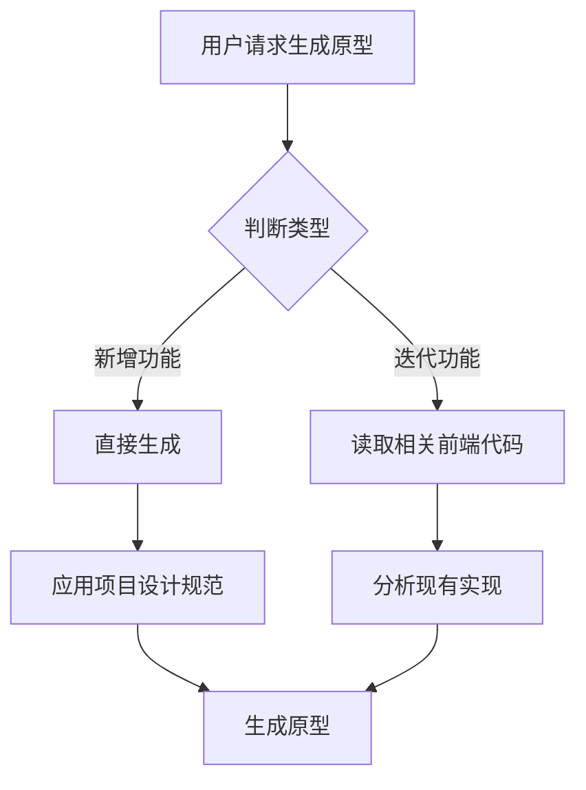

# 单文件原型生成器

生成独立的 HTML 原型文件，双击即可演示，样式参考项目设计系统。

## Quick Start

1. 判断类型（新增 / 迭代）→ 2. 确定风格（管理后台 / 移动端）→ 3. 从 [templates.md](references/templates.md) 复制 CDN 与模板 → 4. 生成 `docs/prototype/{feature}/index.html` → 5. 按 [verification-guide.md](references/verification-guide.md) 检查并修复

## CDN 强制约束（生成前必读）

- **唯一允许**：`https://fp.yangcong345.com/middle/base/` 下的资源
- **禁止使用**：unpkg.com、cdn.jsdelivr.net、cdnjs.cloudflare.com、element-plus.org 等任何其他 CDN
- **操作方式**：从 [templates.md](references/templates.md) 第 166-177 行**直接复制** CDN 标签，不得自行编写或改写 URL

## 核心特性

- **单文件输出**: `docs/prototype/{feature}/index.html`
- **零依赖**: CDN 引入 Vue3/Element Plus，无需 npm install
- **样式一致**: 自动应用项目设计标准（颜色/字体/间距）
- **立即可用**: 双击打开或本地服务器预览

---

## 项目结构说明

项目实际代码位于 **根目录** 下，常见结构：

| 目录               | 用途                        | 原型类型          |
| ------------------ | --------------------------- | ----------------- |
| `ainative-shadow/` | 后台管理系统（PC 端）       | 管理后台原型      |
| `ainative-app/`    | 小程序（移动端）            | 移动端/小程序原型 |
| `frontend/`        | 单前端项目（如 Mind2Build） | 按实际用途判断    |

**路径解析规则**：生成原型前，先检查 根目录下 下存在 `ainative-shadow`、`ainative-app`、`frontend` 中的哪些目录，再确定参考代码的根路径 `{root}`。

---

## 快速生成流程

### Step 0: 判断原型类型（新增 vs 迭代）

**新增**：用户描述的是全新页面/功能，项目中无对应 views 或 components → 直接生成，应用项目设计规范。

**迭代**：用户描述的是对已有页面/功能的改进（如「优化 Dashboard 统计卡片」「改进 PlatformList 的筛选」）→ 先读取相关前端代码，再基于现有实现生成一致的原型。



### Step 1: 确定原型类型

**管理后台** (ainative-shadow 风格):

- 数据列表、表单、仪表盘、统计卡片
- 使用 Element Plus 组件
- PC 端布局（最大宽度 1200px）

**移动端** (ainative-app 风格):

- 商品列表、表单、详情页、搜索
- 原生 HTML + Vue3
- 移动端优化（最大宽度 750px）

### Step 2: 应用设计标准（参考项目实际）

从项目提取设计 token。**来源文件**（按项目实际为 `ainative-shadow`、`ainative-app` 或 `frontend`）：

- **管理后台**：`ainative-shadow/src/style.css`、`ainative-shadow/src/App.vue`（若存在）；否则 `frontend/src/`
- **小程序**：`ainative-app/src/` 下对应样式与入口文件

若无法读取项目文件，使用 [templates.md](references/templates.md) 中的默认 Design Tokens。

### Step 3: 生成原型文件

**输出位置**: `docs/prototype/{feature-name}/index.html`

**文件骨架**：从 [templates.md](references/templates.md) 复制管理后台或移动端完整模板，CDN 见上方 CDN 强制约束。结构包含：`<head>` 内 CDN + 设计 CSS；`<body>` 内 `#app`、`prototype-badge`、页面内容；末尾 Vue3 挂载。

---

## 迭代场景：前端代码参考

当原型类型为**迭代**时，必须先读取相关前端代码，再生成与现有实现风格一致的原型。

**必读路径**（按功能域选择）：

- 页面级：`{root}/src/views/{domain}/{*.vue}` 或 `{root}/src/pages/{domain}/{*.vue}`
- 通用组件：`{root}/src/components/common/*.vue`
- 领域组件：`{root}/src/views/{domain}/components/*.vue` 或 `{root}/src/pages/{domain}/components/*.vue`
- 样式：`{root}/src/style.css`、`{root}/src/App.vue` 的 style 块

**参考要点**：布局结构、组件组合、颜色/间距/圆角/阴影、数据流、图标使用。

详细说明见 [iteration-guide.md](references/iteration-guide.md)。

---

## 原型标记规范

### 顶部注释

```html
<!--
  原型名称: 用户列表
  创建时间: 2026-02-03
  
  功能说明:
  - 用户列表展示
  - 搜索筛选
  - CRUD 操作
  
  如何使用:
  1. 双击打开或使用本地服务器
  2. 测试核心功能
  
  原型限制:
  - 使用模拟数据
  - 未实现真实 API
  
  下一步:
  1. 在项目中创建正式组件
  2. 对接后端 API
-->
```

### 视觉徽章

```html
<div class="prototype-badge">🚧 原型</div>
```

---

## 开发检查清单

生成原型前确认：

- [ ] 已判断类型（新增 / 迭代）
- [ ] 确定类型（管理后台/移动端）
- [ ] 选择合适的基础模板
- [ ] CDN 将使用 templates.md 指定链接（见上方 CDN 强制约束）
- [ ] 应用项目设计标准
- [ ] **若为迭代**：已读取相关 `{root}/src/views/` 或 `{root}/src/pages/` 与 `{root}/src/components/` 代码
- [ ] 设计 token 已与项目实际样式文件对齐

---

生成原型后确认：

- [ ] 单个 HTML 文件
- [ ] 包含顶部功能说明注释
- [ ] 包含原型标记徽章
- [ ] 核心功能可演示
- [ ] 保存到 `docs/prototype/{feature}/index.html`
- [ ] **若为迭代**：布局与组件风格与现有页面一致

---

## 生成后验证与修复（强制执行，不得跳过）

生成 `index.html` 后，**必须**按 [verification-guide.md](references/verification-guide.md) 完成四步验证：

1. **检查 HTML 结构完整性**：DOCTYPE、标签闭合、CDN 引用（仅 fp.yangcong345.com）、Vue 挂载
2. **检查 JS 运行时安全性**：ref/reactive 初始值、可选链、v-for 数组非 null
3. **修复所有未通过项**：按 verification-guide 中的修复表格处理
4. **确认完成**：输出验证通过信息

---

## 附加资源

| 资源                                                      | 说明                                                  |
| --------------------------------------------------------- | ----------------------------------------------------- |
| [templates.md](references/templates.md)                   | 管理后台/移动端完整模板、CDN 资源、默认 Design Tokens |
| [verification-guide.md](references/verification-guide.md) | 生成后四步验证与修复完整清单                          |
| [common-prototypes.md](references/common-prototypes.md)   | 常用功能片段、常见组件、快速参考、打开方式            |
| [iteration-guide.md](references/iteration-guide.md)       | 迭代场景详细指南、功能域推断                          |
| [shadow-examples.md](references/shadow-examples.md)       | 管理后台完整示例（用户列表、数据仪表盘）              |
| [app-examples.md](references/app-examples.md)             | 移动端完整示例（商品列表、表单提交）                  |
