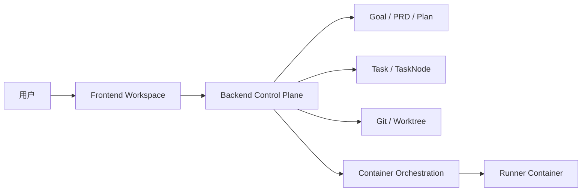
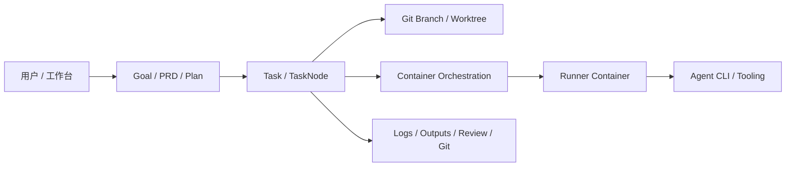
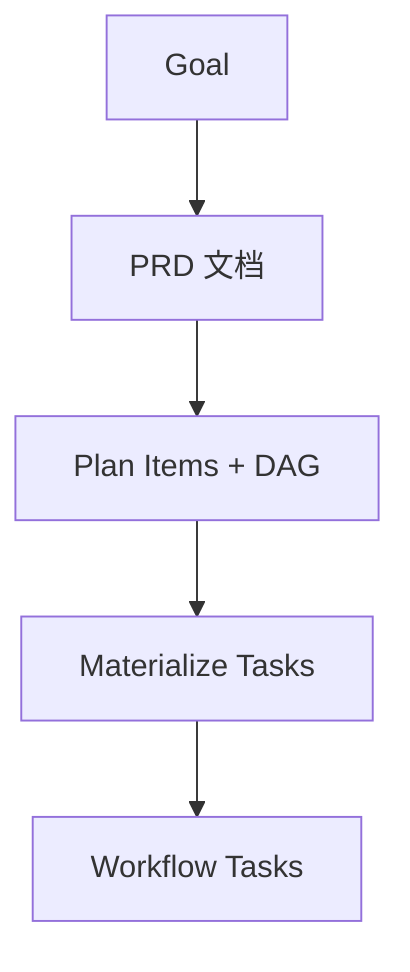

# 《AINative 技术分享：把 AI 执行纳入工程控制链的一次系统化实现》

> 受众：前后端 / 平台 / 工程架构同学  
> 文章目标：从代码实现层面解释 AINative 为什么不是一个“接了模型的聊天壳”，而是一套把需求治理、任务执行、容器隔离、Git 落地和前端工作台串起来的工程控制系统。  
> 作者：Codex｜时间：2026-04-12  
> 一句话总结：AINative 的核心不在于“让模型会写代码”，而在于把 AI 执行放回 `Goal -> PRD -> Plan -> Task -> Runner -> Git -> Review` 这条可治理、可审计、可复现的工程链路中。  
> 核心判断：这个仓库真正有价值的地方，不是某个 agent 调用点，而是它把“规划错误”和“执行错误”拆到了不同对象层，把“控制面”和“执行面”拆到了不同运行边界。  
> 读者收益：读完后，你应该能回答 3 个问题：AINative 的对象边界是什么、一次任务是如何从需求走到容器执行的、前端架构为何要配合后端控制模型一起设计。

---

## 目录

1. [背景与业务价值](#1-背景与业务价值why)
2. [现状与问题分析](#2-现状与问题分析what)
3. [方案设计](#3-方案设计how)
4. [落地与实施](#4-落地与实施do)
5. [效果与收益](#5-效果与收益result)
6. [经验复盘](#6-经验复盘learn)
7. [后续规划](#7-后续规划next)
8. [附录](#8-附录)

---

## 1. 背景与业务价值（Why）

### 1.1 AINative 解决的不是“生成代码”，而是“让 AI 可交付”

如果把 AI Coding 理解成“用户输入一句话，模型生成一段代码”，那么系统的核心工作会被误判成 prompt 调优、模型切换和 UI 包装。但这个仓库的实现已经明确走向了另一条路线：

- 需求不是直接进入执行，而是先进入 `Goal -> PRD -> Plan` 的治理链。
- 执行不是直接在宿主机 shell 上跑，而是进入 per-task runner 容器。
- 结果不是留在对话历史里，而是回写为任务状态、日志、产物、Git worktree 和后续可审阅对象。

从仓库结构也能看出这不是单端工具，而是一套完整的工程工作台：

| 目录 | 角色 |
|---|---|
| `frontend/` | 工作台前端，组织需求、任务、日志、环境、Git、评审交互 |
| `backend/` | 控制面，承载 API、状态机、Git/worktree、容器编排、任务调度 |
| `runner/` | 执行面镜像与配置渲染，支撑隔离运行与 preview/sandbox 画像 |
| `docs/technical/` | 架构与执行模型沉淀 |

对应入口可直接看：

- [README.md](./README.md)
- [package.json](./package.json)
- [docker-compose.yml](./docker-compose.yml)

### 1.2 为什么这个问题值得讲

AINative 的难点不在“模型能不能产出代码”，而在“这段产出怎么被团队稳定接住”。从工程视角，这类系统会天然面对 4 个问题：

1. 大需求如何拆分，而不是把 PRD、方案、实现全塞进一次对话。
2. 多个子任务如何表达依赖，并决定谁先做、谁后做、谁可以并行。
3. 执行如何脱离个人机器环境，变得可复现、可审计、可回放。
4. 前端工作台如何把这些状态和动作组织成长期可维护的产品，而不是不断堆页面逻辑。

AINative 的代码实现说明，团队已经把这些问题从“流程约定”推进到了“系统对象 + 门禁 + 基础设施”。

### 1.3 为什么现在必须做

这个系统显然是在真实研发协作背景下演进出来的，而不是先有一个宏大架构图再去填实现。几个非常明显的信号是：

- 根目录已经有完整的本地开发与 Docker 启动链路，而不是仅有 demo 启动脚本。
- 后端已经存在 `goals`、`tasks`、`workflow-templates`、`containers`、`git`、`observability` 等模块，说明系统不是单一 agent 调用器。
- 前端已经引入五分区架构和依赖门禁，说明复杂度已经达到必须显式管理边界的程度。

也就是说，AINative 当前阶段的核心任务，不再是“做出 AI 功能”，而是“把 AI 功能纳入工程控制链”。

### 1.4 目标与成功标准

结合当前代码实现，这个系统的目标可以归纳成 4 个“可”：

- 可治理：需求有 `Goal / PRD / Plan` 中间态，而不是只剩 task。
- 可复现：任务运行在隔离 worktree 与容器里，而不是依赖个人本机状态。
- 可审计：任务、节点、日志、输出、Git 变更、环境状态都有结构化落点。
- 可协作：前端工作台能让规划、执行、审批、回看在同一系统里完成。

---

## 2. 现状与问题分析（What）

### 2.1 当前系统已经具备“控制系统”的雏形

如果只看功能名，这个仓库可能会被理解成“任务管理 + AI 执行”。但从实现关系来看，它更像一个把软件交付过程对象化的系统：

- `Goal` 承载需求级对象与 PRD / Plan 文档路径。
- `GoalPlanItem / GoalPlanSubTask` 承载结构化计划与依赖。
- `Task / TaskNode` 承载真正可执行的工作流单元。
- `TaskRuntimeService` 承载 Git branch / worktree 的准备与清理。
- `ContainerOrchestrationService` 承载 runner 的 ensure / reuse / replace / remove。
- `TaskGitService` 承载任务级 Git 读写、diff、PR link、artifact 预览。
- 前端以 `pages -> features -> api` 方式把这些对象暴露为工作台。

这几个层次拼起来，系统边界大致可以画成：

### 2.2 真正的问题不在模型，而在 3 类控制能力缺失

#### 第一类：需求控制

没有 `Goal` 层时，大需求只能直接落到 task。这样会导致：

- PRD 与执行对象混杂。
- 计划项没有独立编辑、确认、重排、依赖表达空间。
- 任务失败后，很难判断是“需求没想清楚”还是“执行没跑对”。

#### 第二类：执行控制

如果任务执行直接依赖本机 shell，即使模型输出正确，系统仍会被这些问题拖垮：

- 本机依赖差异。
- 临时文件、当前目录、缓存状态污染。
- 无法明确“某次执行到底发生在哪个环境里”。

#### 第三类：交付控制

没有统一状态机和产物模型时，系统无法稳定回答：

- 当前任务是没开始、处理中、待人工介入，还是已完成待收口？
- 某个节点失败后，接下来是 retry、reply、approve 还是 repeat？
- 某次执行的日志、stdout/stderr、工作区改动、Git 提交对应哪个执行节点？

### 2.3 证据来源

这篇文章的主要证据来自以下实现与文档：

- 需求治理与 DAG：
  - [backend/src/goals/goals.service.ts](./backend/src/goals/goals.service.ts)
  - [backend/src/goals/goal-plan-dag.ts](./backend/src/goals/goal-plan-dag.ts)
- 任务执行与状态：
  - [backend/src/tasks/application/task-command.service.ts](./backend/src/tasks/application/task-command.service.ts)
  - [backend/src/tasks/application/task-node-execution.service.ts](./backend/src/tasks/application/task-node-execution.service.ts)
  - [backend/src/tasks/application/task-status.service.ts](./backend/src/tasks/application/task-status.service.ts)
  - [docs/technical/task-status-state-machine.md](./docs/technical/task-status-state-machine.md)
- 容器与 runner：
  - [backend/src/containers/container-orchestration.service.ts](./backend/src/containers/container-orchestration.service.ts)
  - [backend/docs/task-container-execution-boundaries.md](./backend/docs/task-container-execution-boundaries.md)
  - [backend/docs/task-runner-sandbox-models.md](./backend/docs/task-runner-sandbox-models.md)
  - [runner/render-runner-config.mjs](./runner/render-runner-config.mjs)
- Git / repository / worktree：
  - [backend/src/tasks/task-runtime.service.ts](./backend/src/tasks/task-runtime.service.ts)
  - [backend/src/tasks/task-git.service.ts](./backend/src/tasks/task-git.service.ts)
  - [backend/src/git/git.service.ts](./backend/src/git/git.service.ts)
  - [backend/src/projects/project-repository-workspace.service.ts](./backend/src/projects/project-repository-workspace.service.ts)
- 前端工作台：
  - [frontend/src/pages/tasks/detail.vue](./frontend/src/pages/tasks/detail.vue)
  - [frontend/src/features/tasks/TaskDetailPage.vue](./frontend/src/features/tasks/TaskDetailPage.vue)
  - [frontend/src/features/tasks/use-task-detail-page.ts](./frontend/src/features/tasks/use-task-detail-page.ts)
  - [frontend/src/pages/goals/GoalDetail.vue](./frontend/src/pages/goals/GoalDetail.vue)
  - [frontend/src/features/goals/composables/useGoalDetailData.ts](./frontend/src/features/goals/composables/useGoalDetailData.ts)
  - [frontend/src/features/goals/composables/useGoalDetailPlanItems.ts](./frontend/src/features/goals/composables/useGoalDetailPlanItems.ts)
  - [docs/dev-spec/frontend/ARCHITECTURE.md](./docs/dev-spec/frontend/ARCHITECTURE.md)

---

## 3. 方案设计（How）

### 3.1 设计原则

#### 原则一：先治理再执行

AINative 把大需求拆成 `Goal -> PRD -> Plan -> Task`，这是整个系统最关键的设计分层。`Goal` 不是 task 的别名，而是一个把需求整理、PRD 生成、计划生成、计划确认和任务物化串起来的上层对象。

`GoalsService` 已经把这条链路写得非常明确：

- 创建 Goal 时先从基线分支创建需求分支，说明需求对象天生带 Git 边界，而不是之后再补。见 [backend/src/goals/goals.service.ts](./backend/src/goals/goals.service.ts)
- 生成 PRD 和 Plan 时强制要求业务线 Agent 配置，且明确禁止退回到普通 knowledge prompt。说明 PRD / Plan 被视为正式生产对象，不是随便问模型。见 [backend/src/goals/goals.service.ts](./backend/src/goals/goals.service.ts)
- 生成 Plan 后会把模型输出规范化成 `GoalPlanItem / GoalPlanSubTask`，再做依赖校验与文档落库。见 [backend/src/goals/goals.service.ts](./backend/src/goals/goals.service.ts)

这里有一个很工程化的细节：系统并没有信任 agent 一次性产出的 JSON，而是专门处理了 stream-json / NDJSON 这类输出形式，先从 assistant 消息中提取正文，再解析目标 JSON。这说明实现者已经把“LLM 输出不总是规整 JSON”当作真实的基础设施问题来处理，而不是只在 prompt 里祈祷。

#### 原则二：依赖必须显式建模，并且前后端保持一致

`backend/src/goals/goal-plan-dag.ts` 做了三件很重要的事：

1. 把依赖语义固定为 `pred -> succ` 的有向边。
2. 用 DFS 三态法检测计划图中的环。
3. 在任务物化前，按拓扑顺序给出安全创建顺序。

这不是单纯算法题，而是产品交互的底座。因为一旦 `Plan` 被设计成可编辑对象，系统就必须能回答：

- 哪些子任务现在可以确认？
- 哪些子任务现在可以物化成 task？
- 一次批量物化时应该按什么顺序创建？

更关键的是，前端没有重新发明一套逻辑，而是明确在 [frontend/src/features/goals/utils/goal-plan-materialize-order.ts](./frontend/src/features/goals/utils/goal-plan-materialize-order.ts) 里复制了后端拓扑排序，并在注释中声明“与 backend 保持一致”。这说明前后端并不是各自猜测依赖语义，而是在共享同一套计划图模型。

#### 原则三：控制面与执行面分离

AINative 最值得肯定的地方之一，是没有把所有能力都塞进 runner 容器，也没有把所有执行都留在宿主进程。

当前边界很清晰：

- 控制面负责 API、权限、持久化、状态、调度、Git/worktree、容器编排。
- 执行面负责在 per-task runner 容器里运行 agent CLI 以及后续可能迁移进去的命令执行。

边界说明文档已经写得很明确：

- [backend/docs/task-container-execution-boundaries.md](./backend/docs/task-container-execution-boundaries.md)
- [backend/docs/task-runner-sandbox-models.md](./backend/docs/task-runner-sandbox-models.md)

这条边界的价值在于，系统避免了两个极端：

- 没有停留在“宿主机直接跑 agent”的脆弱模式。
- 也没有一开始就把完整开发环境、Git 控制、调度逻辑全部塞进每个容器。

### 3.2 方案选型与对比

| 方案 | 描述 | 优点 | 缺点/风险 | 适用场景 | 结论 |
|---|---|---|---|---|---|
| A | 直接把 PRD、计划和依赖都继续塞进 `task` | 改造最少 | 治理与执行混杂，中间态不清晰 | 临时 MVP | 不选 |
| B（最终） | 新增 `Goal` 层，形成 `Goal -> PRD -> Plan -> Task` | 中间态清晰，可校验、可物化、可复盘 | 引入更多对象和页面 | 中大型需求治理 | 选 |
| C | 直接让模型产出动态图并全自动执行 | 自动化最强 | 计划错误直接传导到执行链路，解释和回滚成本高 | 后续演进 | 暂不选 |

### 3.3 为什么最终选择这个方案

- 为什么不选 A：因为 A 本质上还是“执行对象兼任治理对象”。当系统需要表达“PRD 已确认但任务尚未创建”时，task 已经不再是合适边界。
- 为什么当前不选 C：系统现在最需要的是把治理链稳定下来，而不是让规划与执行一次性强耦合。先把中间态和依赖图立住，才有资格进一步自动化。
- 为什么 B 最合适：B 最大化复用了现有 task 执行基础设施，同时只在真正缺失的地方引入新对象，这比“整体重写”为可控得多。

### 3.4 目标架构（To-Be）

### 3.5 核心流程

#### 链路 A：Goal -> PRD -> Plan -> Task

这条链路在 `GoalsService` 中是完整闭环的：

- 创建 Goal 时即创建需求分支。
- 生成 PRD 时写入项目文档。
- 生成 Plan 时把 LLM 输出规范化为结构化计划项，并做环检测。
- 物化任务时按拓扑顺序创建 task，并把子任务依赖同步成 task 依赖边。

特别值得注意的是“物化任务”这一步不是简单批量 create。`materializeTasks()` 还做了几层硬约束：

- 子任务必须先处于 `approved`。
- 子任务必须先配置 workflow template。
- 所在功能组必须先拥有 Git 分支。
- 前置功能组的全部子任务必须对应 task 且都已完成。
- 前置子任务必须先完成，当前子任务才能物化。

这说明系统把“计划依赖”真正下沉成了“执行门禁”，而不是只在 UI 里画一张图。

#### 链路 B：Task -> Worktree -> Runner -> Node Execution

`TaskCommandService.create()` 把任务初始化做成了一个非常完整的工程操作：

- 先根据 `workflowTemplateId` 解析任务模式和节点列表。
- 为 workflow task 生成节点级 `agentCliId / agentCliConfigId / loopJson / input`。
- 统一分配 `gitBranch`、`gitBaseBranch`、`gitWorktree`。
- 调用 `TaskRuntimeOrchestrator.initializeTaskRuntime()` 准备运行时。

随后 `TaskRuntimeService.ensureRuntime()` 负责真正的 worktree 边界：

- 计算并校验 allowed root。
- 为任务解析分支与 worktree 标识。
- 在 Git runtime 打开时创建或复用 Git worktree。
- 在 Git runtime 关闭时至少确保目录安全约束成立。

这一层非常关键，因为它把“任务执行”变成了“在独立工作树上执行”，从而为后续容器 bind mount 和 Git diff 提供了稳定基础。

#### 链路 C：Node Execution -> Container Ensure -> Agent Run -> Status/Output Writeback

`TaskNodeExecutionService.runNode()` 基本展示了系统级执行主线：

1. 读取并确认节点仍处于 `in_progress`。
2. `ensureRuntime()`，获得 worktree、分支、基线等上下文。
3. 记录执行前 commit SHA。
4. 写入“Runner attached to node”日志。
5. 调用 `ContainerOrchestrationService.ensureContainer()`。
6. 通过 `docker exec` 进入 runner 启动 agent。
7. 写日志、输出 JSONL、提交工作区改动、更新 node/task 状态。
8. finally 中统一重算任务状态。

这条链不是“后端直接调一下 LLM”，而是完整的工程执行编排。

### 3.6 关键模块拆解

| 模块 | 角色 | 为什么重要 |
|---|---|---|
| `GoalsService` | 需求治理中心 | 负责 PRD/Plan 生成、依赖校验、任务物化 |
| `TaskCommandService` | 任务创建中心 | 负责 workflow 节点生成、branch/worktree 绑定 |
| `TaskNodeExecutionService` | 节点执行编排 | 把 runtime、container、agent、output、status 串起来 |
| `TaskStatusService` | 状态聚合与生命周期收口 | 用最少状态表达复杂执行语义，并触发容器清理 |
| `ContainerOrchestrationService` | runner 生命周期管理 | 决定复用、替换、端口、profile、slot heartbeat |
| `TaskGitService` | 任务级 Git 能力面 | 让工作台能直接看 diff、提交、推送、生成 PR link |
| `pages/features/api/shared` | 前端职责分层 | 保证工作台在复杂度上升后仍能维护 |

### 3.7 方案边界与适用范围

这套方案最适合以下问题：

- 一个需求要经过“整理 -> 拆分 -> 审阅 -> 多任务执行”。
- 执行需要隔离环境、Git worktree 和审计日志。
- 产品想把 AI 从“建议工具”提升为“受控执行者”。

它不适合极轻量、一次性的小脚本场景。在那类问题里，直接本机调用 CLI 成本更低。

---

## 4. 落地与实施（Do）

### 4.1 需求治理如何落地到代码

#### Goal 创建阶段：先建立需求分支

`GoalsService.create()` 在创建 Goal 时，会先调用 `GitService.createBranch()` 从 `gitBaseBranch` 创建需求分支，然后再落库 Goal。这意味着：

- Goal 不是纯数据库对象。
- 它从一开始就与仓库分支绑定。
- 后续 PRD、Plan、Task 的变化都能自然落在同一需求分支上下文中。

更进一步，首次确认某个功能组下的子任务时，`ensurePlanItemGitBranchIfMissing()` 会从需求分支再派生功能组分支。这样形成了“需求分支 -> 功能组分支 -> 任务 worktree”的多层 Git 边界。

#### Plan 确认阶段：前置组和前置子任务都要满足

`materializeTasks()` 不是只检查“这个子任务有没有依赖”，它实际同时校验：

- 功能组依赖 `dependsOnItemIds`
- 子任务依赖 `dependsOnSubTaskIds`
- 前置 task 是否已创建
- 前置 task 是否已完成

然后再调用 `TaskProvisioningService.create()` 物化 task。最后还会把 plan 里的子任务依赖插入到 task 依赖关系中，形成计划图与执行图之间的映射。

这代表一个很成熟的工程判断：计划不是展示层对象，它必须落成执行系统能理解的关系边。

### 4.2 runner 容器不是“有就行”，而是有清晰画像

`ContainerOrchestrationService.ensureContainer()` 已经体现出比较成熟的 runner 策略：

- 优先 inspect 现有容器。
- 若容器 image 与 platform 都匹配，则直接复用。
- 若 image 或 platform 不匹配，则显式移除并重建。
- 若启用了 project slot 追踪，则同步 container runtime metadata，并开启 slot heartbeat。

同时，系统没有只提供一个容器模式，而是支持 3 种 sandbox profile：

- `runner-only`：轻量模式，容器主进程只是占位，真正执行通过 `docker exec` 触发。
- `preview-web`：runner 用镜像 entrypoint 启动，走 `supervisord + nginx + health check`。
- `full-dev-sandbox`：更重的完整 sandbox 画像。

这些模式在文档与脚本中都有对应证据：

- [backend/docs/task-runner-sandbox-models.md](./backend/docs/task-runner-sandbox-models.md)
- [runner/render-runner-config.mjs](./runner/render-runner-config.mjs)

`runner/render-runner-config.mjs` 也说明了一点：系统已经考虑了“当前 worktree 下究竟有哪些服务能启动”，并在 mono-repo 场景下动态生成较窄的 nginx / supervisord 配置，而不是假设每个 runner 都能照搬一套重型 sandbox。

### 4.3 状态机如何在最少状态数下表达复杂执行

AINative 对状态机的处理很克制：`task.status` 与 `task_node.status` 都只保留 4 态：

- `todo`
- `in_progress`
- `in_review`
- `done`

但语义是分层的：

- `task.in_review` 表示所有节点完成后的任务级最终确认。
- `task_node.in_review` 表示节点级必须人工介入。

`TaskStatusService.calculateTaskStatus()` 的聚合规则非常简单，但足够支撑关键流程：

- 全 `done` 才能进入任务级 `in_review`
- 全 `todo` 且任务未推进过才是 `todo`
- 其他一律 `in_progress`

这套设计避免了常见的“状态太多但没人分得清”的问题。相关说明文档见：

- [docs/technical/task-status-state-machine.md](./docs/technical/task-status-state-machine.md)

另一个重要细节是 `TaskStatusService.persistTaskStatus()` 在状态变化时还会触发：

- 同步 Goal 侧计划子任务状态
- workflow task 到达 `in_review` 时发送通知
- task `done` 后移除 runner 容器

这说明状态机不是 UI 展示枚举，而是驱动资源生命周期和通知行为的控制中枢。

### 4.4 前端工作台如何配合这个控制模型

#### 任务详情页：pages 薄壳，feature 承载复杂度

任务详情页的结构很能说明当前前端架构方向：

- [frontend/src/pages/tasks/detail.vue](./frontend/src/pages/tasks/detail.vue) 只保留 `<TaskDetailPage />`
- [frontend/src/features/tasks/TaskDetailPage.vue](./frontend/src/features/tasks/TaskDetailPage.vue) 负责页面级业务装配
- [frontend/src/features/tasks/use-task-detail-page.ts](./frontend/src/features/tasks/use-task-detail-page.ts) 负责交互逻辑、SSE、权限、按钮门禁、节点选择、右栏状态
- [frontend/src/api/tasks.ts](./frontend/src/api/tasks.ts) 负责对后端 Task API 的完整能力封装

这不是单纯的代码风格问题。AINative 这种工作台页面会天然聚合：

- 节点执行
- review 审批
- 环境启动/终止
- 日志流
- 产物预览
- Git diff / artifact / workspace 浏览

如果把这些逻辑直接堆在页面 SFC 里，复杂度会很快失控。当前分层至少保证了“路由入口薄、feature 汇聚业务、api 承担契约”。

#### 目标详情页：Plan 的交互门禁前移到 UI

Goal 详情页同样是薄壳：

- [frontend/src/pages/goals/GoalDetail.vue](./frontend/src/pages/goals/GoalDetail.vue)

真正的状态与动作收敛在组合式逻辑里：

- [frontend/src/features/goals/composables/useGoalDetailData.ts](./frontend/src/features/goals/composables/useGoalDetailData.ts)
- [frontend/src/features/goals/composables/useGoalDetailPlanItems.ts](./frontend/src/features/goals/composables/useGoalDetailPlanItems.ts)

这里有两个很值得肯定的实现点：

1. 前端会直接计算计划图是否有环，并生成 Mermaid 依赖图，帮助用户理解计划结构。
2. 前端会提前计算“为什么不能确认 / 不能物化”，例如前置功能组未完成、前置 task 未完成、workflow template 未配置。

也就是说，AINative 没有把所有约束都留给后端 400 报错，而是在前端工作台里尽可能把门禁解释成可理解的阻塞原因。

#### 五分区不是形式主义，而是复杂度保护机制

前端架构文档已经把这个项目定义成五分区：

- `app`
- `pages`
- `features`
- `api`
- `shared`

见 [docs/dev-spec/frontend/ARCHITECTURE.md](./docs/dev-spec/frontend/ARCHITECTURE.md)

在 AINative 这种系统里，这种分层尤为重要，因为一个页面往往会同时接触：

- domain 对象状态
- 实时流
- 权限门禁
- 产物浏览
- 容器环境状态
- Git 能力

如果没有明确的 feature 公开能力和 API 契约层，复杂度会快速扩散成“哪个页面都能直接调任何东西”。当前目录结构和最近提交中的前端架构治理，说明团队已经意识到这个问题并在主动收束。

### 4.5 Git 与 repository 工作区如何被平台化

AINative 没有把 Git 只当作一个“执行后顺手 commit”的动作，而是把它做成了系统能力的一部分：

- `ProjectRepositoryWorkspaceService` 负责项目仓库 clone / fetch / lock / remote auth。
- `TaskRuntimeService` 负责任务 worktree 的创建与清理、安全边界校验。
- `TaskGitService` 负责任务级状态、diff、branch diff、stage/unstage/commit/push、artifact 预览。
- `GoalsService` 负责需求分支与功能组分支。

这条链路意味着 AINative 的“AI 交付”不是只停留在生成 patch，而是能够把 Git 作为控制链的一等公民。

---

## 5. 效果与收益（Result）

### 5.1 关键结果

当前仓库最有说服力的结果，不是某个单点功能，而是形成了一条较完整的受控执行主线：

- 大需求不必直接压成一次 task，可先落到 Goal / PRD / Plan。
- 计划依赖不是展示信息，而会被真正转化为任务物化与推进门禁。
- 任务执行不依赖个人本机环境，而是绑定到 worktree 和 runner 容器。
- 任务结果不是只在会话里消费，而能回写成日志、输出、Git 差异、任务状态。
- 前端工作台不是简单控制台，而是能承载计划、执行、审批、环境、日志、Git 的统一操作面。

### 5.2 工程收益

- 结构性收益：系统对象边界明显变清晰了。`Goal` 管治理、`Task` 管执行、runner 管隔离、Git/worktree 管落地。
- 工程收益：执行环境更可复现，排障入口更明确，状态机与日志模型能真正承接人工 review。
- 协作收益：产品 / 研发 / 平台在同一条链路上协作，不必把需求规划、执行日志、代码改动散落在多个工具里。

### 5.3 当前证据边界

这篇文章主要基于代码实现和仓库文档，不主张夸大业务 KPI。当前公开证据更充分的是“工程收益”和“结构性收益”，而不是对外可披露的量化业务指标。

如果后续要补更强的数据化证明，建议优先补这些指标：

- 从 Goal 创建到首个可执行 Task 的平均周期
- 因环境问题导致的执行失败占比
- task / node 的 review 轮次变化
- 排障平均耗时
- 大需求拆分后返工次数变化

---

## 6. 经验复盘（Learn）

### 6.1 做对了什么

#### 1. 新增了真正缺失的边界，而不是重写一切

AINative 没有因为要做“需求治理”就推翻已有 task 体系，而是只增加了 `Goal` 层，并把它和已有 task / workflow template / Git 基础设施打通。这是非常成熟的演进方式。

#### 2. 把中间态当作正式对象，而不是 prompt 产物

PRD 被写入项目文档，Plan 被写成结构化对象，依赖会被校验，子任务会被物化成 task。这使得“中间态治理”从概念变成了平台能力。

#### 3. 把容器当执行平面，而不是万能承载层

控制面保留在 NestJS 主机侧，runner 只承接隔离执行。这个边界既让系统获得可复现执行，又避免过早把所有复杂度搬进容器。

#### 4. 前后端在依赖语义上保持了显式一致

无论是 DAG 拓扑排序，还是“某个子任务为什么现在不能创建”，前后端都在围绕同一套依赖规则工作。这对复杂工作台极其重要。

### 6.2 踩坑与隐含成本

#### 1. LLM 输出解析不是“配个 JSON schema”就结束

`GoalsService` 里对 stream-json / NDJSON 的处理说明，真实 agent 输出远比理想 JSON 复杂。只靠 prompt 约束是不够的，必须有稳健的后处理与重试。

#### 2. 状态少不代表逻辑简单

AINative 只保留了 4 态状态机，但为了让这 4 态真正可用，系统在聚合规则、按钮门禁、任务完成条件、review 语义上做了大量精细设计。状态克制的代价是语义必须更严谨。

#### 3. 五分区架构需要持续纪律维护

目录结构本身不会自动带来架构收益。只有配合 lint、依赖门禁、公共入口约束，五分区才会真正保护复杂度。

### 6.3 可复用的方法论

- 方法论 1：先引入中间态，再谈自动执行。
- 方法论 2：把依赖图从“展示信息”推进为“系统门禁”。
- 方法论 3：把控制面与执行面拆开，让控制逻辑稳定、执行环境隔离。
- 方法论 4：让前端工作台直接承接系统对象，而不是只做命令按钮集合。

### 6.4 如果重来一次，可以进一步做得更好

- 更早统一“计划图 -> 任务图 -> Git 分支图”的可视化模型。
- 更早沉淀量化指标，避免后期只能用结构性收益描述效果。
- 更早把部分通用执行协议抽象出来，降低未来接入更多 agent CLI 的成本。

---

## 7. 后续规划（Next）

### 7.1 可能的演进方向

- 方向 1：把 `Plan` 从“可编辑列表 + DAG”继续推进为更强的执行图模型，但仍保留人工确认与回滚能力。
- 方向 2：把更多工具执行统一纳入 runner 内同一条 `docker exec` 通道，而不只限于 agent CLI。
- 方向 3：补齐需求治理与执行结果之间的量化观测面，形成更完整的平台指标。
- 方向 4：继续收束前端 feature 公共 API 和 legacy 目录，降低工作台复杂度外溢。

### 7.2 暂不建议激进推进的方向

- 暂不建议过早做“全自动 DAG 执行”并省掉人工确认，因为当前系统的价值恰恰在于把治理与执行拆开，而不是再次把它们耦合回去。
- 暂不建议把 Git / worktree / 调度整体搬进 runner，否则会破坏目前清晰的控制面边界。

---

## 8. 附录

### 8.1 关键术语表

| 术语 | 含义 |
|---|---|
| Goal | 需求级治理对象，承载 PRD / Plan / 需求分支等信息 |
| Plan Item / SubTask | 结构化计划项与子任务，表达依赖与物化前门禁 |
| Task / TaskNode | 真正可执行的工作流对象与节点 |
| Control Plane | 后端控制面，负责权限、状态、调度、Git/worktree、容器编排 |
| Execution Plane | runner 执行面，负责容器内 agent CLI 与后续工具执行 |
| Worktree | 每个任务绑定的独立 Git 工作树，用于隔离代码修改 |

### 8.2 关键链接 / 证据索引

- 系统入口：
  - [README.md](./README.md)
  - [package.json](./package.json)
  - [docker-compose.yml](./docker-compose.yml)
- 需求治理：
  - [backend/src/goals/goals.service.ts](./backend/src/goals/goals.service.ts)
  - [backend/src/goals/goal-plan-dag.ts](./backend/src/goals/goal-plan-dag.ts)
- 任务执行：
  - [backend/src/tasks/application/task-command.service.ts](./backend/src/tasks/application/task-command.service.ts)
  - [backend/src/tasks/application/task-node-execution.service.ts](./backend/src/tasks/application/task-node-execution.service.ts)
  - [backend/src/tasks/application/task-status.service.ts](./backend/src/tasks/application/task-status.service.ts)
  - [backend/src/tasks/tasks.controller.ts](./backend/src/tasks/tasks.controller.ts)
- Git / worktree：
  - [backend/src/tasks/task-runtime.service.ts](./backend/src/tasks/task-runtime.service.ts)
  - [backend/src/tasks/task-git.service.ts](./backend/src/tasks/task-git.service.ts)
  - [backend/src/git/git.service.ts](./backend/src/git/git.service.ts)
  - [backend/src/projects/project-repository-workspace.service.ts](./backend/src/projects/project-repository-workspace.service.ts)
- 容器执行：
  - [backend/src/containers/container-orchestration.service.ts](./backend/src/containers/container-orchestration.service.ts)
  - [backend/docs/task-container-execution-boundaries.md](./backend/docs/task-container-execution-boundaries.md)
  - [backend/docs/task-runner-sandbox-models.md](./backend/docs/task-runner-sandbox-models.md)
  - [runner/render-runner-config.mjs](./runner/render-runner-config.mjs)
- 前端工作台：
  - [frontend/src/pages/tasks/detail.vue](./frontend/src/pages/tasks/detail.vue)
  - [frontend/src/features/tasks/TaskDetailPage.vue](./frontend/src/features/tasks/TaskDetailPage.vue)
  - [frontend/src/features/tasks/use-task-detail-page.ts](./frontend/src/features/tasks/use-task-detail-page.ts)
  - [frontend/src/pages/goals/GoalDetail.vue](./frontend/src/pages/goals/GoalDetail.vue)
  - [frontend/src/features/goals/composables/useGoalDetailData.ts](./frontend/src/features/goals/composables/useGoalDetailData.ts)
  - [frontend/src/features/goals/composables/useGoalDetailPlanItems.ts](./frontend/src/features/goals/composables/useGoalDetailPlanItems.ts)
  - [docs/dev-spec/frontend/ARCHITECTURE.md](./docs/dev-spec/frontend/ARCHITECTURE.md)

### 8.3 推荐阅读顺序

- 想快速理解整体系统：先看第 1、3、4 节。
- 想重点理解执行模型：重点看第 3.5、4.2、4.3 节。
- 想重点理解前端工作台与架构：重点看第 4.4 节和附录前端证据。
