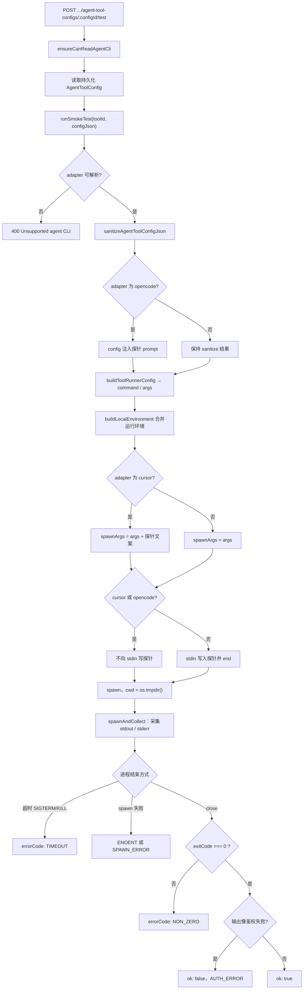

# Agent CLI 嗅探测试（Smoke Test）

在控制面所在机器上拉起真实 Agent CLI 进程，用极短提示验证「可执行、可连模型、能正常结束」。工作目录为系统临时目录（`os.tmpdir()`），侧重 **连通性与凭证**，与具体业务仓库路径无关。

---

## 目标

- 验证业务线下某条 **Agent 工具配置**（`toolId` + `configJson`）在服务端环境中能否成功启动 CLI 并完成一轮最小对话。
- 使用固定英文探针文案 `E2E_PROBE_USER_MESSAGE`（要求模型只回复单词 `OK`），便于通过 **退出码 / stderr** 判断失败。

## 探测流程图

## 核心实现

| 项目 | 说明 |
|------|------|
| 服务类 | `backend/src/agent-execution/agent-cli-smoke-test.service.ts`（`AgentCliSmokeTestService`） |
| 配置清洗 | `sanitizeAgentToolConfigJson` + 各 `AgentCliAdapter` 的 `buildToolRunnerConfig` |
| 进程 | `LocalProcessLauncherService.spawn` |
| 与真实控制面对齐 | `buildLocalEnvironment` 与 `ControlPlaneAgentExecutionService.buildLocalEnvironment` 注释中说明一致：合并 `PATH`、`HOME`、`GEMINI_API_KEY` 等与运行相关的键 |

## 适配器差异（探针如何送入 CLI）

- **默认（如 Codex）**：将探针字符串写入 **stdin** 并 `end`。
- **OpenCode**：探针写入 **配置** 的 `prompt` 字段（stdin 不写）。
- **Cursor**：探针作为 **命令行最后一个参数** 追加，stdin 不写。

## 结果判定

- `exitCode === 0` 且输出中未命中鉴权失败启发式 → `ok: true`。
- 启发式：stdout/stderr 中出现 `401`、`403`、`unauthorized`、`invalid api key` 等 → 即使退出码为 0 也记为 `AUTH_ERROR`。
- 其他：`TIMEOUT`（超时杀进程）、`NON_ZERO`、`ENOENT`、`SPAWN_ERROR`。

## 超时

- 默认 `120_000` ms，上限 `600_000` ms。
- 环境变量：`AINATIVE_AGENT_CLI_SMOKE_TEST_TIMEOUT_MS`（正整数，超过上限会被截断）。

## HTTP API

- **方法/路径**：`POST /api/v1/business-lines/:businessLineId/agent-tool-configs/:configId/test`
- **鉴权**：JWT；能力校验走业务线 Agent CLI 读权限（见 `BusinessLinesService.testAgentToolConfig` → `ensureCanReadAgentCli`）。
- **请求体**：无（配置从持久化的 Agent 工具配置读取）。

## 响应 DTO

`AgentToolConfigSmokeTestResultDto`（`backend/src/business-lines/dto/agent-tool-config-smoke-test-result.dto.ts`）：

- `ok`, `exitCode`, `command`, `args`
- 可选：`stdoutPreview`, `stderrPreview`, `errorCode`（`ENOENT` | `TIMEOUT` | `NON_ZERO` | `SPAWN_ERROR` | `AUTH_ERROR`）

## 前端入口

- API：`frontend/src/api/business-lines.ts` → `testAgentToolConfig`
- 业务线管理面板：`useBlmAgentCli.ts` 中 `testAgentToolConfig`，由 `BusinessLineManagementPanelInner.vue` 触发

## 模块归属

`AgentExecutionModule` 提供 `AgentCliSmokeTestService`；业务线 `BusinessLinesModule` 注入并对外暴露上述 test 接口。

## 自动化测试

`backend/src/agent-execution/agent-cli-smoke-test.service.spec.ts`：退出码、stdin/参数行为、鉴权启发式等。

## 扩展新 Agent CLI 适配器时

需落实：**stdin / 末尾参数 / 写入配置** 的探针策略，以及 `buildLocalEnvironment` 是否包含运行所需的密钥与 PATH。
