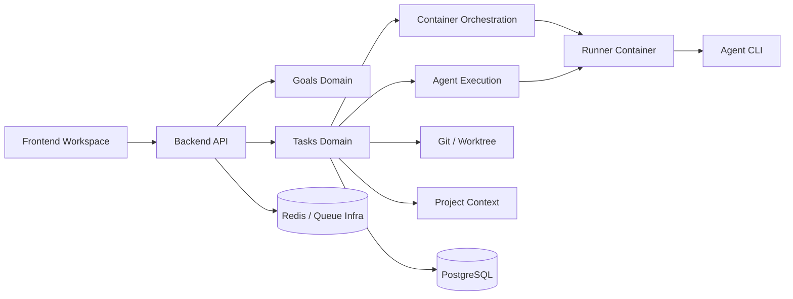
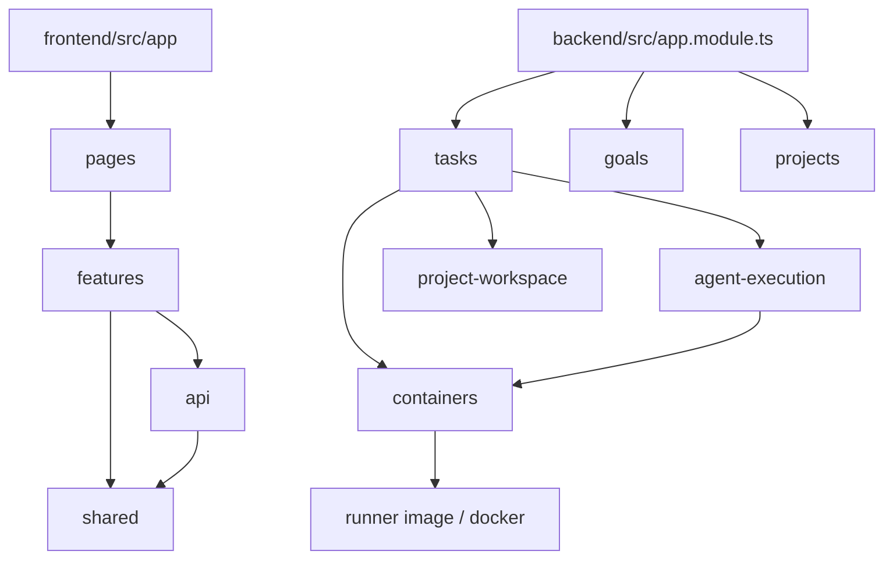
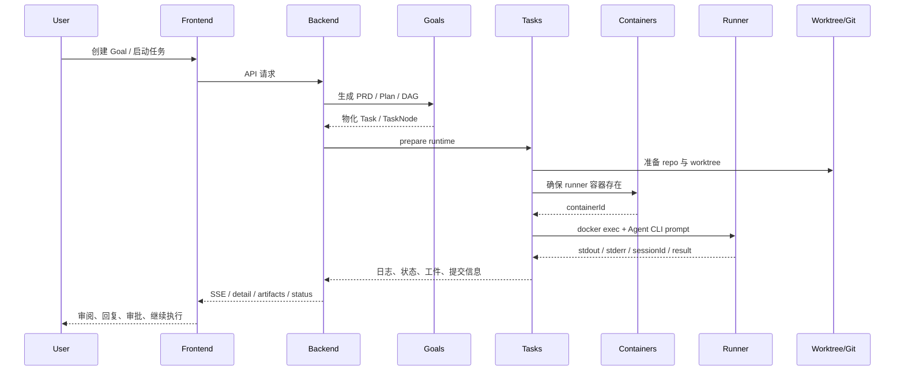

# AINative 技术分析文档

> 分析范围：`/Users/fuzhifei/code/go/src/gitlab.yc345.tv/frontend/ainative`
>  
> 分析日期：2026-04-11
>  
> 分析模式：Deep Analysis

## 1. 结论摘要

AINative 不是一个“把多个 Agent CLI 拼到同一界面里”的普通 AI 工具，而是一套围绕软件研发流程做工程化控制的 AI Native 工作台。它已经把需求治理、任务拆解、任务调度、容器隔离执行、Git 工作区管理、日志与工件回传、前端控制台交互，串成了一条比较完整的闭环。

当前代码最值得关注的不是模型接入，而是三个架构判断已经落地到真实代码：

1. 控制面与执行面分离。NestJS 后端负责权限、状态、调度与容器编排，真正的 Agent CLI 执行被强制下沉到 runner 容器。
2. 需求先治理再执行。`Goal -> Plan Item DAG -> Task -> TaskNode` 不是文档概念，而是后端的真实领域模型。
3. 前端不是展示壳。Vue 工作台承担了任务环境门禁、SSE 实时日志、人工回复、审批、工件预览和工作流节点交互。

从工程成熟度看，这是一个“高活跃度、强约束、仍在快速演化中的模块化单体”。优点是边界意识强、文档密度高、质量门禁存在；风险是复杂度在少数编排型文件持续聚集，未来需要继续把热点服务和热点页面拆薄。

## 2. 项目基本信息

| 项目 | 内容 |
| --- | --- |
| 名称 | AINative |
| 项目路径 | `/Users/fuzhifei/code/go/src/gitlab.yc345.tv/frontend/ainative` |
| 项目类型 | 本地全栈 monorepo |
| 主要语言 | TypeScript、Vue SFC、Markdown |
| 文件总数 | 1676（排除 `node_modules`、`dist`、`.git`、`tmp`） |
| 代码总行数 | 286,539 行 |
| 后端规模 | 611 文件，101,870 行 |
| 前端规模 | 512 文件，84,067 行 |
| 文档规模 | 50 份文档文件 |
| 测试文件 | 前端 53，后端 50 |
| 首次提交日期 | 2025-12-22 |
| 近 30 天提交 | 265 |
| 近 90 天提交 | 612 |
| 许可证 | 根目录未显式声明；`backend/package.json` 标记 MIT |

### 文件类型分布

- `.ts`: 733
- `.md`: 521
- `.vue`: 218
- `.json`: 57
- 其他：shell、yaml、mjs、css 等少量配套文件

## 3. 项目结构

```text
ainative/
├── backend/                  # NestJS 控制面与领域服务
│   ├── src/
│   │   ├── goals/            # Goal、计划项、任务物化
│   │   ├── tasks/            # 任务生命周期、运行时、SSE、终端、Git
│   │   ├── agent-execution/  # Agent CLI 适配与执行配置
│   │   ├── containers/       # runner 容器编排与执行槽位
│   │   ├── projects/         # 项目、仓库、工作区
│   │   ├── project-context/  # 项目上下文聚合
│   │   ├── skills/           # 技能配置与服务
│   │   └── ...               # auth、users、notifications、git、mcps 等
├── frontend/                 # Vue 3 工作台前端
│   ├── src/
│   │   ├── app/              # 装配层：入口、路由、全局 store、布局、指令
│   │   ├── pages/            # 路由页壳
│   │   ├── features/         # 业务能力实现
│   │   ├── api/              # API 封装与错误适配
│   │   ├── shared/           # 通用 UI、工具、常量、类型
│   │   └── types/            # 契约与路由类型
├── runner/                   # runner 镜像与容器启动脚本
├── cli/                      # 根命令行入口
├── docs/                     # 技术设计、规范、部署、计划文档
└── ai-analysis-docs/         # 本次分析输出
```

### 模块关系图



## 4. 技术栈

- 运行时
  - 根工作区：`pnpm`
  - Node.js：根目录要求 `^20.19.0 || >=22.12.0`
- 前端
  - Vue 3
  - Vue Router 5
  - Pinia
  - Vite 7
  - Tailwind CSS 4
  - Vitest、Playwright
  - `eslint-plugin-boundaries`、`dpdm` 用于架构约束和循环依赖检查
- 后端
  - NestJS 11
  - TypeORM 0.3
  - PostgreSQL 驱动 `pg`
  - JWT / Passport
  - `nestjs-i18n`
  - WebSocket、SSE
  - `node-pty`
- 执行面
  - Docker / docker compose
  - runner 镜像
  - 多 CLI adapter：Codex、Cursor、Claude、Gemini、Opencode

### 依赖与分层图



## 5. 核心能力

1. 业务线、项目、知识上下文与技能管理
2. Goal 到 Plan Item 的结构化规划
3. 任务与工作流节点的执行、审批、回复、重试、回放
4. Git 工作树、分支、diff、PR 链接与工件浏览
5. runner 容器隔离执行与环境生命周期控制
6. 前端统一工作台与任务详情控制台
7. 技能、MCP、自动化、通知等扩展能力

### 核心流程时序图



## 6. 架构设计

### 架构模式判断

- 模块化单体：后端所有业务域在一个 NestJS 应用内装配
- 分层架构：controller / application service / domain / infrastructure 多层混合
- 事件与流式交互：SSE、WebSocket、通知服务
- 控制面 / 执行面分离：后端编排，runner 执行
- 前端五分区 SPA：`app / pages / features / api / shared`

### 架构图

```mermaid
graph TB
    subgraph Frontend
        A1[app]
        A2[pages]
        A3[features]
        A4[api]
        A5[shared]
        A1 --> A2 --> A3 --> A4 --> A5
    end

    subgraph Backend Control Plane
        B1[Auth / Users / Access]
        B2[Goals / Projects]
        B3[Tasks / Git / Context]
        B4[Agent Execution]
        B5[Containers]
        B6[Notifications / Observability]
        B2 --> B3
        B3 --> B4
        B3 --> B5
    end

    subgraph Execution Plane
        C1[Runner Container]
        C2[Agent CLI]
        C3[Project Worktree]
        C1 --> C2
        C1 --> C3
    end

    Frontend --> Backend Control Plane
    Backend Control Plane --> Execution Plane
```

### 关键模块

| 模块 | 职责 | 关键判断 |
| --- | --- | --- |
| `backend/src/goals` | 需求治理、PRD、计划项、DAG、物化任务 | 把“规划”建模成独立阶段 |
| `backend/src/tasks` | 任务状态、节点执行、日志、终端、环境、工件 | 项目最核心的编排域 |
| `backend/src/agent-execution` | adapter 注册、prompt 渲染、runner config | 多 CLI 接入统一抽象 |
| `backend/src/containers` | runner 容器、执行槽位、预览地址、心跳 | 执行面基础设施抽象完整 |
| `backend/src/project-workspace` | repo 缓存、工作树路径、allowed root | 安全边界和存储布局集中管理 |
| `frontend/src/app` | 应用装配、路由、全局 store、守卫 | 装配层职责明确 |
| `frontend/src/pages` | 路由入口、轻编排 | 与 `features` 分离较清楚 |
| `frontend/src/features/tasks` | 任务详情、执行交互、右侧面板 | 前端复杂度核心热点 |

### 数据流判断

1. 页面层触发任务、Goal 或项目相关动作。
2. API 层统一走 `/api` 与后端控制器交互。
3. 后端应用服务完成权限校验、仓库与 runtime 准备。
4. 任务节点交给 runner 容器执行 Agent CLI。
5. 执行日志、状态、文件变化、提交信息回写数据库和工作区。
6. 前端通过 detail 刷新、SSE、文件树与工件预览感知结果。

## 7. 源码深挖

### 7.1 Goal 与计划 DAG

`backend/src/goals/goal-plan-dag.ts` 提供了三件关键能力：

- 从 `dependsOnItemIds` 构建邻接表
- 做有向图环检测
- 计算计划项物化顺序

这意味着“任务依赖”不是前端 UI 上的展示关系，而是后端会真正用于创建顺序和合法性校验的执行约束。对 AI 系统来说，这比单纯生成 checklist 更接近工程调度模型。

### 7.2 Task runtime 与工作树

`TaskRuntimeOrchestratorService` 会在执行前：

- 根据项目权限断言用户可读写该任务
- 通过 `TaskRuntimeService.ensureRuntime` 准备运行时
- 把 `gitBranch`、`gitBaseBranch`、`gitWorktree` 回写任务
- 记录 “Task sandbox initialized” 日志
- 同步工作区文件监听

这表明 runtime 不是一次性的进程上下文，而是被当作任务实体的一部分持久化维护。

### 7.3 Runner handoff 不是可选项

`RunnerAgentExecutionService` 的关键设计不是“如何执行命令”，而是“如何强制通过容器执行命令”：

- 先解析 adapter、命令、参数、环境变量和 cwd
- 尝试恢复已有 sessionId
- 必须拿到 `containerExecRef`
- 通过 `DockerExecProcessLauncherService` 在 runner 容器内 `exec`
- 对 Codex 失效 session 做 fallback 重试

这说明宿主机本地直接跑 Agent CLI 并不是设计主路径，系统架构已经明确偏向隔离执行。

### 7.4 容器编排已经具备平台属性

`ContainerOrchestrationService` 不只是“启动一个容器”，它还承担：

- 复用已运行容器
- runner 镜像选择与平台匹配检查
- 项目执行槽位心跳恢复
- 预览 URL 与暴露端口管理
- 异常容器恢复与清理

这是标准的“执行环境控制器”职责，而不是简单的运维脚本封装。

### 7.5 前端任务详情页是控制台，不是普通详情页

`frontend/src/features/tasks/use-task-detail-page.ts` 长达 1465 行。它统一编排：

- 路由参数与项目上下文
- 详情加载和刷新节流
- SSE 连接、断线重连和心跳超时
- 右侧面板文件预览
- 环境启动/终止
- 节点状态联动
- 回复、编辑、删除、审批等动作

这说明任务详情页承担了一个完整“执行控制台”的角色。它符合产品能力，但也暴露出前端复杂度集中。

## 8. 接口与契约分析

### 后端 API 面

`TasksController` 暴露的不是单纯 CRUD，而是一整套任务操作接口：

- 任务基本操作：创建、查询、更新、删除、详情
- 执行控制：`execute`、`retry`、`repeat-node`
- 人工交互：`reply`、审批、完成
- 环境控制：查询、启动、终止
- 工作区能力：文件树、文件读取、日志、Git diff、终端会话

从接口面看，AINative 的任务对象更接近“可交互执行单元”，而不是普通数据库记录。

### 前端路由面

`frontend/src/app/router/routes/system.ts` 说明工作台已把主要业务域暴露为一级路由：

- `dashboard`
- `tasks`
- `goals`
- `projects`
- `skills`
- `mcp`
- `automations`
- `git`
- `business-lines`
- `settings`

这表明产品定位不是单一功能页，而是一个完整 AI 工程工作台。

## 9. 代码质量评估

### 优势

- 前端五分区已经进入构建别名、ESLint 规则和文档规范，不是停留在口号层。
- 根目录存在 `lint`、`type-check`、`quality-gate`。
- 前端有 `dpdm` 的严格循环依赖检查。
- 后端模块划分已经显露 `domain / application / infrastructure` 倾向。
- 文档密度高，设计痕迹完整。

### 风险热点

以下文件体量和职责都明显偏重：

| 文件 | 行数 | 风险 |
| --- | ---: | --- |
| `backend/src/goals/goals.service.ts` | 1429 | 规划与物化职责聚集 |
| `backend/src/projects/projects.service.ts` | 1415 | 项目域容易成为改动热点 |
| `backend/src/tasks/task-git.service.ts` | 1194 | Git 读写能力边界大 |
| `backend/src/tasks/application/task-node-execution.service.ts` | 1074 | 节点执行编排复杂 |
| `frontend/src/features/tasks/use-task-detail-page.ts` | 1465 | 前端控制台逻辑过重 |

### 测试现状

- 前端测试文件：53
- 后端测试文件：50
- 前端同时具备 Vitest 与 Playwright
- 后端有大量 `.spec.ts`，但无法从仓库静态信息直接得出覆盖率

判断：测试布局已经具备“重要路径可测”的意识，但热点编排文件仍需要更细颗粒度的用例拆分。

## 10. 文档质量评估

| 类型 | 评分 | 说明 |
| --- | --- | --- |
| README | 4/5 | 启动方式清晰，但产品定位与核心架构摘要偏少 |
| 架构文档 | 5/5 | `docs/dev-spec`、`docs/technical` 内容较完整 |
| 前端规范 | 5/5 | 五分区边界、lint 约束、历史背景都有记录 |
| 执行面设计 | 4/5 | runner、agent-cli 文档较多，但跨文档信息略分散 |
| 示例与操作指南 | 4/5 | 部署、数据库、auth、tests 有文档，集中入口仍可加强 |

### 文档亮点

- `docs/dev-spec/frontend/ARCHITECTURE.md` 对五分区的职责说明明确
- `docs/technical/ainative-codebase-technical-analysis.md` 已有一轮代码到架构映射
- `docs/agent-cli/` 对多 Agent CLI 设计有专项记录
- `backend/docs/` 对数据库、测试、认证、安装等给出较系统说明

## 11. 项目活跃度与成熟度

### Git 活跃度

- 首次提交：2025-12-22
- 近 30 天提交：265
- 近 90 天提交：612
- 提交者数量：10+，其中核心贡献者较集中

### 成熟度判断

- 当前阶段：高速迭代中的产品化内核
- 架构状态：主边界已形成，细节仍在收敛
- 工程状态：明显高于原型期，但还没到稳定平台期

这意味着它已经足够复杂，必须按平台工程治理，而不能再按“功能堆叠型项目”推进。

## 12. 优势

1. 控制面、执行面、项目代码与项目知识的边界很清楚。
2. 任务执行不是黑盒，Git、日志、环境、工件都能回放和审阅。
3. 前端和后端都存在明确的架构治理意识，不是无约束增长。
4. 文档密度高，便于新成员和 AI 代理共同理解仓库。
5. 多 CLI adapter 的抽象做得足够靠前，后续扩展新工具成本可控。

## 13. 薄弱点与改进方向

1. 编排逻辑集中在少数大文件，后续维护与 AI 修改风险都高。
2. 前端任务详情页逻辑过重，已经接近“页面内应用”复杂度。
3. 旧结构与新结构并存，`@/`、`views` 等遗留路径尚未完全退场。
4. 根 README 更偏启动说明，对系统核心链路的解释不足。
5. 执行面虽然强大，但容器、路径、安全、会话恢复逻辑已经较复杂，需要更强的回归测试。

## 14. 安全分析

### 已体现的安全机制

- `ProjectWorkspacePathsService` 对 worktree allowed root 做集中校验
- 项目文档路径禁止绝对路径和 `..` 逃逸
- 任务执行需经 JWT 鉴权和项目权限断言
- runner 执行通过容器隔离，不直接把 CLI 暴露给宿主机工作目录

### 风险点

- Prompt、adapter 配置、环境变量和 Git 操作都在同一编排链上，任何边界遗漏都会放大影响
- 大量 runtime 文件系统操作要求持续保持路径校验一致性
- 容器复用与 session 恢复提高效率，但也提高了“旧状态污染新执行”的复杂度

判断：该项目已经有比较强的安全边界意识，但它面对的是高权限执行面，不能只靠静态代码规范，需要更多端到端防线验证。

## 15. 性能与可扩展性分析

### 已做得不错的地方

- runner 容器支持复用，避免每次执行都冷启动
- Project execution slot 与心跳机制有利于长任务管理
- 前端通过 SSE 做日志流式更新，避免高频轮询
- `quality-gate` 中引入前端循环依赖检查，有利于长期扩展

### 可预见瓶颈

- 巨型 service / composable 会拉高变更面和理解成本
- 任务详情页状态编排过于集中，前端渲染与交互维护成本会上升
- 项目规模继续增大后，模块化单体会在构建速度、启动时间和跨域依赖上承压

## 16. 测试策略分析

当前测试策略是“前后端都有覆盖，但以关键路径验证为主”：

- 前端：Vitest 负责组件与 composable，Playwright 负责端到端
- 后端：以 service / util / orchestration 的单元和集成测试为主
- 缺口：容器 handoff、session 恢复、Git 工作树异常、长链路审批与回放，仍是最值得持续补强的区域

建议测试优先级：

1. `TaskNodeExecutionService` 的异常分支与自动提交链路
2. `RunnerAgentExecutionService` 的 adapter、session fallback、docker exec 失败路径
3. `use-task-detail-page.ts` 的拆分后单元测试
4. Goal 到 Task 物化 DAG 的回归测试矩阵

## 17. 适用场景

### 适合

- 团队内部 AI 研发工作台
- 需要把需求治理、任务执行、Git 提交和人工审阅串联起来的系统
- 多 Agent CLI 共存、需要统一控制和审计的研发平台

### 不适合

- 只想做一个轻量聊天式代码助手的小团队
- 没有 Docker/容器基础设施能力的简单场景
- 不需要中间态规划和审阅流的单轮任务系统

## 18. 学习价值

最值得学习的部分：

- Goal/Plan/Task 的多阶段需求治理建模
- 控制面与执行面分离的工程化实现
- 前端五分区与 ESLint 边界约束的联动治理
- 项目工作区、Git worktree 和容器执行的整合方式

推荐阅读顺序：

1. `README.md`
2. `docs/dev-spec/frontend/ARCHITECTURE.md`
3. `backend/src/app.module.ts`
4. `backend/src/goals/goal-plan-dag.ts`
5. `backend/src/tasks/tasks.module.ts`
6. `backend/src/tasks/application/task-runtime-orchestrator.service.ts`
7. `backend/src/tasks/application/task-node-execution.service.ts`
8. `backend/src/agent-execution/runner-agent-execution.service.ts`
9. `backend/src/containers/container-orchestration.service.ts`
10. `frontend/src/features/tasks/use-task-detail-page.ts`

## 19. 最终判断

AINative 已经具备“AI 工程平台内核”的雏形，而且不是停留在概念图层面，很多关键边界已经落实到真实代码和工程门禁里。它的最大优势在于把规划、执行、Git、审阅和工作台交互做成了一个连续系统；它的最大风险在于复杂度继续堆向少数热点文件。

如果从平台演进角度给建议，下一阶段最重要的不是再接更多模型，而是：

1. 继续拆分后端编排热点服务
2. 把前端任务详情控制台按子领域拆开
3. 对执行链路和容器链路补更强的回归测试
4. 把架构说明收束成更统一的“新人入口文档”

在这些前提下，这个仓库具备继续长大的基础。
