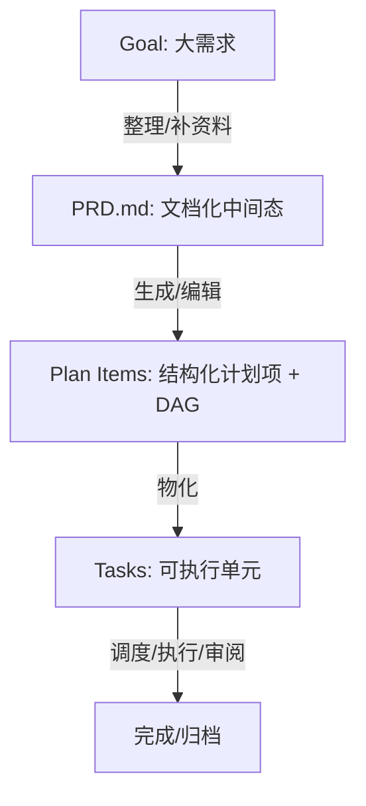
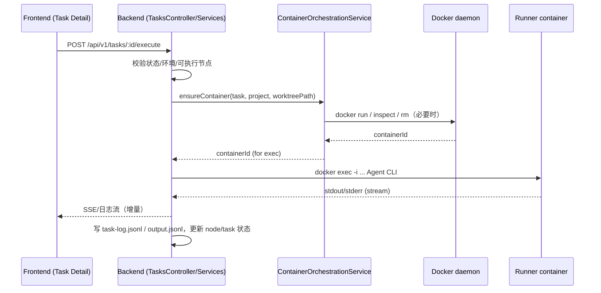

# AINative：从“聊天壳”到“工程控制系统”的一次产品化落地（技术分享）

> 受众：跨团队（产品 / 前端 / 后端 / 平台 / 测试 / 运维均可读）  
> 目标：用“业务价值 + 架构边界 + 关键链路 + 权衡与经验”的方式，解释 AINative 为什么值得做、怎么做、以及它和常见 AI Coding 工具的本质区别。  
> 证据原则：本文所有关键结论都尽量附带仓库内的可定位文件链接，便于复盘与对齐。

---

## 目录

1. [业务：为什么要做 AINative](#1-业务为什么要做-ainative)
2. [技术全景：三层边界与仓库结构](#2-技术全景三层边界与仓库结构)
3. [业务主线：Goal → PRD → Plan → Task（先治理再执行）](#3-业务主线goal--prd--plan--task先治理再执行)
4. [执行模型：Task/Node 如何落到 Runner 容器与 docker exec](#4-执行模型tasknode-如何落到-runner-容器与-docker-exec)
5. [前端架构：五分区如何变成“可执行的协作约束”](#5-前端架构五分区如何变成可执行的协作约束)
6. [关键权衡表：我们为什么这么选](#6-关键权衡表我们为什么这么选)
7. [可复用经验（跨团队可迁移）](#7-可复用经验跨团队可迁移)
8. [后续演进方向（不写排期，只写方向与可度量目标）](#8-后续演进方向不写排期只写方向与可度量目标)
9. [附录：阅读顺序与关键文件索引](#9-附录阅读顺序与关键文件索引)
10. [术语表](#10-术语表)

---

## 1. 业务：为什么要做 AINative

### 1.1 AINative 不是“接了模型的聊天壳”

很多 AI Coding 产品的核心链路是：**用户一句话 → LLM 生成 → 直接落代码**。  
这一链路在“小改动、短反馈”场景下很好用，但一旦进入真实研发协作，就会暴露出一系列工程痛点：

- **上下文爆炸**：大需求一次性塞进对话，信息密度高且结构不稳定，难复用、难审计。
- **交付边界不清**：同一条对话里混着“需求理解、方案选择、编码实现、联调、验收”，很难对齐“做到了什么/没做到什么”。
- **依赖关系不可表达**：多个子功能需要按顺序推进、并行协作时，缺少显式的依赖图与推进规则。
- **纠偏太晚**：直到模型跑完/代码合并前才发现方向偏了，返工成本高。

AINative 的产品化核心，是把“AI 执行”放回到**工程控制链**中：让需求先被治理成结构化中间态，再进入可审计、可回滚、可隔离的执行域。

这类“从代码到架构映射”的结论，在仓库中已有分析文档沉淀，可作为本节的补充材料：  
- [AINative 代码库技术分析](./ainative-codebase-technical-analysis.md)

### 1.2 业务价值（用一句话概括）

> 把“需求理解 → 任务拆解 → 隔离执行 → Git 落地 → 人工审阅”串成同一条可治理、可复盘的链路，让 AI 真正成为研发流程里的可靠成员，而不是一次性对话的随机输出器。

### 1.3 价值如何落到可验证的收益

不同角色对“收益”的感知不同，分享时建议用“角色—收益—证据”表达：

| 角色 | 主要收益 | 在系统里的落点（示例） |
|---|---|---|
| 产品/项目 | 需求从草稿到 PRD、到拆解计划，有明确中间态与可回溯轨迹 | `Goal → PRD → Plan → Task`（见第 3 节） |
| 研发 | 子任务粒度更稳定、依赖关系显式，执行环境隔离、降低“本机差异” | Runner 容器 + `docker exec`（见第 4 节） |
| 评审/交付 | 每个 Task 有状态机、有日志与产物，便于审阅与回滚 | `task.status / task_node.status`（见第 4.4 节） |
| 平台/运维 | 执行面与控制面职责隔离，资源/安全边界更清晰 | 控制面/执行面边界文档（见第 4.1 节） |

---

## 2. 技术全景：三层边界与仓库结构

### 2.1 仓库结构与技术栈（“这是什么系统”先讲清楚）

仓库是一个全栈项目，目录结构可以概括为：

| 目录 | 作用 | 技术栈 |
|---|---|---|
| `frontend/` | 工作台前端（体验面） | Vue 3 + TypeScript + Vite |
| `backend/` | 控制面（API/Worker） | NestJS |
| `runner/` | 执行面镜像与配置渲染脚本 | Docker + entrypoint + supervisord/nginx（可选） |
| `docs/technical/` | 架构、状态机、Goal/Task/Runner 等技术文档 | Markdown + Mermaid |

仓库的启动与门禁（质量门禁、Docker 生命周期脚本）集中在根目录脚本中：  
- [根 README：快速启动与 Docker 模式](../../README.md)  
- [根 package.json：dev / quality-gate / docker 脚本](../../package.json)  
- [docker-compose.yml：PG/Redis + frontend/backend + docker.sock 挂载](../../docker-compose.yml)

### 2.2 三层边界（体验面 / 控制面 / 执行面）

为了跨团队沟通，这里用“三层边界”解释整体架构：

- **体验面（Frontend Workspace）**：负责 UI 编排与交互，把项目/目标/任务/日志/产物/环境/Git 操作组织为统一工作台。
- **控制面（Backend Control Plane）**：负责鉴权、调度、状态机、Git/worktree、日志与审计、容器编排等“工程控制能力”。
- **执行面（Runner Execution Plane）**：为每个任务（或 workflow run）准备隔离执行环境，通过 `docker exec` 在容器内运行 Agent CLI 与脚本工具链。

建议用一张“容器图”把这三层连接起来（Mermaid，可直接渲染）：

```mermaid
flowchart LR
  U[用户/浏览器] -->|HTTP| FE[Frontend: Vue SPA]
  FE -->|/api/v1| BE[Backend: NestJS Control Plane]
  BE --> PG[(PostgreSQL)]
  BE --> RD[(Redis)]
  BE -->|docker API / docker.sock| DK[Docker daemon]
  DK --> RC[Runner containers: ainative-task-*/ainative-run-*]
  RC -->|bind mount| WT[Git worktree (/workspace)]
```

---

## 3. 业务主线：Goal → PRD → Plan → Task（先治理再执行）

> 这一节是“业务价值如何变成系统能力”的核心。

### 3.1 为什么要引入 Goal 层：把“大需求”从一次执行里剥离出来

技术方案文档明确了动机：大需求直接进入 task 容易导致上下文爆炸、交付边界不清、依赖不可表达、纠偏太晚。  
对应沉淀文档：  
- [大任务拆解为多任务技术方案](./goal-task-decomposition-design.md)

### 3.2 Plan 不是“列表”，而是显式 DAG（可校验、可拓扑排序）

后端实现提供了计划项依赖的建模、环检测、拓扑顺序（用于物化任务的创建顺序）。  
关键实现：  
- [backend/src/goals/goal-plan-dag.ts](../../backend/src/goals/goal-plan-dag.ts)

其中的关键点（可在分享时口述）：

- **依赖语义**：succ 依赖 pred（pred 先完成）⇒ 有向边 `pred -> succ`。
- **环检测**：DFS 三态检测有向环，避免“永远无法开始”的计划。
- **物化顺序**：topological order 只对目标集合内的依赖进行排序，保证创建 Task 时的前置关系可表达。

### 3.3 作为“控制系统”的产品闭环

把主线写成“状态机 + 可操作按钮”，跨团队更容易理解：



实现侧可追溯的证据入口（用于“不是 PPT 架构，是落到代码里了”）：
- `GoalsService` 负责权限校验、计划项依赖校验、物化任务等（示例入口）：  
  - [backend/src/goals/goals.service.ts](../../backend/src/goals/goals.service.ts)

---

## 4. 执行模型：Task/Node 如何落到 Runner 容器与 docker exec

> 这一节解释“为什么 AINative 的执行更可控、更可复现”，也是和传统“本机跑脚本/直接跑 CLI”相比的关键差异。

### 4.1 控制面 vs 执行面：职责边界是如何写进仓库的

仓库已有“边界说明文档”，非常适合在分享中直接复用其表格与结论：
- [Task container execution boundaries](../../backend/docs/task-container-execution-boundaries.md)

用一句话转述其核心：

> 控制面保留 API/鉴权/调度/状态/Git/worktree/容器编排；执行面只负责在隔离环境中跑 Agent CLI（以及可选的 preview/dev sandbox 进程）。

### 4.2 runner-only vs preview-web/full-dev-sandbox：为什么需要三种画像

“task runner 与参考 sandbox 的术语与边界”文档给出了清晰划分：  
- [Task runner vs reference sandbox models](../../backend/docs/task-runner-sandbox-models.md)

以及更完整的中文说明：  
- [任务隔离容器方案（完整说明）](../../backend/docs/task-container-lifecycle-lessons.md)

可用于分享的要点：

- **runner-only（默认）**：容器主进程是占位（如 `sleep infinity`），实际工作通过多次 `docker exec` 进入容器运行；优势是轻量、适合大量短执行、减少“常驻整栈”带来的成本。
- **preview-web / full-dev-sandbox**：走镜像 entrypoint，拉起 supervisord + nginx，通过健康检查判定就绪；用于预览/更重的沙箱。
- **命名卷策略**：对 `backend/node_modules`、`frontend/node_modules`、`logs` 使用容器侧命名卷，避免 Linux 依赖写回宿主 worktree，同时保持可清理与可排障。

runner 在 entrypoint 模式下会根据 orchestration config 生成 nginx/supervisord 配置：  
- [runner/render-runner-config.mjs](../../runner/render-runner-config.mjs)

### 4.3 关键链路：一个 Task Node 是如何执行的（建议放序列图）

这里推荐用序列图解释“从前端点击执行到日志回显”的路径：



对应的“可追溯证据文件”（挑你分享时想展示的片段即可）：

- Task Node 的执行编排：  
  - [backend/src/tasks/application/task-node-execution.service.ts](../../backend/src/tasks/application/task-node-execution.service.ts)
- 容器的 ensure / 复用 / 替换逻辑（包含 sandbox profile、runner image、slot heartbeat 等）：  
  - [backend/src/containers/container-orchestration.service.ts](../../backend/src/containers/container-orchestration.service.ts)
- Task 对外能力面（跨团队理解“后端到底提供了哪些能力”）：  
  - [backend/src/tasks/tasks.controller.ts](../../backend/src/tasks/tasks.controller.ts)

### 4.4 任务/节点状态机：为什么只有 4 个状态却能覆盖关键场景

状态机文档明确了任务与节点共用 4 态（`todo / in_progress / in_review / done`），但语义不同，并给出了聚合规则。  
- [Task / TaskNode 状态机说明](./task-status-state-machine.md)

分享时推荐强调两点：

1) **`task.in_review` 只保留给“所有节点完成后的最终人工确认”**（避免把执行链路的多种 review 混为一谈）。  
2) **节点级 `in_review` 统一表示“必须人工介入”**（成功待审批/失败/取消/超时等都归一化成同一行为约束）。

---

## 5. 前端架构：五分区如何变成“可执行的协作约束”

### 5.1 为什么要五分区（跨团队视角）

五分区不是为了“好看”，而是为了让以下问题可以被工具化约束：

- 让 **页面层保持薄**（路由入口只做装配），避免业务复杂度散落在各页面。
- 让 **业务能力聚合在 feature 域**，对外通过公开入口暴露，减少跨域耦合。
- 让 **依赖方向可校验**，避免“随手 import”导致架构腐化。

前端架构说明文档（推荐作为分享资料引用）：  
- [docs/dev-spec/frontend/ARCHITECTURE.md](../dev-spec/frontend/ARCHITECTURE.md)

### 5.2 规则落地：eslint-plugin-boundaries（架构门禁不是口号）

前端 ESLint 配置里直接写了“五分区依赖矩阵”，并对跨 feature deep import 给出硬错误。  
- [frontend/eslint.config.ts](../../frontend/eslint.config.ts)

可以在分享中展示两条“最有协作价值”的规则：

1) 依赖方向约束（例如 shared 只能依赖 shared/contracts；api 不可越界等）  
2) 跨 feature 引用必须走公开入口（禁止 `@features/other/**` deep import）

### 5.3 一个真实页面链路：pages 薄壳 → features 聚合 → api 契约

- pages 薄壳示例：  
  - [frontend/src/pages/tasks/detail.vue](../../frontend/src/pages/tasks/detail.vue)
- feature 聚合（TaskDetailPage）：  
  - [frontend/src/features/tasks/TaskDetailPage.vue](../../frontend/src/features/tasks/TaskDetailPage.vue)
- 业务编排与 SSE/数据拉取（useTaskDetailPage）：  
  - [frontend/src/features/tasks/use-task-detail-page.ts](../../frontend/src/features/tasks/use-task-detail-page.ts)
- API 契约入口：  
  - [frontend/src/api/tasks.ts](../../frontend/src/api/tasks.ts)

这条链路的价值是：跨团队在讨论“任务详情页为什么这样设计”时，可以把争论落到“边界/职责/依赖方向”，而不是落到某个组件写法上。

---

## 6. 关键权衡表：我们为什么这么选

> 建议把权衡写成“何时选 A、何时选 B”，让读者能迁移复用，而不是只知道你们的选择。

### 6.1 执行环境：本机执行 vs runner 容器执行

| 选项 | 优点 | 代价/风险 | 适用场景 |
|---|---|---|---|
| 本机执行 CLI | 调试方便、启动快 | 环境漂移、依赖污染、难复现、权限边界弱 | 个人实验/小脚本 |
| runner 容器 + docker exec（默认） | 隔离、可复现、依赖不污染宿主、利于审计 | 需要 Docker、容器管理复杂度更高 | 团队协作、需要稳定执行与审计的任务 |

证据与细节：  
- [任务隔离容器方案（完整说明）](../../backend/docs/task-container-lifecycle-lessons.md)

### 6.2 runner-only vs full sandbox

| Concern | runner-only | preview-web / full-dev-sandbox |
|---|---|---|
| 每次任务执行的成本 | 低 | 高 |
| 是否适合大量短任务 | 适合 | 不适合 |
| 是否支持预览/HMR | 默认不支持 | 支持（supervisord + nginx + readiness probe） |
| 可观测性入口 | 控制面写 jsonl + 状态 | 容器内还可看 supervisord/nginx logs |

证据：  
- [Task runner vs reference sandbox models](../../backend/docs/task-runner-sandbox-models.md)

### 6.3 需求拆解：直接生成 Task vs 引入 Goal 中间态

| 选项 | 优点 | 代价/风险 | 适用场景 |
|---|---|---|---|
| 直接生成 Task | 链路短、实现快 | 大需求上下文爆炸、依赖难表达、纠偏晚 | 轻量/一次性任务 |
| Goal → PRD → Plan → Task（推荐） | 结构化、可编辑、可审计、可表达依赖 | 系统复杂度上升，需要额外实体与页面 | 中大型需求、多角色协作 |

证据：  
- [大任务拆解为多任务技术方案](./goal-task-decomposition-design.md)

---

## 7. 可复用经验（跨团队可迁移）

1. **把“架构边界”落到工具门禁**：规范文档 + ESLint/CI 校验，比“代码评审靠人”更稳定。  
   - 证据：`frontend/eslint.config.ts` 的 boundaries 规则
2. **把“中间态”当成一等公民**：PRD/Plan 不是生成出来就扔，而是可编辑、可复审、可再生成。  
   - 证据：`docs/technical/*` + `backend/src/goals/*`
3. **控制面/执行面分离**：把“危险/不可控/依赖重”的执行放进隔离环境，把“治理/审计/权限/调度”留在控制面。  
   - 证据：`backend/docs/task-container-execution-boundaries.md`
4. **用状态机统一交互语义**：状态少不代表表达能力弱，关键在“语义一致 + 门禁一致”。  
   - 证据：`docs/technical/task-status-state-machine.md`

---

## 8. 后续演进方向（不写排期，只写方向与可度量目标）

> 这一节建议写“方向 + 预期收益 + 可观测指标”，避免空泛。

可选方向示例（结合仓库现状）：

1) **观测与诊断增强**：把“容器/slot/执行失败”的诊断链路做成一套标准化报告（减少排障成本）。  
2) **执行能力泛化**：在 runner 中标准化更多脚本入口（测试、构建、lint 等），减少“执行只服务于 agent CLI”。  
3) **复杂 orchestrator 拆分**：对 tasks/application 中的执行编排做更强的可组合性与单测覆盖，提高演进速度。  

---

## 9. 附录：阅读顺序与关键文件索引

> 给新同学一个“从 0 到能定位问题”的阅读路径。

### 9.1 快速建立全局心智（10 分钟）

1. 根启动与环境：  
   - [README.md](../../README.md)  
   - [docker-compose.yml](../../docker-compose.yml)  
   - [package.json](../../package.json)
2. 先读一遍“代码到架构映射”的现成结论：  
   - [AINative 代码库技术分析](./ainative-codebase-technical-analysis.md)

### 9.2 需求治理主线（Goal）

- 方案与动机：  
  - [大任务拆解为多任务技术方案](./goal-task-decomposition-design.md)
- 关键实现入口：  
  - `backend/src/goals/*`  
  - [goal-plan-dag.ts](../../backend/src/goals/goal-plan-dag.ts)

### 9.3 任务执行主线（Task / Node / Runner）

- 控制面/执行面边界：  
  - [task-container-execution-boundaries.md](../../backend/docs/task-container-execution-boundaries.md)
- 容器生命周期与画像：  
  - [task-container-lifecycle-lessons.md](../../backend/docs/task-container-lifecycle-lessons.md)  
  - [task-runner-sandbox-models.md](../../backend/docs/task-runner-sandbox-models.md)
- 关键实现入口：  
  - [task-node-execution.service.ts](../../backend/src/tasks/application/task-node-execution.service.ts)  
  - [container-orchestration.service.ts](../../backend/src/containers/container-orchestration.service.ts)  
  - [tasks.controller.ts](../../backend/src/tasks/tasks.controller.ts)
- 状态机：  
  - [task-status-state-machine.md](./task-status-state-machine.md)

### 9.4 前端五分区与任务详情页链路

- 架构文档：  
  - [docs/dev-spec/frontend/ARCHITECTURE.md](../dev-spec/frontend/ARCHITECTURE.md)
- 工具门禁：  
  - [frontend/eslint.config.ts](../../frontend/eslint.config.ts)
- 任务详情链路（薄壳 → feature → api）：  
  - [pages/tasks/detail.vue](../../frontend/src/pages/tasks/detail.vue)  
  - [features/tasks/TaskDetailPage.vue](../../frontend/src/features/tasks/TaskDetailPage.vue)  
  - [features/tasks/use-task-detail-page.ts](../../frontend/src/features/tasks/use-task-detail-page.ts)  
  - [api/tasks.ts](../../frontend/src/api/tasks.ts)

---

## 10. 术语表

| 术语 | 含义 |
|---|---|
| Goal | 大需求/目标层，承载资料、PRD、拆解计划，并派生 Tasks |
| PRD | Product Requirement Document，需求文档中间态 |
| Plan Items | 结构化计划项，可编辑，带依赖关系（DAG） |
| Task | 最小可执行单元（一次执行/工作流 run 的容器） |
| Task Node | Task 内的节点（工作流步骤），可执行、可重试、可审批 |
| Control Plane | 控制面：API/鉴权/调度/状态/Git/容器编排等治理能力 |
| Execution Plane | 执行面：runner 容器内的 CLI/工具执行环境 |
| runner-only | 默认沙箱画像：容器主进程占位，实际通过 docker exec 执行 |
| preview-web / full-dev-sandbox | 带 entrypoint 的画像：supervisord + nginx + readiness probe，可用于预览/更重沙箱 |

