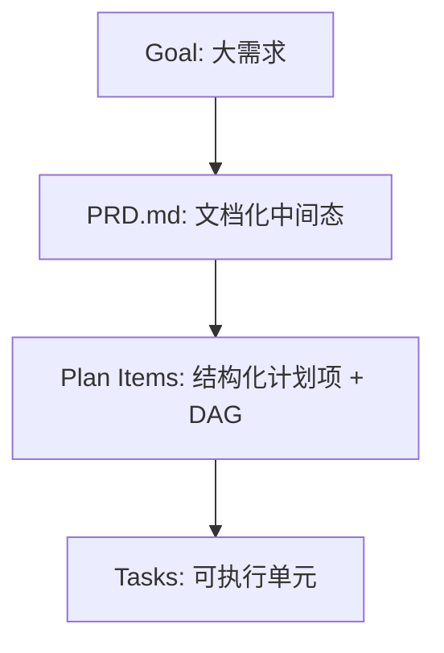
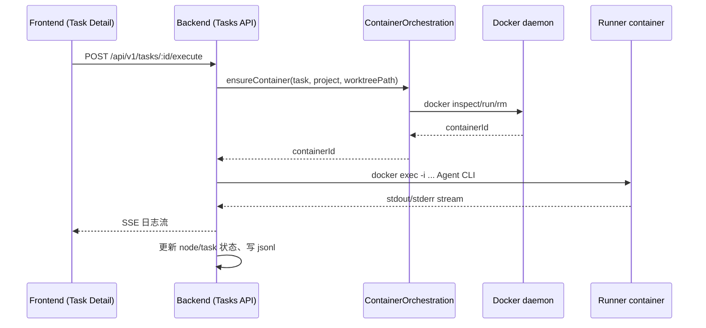

# AINative：把 AI 执行纳入工程控制链

> 文档定位：本文以 AINative 当前仓库为依据，解释这套系统为什么不是“接入模型的聊天壳”，而是一套面向真实研发协作的工程控制系统。全文重点不在模型能力比较，而在需求治理、执行隔离、状态审计和前端边界如何在代码中落地。  
> 关联材料：  
> - 代码到架构映射分析：[ainative-codebase-technical-analysis.md](./ainative-codebase-technical-analysis.md)  
> - 大任务拆解方案：[goal-task-decomposition-design.md](./goal-task-decomposition-design.md)  
> - 状态机说明：[task-status-state-machine.md](./task-status-state-machine.md)

---

## 1. 背景与业务价值（Why）

### 1.1 AINative 面对的不是单次生成，而是真实研发协作

很多 AI Coding 工具的核心链路是“用户给一个 prompt，模型返回一段代码”。这种方式在小修改、短反馈、单人试验场景中效率很高，但它默认了几个前提：需求可以在一次对话里讲清楚，执行边界天然明确，环境差异不会成为主要问题，交付也不需要复杂审计。真实研发协作并不满足这些前提。

AINative 面对的是更复杂的情形。一个需求通常不只是几句话，而是原型、补充说明、项目文档、已有代码、接口约束和多角色协作共同构成的对象。系统需要承接的不只是“生成代码”，而是“整理目标、形成 PRD、拆解计划、派生任务、执行、审阅、回写”的连续流程。也正因为如此，AINative 的重点从来不是把模型接进一个聊天窗口，而是把 AI 的行为放进一条可治理、可追踪的研发链路里。

这一点可以从仓库已有的分析文档中得到更系统的支撑：  
- [AINative 代码库技术分析](./ainative-codebase-technical-analysis.md)

### 1.2 为什么“现在必须做”是工程问题，而不是模型问题

如果只把问题理解为“模型还不够强”，就会低估真实瓶颈。AINative 要解决的核心问题并不是模型无法产出内容，而是产出如何被团队稳定接住。当需求规模开始上升，直接把所有上下文都压进一次执行，会很快暴露出三个工程层面的缺口。

第一，需求缺少中间态，系统无法区分“现在在改需求”还是“现在在改执行”。PRD、计划和任务一旦都混进同一个执行对象里，方向偏差往往要到很后面才会暴露，返工成本也会同步上升。第二，执行缺少隔离，系统很难回答“这次任务到底在哪个环境里执行”“依赖是容器里的还是宿主机里的”“失败是代码问题还是环境问题”。第三，交付缺少审计，团队无法系统地回看某次执行经历了什么状态变化、产生了哪些日志和产物、在哪个节点需要人工介入。

从这个角度看，AINative 的建设时机并不是被“AI 热度”驱动，而是被工程治理需求推动。需求规模越大、协作角色越多、执行动作越接近真实研发，系统就越需要明确的控制面。

### 1.3 目标与成功标准

AINative 想建立的，不是一条更长的 prompt，而是一条更可靠的工程链。它希望系统具备四种能力：可治理、可审计、可复现、可协作。可治理意味着大需求可以被拆分为结构化中间态，依赖关系可以校验，推进顺序可以表达。可审计意味着任务、节点、日志和产物都有明确落点，链路可回溯。可复现意味着执行环境与个人本机差异解耦，问题可以定位到容器、worktree 和具体执行上下文。可协作意味着不同角色能在不同阶段介入，而不是所有问题都压给最后执行的人。

这些目标并不是停留在口号层面。仓库根目录已经把本地开发、类型检查、质量门禁和 Docker 生命周期纳入了工程入口，说明系统本身是在按“工程系统”的标准被建设，而不是按“聊天产品”的标准堆功能：  
- [package.json](../../package.json)

---

## 2. 现状与问题分析（What）

### 2.1 仓库现状说明 AINative 已经是一个全栈工作台

从仓库结构可以直接看出，AINative 不是一个单前端项目。`frontend/` 承担工作台前端，`backend/` 承担 NestJS 控制面，`runner/` 提供执行面镜像与相关入口脚本，`docs/technical/` 沉淀关键架构说明。系统的启动、依赖和本地运行方式则通过根目录的文档和 `docker-compose.yml` 组织起来：  
- [README.md](../../README.md)  
- [docker-compose.yml](../../docker-compose.yml)

这意味着 AINative 从一开始就不是“模型 API + 聊天界面”的最小实现，而是已经具备了体验面、控制面和执行面的基础分工。问题不在于能不能执行，而在于这三层边界是否足够清晰，是否已经形成稳定的工程闭环。

### 2.2 “聊天壳”不够的根因在于三类能力缺失

如果把当前问题抽象一下，会发现真正缺失的不是功能点，而是三类控制能力。

第一类是需求与计划的治理能力。大需求如果没有结构化中间态，就很难拆解，也很难表达依赖。系统既不知道哪些内容属于需求理解，哪些内容属于执行计划，也无法在任务真正开始前对规划结果做独立校验。第二类是执行复现能力。只要执行仍然依赖不稳定的本机环境，系统上层再好的流程也会被环境差异穿透，最终导致结果不稳定、排障困难。第三类是交付审计能力。没有统一状态机、日志模型和产物落点，团队很难知道一次执行到底发生了什么，也很难判断当前应该继续执行还是等待人工处理。

从这个角度看，“AI 写代码”的真正工程难点不是让模型多写一些，而是如何保证它在团队协作中稳定、可控、可复盘。

---

## 3. 方案设计（How）中的核心原则

### 3.1 先治理再执行

AINative 的第一条原则是，需求不能直接进入执行域，而应该先被收敛成可编辑、可校验的结构化对象。这条原则最终落成了 `Goal -> PRD -> Plan -> Task` 的链路。Goal 承载大需求，PRD 是文档化中间态，Plan 是结构化计划项及其依赖关系，Task 才是进入调度和执行的最小单元。

这条原则的价值，在于它把“规划错误”和“执行错误”分开处理。如果方向不对，问题应该停留在 Goal、PRD 或 Plan 层修正；如果执行失败，问题才下沉到 Task 或 Task Node 层局部重试。系统不再要求一个执行对象同时承担“理解需求”和“完成执行”两种职责。

### 3.2 控制面与执行面分离

第二条原则是控制面和执行面必须拆开。控制面负责权限、调度、状态、Git/worktree 和容器编排，执行面负责在隔离环境中运行 Agent CLI 和相关命令。这样做的核心收益不是“技术栈更好看”，而是让宿主环境不再直接承担执行污染，同时让所有关键状态仍然掌握在业务语义更强的控制面里。

对于 AINative 这种要长期承载代码写入、环境执行、日志审计和人工审批的系统来说，这条边界尤其关键。它保证系统不是把执行权彻底交给某个不可控的 shell 进程，而是在控制面的调度和观测之下，使用隔离环境完成具体动作。

### 3.3 边界必须能被工具校验

第三条原则是，边界不能只停留在文档里。前端五分区必须通过依赖边界和 lint 规则落地，后端依赖关系必须通过模块分工和文档约束落地，计划项依赖必须真正建模为可检测的 DAG，状态机必须有统一语义。这条原则的目标很明确：把“希望大家遵守”升级为“系统会自动校验”。

只有当边界可执行时，架构才真正具备约束力。否则随着模块增多、协作者增多、AI 自动生成代码增多，架构边界会迅速退化为 code review 里的口头提醒。

---

## 4. 方案选型与关键权衡

### 4.1 为什么要引入 Goal 中间态，而不是直接生成 Task

AINative 明确选择了 `Goal -> PRD -> Plan -> Task`，而没有把“直接生成 Task”作为主路径。前者的代价是要新增对象、接口和页面，但收益是中间态变得清晰，需求可以编辑，计划可以校验，依赖可以表达，任务物化也能按明确顺序推进。后者虽然链路更短，但会把上下文爆炸、依赖难表达和纠偏过晚的问题继续留在执行阶段。

相关方案文档已经系统描述了这一判断：  
- [goal-task-decomposition-design.md](./goal-task-decomposition-design.md)

从工程上看，引入中间态不是“多做了一层”，而是把系统最容易失控的部分前移到了更可治理的阶段。对大需求来说，这个取舍几乎是必要条件。

### 4.2 为什么执行主路径选择 runner 容器，而不是本机执行

第二个关键取舍发生在执行环境上。AINative 明确把 runner 容器 + `docker exec` 作为主路径，而不是把本机执行继续升级为正式方案。本机执行的优点很明显，成本低、调试快、接近个人实验习惯；但在团队场景里，它同时带来不可复现、污染宿主、权限边界弱和排障困难等问题。

runner 容器执行的代价是要维护 Docker 和编排逻辑，但换来的收益是隔离、可复现、可观测和可控。这些能力并不是锦上添花，而是工程系统能否长期稳定运行的基础。AINative 的可靠性，本质上来自执行的工程化，而不是来自某个模型更聪明。相关边界和经验已经在仓库内形成文档：  
- [task-container-execution-boundaries.md](../../backend/docs/task-container-execution-boundaries.md)  
- [task-container-lifecycle-lessons.md](../../backend/docs/task-container-lifecycle-lessons.md)

---

## 5. 目标架构：三层边界与一条可追溯链路

AINative 的总体架构可以用一张容器图概括：

```mermaid
flowchart LR
  U[用户/浏览器] --> FE[Frontend: Vue SPA]
  FE -->|/api/v1| BE[Backend: NestJS Control Plane]
  BE --> PG[(PostgreSQL)]
  BE --> RD[(Redis)]
  BE -->|docker.sock| DK[Docker daemon]
  DK --> RC[Runner containers: ainative-task-*/ainative-run-*]
  RC -->|bind mount| WT[Git worktree (/workspace)]
```

这张图最重要的不是组件数量，而是职责切分方式。前端是体验面，负责把项目、目标、任务、日志、产物和环境组织成统一工作台。后端是控制面，负责状态、权限、调度、Git/worktree、容器编排以及日志落点。Runner 则是执行面，只负责在隔离环境中承接命令执行和相关运行时能力。

从整体上看，AINative 已经不再是“前端对话框 + 后端模型转发”的结构，而是一条可以追踪、可以分层、可以解释的工程链路。

---

## 6. 核心流程：从需求治理到隔离执行

### 6.1 链路 A：Goal -> PRD -> Plan -> Task

AINative 的第一条关键链路，是把大需求逐步收敛为可执行单元：



这里的重点并不只是“多了三个对象”，而是系统终于能把需求治理这件事显式建模。Plan 也不是一组普通列表，而是带依赖关系的有向无环图。后端已经用 `goal-plan-dag.ts` 实现了计划项邻接关系、环检测和物化拓扑顺序，说明依赖不是展示层概念，而是后端真实维护的执行前提：  
- [backend/src/goals/goal-plan-dag.ts](../../backend/src/goals/goal-plan-dag.ts)

Goal 相关服务则负责权限校验、依赖校验、任务物化等入口，把这条治理链串成可操作的系统能力：  
- [backend/src/goals/goals.service.ts](../../backend/src/goals/goals.service.ts)

### 6.2 链路 B：执行一个 Task Node

当需求被物化为 Task 之后，系统进入执行链路。一次 Task Node 执行并不是简单地“起一个命令”，而是一条完整的控制流程：



这条链路说明了两个重要判断。第一，执行发生在容器内，但调度和状态回写仍然掌握在控制面手中。第二，runner-only 模式下，容器本身可能只是轻量占位，真正执行依赖 `docker exec` 进入容器，因此排障时不能只看 `docker logs`，还必须结合控制面写入的状态和 jsonl 日志。

相关实现与说明位于以下位置：  
- [backend/src/containers/container-orchestration.service.ts](../../backend/src/containers/container-orchestration.service.ts)  
- [backend/src/tasks/application/task-node-execution.service.ts](../../backend/src/tasks/application/task-node-execution.service.ts)  
- [task-container-execution-boundaries.md](../../backend/docs/task-container-execution-boundaries.md)

### 6.3 链路 C：前端任务详情页如何承接复杂交互

前端并不是简单展示执行结果，而是在任务详情页中承担了完整的交互编排职责。这里的典型链路是：`pages` 提供路由级薄壳，`features` 承担业务编排，`api` 负责请求契约。这样的组织方式，把页面入口和复杂交互分离开来，使得任务状态、执行消息流、审批、日志、环境门禁等能力可以在 feature 层持续收敛，而不会扩散到路由页面本身。

对应实现可从以下文件观察：  
- [frontend/src/pages/tasks/detail.vue](../../frontend/src/pages/tasks/detail.vue)  
- [frontend/src/features/tasks/TaskDetailPage.vue](../../frontend/src/features/tasks/TaskDetailPage.vue)  
- [frontend/src/features/tasks/use-task-detail-page.ts](../../frontend/src/features/tasks/use-task-detail-page.ts)  
- [frontend/src/api/tasks.ts](../../frontend/src/api/tasks.ts)

---

## 7. 前端架构落地：五分区如何变成工程门禁

### 7.1 五分区的价值不在目录，而在协作边界

AINative 前端选择了 `app / pages / features / api / shared` 的五分区结构。这种分法的重点并不在“目录更整齐”，而在于它把职责边界表达得更清楚。`pages` 负责路由入口和页面壳，`features` 负责业务能力编排，`api` 负责接口契约，`shared` 负责真正稳定可复用的基础能力。这样一来，复杂工作台的前端不再是围绕页面堆逻辑，而是围绕业务边界组织能力。

这套分工不仅方便前端内部协作，也让产品、测试和后端在沟通时更容易对齐“一个能力应该落在哪一层”。相关规范和背景在仓库中已有沉淀：  
- [docs/dev-spec/frontend/ARCHITECTURE.md](../dev-spec/frontend/ARCHITECTURE.md)

### 7.2 架构只有能被校验，才真正具有执行力

AINative 并没有把五分区停留在文档层，而是进一步通过 ESLint boundaries 等规则把边界变成工程门禁。像禁止跨域 deep import、限制不合理依赖方向这类约束，如果只靠 code review，很容易随着项目复杂度上升而失效；一旦写进 lint 规则，开发阶段就能直接拦截越界行为。

这点对 AI 生成代码尤其重要。因为 AI 在生成代码时天然不知道团队的历史边界和演进路线，只有当系统把结构性约束写进自动化检查时，AI 产出的错误才能被更早暴露，而不是等到后续重构或联调阶段才发现。相关配置位于：  
- [frontend/eslint.config.ts](../../frontend/eslint.config.ts)

---

## 8. 状态机与交付：为什么 4 个状态足以支撑复杂流程

AINative 的任务与节点共用四个状态：`todo / in_progress / in_review / done`。这看起来比很多工作流系统更克制，但它并不简陋，反而是一种有意识的工程取舍。系统不是通过扩张状态枚举来表达复杂性，而是通过“对象不同、语义不同、迁移规则清晰”来承载复杂流程。

其中最关键的区分在于：任务级 `in_review` 代表所有节点完成之后的最终人工确认，而节点级 `in_review` 则统一表示执行过程中已经遇到需要人工介入的情形，例如成功待审批、失败、取消或超时。这样的设计让前后端都能围绕一套统一概念工作，而不是面对一大批细碎状态做特殊处理。

从协作角度看，少状态的价值在于降低理解成本。用户更容易判断现在应该继续执行、等待审批，还是处理异常；前端更容易组织交互；后端更容易维护聚合逻辑。相关状态语义与聚合规则详见：  
- [task-status-state-machine.md](./task-status-state-machine.md)

---

## 9. 效果与收益：如何从工程证据走向业务证明

从仓库内容来看，AINative 当前最充足的是工程实现证据，而不是完整的业务指标。这一点应该如实表达。代码、文档和架构能够证明的是“系统为什么有能力带来这些收益”，但如果要进一步证明“收益已经发生到什么程度”，仍然需要结合团队自己的 Before/After 数据。

对技术系统而言，可以预期的收益主要集中在三类。第一类是稳定性，例如执行失败率是否下降、环境问题是否更容易定位、排障耗时是否缩短。第二类是效率，例如从需求到可交付 PR 的周期是否缩短、多任务并行是否更顺畅。第三类是可维护性，例如跨域耦合是否下降、复杂逻辑是否更集中在正确边界内、历史路径是否更容易被替换。

因此，这一节在文章里更适合写成“证据如何连接到指标”的说明，而不是直接声称已经取得某组仓库内并不存在的数据。对于内部分享或后续总结，如果团队已经积累了指标，可以优先围绕稳定性、效率和维护性三类指标做补充。

---

## 10. 经验复盘：AINative 可复用的方法论

AINative 最值得复用的经验，并不是某一个具体实现，而是它对失控点的处理方式。

第一，中间态建模优先于一次性执行。PRD 和 Plan 不只是说明文档，而是治理对象。第二，边界分离优先于“把能力堆在一起更方便”。控制面和执行面分开，才能同时拿到可控性和隔离性。第三，门禁落地优先于规范宣讲。无论是前端依赖边界，还是任务状态语义，只有进入自动化校验和显式规则，系统才能长期稳定。第四，状态机要追求统一语义，而不是追求状态枚举的丰富程度。少状态、强约束、清晰门禁，往往比大量细分状态更适合跨角色协作。

这些经验并不只适用于 AINative。本质上，只要一个团队已经从“个人与 AI 协作”进入“多人协作、代码写入、环境执行、人工审批和长期演进”的阶段，这套方法就具备迁移价值。反过来，如果只是一次性生成脚本或局部试验，那么这套治理链路可能会显得偏重。方法论真正有价值的地方，正在于它同时说明了适用边界和不适用边界。

---

## 11. 后续规划：从成立的链路走向更强的系统能力

AINative 当前已经建立起了需求治理、隔离执行、状态审计和前端门禁的主链路。接下来的重点，不是推翻现有结构，而是在现有边界上继续增强。

第一个方向是观测与诊断。容器、slot、执行失败和状态迁移已经有基础落点，但仍可以继续标准化，让问题定位更加体系化。第二个方向是执行能力泛化，把 runner 从“能够承接当前任务执行”逐步推进到“能够稳定承载更多标准工程动作”，例如测试、构建和 lint。第三个方向是编排复杂度治理，对后端执行编排层继续拆分热点大文件，增强测试覆盖，让控制面本身的复杂度也被更好地管理。

这三类方向的共同点在于，它们都建立在现有主链路已经成立的前提上。AINative 下一阶段最重要的任务，不是重新证明“这条路是否成立”，而是把这条路走得更稳定、更通用、更容易维护。
