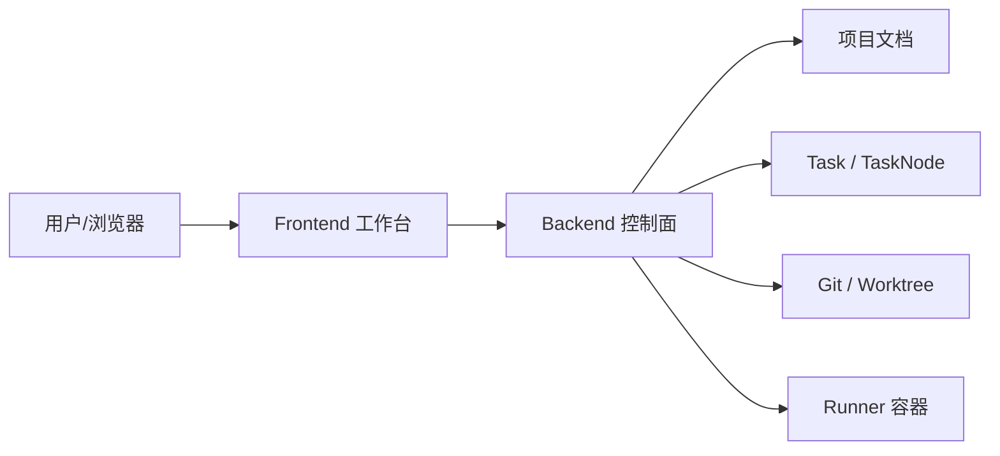
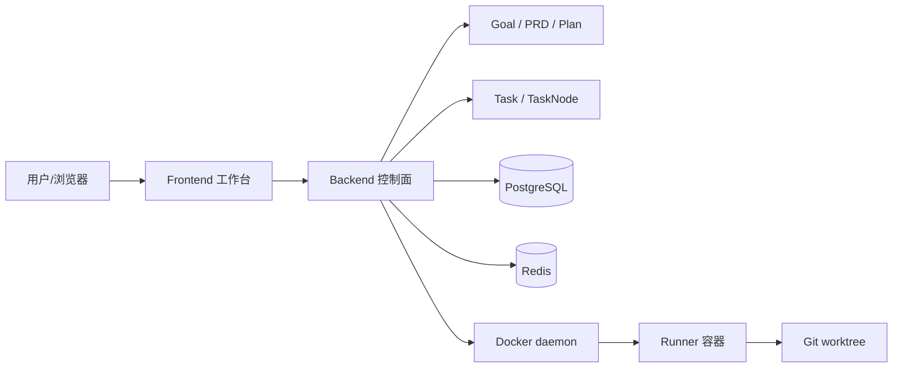
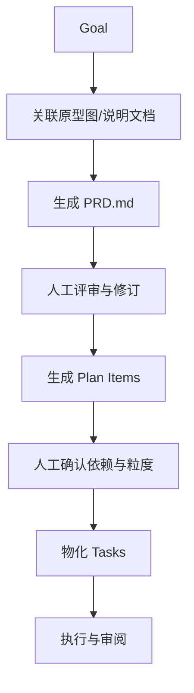
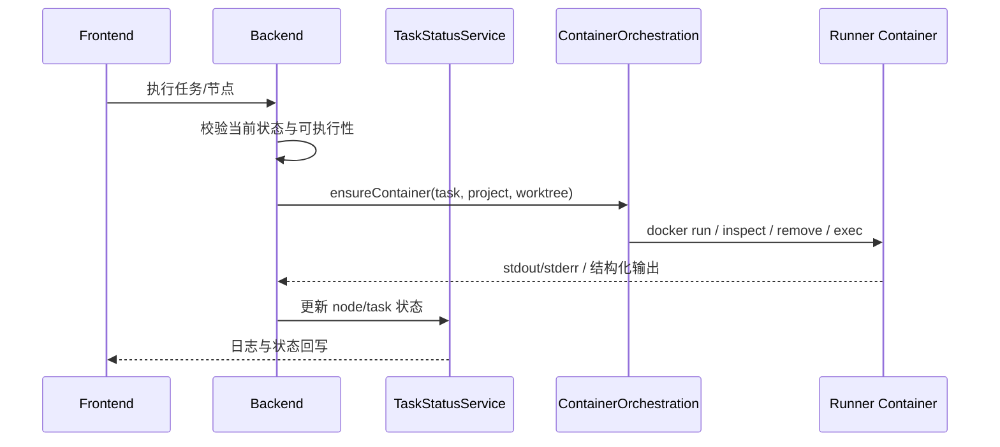

# 《AINative 技术分享：从“聊天壳”到“工程控制系统”的产品化落地》

> 受众：跨团队 / 研发 / 平台 / 产品  
> 作者：AINative 团队｜时间：2026-04-12  
> 一句话总结：AINative 不是把模型接进 IDE 或聊天窗口，而是把 AI 执行纳入一条可治理、可审计、可复现的工程控制链。系统通过 `Goal -> PRD -> Plan -> Task` 的中间态治理，以及控制面 / 执行面分离的 runner 容器方案，解决了大需求难拆解、依赖难表达、执行难复现、交付难复盘的问题。

---

## 1. 背景与业务价值（Why）

### 1.1 业务背景

AINative 面向的不是“让模型帮我写一段代码”的单次调用场景，而是一个更接近真实研发协作的问题：

- 需求通常不是一句话，而是原型图、补充说明、接口约束、已有代码上下文和多角色协作的组合。
- 需求实现也不是单次生成，而是“理解目标 -> 形成 PRD -> 拆解计划 -> 派生任务 -> 执行 -> 审阅 -> 回写”的连续过程。
- 系统的难点不在“模型能不能输出代码”，而在“输出能不能被团队稳定接住”。

如果把 AI 编码只理解成“用户给一句 prompt，模型直接生成代码”，那么在小修改、试验性场景下体验会很好；但一旦进入真实团队协作，问题会迅速出现：

- 上下文过大，需求、约束、已有实现和交付边界全塞进一次会话，结果很不稳定。
- 执行边界不清，PRD、方案选择、编码实现和验收动作混在一起，无法明确“系统现在究竟处在哪个阶段”。
- 多个子任务之间的先后关系无法表达，系统无法知道哪些项必须先完成，哪些项可以并行推进。
- 环境不可控，模型执行依赖宿主环境、临时文件和当前 shell 状态，复现和排障成本高。
- 最终交付缺少结构化日志、状态和产物沉淀，只能凭对话历史回忆执行过程。

AINative 的产品化目标，就是把“模型输出”重新放回到工程流程里，让 AI 不再是一次性对话的随机产物，而成为研发链路中的一个可控执行者。

### 1.2 为什么现在必须做

AINative 不是为了追赶 AI 热度而做的“聊天 UI 升级版”，而是被研发协作中的具体问题逼出来的。

第一类触发因素来自需求规模变化。随着需求从单文件修改升级到多页面、多接口、多角色协同的大需求，直接把需求交给一个 task 或单次会话处理，开始持续出现以下后果：

- PRD 与实现混杂，导致“需求对没对齐”要到执行后期才能看出来。
- 单个任务上下文越来越大，模型容易丢失重点或在不同子目标之间摇摆。
- 一次执行失败后，很难知道应该重做 PRD、重做计划还是只重跑某个子步骤。

第二类触发因素来自治理要求。AI 进入工程交付后，不再只是一个“建议工具”，而是在真实写代码、装依赖、跑命令、修改工作区。这意味着系统必须回答这些问题：

- 谁触发了执行，触发了什么动作，什么时候执行的？
- 当前执行落在哪个项目、哪个 worktree、哪个容器里？
- 执行失败是代码问题、环境问题、任务依赖问题，还是人工审批问题？
- 系统能否在不依赖某个工程师本机环境的前提下复现结果？

第三类触发因素来自长期演进。没有清晰边界的系统可以很快做出 MVP，但很难持续增加能力。AINative 希望继续承载 PRD 生成、任务拆解、任务依赖、日志审计、容器执行、预览环境等能力，这要求系统从一开始就具备明确的对象边界和职责边界。

### 1.3 目标与成功标准（尽量可量化）

- 目标（Goals）：
  - G1：建立稳定的需求治理链路，把大需求沉淀为 `Goal -> PRD -> Plan -> Task` 的结构化中间态。
  - G2：让任务执行具备隔离、可复现、可追踪和可回收的工程属性，而不是依赖本机 shell 和临时上下文。
  - G3：让任务与节点的状态变化、日志产物和人工介入点可被系统明确表达。
  - G4：让前端与后端边界、控制面与执行面边界、feature 与 shared/api 的依赖边界都能被代码和门禁工具验证。
- 非目标（Non-goals）：
  - 首版不构建完整的项目管理平台，也不覆盖复杂排期与资源管理。
  - 首版不替代现有直接创建 task 的所有入口，旧链路可以并存。
  - 首版不做跨任务全自动调度器，依赖先用于校验、展示和人工推进。
- 约束（Constraints）：
  - 尽量复用现有 `task`、`task node`、`workflow template`、项目文档和 Git/worktree 基础设施。
  - 后端继续以 NestJS 控制面为主，执行隔离依赖 Docker runner。
  - 前端新代码和新页面需要遵守五分区架构以及边界门禁。

从工程视角看，AINative 的成功标准可以理解为四个“可”：

- 可治理：系统知道需求处在哪个中间态，而不是所有内容都压成一次会话。
- 可审计：任务、节点、日志、产物和人工操作都有明确落点。
- 可复现：执行环境与宿主解耦，能明确定位容器、worktree 和运行上下文。
- 可协作：不同角色能在不同阶段介入，而不是所有问题都只能由最后执行的人承担。

---

## 2. 现状与问题分析（What）

### 2.1 系统现状概览

从仓库结构看，AINative 已经不是单端前端项目，而是一套完整的研发工作台：

| 目录 | 作用 | 技术栈 / 职责 |
|---|---|---|
| `frontend/` | 工作台前端，组织项目、任务、日志、环境、审阅交互 | Vue 3 + TypeScript + Vite |
| `backend/` | 控制面，负责 API、鉴权、调度、任务状态、Git/worktree、容器编排 | NestJS |
| `runner/` | 执行面镜像与入口脚本、渲染配置、可选 preview/full sandbox 能力 | Docker / Node 脚本 |
| `docs/technical/` | 架构、状态机、目标拆解、容器方案等沉淀 | Markdown |

仓库已经具备的关键基础能力包括：

- `task` 作为执行实体，承载一次会话式或工作流式执行。
- `task node` 作为 task 内的执行节点，支撑步骤化推进和人工介入。
- `workflow template` 作为标准化执行编排能力。
- 项目文档读写和知识能力，支撑原型、需求说明、PRD 等中间态文档。
- Docker runner 执行基础设施，为后续隔离环境做准备。

也就是说，AINative 并不是从零开始设计的系统。真正缺失的不是“如何让模型执行”，而是“如何在 task 之上再增加一层治理对象，让大需求先被收敛，再进入执行”。

现状架构可以先概括为：

这个现状已经具备“执行系统”的雏形，但还没有真正形成“控制系统”的闭环。

### 2.2 核心问题不在模型，而在工程控制

把当前问题抽象一下，可以发现真正缺的是三类控制能力。

第一类是需求控制。系统缺少一个明确的对象来承载“大需求”，所以 PRD、计划和任务只能被挤进 task 或临时会话里。这样做的问题是：

- 需求确认阶段和执行阶段没有边界。
- 计划项无法独立评审、编辑和重新生成。
- 用户很难知道自己现在是在“改需求”、还是“改任务”。

第二类是执行控制。即使 task 已经存在，如果执行仍然依赖不稳定的本机环境或不受约束的 shell，上层再好的流程也会因为环境不一致而失效。一个可长期演进的系统必须能稳定回答：

- 执行在哪个容器里发生？
- 容器是否复用？
- 镜像或平台变更时怎样替换？
- worktree 挂载和 node_modules 隔离如何处理？

第三类是交付控制。没有统一状态机和日志模型，团队很难知道：

- 当前任务到底是“还没开始”、“正在执行”、“等待人工处理”还是“已经完成待收口”。
- 失败、取消、超时和需审批这些情况，在交互层应该怎样统一表达。
- 某次执行的 stdout/stderr、结构化输出和 Git 变更对应哪个节点。

### 2.3 根因分析

- 根因 1：需求缺少中间态建模。系统最初围绕 `task` 建立执行能力，但没有引入“目标层对象”，导致规划与执行都落在 task 上。
- 根因 2：依赖关系无处安放。没有 plan item 和 DAG，就无法表达“哪个子任务依赖哪个前置任务”。
- 根因 3：执行环境缺少隔离约束。没有稳定的 runner 容器模型，本机差异会穿透到执行结果。
- 根因 4：状态语义没有充分统一。任务和节点都需要状态，但两者语义不同，如果不明确区分，前后端就会产生误解。
- 根因 5：前端边界若不固化，系统复杂度会向页面和跨域 import 扩散，长期维护成本会快速上升。

---

## 3. 方案设计（How）

### 3.1 设计原则

AINative 的方案设计围绕三个核心原则展开。

#### 原则一：先治理再执行

大需求不能直接进入执行态，而应该先被收敛成结构化对象。用户先创建 `Goal`，再根据输入资料生成 `PRD.md`，再基于 PRD 生成结构化计划项，最后把计划项物化为 `Task`。这样做的价值不只是“多了一步”，而是把规划错误和执行错误拆开处理：

- 如果方向不对，停留在 Goal / PRD / Plan 层修改。
- 如果执行失败，局部重试 task 或 task node。
- 不再要求模型在一次上下文里同时完成“理解需求”和“精确执行”。

#### 原则二：控制面与执行面分离

后端负责治理，runner 负责执行。这样可以把权限、状态、日志、Git/worktree、调度和容器编排留在控制面，把模型 CLI、命令执行和预览环境放入隔离容器。

这条原则的价值在于：

- 宿主环境不直接暴露给执行任务。
- 控制面可以统一记录状态与审计信息。
- 执行面可以独立扩展不同 sandbox 画像，而不会把复杂度污染到 API 层。

#### 原则三：边界必须可执行

AINative 不是只写一份架构文档，而是要求架构约束能真正落进工程门禁和实现逻辑里。典型体现包括：

- 计划项依赖关系在后端通过 DAG 校验和拓扑排序实现，而不是口头约定。
- 任务与节点状态通过统一状态机聚合规则和显式迁移规则约束。
- 前端五分区依赖矩阵写进 `eslint-plugin-boundaries`，禁止跨 feature deep import。

### 3.2 方案选型与对比（强烈建议用表）

#### 方案一：只增强现有 task，把所有治理信息继续塞进 task

| 方案 | 描述 | 优点 | 缺点/风险 | 适用场景 | 结论 |
|---|---|---|---|---|---|
| A | 不新增顶层对象，把 PRD、计划和任务拆解信息都塞进 `task.configJson` | 改造面最小，迁移成本低 | 目标定义与执行实体混杂，中间态不清晰，难表达“PRD 已确认但任务尚未创建”等阶段 | 极简 MVP 或临时过渡 | 不选 |
| B（最终） | 新增 `Goal` 目标层，形成 `Goal -> PRD -> Plan -> Task` | 中间态清晰，可复审、可编辑、可表达依赖，复用现有 task 执行基础设施 | 需要新增实体、接口、前端页面与状态流转 | 中大型需求、多人协作、长期演进 | 选 |
| C | 直接由模型生成动态 DAG 并自动执行 | 理论上自动化最强，计划和执行更连贯 | 改造大，DAG 出错会直接传导到执行链路，可解释性要求高 | 后续演进方向 | 备选 |

为什么最终选择 B 而不是 A？因为 A 的本质仍然是“让一个执行实体兼任治理实体”。短期看开发快，长期看所有阶段状态都会被挤进一个对象里。尤其当系统想表达“需求还在调整，但暂时不执行”时，task 已经不再是合适的边界。

为什么现在没有直接做 C？因为 C 虽然看起来更智能，但会让“计划生成质量”和“执行正确性”强耦合。对当前系统而言，更现实的做法是先把 `Goal -> PRD -> Plan -> Task` 这条治理链做稳，再评估把 `Plan Item` 进一步收敛为可执行图结构。

#### 方案二：执行环境选择，本机执行 vs runner 容器执行

| 方案 | 描述 | 优点 | 缺点/风险 | 适用场景 | 结论 |
|---|---|---|---|---|---|
| 本机执行 | 由宿主直接运行 CLI 与脚本 | 启动快、调试简单 | 环境漂移、依赖污染、权限边界弱、难复现 | 个人实验、小脚本 | 不作为主路径 |
| runner 容器 + `docker exec` | 为 task 准备长期 runner 容器，执行时通过 `docker exec` 进入容器 | 隔离、可复现、利于审计、便于后续扩展 preview/sandbox | 需要 Docker 编排和生命周期管理 | 团队协作、正式执行 | 选 |

AINative 选择容器执行不是为了“看起来更云原生”，而是因为它解决了两个真实问题：

- 它把环境和任务绑定起来，而不是和某个开发者机器绑定。
- 它让控制面能够明确知道某次执行落在什么容器、什么 worktree 和什么镜像版本上。

#### 方案三：前端继续按传统页面堆逻辑 vs 五分区落地

| 方案 | 描述 | 优点 | 缺点/风险 | 适用场景 | 结论 |
|---|---|---|---|---|---|
| 页面堆业务 | 页面文件直接处理路由、数据、状态、复杂交互 | 开发初期快 | 跨页面复用差，边界模糊，复杂度向页面扩散 | 原型阶段 | 不选 |
| 五分区 | `app / pages / features / api / shared` 分工清晰，用工具做依赖门禁 | 边界可解释、可约束、利于协作和迁移 | 需要纪律和门禁配置支撑 | 中大型前端工作台 | 选 |

AINative 的前端复杂度已经超过“单页面工具”的规模，所以需要一套能长期约束协作边界的结构，而不是依赖每位开发者临时判断“这段逻辑该放哪”。

### 3.3 目标架构（To-Be）

整体架构最终形成三层边界：体验面、控制面、执行面。

这张图的关键不是组件数量，而是职责切分方式：

- 体验面负责表达“现在系统处于哪个阶段、用户可以做什么操作、有哪些日志和产物可看”。
- 控制面负责把所有行为组织成明确的状态、约束和审计记录。
- 执行面负责运行模型 CLI、脚本和未来的测试/构建命令，并与宿主环境解耦。

#### 目标架构的三个层次

**一、体验面：工作台而不是聊天窗口**

前端不只是显示消息，而是要组织多个工程实体：

- Goal 的资料与 PRD
- Plan Item 的依赖关系与物化结果
- Task 的状态、节点、环境、日志、消息和产物
- 可执行动作，如执行、重试、取消、审批、完成等

**二、控制面：工程规则的唯一入口**

后端负责：

- API、鉴权和权限判断
- Goal / Plan / Task / Node 的状态管理
- Git branch、worktree、提交、PR 链接等工程控制
- runner 容器的创建、复用、替换、回收
- 日志、通知、产物回写与状态同步

**三、执行面：隔离而非自治**

runner 容器不是独立平台，而是控制面的一部分延伸。它不负责做决策，只负责按控制面要求执行命令，并通过日志、stdout/stderr 和结构化输出把结果回传回来。

### 3.4 核心流程（时序图/数据流）

#### 流程一：从大需求到可执行任务

这条链路的价值在于，它把“问题理解”与“问题执行”分离了。以前用户只能通过反复 prompt 调整结果；现在用户可以在 PRD 和 Plan 阶段提前纠偏。

#### 流程二：一个 Task Node 如何落入容器执行

这条链路里最重要的一点是：任务执行不是“后端直接起进程”，而是“后端确保 runner 容器存在，再通过 docker exec 把执行放进容器里”。这让宿主仍然掌控状态和调度，但不直接承受执行环境污染。

### 3.5 关键模块拆解（Component）

#### 模块 A：Goal 目标层

Goal 负责承载大需求的生命周期，而不是直接承担执行：

- 关联原型图、需求说明和补充材料
- 生成 `PRD.md`
- 生成结构化 `Plan Item`
- 校验依赖关系
- 批量物化为 task

对应的核心实现入口包括：

- `backend/src/goals/goals.service.ts`
- `backend/src/goals/goal-plan-dag.ts`

`goal-plan-dag.ts` 体现了一个很关键的设计点：计划项依赖不是“字符串说明”，而是被当成真正的有向图处理。代码里实现了三件事：

- `buildPlanItemAdjacency()`：把“某计划项依赖哪些前置项”变成图结构。
- `directedGraphHasCycle()`：用 DFS 三态检测环，防止生成不可推进的计划。
- `topologicalMaterializeOrder()`：在物化 task 时按依赖顺序创建，保证前置项先于后继项进入执行链路。

#### 模块 B：Task / TaskNode 执行层

Task 仍然是最小可执行单元，TaskNode 是 task 内的步骤节点。这个分层保留了已有执行基础设施，也让系统可以表达：

- 一次任务中有多个步骤
- 步骤可能成功、失败、待审批、需重试
- 任务整体状态由节点状态聚合得出，但语义与节点不同

对应实现入口：

- `backend/src/tasks/application/task-node-execution.service.ts`
- `backend/src/tasks/application/task-status.service.ts`

#### 模块 C：ContainerOrchestrationService

这个模块是“执行面真正被纳入控制”的关键。它负责：

- 按 task 解析容器名、镜像、sandbox profile、runtime exposure
- 检查现有容器是否正在运行
- 在镜像或平台不匹配时移除旧容器并创建新容器
- 记录 containerId、访问元数据和 slot heartbeat
- 统一容器的复用与回收逻辑

对应实现入口：

- `backend/src/containers/container-orchestration.service.ts`

从实现可以看到，`ensureContainer()` 不是简单的“没有就创建”，而是带有明显的工程控制逻辑：

- 如果已有容器正在运行，且镜像与平台匹配，就复用它。
- 如果已有容器运行中但镜像或平台不匹配，会先记录告警，再移除并替换。
- 容器启动成功后，会把 `containerId` 和访问元数据写回 slot 记录。

#### 模块 D：前端五分区工作台

前端不是围绕“单个聊天组件”构建的，而是围绕多个工程实体组织的工作台。AINative 使用五分区结构：

- `app/`：应用装配、路由、全局 store、指令
- `pages/`：路由级薄壳
- `features/`：业务能力与域内组合逻辑
- `api/`：请求封装和契约调用
- `shared/`：稳定共享能力

该结构的规范来源于：

- `.agents/skills/frontend-architecture/references/spa-architecture.md`
- `docs/dev-spec/frontend/ARCHITECTURE.md`

---

## 4. 落地与实施（Do）

### 4.1 分阶段推进（避免“大爆炸”）

AINative 的演进不是一次性重写，而是在现有 task 基础设施之上逐步补齐治理和隔离能力。

#### Phase 1：引入 Goal 目标层，补上需求治理缺口

第一阶段并没有推翻 task，而是在 task 之上新增 `Goal`，形成“目标层对象”。这样做有两个明显好处：

- 大需求有了稳定承载体，PRD 和 Plan 可以独立于 task 存在。
- 旧的 task 执行体系无需废弃，可以作为 Goal 物化后的下游执行单元继续使用。

在这一阶段，系统真正获得的是“中间态治理能力”，而不是“又多了一个表”。

#### Phase 2：runner-only 容器执行，打通隔离执行主路径

第二阶段把执行链路从本机依赖迁移到 runner 容器。这里没有一上来就做全量 dev sandbox，而是先采用 `runner-only` 画像：

- 容器主进程可以是轻量占位进程。
- 真正执行依赖 `docker exec` 进入容器。
- 这样既保留了隔离环境，又不会过早引入更重的常驻进程成本。

这个设计非常适合大量短任务或多次连续执行，因为容器可以被复用，而不是每次执行都重新启动一个完整开发环境。

#### Phase 3：补齐门禁、排障模型和更重画像

当 Goal 和 runner-only 路径稳定后，系统再逐步扩展：

- 更完整的 preview-web / full-dev-sandbox 画像
- 更清晰的排障文档和日志路径
- 更严格的前端依赖门禁和历史路径迁移
- 对未来动态 DAG 执行模式的探索

这套分阶段策略避免了一次性同时引入“对象重构 + 执行重构 + UI 重构”的爆炸式风险。

### 4.2 风险与兜底

#### 风险一：计划项依赖错误，会生成无法推进的任务图

如果 Plan Item 的依赖关系只靠模型输出而不校验，系统很容易出现两个问题：

- 依赖指向不存在的计划项
- 依赖成环，导致没有任何项能率先执行

AINative 的兜底方法是把依赖真正建模为 DAG，并在生成和物化时分别做校验。这样系统不是等到任务无法执行时才发现问题，而是在计划阶段就能阻止错误进入执行层。

#### 风险二：容器环境隔离不彻底，会反向污染宿主 worktree

容器化最容易被低估的点，不是“怎么启动”，而是“怎么挂载”。如果把整个工作区和依赖目录都直接 bind mount 到宿主，很容易出现：

- Linux 依赖写回宿主目录
- 宿主和容器的 node_modules 相互污染
- 清理不彻底导致后续任务读到脏状态

AINative 的方案是保留 worktree bind mount，但把 `backend/node_modules`、`frontend/node_modules`、`logs` 等目录放到容器侧命名卷中管理，兼顾了工作区共享和依赖隔离。

#### 风险三：任务级状态和节点级状态混用，导致交互语义混乱

AINative 明确保留任务与节点共用四态：

- `todo`
- `in_progress`
- `in_review`
- `done`

但它们绝不是同义的。尤其是：

- `task.in_review` 表示“所有节点都完成后，等待人工完成任务”
- `task_node.in_review` 表示“当前节点不能自动继续推进，必须人工介入”

这种统一枚举、区分语义的设计降低了状态数量，但提高了规则要求。如果前后端不统一理解，就会出现“页面把任务处理中当成节点在运行”的问题。

#### 风险四：前端复杂度向页面扩散

任务详情页、Goal 页面、日志流、SSE、环境状态、侧栏刷新这些逻辑，如果全部堆到 `pages/`，很快就会产生巨型页面文件和隐式跨域依赖。AINative 的兜底方法是：

- `pages/` 保持薄壳，只挂 feature 公开入口
- 业务编排落到 feature composable
- 请求与契约收敛在 `api/`
- 用 ESLint boundaries 和 restricted imports 做硬门禁

### 4.3 可观测性与排障设计

AINative 的排障设计并不是等“出问题了再看日志”，而是在建模阶段就预设了排障入口。

#### 1. 状态层面的可观测性

任务和节点状态是第一层排障入口。`TaskStatusService.calculateTaskStatus()` 的规则很简单，但语义很清晰：

- 如果所有节点都是 `done`，任务进入 `in_review`，等待人工最终完成。
- 如果所有节点都是 `todo`，且任务此前没推进过，则任务是 `todo`；否则算 `in_progress`。
- 其他混合状态一律视作 `in_progress`。

这意味着：

- “处理中”不等于“此刻有节点在执行”，而是“任务尚未进入最终完成确认”。
- 判断节点是否正在运行，必须优先看 node 状态，而不是只看 task 状态。

#### 2. 日志层面的可观测性

执行时，系统会记录：

- task/node 级日志
- stdout/stderr
- agent 结构化输出
- `task-log.jsonl` 与 `output.jsonl` 等产物

这种日志模型比纯终端输出更适合工作台化，因为它允许前端做：

- 时间线展示
- 状态关联
- 增量刷新
- 失败摘要与节点定位

#### 3. 容器层面的可观测性

容器执行不是黑盒。`ContainerOrchestrationService.ensureContainer()` 会记录容器是否复用、镜像是否匹配、平台是否匹配、是否进行了替换、最终 containerId 是什么。这样排障时可以快速回答：

- 是复用了旧容器，还是新起容器？
- 为什么触发替换？是镜像变了，还是平台变了？
- 项目执行槽位与容器是否一致？

#### 4. 前端交互层面的可观测性

任务详情页的实现体现了前端如何把这些控制信息翻译成可操作界面。

- 路由页面 [`frontend/src/pages/tasks/detail.vue`](../../frontend/src/pages/tasks/detail.vue) 几乎只负责挂载 `TaskDetailPage`。
- 业务编排落在 [`frontend/src/features/tasks/use-task-detail-page.ts`](../../frontend/src/features/tasks/use-task-detail-page.ts)。
- 该 composable 统一处理 task detail、environment、logs、messages、SSE、按钮权限和右侧面板刷新等逻辑。

这说明前端并不是“展示一段聊天记录”，而是在消费控制面的多个状态源。

---

## 5. 效果与收益（Result）

### 5.1 关键变化（Before / After）

AINative 的收益更多体现在工程结构和协作方式上，而不是某个单点功能是否更花哨。

#### Before：大需求直接进入执行

- 需求理解、任务拆解、执行和审阅混在一次会话里。
- 任务之间没有显式依赖，靠人记忆前置顺序。
- 执行依赖宿主上下文，复现成本高。
- 最终结果只能从会话历史里追溯，缺少统一状态与产物模型。

#### After：先治理，再执行

- 大需求先进入 Goal 层，PRD 和 Plan 成为可编辑、可审阅的中间态。
- 计划项可以显式带依赖，并在物化 task 前做图校验。
- task 执行落入 runner 容器，容器生命周期由控制面管理。
- 节点状态、任务状态、日志产物和人工操作都有明确落点。

### 5.2 典型收益

#### 对产品与项目管理

- 可以围绕 Goal 和 PRD 对齐需求，而不是围绕 prompt 反复争论“为什么 AI 理解错了”。
- 计划项是结构化对象，不再只是模型生成的一段列表文本。
- 需求修改可以在进入执行前被吸收，降低返工扩散。

#### 对研发

- 任务边界更稳定，每个 task 更接近“最小可交付单元”。
- 依赖关系可视化并可校验，减少并行推进时的互相阻塞和误判。
- 执行环境与本机分离，减少“在我机器上可以”的问题。

#### 对平台与运维

- 控制面和执行面职责清晰，出问题时能快速定位是调度问题、容器问题还是任务内容问题。
- 容器镜像、平台、访问元数据和 project slot 都有明确落点。
- runner-only / preview-web / full-dev-sandbox 三种画像为后续能力扩展留出了空间。

#### 对前端协作

- 页面不再承担过多业务复杂度，feature 才是业务逻辑承载点。
- `api`、`shared`、`features`、`pages` 的边界可以被 lint 工具自动检查。
- 历史路径如 `views`、`hooks` 可以被门禁逐步收束。

### 5.3 成本收益

AINative 没有选择“重写所有能力”，而是复用已有执行基础设施，只在关键边界上新增对象和约束。这种做法的成本收益很明确：

- 复用 `task` / `task node` / `workflow template`，避免重复建设执行系统。
- 通过引入 Goal 层解决治理问题，而不是让 task 越变越重。
- 通过容器编排服务统一收敛执行隔离，而不是在多个地方散落 shell 启动逻辑。
- 通过 ESLint boundaries 实现架构门禁，而不是把边界争论都留给 code review。

### 5.4 当前公开证据的边界

仓库里目前更充分的是工程实现证据，而不是对外公开的量化业务指标。因此这篇分享在效果章节重点强调的是“结构性收益”和“工程收益”。如果后续要做更强的数据化分享，可以补充：

- 需求从创建到可执行 task 的平均周期
- task 执行失败原因占比变化
- 排障平均耗时
- 因环境问题导致的失败占比变化
- 大需求返工次数或 review 轮次变化

---

## 6. 经验复盘（Learn）

### 6.1 做对了什么

#### 1. 选对了最小新增边界：Goal，而不是继续加重 task

AINative 并没有为了“更系统化”而一次性引入更多层级，而是只增加了一个真正缺失的目标层对象。这让系统既补上了治理缺口，又保住了已有执行资产。

#### 2. 把“中间态”当成正式对象，而不是 prompt 结果

很多系统也会生成 PRD 或任务列表，但只是把结果当成一段文本。AINative 的不同点在于：

- PRD 有文档落点
- Plan Item 是结构化对象
- 依赖关系会被校验
- 计划项可以被物化成 task

这才让“中间态治理”真正成立。

#### 3. 把控制面 / 执行面边界写进实现，而不是只写在图里

很多架构图都能画出“控制面 / 数据面 / 执行面”，但真正产生工程价值的，是这些边界能否指导真实代码。AINative 的容器执行文档和 `ContainerOrchestrationService` 使这条边界可追踪、可排障、可演进。

#### 4. 状态少，但语义必须清晰

AINative 没有把状态机设计成十几个状态，而是保留四态，但通过严格区分 task 与 node 的语义，让系统交互更一致。这种设计要求团队在实现时更克制，但长期维护成本更低。

#### 5. 架构约束必须工具化

前端五分区如果只停留在文档里，最终一定会被临时需求侵蚀。AINative 选择把依赖矩阵写进 ESLint 配置，这是“架构长期有效”的关键。

### 6.2 踩坑与教训

#### 教训一：中间态不明确时，所有问题都会在执行阶段爆炸

如果没有 Goal / PRD / Plan 这些明确阶段，系统会把所有纠偏压力留给最后的执行者。执行越智能，返工反而越难定位，因为你根本不知道错在需求理解还是执行实现。

#### 教训二：容器化不是银弹，生命周期模型才是重点

“放进容器里跑”并不等于问题解决了。真正复杂的是：

- worktree 怎么挂
- 哪些目录用命名卷
- 容器何时复用、何时替换
- 任务完成后如何回收
- review 中是否保留 worktree

这些问题如果设计不清晰，容器化只会把复杂度换个地方继续存在。

#### 教训三：状态名称复用时，必须同步语义和前端展示约束

AINative 的状态机文档之所以重要，不是因为状态数量多，而是因为前端如果误把 `task.in_progress` 等同于“节点正在跑”，就会显示错误按钮、错误 loading 和错误提示。

#### 教训四：页面天然会吸收复杂度，除非你有明确的 feature 边界

任务详情页这类工作台页面特别容易演变成“一个文件里处理所有逻辑”。AINative 通过 pages 薄壳 + feature composable + api 契约拆分，才把复杂度稳定压住。

### 6.3 可复用的方法论

- 方法论 1：用“中间态治理”替代“一次性大 prompt”。
- 方法论 2：先定义对象边界，再定义执行流程。
- 方法论 3：把控制规则尽量写进代码、门禁和状态机，而不是只写进文档。
- 方法论 4：对需要人工介入的情况，先统一交互语义，再细分失败原因。
- 方法论 5：系统要能回答“这次执行在哪里、处于什么状态、为什么停下、谁能继续推进”。

---

## 7. 后续规划（Next）

### 7.1 目标层继续增强

- 让 Goal、PRD、Plan 的编辑体验更顺滑，降低人工修订成本。
- 增强计划项与 task 的双向映射，让用户更容易看到“计划执行到了哪里”。
- 持续优化计划项粒度和依赖关系生成质量。

### 7.2 执行层继续标准化

- 在 runner 容器内标准化更多脚本入口，如测试、构建、lint，而不只服务于 agent CLI。
- 进一步沉淀 runner-only、preview-web、full-dev-sandbox 的画像边界和使用策略。
- 丰富容器侧可观测性指标和故障诊断能力。

### 7.3 前端工作台继续收敛边界

- 继续推进五分区迁移，把历史路径逐步迁回规范目录。
- 让更多跨 feature 交互走公开入口，而不是路径层面的偶然复用。
- 持续压缩页面层复杂度，把复杂逻辑下沉到 feature composable 和 API 契约层。

### 7.4 演进到更强的计划执行模型

- 在 Goal -> Plan Item -> Task 链路稳定后，再评估把 Plan Item 收敛为更直接的 DAG 执行图。
- 这一步的前提不是“模型更强”，而是“当前治理对象和状态机足够稳定”。

---

## 8. 附录

### 8.1 关键术语表

| 术语 | 含义 |
|---|---|
| Goal | 大需求的目标层对象，承载原型、需求资料、PRD、计划与任务派生关系 |
| PRD | 结构化需求文档，是需求治理中的关键中间态 |
| Plan Item | 从 PRD 拆解出来的计划项，可带依赖关系 |
| Task | 最小可执行交付单元 |
| Task Node | Task 内部执行节点，承载步骤级执行与人工介入 |
| Control Plane | 控制面，负责 API、鉴权、调度、状态、日志、Git/worktree 和容器编排 |
| Execution Plane | 执行面，负责在隔离容器中执行模型 CLI、脚本和未来的工具链 |
| runner-only | 轻量执行画像，容器保活，通过 `docker exec` 进入执行 |
| preview-web / full-dev-sandbox | 更重的 sandbox 画像，可带 entrypoint、supervisord、nginx 和 readiness probe |

### 8.2 关键链接/代码索引

- 需求拆解方案：[`docs/technical/goal-task-decomposition-design.md`](./goal-task-decomposition-design.md)
- 任务与节点状态机：[`docs/technical/task-status-state-machine.md`](./task-status-state-machine.md)
- 分享扩展稿：[`docs/technical/ainative-tech-sharing.md`](./ainative-tech-sharing.md)
- 演讲稿版本：[`docs/technical/ainative-tech-sharing-talk.md`](./ainative-tech-sharing-talk.md)
- 容器执行边界：[`backend/docs/task-container-execution-boundaries.md`](../../backend/docs/task-container-execution-boundaries.md)
- 容器生命周期经验：[`backend/docs/task-container-lifecycle-lessons.md`](../../backend/docs/task-container-lifecycle-lessons.md)
- sandbox 画像说明：[`backend/docs/task-runner-sandbox-models.md`](../../backend/docs/task-runner-sandbox-models.md)
- Goal DAG 实现：[`backend/src/goals/goal-plan-dag.ts`](../../backend/src/goals/goal-plan-dag.ts)
- Goal 服务入口：[`backend/src/goals/goals.service.ts`](../../backend/src/goals/goals.service.ts)
- 容器编排入口：[`backend/src/containers/container-orchestration.service.ts`](../../backend/src/containers/container-orchestration.service.ts)
- 节点执行入口：[`backend/src/tasks/application/task-node-execution.service.ts`](../../backend/src/tasks/application/task-node-execution.service.ts)
- 任务状态聚合：[`backend/src/tasks/application/task-status.service.ts`](../../backend/src/tasks/application/task-status.service.ts)
- 前端架构规范：[`docs/dev-spec/frontend/ARCHITECTURE.md`](../dev-spec/frontend/ARCHITECTURE.md)
- 五分区规范正文：[`.agents/skills/frontend-architecture/references/spa-architecture.md`](../../.agents/skills/frontend-architecture/references/spa-architecture.md)
- 前端门禁配置：[`frontend/eslint.config.ts`](../../frontend/eslint.config.ts)
- 任务详情页薄壳：[`frontend/src/pages/tasks/detail.vue`](../../frontend/src/pages/tasks/detail.vue)
- 任务详情 feature 编排：[`frontend/src/features/tasks/use-task-detail-page.ts`](../../frontend/src/features/tasks/use-task-detail-page.ts)
