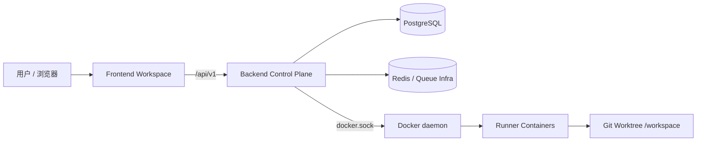
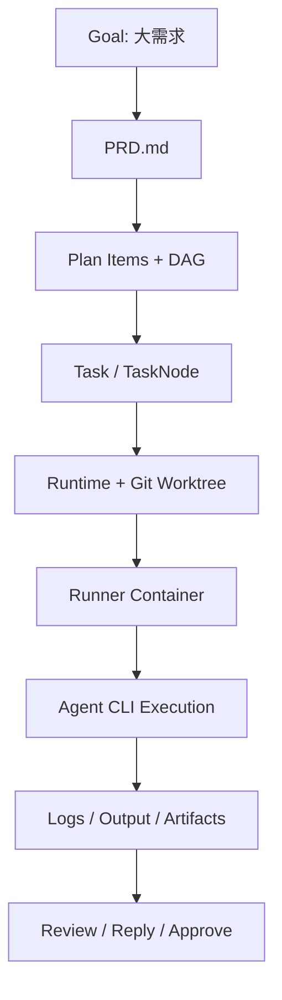

# 《AINative 技术分享：把 AI 执行纳入工程控制链的一次系统化落地》

> 受众：前端、后端、平台、测试、产品、技术管理  
> 时间：2026-04-14  
> 文档定位：这不是一篇“功能盘点”文档，而是一篇围绕系统判断、关键链路、工程权衡与可复用方法论的技术分享文章。  
> 一句话总结：AINative 的价值不在“接了多少个 Agent CLI”，而在于它把 `Goal -> PRD -> Plan -> Task -> Runner -> Review` 串成了一条可治理、可审计、可复现的工程控制链。  
> 核心判断：这个项目最值得分享的，不是某个单点功能，而是它已经把“需求治理”和“任务执行”拆到不同对象层，把“控制面”和“执行面”拆到不同运行边界，再用前端工作台把这条链路稳定承接起来。  

---

## 目录

1. [为什么 AINative 值得讲](#1-为什么-ainative-值得讲)
2. [先给结论：这到底是一个什么系统](#2-先给结论这到底是一个什么系统)
3. [系统全景：体验面、控制面、执行面](#3-系统全景体验面控制面执行面)
4. [核心主线：Goal -> PRD -> Plan -> Task -> Runner -> Review](#4-核心主线-goal---prd---plan---task---runner---review)
5. [前端为什么必须是五分区，而不是继续堆页面](#5-前端为什么必须是五分区而不是继续堆页面)
6. [工程权衡：我们为什么这样设计](#6-工程权衡我们为什么这样设计)
7. [当前代码库的成熟度判断：做对了什么，还缺什么](#7-当前代码库的成熟度判断做对了什么还缺什么)
8. [这套实践最值得复用的方法](#8-这套实践最值得复用的方法)
9. [后续演进方向](#9-后续演进方向)
10. [附录：关键证据入口](#10-附录关键证据入口)

---

## 1. 为什么 AINative 值得讲

很多 AI Coding 产品的默认叙事是：

- 用户输入一句话
- 模型理解后生成代码
- 工程师审阅结果

这条链路在小改动、短反馈、单人试验的场景里非常有效，但一旦进入真实团队协作，就会遇到几个绕不过去的问题：

1. 需求太大时，一次对话很难同时容纳 PRD、已有代码上下文、接口约束、验收标准和多角色协作信息。
2. 任务之间的依赖关系无法显式表达，系统不知道哪些步骤必须先做、哪些可以并行。
3. 执行环境不稳定，模型的结果会被宿主机状态、依赖差异、当前 shell 上下文污染。
4. 交付路径不可审计，最后只剩聊天记录，很难说清“什么时候偏了”“为什么失败”“谁介入过”。

AINative 最重要的产品化价值，就是把 AI 从“一次性对话工具”重新放回到研发流程里，让它变成一个被工程系统约束、观察和接住的执行者。

这也是为什么这个仓库值得做技术分享。它讨论的不是“怎么调 prompt”，而是更本质的问题：

- 大需求怎么先治理，再执行
- 多任务怎么建模依赖，而不是只做 checklist
- 执行怎么从宿主机迁移到隔离运行时
- 前端怎么承接复杂执行控制，而不是变成大型页面脚本

---

## 2. 先给结论：这到底是一个什么系统

AINative 不是“多个 Agent CLI 的聚合入口”，也不是“AI 聊天 + 文件树”的界面封装。

从当前代码和文档来看，它更准确的定义是：

> 一套围绕软件研发流程构建的 AI 工程控制系统。

这个判断来自 4 个已经落到代码里的边界。

### 2.1 需求治理边界已经被建模

系统没有把大需求直接压成一个 task，而是引入了 `Goal -> PRD -> Plan -> Task` 这条治理链。  
这意味着“需求没想清楚”和“执行没跑对”被拆到了不同对象层，能分别处理。

直接证据：

- [backend/src/goals/goals.service.ts](../../backend/src/goals/goals.service.ts)
- [backend/src/goals/goal-plan-dag.ts](../../backend/src/goals/goal-plan-dag.ts)
- [docs/technical/goal-task-decomposition-design.md](./goal-task-decomposition-design.md)

### 2.2 控制面和执行面已经分离

NestJS 后端没有直接把 Agent CLI 当作本机进程随便拉起，而是通过 runner 容器来隔离执行，后端自己保留权限、调度、状态、Git、日志和容器编排。

直接证据：

- [backend/src/tasks/application/task-node-execution.service.ts](../../backend/src/tasks/application/task-node-execution.service.ts)
- [backend/src/containers/container-orchestration.service.ts](../../backend/src/containers/container-orchestration.service.ts)
- [backend/src/agent-execution/runner-agent-execution.service.ts](../../backend/src/agent-execution/runner-agent-execution.service.ts)
- [backend/docs/task-container-execution-boundaries.md](../../backend/docs/task-container-execution-boundaries.md)

### 2.3 前端不是展示壳，而是控制台

前端不只是拿后端结果做列表展示，而是实际承接了任务详情、环境门禁、SSE 实时日志、人工回复、审批、工件预览、文件树、Git 相关交互。

直接证据：

- [frontend/src/pages/tasks/detail.vue](../../frontend/src/pages/tasks/detail.vue)
- [frontend/src/features/tasks/TaskDetailPage.vue](../../frontend/src/features/tasks/TaskDetailPage.vue)
- [frontend/src/features/tasks/use-task-detail-page.ts](../../frontend/src/features/tasks/use-task-detail-page.ts)

### 2.4 架构边界不是口头规范，而是门禁规则

AINative 前端已经把五分区架构和依赖方向写进了构建配置和 lint 规则。  
这意味着边界不是“团队共识”，而是“违反了就会报错”的可执行约束。

直接证据：

- [docs/dev-spec/frontend/ARCHITECTURE.md](../dev-spec/frontend/ARCHITECTURE.md)
- [.agents/skills/frontend-architecture/references/spa-architecture.md](../../.agents/skills/frontend-architecture/references/spa-architecture.md)
- [frontend/vite.config.ts](../../frontend/vite.config.ts)
- [frontend/eslint.config.ts](../../frontend/eslint.config.ts)

---

## 3. 系统全景：体验面、控制面、执行面

如果想让不同角色快速理解 AINative，最有效的方式不是从目录树开始讲，而是先讲三层边界：

- 体验面：用户如何和系统交互
- 控制面：系统如何治理对象、调度执行、管理状态
- 执行面：真正的命令和 Agent CLI 在哪里跑

### 3.1 三层边界图

### 3.2 体验面：统一工作台，而不是零散页面

`frontend/` 负责把项目、目标、任务、审批、日志、工件、环境和 Git 操作组织成一个统一工作台。  
它面对的不是“某个按钮调一个接口”，而是一整套长生命周期对象。

从 [frontend/package.json](../../frontend/package.json) 和 `src/` 结构可以看出，前端已经具备：

- Vue 3 + TypeScript + Vite 的现代 SPA 基础设施
- Vue Router + Pinia 的路由和状态基础
- Vitest + Playwright 的测试能力
- `eslint-plugin-boundaries` + `dpdm` 的架构门禁

### 3.3 控制面：把流程对象化，而不是让流程散落在页面和脚本里

`backend/` 的 NestJS 应用承担了系统里最重要的“治理职责”：

- 鉴权与权限
- 项目、业务线、技能、MCP、自动化等业务域
- Goal / Plan / Task 等核心对象
- Git 仓库、worktree、运行时目录准备
- runner 容器的 ensure / reuse / replace / remove
- 日志、状态、通知、SSE

模块装配入口可以直接看 [backend/src/app.module.ts](../../backend/src/app.module.ts)。

### 3.4 执行面：让执行脱离宿主机，变成被管理的运行时

AINative 的执行面不是“在 Nest 进程里 `child_process.spawn()` 一个 CLI 就结束了”。  
它选择的是 per-task runner 容器模型：

- 先为 task 准备长期存活的 runner 容器
- 再通过 `docker exec` 进入容器执行 Agent CLI
- 容器挂载宿主侧 worktree，但日志、状态、调度仍由控制面持有

这个判断非常关键，因为它决定了系统最终是一个“实验工具”，还是一个“可以长期演化的工程系统”。

相关说明文档：

- [backend/docs/task-runner-sandbox-models.md](../../backend/docs/task-runner-sandbox-models.md)
- [backend/docs/task-container-lifecycle-lessons.md](../../backend/docs/task-container-lifecycle-lessons.md)

---

## 4. 核心主线：Goal -> PRD -> Plan -> Task -> Runner -> Review

这条链路是整套系统最值得讲的部分，因为它把“业务价值”和“技术实现”连接了起来。

### 4.1 为什么不是“直接创建 Task”

如果系统只有 `task`，那么 PRD、计划、任务拆解、依赖、执行、验收都会被挤到同一个对象里。  
这会带来三个问题：

1. 用户分不清自己现在是在改需求，还是在执行需求。
2. 计划项无法独立确认、重排和校验。
3. 一次执行失败后，很难判断应该重做需求、重做计划，还是只重跑步骤。

AINative 选择先引入 `Goal` 层，就是为了把这些问题拆开。

### 4.2 Goal：大需求的载体，而不是执行单元

`Goal` 对应的是“大需求对象”，它承载的不是一次命令，而是一个需求生命周期：

- 需求输入和上下文资料
- PRD 生成与更新
- Plan 生成与调整
- 后续 task 物化

直接证据可以从 [backend/src/goals/goals.service.ts](../../backend/src/goals/goals.service.ts) 看到：

- `create`
- `generatePrd`
- `generatePlan`
- `materializeTasks`
- `replaceTaskDependencies`

这组方法本身就说明，系统已经把“治理阶段”当成正式能力，而不是 task 的附件。

### 4.3 Plan：不是列表，而是 DAG

真正让这套设计从“任务列表”变成“工程控制”的关键，是计划项依赖被建模成了 DAG。

[backend/src/goals/goal-plan-dag.ts](../../backend/src/goals/goal-plan-dag.ts) 做了三件事：

1. 建立邻接表
2. 检测有向环
3. 计算物化顺序

这意味着系统不是只把依赖拿来展示，而是真的用它决定：

- 哪些计划项可以先物化
- 哪些计划项必须等待前置完成
- 当前计划图是否合法

这也解释了为什么这个项目比“对话式 AI 工具”更像工程系统，因为它已经开始处理真实的调度前提，而不是只管理任务描述。

### 4.4 Task：执行域的最小工作单元

当 Plan 被物化后，系统才进入真正的任务执行域。  
Task 及其 Node 承担的，是一组可被调度、可被观察、可被人工介入的执行步骤。

从 [backend/src/tasks/tasks.controller.ts](../../backend/src/tasks/tasks.controller.ts) 可以看到，Task 暴露的不只是 CRUD，而是一整套执行控制能力：

- `execute`
- `reply`
- `approve`
- `repeat`
- `environment`
- `startEnvironment`
- `terminateEnvironment`
- detail / messages / workspace / git / terminal 等配套接口

这说明 Task 不是一个简单的数据记录，而是一个长生命周期的交互对象。

### 4.5 Runner：把执行放进隔离环境，而不是继续押注宿主机

Task Node 真正执行时，会先准备 runtime，再确保 runner 容器可用，然后把 Agent CLI 执行交给容器内的 handoff。

`TaskNodeExecutionService` 的关键职责可以从 [backend/src/tasks/application/task-node-execution.service.ts](../../backend/src/tasks/application/task-node-execution.service.ts) 直接读出来：

- `ensureRuntime`
- 记录 before/after commit
- `ensureContainer`
- `assertDockerHandoff`
- `executeAgentNode`
- 失败时写 output、更新状态、补日志

其中最重要的不是函数名，而是它表达的系统判断：

> 执行不是“跑一条命令”，而是一条要经过运行时准备、容器确保、日志写入、状态收敛、Git 回写的完整编排链。

`docker exec handoff` 的边界也在 [backend/src/agent-execution/runner-agent-execution.service.ts](../../backend/src/agent-execution/runner-agent-execution.service.ts) 里被直接写成了约束。

### 4.6 Review：人工介入不是异常，而是正式流程的一部分

AINative 任务系统不是“让 AI 自动跑到底”，而是明确把人工回复、审批、复跑、重试视为系统内的正式动作。

这点在两个地方特别明显：

- 状态机设计  
  见 [docs/technical/task-status-state-machine.md](./task-status-state-machine.md)
- 前端任务详情页交互  
  见 [frontend/src/features/tasks/use-task-detail-page.ts](../../frontend/src/features/tasks/use-task-detail-page.ts)

这说明系统从一开始就接受一个现实：

> AI 执行不是完全自动化过程，而是“自动执行 + 人工判断 + 结构化回写”的混合流程。

### 4.7 用一张图总结主链路

---

## 5. 前端为什么必须是五分区，而不是继续堆页面

如果只讲后端和 runner，这篇分享会失真，因为 AINative 的复杂度并没有止于后端。  
前端同样承担了很重的工程职责。

### 5.1 五分区的价值不在“目录更整齐”

五分区本质上是在回答一个问题：

> 当系统复杂度已经超过“几个页面 + 几个 API”时，前端如何持续承接复杂业务，而不让逻辑蔓延到所有页面。

规范里定义的职责很明确：

- `app/`：应用装配
- `pages/`：路由级薄壳
- `features/`：业务能力
- `api/`：后端通信
- `shared/`：稳定共享

规范正文：

- [.agents/skills/frontend-architecture/references/spa-architecture.md](../../.agents/skills/frontend-architecture/references/spa-architecture.md)
- [docs/dev-spec/frontend/ARCHITECTURE.md](../dev-spec/frontend/ARCHITECTURE.md)

### 5.2 当前代码已经体现出“页面薄壳，业务下沉”

任务详情页是一个非常典型的例子：

- [frontend/src/pages/tasks/detail.vue](../../frontend/src/pages/tasks/detail.vue) 只有很薄的一层路由页壳
- [frontend/src/features/tasks/TaskDetailPage.vue](../../frontend/src/features/tasks/TaskDetailPage.vue) 承接页面结构
- [frontend/src/features/tasks/use-task-detail-page.ts](../../frontend/src/features/tasks/use-task-detail-page.ts) 承接复杂状态、SSE、审批、回复、环境等逻辑

这意味着系统没有继续让 `pages/` 文件变成 1000 行以上的“万能页面”，而是开始按边界收敛复杂度。

### 5.3 前端架构是靠门禁落地的，不是靠自觉

AINative 前端做得比较对的一点，是把架构边界落到了工具配置里。

[frontend/eslint.config.ts](../../frontend/eslint.config.ts) 已经明确：

- 定义了五分区元素类型
- 定义了依赖流向
- 限制跨 feature deep import
- 限制继续使用已废弃路径
- 给 Vue 文件设置了 `max-lines`

同时，根质量门禁还会跑：

- `lint`
- `type-check`
- `dpdm` 循环依赖检查

入口可见：

- [package.json](../../package.json)
- [frontend/package.json](../../frontend/package.json)

### 5.4 任务详情页也暴露了当前前端热点

AINative 当前的前端复杂度热点也非常明确。

抽样行数：

| 文件 | 行数 |
|---|---:|
| `frontend/src/features/tasks/use-task-detail-page.ts` | 1506 |
| `frontend/src/features/tasks/TaskDetailPage.vue` | 208 |
| `frontend/src/pages/tasks/detail.vue` | 11 |

这组数字非常有信息量：

- 页面壳已经足够薄
- 真正的复杂度被收敛到了 feature 内
- 但 feature 内的编排型 composable 仍然偏重，后续还要继续拆

这说明前端迁移方向是对的，但还没有结束。

---

## 6. 工程权衡：我们为什么这样设计

一篇好的技术分享，不能只说“我们是这样做的”，还要说“为什么不是别的做法”。

### 6.1 为什么要引入 Goal，而不是继续增强 Task

可选方案其实很明确：

| 方案 | 优点 | 问题 |
|---|---|---|
| 继续增强 `task`，把 PRD / Plan 也塞进去 | 改造快 | 治理对象和执行对象混杂，阶段边界不清 |
| 引入 `Goal` 顶层对象，再物化到 `Task` | 中间态清晰，便于编辑、确认和复盘 | 需要新增实体、接口和页面 |

AINative 选择后者，是因为当前面对的已经不是“生成一次代码”，而是“治理一个大需求”。

### 6.2 为什么执行要进 runner 容器，而不是继续在宿主机上跑

宿主机执行的优点很现实：

- 启动快
- 调试简单
- 实验成本低

但在团队级系统里，它的问题也同样现实：

- 环境不一致
- 容易污染宿主
- 边界弱
- 复现困难

runner 容器的代价是引入了 Docker 编排和生命周期管理，但换来的，是隔离、可复现、可回收和更清晰的审计边界。

相关术语与画像说明：

- [backend/docs/task-runner-sandbox-models.md](../../backend/docs/task-runner-sandbox-models.md)
- [backend/docs/task-container-lifecycle-lessons.md](../../backend/docs/task-container-lifecycle-lessons.md)

### 6.3 为什么前端要做五分区，而不是继续按 views / hooks 堆积

对于小项目，页面直写逻辑完全可以接受。  
但对 AINative 这种“任务、环境、日志、审批、工件、Git、知识上下文”叠加的工作台型系统，页面堆逻辑会快速失控。

五分区的真正价值是：

- 页面层保持薄
- 业务逻辑有 feature 落点
- API 契约集中
- shared 不被业务污染
- 架构边界可以做门禁

这不是“目录审美”，而是复杂工作台的生存条件。

### 6.4 为什么状态机保持克制，而不是无限扩展状态枚举

AINative 的任务和节点状态并没有无限扩展，而是尽量用少量核心状态表达大多数场景。  
这是一种很成熟的工程取舍，因为状态一旦过多：

- 前后端理解成本会上升
- 条件分支会膨胀
- UI 文案和交互会碎裂

少量核心状态 + 清晰语义边界，比“把每种情况都发明一个新状态”更可维护。

---

## 7. 当前代码库的成熟度判断：做对了什么，还缺什么

这部分不应该写成“歌功颂德”，而要客观判断系统当前所处阶段。

### 7.1 做对了什么

#### 第一，核心边界已经存在，而且相互连接

AINative 当前最强的一点，不是某个模块写得特别花，而是这些边界已经能连成闭环：

- Goal / Plan / Task 的治理边界
- 控制面 / 执行面的运行边界
- 前端 pages / features / api / shared 的组织边界
- Git/worktree/runtime 的安全边界

这说明系统已经过了“单点功能堆砌”的阶段。

#### 第二，文档和代码在相互印证

这个仓库的技术文档密度比较高，而且很多关键判断都能在代码里找到对应实现。  
这对于做技术分享非常重要，因为分享的结论不是靠描述成立，而是靠“能落回源码”成立。

#### 第三，工程门禁已经在起作用

从根脚本、前端 lint 规则、循环依赖检查到 Docker 开发路径，说明团队已经接受了一个事实：

> 系统复杂度必须靠自动化门禁管理，不能只靠 review 和经验。

### 7.2 还缺什么

#### 第一，少数编排型文件依然过重

当前仓库里几个热点文件仍然偏大：

| 文件 | 行数 |
|---|---:|
| `backend/src/projects/projects.service.ts` | 1415 |
| `backend/src/tasks/task-git.service.ts` | 1194 |
| `backend/src/goals/goals.service.ts` | 1176 |
| `backend/src/tasks/application/task-node-execution.service.ts` | 1119 |
| `frontend/src/features/tasks/use-task-detail-page.ts` | 1506 |

这些文件的风险不只是“长”，而是它们承载的是跨域编排职责。  
一旦继续增长，后续的测试、修改和 AI 辅助编辑都会越来越难。

#### 第二，前端迁移还处在“方向明确、过程未完”的阶段

从当前 `frontend/src` 里仍能看到历史目录和新目录共存的痕迹。  
这并不代表方向有问题，而是说明架构迁移是一项持续工程，不是一次重构就能结束。

#### 第三，业务收益指标还需要继续补

当前仓库已经能支撑很多工程判断，但“效果与收益”部分更偏工程证据，而不是完整业务 KPI。  
这不是缺点，而是阶段现状。后续如果能补上：

- 执行失败率
- 环境问题占比
- 需求到 PR 的周期
- 人工介入频次
- 审批/复跑路径统计

这篇分享的说服力会更完整。

---

## 8. 这套实践最值得复用的方法

对外分享最有价值的，不是告诉别人“我们项目里有哪些目录”，而是提炼出别人可以带走的方法。

### 8.1 方法一：先把中间态建出来，再谈自动化执行

很多团队做 AI 工程系统时，会直接从“怎么让模型执行”开始。  
AINative 这套实践说明，更稳的顺序其实是：

1. 先定义需求对象
2. 再定义计划对象
3. 再定义执行对象
4. 最后把自动化执行挂上去

如果没有前面的中间态，后面的执行只会越来越难治理。

### 8.2 方法二：把“边界”写进系统，而不是写进会议纪要

AINative 前端五分区和 runner 执行边界都说明了一件事：

> 真正有执行力的架构，不是你写过文档，而是你把文档变成了别名、lint、目录、接口和运行时约束。

这点对 AI 时代尤其重要，因为 AI 不会天然遵守团队历史上下文，只有系统级约束才能稳定纠偏。

### 8.3 方法三：接受人工介入是正式流程的一部分

这套系统没有把“人工回复、审批、复跑”当成失败补丁，而是把它们当成执行链路的一部分。  
这是一个很重要的认知升级。

对于多数真实研发任务来说：

- 全自动是少数
- 半自动 + 人工判断才是常态

系统如果一开始不接受这个现实，后面就会不断用补丁逻辑修复交付过程。

### 8.4 方法四：复杂工作台前端一定要先治理编排层

AINative 的前端经验也很值得复用：

- 先把页面壳做薄
- 再把业务逻辑收进 feature
- 再用 lint 和依赖矩阵守住边界

如果直接在页面里迭代复杂交互，短期看最快，长期看代价最高。

---

## 9. 后续演进方向

基于当前代码现状，后续最值得推进的方向有 4 个。

### 9.1 继续拆薄编排热点

优先对象很明确：

- `goals.service.ts`
- `task-node-execution.service.ts`
- `task-git.service.ts`
- `use-task-detail-page.ts`

拆分目标不是机械性拆文件，而是进一步稳定“查询、命令、状态聚合、环境控制、日志流、Git 读写”这些子职责。

### 9.2 补齐工程效果指标

建议把以下指标逐步纳入可观察范围：

- task 执行成功率 / 失败率
- 人工介入节点占比
- 平均重试次数
- 环境启动耗时
- task 从创建到完成的周期

这样后续分享就不只是在讲结构，还能讲收益。

### 9.3 让 Plan 和执行调度进一步联动

当前 Plan 依赖已经具备 DAG 基础。  
后续如果要继续升级，可以逐步评估：

- 更明确的“可执行 / 不可执行”判定
- 更自动化的依赖推进
- 更清晰的计划项状态聚合

但这个升级必须建立在现有治理链稳定的前提上，而不是直接跳向“自动调度一切”。

### 9.4 继续完成前端迁移

前端已经有明确方向，后续重点不是重新设计一套架构，而是持续把历史路径收敛到五分区和公开 API 模式上。

---

## 10. 附录：关键证据入口

### 10.1 仓库与基础设施

- [README.md](../../README.md)
- [package.json](../../package.json)
- [frontend/package.json](../../frontend/package.json)
- [backend/package.json](../../backend/package.json)
- [backend/src/app.module.ts](../../backend/src/app.module.ts)

### 10.2 Goal / Plan / Task 主链路

- [backend/src/goals/goals.service.ts](../../backend/src/goals/goals.service.ts)
- [backend/src/goals/goal-plan-dag.ts](../../backend/src/goals/goal-plan-dag.ts)
- [docs/technical/goal-task-decomposition-design.md](./goal-task-decomposition-design.md)
- [docs/technical/task-status-state-machine.md](./task-status-state-machine.md)

### 10.3 Task / Runtime / Runner / Container

- [backend/src/tasks/tasks.controller.ts](../../backend/src/tasks/tasks.controller.ts)
- [backend/src/tasks/application/task-node-execution.service.ts](../../backend/src/tasks/application/task-node-execution.service.ts)
- [backend/src/tasks/task-runtime.service.ts](../../backend/src/tasks/task-runtime.service.ts)
- [backend/src/tasks/application/task-runtime-orchestrator.service.ts](../../backend/src/tasks/application/task-runtime-orchestrator.service.ts)
- [backend/src/containers/container-orchestration.service.ts](../../backend/src/containers/container-orchestration.service.ts)
- [backend/src/agent-execution/runner-agent-execution.service.ts](../../backend/src/agent-execution/runner-agent-execution.service.ts)
- [backend/docs/task-container-execution-boundaries.md](../../backend/docs/task-container-execution-boundaries.md)
- [backend/docs/task-runner-sandbox-models.md](../../backend/docs/task-runner-sandbox-models.md)
- [backend/docs/task-container-lifecycle-lessons.md](../../backend/docs/task-container-lifecycle-lessons.md)

### 10.4 前端架构与控制台

- [docs/dev-spec/frontend/ARCHITECTURE.md](../dev-spec/frontend/ARCHITECTURE.md)
- [.agents/skills/frontend-architecture/references/spa-architecture.md](../../.agents/skills/frontend-architecture/references/spa-architecture.md)
- [frontend/vite.config.ts](../../frontend/vite.config.ts)
- [frontend/eslint.config.ts](../../frontend/eslint.config.ts)
- [frontend/src/pages/tasks/detail.vue](../../frontend/src/pages/tasks/detail.vue)
- [frontend/src/features/tasks/index.ts](../../frontend/src/features/tasks/index.ts)
- [frontend/src/features/tasks/TaskDetailPage.vue](../../frontend/src/features/tasks/TaskDetailPage.vue)
- [frontend/src/features/tasks/use-task-detail-page.ts](../../frontend/src/features/tasks/use-task-detail-page.ts)
- [frontend/src/pages/goals/GoalDetail.vue](../../frontend/src/pages/goals/GoalDetail.vue)
- [frontend/src/features/goals/composables/useGoalDetail.ts](../../frontend/src/features/goals/composables/useGoalDetail.ts)
- [frontend/src/features/goals/composables/useGoalDetailPlanItems.ts](../../frontend/src/features/goals/composables/useGoalDetailPlanItems.ts)

---

## 结语

如果要用一句话概括这篇分享，我会这样说：

> AINative 最有价值的地方，不是“AI 会不会写代码”，而是它已经开始让 AI 以工程系统可以接受的方式参与交付。

对于真实团队来说，这比“更像人”的模型更重要。因为真正决定系统上限的，往往不是生成能力，而是治理能力、执行边界和交付可控性。
