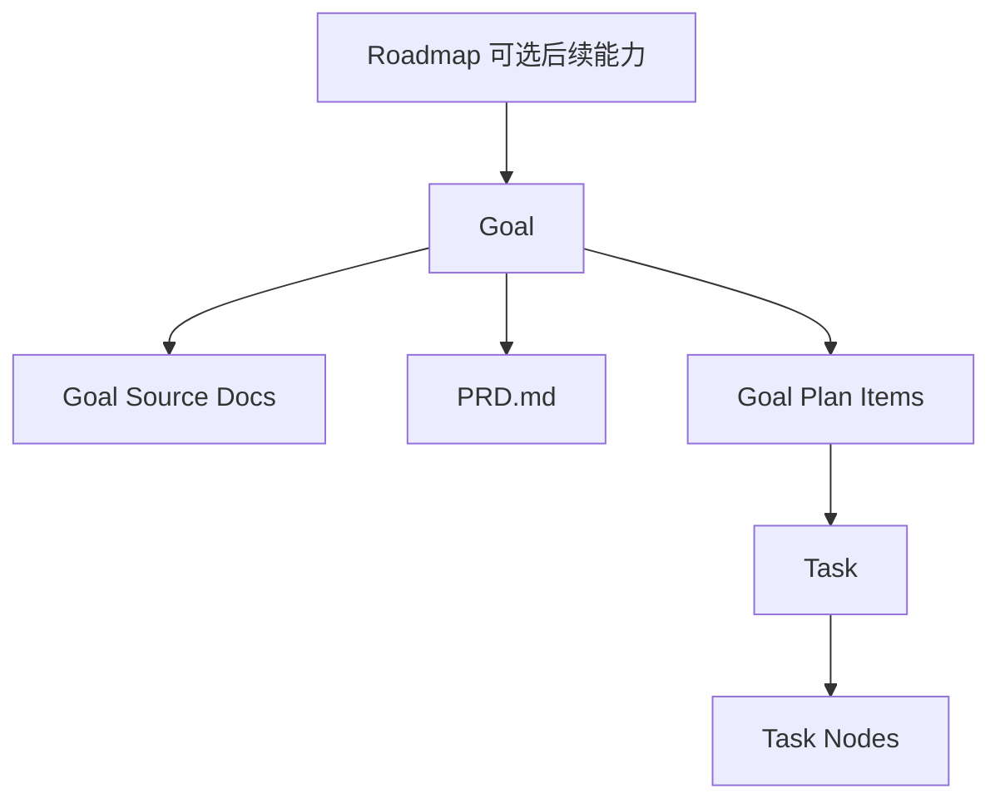
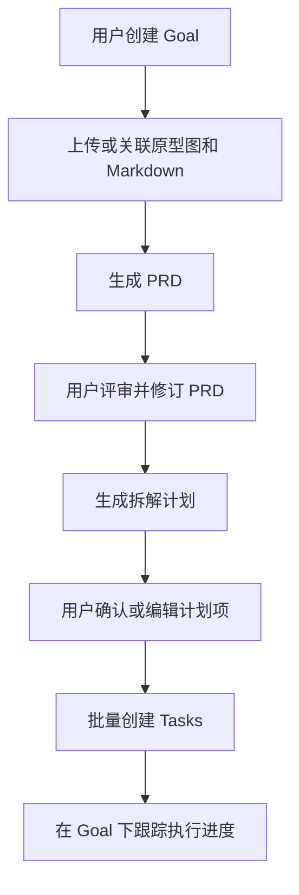

# 大任务拆解为多任务技术方案

## 文档信息

- 状态：Proposal
- 目标版本：V1
- 文档语言：中文
- 适用范围：AINative 项目内需求拆解、PRD 生成与任务派生流程
- 当前假设：V1 先新增 `Goal` 目标层，不在首版同时引入 `Roadmap` 作为独立核心实体；如后续需要跨目标编排，再在 `Goal` 之上增加 `Roadmap`

## 1. 背景

当前系统已经具备以下基础能力：

- `task` 是现有的核心执行实体，负责承载一次会话式或工作流式执行
- `task node` 支持在单个任务内部按节点顺序驱动 Agent / skill 执行
- `workflow template` 可以为任务提供标准化节点编排
- 项目 `docs` 已支持上传、读取、预览与知识库问答，能够作为原型图、Markdown 说明和产出文档的承载层

当前缺失的能力是“大需求先拆解，再落任务”这一层。

现状中，用户往往直接把一个较大的需求交给 `task` 或 OpenSpec 执行。由于单次上下文过大、目标混杂、交付边界不清，最终常见问题包括：

- PRD 或执行结果覆盖范围过大，细节不稳定
- 多个子功能、页面、接口和联调事项被混在一个任务里
- 任务之间的依赖关系无法表达，只能靠人工记忆
- 评审点过晚，通常要等到单个大任务执行完成后才发现方向偏移

因此需要在当前 `task` 之上新增一个“目标拆解层”，让用户先基于原型图和 Markdown 说明产出 PRD，再基于 PRD 生成多条可执行任务。

## 2. 问题定义与动机

本方案要解决的核心问题如下：

1. 如何让“大需求”先被收敛成结构化 PRD，而不是直接进入执行态。
2. 如何把 PRD 再拆成多条粒度适中的任务，避免单任务上下文爆炸。
3. 如何显式表达子任务之间的顺序和依赖关系，而不是只生成一组无组织的任务。
4. 如何尽量复用现有 `task`、`workflow template`、项目 `docs` 和 Agent 执行基础设施，避免另起一套系统。
5. 如何让拆解结果可复审、可编辑、可重复生成，而不是一次性 prompt 产物。

## 3. 范围

### 3.1 In Scope

- 新增 `Goal` 目标层，作为 `task` 之上的需求承载实体
- 支持用户为目标关联原型图、Markdown 需求文档和参考资料
- 基于输入资料生成结构化 `PRD.md`
- 基于 `PRD.md` 生成结构化拆解计划
- 从拆解计划批量创建多条 `task`
- 记录任务依赖关系与拆解快照
- 在前端提供目标详情页，展示 PRD、拆解结果、任务列表和当前进度

### 3.2 Out of Scope

- V1 不建设独立的复杂项目管理系统
- V1 不支持自动生成精确工时评估或资源排期
- V1 不建设跨项目的 Roadmap 看板
- V1 不替换现有直接创建 `task` 的入口，旧流程继续保留
- V1 不做跨任务自动调度执行器；任务依赖先用于展示、过滤和人工推进

## 4. 方案选型

### 方案 A：仅增强现有 `task`，把大需求拆解信息写入 `task.configJson`

做法：

- 不新增顶层实体
- 在当前 `task` 上增加 PRD 路径、拆解结果和子任务列表配置
- 通过一个“主 task”管理全部拆解结果

优点：

- 改造面最小
- 对数据库和前端入口改动较少

缺点：

- `task` 既承载目标定义又承载执行，不利于职责边界清晰
- 一旦从主任务派生出多条任务，数据归属会变得混乱
- 难以表达“PRD 已确认但任务尚未创建”的中间状态

### 方案 B：新增 `Goal` 目标层，在目标下生成 PRD、拆解计划和多条任务（推荐）

做法：

- 在 `task` 之上新增 `Goal`
- `Goal` 负责承载需求输入、PRD、拆解计划和任务派生关系
- `task` 保持为执行单元，继续复用现有工作流和 CLI Runner

优点：

- 目标定义与执行实体分层清晰
- 能自然表达“草稿 -> PRD -> 拆解 -> 任务创建 -> 执行推进”的状态流转
- 有利于后续继续往上扩展 `Roadmap -> Goal -> Task`

缺点：

- 需要新增后端实体、接口和前端页面
- 需要引入少量新的状态机与权限判断

### 方案 C：基于动态工作流 DAG 自动生成执行图

做法：

- 用户上传资料后，系统先生成 `PRD.md`
- 再基于输入资料和 `PRD.md` 自动生成一个动态工作流 DAG
- DAG 中的每个节点代表一个可执行的子任务、子阶段或检查点
- 节点之间通过依赖边表达执行顺序、并行关系和前置约束
- 平台复用现有 `workflow` / `task node` 执行基础设施，但工作流不再完全依赖人工预先配置模板，而是由模型按当前需求动态生成

优点：

- 天然具备任务拆分能力，拆分结果直接以 DAG 节点形式表达
- 可以显式表达串行、并行、汇合等依赖关系，比线性任务列表更接近真实实施路径
- 如果 DAG 质量足够稳定，后续可以进一步减少人工把 PRD 再翻译成任务的步骤

缺点：

- 改造复杂度明显高于方案 B，需要引入“动态生成工作流定义”的新链路
- 当前系统的 `workflow template` 更偏静态模板，若支持动态 DAG，需要补充运行时工作流持久化、节点依赖校验和图结构编辑能力
- 模型一旦生成错误的 DAG 结构，问题会直接传导到后续执行阶段，纠偏成本高于文本计划
- 对可解释性要求更高，必须让用户能清楚看到“为什么拆成这些节点、依赖为什么这样连”

### 选型结论

推荐采用方案 B。

原因：

- 当前项目已经有成熟的 `task` 执行基础设施，适合继续把 `task` 作为执行单元保留。
- 问题本质不是“再写一个更长的 prompt”，而是需要一个稳定的上层对象来承载拆解过程。
- `Goal` 是最小且清晰的新增边界；后续如确实需要路线图能力，可再在 `Goal` 之上增加 `Roadmap`，避免 V1 一次引入两个新核心概念。
- 动态工作流 DAG 更适合作为后续演进方向：当 `Goal -> PRD -> Plan Item -> Task` 这条链路稳定后，再考虑把 `Plan Item` 进一步收敛为可执行图结构。

## 5. 推荐方案总览

### 5.1 核心对象关系

推荐的领域关系如下：

其中：

- `Goal`：承载一个完整但可拆解的大需求
- `Goal Source Docs`：关联原型图、Markdown 需求文档、参考资料
- `PRD.md`：由资料归纳得到的结构化产品文档
- `Goal Plan Items`：PRD 拆出来的任务计划项
- `Task`：真正执行的最小交付单元，继续复用现有能力

### 5.2 用户流程

### 5.3 V1 设计原则

- 先解决“能稳定拆出来”再追求“全自动跑完”
- 结构化对象优先于一次性文本输出
- PRD 与拆解计划都要可复审、可再生成、可人工修正
- 任务执行继续复用现有 `task` / `workflow template` 体系

## 6. 数据模型设计

### 6.1 Goal

建议新增 `goals` 表，核心字段如下：

- `id`
- `projectId`
- `businessLineId`
- `title`
- `summary`
- `status`
  候选值：`draft`、`prd_generated`、`prd_confirmed`、`planned`、`in_progress`、`done`、`archived`
- `sourceType`
  候选值：`manual`、`openspec`
- `prdDocPath`
- `planDocPath`
- `planVersion`
- `defaultWorkflowTemplateId`
- `createdBy`
- `createdAt`
- `updatedAt`
- `deletedAt`

设计说明：

- `Goal` 是状态流转主体
- `prdDocPath` 和 `planDocPath` 指向项目 `docs` 下的文档产物
- `defaultWorkflowTemplateId` 用于在批量创建任务时应用统一模板

### 6.2 Goal Source Docs

建议新增 `goal_source_docs` 表：

- `id`
- `goalId`
- `projectDocPath`
- `docType`
  候选值：`prototype`、`requirement`、`reference`
- `sortOrder`
- `metadataJson`
- `createdAt`

设计说明：

- 仅存项目 `docs` 相对路径，不复制原文件
- `metadataJson` 可记录文件摘要、页面数、上传来源等信息

### 6.3 Goal Plan Item

建议新增 `goal_plan_items` 表，作为拆解的结构化快照：

- `id`
- `goalId`
- `parentId`
- `title`
- `summary`
- `acceptanceCriteria`
- `suggestedPrompt`
- `estimatedComplexity`
  候选值：`S`、`M`、`L`
- `status`
  候选值：`draft`、`approved`、`task_created`、`cancelled`
- `dependsOnItemIds`
- `taskId`
- `orderIndex`
- `createdAt`
- `updatedAt`

设计说明：

- 先把拆解结果沉淀为 `Goal Plan Item`，再决定是否物化为 `task`
- `taskId` 为空表示该计划项尚未创建执行任务
- `parentId` 允许后续支持树状拆解，但 V1 前端可先只展示一级列表

### 6.4 Task Dependency

当前系统没有跨任务依赖模型。为支持拆解结果的顺序表达，建议新增轻量的 `task_dependencies` 表：

- `id`
- `predecessorTaskId`
- `successorTaskId`
- `relationType`
  候选值：`blocks`
- `createdAt`

设计说明：

- V1 依赖关系先用于展示与“是否可开始”判断，不进入自动调度
- 后续如果需要自动推进，可在此模型基础上扩展

## 7. 文档产物与存储约定

建议统一复用项目 `docs` 目录，按目标维度组织：

- 输入资料目录：`goals/{{goalId}}/input/`
- 生成 PRD：`goals/{{goalId}}/PRD.md`
- 生成拆解说明：`goals/{{goalId}}/task-plan.md`

其中：

- 原型图、Markdown 文档、参考材料都放在 `input/` 下或通过 `goal_source_docs` 引用已有文件
- `PRD.md` 作为后续再生成拆解计划的稳定输入
- `task-plan.md` 面向人工阅读，`goal_plan_items` 面向结构化查询

## 8. 核心流程设计

### 8.1 PRD 生成流程

1. 用户创建 `Goal`
2. 用户上传或选择原型图、Markdown 说明等资料
3. 后端组装目标上下文，调用 Agent / skill 生成 `PRD.md`
4. 结果写入项目 `docs`
5. 更新 `Goal.status = prd_generated`

PRD 输出必须至少包含：

- 背景与目标
- 用户角色与场景
- 页面或模块概览
- 功能需求明细
- 关键交互流程
- 范围界定
- 假设与待确认项

### 8.2 拆解计划生成流程

1. 用户在 `Goal` 下发起“生成拆解计划”
2. 后端读取 `PRD.md` 和关联输入资料
3. Agent 输出结构化计划项
4. 后端将计划项写入 `goal_plan_items`
5. 同时生成面向人工查看的 `task-plan.md`
6. 更新 `Goal.status = planned`

计划项生成要求：

- 每项聚焦一个可交付结果
- 每项都要有清晰标题、目标、验收标准
- 单项尽量控制在适合一个 `task` 承载的上下文规模
- 对存在前置依赖的项显式标记依赖

### 8.3 任务物化流程

1. 用户勾选或确认若干 `Goal Plan Item`
2. 系统为每个计划项创建一条 `task`
3. 将 `taskId` 反写回对应计划项
4. 如计划项存在依赖，则写入 `task_dependencies`
5. `Goal` 聚合任务状态，更新整体进度

任务创建时建议继承以下信息：

- `projectId`
- `businessLineId`
- `defaultWorkflowTemplateId`
- 计划项的标题和建议 prompt
- 关联的 `PRD.md` 路径和源资料路径

## 9. API 与交互契约

### 9.1 后端 API 草案

- `POST /goals`
- `GET /goals`
- `GET /goals/:id`
- `PATCH /goals/:id`
- `POST /goals/:id/source-docs`
- `POST /goals/:id/generate-prd`
- `POST /goals/:id/generate-plan`
- `PATCH /goals/:id/plan-items/:itemId`
- `POST /goals/:id/materialize-tasks`
- `GET /goals/:id/tasks`

### 9.2 前端页面草案

建议新增两类界面：

1. `Goal` 列表页
2. `Goal` 详情页

`Goal` 详情页建议包含以下区域：

- 基本信息
- 输入资料列表
- PRD 预览
- 拆解计划列表
- 已创建任务列表
- 进度概览

### 9.3 与现有任务体系的集成

- `task` 本身不承担拆解逻辑
- `workflow template` 继续只定义单任务内部节点
- `Goal` 负责把一个大需求拆成多个 `task`
- 现有任务详情页不必大改，只需增加从 `task` 跳回所属 `Goal` 的入口即可

## 10. Agent 与提示词策略

### 10.1 PRD 生成输入

PRD 生成时的主要输入包括：

- `Goal.title`
- `Goal.summary`
- 关联原型图
- 关联 Markdown 文档
- 项目基础上下文

### 10.2 拆解计划生成输入

拆解计划生成时优先使用：

- `PRD.md`
- `Goal` 基础信息
- 用户对拆解粒度的可选偏好

### 10.3 稳定性约束

为降低大模型输出波动，建议平台侧增加以下约束：

- PRD 和拆解计划都采用固定章节模板
- 结构化结果要求同时输出 Markdown 版与 JSON 版
- 输出中必须包含“假设与待确认项”
- 若模型无法可靠判断依赖关系，必须显式标为“待人工确认”

## 11. 风险与应对

### 风险 1：拆解粒度不稳定

表现：

- 有时拆得过粗，仍然形成大任务
- 有时拆得过细，导致任务碎片化

应对：

- 引入固定拆解模板和示例
- 支持用户选择“保守/标准/细粒度”拆解模式
- 允许人工编辑 `Goal Plan Item` 后再创建任务

### 风险 2：原型图和 Markdown 信息冲突

表现：

- 页面结构与文档说明不一致

应对：

- 在 PRD 中保留冲突说明
- 进入“待确认项”，不直接生成强结论

### 风险 3：依赖关系推断错误

表现：

- 生成了错误的前置任务关系，影响执行顺序

应对：

- 依赖关系默认允许人工调整
- V1 不把依赖接入自动调度，避免错误放大

### 风险 4：模型上下文再次过大

表现：

- 用户一次上传过多原型和文档，导致生成质量下降

应对：

- 平台侧对输入做摘要和裁剪
- 对超长文档采用分段读取与汇总策略
- 把 PRD 生成与拆解计划生成拆成两步，避免一次完成所有事情

## 12. 安全性考虑

- 对项目 `docs` 路径做严格校验，禁止越权读取
- 对上传文档内容进行基本的类型和大小限制
- 将外部文档视为不可信输入，防止 prompt injection 直接覆盖系统指令
- 对生成内容中的敏感信息引用保留来源追踪，便于审核
- 权限层面复用项目级访问控制，只有具备项目读写权限的用户才能创建和修改 `Goal`

## 13. 测试策略

### 13.1 后端

- `Goal`、`Goal Source Docs`、`Goal Plan Item`、`Task Dependency` 的仓储与服务单测
- PRD 生成、计划生成、任务物化流程的应用服务单测
- 依赖关系写入和状态聚合测试

### 13.2 前端

- `Goal` 列表与详情页组件测试
- PRD 预览、计划项编辑、批量创建任务交互测试
- 从 `Goal` 跳转 `task` 的联动测试

### 13.3 端到端

- 上传资料 -> 生成 PRD -> 生成计划 -> 批量创建任务 的完整链路测试
- 原型 + Markdown 冲突场景测试
- 无依赖 / 有依赖 / 循环依赖防护场景测试

## 14. 监控与可观测性

建议增加以下指标：

- `goal_created_total`
- `goal_prd_generation_total`
- `goal_prd_generation_failed_total`
- `goal_plan_generation_total`
- `goal_plan_generation_failed_total`
- `goal_materialized_tasks_total`
- `goal_plan_manual_edit_rate`

建议记录以下关键日志：

- 目标创建
- 文档关联
- PRD 生成开始与结束
- 计划生成开始与结束
- 任务批量创建结果

## 15. 回滚方案

如果 V1 上线后质量不达预期，可按以下方式回退：

1. 通过 feature flag 关闭 `Goal` 入口
2. 保留现有直接创建 `task` 的流程
3. 已创建的 `task` 不受影响，继续按原方式执行
4. 已生成的 `Goal` 数据保留，只停止新建和新流程入口

该回滚方式不会影响现有 `task`、`workflow template` 和项目 `docs` 能力。

## 16. 实施计划

### Phase 1：领域模型与基础接口

- 新增 `Goal`、`Goal Source Docs`、`Goal Plan Item`、`Task Dependency`
- 提供基础 CRUD 与关联资料接口
- 提供 `Goal` 状态聚合逻辑

### Phase 2：PRD 生成链路

- 接通项目 `docs` 资料读取
- 实现 PRD 生成服务
- 写入 `PRD.md` 并提供前端预览

### Phase 3：拆解计划与任务物化

- 实现计划生成服务
- 支持计划项编辑、确认和批量创建 `task`
- 建立任务依赖关系

### Phase 4：前端体验与观测

- 完成 `Goal` 列表页和详情页
- 增加指标、日志和基础失败提示
- 在任务详情页补充来源目标跳转

## 17. 开放问题

- 是否需要在 V1 就支持“重新生成计划但保留人工编辑”的合并策略
- `Goal` 的默认工作流模板是否由项目配置决定，还是由用户在创建时选择
- 是否需要支持一个 `Goal` 下分批次创建任务，而不是一次全部创建
- 后续如引入 `Roadmap`，是否只做 `Roadmap -> Goal` 分组，还是要承担跨目标排期能力

## 18. 结论

本方案建议在现有 `task` 体系之上新增 `Goal` 目标层，形成“输入资料 -> PRD -> 拆解计划 -> 多任务执行”的分层流程。

该方案的关键价值在于：

- 把大需求从执行态前移到规划态处理
- 让 PRD 和拆解结果成为可持续管理的结构化对象
- 继续复用当前成熟的 `task` / `workflow template` / 项目 `docs` 能力
- 为后续演进到 `Roadmap -> Goal -> Task` 预留了清晰边界
