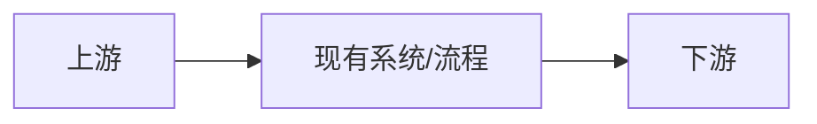
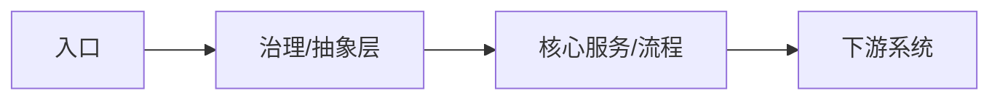

# 技术复盘文章模板（面向跨团队技术同学）

> 适用场景：架构演进、工程治理、稳定性治理、性能优化、平台建设、复杂问题排查、交付模式改造。  
> 模板目标：既讲清楚一个真实案例是怎么做成的，也沉淀出其他团队可以复用的方法。  
> 使用方式：将文中的 `[...]` 替换为实际内容；不适用的章节直接删除，不要保留空标题。

---

# 《[项目/专题名] 复盘：我们如何解决 [核心问题]，并沉淀出 [方法/经验]》

> 作者：[姓名 / 团队]  
> 时间：[YYYY-MM-DD]  
> 读者：[跨团队研发 / 基础架构 / 平台 / 效能 / 技术管理者]  
> 关键词：[性能] [稳定性] [架构] [工程化] [治理]  
> 一句话结论：我们通过 [核心动作] 解决了 [核心问题]，最终带来了 [量化结果]。  
> 建议阅读时间：[8-12 分钟]

## 写在前面

这篇文章适合谁看：
- 如果你正在遇到 [相似问题]，可以重点看「关键决策」和「落地过程」
- 如果你关心跨团队协作或治理方法，可以重点看「经验沉淀」和「适用边界」
- 如果你只想快速了解结果，可以先看「摘要」和「最终收益」

读完你应该能带走 3 件事：
- [带走点 1：例如，为什么原方案在规模上失效]
- [带走点 2：例如，这类问题该如何做方案取舍]
- [带走点 3：例如，哪些经验可以迁移到别的团队]

---

## 摘要

### 背景
[用 3-5 句话讲清业务背景、技术场景和触发时机。避免项目黑话，假设读者不了解你的上下文。]

### 问题
[一句话描述最核心的问题。]

具体表现：
- [现象 1：发生了什么]
- [现象 2：影响了什么]
- [现象 3：为什么不能继续接受]

### 方案
[一句话描述最终采用的方案。]

### 结果
- [结果 1：量化指标变化]
- [结果 2：交付、稳定性或协作收益]
- [结果 3：额外的长期价值]

### 可复用经验
- [经验 1]
- [经验 2]
- [经验 3]

---

## 1. 背景：这个问题为什么值得解决

### 1.1 业务与技术上下文
- 业务场景：[系统服务谁，处于什么链路，承担什么职责]
- 当前阶段：[增长期 / 重构期 / 治理期 / 平台化期]
- 涉及角色：[业务研发 / 平台 / 测试 / 运维 / 产品 / 其他]

### 1.2 当时的现实压力
- 触发因素：[业务增长、事故暴露、成本压力、交付效率、组织协作、合规要求等]
- 为什么是现在：[不解决会造成什么具体问题]
- 为什么之前没有做：[历史原因、优先级、技术债、条件不成熟等]

### 1.3 文章要回答的问题
- 我们到底遇到了什么问题？
- 为什么之前的做法不再成立？
- 我们在几种方案里为什么选择了这一种？
- 这个方案真正带来了什么结果？
- 哪些经验值得其他团队直接借鉴？

### 经验沉淀
- 背景部分不要堆业务细节，要解释“问题成立的条件”
- 跨团队文章最重要的是让外部读者快速进入上下文

---

## 2. 问题：真正的矛盾在哪里

### 2.1 现状描述
- 当前系统或流程是怎样运转的：[一句话概括]
- 涉及的关键链路：[上游 -> 当前系统 -> 下游]
- 当前指标：[QPS、延迟、错误率、交付周期、变更失败率、成本等]

如有必要，可补充一张现状图：

### 2.2 具体问题
- 问题 1：[现象 + 影响]
- 问题 2：[现象 + 影响]
- 问题 3：[现象 + 影响]

推荐写法：
- 不要只写“系统复杂”“性能差”“维护困难”
- 要写成“在 [场景] 下，出现了 [现象]，导致 [影响]”

### 2.3 证据与根因
- 证据 1：[监控 / 日志 / 压测 / 工单 / 事故复盘 / 用户反馈]
- 证据 2：[...]
- 根因判断：[根据证据推导出的核心原因]

可以按下面的方式写：

| 现象 | 证据 | 根因 | 影响 |
|---|---|---|---|
| [...] | [...] | [...] | [...] |
| [...] | [...] | [...] | [...] |

### 2.4 问题的本质
[用一段话说清：这不是一个孤立故障，而是系统、流程、职责、抽象或治理方式上的结构性问题。]

### 经验沉淀
- 问题分析要用证据驱动，而不是感受驱动
- 文章里最有价值的不是“有问题”，而是“为什么会演化成这个问题”

---

## 3. 决策：我们为什么这样做，而不是那样做

### 3.1 目标与约束

目标：
- [目标 1：尽量可量化]
- [目标 2：尽量可量化]
- [目标 3：例如降低复杂度、统一边界、提升交付稳定性]

非目标：
- [明确这次不解决什么]

约束：
- [人力、时间、兼容性、技术栈、历史包袱、组织边界]

### 3.2 可选方案

| 方案 | 核心思路 | 优点 | 缺点 / 风险 | 为什么没选 / 为什么选了 |
|---|---|---|---|---|
| 方案 A | [...] | [...] | [...] | [...] |
| 方案 B | [...] | [...] | [...] | [...] |
| 方案 C（最终） | [...] | [...] | [...] | [...] |

### 3.3 关键决策点
- 决策点 1：[例如先治理边界，再做功能扩展]
- 决策点 2：[例如优先保守迁移，而不是一次性重写]
- 决策点 3：[例如先统一观测，再优化性能]

每个决策点建议回答：
- 我们当时在权衡什么？
- 最怕什么风险？
- 最终用什么原则做判断？

### 3.4 最终方案
[用 1-2 段话概括最终方案，不要直接铺细节，先让读者知道整体思路。]

如有必要，可补充目标形态图：

### 经验沉淀
- 复盘文章里最容易缺失的是“为什么选这个方案”
- 只写“做了什么”价值有限；写清“为什么这样取舍”才对跨团队有参考价值

---

## 4. 落地：方案是怎么一步步做出来的

### 4.1 推进策略
- 阶段 1：[最小闭环做什么，如何验证]
- 阶段 2：[扩大覆盖面，如何控制风险]
- 阶段 3：[治理与收尾，如何固化成果]

### 4.2 关键实现
- 实现点 1：[做了什么，解决了哪个具体问题]
- 实现点 2：[...]
- 实现点 3：[...]

如果是偏工程/架构类文章，建议补充：
- 模块边界：[谁负责什么]
- 数据或状态流转：[信息如何流动]
- 兼容策略：[如何避免影响存量系统]
- 回滚策略：[出问题如何止损]

### 4.3 过程中的难点
- 难点 1：[难在哪里]
- 处理方式：[如何拆解、规避、验证]
- 难点 2：[...]

### 4.4 协作与推进
- 涉及团队：[哪些团队参与]
- 协作机制：[评审、对齐、灰度、验收、值班、复盘]
- 为什么这种推进方式有效：[例如降低认知成本、减少回滚风险]

### 经验沉淀
- 落地部分要写“过程中的真实阻力”，这比纯技术细节更有参考价值
- 真正可复用的经验，往往出现在实施策略和协作机制里

---

## 5. 结果：最终带来了什么变化

### 5.1 指标变化

| 指标 | 改造前 | 改造后 | 变化 |
|---|---|---|---|
| [指标 1] | [...] | [...] | [...] |
| [指标 2] | [...] | [...] | [...] |
| [指标 3] | [...] | [...] | [...] |

### 5.2 真实收益
- 对业务的收益：[稳定性、体验、效率、成本、容量等]
- 对研发的收益：[可维护性、可测试性、排障效率、交付速度]
- 对组织的收益：[协作方式、职责边界、治理能力、复用能力]

### 5.3 一个最能说明问题的案例
[选一个最典型的例子，说明改造前后的差异。可以是一次峰值、一次事故、一次迭代、一次跨团队协作。]

### 5.4 结果之外的意外收获
- [例如顺手拆掉了历史耦合]
- [例如沉淀了规范、工具或平台能力]
- [例如暴露出新的系统问题，为下一阶段治理提供了抓手]

### 经验沉淀
- 结果部分尽量用事实和数据说话
- 如果没有漂亮数字，也可以写“复杂度下降、协作成本下降、可控性增强”这类真实收益，但要举证

---

## 6. 复盘：哪些经验值得复用，哪些边界要讲清

### 6.1 这次做对了什么
- [做对点 1]
- [做对点 2]
- [做对点 3]

### 6.2 这次做得不够好的地方
- [不足 1：为什么会这样]
- [不足 2：如果重来一次会怎么做]
- [不足 3：还有哪些债没有还完]

### 6.3 可复用的方法
- 方法 1：[适用场景 + 做法]
- 方法 2：[适用场景 + 做法]
- 方法 3：[适用场景 + 做法]

推荐写法：
- 不要只写结论
- 要写成“当你遇到 [场景] 时，可以尝试 [方法]，前提是 [条件]”

### 6.4 适用边界
- 这个方法不适用于什么情况：[...]
- 哪些前提不成立时不要照搬：[...]
- 哪些成本在你们团队未必划算：[...]

### 经验沉淀
- 真正优秀的复盘文章，不只是总结成功经验，也会讲清适用边界
- 能被别的团队复用的方法，必须同时包含“做法”和“边界”

---

## 7. 后续：下一步准备怎么做

- 下一步方向 1：[目标 + 原因 + 预期收益]
- 下一步方向 2：[...]
- 暂时不做的事：[为什么现在不做]

---

## 8. 附录

### 8.1 术语表

| 术语 | 含义 |
|---|---|
| [...] | [...] |

### 8.2 参考资料
- [设计文档]
- [相关代码入口]
- [监控面板]
- [压测报告]
- [事故复盘 / 会议纪要 / RFC]

---

## 写作检查清单

发出前，建议逐项检查：

- 标题是否说清楚“解决了什么问题”
- 开头是否让不熟悉背景的读者也能看懂
- 是否写清楚了“为什么做”和“为什么现在做”
- 是否用证据支撑了问题和根因判断
- 是否解释了关键决策和取舍
- 是否写出了真实落地过程，而不只是结果
- 是否有量化结果或可信的事实证据
- 是否沉淀了别的团队可以复用的方法
- 是否明确说明了适用边界，避免误导照搬
- 是否删掉了空章节、套话和项目黑话

## 常见失败写法

- 只有过程，没有结论
- 只有结果，没有推导
- 只有技术细节，没有业务上下文
- 只有本团队黑话，没有跨团队可读性
- 只有“我们做了什么”，没有“为什么这样做”
- 只有成功经验，没有失败教训和适用边界
