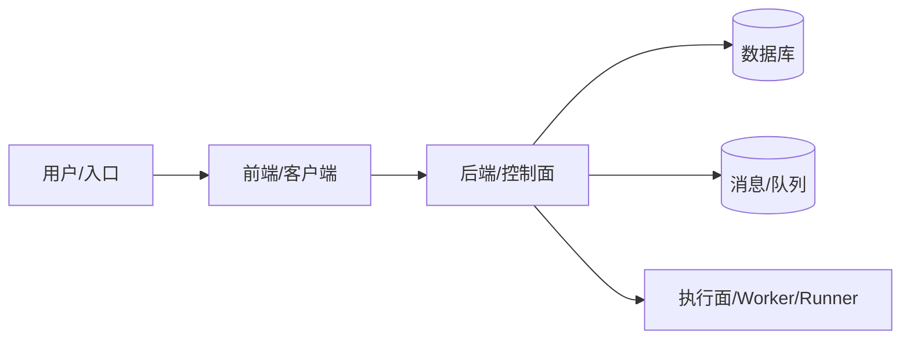
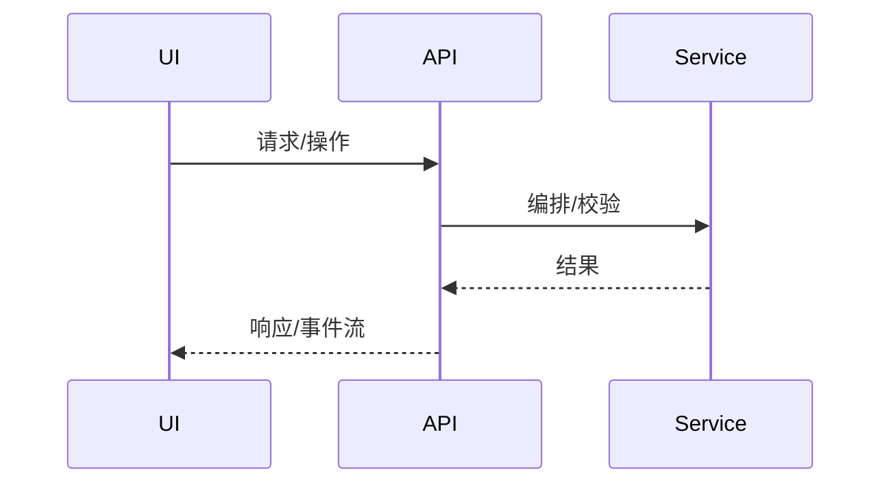

# 技术分享文章模板（文章版优先，可直接复制使用）

> 用途：用于沉淀“可阅读、可复盘、可追溯”的技术分享文章。  
> 适用：架构演进、平台建设、性能治理、稳定性改造、工程化落地、复杂功能产品化等主题。  
> 使用方式：把文中的方括号内容 `[...]` 替换成你们项目的实际信息；不适用的章节可以删减，但建议保留主线。  
> 写作建议：先讲“为什么值得讲”，再讲“为什么这样做”，最后讲“证据和收益”。

## 写作原则（建议保留）

- 证据优先：关键结论尽量附上证据入口，如设计文档、代码路径、监控面板、压测报告、事故复盘、PR 链接。
- 先结论后展开：每节优先给出判断，再补背景、推理和证据。
- 对听众友好：避免把分享写成实现细节堆砌，优先解释价值、边界、权衡和复用意义。
- 不强求只有 KPI：如果没有完整量化指标，也可以写结构性收益、工程收益、协作收益，但要明确证据边界。

---

# 《[项目名] 技术分享：从[问题/目标]到[结果]》

> 受众：[跨团队/研发/平台/产品/测试/运维]  
> 文章目标：[希望读者读完后理解什么、记住什么、能复用什么]  
> 作者：[姓名/团队]｜时间：[YYYY-MM-DD]  
> 一句话总结：用[核心方案]解决了[关键问题]，带来[可量化收益/关键变化]。  
> 核心判断：[一句话讲清这篇文章最重要的判断，例如：问题本质不在模型能力，而在工程控制能力]  
> 读者收益：[例如：理解系统边界、掌握关键权衡、找到可复用的方法]

---

## 目录（可选，但推荐保留）

1. [背景与业务价值](#1-背景与业务价值why)
2. [现状与问题分析](#2-现状与问题分析what)
3. [方案设计](#3-方案设计how)
4. [落地与实施](#4-落地与实施do)
5. [效果与收益](#5-效果与收益result)
6. [经验复盘](#6-经验复盘learn)
7. [后续规划](#7-后续规划next)
8. [附录](#8-附录)

---

## 1. 背景与业务价值（Why）

### 1.1 业务背景
- 背景：[业务场景是什么？用户是谁？系统在链路中扮演什么角色？]
- 现状问题（3-5 条）：
  - [痛点 1：现象 + 影响面]
  - [痛点 2：现象 + 影响面]
  - [痛点 3：现象 + 影响面]

### 1.2 为什么这个问题值得讲
- 表面现象：[例如：慢、乱、贵、难维护、容易出错]
- 更深层的问题本质：[例如：边界不清、依赖不可控、缺少中间态、缺少可观测性]
- 为什么这不是“局部补丁”能解决的问题：[一句话说明复杂度来源]

### 1.3 为什么现在必须做
- 触发因素：[增长/成本/稳定性/合规/组织协作/技术债等]
- 不做的代价：[风险、成本、机会损失]

### 1.4 目标与成功标准（尽量可量化）
- 目标（Goals）：
  - G1：[例如：P95 延迟降低 X%]
  - G2：[例如：故障率降低到 Y]
  - G3：[例如：交付周期缩短 X 天]
- 非目标（Non-goals）：[明确不做什么，避免范围膨胀]
- 约束（Constraints）：[成本/兼容/时限/团队能力/技术栈限制等]

### 1.5 读者如何理解这篇文章（可选）
- 如果你是产品/项目角色：[你最该关注哪一节]
- 如果你是研发/平台角色：[你最该关注哪一节]
- 如果你是评审/管理角色：[你最该关注哪一节]

---

## 2. 现状与问题分析（What）

### 2.1 系统现状概览
- 系统边界：[系统输入/输出/上下游]
- 关键指标现状：[QPS、延迟、成功率、成本、容量等]
- 现有基础能力：[已有模块、已有平台能力、已有门禁或流程]
- 现有架构图（现状）

### 2.2 根因分析
- 根因 1：[证据（监控/日志/压测/事故复盘）+ 推导]
- 根因 2：[...]
- 根因 3：[...]

### 2.3 证据来源（建议保留）
- 设计文档：[链接或路径]
- 代码入口：[链接或路径]
- 监控/日志：[链接或路径]
- 事故/复盘/压测：[链接或路径]

---

## 3. 方案设计（How）

### 3.1 设计原则
- 原则 1：[例如：边界清晰、职责单一]
- 原则 2：[例如：先治理再执行/可观测性优先]
- 原则 3：[例如：默认安全/默认可回滚]

### 3.2 方案选型与对比（强烈建议用表）

| 方案 | 描述 | 优点 | 缺点/风险 | 适用场景 | 结论 |
|---|---|---|---|---|---|
| A | [...] | [...] | [...] | [...] | 不选/备选 |
| B（最终） | [...] | [...] | [...] | [...] | 选 |
| C | [...] | [...] | [...] | [...] | 不选/备选 |

### 3.3 为什么最终选择这个方案
- 为什么不选 A：[核心原因，不要只写“能力不足”，要写业务或工程上的不匹配]
- 为什么当前不选 C：[说明阶段性取舍，而不是简单否定]
- 为什么 B 在当前阶段最合适：[结合目标、约束、成本、演进路径说明]

### 3.4 目标架构（To-Be）

### 3.5 核心流程（时序图/数据流）

### 3.6 关键模块拆解（Component）
- 模块 A：[职责、接口、数据结构、依赖]
- 模块 B：[...]
- 模块 C：[...]

### 3.7 这套方案的边界与适用范围（可选）
- 明确适用：[什么类型的问题适合这套方案]
- 明确不适用：[什么场景下不应照搬]

---

## 4. 落地与实施（Do）

### 4.1 分阶段推进（避免“大爆炸”）
- Phase 1：[最小闭环：做什么、交付什么、如何验证]
- Phase 2：[能力扩展：...]
- Phase 3：[治理与优化：...]

### 4.2 风险与兜底
- 风险点：[例如：兼容性/数据迁移/性能回退]
- 兜底策略：[灰度/回滚开关/双写/降级]

### 4.3 可观测性与排障设计
- 指标（Metrics）：[SLA、P95、错误率、队列堆积等]
- 日志（Logs）：[关键字段、traceId、审计日志]
- 链路追踪（Tracing）：[关键 span、采样策略]

### 4.4 如何验证方案有效
- 验证方式：[压测/灰度/线上观测/对照实验/试点团队反馈]
- 验证周期：[多长时间、覆盖什么范围]
- 验证结论：[达到什么结果才算阶段成功]

---

## 5. 效果与收益（Result）

### 5.1 关键结果（有量化就量化）
- 关键指标对比（Before/After）：
  - [指标 1：...]
  - [指标 2：...]
- 典型案例：[一次故障/一次峰值/一次交付的对比]
- 成本收益：[机器/人力/交付效率]

### 5.2 如果没有完整 KPI，也可以这样写
- 结构性收益：[例如：系统边界更清晰、对象关系更稳定、流程可治理]
- 工程收益：[例如：可复现、可回滚、可观测、可测试]
- 协作收益：[例如：评审点前移、跨角色对齐成本下降、排障路径更短]

### 5.3 当前证据边界（建议保留）
- 已有证据：[哪些结论已经被代码、日志、监控、试点结果支持]
- 暂时没有公开证据的部分：[明确说明，不夸大]
- 后续可补指标：[例如：平均交付周期、故障恢复时间、失败率、返工率]

---

## 6. 经验复盘（Learn）

### 6.1 做对了什么
- [条目化总结 3-5 条]

### 6.2 踩坑与教训
- [坑 1：原因 + 解决方式]
- [坑 2：...]

### 6.3 可复用的方法论
- [例如：规范 + 门禁 + 可观测性 三件套]
- [例如：用状态机/中间态治理复杂流程]

### 6.4 如果重来一次，会怎么做得更好（可选）
- [哪些地方会更早做]
- [哪些地方会更晚做]
- [哪些地方会直接放弃]

---

## 7. 后续规划（Next）

- 方向 1：[目标 + 可度量指标]
- 方向 2：[...]
- 暂不推进的方向：[说明原因，帮助读者理解边界]

---

## 8. 附录

### 8.1 关键术语表

| 术语 | 含义 |
|---|---|
| [...] | [...] |

### 8.2 关键链接/证据索引
- [设计文档]
- [核心模块代码入口]
- [监控面板]
- [压测报告]
- [事故复盘]
- [关键 PR / Issue]

### 8.3 推荐阅读顺序（可选）
- 第一次接触该主题的读者：[建议先读哪几节]
- 想快速复用方案的读者：[建议先读哪几节]
- 想核对实现证据的读者：[建议先看哪些附录和代码入口]
