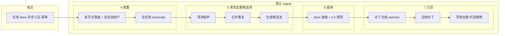
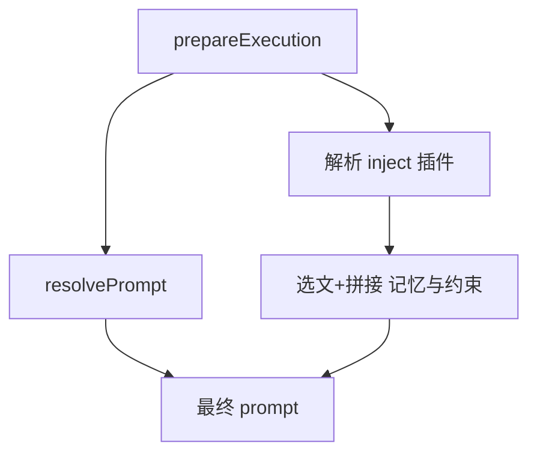

# 对话知识沉淀 — 方案

本文档是 **AINative**「从对话到可复用项目知识」的**单一产品/技术说明**：谁负责什么、何时落库、数据从哪来、默认怎么做、可配置什么。

**不绑定**具体类名与 PR 级实现细节；与仓库实现冲突时，以本版为准并回写本文。默认实现 = **平台宿主** + **可插拔的两类插件**（沉淀 `ingest`、注入 `inject`），下文「默认插件」指同仓内置的参考实现。

---

## 1. 目标与要解决的问题

- **问题**：多轮对话与自动化 Agent 过程会产生可跨任务复用的偏好、规约、决策与术语；只留在流式记录里，后续任务无法稳定继承。

- **目标**（两块，相互独立、时机不同）：
  1. **沉淀**（`ingest`）：在**不阻塞**主执行路径的前提下，把**已发生的对话**提纯为**短事实**并**归类**写入项目知识位。
  2. **注入**（`inject`）：在**每次**某节点发起 Agent 执行前，**按预算**从知识位检索并拼进 prompt（或等效字段）。

- **与本文相关的原始数据**来自**第 3.1 节**控制面 JSONL；`transcript` 的**收集**在**第 4 节**、**在提纯前的预处理**在**第 5 节**、**提纯**在**第 6 节**、**落库**在**第 7 节**、**读库注入**在**第 8 节**；总览见**第 9 节**图。

---

## 2. 核心决策一览

| 维度 | 决策 | 说明 |
|------|------|------|
| **沉淀时机** | 仅**任务**进入 **`done`**（工作流已收束、成功终态）**之后** | **不在**单节点终态、**不在**每个 LLM chunk 触发；节点侧只落**原始** JSONL/日志，供**任务结束后**一次汇总。 |
| **Job 形态** | **一条**主沉淀 Job，**`kind: task_done`** | **不**在 `finalizeNodeAsSuccess` 上入队「记忆侧」Job；`node_finished` 若曾存在，视为**废弃**并忽略。 |
| **全任务 `transcript`** | 在 `done` 后由插件按工作流/节点序**只读**汇聚 | 见**第 4.3 节**；在**第 5 节**内完成清洗、去重、候选池，再进入 **LLM 提纯**（**第 6 节**）。 |
| **写库** | 默认 `docs/memory/**` Markdown，经宿主**受控写 API** | 白名单目录；**外置知识库**需替换 `ingest` 插件并单独立项安全与审计。 |
| **跨步去重/收束** | 与 **facts 抽取 → 补丁生成 → 应用** 在**同一次**异步任务内**串行** | **不**再「多节点分写 + 第二 Job `consolidate`」；可选轻量「二次精修」仍建议同管或**显式**另队列并写清。 |
| **插件** | 宿主：`调度、幂等、查重、脱敏、指标、限流`；`ingest` / `inject` 可**分别**配置 | MVP：**一个**主 `ingest`、**一个**主 `inject` id；`noop`/关闭不得阻塞主状态机。 |

**流水线顺序**（后文**第 4–8 节**依此展开，与**第 9 节**图同构）：**收集**（粗 `transcript`）→ **清洗 / 合并重复 / 生成候选池**（**不调用**提纯 LLM）→ **提纯**（到结构化 `facts`）→ **沉淀**（`patches` 与写库、收束）→ **注入**（下次执行前把记忆块拼进 prompt）。**第 3.2 节**说明插件与宿主的**横切**职责。

---

## 3. 数据与插件（横切）

本节前半为**只读**数据基础，后半为**全流水线**都依赖的**插件/宿主**边界，避免在 4–8 各节中重复大段说明。

### 3.1 数据基础：控制面 JSONL 与排障

- **根目录**：`AINATIVE_DATA_ROOT_DIR` 解析为数据根，常见形态含 `{数据根}/{businessLineId}/projects/{projectId}/`（**项目存储根**）。

- **`task-log.jsonl`**：路径 `{项目存储根}/tasks/{taskId}/task-log.jsonl`。**一行一 JSON**，任务/控制面与 Agent CLI 分块日志等；`payload` 可含分块 `text`。**不是**主对话流协议，仅辅助排查。

- **`output.jsonl`**：路径 `{项目存储根}/tasks/{taskId}/nodes/{nodeId}/output.jsonl`（`agentClioutput` 可覆写为等价路径）。**整行**为 Agent 流式事件（`type`/`subtype` 等，前端可参考 `frontend/src/features/tasks/detail/cli/cursor-agent/parser.ts` 注释）。**全任务** `transcript` 的 Agent 段应优先**从**此（及用户侧 `runtimeJson`/reply）**按序**组包，**不要**只依赖 `task-log` 分块。

- **与容器** `docker logs`：执行过程以控制面**上述两文件**为准；详见 `docs/technical/ainative-tech-sharing1.md`、`backend/docs/task-container-lifecycle-lessons.md`。

- **对话来源**（元数据/审计，非物理文件）：`user` 与 `script` 等，与现有 `runtimeJson`、reply 路径对齐实现。

### 3.2 插件与宿主

#### 3.2.1 职责

| 角色 | 做什么 | 不做什么 |
|------|--------|----------|
| **宿主** | 任务 `done` 时**异步入队**、校验 **第 11.1 节** Job、`idempotencyKey` 查重、**脱敏**（写/注前后）、**指标/日志**、**限流** | 不实现具体「怎么提 fact」；不阻塞节点状态机 |
| **MemoryIngestPlugin** | 消费 `task_done`；串联 **第 4–7 节** 默认行为：收集 → **第 5 节预处理** → 提纯 → 写库与收束 | **不得**在单节点终态**写**知识库；写库**仅**经 `HostCapabilities` |
| **MemoryInjectPlugin** | 在 **`prepareExecution`** 路径上按 **第 8 节** 产出「记忆与约束」**文本** | 不替代宿主最终拼接协议与脱敏责任；与**沉淀**时机**解耦** |

- **可插拔**：`MEMORY_INGEST_PLUGIN_ID` / `MEMORY_INJECT_PLUGIN_ID`；**关闭**时对应路径空操作。
- **多插件与 MVP**：不强制责任链；未来「多路合并」在宿主**合并策略**中扩展。

#### 3.2.2 扩展点

- **沉淀**（`ingest`）：**唯一**写库相关入口 **`onTaskDone(job, caps)`**（可名 `handleTaskIngestion`）。**第 4 节** 组包、**第 5 节** 可整段替换为自定义策略，但须 **「一任务一沉淀」+ 第 11.1 节幂等**。

- **注入**（`inject`）：**`build(ctx, caps) → { text, debug? }`**，见 **第 8 节**；宿主拼入最终 `prompt`/`system`（依 Agent CLI）。

- **失败**：插件内异常由宿主**吞并+指标**，**不**改变任务/节点主状态；重试/死信见队列策略。

- **`HostCapabilities`（概念）**：`writeDoc`/`readDoc?`、`logger`、`metrics`、**可选** `llm` 封装、只读 **任务/工作区**元数据、配置快照。字段与接口摘要见**第 11.3 节**。

---

## 4. 收集

**在流水线中的位置**：对应**第 9.1 节**图中 **A、B**（只读多源材料 → 全任务 `transcript` 粗稿）。**不**写 `docs/memory`；**不**做面向 LLM 的「噪声清洗」（放在**第 5 节**）。

### 4.1 与数据基础的关系

- 物理收集对象以 **第 3.1 节** 为准；本节的「产物」是 **UTF-8 的 `transcript` 大文本**（可含节点/步骤分隔符），作为**第 5 节** 的**输入**。

### 4.2 触发与入队

- **唯一**触发：**任务** `done` 成功路径，**入队**一次，**不**在节点完成、**不**在 `await` 里等沉淀结果。
- 入队后由 `ingest` 按 **第 5 节 → 第 6 节 → 第 7 节** 继续执行。

### 4.3 全任务 `transcript` 的组包（MVP 默认）

- **Agent 侧**：工作流中**已执行**的各 `output.jsonl` 等，按 **工作流/节点序** 拉齐、**只读**。

- **用户侧**：本任务全周期多轮**用户**消息（reply、`runtimeJson` 等）。

- **产物**：**单条**、有序、UTF-8 **大文本**；建议分隔**标明** node/步骤。自定义 `ingest` 可换**聚合**方式，但**触发边界**与**第 11.1 节**幂等**不变**。

- **可观测**（与收集强相关）：`ingest_transcript_bytes` 等可在此环节打点；**不**在日志中落**全文** transcript。

---

## 5. 清洗、去重与候选池

**在流水线中的位置**：在**第 4 节** 收集完成之后、**第 6 节** 提纯（LLM）**之前**；**全部为确定性/规则化**可优先实现（不**必须**再调大模型），产出作为 **第 6.1 节** LLM 的输入。对应**第 9.1 节**图中 **B 与 C 之间**的预处理子图。

**目的**：降低**噪声、重复、体量**对「可复用知识」的干扰，把「该给 LLM 看什么」**收敛**为**有边界的候选池**，避免在**第 6 节** 才**硬截断**原始整篇 `transcript`。

### 5.1 清洗噪声

- **对象**：**第 4.3 节** 的粗 `transcript`（可已结构化为**轮次/消息块**列表，由实现定）。
- **典型规则**（非穷举，可配置/可扩展为插件内策略）：
  - 删除或**折叠**对沉淀贡献低的片段（如**空/极短** `thinking` 增量、纯分隔符、与任务无关的**冗长**工具输出原文，策略可为「保留**摘要**一行」而**不**整段进池）。
  - 剔除**与知识沉淀无关**的控制面行（在已解析的 JSONL 语义上操作为佳）。
- **与** **第 10 节** **协同**：**敏感/PII** 在此可做**首遍**脱敏或**整段丢弃**（**写库前**在**第 7 节** 仍过宿主统一扫描）。
- **产出**：**清洗后**连续文本 或 **结构化**消息序列（**须**为下游保留可溯源的 `source_node` / 轮次 等**索引**，供 **第 6.3 节** 可溯源引用）。

**清洗对象与处理一览**（默认插件，规则可配置）：

| 类别 | 典型来源（收集环节） | 处理方式 | 是否进入候选池 |
|------|----------------------|----------|----------------|
| **控制面噪声** | `task-log` 里与对话无关的运维行、纯心跳、重复状态行 | **删除** | 否 |
| **空与极短** | 空白、`ok`、单 emoji、长度低于配置阈值的片段 | **删除** | 否 |
| **thinking / 内心独白** | 模型 chain-of-thought 类增量、极短推理碎片 | **删除** 或 **折叠**为一行（可配置） | 折叠后极短可进池；全删则不进 |
| **工具原始 stdout/stderr** | 大段目录列表、`cat` 全文、日志 tail | **截断**：首行 + 行数统计 + 可选哈希；或 `[tool output: N lines]` | **摘要行**进池；**全文**默认不进 |
| **重复用户/模型句** | 连续两次几乎相同的 user/assistant 内容 | **合并**为一条（与 **第 5.2 节** 一致） | 合并后进池 |
| **可审计敏感原文** | 疑似密钥、token、手机号、身份证等 | **整段删除**或**占位符**（与宿主脱敏一致）；**禁止**明文进池 | 脱敏后无信息则不进 |
| **用户明确偏好/规约句** | 「以后都…」「禁止…」「必须…」 | **保留** | **是**（预算紧张时可后丢） |
| **用户决策/选型句** | 「我们选 A 因为…」「不用 B」 | **保留** | **是** |
| **术语与命名** | 「X 指 Y」「以后叫 Z」 | **保留** | **是** |
| **故障与规避** | 「根因是…」「下次先…」 | **保留** | **是** |

**边界**：

- **不进候选池、也不作为第 6.1 节 LLM 输入的**：上表中标记为**删除**且未合并保留的类别；**空池**时 **第 6.1 节** 可产出 `{"facts":[]}`，**不**默认把未清洗全文喂给 LLM（除非配置 **显式**降级并告警；具体环境变量键名由实现 README 与 **第 11.2 节** 预处理相关项声明）。
- **原始取证**：节点 `output.jsonl` / `task-log.jsonl` **原文件不因清洗改写**；清洗只影响本次 ingest 内存中的派生文本。

**可选扩展（与清洗同族，非 MVP）**：实现中可与 **第 11.2 节** 预处理配置并列：低质片段（正则剔除无信息短句、纯表情等）；高频主题判定（同一标签出现次数 ≥ 配置阈值，用于辅助 **第 6.1 节** 上下文或 **第 5.3 节** 池内裁剪）；与池内排序相关的**轻量**加权（**不**使用 **第 7.5 节** 写库前六维门限，二者语义分离）。单次任务主线可全部关闭。

### 5.2 合并重复

- **在字面值 或 指纹 层面** 合并**连续/跨步** 的**相同或强近似** user/assistant 内容（**编辑距离/哈希/MinHash** 等阈值**配置化**）。
- **不**与 **第 6.2 节** `dedup_key` 混为一谈：本节解决的是**源文本**重复；后者解决**已抽取的 fact** 冲突。
- **产出**：在**不破坏**上下文明晰度的前提下，缩短进入 LLM 的**字量**、减少重复**抽条**。

**可选扩展**：「强近似」合并所用的文本去重相似度（如 Jaccard ≥ 0.9）建议与 **第 11.2 节** `MEMORY_DEDUPE_JACCARD_MIN` 等**统一为同一配置键**，避免重复定义。

### 5.3 生成候选池

- **在清洗、去重后**，将语料**划分**为 **若干候选单元**（`Segment`：如按节点、按轮次、按 `##`、按**固定 token/字符窗**滑窗+重叠策略等），并可有**总预算**（如「池内**总**字符/池元**个**数」上限，**在进 LLM 前**即消耗完毕）。
- **输出形态（契约）**：**仅** **显式** `candidates: Segment[]`（可测、可审计），每条须带 `id`、`source_ref`（或等价字段名，与 **第 11.2 节** / 实现 README 写死）；**第 6.1 节** 以该结构为**主**输入（序列化进 prompt），**不**以「单串 + 侧车」替代主线契约。
- **候选池可为空**；空时 **第 6.1 节** 可产出 `{"facts":[]}` 并记指标，**不**应再强喂原始**未**清洗全文（除非**显式**降级策略并记告警）。

**可选扩展：候选池内优先级与 Top-N**（非 MVP；不改变 **`task_done` 单次 Job** 与「第 5 节以规则/确定性为主」的契约；仍须 **第 11.1 节** 幂等与审计）

仅在进入第 6.1 节 LLM 之前、在本节**字符/条数预算**内，对候选 `Segment` 做**排序、截断或 Top-N**：例如按节点顺序、用户段优先、主题命中、段长度等**轻量确定性规则**。**不**在此处套用 **第 7.5 节** 的「写库前六维 + 三重门限」——那是 **`facts` 已存在之后**、决定是否值得生成补丁/落库用的，归属**沉淀**。

- **跨任务、滚动窗口「晋升」长期记忆**：**独立插件或二期队列**（非本节主线）。

**小结**：**第 5 节**定候选池 → **第 6.1 节**定 `facts` → **第 6.2 节**与**第 7 章**定如何落成 Markdown。

---

## 6. 提纯

**在流水线中的位置**：对应**第 9.1 节**图中 **C** 左侧块——在**不**写盘的前提下，以 **第 5.3 节** 的**候选池**（+ 辅助摘要）**为主** 输入 LLM，得到 **`facts[]`** 及**规则后处理**。

**术语**：**第 6.1 节**（事实抽取）与 **第 7.1 节**（补丁生成）为两次 LLM 调用。

### 6.1 事实抽取：用 LLM 得到 `facts`（只输出 JSON，无代码围栏）

- **入参（主）**：**第 5.3 节** 的 **`candidates: Segment[]`**（JSON 序列化或等价载体）；**辅助**：可选 `docs/memory` **目录/标题**摘要，受**截断**；无事实时输出 `{"facts":[]}`。**不再**以**未**经第 5 节处理的**整篇**粗 `transcript` 作为默认唯一输入（除非配置**显式**降级并审计）。

- **出参**：`facts[]` 字段与**第 6.3 节/第 11.2 节**一致；须满足 `confidence`、`dedup_key` 等**第 6.3 节**质量约束。

- **解析失败**整段判失败，不进入**第 6.2 节**后段；**可恢复**外因可重试**整次**请求，**不**在解析失败下无限重打同串。

**应提炼与不应出现的内容**（`category` 与 **第 6.3 节** 表一致）：

**应提炼**（收成短事实、一条一事）：

| 应提炼 | `category` |
|--------|------------|
| 稳定偏好（写法、风格、工具选择等可跨任务复用的倾向） | `preference` |
| 规约（「必须/禁止/约定」类规则） | `convention` |
| 决策与理由（在选项间的选择及依据） | `decision` |
| 事故与规避（踩坑、根因、下次怎么做） | `incident` |
| 术语表项（「在本项目里 X 表示 Y」） | `glossary` |
| 任务级极短摘要（**可选**、易噪声，慎用） | `episodic` |

**不提炼**（省略或不出现在 `facts` 中）：

| 不提炼 | 原因 |
|--------|------|
| **一次性操作步骤**（如「打开第 3 行改这个数」） | 强上下文绑定，复用价值低 |
| **整段照抄对话** | 违反「短事实」，应压缩为陈述 |
| **工具输出数据明细** | 清洗环节已截断，不应以原文进入 `text` |
| **秘密与 PII** | 事实抽取 LLM 应拒写；写库前仍过宿主扫描 |
| **弱依据猜测** | 标低 `confidence`，由 `min_confidence` 等规则剔除 |

- **每条 `fact` 质量**：须具备 **第 11.2 节** 字段；`dedup_key` 为**跨任务稳定**的抽象键（如 `eslint-prefer-no-any`），**非**随意整句 hash。

### 6.2 规范化与合并（确定性，不必 LLM）

- `min_confidence` 以下丢弃或 `draft`（配置写死）；
- 缺 `text` 或 `dedup_key` 的条目丢弃策略**写死**；
- 同 `dedup_key` **一种**合并规则**写死**（如**最高** `confidence` 等）；
- 非空时须先 **第 7.5 节**（写库前门限，与 **第 6.2–6.3 节** 置信规则之 **与/或** 见 **第 11.2 节**）再进入 **第 7.1 节**；筛后为空或规范化后已空则跳过补丁与写盘，仅指标。无平台召回统计时 **第 7.5 节** 可 **N/A** 部分维度，**非**关闭门限整块逻辑。

### 6.3 知识类型、单条质量与事实形状

- **短事实**：单条**可读**、可独立理解，**避免**大段照抄原文。

- **知识类型**（建议枚举、指导 `category` 与落文件）：

| 类型 | 含义 | 典型落文件 |
|------|------|------------|
| `preference` | 可复用偏好 | `preferences.md` |
| `convention` | 规约 | `conventions.md` |
| `decision` | 选择及理由 | `decisions.md` |
| `incident` | 问题与根因/规避 | `incidents.md` |
| `glossary` | 术语 | `glossary.md` |
| `episodic` | 强上下文短摘要（可选） | 单独小节或 `decisions.md` |

- **置信度** `0–1`；**拒写**密钥、token、身份与联系方式明文等；**可溯源** `source_task_id` / `source_node_id` 等（**第 11.3 节**）。JSON 键集以**第 11.2 节**为准。

---

## 7. 沉淀

**在流水线中的位置**：对应**第 9.1 节**图中 **C 后半、D、E、F**——补丁、写库、同管收束；记忆落盘在本章。**正文**按 **第 7.1–7.6 节** 为「补丁 → 应用 → 同管 → 可观测 → 写库前门限 → 落库形态」；**实现顺序**为 **第 6.2 节** → **第 7.5 节** → **第 7.1 节** → **第 7.2–7.3 节**。**第 7.6 节** 路径白名单与 **第 7.2 节** 一致。

### 7.1 补丁生成（LLM）

仅输出 **JSON**（无代码围栏）：

- **入参**：**第 7.5 节** 筛条后的 `facts` + 各 `suggested_path` 对应文件**当前全文**（可截断；白名单见 **第 7.6 节**）；
- **出参**：`patches[]`（`path`、`heading_anchor`、`op`、`body_md`、`dedup_key`）；**禁止**整文件覆盖；`op` 与锚点**降级/丢弃**二选一**写死**。

**`patches[]` 字段**：

| 字段 | 含义 |
|------|------|
| `path` | 仅 `memory/*.md` 白名单内 |
| `heading_anchor` | 现有或即将存在的 `##` 标题，用于定位节 |
| `op` | `add`：节下追加；`replace`：替换同 `dedup_key` 块；`delete`：删块 |
| `body_md` | 短 Markdown，可含 `dedup_key` 等可追溯占位（实现约定） |

**补丁 LLM 不做**：**不**发明新事实、**不**扩写业务语义；事实抽取漏项不应由补丁 LLM 补写，仅做**排版与落位**。

### 7.2 应用补丁（确定性）

- 对同一 `path` **排序**后应用；`##` 节定位；同文件内存合并，**单 write**；路径仍在 `docs/memory/**`（布局见**第 7.6 节**）。
- **部分失败**二选一**写死**：`all-or-nothing` 或 `best-effort`。

### 7.3 同管收束

- 解决**全任务一次写** 前的**跨步**重复与**明显**冲突；`facts` 后**确定性**合并；补丁后**可选**小上下文/规则/短 LLM。与**第 4.2 节** `task_done` Job 共用**同一** `idempotencyKey`；**另队列二次精炼**须单独立项。

### 7.4 幂等、并发、可观测（写侧）

- **幂等**：`taskId` + **稳定** `idempotencyKey`；重复消费则跳过或 no-op。  
- **竞态**：同一 `taskId` 重复**入队**时，**任务维** 锁 或 项目/版本 号。  
- **指标**（命名示例）：`llm_extract_facts_*` / `llm_generate_patches_*` 成/败，`patches_*`、`write_*`、**幂等跳过**、**`memory_preprocess_*`（清洗/去重/候选）**、`memory_promotion_*`（写库前筛条）等；**日志**带 `taskId`、**Job id**、**`pluginId`**、路径摘要，**不**全量打 transcript/候选池全文。

### 7.5 写库前综合评分与门限（默认实现）

**确定性**六维加权（0～1）+ **三重门限**，决定 fact 是否进入 **第 7.1 节** / 落库；与 **第 5.3 节** 池内排序**分离**。**须**落实；**第 11.1 节** 幂等与审计。

**六维加权**

| 维度 | 建议权重 | 含义（可落地度量） |
|------|----------|-------------------|
| 相关性 | **0.30** | 被检索时的有效程度；例：**有效召回次数 / 总召回次数** |
| 频率 | **0.24** | 在统计窗口内（如近 **7 天**短期记忆）出现的总次数 |
| 查询多样性 | **0.15** | 关联的**不同**查询 / 任务上下文数量 |
| 时效性 | **0.15** | 时间衰减；例：**新鲜度 = 1 − (当前时间 − 条目时间) / 窗口总时长** |
| 整合度 | **0.10** | 跨多日出现的天数（例：跨 3 天取满权、2 天次之、1 天再次之） |
| 概念丰富度 | **0.06** | 概念标签密度；例：**标签数 / 条目长度** |
| 前段加成（可选） | **+0.01～0.03** | 预处理流水线（去重/主题等）已命中的条目，小幅加权 |

**三重门限（同时满足才允许晋升写库；阈值可配置，见第 11.2 节）**：

| 门限 | 建议区间 |
|------|----------|
| 最低总分 | **≥ 0.75～0.80** |
| 最低召回次数 | **≥ 2～3** |
| 最低不重复查询数 | **≥ 2～3** |

**说明**：仅单次任务、无平台召回统计时，部分维度 **N/A** 或零权；与 **第 6.2–6.3 节** 置信并存时 **与/或** 须在配置中写清。

### 7.6 落库位置与 `docs/memory` 布局

- **位置**：项目 Git 工作区内 **`docs/memory/**`**，以 Markdown 为主；读写经 **`ProjectDocsService`** 或**等价鉴权+路径规范化**。

- **建议目录**（`_routing` 在**第 8 节**会用于**注入**）：

```
docs/memory/
  README.md
  _routing.yaml
  preferences.md
  conventions.md
  decisions.md
  incidents.md
  glossary.md
```

- **安全**：自动写入**仅**上述子树，禁止 `..` 与路径穿越；**第 6.2 节**已过滤的 `facts` 与下文 `body` 在**出宿主写 API 前**仍过**第 10 节**脱敏。

**按 `category` 落库形态**（相对 `docs/`；与 **第 6.3 节** 类型表一致）：

| `category` | 写入文件（默认） | 写入内容形态 |
|------------|------------------|--------------|
| `preference` | `memory/preferences.md` | `##` 小节下 bullet 或短段落 |
| `convention` | `memory/conventions.md` | 同上 |
| `decision` | `memory/decisions.md` | 决策一句 + 理由一句（篇幅由 **第 7.1 节** 补丁 LLM 控制） |
| `incident` | `memory/incidents.md` | 问题 / 根因 / 规避，小列表 |
| `glossary` | `memory/glossary.md` | **术语** — 定义（一行或两行） |
| `episodic` | `decisions.md` 单独小节或 `memory/episodic.md`（二选一写死） | 极短摘要 |

**不会落库的**（未过 `writeDoc` 即丢弃）：

- `confidence` 低于配置下限的 fact；缺 `text` / `dedup_key` 等 **第 6.2 节** 已丢弃项；**第 7.5 节** 未过三重门限的 fact；
- 非法路径、无法映射的 `category`；**第 7.2 节** 应用失败（如锚点未命中）的补丁；
- **第 10 节** `redact` 后为空或命中拒写规则的正文。

**溯源与注入**：默认条目中可带 `taskId` / `nodeId` / 时间等便于审计；**第 8 节** 注入是否 Strip 溯源由产品决定。

---

## 8. 注入

**在流水线中的位置**：对应**第 9.2 节**；与 **4–7** 的**写库**解耦，发生在**各节点** `prepareExecution` 的**热路径**上，**不**等待任务 `done`。

- **L0 / L1 / L2**：

| 层 | 内容 | 作用 |
|----|------|------|
| **L0** | 极简常驻规约/摘要 | 基线 |
| **L1** | `_routing.yaml`：`include_globs`、**slots** | 与 `node_template_id` / 标签绑定「必读」 |
| **L2** | 在 L1 池内、按 **query** 对路径 + `##` 节 打分、Top-K 至预算 | 深读、控 token |

- **Query 构造**（建议）：`task.title`、`node.name`、近轮用户意图、 `task.prompt` 摘要 等，总长**第 11.2 节**上限。

- **宿主装配**：`RunnerAgentExecutionService` — `resolvePrompt` **之后** 调用 `inject` 的 `build`，**无/关** 则**空**块。默认实现可复用 `ProjectKnowledgeService` 选文思路，对 `docs/memory` 根**参数化**；替换 `inject` 须**同等**预算与审计（**第 3.2 节**、**第 10 节**）。

---

## 9. 流程图

**与** **第 4–8 节** **顺序一致**：**收集** → **清洗/去重/候选池** → **提纯** → **沉淀**（`ingest` 全段至写库） → **注入**（独立、按节点/轮次）。

### 9.1 收集 → 预处理 → 提纯 → 沉淀（任务级、单 Job）



**实现提示**：**C**（**第 6.2 节**）之后、**D**（补丁 LLM）之前插入 **第 7.5 节** 门限（与第 7 章正文排列顺序无关）。

**自定义** `ingest` 可改 `A～F` 及 `N/M/P` 内部，**H** 的「`done`、单 Job、幂等」不变。

### 9.2 注入（与节点/轮次）



**非** L0/L1/L2 的 `inject` 可替换为自有子图，**宿主**只保留 `I → M → O` 的装配与预算。

---

## 10. 安全、可观测、插件包

- **安全（宿主底线）**  
  1. 对 `facts` / `body_md` / 注入**返回** 做**敏感**规则；**写 API 前**再扫。  
  2. 注入块**最终**可再**一遍**轻扫。  
  3. 写路径**白名单**；外置知识库**另** ACL/审计。  
  4. 与**项目文档**鉴权**对齐**。

- **与第 5 节**：`ingest` 内**第 5.1 节**可与宿主**首遍** PII/secret 检测**同规则或子集**；**避免**在清洗环节误删**全部**有审计价值的原文（大字段**受控**另存，若已有策略则对齐）。

- **指标**（例）：`memory_extraction_jobs_total`、`memory_extraction_reject_total`、`memory_patch_apply_errors_total`、`memory_inject_*`、`memory_preprocess_*`；**第 7.5 节** 门限建议 `memory_candidate_score_*`、`memory_promotion_filtered_total`；**第 5.3 节** 池内扩展可加 `memory_preprocess_dedupe_jaccard_merges_total` 等。日志脱敏，带 `taskId`、`idempotencyKey`、`pluginId`、路径摘要。

- **插件包**  
  - **推荐**：**同仓** 内置、固定 `ainative.default` 类 id。  
  - **动态加载** 非 MVP 必做；**受信**入口导出；**禁** 对用户不可信内容 `eval`。

---

## 11. 数据契约、配置、接口摘要

### 11.1 沉淀 Job

```typescript
type MemoryIngestionJob = {
  kind: 'task_done';
  projectId: string;
  taskId: string;
  idempotencyKey: string; // 与「本次 done 收束」稳定绑定
  source?: { type: 'user' | 'script'; ref?: string };
};
```

消费前**按** `idempotencyKey` **查重**；节点列表**不必**在 Job 中（**可选**工作流快照常量字段）。

### 11.2 `facts` / 补丁相关配置（概要）

- **事实**：`category`、`text`、`confidence`、`dedup_key`、`suggested_path`、`suggested_heading?`、`keywords_for_retrieval?`、`draft?`；`reject_reasons?` 仅日志。

- **配置项（示例，非 `ingest` 专有的可按插件忽略）**  

| 键 | 含义 | 初值例 |
|----|------|--------|
| `MEMORY_EXTRACTION_ENABLED` / `MEMORY_INJECTION_ENABLED` | 总开关 | 默认 `false` 至联调 |
| `MEMORY_INGEST_PLUGIN_ID` / `MEMORY_INJECT_PLUGIN_ID` | 插件 id | `ainative.default` |
| `MEMORY_CONFIDENCE_MIN` | **第 6.2 节** 规范化时过滤 | `0.65` |
| `MEMORY_FACT_MAX_CHARS` | 单条事实长上限 | `800` |
| `MEMORY_QUERY_MAX_CHARS` | 注入用 query 拼接上限 | `768` |
| `MEMORY_INJECT_MAX_CHARS` | 注入块总长上限 | `12000` |
| `MEMORY_L2_TOP_K_SECTIONS` | L2 最多节 | `8` |
| `MEMORY_L2_SECTION_MAX_CHARS` | 单节长上限 | `2500` |

- **预处理（可扩展）**（与**第 5 节**对齐）：`MEMORY_PREPROCESS_CANDIDATE_BUDGET_CHARS`（池总预算）、`MEMORY_DEDUPE_JACCARD_MIN` 等，实现 PR/插件 README 中**列明**后纳入 CI 可测。

- **写库前门限与六维权重**（**第 7.5 节**、**第 6.2 节** 衔接；单次任务无平台统计时部分键可退化为 N/A，须在 README 写明）：

| 键 | 含义 | 初值例 |
|----|------|--------|
| `MEMORY_PROMOTION_SCORE_MIN` | 写库前综合分下限 | `0.75` |
| `MEMORY_PROMOTION_RECALL_MIN` | 最低召回次数 | `2` |
| `MEMORY_PROMOTION_DISTINCT_QUERIES_MIN` | 最低不重复查询数 | `2` |
| `MEMORY_SCORE_WEIGHT_RELEVANCE` 等 | 六维权重 | 与 **第 7.5 节** 六维表一致或可覆盖 |
| `MEMORY_THEME_TAG_MIN_COUNT` | 高频主题（标签）次数下限 | `3` |
| `MEMORY_SIGNAL_INITIAL` / `MEMORY_SIGNAL_THEME_BONUS` | 强化信号初值 / 主题命中加成 | `0.5` / `0.1` |

Token 可近似 `ceil(chars/4)` 起步。自定义插件的 env 在自有 README 声明，**避免**与 `MEMORY_*` 混名。

### 11.3 接口（与语言无关的摘要）

- **`MemoryIngestPlugin`**：`id` + **`onTaskDone(job: MemoryIngestionJob, caps: HostCapabilities)`** — 串联**第 4–7 节**默认**写库**相关逻辑；**第 5 节** 可在插件内**覆写**为子模块 `preprocess(caps)` 但须满足候选池**契约**（**显式** `candidates: Segment[]`，供 **第 6 节**）。

- **`MemoryInjectPlugin`**：`id` + **`build(ctx, caps) → { text, debug? }`**，见**第 8 节**。

- `MemoryIngestionJob` 由**宿主**构造；插件**不**自造 `idempotencyKey`（**不推荐** 另造扩展）。

- **溯源**：事实/文中建议带 `source_task_id` / `source_node_id` 等**一条**人读或 HTML 注释形式，实现选定。

---

## 12. 代码锚点（实现时以仓库最新为准）

| 点 | 说明 |
|----|------|
| **注册表** | 启动注册 `ingest`/`inject`；worker **只**调**接口** |
| **注入** | `RunnerAgentExecutionService` — `prepareExecution` 在 `resolvePrompt` 后调 `inject`（**第 8 节**） |
| **沉淀入队** | 任务**首次/稳定** `done` 成功路径（如 `TaskStatusService` / 唯一 `setTaskStatus(…, done)`），**不**在 `finalizeNodeAsSuccess` 为「记忆」入队 |
| **默认选文** | `ProjectKnowledgeService` 等，供**默认** `inject` 复用 |

---

## 13. 验收与推荐实现顺序

### 13.1 MVP 验收

- 宿主：**仅** `done` 发 `task_done` 沉淀；失败**不**回滚已 `done` 主状态。
- 中间节点**不**产生 memory 写入；`done` 后**一**次 Job 可**验证**全任务 **4→5→6→7** 与**同管**收束（**第 4–7 节**）。
- **第 5 节** 对粗 `transcript` 的清洗/去重/候选在**第 6 节** 之前完成，有**可测**的指标或单元（至少：池非空/空 两条路径，**不**与「仅硬截断」混同）。
- **inject** 在下次执行可见记忆块；**关/换** 插件不破坏主路径；Git 可回滚误写（**仅** Git 策略时；外置另列）。

### 13.2 实现顺序（建议）

1. 插件宿主骨架、`HostCapabilities`、**空** `ingest`/`inject` 与**开关**、指标（**第 3.2 节**、**第 11.3 节**）。
2. `docs/memory` 种子、`_routing.yaml`、**默认** `inject`（L0/L1/L2，**第 8 节**）。
3. 安全+JSON 单测、写 API 前**必**扫（**第 10 节**）。
4. 默认 `ingest`：第 **4** 节 `transcript` → 第 **5** 节 预处理（规则优先） → 第 **6** 节 提纯 → 第 **7** 节 补丁+收束（可 dry-run）。
5. `done` 入队与 worker **`onTaskDone`**；**禁止** 节点为记忆入队。
6. `prepareExecution` 接 `inject`。
7. E2E、幂等、双 **pluginId** 冒烟、路由隔离、拒写。

---

*候选池：`candidates: Segment[]`（5.3）。写库前门限：默认须实现（7.5↔6.2）。5.3 池内 Top-N 等为可选。*
