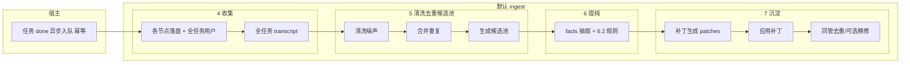
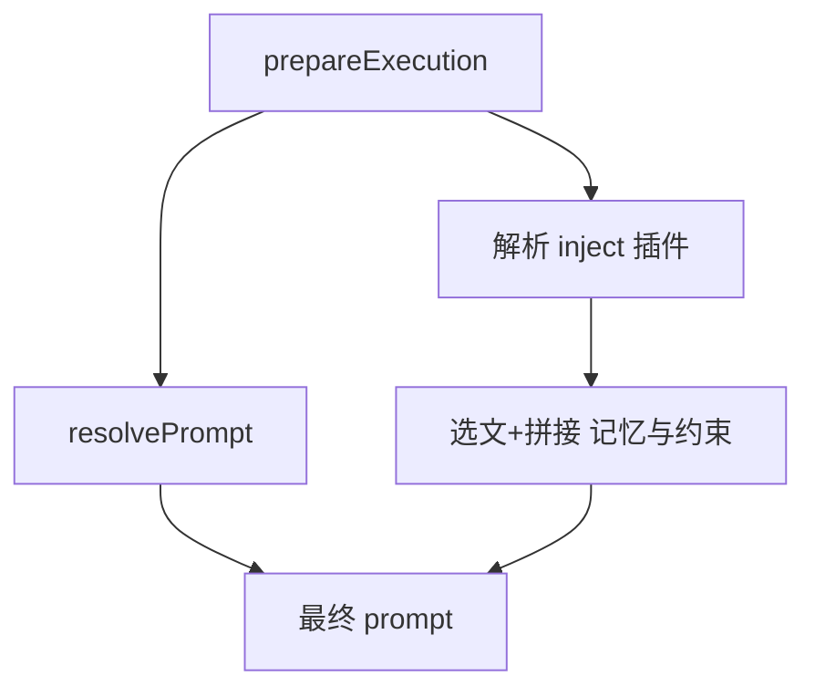

# 对话知识沉淀 — 详细设计（落地实现）

本文在 [`知识沉淀-方案.md`](./知识沉淀-方案.md) 之上描述**可落地的**模块、调用链、数据结构与算法。**与方案冲突以方案为准**；与代码冲突以代码为准并更新**第 12 节 代码锚点**。

**读者 / 范围**：后端与插件实现者；宿主（NestJS）、默认 `ingest` / `inject`、`docs/memory/**` 受控读写（非 MVP 外置向量库等从略）。**章节顺序与方案第 1–13 节一致**；各节可对照方案同名章节阅读。

---

## 1. 目标与要解决的问题

与方案**第 1 节**一致：在不阻塞主路径的前提下通过 **`ingest`** 沉淀、通过 **`inject`** 在节点执行前按预算拼入记忆；实现侧关注 **UTF-8 控制面文件**、**单次 `task_done` Job**、**候选池契约** 与 **受控写 `docs/memory/**`**。

### 1.1 与方案的对应关系

| 方案章节 | 本文落地章节 |
|----------|--------------|
| 1 目标与问题 | 第 1 节、第 1.2 节 |
| 2 核心决策 | 第 2 节 |
| 3 数据与插件 | 第 3 节 |
| 4 收集 | 第 4 节 |
| 5 清洗/去重/候选池 | 第 5 节 |
| 6 提纯 | 第 6 节 |
| 7 沉淀 | 第 7 节 |
| 8 注入 | 第 8 节 |
| 9 流程图 | 第 9 节 |
| 10 安全/观测/插件包 | 第 10 节 |
| 11 契约/配置/接口 | 第 11 节 |
| 12 代码锚点 | 第 12 节 |
| 13 验收/实现顺序 | 第 13 节 |

### 1.2 实现技术手段总览

本节说明流水线各环**主要用什么技术实现**，与**第 5–8 节**步骤互为补充。**一句话**：清洗是**规则与确定性算法**；提纯是**LLM 输出结构化 JSON + 本地校验**；落库是**Markdown 锚点补丁 + 受控写 API**；注入是**读盘与轻量打分 + prompt 拼接**。

#### 1.2.1 清洗（预处理）

| 手段 | 说明 |
|------|------|
| **NDJSON / 流式事件解析** | 按行读取 `output.jsonl`、`task-log.jsonl`，还原为消息块（与前端 `parser` 语义对齐）。 |
| **规则过滤** | 长度阈值、空片段删除、按 `type`/`subtype` 识别 thinking、工具输出等。 |
| **截断与替身** | 大段工具 stdout 用「首行 + 行数 + 可选哈希」替代全文。 |
| **去重** | 规范化后的 **hash**、**Jaccard（词袋）** 等，合并相邻或近似重复段。 |
| **分块与预算** | 按节点边界 + **滑动窗口**（字符上限）生成候选池 `Segment[]`。 |
| **敏感信息** | **正则 / 关键词 / 与宿主一致的 `redact`**；命中则删段或占位，**不调 LLM**。 |

#### 1.2.2 提纯（`facts` 与 `patches` 两次 LLM）

| 手段 | 说明 |
|------|------|
| **facts 抽取 LLM**（方案第 6.1 节） | 将候选池（+ 可选现有 `docs/memory` **文件标题列表**）写入 prompt，要求**仅输出 JSON**（`facts[]`）；宿主 **`JSON.parse`**，失败可重试并打点。 |
| **补丁生成 LLM**（方案第 7.1 节） | 输入**已通过方案第 7.5 节晋升门限**的 `facts` + 目标文件**当前正文（可截断）**，产出 **`patches[]`**；同样 **parse + 契约校验**。 |
| **规范化（无 LLM）** | `min_confidence`、缺字段丢弃、按 `dedup_key` **确定性合并**（如保留最高 `confidence`）。 |
| **宿主封装** | `HostCapabilities.completeJson`（或等价）统一**模型调用与解析**，插件不直接绑定某一厂商 SDK。 |

#### 1.2.3 落库

| 手段 | 说明 |
|------|------|
| **存储形态** | 项目 Git 工作区内 **`docs/memory/**` 的 Markdown**（及 `_routing.yaml` 等）。 |
| **受控写** | 经 **`ProjectDocsService` `createDoc` / `updateDoc`**（或等价 API）+ **路径规范化**，**仅允许 `memory/` 前缀**（见方案第 7.6 节）。 |
| **补丁应用** | 进程内载入全文，按 **`##` 标题锚点**定位章节；`add` / `replace` / `delete`；可用 **`<!-- dedup:… -->`** 等标记辅助定位。 |
| **版本管理** | 正文随仓库走现有 **commit / 工作流**；不要求单独用数据库存全文（除非产品另定）。 |

#### 1.2.4 注入（热路径）

| 手段 | 说明 |
|------|------|
| **读盘** | 读取 `docs/memory` 下文件；解析 `_routing.yaml` 得到 L1 **必读集合**。 |
| **L2 检索** | **Query 分词 + 对路径与 `##` 小节标题打分**（思路对齐 `ProjectKnowledgeService.extractQueryTokens` / `selectCandidateDocs`），取 Top-K 节。 |
| **拼接** | 将选中片段包进固定模板（如 `memory_inject` 注释边界），**追加在 `resolvePrompt` 之后**的最终 prompt 上。 |
| **性能** | 热路径**不再起「问答 Agent」**；可做 `(projectId, mtime)` 级缓存。 |

#### 1.2.5 异步与宿主横切

| 手段 | 说明 |
|------|------|
| **入队** | 任务进入 `done` 后**异步 Job**（进程内、DB 表轮询、Redis 等，见**第 7.4 节**）。 |
| **幂等与并发** | **`idempotencyKey`** + 持久化去重；可选 **DB 锁**防止同任务并行写。 |
| **观测** | **指标 + 结构化日志**；**禁止**打印完整 transcript / 候选池全文。 |

---

## 2. 核心决策一览

与方案**第 2 节**一致；实现侧在对应章节展开：

| 维度 | 决策 | 本文展开 |
|------|------|----------|
| 沉淀时机 | 仅任务 **`done` 之后** | 第 4.2 节、第 7.4 节 |
| Job 形态 | **`kind: task_done` 单 Job** | 第 7.4 节、第 11.1 节 |
| 全任务 `transcript` | `done` 后**只读**汇聚 | 第 4.3 节 |
| 写库 | `docs/memory/**` + 宿主写 API | 第 7.6 节、第 11.3 节 `writeDoc` |
| 去重/收束 | **同一次**异步任务内串行 | 第 7.3 节 |
| 插件 | `ingest` / `inject` 可配 | 第 3 节、第 11.3 节 |

**流水线落地顺序**（与方案**第 4–8 节**及**第 7 节**内「实现顺序」说明一致）：**收集**（第 4 节）→ **清洗/去重/候选池**（第 5 节）→ **提纯**（第 6 节）→ **沉淀**（第 7 节：规范化与门限 → 补丁 → 应用 → 同管）→ **注入**（第 8 节）。

---

## 3. 数据与插件（横切）

与方案**第 3 节**对齐：前半为**只读**数据基础，后半为**模块/宿主/插件**落地。

### 3.1 数据基础：控制面 JSONL 与排障

与方案**第 3.1 节**一致，落地补充：

- **根目录**：`AINATIVE_DATA_ROOT_DIR` 解析为数据根；`getTaskWorkspaceMeta` 应返回**已解析**的 `dataRootResolved`（见**第 11.3 节** `HostCapabilities`）。

- **`task-log.jsonl`**：路径 `{项目存储根}/tasks/{taskId}/task-log.jsonl`。**全任务** `transcript` 的 **Agent 段优先从各节点** `output.jsonl` 组包，**不要**只依赖 `task-log` 分块（与方案一致）。

- **`output.jsonl`**：解析语义与前端 `frontend/src/features/tasks/detail/cli/cursor-agent/parser.ts` 对齐；**第 4.3 节**按行还原事件。

- 执行过程以**文件**为准；与容器 `docker logs` 关系见 `docs/technical/ainative-tech-sharing1.md`、`backend/docs/task-container-lifecycle-lessons.md`。

### 3.2 模块与依赖（建议包结构）

#### 3.2.1 Nest 模块

新建 **`MemoryModule`**（名称可定为 `project-memory` / `task-memory`，与团队命名统一即可），职责：

- 注册 **`MemoryHostService`**：入队校验、幂等、限流、指标、调用插件、异常吞并。
- 注册 **`MemoryIngestRegistry` / `MemoryInjectRegistry`**：`pluginId →` 实现映射；启动时注入默认 `ainative.default`。
- 导出供 **`TasksModule`**、**`AgentExecutionModule`** 依赖的薄门面（避免循环依赖时可用 `forwardRef` 或事件总线，见**第 7.4.3 节**）。

**依赖关系（逻辑）**：

```
TaskStatusService (done 路径)
    → MemoryHostService.enqueueTaskDoneIngest(job)
        → [队列 / worker]
            → MemoryIngestPlugin.onTaskDone(job, caps)

RunnerAgentExecutionService.prepareExecution
    → … resolvePrompt …
    → MemoryHostService.buildInjectBlock(ctx)
        → MemoryInjectPlugin.build(ctx, caps)
    → 拼接最终 prompt
```

#### 3.2.2 与现有类的挂钩（实现时以仓库最新为准）

| 能力 | 建议挂载点 | 说明 |
|------|------------|------|
| **任务 `done` 后入队** | `TaskStatusService.persistTaskStatus` 内，在 `status === done` 且 `previousStatus !== done` 的分支末尾 **`void` 异步**调用 `MemoryHostService.enqueue…`，**不 `await`** | 与 `TaskInteractionService.complete`、自动流转到 `done` 的路径共用同一 `setTaskStatus`，避免漏触发 |
| **禁止节点侧入队** | `TaskNodeExecutionService.finalizeNodeAsSuccess` | **不**增加记忆 Job；仅写节点产物 |
| **注入** | `RunnerAgentExecutionService.prepareExecution`：在 `resolvePrompt` 得到 `prompt` 之后，调用宿主拼接记忆块，再 `return { config, prompt: finalPrompt }` | 与方案第 8 节、`resolvePrompt` 之后一致 |
| **受控写盘** | `HostCapabilities.writeDoc` 内部调用 **`ProjectDocsService.createDoc/updateDoc`**（或抽取 `writeUnderDocs` 仅允许 `memory/**` 前缀） | 路径相对于 `repositoryRoot/docs/`，即相对路径 `memory/xxx.md` |
| **读盘 / 选文** | 默认 `inject` 可复用 `ProjectKnowledgeService.selectCandidateDocs` 的**token 打分**思路，根目录改为 `docs/memory`，并叠加 L0/L1/L2（**第 8 节**） | 避免在热路径再起完整「问答 Agent」 |

#### 3.2.3 插件与宿主（方案第 3.2 节在代码侧的对应）

- **可插拔**：`MEMORY_INGEST_PLUGIN_ID` / `MEMORY_INJECT_PLUGIN_ID`；**关闭**时对应路径空操作。
- **唯一写库相关入口**：`MemoryIngestPlugin.onTaskDone(job, caps)`；**不得**在单节点终态写知识库；写库**仅**经 `HostCapabilities`（见**第 11.3 节**）。
- **注入**：`MemoryInjectPlugin.build(ctx, caps) → { text, debug? }`；**第 8 节**详述。

---

## 4. 收集

与方案**第 4 节**一致；**不写** `docs/memory`；**不做**第 5 节前的「面向 LLM 的噪声清洗」之外的其他沉淀副作用。

### 4.1 与数据基础的关系

物理对象以**第 3.1 节**为准；本节产物是 **UTF-8 的 `transcript` 大文本**（可含节点/步骤分隔符），作为**第 5 节**的输入。

### 4.2 触发与入队

- **唯一**触发：任务**首次/稳定**进入 `done` 成功路径，**入队**一次，**不**在节点完成、**不**在 `await` 里等沉淀结果（与方案**第 4.2 节**一致）。

- 入队后由 `ingest` 在 worker 中按**第 5 节 → 第 6 节 → 第 7 节**继续执行（见**第 7.4 节**队列与消费）。

- **与幂等**：`idempotencyKey` 构造、消费前查重见**第 7.4 节**、**第 11.1 节**。

### 4.3 全任务 `transcript` 的组包（MVP 默认）

**输入**：`taskId`、`dataRootResolved`（见**第 3.1 节**）。

**步骤**：

1. 查询该任务下**所有节点**（按工作流顺序：`order` / `createdAt` / 图拓扑；以现有 `TaskNode` 查询为准），得到 `nodeId` 列表。
2. 对每个节点：
   - 读取 `{dataRoot}/tasks/{taskId}/nodes/{nodeId}/output.jsonl`（若 `agentClioutput` 覆写路径，以运行时解析为准）。
   - 用与前端一致的 NDJSON 解析，抽取 **assistant / user 可读文本** 与**工具调用摘要**（长输出折叠为一行 `summary:`）。
3. **用户侧**：从 `task-log.jsonl`、节点 `runtimeJson`、reply 存储（以现有任务交互写入为准）按时间合并 **user** 消息。
4. **组包**：单一大字符串或 `MessageChunk[]`，每段前缀建议 **`[node:{id}][role:user|assistant]`**，保证**第 5 节**可回溯 `source_node_id` / `sourceRef`。

**指标**：`memory_ingest_transcript_bytes`（或 `ingest_transcript_bytes`）、`memory_ingest_nodes_read_total`。**禁止**日志打印全文。

---

## 5. 清洗、去重与候选池

与方案**第 5 节**一致；**在**第 4 节**之后、**第 6 节** LLM 之前**；**全部为确定性/规则化**，不必须再调大模型。

### 5.1 清洗噪声

**原则**：只做**确定性规则**，**不调 LLM**；语义验收基准为下表。实现要点见**第 1.2.1 节**。

| 类别 | 典型来源（收集环节） | 处理方式 | 是否进入候选池 |
|------|----------------------|----------|----------------|
| **控制面噪声** | `task-log` 里与对话无关的运维行、纯心跳、重复状态行 | **删除** | 否 |
| **空与极短** | 空白、`ok`、单 emoji、长度低于配置阈值的片段 | **删除** | 否 |
| **thinking / 内心独白** | 模型 chain-of-thought 类增量、极短推理碎片 | **删除** 或**折叠**为一行（可配置） | 折叠后极短可进池；全删则不进 |
| **工具原始 stdout/stderr** | 大段目录列表、`cat` 全文、日志 tail | **截断**：首行 + 行数统计 + 可选哈希；或 `[tool output: N lines]` | **摘要行**进池；**全文**默认不进 |
| **重复用户/模型句** | 连续两次几乎相同的 user/assistant 内容 | **合并**为一条（与**第 5.2 节**一致） | 合并后进池 |
| **可审计敏感原文** | 疑似密钥、token、手机号、身份证等 | **整段删除**或**占位符**；**禁止**明文进池 | 脱敏后无信息则不进 |
| **用户明确偏好/规约句** | 「以后都…」「禁止…」「必须…」 | **保留** | **是** |
| **用户决策/选型句** | 「我们选 A 因为…」「不用 B」 | **保留** | **是** |
| **术语与命名** | 「X 指 Y」「以后叫 Z」 | **保留** | **是** |
| **故障与规避** | 「根因是…」「下次先…」 | **保留** | **是** |

**边界**（与方案**第 5.1 节**一致）：

- **不进候选池**、也**不**作为**第 6.1 节** LLM 输入的：上表标记**删除**且未合并保留的类别；**空池**时**第 6.1 节**可产出 `{"facts":[]}`，**不**默认把未清洗全文喂给 LLM（除非配置**显式**降级并告警，键名见实现 README 与**第 11.2 节**）。

- **原始取证**：节点 `output.jsonl` / `task-log.jsonl` **原文件不因清洗改写**；清洗只影响本次 ingest 内存中的派生文本。

### 5.2 合并重复

- 在**字面值或指纹**层面合并**连续/跨步**的**相同或强近似** user/assistant 内容（**编辑距离/哈希/MinHash** 等阈值**配置化**，建议与**第 11.2 节** `MEMORY_DEDUPE_JACCARD_MIN` 等统一）。
- **不**与**第 6.2 节** `dedup_key` 混为一谈：本节解决**源文本**重复；后者解决**已抽取的 fact** 冲突。

**实现要点**：

- 对相邻段计算 **Jaccard（词袋）** 或**规范化后的 hash**；若 ≥ `MEMORY_DEDUPE_JACCARD_MIN`（默认 0.9），合并为一段，`sourceRef` 可保留列表。

### 5.3 生成候选池

**数据结构**（契约，与方案**第 5.3 节**一致：显式 `candidates: Segment[]`）：

```typescript
type Segment = {
  id: string;
  sourceRef: { nodeId?: string; turnIndex?: number };
  text: string;
  charCount: number;
};
```

- **划分**：优先按**节点边界**切 `Segment`；过长节点内再按**滑动窗口**（`windowChars`、`overlapChars`）切分。
- **预算**：池内总字符 ≤ `MEMORY_PREPROCESS_CANDIDATE_BUDGET_CHARS`；超出则按策略截断，并打指标 `memory_preprocess_budget_drop_total`。
- **空池**：不降级喂全文给**第 6.1 节** LLM，除非 `MEMORY_PREPROCESS_FALLBACK_FULL_TRANSCRIPT=true`（**显式**开关 + 告警）。

**5.3.1 可选：候选池内优先级与 Top-N**（与方案**第 5.3 节**可选扩展、**第 7.5 节**分离；**不**在池内套用写库前六维门限。）

**5.3.2 工程实现：规则引擎**（**第 5.1 节**语义的具体化）

- 删除空行块、极短 `thinking` 增量（正则或 `subtype` 标记）。
- 对工具 stdout：若行数 > N，替换为 `[tool output truncated, N lines] first_line…`。
- 可选：首遍 PII 扫描 → 整段删除或占位符（与宿主 `redact` 规则对齐）。

---

## 6. 提纯

与方案**第 6 节**一致；**第 6.1 节**与**第 7.1 节**为**两次** LLM 调用。晋升门限（方案**第 7.5 节**）的算法展开在**第 7.5 节**；规范化（方案**第 6.2 节**）在**第 6.2 节**。

### 6.1 事实抽取：用 LLM 得到 `facts`（只输出 JSON，无代码围栏）

**应提炼 / 不提炼的语义**与方案**第 6.1 节**、**第 6.3 节**表一致；**每条 `fact` 必须满足**（与方案**第 11.2 节**字段对齐）：`text`、`confidence`、`dedup_key`、`suggested_path` 等；`dedup_key` 为**跨任务稳定**的抽象键。

**输入**：**仅**显式 **`candidates: Segment[]`**（**第 5.3 节**契约）+ 可选 `docs/memory` 目录/标题**列表**（不是旧文全文）。

**模型职责**（**第 1.2.2 节**）：仅输出**一个** JSON 对象，无 markdown 围栏；`facts[]` 元素含 `category`, `text`, `confidence`, `dedup_key`, `suggested_path`, `suggested_heading?`, `keywords_for_retrieval?`, `draft?` 等。

**`text` 长度** ≤ `MEMORY_FACT_MAX_CHARS`（超出由后处理截断并降 `confidence`）。

**解析**：

- `JSON.parse` 失败 → 整次 facts 抽取失败；**可重试**（指数退避，最多 K 次）；仍失败 → 记 `memory_llm_extract_facts_fail_total`（或等价指标），**结束 Job**（不写库）。

| 应提炼 | `category` |
|--------|------------|
| 稳定偏好 | `preference` |
| 规约 | `convention` |
| 决策与理由 | `decision` |
| 事故与规避 | `incident` |
| 术语表项 | `glossary` |
| 任务级极短摘要（可选，慎用） | `episodic` |

| 不提炼 | 原因 |
|--------|------|
| 一次性操作步骤 | 强上下文绑定 |
| 整段照抄对话 | 违反短事实 |
| 工具输出数据明细 | 清洗已截断 |
| 秘密与 PII | 应拒写；写库前仍过宿主 |
| 弱依据猜测 | 低 `confidence` 由**第 6.2 节**剔除 |

### 6.2 规范化与合并（确定性，不必 LLM）

与方案**第 6.2 节**一致；**顺序**建议固定以便单测：

1. 丢弃 `confidence < MEMORY_CONFIDENCE_MIN`。
2. 丢弃缺 `text` 或 `dedup_key`。
3. `dedup_key` 分组：组内保留**最高 `confidence`**；平局**写死**一种（如 text 更短）。
4. `suggested_path` 映射到允许文件（与**第 7.6 节**表一致）；非法路径 → 强制改映射或丢弃并记日志。

**在补丁 LLM 之前**（与方案**第 6.2 节**、**第 7 章**实现顺序一致）：**须**再执行**第 7.5 节**写库前门限；筛后为空则跳过补丁与写盘，仅指标。无平台召回统计时**第 7.5 节**可 N/A 部分维度（见方案**第 7.5 节**说明、**第 11.2 节**）。

### 6.3 知识类型、单条质量与事实形状

与方案**第 6.3 节**一致：**短事实**、**`category` 与典型落文件**、**可溯源** `source_task_id` / `source_node_id`（**第 11.2 节**、**第 11.3 节**）。

**三者关系（落地一句话）**：

- **第 5 节**决定「**哪些原文片段**能进候选池」；
- **第 6.1 节** LLM 决定「**池里哪些**升格为 `facts`」；
- **第 6.2 节** + **第 7.5 节** + **第 7.1–7.2 节**决定「**哪些 facts** 以什么 Markdown 形态落到**哪几个文件**」。

---

## 7. 沉淀

与方案**第 7 节**一致；记忆落盘在本章。**实现顺序**（与方案**第 7 节**文内说明及**第 9.1 节**图下「实现提示」一致）：**第 6.2 节**之后插入**第 7.5 节**门限，再**第 7.1 节**补丁 LLM，再**第 7.2–7.3 节**。

### 7.0 总控伪代码与 `onTaskDone` 主路径

在**单次** `onTaskDone` 内**串行**（与方案**第 4.2 节**、**第 2 节**「同一次异步任务内串行」一致）：

```text
function onTaskDone(job, caps):
  if caps.idempotentDone(job.idempotencyKey): return

  meta = caps.getTaskWorkspaceMeta(job.taskId)
  transcript = collectTranscript(meta, job.taskId)          // 第 4.3 节
  candidates = preprocessTranscript(transcript, caps.config) // 第 5 节
  if candidates.isEmpty:
    caps.metrics.increment('memory_preprocess_empty_pool')
    facts = []
  else:
    facts = await extractFactsStage1(candidates, caps)     // 第 6.1 节
  facts = normalizeFacts(facts, caps.config)                 // 第 6.2 节
  facts = filterFactsByPromotionGate(facts, caps.config)     // 第 7.5 节，方案第 7.5 节

  if facts.length == 0:
    caps.markDone(job.idempotencyKey)
    return

  patches = await buildPatchesStage2(facts, caps)            // 第 7.1 节
  patches = redactPatches(patches, caps)                     // 第 10 节
  applyPatchesDeterministic(patches, caps)                    // 第 7.2 节
  consolidateSameJob(facts, caps)                            // 第 7.3 节 可选

  caps.markDone(job.idempotencyKey)
```

### 7.1 补丁生成（LLM）

与方案**第 7.1 节**一致；**详细语义**见上表**补丁字段**。

**输入**：**第 7.5 节**筛条后的 `facts` + 各 `suggested_path` 对应文件**当前全文**（可截断；白名单同**第 7.6 节**）。

**输出**：

```typescript
type MemoryPatch = {
  path: string; // memory/conventions.md
  heading_anchor: string; // ## Foo
  op: 'add' | 'replace' | 'delete';
  body_md: string;
  dedup_key: string;
};
```

**Prompt 约束**：禁止整文件覆盖；`body_md` 为锚点下新增或替换段落。解析失败时策略与**第 6.1 节**类似；可配合 `MEMORY_INGEST_DRY_RUN` 仅日志。

**补丁 LLM 不做的**（与方案一致）：不发明新事实、不扩写业务语义；仅**排版与落位**。

### 7.2 应用补丁（确定性）

对 `patches`（与**第 7.1 节**、方案**第 7.2 节**一致）：

1. 按 `path` 稳定排序；同文件内按 `heading_anchor` 等**写死一种**。
2. 在内存中载入 `path` 全文 → 定位 `## heading_anchor`（**精确匹配行首**；找不到则丢弃该 patch 并 `memory_patch_anchor_miss_total++`）。
3. `add` / `replace` / `delete` 行为与方案**第 7.1 节**表一致；可带溯源注释（HTML 注释或 `> source: task=…`）。
4. 每个文件合并完成后 **`writeDoc` 一次**（减少 Git 抖动）。

**失败策略（写死）**：推荐 **all-or-nothing 按文件** 或 **best-effort**，与方案**第 7.2 节**一致，并配置化。

**落库**（**哪些写入、写到哪里、不会落库**）与方案**第 7.6 节**、下**第 7.6 节**表一致。

### 7.3 同管收束

与方案**第 7.3 节**一致：

- 对刚写入文件再读回，**按 `dedup_key` 注释块**做确定性去重（同一 key 保留最新）。
- 可选：极短 **LLM 精修**（**同一** `idempotencyKey`）；MVP 可关闭。另队列二次精炼须单独立项。

### 7.4 异步入队、幂等、并发、可观测（写侧）

与方案**第 7.4 节**一致；下文为**工程选型**与**实现要点**。

#### 7.4.1 队列与 worker 现状与选型

当前仓库后端**未发现** Bull/BullMQ 等通用队列封装（以检索为准）。落地时三选一（按运维复杂度递增）：

1. **进程内 `setImmediate` + 内存 Set 幂等**（仅单机开发/演示；重启丢队列）。
2. **DB 表 `memory_ingest_jobs`（status: pending/processing/done/failed）+ 定时轮询 worker**（MVP 可接受，与现有 TypeORM 一致）。
3. **Redis 队列 / 消息中间件**（生产推荐，另立项）。

假定 worker **至少一次**消费；靠 **`idempotencyKey`** 与**任务级锁**保证可重复安全。

#### 7.4.2 幂等与并发

- **消费前**：`SELECT … WHERE idempotency_key = ? AND status = 'done'` → 命中则跳过；同一 key 第二次记 **`memory_ingest_idempotent_skip_total`** 并 return（**第 11.1 节** `idempotencyKey` 生成建议）。
- **并发**：同一 `taskId` 使用 **advisory lock / `FOR UPDATE` 行锁** 保证不并行写 `docs/memory`。
- **失败**：插件抛错 → 记 `failed` + 指标；**不**回滚任务主状态。

#### 7.4.3 避免循环依赖

若 `MemoryHostService` 需依赖 `TaskStatusService`，不宜双向注入。推荐：

- **方案 A**：`TaskStatusService` 注入 `MemoryIngestEnqueuePort`（接口），由 `MemoryModule` 实现。
- **方案 B**：`EventEmitter` / Nest `EventBus`：`TaskStatusChanged` 事件，`MemoryHostService` 订阅 `to === done`。

#### 7.4.4 指标与日志

与方案**第 7.4 节**命名示例一致：`llm_extract_facts_*` / `llm_generate_patches_*`、`patches_*`、`write_*`、**幂等跳过**、**`memory_preprocess_*`** 等；**不**全量打 transcript/候选池全文；日志带 `taskId`、**Job id**、**`pluginId`**、路径摘要。

### 7.5 写库前综合评分与门限（落地）

与方案**第 7.5 节**、**第 6.2 节**衔接一致：在**第 6.2 节**之后、**第 7.1 节**之前**须**执行。对每条 fact 计算**六维加权**与**三重门限**；未同时满足的从进入补丁 LLM 的列表中移除并打点（如 `memory_promotion_filtered_total`）。权重/阈值/退化规则见**第 11.2 节** `MEMORY_PROMOTION_*`、`MEMORY_SCORE_WEIGHT_*` 与实现 README。单次任务无平台统计时部分维度 N/A 或零权，与方案**第 7.5 节**「说明」一致。

### 7.6 落库位置与 `docs/memory` 布局

与方案**第 7.6 节**一致：

- **受控写**：`ProjectDocsService` 或等价；**仅** `docs/memory/**` 子树；**禁止** `..` 与路径穿越。
- **建议目录**（含 `_routing.yaml` 供**第 8 节**注入使用）见方案**第 7.6 节**代码块。

**按 `category` 落库**（与方案**第 7.6 节**表、**第 6.3 节**类型表一致）：

| `category` | 写入文件（默认） | 写入内容形态 |
|------------|------------------|--------------|
| `preference` | `memory/preferences.md` | `##` 小节下 bullet 或短段落 |
| `convention` | `memory/conventions.md` | 同上 |
| `decision` | `memory/decisions.md` | 决策一句 + 理由一句（篇幅由**第 7.1 节**控制） |
| `incident` | `memory/incidents.md` | 问题 / 根因 / 规避，小列表 |
| `glossary` | `memory/glossary.md` | **术语** — 定义 |
| `episodic` | `decisions.md` 单独小节或 `memory/episodic.md`（二选一写死） | 极短摘要 |

**不会落库的**（与方案**第 7.6 节**、**第 6.2 节**一致）：`confidence` 过低；缺字段；**第 7.5 节**未过门限；非法路径/锚点；**第 10 节** `redact` 后为空等。

**溯源**：默认条目中可带 `taskId` / `nodeId` 等；**第 8 节**是否 Strip 由产品决定。

---

## 8. 注入

与方案**第 8 节**一致；发生在 **`prepareExecution`** 热路径，与**第 4–7 节**写库**解耦**。

### 8.1 层定义（L0 / L1 / L2）

| 层 | 来源 | 行为 |
|----|------|------|
| **L0** | 固定模板或 `memory/README.md` 前 **N** 字符 | 常驻基线 |
| **L1** | 解析 `memory/_routing.yaml` | 按 `node_template_id` / glob 匹配**必读**文件 |
| **L2** | L1 池（若无 L1 则用 `memory/*.md` 白名单） | **query** 对「文件 path + `##` 节」打分，**Top-K** 至预算 |

### 8.2 Query 构造

```text
query = truncate(
  taskTitle + '\n' + nodeName + '\n' + userIntentSummary + '\n' + optional(task.prompt摘要),
  MEMORY_QUERY_MAX_CHARS
)
```

（与方案**第 8 节**建议一致，上限见**第 11.2 节**。）

### 8.3 拼接协议

```text
injectBlock = [
  '<!-- memory_inject: begin -->',
  '## 项目记忆与约束（自动注入）',
  L0,
  '### 与本节点相关的必读条目',
  L1_sections,
  '### 检索到的相关条目',
  L2_sections,
  '<!-- memory_inject: end -->',
].join('\n\n')

finalPrompt = prompt + '\n\n' + injectBlock
```

总长度超 `MEMORY_INJECT_MAX_CHARS` 时：**先截 L2 尾部**，再截 L1，**不截 L0**（或配置相反，**须固定**）。

### 8.4 热路径性能

- **缓存**：`(projectId, routingYamlMtime)` → routing；`(projectId, memoryFilesMtime)` → 文件列表。
- **禁止**在 `build` 内调用远程 Agent；仅 fs 读与内存打分。

**宿主行为**：`RunnerAgentExecutionService` 在 `resolvePrompt` **之后**调用 `inject` 的 `build`；**无/关**则空块。与**第 3.2.2 节**挂钩表一致。

---

## 9. 流程图

与**方案第 9 节**一致；下述图与方案**第 4–8 节**顺序同构。实现侧提醒（与方案**第 9.1 节**「实现提示」一致）：**C**（**第 6.2 节**之后）到 **D**（补丁 LLM）之间插入**第 7.5 节**门限。

### 9.1 收集 → 预处理 → 提纯 → 沉淀（任务级、单 Job）



### 9.2 注入（与节点/轮次）



---

## 10. 安全、可观测、插件包

与方案**第 10 节**一致；落地补充如下。

### 10.1 安全（宿主底线）

- **写前**：`facts` / `patches[].body_md` / 注入**返回**经 `caps.redact`（**第 11.3 节**）。
- **注入块**：最终可再轻扫；与**第 5.1 节**首遍 PII 规则**同族或子集**，避免误删全部有审计价值原文（大字段**受控**另存若产品已有策略则对齐）。

### 10.2 指标与日志

与方案**第 10 节**示例一致：`memory_extraction_*`、`memory_patch_apply_errors_total`、`memory_inject_*`、`memory_preprocess_*`、`memory_candidate_score_*`、`memory_promotion_filtered_total` 等；日志带 `taskId`、`idempotencyKey`、`pluginId`、路径摘要，**不**打全文。

### 10.3 配置快照

启动时把 `MEMORY_*` 读入 `MemoryRuntimeConfigSnapshot`，传入 `caps.config`，**避免**插件直接读 `process.env`（便于测试与多租户扩展）。

### 10.4 插件包

与方案**第 10 节**「插件包」一致：推荐**同仓**、固定 `ainative.default` 类 id；**动态加载**非 MVP 必做；**受信**入口导出，**禁**对不可信内容 `eval`。

---

## 11. 数据契约、配置、接口摘要

与方案**第 11 节**一致；以下为 **TypeScript 精化** 与**落地补充**。

### 11.1 沉淀 Job

与方案**第 11.1 节**一致，**宿主构造** `idempotencyKey`：

```typescript
type MemoryIngestionJob = {
  kind: 'task_done';
  projectId: string;
  taskId: string;
  idempotencyKey: string;
  source?: { type: 'user' | 'script'; ref?: string };
};
```

**`idempotencyKey` 生成（建议）**：

- 稳定绑定「本次任务进入 `done`」：`memory:ingest:v1:${taskId}:${finishedAt.toISOString()}`，其中 `finishedAt` 取 DB 写入 `finished_at` 后；或
- 若存在「任务完成事件 ID」，优先用 `memory:ingest:v1:${taskId}:${completionEventId}`。

消费前**按** `idempotencyKey` **查重**；重复则见**第 7.4.2 节**。

### 11.2 `facts`、补丁、环境变量（概要）

与方案**第 11.2 节**一致：事实字段、配置表示例、预处理键、写库前门限与六维权重、Token 近似等。插件 README 中**列明**后纳入单测/CI 可测；自定义插件 env 在自有 README 声明，**避免**与 `MEMORY_*` 混名。

### 11.3 接口（TypeScript 精化）

#### `HostCapabilities`

```typescript
type HostCapabilities = {
  logger: Pick<Console, 'debug' | 'info' | 'warn' | 'error'> & {
    child(meta: Record<string, unknown>): HostCapabilities['logger'];
  };
  metrics: {
    increment(name: string, tags?: Record<string, string>): void;
    histogram?(name: string, value: number, tags?: Record<string, string>): void;
  };
  /** 仅允许 relativePath 以 memory/ 开头且经 normalize + 逃逸检查 */
  writeDoc: (args: {
    projectId: string;
    relativePath: string; // e.g. memory/preferences.md
    content: string;
    mode: 'create' | 'update';
  }) => Promise<void>;
  readDoc?: (args: { projectId: string; relativePath: string }) => Promise<string | null>;
  /** 结构化 LLM：由宿主注入模型与限流；插件只传 messages + responseSchema 提示 */
  completeJson?: (args: {
    modelHint?: string;
    system: string;
    user: string;
    maxOutputTokens?: number;
  }) => Promise<{ raw: string; parse: <T>() => T }>;
  getTaskWorkspaceMeta: (taskId: string) => Promise<{
    businessLineId: string;
    projectId: string;
    dataRootResolved: string;
    repositoryRoot?: string | null;
  }>;
  redact: (text: string) => string;
  config: MemoryRuntimeConfigSnapshot;
};
```

**`writeDoc` 实现要点**（与**第 10.1 节**一致）：

1. `normalizeProjectDocPath` 与现有一致。
2. **前缀断言**：`relativePath` 在 `memory/` 白名单下。
3. 写前 **`redact`**。
4. `create` vs `update`：策略在**第 7.2 节**与补丁层**写死一种**。

#### 插件

```typescript
interface MemoryIngestPlugin {
  readonly id: string;
  onTaskDone(job: MemoryIngestionJob, caps: HostCapabilities): Promise<void>;
}

interface MemoryInjectPlugin {
  readonly id: string;
  build(
    ctx: MemoryInjectContext,
    caps: HostCapabilities,
  ): Promise<{ text: string; debug?: Record<string, unknown> }>;
}

type MemoryInjectContext = {
  projectId: string;
  taskId: string;
  nodeId: string;
  taskTitle: string;
  nodeName: string;
  nodeTemplateId?: string | null;
  userIntentSummary: string;
  recentTurnsSummary?: string;
};
```

`MemoryIngestionJob` 由**宿主**构造；插件**不**自造 `idempotencyKey`（**不推荐**另造扩展）。**溯源**字段建议见方案**第 11.3 节**。

---

## 12. 代码锚点（回写维护）

| 点 | 文件（当前仓库） |
|----|------------------|
| 任务状态持久化 | `backend/src/tasks/application/task-status.service.ts` — `persistTaskStatus` |
| 节点成功收尾 | `backend/src/tasks/application/task-node-execution.service.ts` — `finalizeNodeAsSuccess` |
| Prompt 解析 | `backend/src/agent-execution/agent-execution-config-resolver.service.ts` — `resolvePrompt` |
| 执行前准备 | `backend/src/agent-execution/runner-agent-execution.service.ts` — `prepareExecution` |
| 文档读写 | `backend/src/projects/project-docs.service.ts` |
| 选文打分参考 | `backend/src/projects/project-knowledge.service.ts` — `selectCandidateDocs`, `extractQueryTokens` |

与方案**第 12 节**表一致时以方案为准，并**同步**本表路径。

---

## 13. 验收与推荐实现顺序

### 13.1 测试与验收映射（MVP）

与方案**第 13.1 节**一致，单测/集成建议如下：

| 方案 13.1 要点 | 测试用例 |
|----------------|----------|
| 仅 `done` 触发 | `TaskStatusService` 单测 mock `enqueue`：`in_progress → done` 调一次，`done → done` 不调 |
| 节点不写 memory | `finalizeNodeAsSuccess` 单测**不**断言 memory |
| 第 5 节可测 | 给定 fixture `transcript`，断言 `Segment` 数量与预算、空/非空路径 |
| 幂等 | 同一 `idempotencyKey` 两次消费，`writeDoc` 次数为 0 |
| `inject` 可见 | `prepareExecution` 单测：`MEMORY_INJECTION_ENABLED=true` 时 prompt 含 `memory_inject` 标记 |

### 13.2 实现顺序（Checklist，与方案 13.2 对齐）

1. 插件宿主骨架、`HostCapabilities`、**空** `ingest`/`inject` 与**开关**、指标（**第 3.2 节**、**第 11.3 节**）。
2. `docs/memory` 种子、`_routing.yaml`、**默认** `inject`（L0/L1/L2，**第 8 节**）。
3. 安全+JSON 单测、写 API 前**必**扫（**第 10 节**）。
4. 默认 `ingest`：第**4**节 `transcript` → 第**5**节预处理（规则优先） → 第**6**节提纯 → 第**7**节补丁+收束（可 dry-run）。
5. `done` 入队与 worker **`onTaskDone`**；**禁止**节点为记忆入队。
6. `prepareExecution` 接 `inject`。
7. E2E、幂等、双 **pluginId** 冒烟、路由隔离、拒写。

---

*与 `知识沉淀-方案.md` 配套；**章节号与方案 1–13 一致**。变更时同步方案中的锚点或配置表。*
