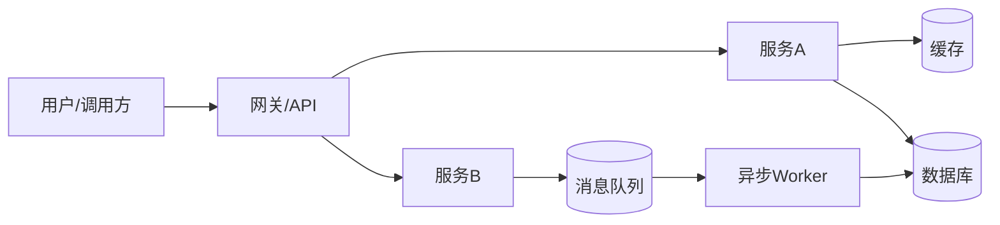
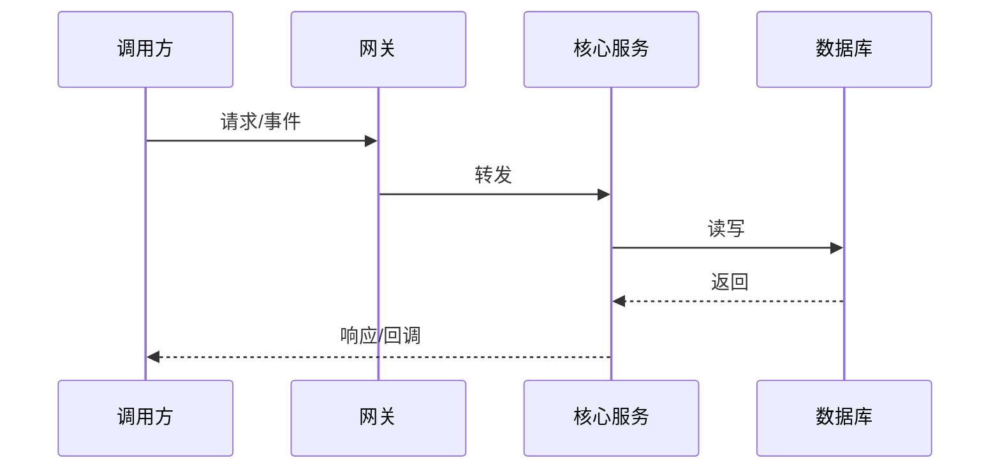

# 项目深入分析文档（模板｜可直接填充）

> 使用方式：把 `[]` 中的占位内容替换为你的项目实际信息；每个小节都提供了“需要填什么/怎么分析”的提示。  
> 建议：先写 **TL;DR → 关键链路 → 架构图 → 风险与建议**，最后补齐细节。

---

## 0. TL;DR（30 秒读完）

- **项目一句话**：项目是做 **[业务/产品]** 的系统，主要服务 **[目标用户/内部团队]**，核心价值是 **[价值]**。
- **核心架构**：采用 **[单体/微服务/前后端分离/事件驱动]**；关键组件包括 **[网关/服务A/服务B/DB/缓存/消息队列]**。
- **关键链路**：最关键的业务流程是 **[链路名称]**（入口：**[入口]** → 核心服务：**[服务]** → 数据落点：**[存储]**）。
- **主要风险（Top 3）**：
  1. **[风险1]**（影响：[影响]；触发：[条件]；现状：[证据]）
  2. **[风险2]**
  3. **[风险3]**
- **建议（Top 3）**：
  1. **[建议1]**（收益：[收益]；成本：[成本]；负责人：[Owner]；时间：[T]）
  2. **[建议2]**
  3. **[建议3]**

---

## 1. 背景与范围

### 1.1 项目背景
- 立项原因/业务痛点：**[为什么要做]**
- 当前阶段：**[探索/增长/成熟/维护]**
- 关键指标（如有）：**[DAU/TP99/成本/转化率/错误率]**

### 1.2 读者与用途
- 目标读者：**[新同学/研发/测试/产品/运维/管理层]**
- 使用场景：**[入职接手/技术评审/复盘/规划重构]**

### 1.3 范围边界（必写）
- 本文覆盖：**[系统范围、模块范围]**
- 本文不覆盖：**[不讨论的模块/历史细节]**

---

## 2. 业务与领域模型（从“业务”理解系统）

### 2.1 核心业务能力清单
用 5–10 条列出系统提供的“能力”，而不是模块名：
- **[能力1]**：面向 **[用户]**，解决 **[问题]**
- **[能力2]**

### 2.2 关键名词解释（Glossary）
| 名词 | 含义 | 备注/边界 |
|---|---|---|
| [Term] | [Definition] | [Note] |

### 2.3 领域对象与状态机（可选但很有价值）
- 领域对象：**[订单/任务/资产/工单...]**
- 关键状态流转：**[状态A→状态B→状态C]**

---

## 3. 系统整体架构（从“系统”理解实现）

### 3.1 架构概览图（建议画一张）
可用 Mermaid 快速出图（替换为你的组件）：

### 3.2 C4 视角（推荐）
- **Context（系统边界）**：系统与外部系统的关系（上游/下游/第三方）。
- **Container（容器/服务）**：有哪些服务/前端/任务/DB/缓存。
- **Component（组件）**：服务内部模块、接口、依赖。

### 3.3 模块拆解（职责清晰是文档质量的核心）
| 模块/服务 | 职责一句话 | 输入 | 输出 | 依赖 | Owner |
|---|---|---|---|---|---|
| [Service] | [Responsibility] | [Input] | [Output] | [Deps] | [Name] |

### 3.4 关键设计决策（ADR 摘要）
写清“为什么这样设计”，避免只描述“是什么”：
- 决策1：**[选择了什么]**  
  - 背景/约束：**[约束]**  
  - 备选方案：**A/B/C**  
  - 选择理由：**[权衡：性能/复杂度/成本/风险]**  
  - 代价：**[带来的负担]**

---

## 4. 数据与接口（从“数据流”理解系统）

### 4.1 数据存储清单
| 存储 | 用途 | 关键表/Key | 数据量级 | 备份/保留 | 风险 |
|---|---|---|---|---|---|
| [MySQL] | [用途] | [table] | [QPS/行数] | [策略] | [风险] |

### 4.2 核心表/模型说明（按领域对象组织）
以 **[领域对象]** 为单位：
- 表/集合：**[表名]**
- 主键与唯一性：**[规则]**
- 索引与查询模式：**[常用查询]**
- 重要字段含义：**[字段解释]**

### 4.3 关键接口/事件契约
| 接口/事件 | 方向 | 用途 | 幂等/重试 | SLA | 备注 |
|---|---|---|---|---|---|
| [API/Topic] | [入/出] | [用途] | [策略] | [SLA] | [Note] |

---

## 5. 关键业务链路深挖（本文最重要的部分）

> 选择 1–3 条最关键链路写深：能让读者“拿去就能排查/迭代”。

### 5.1 链路一：[链路名称]
- **触发入口**：**[URL/Job/消息]**
- **前置条件**：**[鉴权/配置/状态]**
- **主流程（时序）**：

- **异常与兜底**：**[超时/失败/重试/降级]**
- **幂等与一致性策略**：**[去重Key/事务/最终一致性]**
- **性能敏感点**：**[热点Key/大查询/外部依赖]**
- **可观测性**：关键日志/指标/Trace 埋点位置：**[位置]**

### 5.2 链路二（可选）：[链路名称]
（同上结构）

---

## 6. 非功能性：稳定性、性能、安全、成本

### 6.1 稳定性与容灾
- 依赖拓扑与单点：**[单点清单]**
- 限流/熔断/降级策略：**[策略]**
- 灾备与恢复（RTO/RPO）：**[目标与现状]**

### 6.2 性能与容量
- 峰值流量（QPS/并发）：**[峰值]**
- 关键指标（TP50/TP90/TP99/错误率）：**[数据]**
- 容量规划：**[按什么维度扩容]**

### 6.3 安全与合规（如适用）
- 鉴权/授权模型：**[JWT/OAuth/RBAC/ABAC]**
- 数据敏感分级与脱敏：**[策略]**
- 审计与追踪：**[审计点]**

### 6.4 成本与资源
- 主要成本项：**[计算/存储/带宽/三方调用]**
- 降本空间：**[点]**

---

## 7. 研发流程与工程质量

### 7.1 代码结构与依赖
- 仓库结构：**[目录说明]**
- 关键依赖/版本：**[依赖]**

### 7.2 测试策略
- 单测覆盖：**[覆盖率/薄弱点]**
- 集成测试：**[有哪些场景]**
- 回归策略：**[自动化/人工]**

### 7.3 发布与回滚
- 发布方式：**[灰度/金丝雀/全量]**
- 回滚手段：**[开关/版本回退/数据修复]**

---

## 8. 可观测性与运维（能否“看得见、管得住”）

### 8.1 监控指标（建议按 RED/USE）
- 请求类：QPS、错误率、延迟分位（TP95/TP99）
- 资源类：CPU、内存、GC、连接池、队列积压
- 业务类：**[下单成功率/任务完成率]**

### 8.2 日志与 Trace
- 统一 traceId/reqId：**[规则]**
- 关键日志：**[在哪些点必须打印]**

### 8.3 告警与值班
- 告警规则：**[阈值]**
- 误报/漏报：**[问题]**
- Oncall 手册：**[链接/位置]**

---

## 9. 主要问题与风险清单（带证据、带优先级）

> 写法：**现象（证据）→ 根因 → 影响 → 建议 → 成本/风险**。

| ID | 问题/风险 | 证据（数据/案例） | 影响 | 优先级 | 建议 | Owner | ETA |
|---|---|---|---|---|---|---|---|
| R1 | [风险] | [监控/日志/事故] | [影响] | P0/P1/P2 | [建议] | [人] | [时间] |

---

## 10. 改进方案与路线图（可落地的行动项）

### 10.1 短期（1–2 周）：止血/补洞
- [ ] **[行动1]**（目的：[ ]；验收：[ ]）
- [ ] **[行动2]**

### 10.2 中期（1–2 个月）：结构性优化
- [ ] **[行动1]**（拆解里程碑：[ ]）

### 10.3 长期（季度/半年）：演进与重构
- [ ] **[行动1]**

---

## 11. 附录

### 11.1 关键链接
- 仓库/文档/看板：**[链接]**
- Runbook：**[链接]**

### 11.2 术语表（完整）
（补齐 Glossary）

### 11.3 访谈问题清单（用于“问答收集信息”）
1. 这个项目最重要的 1–3 条业务链路是什么？峰值多少？  
2. 线上最常见的 3 类故障/告警是什么？  
3. 现在最痛的维护点/协作点是什么？  
4. 哪些模块最可能要重构？为什么？  
5. 未来 3 个月的业务目标与技术目标分别是什么？  

