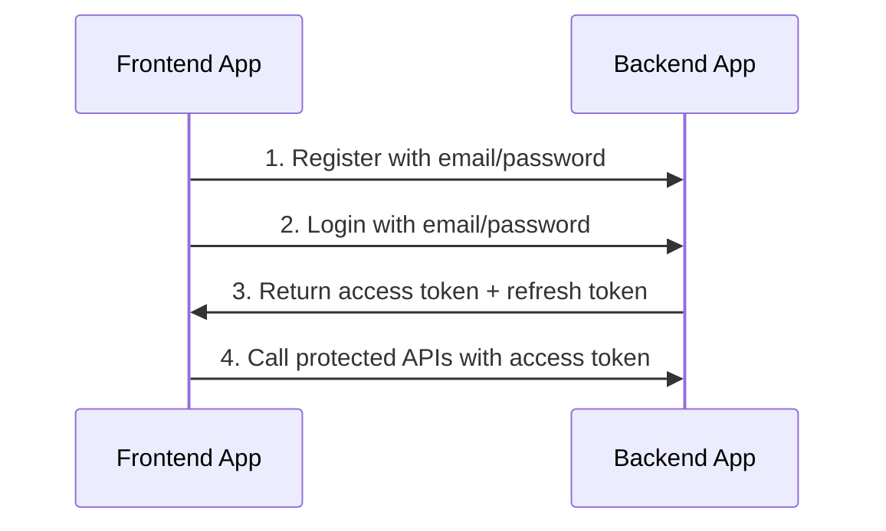

# Auth

## Table of Contents <!-- omit in toc -->

- [General info](#general-info)
- [Configure Auth](#configure-auth)
- [Current API endpoints](#current-api-endpoints)
- [Refresh token flow](#refresh-token-flow)
- [Logout behavior](#logout-behavior)

---

## General info

This project currently supports auth via **email + password**.



---

## Configure Auth

Set these env vars in `.env`:

```text
AUTH_JWT_SECRET=...
AUTH_JWT_TOKEN_EXPIRES_IN=15m
AUTH_REFRESH_SECRET=...
AUTH_REFRESH_TOKEN_EXPIRES_IN=3650d
```

You can generate random secrets with:

```bash
node -e "console.log('AUTH_JWT_SECRET=' + require('crypto').randomBytes(64).toString('base64')); console.log('AUTH_REFRESH_SECRET=' + require('crypto').randomBytes(64).toString('base64'));"
```

---

## Current API endpoints

- `POST /api/v1/auth/email/register`
- `POST /api/v1/auth/email/login`
- `GET /api/v1/auth/me`
- `PATCH /api/v1/auth/me`
- `DELETE /api/v1/auth/me`
- `POST /api/v1/auth/refresh`
- `POST /api/v1/auth/logout`

> Removed in current codebase: social login, email confirmation, forgot/reset password.

---

## Refresh token flow

1. Login via `POST /api/v1/auth/email/login`.
2. Use `token` in `Authorization: Bearer <token>` for normal API calls.
3. When access token expires, call `POST /api/v1/auth/refresh` with the `refreshToken`.
4. Save the new `token` and new `refreshToken` returned by refresh.

---

## Logout behavior

`POST /api/v1/auth/logout` invalidates the current session in DB.

- Existing refresh token for that session becomes unusable.
- Existing access token can still work until it expires (stateless JWT behavior).

---

Previous: [Database](database.md)

Next: [Serialization](serialization.md)
