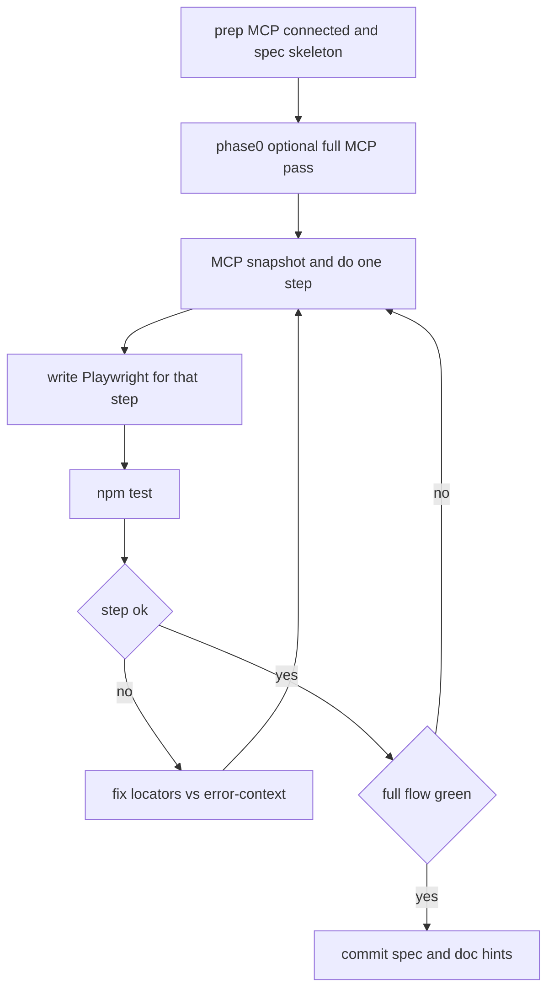

# TC-013：CSV 映射配置（chrome-devtools-mcp 执行记录）

## 说明

此前在 Cursor 里完成 TC-013 时，**没有单独的可执行 `.js` / shell 脚本**；流程是由 Agent **按顺序调用 chrome-devtools-mcp 的工具**（导航、快照、点击、填写、等待等）完成的。本文件把该顺序与要点记下来，便于你或后续对话按同一逻辑复跑。

**凭据**：登录地址与账号见项目内 [`login.md`](login.md)。**请勿**把密码写进本文件或提交到 Git。

## 前置条件

- Cursor 已配置并连接 `chrome-devtools-mcp`（例如项目 [`.cursor/mcp.json`](.cursor/mcp.json) 使用 `npx -y chrome-devtools-mcp@latest`）。
- 浏览器由 MCP 拉起或已附加到可调试实例。

## 用例来源

步骤与 Then 断言见 [`csv文件映射配置.md`](csv文件映射配置.md) 中 **TC-013**。

## 建议工具调用顺序（与当时执行一致）

以下为 **逻辑步骤**；具体工具名以当前 MCP 为准（常见为 `navigate_page`、`take_snapshot`、`click`、`fill`、`fill_form`、`wait_for`、`list_console_messages` 等）。

1. **打开登录页**  
   - `navigate_page` → `login.md` 中的 URL。

2. **登录**  
   - `take_snapshot` 获取可交互节点。  
   - 在账号、密码输入框 `fill`（或 `fill_form`）。  
   - 点击登录按钮；必要时 `wait_for` 文本如「工作台」或 URL 变化。

3. **进入渠道订单与 CSV 映射**  
   - `take_snapshot`。  
   - 侧栏点击「订单管理」。  
   - 点击「CSV映射配置」；等待表格/弹层出现（可 `wait_for` 或多次 snapshot）。

4. **Tab「其他」**  
   - 在映射弹窗内点击 Tab「其他」；`wait_for` 或 snapshot 确认「其他」为当前 Tab。

5. **系统字段与 CSV 字段映射**  
   - 点击「系统字段」下拉。  
   - 选择「订单编号」。  
   - 在对应 CSV 字段输入 **A**。

6. **订单状态值映射**  
   - 点击该区块「系统状态值」下拉。  
   - 选择「待支付」。  
   - CSV 字段输入 **B**。

7. **服务状态值映射**  
   - 点击「系统状态值」下拉。  
   - 用例未写死系统侧选项时，需选一个有效项（执行时曾选 **「待预约」**）以便填完该行。  
   - CSV 字段输入 **C**。

8. **保存与断言**  
   - 点击「保存」；等待响应。  
   - **Then**：弹窗仍打开、当前 Tab 仍为「其他」。  
   - 「保存成功」：应用内若返回 **HTTP 400** 或文案含「保存映射配置失败」，则该条 Then **不成立**；用 `wait_for` 搜「成功」时需注意页面表格等处的「支付成功」等干扰文案。

9. **排障（可选）**  
   - `list_console_messages`、`list_network_requests`（或等价工具）查看保存接口状态与响应体。

## 推荐工作流：MCP 先导 + 边跑边写脚本，跑通后保存

目标：用 **chrome-devtools-mcp** 在真实页面上「探路」，同时把已验证的步骤 **同步写进 Playwright**，避免凭空猜选择器；直到 **`npm test` 全流程通过**，再视为脚本定稿并纳入版本库。

### 阶段 0（可选）：MCP 完整跑通一遍

- 按上文「建议工具调用顺序」用 MCP **从头到尾执行 TC-013**（含登录），确认业务路径与断言在当环境下成立。  
- 在关键界面各留一次 **`take_snapshot`**（或保存 MCP 输出），作为后续写脚本的 **DOM / 无障碍树依据**。

### 阶段 1：边用 MCP 跑、边写 Playwright（主循环）

对每个业务步骤，建议固定节奏：

1. **MCP**：对当前界面 `take_snapshot`，执行本步操作（点击 / 填写 / `wait_for`）。  
2. **脚本**：根据快照里的 **角色与文案**（`menuitem`、`button`、`dialog`、`tab`、`combobox`、`textbox` 的 name 等），在 [`tests/tc013-csv-mapping.spec.ts`](tests/tc013-csv-mapping.spec.ts)（或新 spec）里写下 **等价 Playwright**（优先 `getByRole` / `getByText`，少用裸 class）。  
3. **验证**：本地执行 `npm test`（或 `npm run test:ui` 单步调试）。  
4. **失败时**：打开 `test-results/**/error-context.md`，与 MCP 最新快照对照，修正定位或等待条件；必要时再用 MCP 重放该步确认。

重复直到 **Playwright 与 MCP 都能稳定跑完全流程**（或你约定「以 Playwright green 为唯一准绳」）。

### 阶段 2：跑通后「保存脚本」

- **应提交**：`tests/*.spec.ts`、`playwright.config.ts`、`package.json`、`.env.example`、本 runbook 中与选择器相关的补充说明。  
- **勿提交**：`.env`、含明文密码的 [`login.md`](login.md)（建议加入 `.gitignore` 或仅本地保留）。  
- 若团队需要记录「某次跑通时的快照片段」，可贴在 runbook 附录或内部 Wiki，**不要**贴账号密码。

### 流程示意



## Playwright 运行方式（可执行自动化）

仓库内已提供与 TC-013 对齐的 Playwright 用例，**凭据通过环境变量注入**，勿提交 `.env`。

1. 复制环境变量模板并填写（URL/账号/密码与 [`login.md`](login.md) 一致即可，不要把真实密码写进仓库）：

   ```bash
   cp .env.example .env
   ```

2. 安装依赖与浏览器（首次）：

   ```bash
   npm install
   npx playwright install chromium
   ```

3. 运行用例（**默认会打开 Chromium 窗口**；若要无头可加 `HEADLESS=1`）：

   ```bash
   npm test
   ```

   ```bash
   HEADLESS=1 npm test
   ```

   调试界面：

   ```bash
   npm run test:ui
   ```

- 用例文件：[tests/tc013-csv-mapping.spec.ts](tests/tc013-csv-mapping.spec.ts)  
- 服务状态行系统侧选项可通过 `TC013_SERVICE_STATUS` 覆盖，默认 `待预约`（与上文 MCP 记录一致）。  
- 「保存成功」为 **可选**：未见 Toast 时**不判失败**，仅在报告里 `warning`；弹窗仍在、Tab「其他」为硬断言。  
- **弹窗内「一直滚动」**：CSV 映射里渠道 Tab 多、内部可滚动时，Playwright 默认会对每个目标 `scrollIntoView`，易与弹窗滚动互相拉扯；spec 对弹窗内点击/填写使用 **`force: true`**（`dialogAction`），并点 **`.el-select` 外壳** 而非内部 `combobox` input。  
- **与 MCP 的差异**：MCP 按快照里的 **可访问角色**操作；脚本侧用 `getByRole` + 表体数据表筛选；若仍失败，用 `test-results/**/error-context.md` 对照微调。

## 其他自动化方式

若不用 Playwright，仍可用 **Puppeteer** 等按上表 MCP 步骤自行实现；原则相同：环境变量注入账号密码，选择器随版本维护。

---

*生成说明：与某次实际 MCP 跑通流程对齐；保存接口是否成功以当时环境与后端校验为准。*
