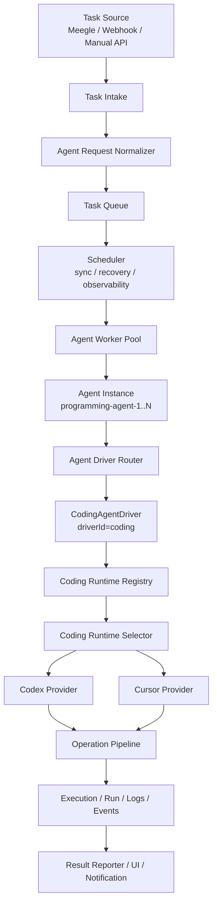

# diting Agent Layer Redesign

更新日期：2026-06-10

本文档描述 diting Agent 层的目标架构。核心结论是：**Agent 是任务能力与并发容量的领域层，Codex/Cursor 是编码 Agent Driver 下的 runtime provider，不再是顶层 execution 或独立 driver**。

## 设计结论

最终分层如下：

```text
Task
  -> Agent Kind
     -> Agent Driver
        -> Runtime Provider
           -> Operation / Execution
```

对于当前编码任务：

```text
Task
  -> agentKind = programming
     -> driverId = coding
        -> runtime = codex | cursor
           -> workflow execution
```

Codex/Cursor 的定位：

```text
不是 Agent
不是 Worker
不是顶层 Driver
不是 Execution

它们是 CodingAgentDriver 下可动态发现、可排序、可禁用、可选择的 runtime provider。
```

## 设计目标

- 将历史 `execution(codex/cursor)` 下沉到 Agent 层，作为 `programming` agent 的编码运行时能力。
- `agent` 成为稳定的一等领域概念，后续可扩展 `review`、`triage`、`docs`、`qa` 等非编码 agent。
- Codex/Cursor 合并为一个 `CodingAgentDriver` 的不同 runtime provider，避免重复实现 workflow、session、governance、timeout、日志等逻辑。
- Agent instance 表示并发容量，数量不限制；runtime provider 表示具体后端，数量也可动态扩展。
- 保留旧任务和旧配置兼容：`executor=programming/codex/cursor` 继续可读、可跑。
- 运维看板可以查看动态扫描出的 Codex/Cursor provider，并调整启用状态、优先级和默认 runtime。

## 非目标

- 不在第一阶段强制迁移数据库字段。
- 不要求一次性重命名所有 API/UI 中的 `executor` 与 `execution` 文案。
- 不把非编码 agent 套进 coding workflow；非编码 agent 应有自己的 driver。
- 不把 Codex/Cursor 当作并发容量单位；并发容量由 agent instance 决定。

## 最终架构图



## 核心概念

### Agent Kind

`AgentKind` 表示任务需要哪一类 agent 能力。

示例：

```text
programming
review
triage
docs
qa
```

`programming` 是编码类任务，不等于 Codex，也不等于 Cursor。

### Agent Instance

`AgentRecord` 表示一个可被调度占用的并发容量槽。

示例：

```text
programming-agent-1
programming-agent-2
programming-agent-N
review-agent-1
```

一个 agent instance 同一时间最多运行一个任务。Codex/Cursor 的数量不限制，但它们不是 agent instance；它们是可用 runtime provider。

### Agent Driver

`AgentDriver` 表示某类 agent 的能力实现边界。

编码类任务只有一个 driver：

```text
driverId = coding
agentKind = programming
```

`CodingAgentDriver` 负责通用编码编排：

- workflow prompt 解析
- session 创建与恢复
- stdout/stderr 捕获
- timeout 与 idle timeout
- governance hooks
- quality/repair/PR 协作
- execution log 与 runtime event 记录

### Runtime Provider

`RuntimeProvider` 是 driver 内部的具体运行后端。

编码类 provider：

```text
codex
cursor
future-cli
```

Codex/Cursor 共享 `CodingAgentDriver` 的编排逻辑，只负责各自 CLI 的参数、session、输出解析和健康检查。

### Execution / Run

`ExecutionRecord` 或 run 表示一次运行事实，应记录：

```text
taskId
agentId
agentKind
driverId
runtimeProviderId
status
summary
startedAt
endedAt
```

Execution 是观测和审计记录，不是调度入口。

## 领域模型

目标模型：

```ts
type AgentKind = "programming" | "review" | "triage" | "docs" | "qa" | string;

type AgentRequest = {
  agentKind: AgentKind;
  capability?: string;
  preferredDriver?: string;
  preferredRuntime?: string;
};

type AgentRecord = {
  id: string;
  kind: AgentKind;
  status: "idle" | "busy" | "offline" | "disabled" | "error";
  taskId: string | null;
  labels: string[];
  driverId?: string | null;
  runtimeProviderId?: string | null;
  lastHeartbeatAt: Date;
  createdAt: Date;
  updatedAt: Date;
};

type ExecutionRecord = {
  id: string;
  taskId: string;
  agentId: string | null;
  agentKind: AgentKind;
  driverId: string;
  runtimeProviderId: string | null;
  workspace: string;
  status: "preparing" | "executing" | "evaluating" | "repairing" | "completed" | "failed";
  summary: string | null;
  startedAt: Date;
  endedAt: Date | null;
};
```

第一阶段兼容字段：

```text
TitingTask.executor
AgentRecord.executor
ExecutionRecord.executor
```

兼容期内这些字段不直接删除，而是通过归一化层映射到新的 agent request。

## 插件接口

### AgentDriverPlugin

```ts
interface AgentDriverPlugin extends RuntimePlugin {
  kind: "agent";
  agentKind: AgentKind;
  driverId: string;
  capabilities: string[];

  operate(input: AgentOperationInput): Promise<AgentOperationResult>;
  continueOperation?(input: AgentContinueInput): Promise<AgentOperationResult>;
  interrupt?(sessionId: string, reason: string): Promise<InterruptResult>;
  inspect?(sessionId: string): Promise<Record<string, unknown>>;
}
```

兼容期可保留：

```ts
type ExecutionPlugin = AgentDriverPlugin;
```

新代码应使用 agent/driver/runtime 术语。

### CodingRuntimeProvider

```ts
interface CodingRuntimeProvider {
  id: string;
  runtime: "codex" | "cursor" | string;
  displayName: string;
  bin: string;
  priority: number;
  enabled: boolean;
  capabilities: string[];
  source: "config" | "env" | "path" | "known-location" | "external";

  health(): Promise<PluginHealth>;
  createSession?(input: CodingRuntimeInput): Promise<string | null>;
  execute(input: CodingRuntimeInput): Promise<CodingRuntimeResult>;
  resume?(input: CodingRuntimeResumeInput): Promise<CodingRuntimeResult>;
  interrupt?(sessionId: string, reason: string): Promise<InterruptResult>;
}
```

### CodingAgentDriver

```ts
class CodingAgentDriver implements AgentDriverPlugin {
  kind = "agent";
  agentKind = "programming";
  driverId = "coding";
  capabilities = ["code-change", "repair", "shell-workflow", "session-resume"];

  constructor(
    private readonly registry: CodingRuntimeRegistry,
    private readonly selector: CodingRuntimeSelector
  ) {}

  async operate(input: AgentOperationInput): Promise<AgentOperationResult> {
    const provider = this.selector.select(this.registry.list(), input);
    return provider.execute(toCodingRuntimeInput(input));
  }
}
```

Codex/Cursor 分别实现：

```text
CodexRuntimeProvider
CursorRuntimeProvider
```

## 动态扫描

系统应动态扫描可用编码 runtime provider。扫描结果进入 `CodingRuntimeRegistry`，并被运维看板和 runtime selector 共享。

扫描来源：

- 显式配置的 binary path
- 环境变量，如旧 `CODEX_CLI_BIN`、`CURSOR_CLI_BIN`
- PATH 中的可执行文件
- 常见安装路径
- 外置 agent package 返回的 provider

扫描记录：

```ts
type CodingRuntimeProviderRecord = {
  id: string;
  runtime: "codex" | "cursor" | string;
  displayName: string;
  bin: string;
  version: string | null;
  status: "available" | "unavailable" | "disabled";
  priority: number;
  source: "config" | "env" | "path" | "known-location" | "external";
  capabilities: string[];
  lastScannedAt: Date;
  healthMessage: string;
};
```

默认优先级：

```text
codex = 100
cursor = 80
```

即默认 Codex 优先于 Cursor。

同类 provider 多个候选时，来源优先级建议：

```text
config > env > path > known-location > external default
```

## Runtime 选择规则

执行时按以下顺序选择 runtime provider：

1. 若任务指定 `preferredRuntime`，优先选择该 runtime 下健康且启用的 provider。
2. 若 agent instance 固定了 `runtimeProviderId`，优先使用该 provider。
3. 若运维看板设置了 default runtime，优先使用 default runtime。
4. 否则按 priority 排序，默认 Codex 高于 Cursor。
5. 若高优先级 provider 不健康、禁用或能力不匹配，fallback 到下一个健康 provider。

伪代码：

```ts
function selectRuntime(input: AgentOperationInput): CodingRuntimeProvider {
  const candidates = registry
    .list()
    .filter((provider) => provider.enabled)
    .filter((provider) => provider.healthy)
    .filter((provider) => matchesCapability(provider, input.capability));

  if (input.preferredRuntime) {
    const preferred = best(candidates.filter((item) => item.runtime === input.preferredRuntime));
    if (preferred) return preferred;
  }

  if (input.agent.runtimeProviderId) {
    const fixed = candidates.find((item) => item.id === input.agent.runtimeProviderId);
    if (fixed) return fixed;
  }

  if (config.defaultRuntime) {
    const defaultProvider = best(candidates.filter((item) => item.runtime === config.defaultRuntime));
    if (defaultProvider) return defaultProvider;
  }

  return bestByPriority(candidates);
}
```

## 运维看板

运维看板应展示 runtime provider，而不是展示固定的 Codex/Cursor 两个入口。

列表字段：

| 字段 | 说明 |
| --- | --- |
| displayName | 展示名，例如 `Codex (/opt/homebrew/bin/codex)` |
| runtime | `codex` / `cursor` / 其他 |
| bin | 可执行文件路径 |
| version | 探测到的版本 |
| status | available / unavailable / disabled |
| priority | 选择优先级 |
| source | config / env / path / known-location / external |
| capabilities | 支持能力 |
| lastScannedAt | 最近扫描时间 |
| healthMessage | 健康检查详情 |

支持操作：

- 启用或禁用 provider
- 设置 priority
- 设为默认 runtime
- 固定某个 agent instance 使用某个 provider
- 立即健康检查
- 重新扫描
- 测试运行

看板操作应写入 `PluginConfig` 或专门的 runtime override 表，不直接修改环境变量。

## 调度链路

最终调度职责：

```text
ServiceScheduler
  -> task integration sync
  -> human reply sync
  -> offline recovery
  -> scheduler observability

ServiceAgentWorkerPool
  -> discover agent instances
  -> run workers by agent kind
  -> claim idle agent
  -> claim queued task
  -> dispatch operation

ServiceAgentOperation
  -> prepare workspace
  -> select driver
  -> driver operate
  -> quality evaluate
  -> repair loop
  -> pull request
  -> cleanup
  -> release agent
```

执行链路：

```text
1. Task Intake 创建或更新任务
2. normalizeAgentRequest 生成 agentKind/driver/runtime 偏好
3. Task 进入 queued
4. WorkerPool 根据 agent kind 找 idle agent
5. claim agent instance
6. claim queued task
7. AgentDriverRouter 选择 driver
8. CodingAgentDriver 选择 runtime provider
9. Operation pipeline 执行任务
10. 写入 execution/run/log/event
11. release agent instance
12. report result
```

Worker pool 不能只硬编码 `programming`。第一阶段可继续让 `programming-agent-*` 作为默认容量槽，但实现应朝通用 agent kind 演进：

```ts
async function runOnce(agentId: string) {
  const agent = await agents.getById(agentId);
  const task = await tasks.nextClaimableForAgentKind(agent.kind);
  const driver = runtime.selectAgentDriver(task.agentKind, task.capability);
  return operation.run(task, agent, driver);
}
```

## 配置设计

目标配置：

```ts
{
  scheduler: {
    agents: {
      programming: {
        count: 8,
        pollIntervalMs: 1000,
        offlineTimeoutMs: 300000
      },
      product: {
        count: 1,
        pollIntervalMs: 1000,
        offlineTimeoutMs: 300000
      },
      review: {
        count: 2,
        pollIntervalMs: 1000,
        offlineTimeoutMs: 300000
      }
    }
  },

  plugins: {
    agents: {
      packageName: null,
      defaultKind: "programming",
      drivers: {
        coding: {
          enabled: true,
          kind: "programming",
          priority: 100,
          defaultRuntime: "codex",
          runtimeSelection: "priority",
          discovery: {
            enabled: true,
            scanPath: true,
            scanKnownLocations: true,
            scanIntervalMs: 300000
          },
          runtimes: {
            codex: {
              enabled: true,
              priority: 100,
              bins: ["codex"]
            },
            cursor: {
              enabled: true,
              priority: 80,
              bins: ["agent", "cursor-agent"]
            }
          }
        }
      }
    }
  }
}
```

旧配置映射：

| 旧配置 | 新配置 |
| --- | --- |
| `plugins.execution.packageName` | `plugins.agents.packageName` |
| `plugins.execution.defaultExecutor=programming` | `plugins.agents.defaultKind=programming` |
| `plugins.execution.defaultExecutor=codex` | `defaultKind=programming` + `defaultRuntime=codex` |
| `plugins.execution.defaultExecutor=cursor` | `defaultKind=programming` + `defaultRuntime=cursor` |
| `plugins.execution.codexBin` | `plugins.agents.drivers.coding.runtimes.codex.bins` |
| `plugins.execution.cursorBin` | `plugins.agents.drivers.coding.runtimes.cursor.bins` |
| `DITING_PLUGIN_EXECUTION_PACKAGE` | `DITING_PLUGIN_AGENT_PACKAGE` |
| `DITING_SCHEDULER_AGENT_COUNT` | `scheduler.agents.programming.count` |

## 旧任务兼容

历史 `executor` 映射：

| 旧 executor | agentKind | driverId | preferredRuntime |
| --- | --- | --- | --- |
| `programming` | `programming` | `coding` | null |
| `codex` | `programming` | `coding` | `codex` |
| `cursor` | `programming` | `coding` | `cursor` |

新增 product lane 不复用 legacy executor 语义，任务应显式写入：

```ts
{
  agentKind: "product",
  preferredDriver: "openspec-product",
  preferredRuntime: "codex"
}
```

`openspec-product` driver 只负责 OpenSpec change 的生成、修订、校验和评审入口，不直接进入编码 PR 流程；Codex/Cursor 仍只是 runtime provider。

新任务推荐：

```ts
{
  agentKind: "programming",
  capability: "code-change",
  preferredRuntime: "codex"
}
```

未指定 `preferredRuntime` 时，由 selector 根据 health、enabled、priority 自动选择。

## 上下游协作

### 上游任务来源

上游只表达业务任务和 agent request，不关心 Codex/Cursor 细节：

```text
Meegle / Webhook / Manual API
  -> CreateTaskInput
  -> normalizeAgentRequest
  -> queued task
```

### 中游执行控制

核心控制链路：

```text
Task Queue
  -> Agent Worker Pool
  -> Agent Instance
  -> Agent Driver
  -> Runtime Provider
  -> Operation Pipeline
```

### 下游观测

日志、事件和运行记录统一携带：

```text
taskId
traceId
executionId / runId
agentId
agentKind
driverId
runtimeProviderId
legacyExecutor
```

旧 UI 可以继续展示 `executor`；新 UI 应展示：

```text
Agent Kind: programming
Driver: coding
Runtime: codex
Agent: programming-agent-3
```

## 迁移计划

### 阶段一：契约与兼容层

- 新增 `AgentKind`、`AgentRequest`、`AgentDriverPlugin`、`CodingRuntimeProvider`。
- 新增 `normalizeAgentRequest`。
- 保留 `executor` 字段。
- 旧 `executor=programming/codex/cursor` 均映射到新模型。

### 阶段二：合并编码 driver

- 引入 `CodingAgentDriver`。
- 将现有 Codex/Cursor 实现拆为 `CodexRuntimeProvider` 与 `CursorRuntimeProvider`。
- 保留当前 workflow、session、governance、timeout、日志能力。
- 默认 Codex priority 高于 Cursor。

### 阶段三：动态 runtime registry

- 实现 `CodingRuntimeDiscovery`。
- 实现 `CodingRuntimeRegistry`。
- 实现 `CodingRuntimeSelector`。
- 支持扫描多个 Codex/Cursor provider。
- 运维看板支持启用、禁用、排序、设默认、健康检查、重新扫描。

### 阶段四：调度泛化

- `AgentRecord.executor` 逐步迁移为 `AgentRecord.kind`。
- `ServiceAgentWorkerPool` 按 agent kind 查找任务与 agent。
- `scheduler.agents.<kind>.count` 支持 seed 任意 kind 的 agent instance。
- 保持 `programming-agent-*` 是默认编码容量槽。

### 阶段五：配置换面

- 新增 `plugins.agents` 与 `scheduler.agents`。
- 旧 `plugins.execution` 和旧 env 继续作为 fallback。
- API、文档、UI 逐步从 executor/execution 术语迁移到 agent/driver/runtime。

### 阶段六：非编码 agent

- 新增 `review`、`triage`、`docs`、`qa` agent kind。
- 为每类非编码 agent 提供独立 driver。
- 验证新增非编码 agent 不需要修改 coding driver 或 execution 主链路。

## 验收标准

- 多个 `programming-agent-*` 可以并发执行多个 queued programming tasks。
- 一个 busy agent 不能 claim 第二个任务。
- 旧 `executor=codex/cursor/programming` 任务继续可运行。
- Codex/Cursor 可以被动态扫描，多个 provider 可同时出现在运维看板。
- 默认选择 Codex；Codex 不可用时可 fallback 到 Cursor。
- 运维看板调整 provider priority 后，后续任务按新优先级选择。
- 新增一个非编码 agent kind 时，不需要修改 `CodingAgentDriver`。
- 日志和运行记录能同时看到 `agentKind`、`driverId`、`runtimeProviderId` 与兼容用的 legacy executor。

## 最终形态

最终 diting 的 Agent 架构应稳定在以下边界：

```text
Task 描述需要哪类 Agent
Agent Instance 提供并发容量
Agent Driver 提供能力边界
Runtime Provider 提供具体后端
Operation Pipeline 完成任务闭环
Execution/Run 记录一次运行事实
Observability 连接上下游状态
```
