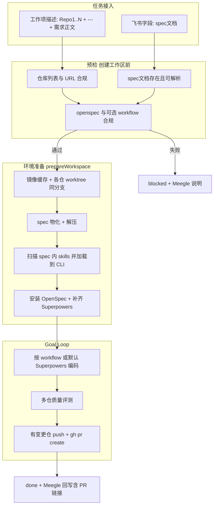

# 谛听（diting）多仓 Spec 驱动工作流重构方案

| 项 | 内容 |
| --- | --- |
| 文档版本 | v0.3 |
| 状态 | 已实现（v0.3） |
| 更新日期 | 2026-06-03 |
| 关联仓库 | diting monorepo |

## 已确认决策

- **分支**：多个 Git 仓库共用同一分支名（飞书「分支」字段或自动生成 `feature/...`）。
- **PR**：质量评测通过后，**每个有变更的仓库**分别 `git push` 并 `gh pr create`，回写多个 PR 链接。
- **spec 根目录重名**：不覆盖已有文件；冲突时**另起文件名**（见 §4.2）。
- **PR base 分支**：**按仓探测**默认分支（见 §4.6.3），不使用全局固定 `main`。
- **tooling 安装失败**：**默认阻断**任务，不降级跳过（见 §4.5）。
- **预检**：**创建工作区之前**校验飞书工作项的仓库列表、spec 文档及合规性；不通过则 `blocked`，不执行 clone/worktree（见 §4.0）。
- **spec 内 skills**：spec 压缩包（或物化后的目录）若含 skills，解压/扫描后**加载到执行 CLI 可用的 skills 目录**（见 §4.2、§4.5）。

---

## 1. 背景与目标

### 1.1 背景

当前 diting 执行链路面向**单一 Git 仓库**：从飞书项目（Meegle）拉取任务后，在 `workspace/{taskId}-{executor}/repo` 下准备 worktree，从**目标仓内**读取 `WORKFLOW_PROMPTS.md` 驱动 Codex/Cursor 节点执行，再对**主仓**做质量评测，最后回写 Meegle。实际业务需求常涉及**多个前后端仓库**、**独立于代码仓的 spec 包**（含工作流提示词），并在完成后需要**自动创建 PR**。

### 1.2 目标

1. **多 Git 仓库**：需求描述支持 `Repo1`…`RepoN` 列表，各仓拉取到统一工作区。
2. **spec 文档字段**：飞书工作项字段「spec文档」中的文件/压缩包物化到**工作区根目录**。
3. **工作流外置**：`WORKFLOW_PROMPTS.md` **不再从代码仓读取**，改从 spec 文档（工作区根）读取。
4. **工具链就绪**：拉仓与 spec 就绪后，在工作区安装 **Superpowers** 与 **OpenSpec**。
5. **预检门禁**：入队/执行前校验仓库与 spec 是否齐全且合规，避免无效 clone。
6. **端到端闭环**：预检 → 环境准备 → 编码开发 → 质量评测 → **按仓创建 PR** → 任务完成并回写飞书。

### 1.3 非目标（本阶段不做）

- 多实例 diting 横向扩容、跨机器共享工作区。
- 组织级权限平台、PR 审批流对接（仅 `gh pr create` 创建链接）。
- 每仓独立分支名（已明确采用**共用一分支**）。

---

## 2. 现状与差距

### 2.1 现状流程


### 2.2 关键代码落点

| 能力 | 当前实现 | 差距 |
| --- | --- | --- |
| 需求解析 | `apps/server/src/diting/plugins/shared.ts` 中 `parseDescriptionBlock` 仅 `Repo:` + `---` | 需 `Repo1..N` |
| 环境 | `apps/server/src/diting/plugins/environment.ts` 单目录 `repo/` | 需单仓展开到工作区根，多仓使用 `<slug>/` 子目录 |
| 工作流 | `apps/server/src/diting/plugins/workflow.ts` 查 `repoPath` 下 md | 需查工作区根 / spec 路径 |
| spec 附件 | 无 | 需 Meegle 字段 + 下载/解压 |
| 工具链 | 无 | 需 Superpowers + OpenSpec |
| PR | 无 | 需 push + `gh pr create` 按仓 |
| 预检 | 无独立校验 | 创建 worktree 前校验描述 + spec 文档合规 |
| spec 内 skills | 无 | 从 spec 包发现 skills 并注入 CLI |

更完整的架构导航见 [架构文档索引](./index.md)。

---

## 3. 总体方案

### 3.1 目标流程



### 3.2 工作区目录结构

单仓：

```
{DITING_WORKSPACE_ROOT}/{taskId}-{executor}/
├── .git                      # 单仓 worktree
├── package.json              # 仓库文件直接位于工作区根
├── src/
├── WORKFLOW_PROMPTS.md       # 可选；缺失时使用内置 Superpowers 默认 workflow
├── openspec/                 # spec 压缩包必须提供
├── .cursor/skills/           # spec 包内 skills + 内置 Superpowers 补齐（CLI 加载）
└── artifacts/
    ├── workspace.json        # 环境清单
    ├── skills-load.json      # spec skills 加载结果
    └── prs.json              # PR 结果
```

多仓：

```
{DITING_WORKSPACE_ROOT}/{taskId}-{executor}/
├── WORKFLOW_PROMPTS.md       # 可选；缺失时使用内置 Superpowers 默认 workflow
├── openspec/                 # spec 压缩包必须提供
├── .cursor/skills/           # spec 包内 skills + 内置 Superpowers 补齐（CLI 加载）
├── studyspace-mobile/        # Repo1 worktree
├── studyspace-shadow/        # Repo2 worktree
├── studyspace-service/       # Repo3 worktree
└── artifacts/
    ├── workspace.json        # 环境清单
    ├── skills-load.json      # spec skills 加载结果
    └── prs.json              # 各仓 PR 结果
```

**兼容约定**

- 单仓时 `PreparedWorkspace.repoPath = PreparedWorkspace.workspacePath`；多仓时 `repoPath = <第一个仓 slug>`（主仓），供旧逻辑默认值。
- `ditingTask.repo` = 第一个仓库 URL（DB/API 不变）。
- 完整列表：`task.metadata.repos: Array<{ key, url, path }>`。

---

## 4. 功能设计

### 4.0 预检（创建工作区前）

**目的**：在调用 `EnvironmentPlugin.prepareWorkspace`（git clone / worktree / 磁盘布局）**之前**，基于飞书工作项已拉取的字段与描述，确认任务具备可执行条件，避免长时间 clone 后才发现 spec 或仓库配置错误。

**触发时机（规划）**

| 阶段 | 行为 |
| --- | --- |
| Meegle `pullTasks` / webhook `ingestTaskFromIntegration` 之后 | 任务 `created` → 执行预检 |
| 预检通过 | `validated` → `pending` → `queued`（与现有状态机衔接） |
| 预检失败 | 迁移至 **`blocked`**（或 `failed`，实现时二选一；推荐 `blocked` 便于人工补全后 `blocked → queued`） |

预检**不创建** `{workspace.root}/{taskId}-*` 目录；仅允许使用**临时目录**下载/解压 spec 做结构校验（校验后删除），或仅解析 Meegle 附件元数据 + 描述文本（实现时可分「轻量预检」与「深预检」两档，首版至少覆盖轻量 + 对 spec 压缩包的可选深检）。

**检查项**

| 类别 | 规则 | 失败示例 |
| --- | --- | --- |
| **仓库** | 描述（或字段回退）能解析出 ≥1 个 `RepoN` + 合法 git URL；`---` 后 instruction 非空 | 无 `Repo1`、URL 非法、缺分隔线 |
| **spec 文档** | 飞书字段「spec文档」非空，至少 1 个附件；类型为允许的文件或压缩包 | 字段为空、仅不支持格式 |
| **spec 合规** | 物化或临时解压后，工作区根（逻辑上）存在 **`openspec/`**；若提供 `WORKFLOW_PROMPTS.md` 则必须可解析 | 缺 `openspec/`、md 结构不符合 `workflow.ts` 解析器 |
| **压缩包** | 扩展名 `.zip` / `.tar.gz`；体积上限；zip-slip 路径拒绝；包内必须含根级 `openspec/` | 超大包、路径穿越、空包、缺 `openspec/` |
| **skills（可选深检）** | 若包内含 `skills/` 或 `.cursor/skills/`，每个 skill 目录存在 `SKILL.md` | 目录存在但缺 SKILL.md |

**实现落点（规划）**

- 模块：`apps/server/src/diting/plugins/task-preflight.ts`（或 `spec-preflight.ts`）。
- 接入：`mapMeegleTask` 之后、`TaskCommandService` 校验路径，或 `ingestTaskFromIntegration` 内同步调用。
- 产出：`metadata.preflight: { passed, checkedAt, checks: [{ name, passed, detail }] }`；失败时 `metadata.preflightError` 与 Meegle 评论/回写摘要。
- 事件：结构化日志 + SSE（`task.preflight.failed` / `task.preflight.passed`），便于控制台展示。

**与 §4.1 的关系**：§4.1 定义描述**格式**；§4.0 在运行时**强制执行**该格式及 spec 侧约束。重复校验在 `prepareWorkspace` 入口可再做幂等快检，但以预检为准。

---

### 4.1 需求描述格式（多仓）

飞书工作项「描述」区采用固定结构：**元数据区** + **分隔线** + **需求正文**。

**格式规范**

| 行类型 | 语法 | 说明 |
| --- | --- | --- |
| 仓库 | `RepoN:` 下一行 URL | N 从 1 递增；支持 `Repo 1:`；URL 经 `normalizeRepoUrl` |
| 分支（可选） | `Branch:` 下一行 | **全局一分支**，所有仓 checkout 同一分支名 |
| 分隔 | 单独一行 `---`（前后可空行） | 之前为元数据，之后为 `instruction` |
| 需求 | `---` 之后全文 | 写入 `ditingTask.instruction` |

**示例**

```text
Repo1:
git@gitlab.yc345.tv:frontend/studyspace-mobile.git
Repo2:
git@gitlab.yc345.tv:frontend/studyspace-shadow.git
Repo3:
git@gitlab.yc345.tv:backend/studyspace-service.git
Branch:
feature/20260603-studyspace-xxx
---
【需求描述】
实现 xxx 功能，涉及移动端、影子包与服务端 API...
```

**解析实现（规划）**

- 扩展 `parseDescriptionBlock` → `parseMultiRepoDescriptionBlock`（`apps/server/src/diting/plugins/shared.ts`）。
- `mapMeegleTask` / `applyDescriptionFallback` 写入 `metadata.repos`，`repo = repos[0].url`。
- **向后兼容**：仅存在 `Repo:` 时视为 `Repo1`（旧任务可继续跑）。

**校验规则**

- 至少 1 个有效仓库 URL。
- 必须有 `---` 且其后 instruction 非空。
- 缺 `Branch:` 时沿用现有逻辑：飞书分支字段或自动生成 `feature/{timestamp}-...`。

---

### 4.2 飞书「spec文档」字段

**字段接入（规划）**

- Meegle `detailFields` 增加：`spec文档`、`spec_doc`、`specDocs`。
- 通过 `readMeegleString` / 附件结构解析得到文件列表（实现前需用真实 workitem **探针**确认 JSON 形态）。

**物化模块** `materializeSpecDocuments(task, workspacePath)`

建议独立文件：`apps/server/src/diting/plugins/spec-documents.ts`，在 `prepareWorkspace` 中**拉仓完成后**调用。

| 类型 | 行为 |
| --- | --- |
| 普通文件 | 下载到**工作区根**，保留原始文件名 |
| `.zip` / `.tar.gz` | 解压到工作区根；防 zip-slip；限制体积；解压条目适用同名规则 |
| `WORKFLOW_PROMPTS.md` | 物化后记录**实际落盘路径** → `PreparedWorkspace.workflowPromptsPath`（若因重名被改名，仍指向最终文件） |

**根目录重名策略（已确认：另起名称，不覆盖）**

- 目标路径已存在时，不覆盖；生成新文件名：`{basename}-{n}{ext}`，`n` 从 `2` 递增直至唯一（例：`WORKFLOW_PROMPTS.md` → `WORKFLOW_PROMPTS-2.md`）。
- `metadata.specDocuments` 记录 `originalName`（附件原名）与 `localPath`（实际路径），便于审计与诊断。
- 日志 / 环境事件中应打出 rename 映射，避免执行器按原名找不到文件。

**元数据示例**

```json
"metadata": {
  "specDocuments": [
    {
      "originalName": "WORKFLOW_PROMPTS.md",
      "localPath": "/.../WORKFLOW_PROMPTS-2.md",
      "renamed": true,
      "source": "meegle"
    }
  ]
}
```

**风险缓解**：若 Meegle CLI 暂不支持附件下载，开发期可用 `metadata` 手填本地路径兜底；上线前必须完成联调。

#### 4.2.1 spec 压缩包内的 skills（加载到 CLI）

业务 spec 包常把团队 **Agent Skills** 与 `WORKFLOW_PROMPTS.md` 一并打包。解压到工作区根后，需**发现并加载**到执行器 CLI 可识别的 skills 目录，供 Cursor `agent` / Codex 等在工作区执行时引用。

**发现规则（规划）**

扫描物化后的工作区根（含 zip 解压产物），匹配以下路径（相对工作区根）：

| 路径模式 | 说明 |
| --- | --- |
| `.cursor/skills/<skillId>/SKILL.md` | Cursor 标准布局（优先） |
| `skills/<skillId>/SKILL.md` | 常见打包布局；加载时映射到 `.cursor/skills/<skillId>/` |
| 任意 `**/SKILL.md` | 深度扫描兜底；skillId 取父目录名 |

**加载策略**

1. 在 `materializeSpecDocuments` 之后执行 `loadSpecSkillsIntoWorkspace(workspacePath)`。
2. 将发现的 skill 目录**合并**到 `{workspacePath}/.cursor/skills/`（与 §4.5 Superpowers 补齐共存；同名 skill 以 **spec 包内版本优先**，并记入 `metadata.skillsLoad.conflicts`）。
3. **注入 CLI**：
   - **Cursor**：工作区根已含 `.cursor/skills/` 时，`agent` 子命令以 workspace 为 cwd 即可发现 skills（与 Cursor 产品行为一致）；必要时通过 `task.metadata.env` 或执行器固定参数传递 `CURSOR_WORKSPACE` / 工作目录为 `workspacePath`。
   - **Codex**：按 Codex CLI 文档传递 skills 根目录或等价配置（实现阶段对照当前 `CodexExecutionPlugin` 参数扩展）；若 CLI 暂不支持显式 skills 路径，则在 WORKFLOW_PROMPTS 节点模板中写明 skill 名称，并保证 `.cursor/skills` 落盘。
4. 记录 `metadata.skillsLoad: { loaded: [{ id, sourcePath, targetPath }], skipped, conflicts }`；写入 `artifacts/skills-load.json`。

**与预检的关系**：§4.0 深预检可校验「含 skills 目录则必有 SKILL.md」；**加载**仅在预检通过后的 `prepareWorkspace` 中执行。

---

### 4.3 WORKFLOW_PROMPTS 读取策略

**不再**从 `repoPath` / `knowledge/` 下查找。

**查找优先级**

1. `PreparedWorkspace.workflowPromptsPath`（spec 物化显式路径）
2. `{workspacePath}/WORKFLOW_PROMPTS.md`
3. `{workspacePath}/knowledge/WORKFLOW_PROMPTS.md`

缺失 → 使用内置 Superpowers 默认 workflow；解析失败 → execution 失败，**不进入** quality（与现 [execution-orchestration spec](../../openspec/specs/execution-orchestration/spec.md) 一致）。

**执行器变量扩展（规划）**（`apps/server/src/diting/plugins/execution.ts`）

| 变量 | 含义 |
| --- | --- |
| `workspacePath` | 工作区根 |
| `reposRoot` | 兼容变量；实际仓库位置以 `reposList` / `gitWorktreePath` 为准 |
| `reposList` | 如 `Repo1=/path/to/mobile\nRepo2=...` |
| `gitWorktreePath` | 主仓路径（`repos[0]`） |
| `workflowPromptsPath` | 实际使用的 md 路径 |

**CLI 工作目录**：建议改为 `workspacePath`；模板中要求 Agent 使用 `gitWorktreePath` 或 `reposList` 定位代码仓。

**团队职责**：spec 包必须维护 `openspec/`；如需自定义执行链路，可额外维护 `WORKFLOW_PROMPTS.md`，节点可引用 `openspec-apply`、`superpowers` 等 skill 名称（更新 [WORKFLOW_PROMPTS 示例](../templates/WORKFLOW_PROMPTS.example.md)）。

---

### 4.4 多仓环境准备

**契约扩展（规划）**（`packages/plugin-api/src/diting/plugins.ts`）

```typescript
type WorkspaceRepo = {
  key: string;      // "Repo1"
  url: string;
  path: string;     // 单仓为 workspacePath；多仓为绝对路径 .../<slug>
  cachePath: string // mirror 路径
};

type PreparedWorkspace = {
  workspacePath: string;
  repoPath: string;              // = repos[0].path
  repos: WorkspaceRepo[];
  workflowPromptsPath?: string;
  specRootPath: string;          // = workspacePath
  branch: string;
  cachePath: string;             // 主仓 mirror（兼容）
  artifactsPath: string;
  env: Record<string, string>;
};
```

**`prepareWorkspace` 步骤（规划）**

> 进入本流程前须已通过 §4.0 预检；否则直接抛出 `EnvironmentPreparationError` stage=`preflight`。

1. 解析 `metadata.repos` 或回退 `[task.repo]`。
2. 对每个 URL：`hashRepo` → mirror clone/fetch → 单仓 `workspacePath` 或多仓 `<workspacePath>/<slug>` worktree add → **同一** `task.branch` checkout。
3. 有 `package.json` 则按锁文件选择包管理器安装（`pnpm-lock.yaml` → `pnpm install`，`package-lock.json` → `npm install`，见 `installDependenciesIfNeeded`）。
4. `materializeSpecDocuments`（含 zip 解压）。
5. `loadSpecSkillsIntoWorkspace`（§4.2.1）→ 合并到 `.cursor/skills/`。
6. `installWorkspaceTooling`（见 4.5；OpenSpec 初始化；Superpowers 缺失时用内置命令补齐）。
7. 写 `artifacts/workspace.json`（含 `skillsLoad`、`workflowPromptsPath`）。

**清理**：对每个 mirror 执行 `worktree remove`；策略仍由 `cleanupOnSuccess` / `cleanupOnFailure` 控制。

---

### 4.5 工作区工具链安装

在 **spec 物化 + skills 加载（§4.2.1）** 之后执行，**之后**才进入 execution。

| 组件 | 策略 |
| --- | --- |
| **OpenSpec** | spec 压缩包必须已含 `openspec/`；缺失时不复制骨架而是失败；随后探测 `openspec --version`，缺失时从 npm 官方源全局安装 `@fission-ai/openspec`，再执行 `openspec init --tools cursor --force` |
| **Superpowers** | **补齐**：仅当 spec 包未提供所需通用 skills 时，通过服务端内置命令安装到 `.cursor/skills/`（不与 spec 内同名 skill 覆盖） |

**skills 来源优先级**：spec 压缩包/附件（§4.2.1）> 工作区 `.cursor/skills` 已有内容 > Superpowers 远程安装。

**建议环境变量（规划）**

| 变量 | 说明 |
| --- | --- |
| `DITING_WORKSPACE_OPENSPEC_INIT` | 是否初始化 openspec 工具文件 |
| `DITING_WORKSPACE_SUPERPOWERS_INSTALL_CMD` | 可选高级覆盖：Superpowers 安装命令；留空使用内置命令 |
| `DITING_WORKSPACE_TOOLING_TIMEOUT_MS` | 超时 |

失败：`EnvironmentPreparationError` stage=`tooling`；**默认阻断**任务（已确认，不提供「跳过 tooling 继续执行」的默认路径；仅可通过后续显式配置扩展，首版不实现降级）。

**执行顺序**：**预检（§4.0）** → 拉仓 → spec 物化 → **加载 spec skills 到 CLI** → 安装 tooling → execution（编码节点）。

---

### 4.6 编码、质量评测、创建 PR

#### 4.6.1 编码

Goal Loop 不变：`packages/core/src/diting/service-execution.ts` → execution 插件按 WORKFLOW_PROMPTS **顺序节点**执行（含节点内 loop）；若未提供 WORKFLOW_PROMPTS，则按内置 Superpowers 默认节点执行。

#### 4.6.2 质量评测（多仓）

`DefaultQualityPlugin`（`apps/server/src/diting/plugins/quality.ts`）对 `workspace.repos` **逐仓**：

- 有 `package.json`：跑 lint / typecheck / test / build（沿用脚本链）。
- 无脚本：跳过脚本项，仍做 `git diff` 风险统计。

**聚合规则**：任一仓脚本失败或 `riskLevel === high` → 整体不通过 → 进入 repair loop 或 failed。

`report.diff` 改为按仓键值结构，便于诊断。

#### 4.6.3 创建 PR（新能力）

**时机**：quality 通过、任务标记 `done` **之前**。

**逻辑** `createPullRequestsForTask`（规划）：

对每个 `workspace.repos`：

1. `git -C <path> status --porcelain` — 无变更则跳过。
2. `git push -u origin <branch>`（remote 默认 `origin`，可配置）。
3. `gh pr create --head <branch> --base <base>`，其中 **`<base>` 按仓探测**（已确认）：
   - 在 `workspace.repos[].path` 内解析该仓默认分支，优先 `git symbolic-ref refs/remotes/origin/HEAD`（去 `origin/` 前缀）；
   - 失败则依次尝试 `main`、`master`；
   - 各仓 `base` 可不同（如前端 `main`、后端 `master`），写入 `prs.json` 的 `base` 字段。
   - 可选环境变量 `DITING_PR_BASE_BRANCH` 仅作为**探测失败后的最后兜底**（全仓同一值），首版可不暴露。

**产出**

- `artifacts/prs.json`：`[{ repoKey, url, prUrl, branch, base }]`
- `metadata.prs` 同步
- Meegle `reportResult` 评论追加 PR 链接列表

**失败策略**：PR 失败 → `failed` 或 `needs_human`（可配置），避免「质量过但无 PR」误报成功。

**运行环境前置**

- 已 `glab auth login --hostname <DITING_GITLAB_HOST>` 或已通过控制台 GitLab 授权入口完成设备码授权。
- push 凭证可用；GitLab CLI 检测插件健康，MR 创建阶段可调用 `glab mr create`。

---

## 5. 数据模型与 API 兼容

| 字段 | 变更 |
| --- | --- |
| `ditingTask.repo` | 仍必填，= 主仓 URL |
| `ditingTask.branch` | 全局一分支 |
| `ditingTask.instruction` | `---` 后需求正文 |
| `metadata.repos` | 新增，完整多仓列表 |
| `metadata.specDocuments` | 新增 |
| `metadata.preflight` / `metadata.preflightError` | 新增，预检结果 |
| `metadata.skillsLoad` | 新增，spec skills 加载清单 |
| `metadata.prs` | 新增 |

HTTP 手动创建任务：仅传 `repo` 时行为与现网一致（单仓列表长度为 1）。

---

## 6. 配置与运维

除现有 `DITING_WORKSPACE_*`、`MEEGLE_*` 外，新增见 4.5、4.6.3（实现时写入 [diting-config.md](./diting-config.md)）。

**部署检查清单**

- [ ] git、Node、codex/agent CLI
- [ ] `glab` 已登录且 `DITING_GITLAB_HOST` 指向目标 GitLab
- [ ] 对目标 group 有 push 权限
- [ ] Meegle CLI 可下载 spec 附件（联调后勾选）
- [ ] 磁盘：多 mirror + 多 worktree + spec 解压空间

---

## 7. OpenSpec 与文档同步（实现阶段）

实现前创建 change：`openspec/changes/multi-repo-spec-workflow/`（见该目录 `proposal.md`）。

| Capability | 变更要点 |
| --- | --- |
| `execution-orchestration` | WORKFLOW_PROMPTS 路径、cwd、多仓变量 |
| `plugins` | 多 worktree、spec 物化、tooling |
| `configuration` | 新 env |
| `governance` | git/gh 白名单 |
| `task-lifecycle` | 预检失败 → `blocked`；PR 失败与 done 前置条件（若需要） |

叙事文档待实现后同步：`ARCHITECTURE_AND_WORKFLOW.md`、`diting-technical-design.md`、`dev-spec/workflow-prompts`、`diting-config.md`。

---

## 8. 测试策略（实现阶段）

| 模块 | 用例 |
| --- | --- |
| 预检 | 无 spec / 无 Repo → blocked；非法 zip；缺 `openspec/`；缺 WORKFLOW_PROMPTS 但有 `openspec/` → validated |
| 描述解析 | Repo1/2/3、旧版 `Repo:`、缺 `---`、空 instruction |
| 环境 | 单仓展开到 workspace 根；双裸仓 integration；同 branch；多仓 `<slug>/` 目录 |
| spec | mock 单文件 + zip；`workflowPromptsPath` 正确；重名时 `*-2.md` 与 metadata 映射 |
| skills | zip 含 `skills/foo/SKILL.md` → `.cursor/skills/foo/`；执行器 cwd 为 workspace 时可发现 |
| workflow | 仅根目录有 md、repo 内无 md 仍成功；无 md 时使用内置 Superpowers 默认 workflow |
| quality | 仓 A 失败 → 整体失败 |
| PR | mock：仅有变更仓调用 `gh pr create`；双仓不同 default branch 时 base 分别正确 |
| tooling | 安装命令非零退出 → 环境准备失败，不进入 execution |

---

## 9. 实施计划（未启动）

| 阶段 | 内容 |
| --- | --- |
| P0 | OpenSpec change + 多仓描述解析 + `metadata.repos` + **预检（§4.0）** |
| P1 | `PreparedWorkspace` + 多仓 environment |
| P2 | spec 文档物化 + **spec skills 加载（§4.2.1）**（Meegle 探针 + 单测） |
| P3 | tooling 安装 + workflow/execution 改造（CLI cwd / skills 路径） |
| P4 | 多仓 quality |
| P5 | PR 创建 + Meegle 回写 |
| P6 | 文档、E2E 冒烟、配置示例 |

---

## 10. 风险项

| 风险 | 影响 | 缓解 |
| --- | --- | --- |
| Meegle spec 附件 API 未定型 | 阻塞物化 | 优先 CLI 探针；短期 metadata 兜底 |
| Superpowers 安装命令不统一 | 环境准备失败（阻断） | 服务端内置默认命令；env 仅作高级覆盖 |
| GitLab + `glab` 配置差异 | MR 步骤失败 | 部署检查清单；GitLab CLI 检测插件提前暴露授权状态；失败转 `needs_human` |
| 破坏性：不再读仓内 WORKFLOW_PROMPTS | 旧 spec 包仅放仓内 workflow 不会被读取 | 缺失时回退内置 Superpowers 默认 workflow；自定义流程需迁移到 spec 包 |
| 多仓 push 触发 CI | 成本/噪音 | PR 描述模板中说明 |
| spec 重名另起文件名 | 模板若写死路径可能对不上 | `workflowPromptsPath` 用实际路径；metadata 保留 `originalName` |
| 按仓探测 base 失败 | `gh pr create` 参数错误 | `main` / `master` 兜底 + 可选 `DITING_PR_BASE_BRANCH` |
| 预检深检下载 spec | 增加接入延迟 | 临时目录 + 超时；可配置仅轻量预检 |
| spec skills 与 Superpowers 同名 | 行为不一致 | spec 优先；记录 `skillsLoad.conflicts` |

---

## 11. 与现有架构文档的关系

本方案将替换旧架构说明第 5.3 节「工作流提示词」中「目标工程仓库提供 WORKFLOW_PROMPTS」的表述，改为：

> **spec 文档包**（飞书字段「spec文档」）是兼容入口而非通用前置条件。附件存在时仍必须提供 `openspec/`，并可选提供 `WORKFLOW_PROMPTS.md` 与 skills；附件不存在时，product agent 在临时 workspace 内生成 `openspec/` 和审核 artifact。Meegle 仅作为任务入口、审核入口与状态回写面，不承载 OpenSpec workspace；approved handoff 后当前 task 会切换为 programming 阶段并复用同一个 workspace。

实现完成前，运行时行为仍以当前代码与 `openspec/specs/` 为准。
