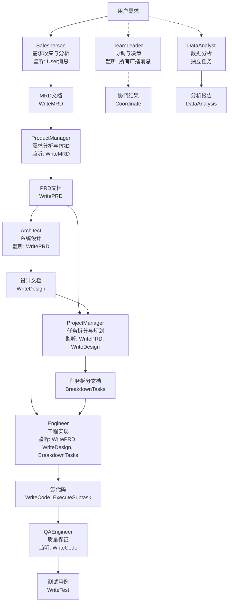
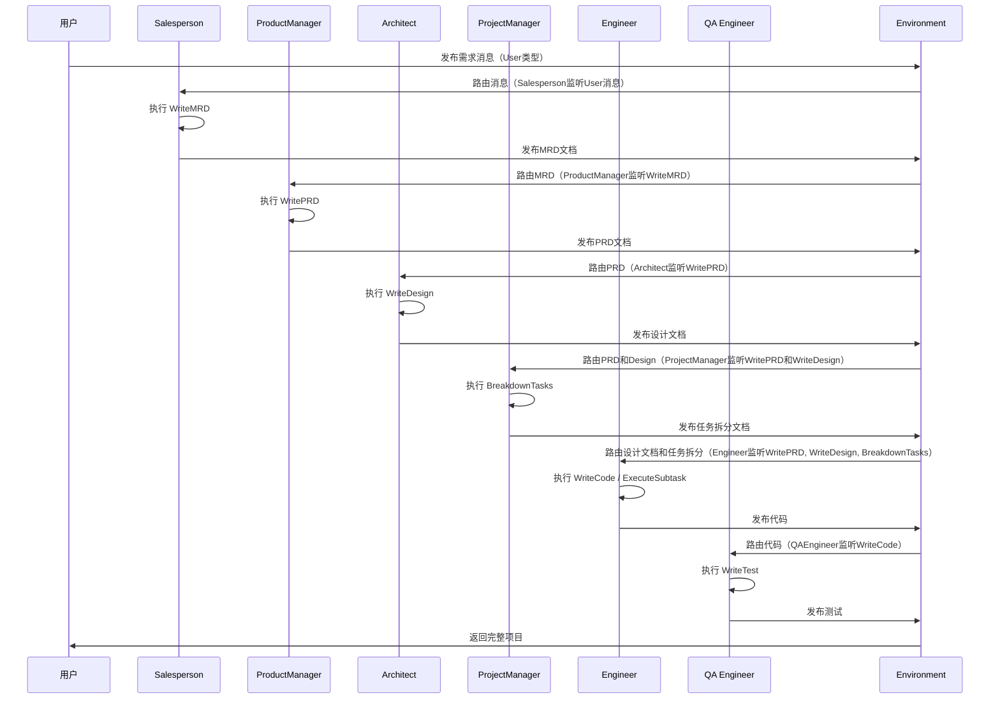
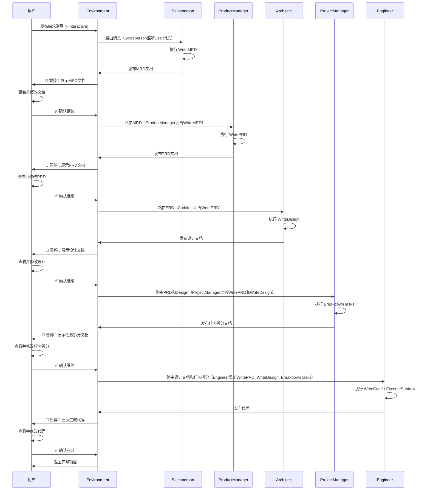
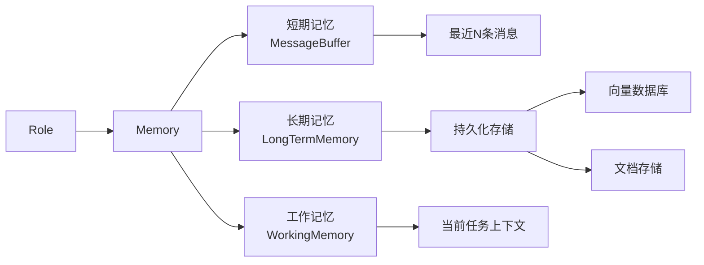
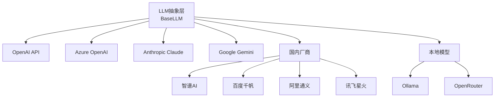

# 即思即成（Mind2Build）产品需求文档（PRD）

**Slogan**: 让所思，即所得

## 文档信息
- **产品名称**: 即思即成（Mind2Build）- 多代理协作框架
- **文档版本**: v1.0
- **创建日期**: 2025-12-24
- **产品经理**: AI Product Team
- **目标版本**: Mind2Build 1.0

---

## 1. 产品概述

### 1.1 产品定位
即思即成（Mind2Build）是一个创新的多代理（Multi-Agent）协作框架，通过让大语言模型扮演软件公司中的不同角色，实现从一行需求到完整软件项目的自动化生成。让所思即所得，将想法快速转化为现实。

**核心理念**: `Code = SOP(Team)` - 通过标准化操作流程和团队协作实现软件开发自动化。

### 1.2 产品愿景
- **短期（6个月）**: 成为最受欢迎的多代理协作框架，支持主流 LLM 提供商
- **中期（1年）**: 支持企业级应用开发，建立活跃的开发者社区
- **长期（2-3年）**: 实现完全自主的软件开发能力，推动自然语言编程普及

### 1.3 目标用户画像

#### 用户类型 A：独立开发者
- **基本信息**: 25-35岁，3-8年开发经验
- **痛点**: 重复性工作多，从想法到实现周期长
- **需求**: 快速原型开发，自动化文档生成
- **使用频率**: 每周 3-5 次

#### 用户类型 B：产品经理
- **基本信息**: 28-40岁，有技术背景优先
- **痛点**: 需求验证成本高，与开发团队沟通成本大
- **需求**: 快速需求验证，自动生成技术文档
- **使用频率**: 每周 5-10 次

#### 用户类型 C：技术团队负责人
- **基本信息**: 30-45岁，5年以上管理经验
- **痛点**: 团队效率低，代码质量不稳定
- **需求**: 标准化开发流程，自动化代码审查
- **使用频率**: 持续使用（团队级）

#### 用户类型 D：AI 研究者
- **基本信息**: 研究生/博士，关注多代理协作
- **痛点**: 缺少成熟的多代理协作框架
- **需求**: 可扩展的框架，丰富的实验环境
- **使用频率**: 每天多次

---

## 2. 核心功能需求

### 2.1 多角色代理系统 [P0 - 核心功能]

#### 功能描述
系统支持多种 AI 角色，每个角色有独特的职责、行为模式和工作流程。

#### 用户故事

**US-2.1.1 作为开发者，我想要系统自动分配合适的角色处理任务**
- **场景**: 用户输入需求后，系统自动识别需要的角色
- **验收标准**:
  - ✅ 系统能识别需求类型（开发/数据分析/研究）
  - ✅ 自动分配至少3个相关角色（PM、Architect、Engineer）
  - ✅ 角色按正确顺序工作（PM → Architect → Engineer）
- **优先级**: P0

**US-2.1.2 作为团队负责人，我想要定义自定义角色**
- **场景**: 需要特殊角色处理特定领域任务
- **验收标准**:
  - ✅ 提供清晰的角色扩展接口
  - ✅ 自定义角色能无缝集成到工作流
  - ✅ 提供角色模板和示例代码
- **优先级**: P1

#### 功能规格

##### 角色清单



##### 角色详细规格

| 角色 | 默认名称 | 核心职责 | 监听机制 | 主要 Actions | 输入 | 输出 |
|------|---------|---------|---------|-------------|------|------|
| Salesperson | Salesperson | 需求收集、市场调研、业务分析 | 监听 User 消息 | WriteMRD | 用户原始需求 | 市场研究文档（MRD） |
| ProductManager | ProductManager | PRD编写、需求分析 | 监听 WriteMRD action | WritePRD, SearchEnhancedQA | 市场研究文档（MRD） | PRD文档 |
| Architect | Architect | 系统设计、架构规划 | 监听 WritePRD action | WriteDesign | PRD文档 | 设计文档 |
| ProjectManager | ProjectManager | 任务拆分、子项目设计、任务生成 | 监听 WritePRD 和 WriteDesign actions | BreakdownTasks, WriteSubProjectDesign, GenerateTask | PRD和设计文档 | 任务拆分文档、子项目设计、任务说明 |
| Engineer | Engineer | 代码实现 | 监听 WritePRD, WriteDesign, BreakdownTasks actions | WriteCode, ExecuteSubtask | 设计文档、任务拆分 | TypeScript/JavaScript源代码 |
| QA Engineer | QAEngineer | 测试编写与执行 | 监听 WriteCode action | WriteTest | 代码 | 测试用例 |
| Data Analyst | DataAnalyst | 数据分析 | 无特定监听（独立任务） | DataAnalysis | 数据需求 | 分析代码+可视化 |
| Team Leader | TeamLeader | 协调、决策 | 监听所有广播消息 | Coordinate | 所有消息历史 | 协调结果和任务分配 |

### 2.2 标准操作流程（SOP）[P0 - 核心功能]

#### 功能描述
定义清晰的工作流程，确保角色按照标准化流程协作，支持固定 SOP 和灵活 SOP 两种模式。

#### 用户故事

**US-2.2.1 作为开发者，我想要系统按照软件公司的标准流程工作**
- **场景**: 输入"创建一个2048游戏"
- **验收标准**:
  - ✅ 自动生成 PRD（产品需求文档）
  - ✅ 自动生成系统设计文档
  - ✅ 自动生成完整可运行代码
  - ✅ 整个过程无需人工干预
- **优先级**: P0

**US-2.2.2 作为团队负责人，我想要自定义工作流程**
- **场景**: 需要特殊的开发流程（如敏捷开发）
- **验收标准**:
  - ✅ 支持自定义角色顺序
  - ✅ 支持角色跳过或循环
  - ✅ 支持条件分支
- **优先级**: P1

**US-2.2.3 作为用户，我想要在每个 SOP 节点完成后进行人工确认**
- **场景**: 在生成项目过程中，需要在每个关键节点进行审查和修改
- **验收标准**:
  - ✅ 每个角色完成任务后暂停，等待用户确认
  - ✅ 用户可以查看当前节点的输出结果
  - ✅ 用户可以修改输出内容后再继续
  - ✅ 用户可以选择"确认继续"、"修改后继续"或"跳过"
  - ✅ 支持通过 `--interactive` 或 `-i` 参数启用交互模式
  - ✅ 系统保存用户的修改历史
- **优先级**: P0

#### 工作流可视化

##### 标准模式（自动执行）


##### 交互模式（人工确认）


#### 交互模式设计

##### 用户操作选项
| 操作 | 命令 | 说明 |
|------|------|------|
| 确认继续 | `continue` / `c` | 接受当前输出，继续下一步 |
| 修改后继续 | `edit` / `e` | 打开编辑器修改输出，然后继续 |
| 重新生成 | `regenerate` / `r` | 要求当前角色重新生成 |
| 跳过节点 | `skip` / `s` | 跳过当前节点，使用现有输出 |
| 查看详情 | `view` / `v` | 查看完整输出内容 |
| 退出流程 | `quit` / `q` | 保存当前状态并退出 |

##### 启用方式
```bash
# 方式1：命令行参数
mind2build "Create a 2048 game" --interactive

# 方式2：配置文件
# config.yaml
workflow:
  mode: "interactive"  # 或 "auto"
  auto_save: true      # 自动保存每个节点的输出
```

### 2.3 消息系统 [P0 - 核心功能]

#### 功能描述
实现角色间的高效通信机制，支持消息发布/订阅、消息路由、消息历史记录。

#### 用户故事

**US-2.3.1 作为角色，我想要接收相关的消息**
- **场景**: Architect 需要接收 ProductManager 发送的 PRD
- **验收标准**:
  - ✅ 消息能准确路由到目标角色
  - ✅ 支持 send_to 指定接收者
  - ✅ 支持广播消息（MESSAGE_ROUTE_TO_ALL）
  - ✅ 支持消息订阅（_watch 机制）
- **优先级**: P0

#### 消息结构

```python
class Message:
    id: str                    # 唯一标识
    content: str               # 消息内容（自然语言）
    instruct_content: BaseModel # 结构化内容
    role: str                  # 角色类型（system/user/assistant）
    cause_by: str              # 触发的 Action
    sent_from: str             # 发送者
    send_to: set[str]          # 接收者集合
    metadata: dict             # 元数据
```

#### 消息路由规则

| 路由类型 | 发送方式 | 使用场景 |
|---------|---------|---------|
| 广播 | send_to = {MESSAGE_ROUTE_TO_ALL} | 用户初始需求 |
| 定向 | send_to = {"RoleName"} | 角色间直接通信 |
| 订阅 | _watch([ActionType]) | 监听特定 Action 输出 |
| 自发 | send_to = {MESSAGE_ROUTE_TO_SELF} | 角色内部消息 |

### 2.4 记忆系统 [P0 - 核心功能]

#### 功能描述
为角色提供上下文记忆能力，包括短期记忆（对话历史）、长期记忆（持久化知识）和工作记忆（当前任务）。

#### 用户故事

**US-2.4.1 作为角色，我想要记住之前的对话内容**
- **场景**: Engineer 需要参考 Architect 之前的设计决策
- **验收标准**:
  - ✅ 能检索最近 N 条消息
  - ✅ 能按 Action 类型过滤消息
  - ✅ 支持消息优先级排序
- **优先级**: P0

**US-2.4.2 作为系统，我想要持久化重要信息**
- **场景**: 项目中断后需要恢复工作
- **验收标准**:
  - ✅ 支持序列化整个团队状态
  - ✅ 支持从序列化状态恢复
  - ✅ 恢复后能继续之前的工作
- **优先级**: P1

#### 记忆系统架构



### 2.5 行动系统（Action System）[P0 - 核心功能]

#### 功能描述
每个角色通过执行特定的 Action 来完成任务，Action 是可重用的原子操作单元。

#### 核心 Actions 规格

| Action | 功能 | 输入 | 输出 | 使用角色 | 状态 |
|--------|------|------|------|---------|------|
| WriteMRD | 编写市场研究文档 | 用户需求 | 市场研究文档（MRD） | Salesperson | ✅ 已实现 |
| MRDReview | MRD文档审查 | MRD文档 | 审查报告 | Salesperson | ✅ 已实现 |
| WritePRD | 编写产品需求文档 | MRD或需求说明 | PRD Markdown | ProductManager | ✅ 已实现 |
| PRDReview | PRD文档审查 | PRD文档 | 审查报告 | ProductManager | ✅ 已实现 |
| ImproveDocument | 根据审查报告改进文档 | 审查报告 | 改进后的PRD/MRD | ProductManager/Salesperson | ✅ 已实现 |
| WriteDesign | 编写系统设计 | PRD | 设计文档 | Architect | ✅ 已实现 |
| DesignReview | 设计文档审查 | 设计文档 | 审查报告 | Architect | ✅ 已实现 |
| BreakdownTasks | 任务拆分 | PRD和设计文档 | 任务拆分文档 | ProjectManager | ✅ 已实现 |
| WriteSubProjectDesign | 子项目设计 | 任务拆分和设计文档 | 子项目设计文档 | ProjectManager | ✅ 已实现 |
| SubProjectDesignReview | 子项目设计审查 | 子项目设计文档 | 审查报告 | ProjectManager | ✅ 已实现 |
| GenerateTask | 生成任务说明 | 任务拆分文档 | 详细任务说明 | ProjectManager | ✅ 已实现 |
| WriteCode | 编写代码 | 设计文档 | TypeScript/JavaScript代码 | Engineer | ✅ 已实现 |
| ExecuteSubtask | 执行子任务 | 任务描述、设计文档 | 代码实现结果 | Engineer | ✅ 已实现 |
| CodeReview | 代码审查 | 代码、任务描述 | 审查报告 | ProjectManager | ✅ 已实现 |
| WriteTest | 编写测试 | 代码 | 测试代码 | QA Engineer | ✅ 已实现 |
| SearchEnhancedQA | 增强搜索 | 问题 | 答案+引用 | ProductManager | ✅ 已实现 |
| DataAnalysis | 数据分析 | 数据/需求 | 分析代码和可视化 | DataAnalyst | ✅ 已实现 |
| Coordinate | 协调任务 | 任务和上下文 | 协调结果 | TeamLeader | ✅ 已实现 |
| RunCode | 执行代码 | 代码 | 执行结果 | DataInterpreter | 🚧 计划中 |

### 2.6 工具集成 [P1 - 重要功能]

#### 功能描述
为角色提供可用的工具能力，扩展 AI 的执行能力。

#### 工具清单

| 工具 | 功能 | 使用角色 | 优先级 |
|------|------|---------|--------|
| Browser | 网页访问、搜索 | ProductManager | P1 |
| Editor | 文件读写、编辑 | All | P0 |
| Terminal | 命令执行 | Architect, Engineer | P1 |
| SearchEnhancedQA | 智能搜索问答 | ProductManager | P1 |
| CodeInterpreter | 代码执行分析 | DataInterpreter | P0 |

### 2.7 项目管理 [P0 - 核心功能]

#### 功能描述
管理生成的项目文件和结构，支持增量开发和版本控制。

#### 用户故事

**US-2.7.1 作为开发者，我想要生成的项目有清晰的目录结构**
- **验收标准**:
  - ✅ 自动创建标准目录结构（src/docs/tests）
  - ✅ 自动生成 README 和配置文件
  - ✅ 支持多语言项目结构
- **优先级**: P0

**US-2.7.2 作为开发者，我想要在已有项目上增量开发**
- **验收标准**:
  - ✅ --inc 参数启用增量模式
  - ✅ 能识别现有文件并避免覆盖
  - ✅ 只生成新增或修改的文件
- **优先级**: P1

### 2.8 成本管理 [P1 - 重要功能]

#### 功能描述
控制 AI 调用的成本，避免超支。

#### 用户故事

**US-2.8.1 作为用户，我想要设置预算上限**
- **验收标准**:
  - ✅ --investment 参数设置预算
  - ✅ 实时追踪 Token 使用量
  - ✅ 超预算时停止运行并提示
- **优先级**: P1

### 2.9 多 LLM 支持 [P0 - 核心功能]

#### 支持的 LLM 提供商



#### 配置示例

```yaml
llm:
  api_type: "openai"  # 或 azure/anthropic/gemini/zhipuai等
  model: "gpt-4-turbo"
  base_url: "https://api.openai.com/v1"
  api_key: "YOUR_API_KEY"
```

### 2.10 数据解释器 [P1 - 特色功能]

#### 功能描述
专门用于数据分析任务的特殊角色，支持数据处理、可视化和结果解释。

#### 用户故事

**US-2.10.1 作为数据分析师，我想要用自然语言进行数据分析**
- **场景**: "分析 Iris 数据集并绘图"
- **验收标准**:
  - ✅ 自动加载数据集
  - ✅ 生成分析代码
  - ✅ 执行代码并展示结果
  - ✅ 生成可视化图表
- **优先级**: P1

---

## 3. 非功能性需求

### 3.1 性能要求

| 指标 | 目标值 | 优先级 |
|------|--------|--------|
| 单项目生成时间 | < 10分钟 | P0 |
| LLM 响应时间 | < 30秒 | P1 |
| 并发角色数 | >= 5 | P0 |
| Token 使用效率 | 优化20%（vs 基线） | P1 |

### 3.2 可扩展性要求

- ✅ 支持自定义角色（提供基类和接口）
- ✅ 支持自定义 Action（提供注册机制）
- ✅ 支持自定义工作流（提供配置方式）
- ✅ 支持插件机制（预留扩展点）

### 3.3 可靠性要求

- ✅ LLM 调用失败自动重试（最多3次）
- ✅ 项目状态可序列化和恢复
- ✅ 完善的错误日志记录
- ✅ 异常情况优雅降级

### 3.4 易用性要求

- ✅ 提供 CLI 命令行界面
- ✅ 支持 Python API 调用
- ✅ 配置文件管理（YAML格式）
- ✅ 详细的错误提示信息
- ✅ 支持交互模式和自动模式切换
- ✅ 提供友好的交互式提示界面
- ✅ 支持状态保存和恢复（中断后可继续）

### 3.5 兼容性要求

- **后端**: Node.js v18+ + TypeScript v5.3+
- **前端**: Vue 3 + Vite + TypeScript
- **数据库**: PostgreSQL v14+
- **包管理**: pnpm v8+
- **操作系统**: Linux, macOS, Windows

---

## 4. 产品路线图

### 里程碑 M1: MVP 版本 (已完成)
- ✅ 基础角色系统（PM、Architect、Engineer）
- ✅ 简单工作流
- ✅ OpenAI 集成
- ✅ CLI 界面

### 里程碑 M2: 稳定版本 (当前)
- ✅ 完整角色系统
- ✅ 多 LLM 支持
- ✅ 增量开发
- ✅ 数据解释器
- ⏳ 交互式确认模式

### 里程碑 M3: 增强版本 (规划中)
- ⏳ Web UI 界面
- ⏳ 实时协作
- ⏳ 更多编程语言支持
- ⏳ 企业级功能

### 里程碑 M4: 生态版本 (远期)
- ⏳ 插件市场
- ⏳ 社区角色库
- ⏳ 持续学习能力
- ⏳ 多模态支持

---

## 5. 成功指标

### 5.1 功能完整性指标
- 所有 P0 功能 100% 实现
- 所有 P1 功能 80% 实现
- 核心工作流成功率 > 90%

### 5.2 质量指标
- 生成代码可运行率 > 85%
- 生成文档完整性 > 95%
- 用户满意度 > 4.0/5.0

### 5.3 性能指标
- 平均项目生成时间 < 10分钟
- Token 使用成本 < $5/项目
- 系统稳定性 > 99%

### 5.4 增长指标
- GitHub Stars > 50k (已达成)
- 月活跃用户 > 10k
- 社区贡献者 > 200

---

## 6. 风险与依赖

### 6.1 技术风险
| 风险 | 影响 | 概率 | 缓解措施 |
|------|------|------|---------|
| LLM API 不稳定 | 高 | 中 | 多提供商支持，自动重试 |
| 生成代码质量不稳定 | 高 | 高 | 代码审查机制，测试验证 |
| Token 成本过高 | 中 | 中 | 成本控制，提示词优化 |

### 6.2 业务风险
| 风险 | 影响 | 概率 | 缓解措施 |
|------|------|------|---------|
| 用户期望过高 | 中 | 高 | 明确能力边界，设置预期 |
| 竞争压力 | 中 | 中 | 持续创新，建立生态 |

### 6.3 外部依赖
- OpenAI/Anthropic/Google API 稳定性
- Node.js 和 pnpm 环境
- 开源社区支持

---

## 7. 验收标准

### 7.1 基本验收标准
- [ ] 所有 P0 功能正常工作
- [ ] 核心工作流端到端测试通过
- [ ] 文档完整且准确
- [ ] 所有单元测试通过（覆盖率 > 70%）
- [ ] 交互模式和自动模式都能正常运行
- [ ] 交互模式下用户修改能正确传递到下一节点

### 7.2 场景验收标准

#### 场景1: 创建新项目
```bash
mind2build "Create a 2048 game"
```
**预期输出**:
- PRD.md
- 系统设计文档
- 完整可运行的游戏代码
- README.md
- 总时间 < 10分钟

#### 场景2: 数据分析
```python
di = DataInterpreter()
await di.run("Run data analysis on sklearn Iris dataset, include a plot")
```
**预期输出**:
- 数据加载代码
- 分析结果
- 可视化图表（PNG）

#### 场景3: 增量开发
```bash
mind2build "Add user login feature" --inc --project-path ./game_2048
```
**预期输出**:
- 更新的设计文档
- 新增的登录功能代码
- 保留原有文件

#### 场景4: 交互模式开发
```bash
mind2build "Create a todo app with backend API" --interactive
```
**预期交互流程**:
```
[Salesperson] 完成市场研究文档（MRD）
📄 生成文件: MRD.md
━━━━━━━━━━━━━━━━━━━━━━━━━━━━━━━━━━━━━━
🛑 等待确认 (continue/edit/regenerate/skip/quit):
> c

[ProductManager] 完成PRD文档
📄 生成文件: PRD.md
━━━━━━━━━━━━━━━━━━━━━━━━━━━━━━━━━━━━━━
🛑 等待确认 (continue/edit/regenerate/skip/quit):
> e  # 用户选择编辑
[编辑器打开 PRD.md，用户修改后保存]
✅ 已保存修改，继续下一步

[Architect] 完成系统设计文档
📄 生成文件: DESIGN.md
━━━━━━━━━━━━━━━━━━━━━━━━━━━━━━━━━━━━━━
🛑 等待确认 (continue/edit/regenerate/skip/quit):
> c

[ProjectManager] 完成任务拆分文档
📄 生成文件: TASK_BREAKDOWN.md
━━━━━━━━━━━━━━━━━━━━━━━━━━━━━━━━━━━━━━
🛑 等待确认 (continue/edit/regenerate/skip/quit):
> c

[Engineer] 完成代码实现
📄 生成文件: src/index.ts, src/api.ts
━━━━━━━━━━━━━━━━━━━━━━━━━━━━━━━━━━━━━━
🛑 等待确认 (continue/edit/regenerate/skip/quit):
> c

[QAEngineer] 完成测试用例
📄 生成文件: tests/index.test.ts
━━━━━━━━━━━━━━━━━━━━━━━━━━━━━━━━━━━━━━
🛑 等待确认 (continue/edit/regenerate/skip/quit):
> c

✅ 项目生成完成！
```

---

## 8. 附录

### 8.1 术语表
- **SOP**: Standard Operating Procedure（标准操作流程）
- **PRD**: Product Requirement Document（产品需求文档）
- **Multi-Agent**: 多代理系统
- **LLM**: Large Language Model（大语言模型）
- **Token**: LLM 计算单位

### 8.2 参考资料
- [mind2build 论文](https://openreview.net/forum?id=VtmBAGCN7o)
- [官方文档](https://docs.deepwisdom.ai/)
- [GitHub 仓库](https://github.com/geekan/mind2build)

---

**文档状态**: ✅ 已批准
**下一步行动**: 进入技术规格设计阶段

