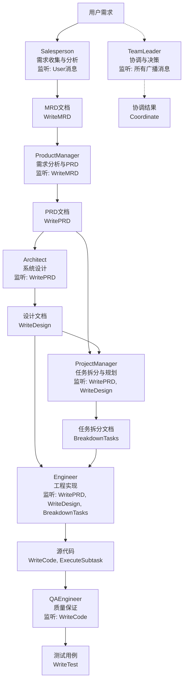
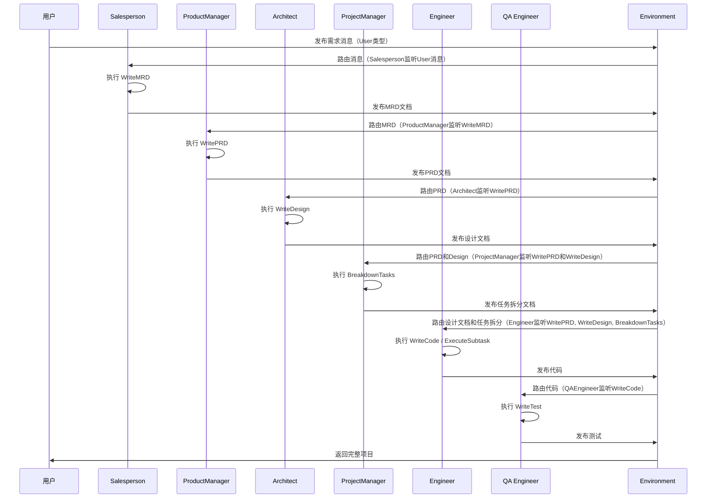
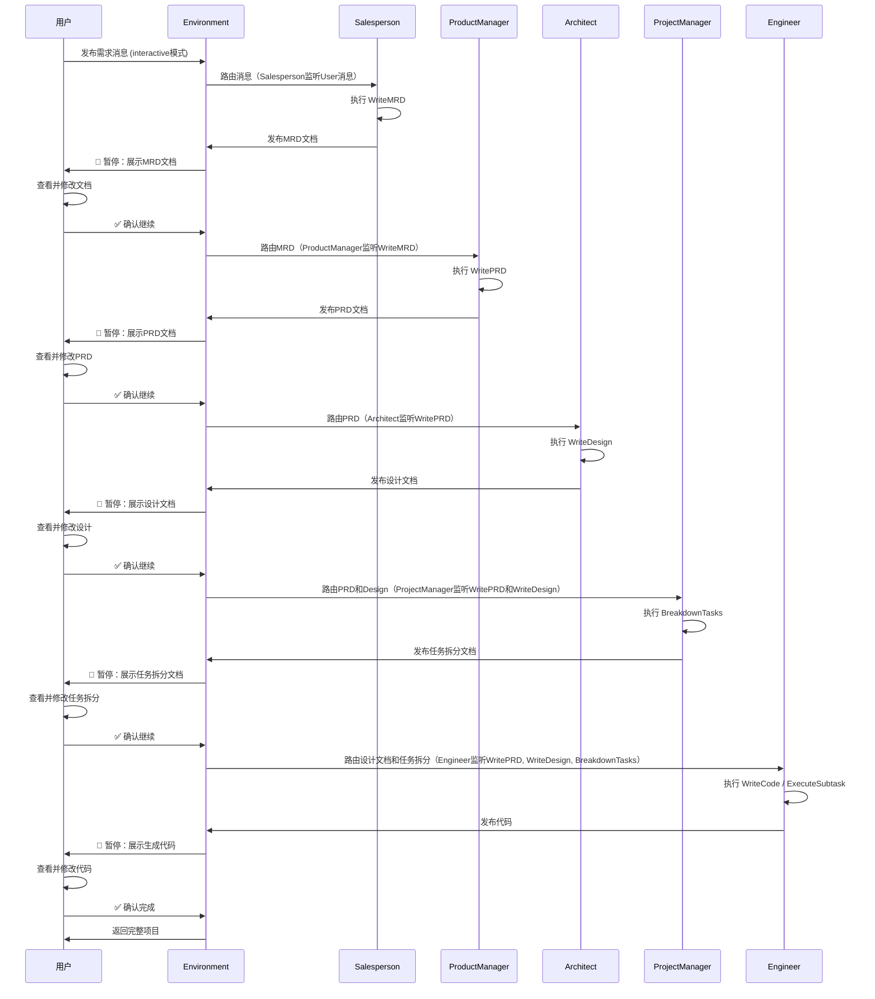
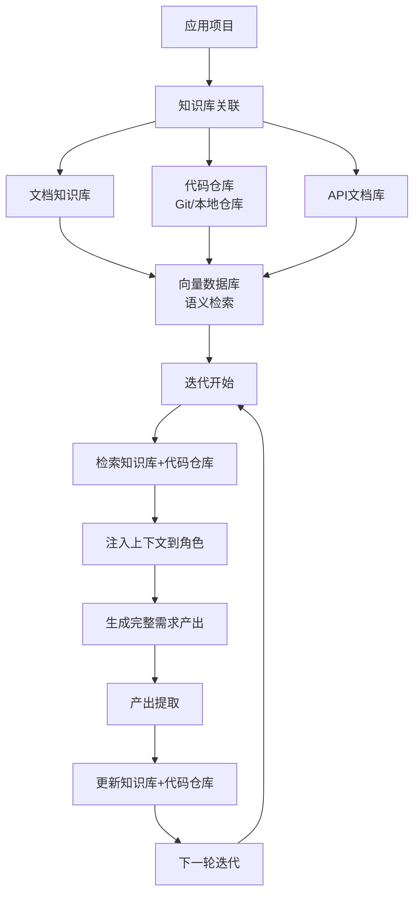
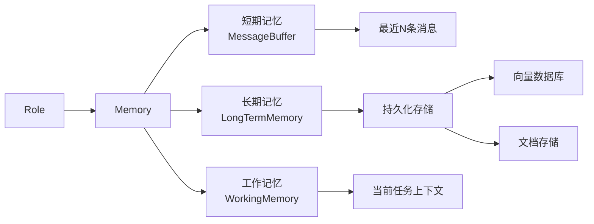
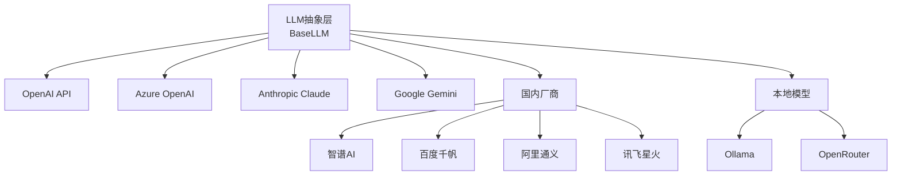

# 即思即成（Mind2Build）产品需求文档（PRD）

**Slogan**: 让所思，即所得

## 文档信息
- **产品名称**: 即思即成（Mind2Build）- 多代理协作框架
- **文档版本**: v1.3
- **创建日期**: 2025-12-24
- **最后更新**: 2026-01-21
- **产品经理**: AI Product Team
- **目标版本**: Mind2Build 1.2

---

## 1. 产品概述

### 1.1 产品定位
即思即成（Mind2Build）是一个创新的多代理（Multi-Agent）协作框架，通过让大语言模型扮演软件公司中的不同角色，实现从一行需求到完整软件项目的自动化生成。让所思即所得，将想法快速转化为现实。

**核心理念**: `Code = SOP(Team)` - 通过标准化操作流程和团队协作实现软件开发自动化。

**核心能力**:
1. **多角色系统**: 快速上手并自主定制新角色和新角色对应的工作流，满足不同场景和领域的个性化需求
2. **知识库系统**: 针对应用下的项目，支持关联对应的知识库和代码仓库，通过RAG技术确保完整迭代来需求的产出，每次迭代都能参考历史知识和代码实现，生成高质量、完整的产出

### 1.2 产品愿景
- **短期（6个月）**: 成为最受欢迎的多代理协作框架，支持主流 LLM 提供商
- **中期（1年）**: 支持企业级应用开发，建立活跃的开发者社区
- **长期（2-3年）**: 实现完全自主的软件开发能力，推动自然语言编程普及
---

## 2. 核心功能需求

### 2.1 多角色代理系统 [P0 - 核心功能]

#### 功能描述
系统支持多种 AI 角色，每个角色有独特的职责、行为模式和工作流程。系统提供快速上手的能力，同时支持用户自主定制新角色和对应的工作流，满足不同场景和领域的个性化需求。

#### 核心特性
- **开箱即用**: 内置7个标准角色（Salesperson、ProductManager、Architect、ProjectManager、Engineer、QAEngineer、TeamLeader），覆盖软件开发的完整流程
- **快速定制**: 提供简洁的角色定义接口，5分钟内即可创建并部署一个新角色
- **工作流编排**: 支持可视化工作流设计，灵活配置角色间的协作关系和执行顺序
- **模板库**: 提供丰富的角色模板和工作流模板，覆盖常见业务场景
- **独立可调试**: 每个角色支持独立运行、测试和调试，提供完整的调试工具和监控能力

#### 用户故事

**US-2.1.1 作为开发者，我想要系统自动分配合适的角色处理任务**
- **场景**: 用户输入需求后，系统自动识别需要的角色
- **验收标准**:
  - ✅ 系统能识别需求类型（开发/研究）
  - ✅ 自动分配至少3个相关角色（PM、Architect、Engineer）
  - ✅ 角色按正确顺序工作（PM → Architect → Engineer）
- **优先级**: P0

**US-2.1.2 作为开发者，我想要快速创建一个自定义角色**
- **场景**: 需要创建一个专门处理前端UI设计的角色
- **验收标准**:
  - ✅ 提供简洁的角色定义接口（YAML或TypeScript）
  - ✅ 5分钟内完成角色创建和部署
  - ✅ 提供角色模板和示例代码
  - ✅ 支持角色能力定义（Actions、监听机制、提示词）
  - ✅ 新角色能立即在工作流中使用
- **优先级**: P0

**US-2.1.3 作为团队负责人，我想要自定义工作流**
- **场景**: 需要为特定项目定制专属的工作流程
- **验收标准**:
  - ✅ 支持可视化工作流设计器
  - ✅ 支持自定义角色顺序和执行条件
  - ✅ 支持角色跳过、循环和条件分支
  - ✅ 支持工作流模板的保存和复用
  - ✅ 工作流变更后能立即生效
- **优先级**: P0

**US-2.1.6 作为开发者，我想要创建多角色直接串联的自定义工作流**
- **场景**: 需要将多个角色直接串联，自定义它们的执行顺序和输入输出映射
- **验收标准**:
  - ✅ 支持将多个角色直接串联，形成线性或分支工作流
  - ✅ 支持调整角色的执行顺序（拖拽排序或配置）
  - ✅ 支持自定义角色间的输入输出映射关系
  - ✅ 支持指定每个角色的输入来源（前一个角色的输出、用户输入、固定值等）
  - ✅ 支持指定每个角色的输出目标（下一个角色、用户、存储等）
  - ✅ 支持可视化编辑输入输出映射关系
  - ✅ 支持验证工作流的完整性和正确性
- **优先级**: P0

**US-2.1.4 作为开发者，我想要复用和分享自定义角色和工作流**
- **场景**: 团队内部共享最佳实践
- **验收标准**:
  - ✅ 支持角色和工作流的导入/导出
  - ✅ 支持角色模板市场（可选）
  - ✅ 支持版本管理和回滚
- **优先级**: P1

**US-2.1.5 作为开发者，我想要独立调试每个角色**
- **场景**: 在集成到工作流之前，单独测试和调试某个角色的功能
- **验收标准**:
  - ✅ 支持单独运行某个角色，不依赖其他角色
  - ✅ 提供角色级别的调试接口和工具
  - ✅ 支持模拟输入和输出，验证角色行为
  - ✅ 提供详细的调试日志和性能监控
  - ✅ 支持断点调试和单步执行
  - ✅ 支持角色单元测试框架
- **优先级**: P0

#### 功能规格

##### Role类实现架构

Role类采用模块化设计，将职责分离到不同的组件中，提供清晰的职责划分和易于扩展的架构：

**核心组件**：

1. **RoleActionExecutor（行动执行器）**
   - **职责**: 处理action执行逻辑，包括输入准备、执行和状态管理
   - **核心功能**:
     - 支持workspace options的actions列表（WriteMRD, WritePRD, WriteDesign等15个actions）
     - 特殊输入处理：
       - `WriteTest`: 自动从memory中获取PRD文档，组合PRD和代码作为输入
       - `MRDReview/PRDReview`: 从news或memory中查找对应的文档内容
       - `ImprovePRD/ImproveMRD`: 从news或memory中查找审查报告
       - `BreakdownTasks`: 从memory中获取WritePRD和WriteDesign的消息
       - `GenerateTask`: 从memory中获取BreakdownTasks和WriteSubProjectDesign的消息
     - 序列继续处理（BY_ORDER模式）：action执行完成后，如果还有更多actions，清除todo但保留news供下一个action使用
     - 状态管理：action执行前设置为RUNNING，成功完成设置为COMPLETED，失败设置为FAILED（不清理news，允许重试）

2. **RoleThinker（思考决策器）**
   - **职责**: 处理角色决策逻辑，决定下一步要执行的action
   - **支持的React模式**:
     - **BY_ORDER**: 按顺序执行actions，支持序列继续
     - **REACT**: LLM动态决策（MVP阶段使用简单逻辑）
     - **PLAN_AND_ACT**: 先计划后执行（MVP阶段类似BY_ORDER）
   - **状态管理**: state=-1表示初始/终止状态，state>=0表示正在执行序列中的某个action

3. **RoleLLMConfig（LLM配置管理器）**
   - **职责**: 管理角色的LLM配置，支持从数据库加载角色特定配置
   - **配置优先级**:
     1. 数据库配置（角色特定，最高优先级）- 从`role_llm_configs`表加载
     2. 显式配置（构造函数传入的config.llm）
     3. 默认配置（系统默认的context.llm，最低优先级）
   - **功能特性**:
     - 异步加载数据库配置（不阻塞角色初始化）
     - 自动更新actions的LLM实例
     - 支持fallback到active LLM config（如果角色特定配置不存在）

4. **RoleWorkspaceExtractor（工作区选项提取器）**
   - **职责**: 从消息和上下文中提取workspace选项
   - **提取策略**:
     1. 从`rc.news`中查找消息的`instructContent`
     2. 从`rc.memory`中查找WritePRD、WriteDesign、WriteMRD的消息
     3. 解析`workspaceDir`路径（支持新格式和旧格式）
     4. Fallback到context中的applicationId和projectId
   - **支持的路径格式**:
     - 新格式: `workspace/{applicationId}/{projectId}/v{version}/{documentType}/`
     - 旧格式: `workspace/{applicationId}/v{version}/{documentType}/`
     - 遗留格式: `{applicationId}-v{version}-{documentType}`
   - **文档类型映射**: 自动根据action名称映射到对应的文档类型（MRD, PRD, DESIGN, TASKS, CODE, TEST）

**状态管理**：

- **RoleStatus（角色状态）**:
  - `IDLE`: 空闲状态
  - `PENDING`: 有待执行的任务
  - `RUNNING`: 正在执行action
  - `FAILED`: 执行失败

- **ActionStatus（Action状态）**:
  - `PENDING`: 待执行
  - `RUNNING`: 执行中
  - `COMPLETED`: 已完成
  - `FAILED`: 执行失败

- **状态转换流程**:
  ```
  IDLE -> PENDING (think()选择action) 
    -> RUNNING (act()开始执行)
      -> IDLE (执行完成) 或 FAILED (执行失败)
  ```

##### 角色清单



##### 角色详细规格

| 角色 | 默认名称 | 核心职责 | 监听机制 | 主要 Actions | 输入 | 输出 |
|------|---------|---------|---------|-------------|------|------|
| Salesperson | Salesperson | 需求收集、市场调研、业务分析 | 监听 User 消息 | WriteMRD, MRDReview, ImproveMRD | 用户原始需求 | 市场研究文档（MRD） |
| ProductManager | ProductManager | PRD编写、需求分析 | 监听 WriteMRD action | WritePRD, PRDReview, ImprovePRD, SearchEnhancedQA | 市场研究文档（MRD） | PRD文档 |
| Architect | Architect | 系统设计、架构规划 | 监听 WritePRD action | WriteDesign, DesignReview, ImproveDesign | PRD文档 | 设计文档 |
| ProjectManager | ProjectManager | 任务拆分、子项目设计 | 监听 WritePRD 和 WriteDesign actions | BreakdownTasks, WriteSubProjectDesign, SubProjectDesignReview | PRD和设计文档 | 任务拆分文档、子项目设计 |
| Engineer | Engineer | 代码实现、执行和修复 | 监听 WritePRD, WriteDesign, BreakdownTasks actions | WriteCode, ExecuteSubtask, RunCode, FixBug | 设计文档、任务拆分 | TypeScript/JavaScript源代码 |
| QA Engineer | QAEngineer | 完整 QA 工作流执行 | 监听 WritePRD 和 WriteCode actions | TestabilityReview, WriteTestPlan, WriteTest, TestCaseReview, AutomationPlanning, AutomationExecution, CoverageQualityCheck, QAConclusion | PRD和代码 | 测试计划、测试用例、QA结论报告 |
| Team Leader | TeamLeader | 协调、决策 | 监听所有广播消息 | Coordinate | 所有消息历史 | 协调结果和任务分配 |

#### 角色定制能力

##### 快速创建角色
系统提供简洁的角色定义接口，支持通过YAML配置文件或TypeScript类快速创建新角色：

**方式1: YAML配置（推荐，适合简单角色）**
```yaml
# roles/ui-designer.yaml
name: UIDesigner
displayName: UI设计师
description: 负责UI/UX设计和原型制作
actions:
  - CreateWireframe
  - DesignUI
  - CreatePrototype
watch:
  - WritePRD
prompt: |
  你是一位资深的UI/UX设计师，擅长...
```

**方式2: TypeScript类（适合复杂角色）**
```typescript
// roles/UIDesigner.ts
import { IRoleConfig } from '@mind2build/shared';
import { Role } from './Role';
import { Context } from '../core/context/Context';
import { CreateWireframe, DesignUI, CreatePrototype } from '../actions';
import { ACTION_WRITE_PRD } from '@mind2build/shared';

export class UIDesigner extends Role {
  constructor(context: Context, name: string = 'UIDesigner') {
    const config: IRoleConfig = {
      name,
      profile: 'UI设计师',
      goal: '负责UI/UX设计和原型制作',
      constraints: '遵循设计规范，确保用户体验',
      description: '我是一名资深的UI/UX设计师，擅长...',
      // 可选：为角色配置特定的LLM
      // llm: { provider: 'openai', model: 'gpt-4' }
    };
    
    super(config, context);
    
    // Watch for specific actions
    this.watch([ACTION_WRITE_PRD]);
    
    // Set actions
    this.setActions([
      new CreateWireframe(),
      new DesignUI(),
      new CreatePrototype()
    ]);
  }
  
  // 可选：重写act()方法实现自定义行为
  // async act(): Promise<Message | null> {
  //   // Custom implementation
  // }
}
```

##### 角色独立调试能力

每个角色都支持独立运行、测试和调试，无需依赖完整的工作流：

**角色调试接口**
```typescript
// 角色调试API
POST /api/v1/role/debug
{
  "roleName": "ProductManager",
  "input": {
    "mrd": "...",
    "context": {...}
  },
  "options": {
    "breakpoints": ["WritePRD"],
    "verbose": true,
    "saveLogs": true
  }
}

// 获取角色调试日志
GET /api/v1/role/{roleName}/logs?sessionId={sessionId}

// 获取角色性能指标
GET /api/v1/role/{roleName}/metrics?sessionId={sessionId}
```

**角色单元测试**
```typescript
// roles/tests/ProductManager.test.ts
import { ProductManager } from '../ProductManager';
import { testRole } from '@/testing/RoleTester';

describe('ProductManager', () => {
  test('should generate PRD from MRD', async () => {
    const role = new ProductManager();
    const input = {
      mrd: '...',
      context: {...}
    };
    
    const result = await testRole(role, input, {
      expectedActions: ['WritePRD'],
      validateOutput: (output) => {
        expect(output).toHaveProperty('prd');
        expect(output.prd).toContain('产品需求');
      }
    });
    
    expect(result.success).toBe(true);
  });
});
```

**调试工具特性**
- **独立执行**: 每个角色可以独立运行，不依赖其他角色或工作流
- **输入模拟**: 支持模拟各种输入场景（消息、文档、上下文等）
- **输出验证**: 支持验证角色输出的格式和内容
- **断点调试**: 支持在特定Action处设置断点，暂停执行
- **单步执行**: 支持逐步执行角色的思考和行为过程
- **日志记录**: 详细记录角色的思考过程、Action执行、LLM调用等
- **性能监控**: 监控角色的执行时间、Token使用、API调用次数等
- **错误追踪**: 记录和追踪角色执行过程中的错误和异常
- **可视化调试**: 提供Web界面可视化角色的执行流程和状态

**调试模式配置**
```yaml
# debug-config.yaml
role: ProductManager
mode: debug
options:
  breakpoints:
    - WritePRD
    - SearchEnhancedQA
  verbose: true
  logLevel: debug
  saveLogs: true
  metrics:
    - executionTime
    - tokenUsage
    - apiCalls
  visualization: true
```

##### 工作流定制能力

系统支持通过可视化界面或配置文件定义工作流，支持多角色直接串联，灵活调整执行顺序和输入输出映射：

**多角色串联工作流配置示例**
```yaml
# workflows/multi-role-chain.yaml
name: 多角色串联工作流
description: 自定义多角色直接串联，支持调整顺序和输入输出
version: "1.0"

# 工作流定义
workflow:
  # 角色串联配置
  chain:
    # 第一个角色：ProductManager
    - id: step1
      role: ProductManager
      actions: [WritePRD]
      input:
        # 输入来源：用户输入
        source: user
        mapping:
          idea: ${user.idea}
          context: ${user.context}
      output:
        # 输出目标：下一个角色
        target: step2
        mapping:
          prd: ${output.prd}
          metadata: ${output.metadata}
    
    # 第二个角色：Architect
    - id: step2
      role: Architect
      actions: [WriteDesign]
      input:
        # 输入来源：前一个角色的输出
        source: step1
        mapping:
          prd: ${step1.output.prd}
          requirements: ${step1.output.metadata.requirements}
      output:
        target: step3
        mapping:
          design: ${output.design}
          architecture: ${output.architecture}
    
    # 第三个角色：Engineer
    - id: step3
      role: Engineer
      actions: [WriteCode]
      input:
        # 输入来源：多个前序角色的输出
        source: [step1, step2]
        mapping:
          prd: ${step1.output.prd}
          design: ${step2.output.design}
          architecture: ${step2.output.architecture}
      output:
        # 输出目标：用户和存储
        target: [user, storage]
        mapping:
          code: ${output.code}
          files: ${output.files}
    
    # 第四个角色：QAEngineer（可选，条件执行）
    - id: step4
      role: QAEngineer
      actions: [WriteTest]
      condition: ${step3.output.code} != null
      input:
        source: step3
        mapping:
          code: ${step3.output.code}
          design: ${step2.output.design}
      output:
        target: user
        mapping:
          tests: ${output.tests}
```

**输入输出映射配置详解**

系统支持灵活的输入输出映射配置：

**输入来源类型**
- `user`: 用户输入
- `step{id}`: 前一个步骤的输出
- `[step1, step2]`: 多个步骤的输出合并
- `constant`: 固定值
- `storage`: 从存储中读取
- `api`: 从外部API获取

**输出目标类型**
- `step{id}`: 传递给下一个步骤
- `user`: 返回给用户
- `storage`: 保存到存储
- `api`: 发送到外部API
- `[step1, user]`: 同时传递给多个目标

**高级映射示例**
```yaml
# 复杂输入输出映射
- id: step5
  role: ProjectManager
  input:
    source: [step1, step2, step3]
    # 支持数据转换和合并
    mapping:
      # 直接映射
      prd: ${step1.output.prd}
      design: ${step2.output.design}
      # 数据转换
      combined_context: |
        PRD: ${step1.output.prd}
        Design: ${step2.output.design}
        Code: ${step3.output.code}
      # 条件映射
      priority: ${step1.output.metadata.priority || 'normal'}
      # 数组合并
      all_requirements: ${step1.output.requirements + step2.output.requirements}
  output:
    target: [step6, storage]
    mapping:
      tasks: ${output.tasks}
      # 分别映射到不同目标
      tasks_for_next: ${output.tasks}
      tasks_for_storage: ${output.tasks | json}
```

**工作流可视化设计器**

系统提供强大的可视化工作流设计器，支持：

**可视化编辑功能**
- **拖拽式界面**: 直观拖拽角色节点，快速构建工作流
- **连线编辑**: 通过连线直观配置角色间的输入输出关系
- **顺序调整**: 支持拖拽调整角色执行顺序
- **输入输出映射编辑**: 可视化编辑每个角色的输入来源和输出目标
- **数据映射预览**: 实时预览数据在角色间的流转和转换

**工作流验证**
- **完整性检查**: 自动检查工作流的完整性，确保所有输入都有来源
- **循环检测**: 检测并提示工作流中的循环依赖
- **类型验证**: 验证输入输出数据的类型匹配
- **执行预览**: 预览工作流的执行顺序和数据流转

**工作流管理**
- **版本控制**: 支持工作流版本的保存和管理
- **模板库**: 支持工作流模板的保存和复用
- **导入导出**: 支持工作流的导入和导出（YAML/JSON格式）
- **实时生效**: 工作流变更后能立即生效，无需重启

**API使用示例**
```typescript
// 创建多角色串联工作流
POST /api/v1/workflow/create
{
  "name": "自定义串联工作流",
  "description": "ProductManager -> Architect -> Engineer",
  "chain": [
    {
      "id": "step1",
      "role": "ProductManager",
      "actions": ["WritePRD"],
      "input": {
        "source": "user",
        "mapping": {
          "idea": "${user.idea}"
        }
      },
      "output": {
        "target": "step2",
        "mapping": {
          "prd": "${output.prd}"
        }
      }
    },
    {
      "id": "step2",
      "role": "Architect",
      "actions": ["WriteDesign"],
      "input": {
        "source": "step1",
        "mapping": {
          "prd": "${step1.output.prd}"
        }
      },
      "output": {
        "target": "step3",
        "mapping": {
          "design": "${output.design}"
        }
      }
    },
    {
      "id": "step3",
      "role": "Engineer",
      "actions": ["WriteCode"],
      "input": {
        "source": ["step1", "step2"],
        "mapping": {
          "prd": "${step1.output.prd}",
          "design": "${step2.output.design}"
        }
      },
      "output": {
        "target": "user",
        "mapping": {
          "code": "${output.code}"
        }
      }
    }
  ]
}

// 执行自定义工作流
POST /api/v1/workflow/execute
{
  "workflowId": "workflow-123",
  "input": {
    "idea": "Create a todo app"
  }
}

// 调整工作流顺序
PUT /api/v1/workflow/{workflowId}/reorder
{
  "stepOrder": ["step1", "step3", "step2"]  // 调整执行顺序
}

// 更新输入输出映射
PUT /api/v1/workflow/{workflowId}/mapping
{
  "stepId": "step2",
  "input": {
    "source": "step1",
    "mapping": {
      "prd": "${step1.output.prd}",
      "additional_context": "${step1.output.metadata}"
    }
  },
  "output": {
    "target": ["step3", "user"],
    "mapping": {
      "design": "${output.design}"
    }
  }
}
```

### 2.2 标准操作流程（SOP）[P0 - 核心功能]

#### 功能描述
定义清晰的工作流程，确保角色按照标准化流程协作，支持固定 SOP 和灵活 SOP 两种模式。

#### 用户故事

**US-2.2.1 作为开发者，我想要系统按照软件公司的标准流程工作**
- **场景**: 输入"创建一个2048游戏"
- **验收标准**:
  - ✅ 自动生成 PRD（产品需求文档）
  - ✅ 自动生成系统设计文档
  - ✅ 自动生成完整可运行代码
  - ✅ 整个过程无需人工干预
- **优先级**: P0

**US-2.2.2 作为团队负责人，我想要自定义工作流程**
- **场景**: 需要特殊的开发流程（如敏捷开发）
- **验收标准**:
  - ✅ 支持自定义角色顺序
  - ✅ 支持角色跳过或循环
  - ✅ 支持条件分支
- **优先级**: P1

**US-2.2.3 作为用户，我想要在每个 SOP 节点完成后进行人工确认**
- **场景**: 在生成项目过程中，需要在每个关键节点进行审查和修改
- **验收标准**:
  - ✅ 每个角色完成任务后暂停，等待用户确认
  - ✅ 用户可以查看当前节点的输出结果
  - ✅ 用户可以修改输出内容后再继续
  - ✅ 用户可以选择"确认继续"、"修改后继续"或"跳过"
  - ✅ 支持通过配置或API参数启用交互模式
  - ✅ 系统保存用户的修改历史
- **优先级**: P0

#### 工作流可视化

##### 标准模式（自动执行）


##### 交互模式（人工确认）


#### 交互模式设计

##### 用户操作选项
| 操作 | 命令 | 说明 |
|------|------|------|
| 确认继续 | `continue` / `c` | 接受当前输出，继续下一步 |
| 修改后继续 | `edit` / `e` | 打开编辑器修改输出，然后继续 |
| 重新生成 | `regenerate` / `r` | 要求当前角色重新生成 |
| 跳过节点 | `skip` / `s` | 跳过当前节点，使用现有输出 |
| 查看详情 | `view` / `v` | 查看完整输出内容 |
| 退出流程 | `quit` / `q` | 保存当前状态并退出 |

##### 启用方式
```yaml
# config.yaml
workflow:
  mode: "interactive"  # 或 "auto"
  auto_save: true      # 自动保存每个节点的输出
```

### 2.3 知识库系统 [P0 - 核心功能]

#### 功能描述
针对应用下的项目，支持关联对应的知识库和代码仓库，通过RAG（检索增强生成）技术为角色提供上下文知识支持，确保完整迭代来需求的产出。知识库系统让AI角色能够参考历史项目、最佳实践、代码仓库等知识，在每次迭代中生成更符合实际需求的高质量产出，并持续优化和完善。

#### 核心特性
- **项目级知识库**: 每个应用下的项目可以关联专属的知识库和代码仓库
- **多源知识整合**: 支持文档知识库、代码仓库、API文档、设计规范等多种知识源
- **代码仓库关联**: 支持关联Git仓库或本地代码仓库，提供完整的代码结构、实现模式和代码风格参考
- **智能检索**: 基于向量数据库的语义检索，精准匹配相关知识，支持代码片段的语义检索
- **完整迭代产出**: 在每次迭代中，角色能够参考知识库和代码仓库，生成完整、准确的需求产出
- **迭代增强**: 每次迭代完成后自动更新知识库，将产出内容纳入知识库，持续优化后续迭代质量

#### 用户故事

**US-2.3.1 作为开发者，我想要为项目关联知识库**
- **场景**: 创建新项目时，关联公司的技术规范和最佳实践知识库
- **验收标准**:
  - ✅ 支持在项目创建时指定知识库
  - ✅ 支持多个知识库的关联（文档库、代码库、API文档等）
  - ✅ 知识库变更后能自动同步到项目
  - ✅ 支持知识库的版本管理
- **优先级**: P0

**US-2.3.2 作为角色，我想要在生成内容时参考知识库**
- **场景**: Architect在设计系统架构时，参考知识库中的架构模式和最佳实践
- **验收标准**:
  - ✅ 角色执行Action时自动检索相关知识
  - ✅ 检索结果自动注入到角色上下文中
  - ✅ 支持检索结果的引用和溯源
  - ✅ 检索结果按相关性排序
- **优先级**: P0

**US-2.3.3 作为开发者，我想要关联代码仓库作为参考**
- **场景**: Engineer在编写代码时，参考现有代码仓库的代码结构、实现模式和代码风格
- **验收标准**:
  - ✅ 支持关联Git仓库（GitHub、GitLab、Gitee等）或本地代码仓库
  - ✅ 自动解析代码仓库结构，提取关键实现和设计模式
  - ✅ 生成代码时参考代码仓库中的代码风格和架构模式
  - ✅ 支持代码片段的语义检索，精准匹配相关代码实现
  - ✅ 支持代码仓库的版本管理和更新同步
- **优先级**: P0

**US-2.3.4 作为开发者，我想要在完整迭代中产出需求**
- **场景**: 在每次迭代中，角色参考知识库和代码仓库，生成完整、准确的需求产出
- **验收标准**:
  - ✅ 每次迭代开始时，自动检索相关知识库和代码仓库
  - ✅ 检索结果自动注入到角色上下文，确保产出完整性
  - ✅ 支持多轮迭代，每次迭代基于前一轮的产出和知识库更新
  - ✅ 迭代过程中持续参考知识库，确保产出符合规范和最佳实践
- **优先级**: P0

**US-2.3.5 作为团队负责人，我想要知识库随项目迭代自动更新**
- **场景**: 每次迭代完成后，将生成的文档和代码自动添加到知识库
- **验收标准**:
  - ✅ 支持自动提取项目产出（文档、代码、设计）
  - ✅ 自动向量化和索引化，更新到知识库和代码仓库
  - ✅ 支持知识库的增量更新，避免重复内容
  - ✅ 支持知识库的版本管理和回滚
  - ✅ 更新后的知识库立即生效，用于下一轮迭代
- **优先级**: P0

#### 知识库架构



#### 知识库类型

| 知识库类型 | 说明 | 支持格式/来源 | 使用场景 |
|-----------|------|-------------|---------|
| 文档知识库 | 技术文档、规范、最佳实践 | Markdown, PDF, Word, HTML | 架构设计、需求分析、文档生成 |
| 代码仓库 | Git仓库或本地代码仓库 | GitHub, GitLab, Gitee, 本地目录 | 代码实现、代码审查、架构参考 |
| API文档库 | API文档、接口规范 | OpenAPI, GraphQL Schema, Markdown | 接口设计、集成开发 |
| 设计规范库 | UI/UX设计规范、组件库文档 | Markdown, Figma, Sketch | UI设计、前端开发 |
| 测试用例库 | 测试用例、测试策略 | Markdown, Code | 测试编写、质量保证 |

#### 知识库配置示例

**项目配置**
```yaml
# project-config.yaml
project:
  name: "电商平台"
  applicationId: "ecommerce-app"
  version: "v1.0"
  
knowledgeBase:
  # 文档知识库
  documents:
    - name: "技术规范"
      path: "./knowledge/tech-specs"
      type: "markdown"
    - name: "架构最佳实践"
      path: "./knowledge/architecture"
      type: "markdown"
  
  # 代码仓库
  codeRepository:
    - name: "参考代码仓库"
      type: "git"  # 或 "local"
      url: "https://github.com/company/ecommerce-v1"  # Git仓库URL
      # 或 path: "./reference-projects/ecommerce-v1"  # 本地路径
      branch: "main"  # Git分支
      languages: ["typescript", "javascript"]
      extractPatterns: true  # 提取设计模式和代码结构
      sync: true  # 自动同步更新
  
  # API文档库
  apis:
    - name: "支付API"
      path: "./knowledge/api/payment.yaml"
      type: "openapi"
  
  # 检索配置
  retrieval:
    topK: 5  # 每次检索返回前5个相关结果
    threshold: 0.7  # 相似度阈值
    rerank: true  # 是否启用重排序
```

**API使用示例**
```typescript
POST /api/v1/run
{
  "idea": "Create a payment module",
  "applicationId": "ecommerce-app",
  "version": "v1.0",
  "knowledgeBase": {
    "documents": ["./knowledge/tech-specs"],
    "codeRepository": {
      "type": "git",
      "url": "https://github.com/company/ecommerce-v1",
      "branch": "main"
    },
    "apis": ["./knowledge/api/payment.yaml"]
  },
  "iterative": true,  // 启用完整迭代产出
  "autoUpdateKnowledge": true  // 自动更新知识库
}
```

#### 知识库检索机制

**完整迭代检索流程**
1. **迭代开始**: 解析用户需求和当前迭代上下文
2. **需求理解**: 分析当前任务需要参考的知识类型（文档、代码、API等）
3. **查询生成**: 基于需求生成检索查询（关键词+语义向量）
4. **多源检索**: 并行检索文档知识库、代码仓库、API文档库等
5. **代码仓库解析**: 从代码仓库中提取相关代码片段、架构模式、实现方式
6. **结果融合**: 合并多源检索结果，按相关性排序
7. **上下文注入**: 将检索结果（包括代码示例）注入到角色上下文中
8. **完整产出**: 角色基于知识库和代码仓库参考，生成完整的需求产出
9. **引用标注**: 在生成内容中标注知识来源和代码参考
10. **知识更新**: 将本次迭代的产出更新到知识库，用于下一轮迭代

**检索优化**
- **语义检索**: 使用向量数据库进行语义相似度匹配，支持代码片段的语义检索
- **代码仓库索引**: 对代码仓库进行结构分析和索引，支持快速定位相关代码
- **关键词检索**: 结合传统关键词检索提高准确性
- **重排序**: 使用交叉编码器对检索结果进行重排序
- **上下文感知**: 根据当前任务类型（设计、编码、测试等）调整检索策略
- **迭代感知**: 在迭代过程中，优先检索与当前迭代相关的知识

#### 知识库管理

**知识库创建和更新**
- **自动更新模式**: 每次迭代完成后自动提取产出（文档、代码、设计）并更新知识库
- **代码仓库同步**: 支持将生成的代码推送到关联的代码仓库，或更新本地代码仓库索引
- **手动更新模式**: 通过API手动添加知识到知识库
- **增量更新**: 只更新新增或修改的内容，避免重复索引
- **去重机制**: 自动识别并去重相似内容

**知识库版本管理**
- 支持知识库的版本控制，记录每次更新的版本
- 支持代码仓库的版本管理（Git分支、标签等）
- 支持回滚到历史版本
- 支持知识库的差异对比，查看版本间的变化
- 支持版本快照，便于恢复和对比

### 2.4 消息系统 [P0 - 核心功能]

#### 功能描述
实现角色间的高效通信机制，支持消息发布/订阅、消息路由、消息历史记录。

#### 用户故事

**US-2.4.1 作为角色，我想要接收相关的消息**
- **场景**: Architect 需要接收 ProductManager 发送的 PRD
- **验收标准**:
  - ✅ 消息能准确路由到目标角色
  - ✅ 支持 send_to 指定接收者
  - ✅ 支持广播消息（MESSAGE_ROUTE_TO_ALL）
  - ✅ 支持消息订阅（_watch 机制）
- **优先级**: P0

#### 消息结构

```python
class Message:
    id: str                    # 唯一标识
    content: str               # 消息内容（自然语言）
    instruct_content: BaseModel # 结构化内容
    role: str                  # 角色类型（system/user/assistant）
    cause_by: str              # 触发的 Action
    sent_from: str             # 发送者
    send_to: set[str]          # 接收者集合
    metadata: dict             # 元数据
```

#### 消息路由规则

| 路由类型 | 发送方式 | 使用场景 |
|---------|---------|---------|
| 广播 | send_to = {MESSAGE_ROUTE_TO_ALL} | 用户初始需求 |
| 定向 | send_to = {"RoleName"} | 角色间直接通信 |
| 订阅 | _watch([ActionType]) | 监听特定 Action 输出 |
| 自发 | send_to = {MESSAGE_ROUTE_TO_SELF} | 角色内部消息 |

### 2.5 记忆系统 [P0 - 核心功能]

#### 功能描述
为角色提供上下文记忆能力，包括短期记忆（对话历史）、长期记忆（持久化知识）和工作记忆（当前任务）。

#### 用户故事

**US-2.4.1 作为角色，我想要记住之前的对话内容**
- **场景**: Engineer 需要参考 Architect 之前的设计决策
- **验收标准**:
  - ✅ 能检索最近 N 条消息
  - ✅ 能按 Action 类型过滤消息
  - ✅ 支持消息优先级排序
- **优先级**: P0

**US-2.4.2 作为系统，我想要持久化重要信息**
- **场景**: 项目中断后需要恢复工作
- **验收标准**:
  - ✅ 支持序列化整个团队状态
  - ✅ 支持从序列化状态恢复
  - ✅ 恢复后能继续之前的工作
- **优先级**: P1

#### 记忆系统架构



### 2.6 行动系统（Action System）[P0 - 核心功能]

#### 功能描述
每个角色通过执行特定的 Action 来完成任务，Action 是可重用的原子操作单元。

#### Action执行机制

**RoleActionExecutor（行动执行器）**负责处理action的执行逻辑，提供以下功能：

**1. 支持Workspace Options的Actions**
以下actions支持workspace options参数（applicationId, projectId, version等）：
- `WriteMRD`, `WritePRD`, `WriteDesign`, `WriteSubProjectDesign`
- `BreakdownTasks`, `WriteCode`, `WriteTest`, `WriteTestPlan`, `ExecuteSubtask`
- `ImprovePRD`, `ImproveMRD`, `ImproveDesign`, `ImproveTest`
- `MRDReview`, `PRDReview`, `DesignReview`, `SubProjectDesignReview`
- `TestabilityReview`, `TestCaseReview`, `AutomationPlanning`, `AutomationExecution`
- `CoverageQualityCheck`, `QAConclusion`

这些actions在执行时会自动从消息中提取workspace选项，如果找不到则从context中获取。

**2. 特殊输入处理**
RoleActionExecutor为某些actions提供特殊的输入准备逻辑：
- **WriteTest**: 自动从memory中获取PRD文档，组合PRD和代码作为输入
- **MRDReview/PRDReview**: 从news或memory中查找对应的文档内容
- **ImprovePRD/ImproveMRD/ImproveDesign**: 从news或memory中查找审查报告
- **BreakdownTasks**: 从memory中获取WritePRD和WriteDesign的消息
- **WriteTestPlan/TestabilityReview**: 自动从memory中获取PRD和代码

**3. 序列继续处理（BY_ORDER模式）**
在BY_ORDER模式下，当action执行完成后：
- 如果还有更多actions需要执行（`state < actions.length - 1`）：
  - 清除todo，但保留news（供下一个action使用）
  - 下次think()时会自动选择下一个action
- 如果所有actions都已完成：
  - 清除todo和news
  - 重置状态

**4. 状态管理**
- Action执行前：`action.status = RUNNING`, `role.status = RUNNING`
- Action执行成功：`action.status = COMPLETED`, `role.status = IDLE`
- Action执行失败：`action.status = FAILED`, `role.status = IDLE`（不清理news，允许重试）

#### 核心 Actions 规格

**文档编写与审查 Actions**:
| Action | 功能 | 输入 | 输出 | 使用角色 | 状态 |
|--------|------|------|------|---------|------|
| WriteMRD | 编写市场研究文档 | 用户需求 | 市场研究文档（MRD） | Salesperson | ✅ 已实现 |
| MRDReview | MRD文档审查 | MRD文档 | 审查报告 | Salesperson | ✅ 已实现 |
| ImproveMRD | 改进MRD文档 | 审查报告 | 改进后的MRD | Salesperson | ✅ 已实现 |
| WritePRD | 编写产品需求文档 | MRD或需求说明 | PRD Markdown | ProductManager | ✅ 已实现 |
| PRDReview | PRD文档审查 | PRD文档 | 审查报告 | ProductManager | ✅ 已实现 |
| ImprovePRD | 改进PRD文档 | 审查报告 | 改进后的PRD | ProductManager | ✅ 已实现 |
| WriteDesign | 编写系统设计 | PRD | 设计文档 | Architect | ✅ 已实现 |
| DesignReview | 设计文档审查 | 设计文档 | 审查报告 | Architect | ✅ 已实现 |
| ImproveDesign | 改进设计文档 | 审查报告 | 改进后的设计文档 | Architect | ✅ 已实现 |

**任务管理 Actions**:
| Action | 功能 | 输入 | 输出 | 使用角色 | 状态 |
|--------|------|------|------|---------|------|
| BreakdownTasks | 任务拆分 | PRD和设计文档 | 任务拆分文档 | ProjectManager | ✅ 已实现 |
| WriteSubProjectDesign | 子项目设计 | 任务拆分和设计文档 | 子项目设计文档 | ProjectManager | ✅ 已实现 |
| SubProjectDesignReview | 子项目设计审查 | 子项目设计文档 | 审查报告 | ProjectManager | ✅ 已实现 |

**代码实现 Actions**:
| Action | 功能 | 输入 | 输出 | 使用角色 | 状态 |
|--------|------|------|------|---------|------|
| WriteCode | 编写代码 | 设计文档 | TypeScript/JavaScript代码 | Engineer | ✅ 已实现 |
| ExecuteSubtask | 执行子任务 | 任务描述、设计文档 | 代码实现结果 | Engineer | ✅ 已实现 |
| CodeReview | 代码审查 | 代码、任务描述 | 审查报告 | ProjectManager | ✅ 已实现 |
| RunCode | 代码执行 | 代码 | 执行结果 | Engineer | ✅ 已实现 |
| FixBug | Bug修复 | Bug描述、错误报告 | 修复后代码 | Engineer | ✅ 已实现 |

**QA 工作流 Actions**（共 8 个，按顺序执行）:
| Action | 功能 | 输入 | 输出 | 使用角色 | 状态 |
|--------|------|------|------|---------|------|
| TestabilityReview | 需求可测性审查 | PRD、代码 | 可测性审查报告 | QA Engineer | ✅ 已实现 |
| WriteTestPlan | 制定测试计划 | PRD、代码、可测性报告 | 测试计划 | QA Engineer | ✅ 已实现 |
| WriteTest | 编写测试用例 | PRD、代码 | 测试用例文档 | QA Engineer | ✅ 已实现 |
| TestCaseReview | 用例评审与补充 | 测试用例 | 审查后的测试用例 | QA Engineer | ✅ 已实现 |
| ImproveTest | 改进测试用例 | 审查报告 | 改进后的测试用例 | QA Engineer | ✅ 已实现 |
| AutomationPlanning | 自动化测试规划 | 测试用例、代码 | 自动化计划 | QA Engineer | ✅ 已实现 |
| AutomationExecution | 自动化测试执行 | 自动化计划 | 执行结果 | QA Engineer | ✅ 已实现 |
| CoverageQualityCheck | 覆盖率与质量检查 | 测试用例、代码 | 覆盖率和质量报告 | QA Engineer | ✅ 已实现 |
| QAConclusion | QA结论 | 所有测试文档 | QA结论报告 | QA Engineer | ✅ 已实现 |

**其他 Actions**:
| Action | 功能 | 输入 | 输出 | 使用角色 | 状态 |
|--------|------|------|------|---------|------|
| SearchEnhancedQA | 增强搜索 | 问题 | 答案+引用 | ProductManager | ✅ 已实现 |
| DataAnalysis | 数据分析 | 数据或需求 | 分析代码和结果 | DataAnalyst | ✅ 已实现 |
| Coordinate | 协调任务 | 任务和上下文 | 协调结果 | TeamLeader | ✅ 已实现 |

### 2.7 工具集成 [P1 - 重要功能]

#### 功能描述
为角色提供可用的工具能力，扩展 AI 的执行能力。

#### 工具清单

| 工具 | 功能 | 使用角色 | 优先级 |
|------|------|---------|--------|
| Browser | 网页访问、搜索 | ProductManager | P1 |
| Editor | 文件读写、编辑 | All | P0 |
| Terminal | 命令执行 | Architect, Engineer | P1 |
| SearchEnhancedQA | 智能搜索问答 | ProductManager | P1 |
| RoleDebugger | 角色独立调试工具 | All | P0 |
| RoleTester | 角色单元测试框架 | All | P0 |
| RoleMonitor | 角色性能监控 | All | P1 |

### 2.8 项目管理 [P0 - 核心功能]

#### 功能描述
管理生成的项目文件和结构，支持增量开发和版本控制。系统使用Git来管理每个项目，所有文档和代码都存储在Git仓库中。

#### 核心特性
- **Git仓库管理**: 每个项目使用独立的Git仓库，所有文档（MRD、PRD、系统设计文档等）和代码都存储在Git仓库中
- **版本分支管理**: 根据版本号创建不同的Git分支（`v1`, `v2`, `v3`...），支持版本隔离和管理
- **自动初始化**: 项目初始化时自动拉取Git仓库（如果提供仓库地址），或创建新的Git仓库
- **自动提交**: 生成的文档和代码自动提交到对应版本分支

#### 用户故事

**US-2.7.1 作为开发者，我想要生成的项目有清晰的目录结构**
- **验收标准**:
  - ✅ 自动创建标准目录结构（src/docs/tests）
  - ✅ 自动生成 README 和配置文件
  - ✅ 支持多语言项目结构
- **优先级**: P0

**US-2.7.2 作为开发者，我想要在已有项目上增量开发**
- **验收标准**:
  - ✅ 支持通过API参数启用增量模式
  - ✅ 能识别现有文件并避免覆盖
  - ✅ 只生成新增或修改的文件
- **优先级**: P1

**US-2.7.3 作为开发者，我想要使用Git管理项目版本**
- **场景**: 创建项目时提供Git仓库地址，系统自动管理版本
- **验收标准**:
  - ✅ 支持在项目创建时提供Git仓库地址（GitHub、GitLab、Gitee等）
  - ✅ 如果提供仓库地址，系统自动执行 `git clone` 拉取仓库
  - ✅ 如果仓库中已有文档或代码，系统根据版本号创建新分支（如 `v2`, `v3`）
  - ✅ 所有生成的文档和代码自动提交到对应版本分支
  - ✅ 支持版本分支管理（`v1`, `v2`, `v3`...）
- **优先级**: P0

**US-2.7.4 作为开发者，我想要项目文档和代码存储在Git仓库中**
- **场景**: 所有项目内容（MRD、PRD、设计文档、代码）都存储在Git仓库中
- **验收标准**:
  - ✅ 所有文档（MRD、PRD、系统设计文档等）存储在Git仓库中
  - ✅ 所有代码文件存储在Git仓库中
  - ✅ 支持Git版本控制和历史追溯
  - ✅ 支持Git分支管理和标签管理
- **优先级**: P0

### 2.9 成本管理 [P1 - 重要功能]

#### 功能描述
控制 AI 调用的成本，避免超支。

#### 用户故事

**US-2.8.1 作为用户，我想要设置预算上限**
- **验收标准**:
  - ✅ 支持通过API参数设置预算
  - ✅ 实时追踪 Token 使用量
  - ✅ 超预算时停止运行并提示
- **优先级**: P1

### 2.10 多 LLM 支持 [P0 - 核心功能]

#### LLM配置管理

**角色特定LLM配置**:
- 支持为每个角色配置独立的LLM（通过数据库`role_llm_configs`表）
- **配置优先级**:
  1. 数据库配置（角色特定，最高优先级）- 从`role_llm_configs`表加载
  2. 显式配置（构造函数传入的config.llm）
  3. 默认配置（系统默认的context.llm，最低优先级）
- **功能特性**:
  - 异步加载数据库配置（不阻塞角色初始化）
  - 自动更新actions的LLM实例
  - 支持fallback到active LLM config（如果角色特定配置不存在）

**配置字段**:
- `provider`: LLM提供商（如'openai', 'zhipu'等）
- `api_key`: API密钥
- `base_url`: API基础URL（可选）
- `model`: 模型名称
- `temperature`: 温度参数（可选）
- `max_tokens`: 最大token数（可选）
- `repository`: 代码仓库（可选）
- `branch_name`: 分支名称（可选）
- `auto_create_pr`: 是否自动创建PR（可选）

#### 支持的 LLM 提供商



#### 配置示例

```yaml
llm:
  api_type: "openai"  # 或 azure/anthropic/gemini/zhipuai等
  model: "gpt-4-turbo"
  base_url: "https://api.openai.com/v1"
  api_key: "YOUR_API_KEY"
```

---

## 3. 非功能性需求

### 3.1 性能要求

| 指标 | 目标值 | 优先级 |
|------|--------|--------|
| 单项目生成时间 | < 10分钟 | P0 |
| LLM 响应时间 | < 30秒 | P1 |
| 并发角色数 | >= 5 | P0 |
| Token 使用效率 | 优化20%（vs 基线） | P1 |

### 3.2 可扩展性要求

- ✅ 支持快速创建自定义角色（YAML配置或TypeScript类，5分钟内完成）
- ✅ 支持自定义角色能力定义（Actions、监听机制、提示词）
- ✅ 支持可视化工作流设计器
- ✅ 支持自定义工作流（配置文件或可视化设计）
- ✅ 支持多角色直接串联的自定义工作流
- ✅ 支持调整工作流的执行顺序和输入输出映射
- ✅ 支持自定义 Action（提供注册机制）
- ✅ 支持知识库扩展（多源知识整合）
- ✅ 支持插件机制（预留扩展点）
- ✅ 支持角色和工作流模板的导入/导出和版本管理

### 3.3 可靠性要求

- ✅ LLM 调用失败自动重试（最多3次）
- ✅ 项目状态可序列化和恢复
- ✅ 完善的错误日志记录
- ✅ 异常情况优雅降级

### 3.4 易用性要求

- ✅ 支持 TypeScript/JavaScript API 调用
- ✅ 配置文件管理（YAML格式）
- ✅ 详细的错误提示信息
- ✅ 支持交互模式和自动模式切换
- ✅ 提供友好的交互式提示界面
- ✅ 支持状态保存和恢复（中断后可继续）
- ✅ 提供角色独立调试工具和单元测试框架
- ✅ 支持可视化调试界面

### 3.5 兼容性要求

- **后端**: Node.js v18+ + TypeScript v5.3+
- **前端**: Vue 3 + Vite + TypeScript + Element Plus
- **数据库**: PostgreSQL v14+
- **包管理**: pnpm v8+ (monorepo)
- **WebSocket**: ws v8.18+ (实时通信)
- **操作系统**: Linux, macOS, Windows

---

## 4. 产品路线图

### 里程碑 M1: MVP 版本 (已完成)
- ✅ 基础角色系统（PM、Architect、Engineer）
- ✅ 简单工作流
- ✅ OpenAI 集成

### 里程碑 M2: 稳定版本 (当前)
- ✅ 完整角色系统（7个角色）
- ✅ 角色定制能力（快速创建和部署自定义角色）
- ✅ 角色独立调试能力（独立运行、测试、调试工具）
- ✅ 工作流定制能力（可视化工作流设计器）
- ✅ 多角色串联自定义工作流（支持调整顺序和输入输出映射）
- ✅ 知识库系统（文档库、代码仓库、API文档库）
- ✅ 知识库检索和上下文注入
- ✅ 多 LLM 支持（OpenAI, ZhipuAI, Ark, DeepSeek, Cursor）
- ✅ 增量开发
- ✅ 交互式确认模式（Web）
- ✅ Web UI 界面（Vue 3 + Element Plus）
- ✅ REST API + WebSocket API
- ✅ PostgreSQL 数据库集成
- ✅ 工作区管理（WorkspaceManager）
- ✅ 分步骤文档生成（StepwiseDocumentGenerator）

### 里程碑 M3: 增强版本 (规划中)
- ⏳ 更多 LLM 提供商支持
- ⏳ 实时协作（多人）
- ⏳ 更多编程语言支持
- ⏳ 企业级功能（权限管理、多租户）

### 里程碑 M4: 生态版本 (远期)
- ⏳ 插件市场
- ⏳ 社区角色库
- ⏳ 持续学习能力
- ⏳ 多模态支持

---

## 5. 成功指标

### 5.1 功能完整性指标
- 所有 P0 功能 100% 实现
- 所有 P1 功能 80% 实现
- 核心工作流成功率 > 90%

### 5.2 质量指标
- 生成代码可运行率 > 85%
- 生成文档完整性 > 95%
- 用户满意度 > 4.0/5.0

### 5.3 性能指标
- 平均项目生成时间 < 10分钟
- Token 使用成本 < $5/项目
- 系统稳定性 > 99%

### 5.4 增长指标
- GitHub Stars > 50k (已达成)
- 月活跃用户 > 10k
- 社区贡献者 > 200

---

## 6. 风险与依赖

### 6.1 技术风险
| 风险 | 影响 | 概率 | 缓解措施 |
|------|------|------|---------|
| LLM API 不稳定 | 高 | 中 | 多提供商支持，自动重试 |
| 生成代码质量不稳定 | 高 | 高 | 代码审查机制，测试验证 |
| Token 成本过高 | 中 | 中 | 成本控制，提示词优化 |

### 6.2 业务风险
| 风险 | 影响 | 概率 | 缓解措施 |
|------|------|------|---------|
| 用户期望过高 | 中 | 高 | 明确能力边界，设置预期 |
| 竞争压力 | 中 | 中 | 持续创新，建立生态 |

### 6.3 外部依赖
- OpenAI/Anthropic/Google API 稳定性
- Node.js 和 pnpm 环境
- 开源社区支持

---

## 7. 验收标准

### 7.1 基本验收标准
- [ ] 所有 P0 功能正常工作
- [ ] 核心工作流端到端测试通过
- [ ] 文档完整且准确
- [ ] 所有单元测试通过（覆盖率 > 70%）
- [ ] 交互模式和自动模式都能正常运行
- [ ] 交互模式下用户修改能正确传递到下一节点

### 7.2 场景验收标准

#### 场景1: 创建新项目
**API调用示例**:
```typescript
POST /api/v1/run
{
  "idea": "Create a 2048 game"
}
```
**预期输出**:
- PRD.md
- 系统设计文档
- 完整可运行的游戏代码
- README.md
- 总时间 < 10分钟

#### 场景2: 使用知识库和代码仓库完整迭代产出
**API调用示例**:
```typescript
// 创建项目并关联知识库和代码仓库
POST /api/v1/run
{
  "idea": "Create a payment module",
  "applicationId": "ecommerce-app",
  "knowledgeBase": {
    "documents": ["./knowledge/tech-specs"],
    "codeRepository": {
      "type": "git",
      "url": "https://github.com/company/ecommerce-v1"
    }
  },
  "iterative": true
}

// 后续迭代，自动使用知识库和代码仓库
POST /api/v1/run
{
  "idea": "Add payment refund feature",
  "applicationId": "ecommerce-app",
  "version": "v1.1",
  "incremental": true,
  "autoUpdateKnowledge": true
}
```
**预期输出**:
- **第一轮迭代**: 参考知识库中的技术规范生成PRD，参考代码仓库中的架构模式生成设计文档
- **第二轮迭代**: 参考代码仓库中的实现模式和代码风格生成代码，确保代码风格一致
- **第三轮迭代**: 参考知识库中的测试策略和代码仓库中的测试模式生成测试用例
- **完整产出**: 每次迭代都基于前一轮的产出和知识库更新，生成完整、准确的需求产出
- **知识更新**: 每次迭代完成后，自动将产出更新到知识库，用于下一轮迭代
- **代码同步**: 生成的代码可以推送到关联的代码仓库，或更新本地代码仓库索引

#### 场景3: 自定义角色和工作流
**API调用示例**:
```typescript
// 创建自定义角色
POST /api/v1/role/create
{
  "name": "UIDesigner",
  "config": "./roles/ui-designer.yaml"
}

// 使用自定义工作流
POST /api/v1/run
{
  "idea": "Design a mobile app UI",
  "workflow": "./workflows/ui-design-workflow.yaml",
  "roles": ["UIDesigner"]
}
```
**预期输出**:
- 使用自定义UIDesigner角色生成UI设计
- 按照自定义工作流执行
- 5分钟内完成角色创建和部署

#### 场景3.2: 多角色串联自定义工作流
**API调用示例**:
```typescript
// 创建多角色串联工作流
POST /api/v1/workflow/create
{
  "name": "快速原型工作流",
  "description": "ProductManager -> Architect -> Engineer 直接串联",
  "chain": [
    {
      "id": "step1",
      "role": "ProductManager",
      "actions": ["WritePRD"],
      "input": {
        "source": "user",
        "mapping": {
          "idea": "${user.idea}"
        }
      },
      "output": {
        "target": "step2",
        "mapping": {
          "prd": "${output.prd}"
        }
      }
    },
    {
      "id": "step2",
      "role": "Architect",
      "actions": ["WriteDesign"],
      "input": {
        "source": "step1",
        "mapping": {
          "prd": "${step1.output.prd}"
        }
      },
      "output": {
        "target": "step3",
        "mapping": {
          "design": "${output.design}"
        }
      }
    },
    {
      "id": "step3",
      "role": "Engineer",
      "actions": ["WriteCode"],
      "input": {
        "source": ["step1", "step2"],
        "mapping": {
          "prd": "${step1.output.prd}",
          "design": "${step2.output.design}"
        }
      },
      "output": {
        "target": "user",
        "mapping": {
          "code": "${output.code}"
        }
      }
    }
  ]
}

// 执行工作流
POST /api/v1/workflow/execute
{
  "workflowId": "workflow-123",
  "input": {
    "idea": "Create a todo app"
  }
}

// 调整工作流顺序（将Architect和Engineer顺序调换）
PUT /api/v1/workflow/workflow-123/reorder
{
  "stepOrder": ["step1", "step3", "step2"]
}

// 更新输入输出映射
PUT /api/v1/workflow/workflow-123/mapping
{
  "stepId": "step2",
  "input": {
    "source": "step1",
    "mapping": {
      "prd": "${step1.output.prd}",
      "additional_context": "${step1.output.metadata}"
    }
  }
}
```
**预期输出**:
- 成功创建多角色串联工作流
- 角色按配置的顺序执行（ProductManager → Architect → Engineer）
- 每个角色的输入正确映射到前一个角色的输出
- 支持通过API调整角色执行顺序
- 支持动态更新输入输出映射关系
- 工作流执行完成后返回最终输出

#### 场景3.1: 独立调试角色
**API调用示例**:
```typescript
// 单独测试ProductManager角色
POST /api/v1/role/debug
{
  "roleName": "ProductManager",
  "input": {
    "mrd": "...",
    "context": {...}
  },
  "options": {
    "verbose": true,
    "saveLogs": true
  }
}

// 使用调试模式，设置断点
POST /api/v1/role/debug
{
  "roleName": "Engineer",
  "input": {
    "designDoc": "..."
  },
  "options": {
    "breakpoints": ["WriteCode"],
    "stepMode": true
  }
}

// 运行角色单元测试（通过测试框架）
// npm test -- roles/tests/ProductManager.test.ts
```
**预期输出**:
- 角色独立运行，生成测试输出
- 详细的调试日志和性能指标
- 支持断点暂停和单步执行
- 单元测试通过，验证角色功能正确性
- 调试会话可保存和回放

#### 场景4: 增量开发
**API调用示例**:
```typescript
POST /api/v1/run
{
  "idea": "Add user login feature",
  "incremental": true,
  "projectPath": "./game_2048",
  "applicationId": "my-app",
  "version": "v2"
}
```
**预期输出**:
- 更新的设计文档
- 新增的登录功能代码
- 保留原有文件
- 工作区按 applicationId 和 version 组织
- 自动更新知识库

#### 场景5: 交互模式开发
**API调用示例**:
```typescript
POST /api/v1/run
{
  "idea": "Create a todo app with backend API",
  "interactive": true
}
```
**预期交互流程**:
```
[Salesperson] 完成市场研究文档（MRD）
📄 生成文件: MRD.md
━━━━━━━━━━━━━━━━━━━━━━━━━━━━━━━━━━━━━━
🛑 等待确认 (continue/edit/regenerate/skip/quit):
> c

[ProductManager] 完成PRD文档
📄 生成文件: PRD.md
━━━━━━━━━━━━━━━━━━━━━━━━━━━━━━━━━━━━━━
🛑 等待确认 (continue/edit/regenerate/skip/quit):
> e  # 用户选择编辑
[编辑器打开 PRD.md，用户修改后保存]
✅ 已保存修改，继续下一步

[Architect] 完成系统设计文档
📄 生成文件: DESIGN.md
━━━━━━━━━━━━━━━━━━━━━━━━━━━━━━━━━━━━━━
🛑 等待确认 (continue/edit/regenerate/skip/quit):
> c

[ProjectManager] 完成任务拆分文档
📄 生成文件: TASK_BREAKDOWN.md
━━━━━━━━━━━━━━━━━━━━━━━━━━━━━━━━━━━━━━
🛑 等待确认 (continue/edit/regenerate/skip/quit):
> c

[Engineer] 完成代码实现
📄 生成文件: src/index.ts, src/api.ts
━━━━━━━━━━━━━━━━━━━━━━━━━━━━━━━━━━━━━━
🛑 等待确认 (continue/edit/regenerate/skip/quit):
> c

[QAEngineer] 完成测试用例
📄 生成文件: tests/index.test.ts
━━━━━━━━━━━━━━━━━━━━━━━━━━━━━━━━━━━━━━
🛑 等待确认 (continue/edit/regenerate/skip/quit):
> c

✅ 项目生成完成！
```

---

## 8. 附录

### 8.1 术语表
- **SOP**: Standard Operating Procedure（标准操作流程）
- **PRD**: Product Requirement Document（产品需求文档）
- **Multi-Agent**: 多代理系统
- **LLM**: Large Language Model（大语言模型）
- **Token**: LLM 计算单位

### 8.2 参考资料
- [mind2build 论文](https://openreview.net/forum?id=VtmBAGCN7o)
- [官方文档](https://docs.deepwisdom.ai/)
- [GitHub 仓库](https://github.com/geekan/mind2build)

---

**文档状态**: ✅ 已批准
**下一步行动**: 进入技术规格设计阶段

