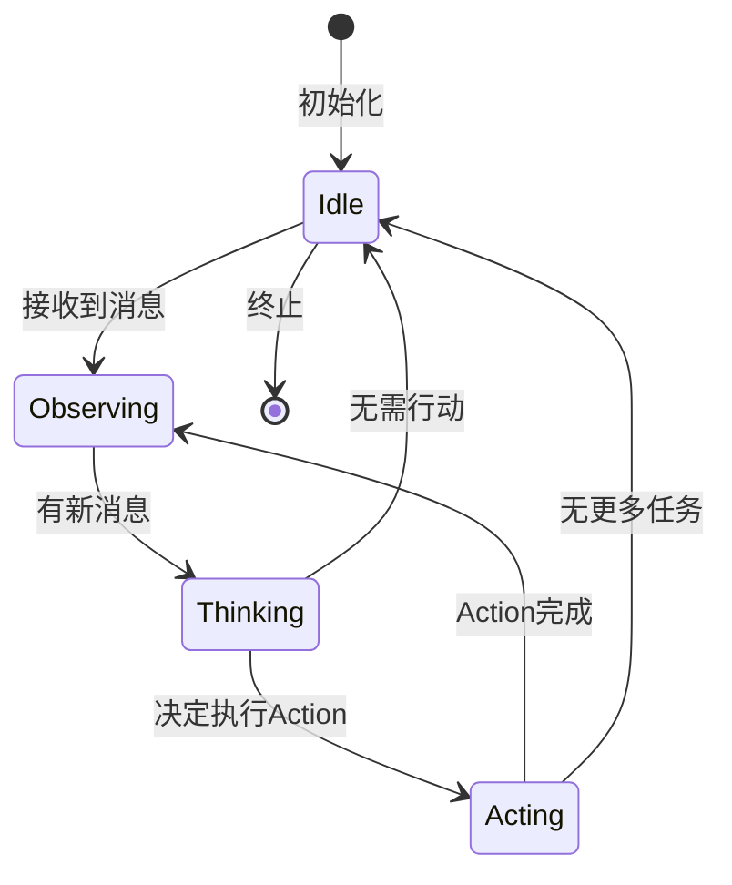
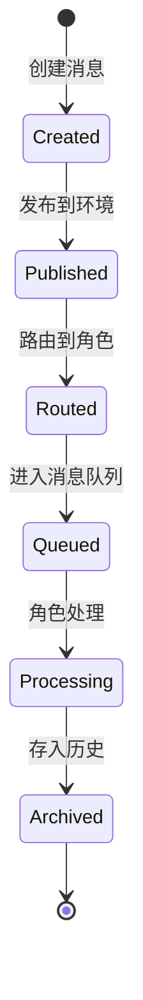

# mind2build 技术规格文档（SPEC）

> AI 辅助工程 · 规格说明文档  
> 用于在人与 AI 协作编码前，对齐目标、边界与工程决策  

**文档版本**: v1.1  
**创建日期**: 2025-12-24  
**最后更新**: 2026-01-06
**规格状态**: ✅ Frozen（已冻结，可进入实现阶段）

---

## 1. 项目背景（Why）

### 1.1 问题描述

**核心问题**:
- 软件开发流程复杂，从需求到代码需要多个角色协作，效率低下
- AI 编程工具多为单一功能（代码生成），缺乏完整的软件开发流程支持
- 现有 AI Agent 框架缺少标准化的多角色协作机制

**为什么现在解决**:
- 大语言模型能力达到可用阈值（GPT-4/Claude 等）
- 企业对软件开发自动化需求强烈
- 多代理协作研究取得突破

**不解决的成本**:
- 持续的低效重复劳动
- AI 工具碎片化，无法形成完整工作流
- 错失 AI 原生开发的机会窗口

### 1.2 目标定义

**最终目标**:
实现一个多代理协作框架，能够像真实软件公司一样，将用户的一行需求自动转化为完整的、可运行的软件项目。

**成功标准（可衡量）**:
- ✅ 用户能在 3 步内启动项目生成（安装、配置、运行）
- ✅ 单个项目从需求到代码生成时间 < 10分钟
- ✅ 生成代码的可运行率 > 85%
- ✅ 支持至少 5 种主流 LLM 提供商
- ✅ 系统在 5 个并发角色下稳定运行
- ✅ 社区采用率（GitHub Stars > 50k）

---

## 2. 范围定义（Scope）

### 2.1 本次要做的（In Scope）

#### 核心框架层
- ✅ BaseRole / Role 抽象和实现
- ✅ Action 系统（定义、注册、执行）
- ✅ Message 消息系统（发布、订阅、路由）
- ✅ Environment 环境管理（角色容器、消息分发）
- ✅ Memory 记忆系统（短期、长期、工作记忆）
- ✅ Context 上下文管理（配置、成本追踪）

#### 角色实现层
- ✅ Salesperson（销售）- 需求收集和市场调研
- ✅ ProductManager（产品经理）- PRD编写
- ✅ Architect（架构师）- 系统设计
- ✅ ProjectManager（项目经理）- 任务拆分和规划
- ✅ Engineer（工程师）- 代码实现
- ✅ QA Engineer（QA工程师）- 测试编写
- ✅ TeamLeader（团队领导）- 协调和决策
- ✅ DataAnalyst（数据分析师）- 数据分析和可视化

#### 行动实现层
- ✅ WriteMRD（编写市场研究文档）
- ✅ MRDReview（MRD文档审查）
- ✅ WritePRD（编写PRD）
- ✅ PRDReview（PRD文档审查）
- ✅ ImproveDocument（改进文档）
- ✅ WriteDesign（编写设计）
- ✅ DesignReview（设计文档审查）
- ✅ BreakdownTasks（任务拆分）
- ✅ WriteSubProjectDesign（子项目设计）
- ✅ SubProjectDesignReview（子项目设计审查）
- ✅ GenerateTask（生成任务说明）
- ✅ WriteCode（编写代码）
- ✅ ExecuteSubtask（执行子任务）
- ✅ CodeReview（代码审查）
- ✅ WriteTest（编写测试）
- ✅ SearchEnhancedQA（增强搜索）
- ✅ DataAnalysis（数据分析）
- ✅ Coordinate（协调任务）

#### LLM 集成层
- ✅ OpenAI (GPT-4, GPT-3.5)
- ✅ 智谱AI (ZhipuAI) - GLM-4系列
- ✅ 火山引擎 Ark (豆包)
- ✅ Cursor Agent
- 🚧 Anthropic Claude - 计划中
- 🚧 Google Gemini - 计划中
- 🚧 百度千帆 (Qianfan) - 计划中
- 🚧 阿里云 DashScope - 计划中
- 🚧 Ollama (本地模型) - 计划中

#### 工具集成层
- ✅ Browser（网页访问）
- ✅ Editor（文件编辑）
- ✅ Terminal（命令执行）
- ✅ SearchEnhancedQA（智能问答）

#### 项目管理层
- ✅ 项目目录结构生成
- ✅ 增量开发支持（--inc）
- ✅ 版本控制集成（Git）
- ✅ 项目序列化和恢复

#### 接口层
- ✅ CLI 命令行接口（TypeScript CLI）
- ✅ REST API（Express）
- ✅ WebSocket API（实时通信）
- ✅ Web UI（Vue 3 + Element Plus）
- ✅ 配置文件管理（PostgreSQL 数据库存储）

### 2.2 本次不做的（Out of Scope）

#### 明确排除的功能
- ❌ 实时协作功能（多人同时使用）
- ❌ 插件市场和社区角色库
- ❌ 多模态输入（图片、语音）
- ❌ 持续学习和模型微调
- ❌ 分布式部署和高可用
- ❌ 企业级权限管理
- ❌ 支付和计费系统

#### 已实现但不在初始规划的功能
- ✅ Web UI 界面（Vue 3 + Element Plus）
- ✅ WebSocket 实时通信
- ✅ 交互式模式（CLI 和 Web）
- ✅ PostgreSQL 数据库集成
- ✅ 工作区管理（WorkspaceManager）
- ✅ 分步骤文档生成（StepwiseDocumentGenerator）

#### 暂不支持的能力
- ❌ 除 Python/JS 外的其他语言全面支持
- ❌ 大型企业级应用（> 10万行代码）
- ❌ 复杂的数据库设计和迁移
- ❌ 移动端应用开发
- ❌ 游戏引擎集成

---

## 3. 用户与使用场景（Who & When）

### 3.1 目标用户

#### 用户类型 1：Node.js/TypeScript 开发者
- **技术能力**: 熟悉 Node.js v18+、TypeScript，了解基本的 CLI 操作
- **环境假设**: 已安装 Node.js、pnpm、PostgreSQL
- **使用方式**: CLI + REST API + Web UI

#### 用户类型 2：AI 研究者
- **技术能力**: 了解多代理系统，熟悉 TypeScript/JavaScript
- **环境假设**: 需要扩展框架，自定义角色
- **使用方式**: TypeScript API + 源码修改

#### 用户类型 3：产品经理/技术 PM
- **技术能力**: 基本技术背景，能运行命令行或使用 Web UI
- **环境假设**: 由技术团队协助安装
- **使用方式**: 主要使用 Web UI 或 CLI

### 3.2 核心使用场景

#### 场景 A：创建新项目
**使用前**:
- 用户有一个软件想法（如"创建一个2048游戏"）
- 已完成 mind2build 安装和配置（包括 PostgreSQL 数据库）

**使用中**:
```bash
# CLI 方式
pnpm --filter @mind2build/backend cli "Create a 2048 game" --application-id my-game --version 1

# 或通过 Web UI
# 访问 http://localhost:5173，输入需求并提交
```
- 系统自动执行完整的软件开发流程
- 用户可以实时查看日志输出（CLI）或通过 WebSocket 接收更新（Web UI）
- 支持交互模式，每个角色完成后等待用户确认
- 系统会在遇到问题时提示用户

**使用后**:
- 在 `./workspace/{applicationId}/v{version}/` 目录生成完整项目
- 包含 MRD、PRD、设计文档、源代码、README
- 代码可直接运行

**关键决策点**:
- 是否启用代码审查（--code-review）
- 是否启用测试（--run-tests）
- 预算设置（--investment）

#### 场景 B：数据分析任务
**使用前**:
- 用户有数据分析需求
- 已准备好数据或数据集名称

**使用中**:
```bash
# CLI 方式
pnpm --filter @mind2build/backend cli "Analyze Iris dataset and create visualization" --role DataAnalyst

# 或通过 REST API
POST /api/v1/run
{
  "idea": "Analyze Iris dataset and create visualization",
  "roles": ["DataAnalyst"],
  "applicationId": "data-analysis",
  "version": 1
}
```

**使用后**:
- 生成数据加载和处理代码
- 执行分析并输出结果
- 生成可视化图表

#### 场景 C：增量开发
**使用前**:
- 已有项目需要新增功能
- 项目在 workspace 中，有明确的 applicationId 和 version

**使用中**:
```bash
pnpm --filter @mind2build/backend cli "Add user login feature" --application-id my-app --version 2
```

**使用后**:
- 更新现有设计文档
- 新增必要的代码文件
- 保留原有项目结构
- 新版本文件保存在 `./workspace/{applicationId}/v{version}/` 目录

---

## 4. 功能规格（What）

### 4.1 核心功能列表

#### F1. 角色系统

**功能描述**: 提供基础角色抽象和具体角色实现

**输入**:
- 角色配置（name, profile, goal, constraints）
- 初始化参数（actions, tools, llm_config）

**输出**:
- 可工作的角色实例
- 角色执行结果（Message）

**成功条件**:
- 角色能正确初始化
- 角色能响应观察到的消息
- 角色能执行指定的 Action
- 角色能维护内部状态

**失败场景**:
- LLM API 调用失败 → 自动重试（最多3次）
- Action 执行异常 → 记录日志并返回错误消息
- 内存不足 → 清理旧消息，保留关键信息

**数据结构**:
```typescript
class Role extends BaseRole {
    name: string;                    // 角色名称
    profile: string;                 // 角色类型
    goal: string;                    // 角色目标
    constraints: string;             // 约束条件
    description: string;             // 角色描述
    actions: BaseAction[];           // 可执行的行动
    rc: RoleContext;                 // 运行时上下文
    context: Context;                // 全局上下文
    // LLM 实例由 Role 内部管理（支持角色特定配置）
}
```

#### F2. 消息系统

**功能描述**: 实现角色间的消息传递和路由

**输入**:
- Message 对象（content, send_to, cause_by）
- 发布者信息

**输出**:
- 消息成功分发到目标角色
- 消息历史记录

**成功条件**:
- 消息能准确路由到指定接收者
- 支持广播、定向、订阅三种模式
- 消息顺序得到保证

**失败场景**:
- 接收者不存在 → 记录警告，继续执行
- 消息格式错误 → 拒绝消息，返回错误

**路由规则**:
```typescript
// 广播
sendTo = new Set([MESSAGE_ROUTE_TO_ALL])

// 定向
sendTo = new Set(["ProductManager", "Architect"])

// 订阅（通过 watch）
role.watch([ACTION_WRITE_PRD, ACTION_WRITE_DESIGN])
```

**消息路由优先级**:
1. 广播消息（`MESSAGE_ROUTE_TO_ALL`）：所有角色接收
2. 订阅机制（`watch`）：角色通过 `watch([ACTION_NAME])` 订阅特定 Action
3. 直接发送：消息的 `sendTo` 包含角色地址（角色名称）

#### F3. Action 执行系统

**功能描述**: 定义和执行原子化的任务单元

**输入**:
- Action 类型和参数
- 上下文信息（memory, llm）

**输出**:
- Action 执行结果
- 生成的文档或代码

**成功条件**:
- Action 能独立执行
- 输出格式符合预期
- 支持自定义 Action

**失败场景**:
- LLM 返回格式错误 → 重新请求或使用默认格式
- 生成内容质量低 → 代码审查机制介入

**Action 接口**:
```typescript
abstract class BaseAction {
    name: string;
    description?: string;
    protected llm?: BaseLLM;      // 由 Role 注入
    protected context?: Context;  // 由 Role 注入
    
    abstract async run(...args: any[]): Promise<IActionOutput>;
    
    // 辅助方法
    protected async aask(prompt: string, systemMsgs?: string[]): Promise<string>;
    protected async saveToWorkspace(filePath: string, content: string, options?: WorkspaceOptions): Promise<void>;
    protected getWorkspaceDir(options?: WorkspaceOptions): string;
}
```

#### F4. 环境管理系统

**功能描述**: 管理多个角色的运行环境和消息分发

**输入**:
- 角色列表
- 初始消息（用户需求）

**输出**:
- 所有角色执行完成
- 消息历史记录

**成功条件**:
- 支持多角色并发执行
- 消息正确路由
- 环境状态可序列化

**失败场景**:
- 角色死锁 → 超时机制介入
- 消息循环 → 检测并终止

#### F5. LLM 提供商集成

**功能描述**: 提供统一的 LLM 调用接口

**输入**:
- LLM 配置（api_type, model, api_key）
- 提示词（prompt）
- 参数（temperature, max_tokens）

**输出**:
- LLM 生成的文本
- Token 使用统计

**成功条件**:
- 支持多提供商透明切换
- 自动处理 API 限流和重试
- 成本追踪准确

**失败场景**:
- API Key 无效 → 立即报错
- API 限流 → 等待后重试
- 网络错误 → 重试 3 次后放弃

#### F6. 项目生成系统

**功能描述**: 生成完整的项目文件结构

**输入**:
- 项目需求
- 项目配置（名称、路径）

**输出**:
- 完整的项目目录
- 文档和代码文件
- README 和配置文件

**成功条件**:
- 目录结构清晰规范
- 文件内容完整
- 支持增量更新

**失败场景**:
- 磁盘空间不足 → 提前检查并报错
- 文件权限问题 → 明确提示用户

### 4.2 边界与异常处理

#### 输入验证
- 用户需求不能为空
- LLM API Key 必须有效
- 项目路径必须可写
- 预算必须 > 0

#### 异常处理策略
| 异常类型 | 处理策略 | 重试次数 | 降级方案 |
|---------|---------|---------|---------|
| LLM API 错误 | 自动重试 | 3次 | 切换备用模型 |
| 网络超时 | 指数退避重试 | 3次 | 提示用户检查网络 |
| 格式解析错误 | 重新请求 | 2次 | 使用默认格式 |
| 预算超支 | 立即停止 | 0次 | 保存当前状态 |
| 文件系统错误 | 提示用户 | 0次 | 无降级 |

---

## 5. 系统与架构假设（How · 高层）

### 5.1 技术约束

**运行环境**:
- Server / Local（命令行或 Node.js 脚本）
- 操作系统：Linux / macOS / Windows
- Node.js 版本：v18+（推荐 v20+）

**语言 / 框架**:
- 主语言：TypeScript 5.3+
- 运行时：Node.js v18+
- 依赖管理：pnpm（monorepo）
- 异步框架：async/await + Promise
- 数据验证：Zod v3.22+
- CLI 框架：Commander.js
- 测试框架：Jest
- Web 框架：Express

**第三方依赖**:
- ✅ 允许引入必要的依赖
- ✅ 优先使用主流稳定库
- ❌ 避免过度依赖
- ❌ 避免有安全风险的库

**外部服务依赖**:
- LLM API（OpenAI / Anthropic / etc.）
- Node.js + pnpm（用于 Mermaid 图表）
- Git（可选，用于版本控制）

### 5.2 架构原则

**架构形态**:
- **主体**: 模块化单体架构（monorepo）
- **扩展**: 插件化设计（角色、Action 可扩展）
- **部署**: 单进程异步（Node.js Event Loop）

**设计优先级**:
1. **可扩展性** - 易于添加新角色和 Action
2. **可读性** - 代码清晰，文档完善
3. **性能** - 合理的异步设计，避免阻塞

**核心设计模式**:
- **角色模式**: BaseRole 抽象类 + 具体实现
- **行动模式**: Action 基类 + 动作注册表
- **观察者模式**: 消息发布/订阅机制
- **策略模式**: 多种 react_mode（react / by_order / plan_and_act）
- **工厂模式**: LLM 提供商工厂

**AI Agent 支持**:
- ✅ 所有接口支持编程调用
- ✅ 配置文件驱动
- ✅ 可序列化和恢复状态
- ✅ 支持批量任务执行

---

## 6. 数据与状态模型（Data）

### 6.1 核心数据结构

#### Message（消息）
```python
{
    "id": str,                     # UUID
    "content": str,                # 自然语言内容
    "instruct_content": BaseModel, # 结构化内容（可选）
    "role": str,                   # system/user/assistant
    "cause_by": str,               # 触发的 Action 类名
    "sent_from": str,              # 发送者标识
    "send_to": set[str],           # 接收者集合
    "metadata": dict               # 元数据
}
```
**生命周期**: 创建 → 发布 → 路由 → 处理 → 存入历史  
**持久化**: 可选（序列化时保存）

#### Role（角色）
```python
{
    "name": str,
    "profile": str,
    "goal": str,
    "constraints": str,
    "actions": list[Action],
    "rc": {                        # RoleContext
        "state": int,              # 当前状态索引
        "todo": Action,            # 下一个要执行的 Action
        "watch": list[str],        # 订阅的 Action
        "news": list[Message],     # 新消息队列
        "memory": Memory,          # 记忆系统
        "max_react_loop": int      # 最大循环次数
    }
}
```
**生命周期**: 初始化 → 运行 → 空闲/终止  
**持久化**: 支持（通过序列化）

#### Context（上下文）
```python
{
    "config": Config,              # 全局配置
    "cost_manager": CostManager,   # 成本追踪
    "project_path": Path,          # 项目路径
    "git_repo": GitRepository      # Git仓库
}
```
**生命周期**: 应用启动到结束  
**持久化**: 部分（配置持久化）

### 6.2 状态流转

#### 角色状态机


**状态说明**:
- **Idle**: 空闲状态，等待消息
- **Observing**: 观察环境中的消息
- **Thinking**: 决策下一步行动
- **Acting**: 执行具体的 Action

**非法状态**:
- 无 LLM 配置时不能执行需要 LLM 的 Action
- 无 Tool 配置时不能执行需要工具的 Action
- 预算耗尽时不能继续执行

#### 消息状态流转


---

## 7. 非功能性要求（Quality）

### 7.1 性能要求

| 指标 | 目标值 | 测量方法 |
|------|--------|---------|
| 单项目生成时间 | < 10分钟 | 端到端计时 |
| LLM API 响应时间 | < 30秒 | 单次调用计时 |
| 内存使用 | < 1GB | 运行时监控 |
| 并发角色数 | >= 5 | 压力测试 |
| Token 使用效率 | 提升 20% | 与基线对比 |

**并发/规模假设**:
- 单个项目同时最多 10 个角色
- 单次对话历史不超过 100 条消息
- 生成项目代码量 < 5000 行

### 7.2 可维护性

**模块边界**:
- ✅ 清晰的模块职责划分（roles / actions / provider）
- ✅ 最小化模块间依赖
- ✅ 使用依赖注入而非硬编码

**文档要求**:
- ✅ 所有公共 API 必须有 JSDoc 注释
- ✅ 复杂逻辑必须有注释说明
- ✅ 提供使用示例和教程

**代码规范**:
- 遵循 ESLint 规则
- 使用 TypeScript 类型注解
- 使用 Prettier 格式化
- 使用 ESLint 进行 lint

### 7.3 安全与风险

**敏感数据处理**:
- ✅ API Key 从环境变量或配置文件读取
- ✅ 不在日志中输出完整 API Key
- ✅ 配置文件不提交到版本控制

**AI 自行假设禁止项**:
- ❌ 不得自动修改用户指定的依赖版本
- ❌ 不得自动执行危险的系统命令（rm -rf 等）
- ❌ 不得绕过用户设置的预算限制
- ❌ 不得在未确认的情况下访问网络资源

---

## 8. 测试与验证策略（Verify）

### 8.1 验收标准

**功能完整性**:
- [ ] 所有 P0 功能实现并通过测试
- [ ] 端到端场景测试通过（创建项目、数据分析、增量开发）
- [ ] 所有公共 API 有完整文档

**质量标准**:
- [ ] 单元测试覆盖率 > 70%
- [ ] 所有 CI/CD 检查通过
- [ ] 代码通过 lint 检查（Ruff）
- [ ] 无高危安全漏洞

**可用性标准**:
- [ ] 安装文档清晰完整
- [ ] 示例代码可直接运行
- [ ] 错误提示友好明确

### 8.2 测试类型

#### 单元测试
**范围**:
- 所有核心类的方法（Role, Action, Message）
- 工具函数和辅助类
- LLM 提供商集成（使用 Mock）

**工具**: Jest + ts-jest

#### 集成测试
**范围**:
- 角色间协作流程
- 消息路由机制
- 项目生成完整流程

**工具**: Jest + 真实 LLM API（使用测试账号）

#### 端到端测试
**测试用例**:
1. 创建简单项目（如 CLI 工具）
2. 创建 Web 应用（如 TODO App）
3. 数据分析任务
4. 增量开发场景

**验收**: 生成的代码能运行且符合需求

#### 手动验证点
- 生成代码的代码质量（可读性、规范性）
- 生成文档的完整性和准确性
- 用户体验（安装、配置、使用流程）
- 错误处理的友好性

---

## 9. 实施计划（Plan）

### 9.1 任务拆解（详见 `11_任务拆解文档_TASKS.md`）

**Phase 1: 基础设施**
- T1.1: 环境搭建和依赖安装
- T1.2: BaseRole / BaseAction 抽象类
- T1.3: Message 消息系统
- T1.4: Environment 基础实现

**Phase 2: LLM 集成**
- T2.1: BaseLLM 抽象层
- T2.2: OpenAI / Azure 集成
- T2.3: 其他提供商集成
- T2.4: 成本追踪系统

**Phase 3: 核心角色**
- T3.1: ProductManager 实现
- T3.2: Architect 实现
- T3.3: Engineer 实现
- T3.4: QA Engineer 实现

**Phase 4: 行动系统**
- T4.1: WritePRD 实现
- T4.2: WriteDesign 实现
- T4.3: WriteCode 实现
- T4.4: WriteTest / WriteCodeReview

**Phase 5: 工具与集成**
- T5.1: Browser / Editor / Terminal
- T5.2: 项目管理系统
- T5.3: CLI 接口实现
- T5.4: 配置管理系统

**Phase 6: 测试与文档**
- T6.1: 单元测试编写
- T6.2: 集成测试编写
- T6.3: 文档完善
- T6.4: 示例代码

### 9.2 里程碑

- **M1: 规格冻结** ✅ (当前文档完成)
- **M2: 核心功能完成** - 预计 40 工作日
- **M3: 测试通过** - 预计 50 工作日
- **M4: 可交付** - 预计 60 工作日

---

## 10. 未决问题（Open Questions）

### 已决策的问题
- ✅ 使用 Node.js v18+ + TypeScript v5.3+（类型安全，生态成熟）
- ✅ 使用 async/await 而非多进程（简化实现，Node.js Event Loop）
- ✅ 使用 Zod v3.22+（运行时数据验证）
- ✅ 消息系统采用发布/订阅模式
- ✅ 使用 PostgreSQL 数据库存储配置和提示词（而非配置文件）
- ✅ 使用 pnpm monorepo 管理多包项目
- ✅ 前端使用 Vue 3 + Element Plus（渐进式，企业级UI）

### 当前无需决策的问题
以下问题在当前阶段不影响核心实现：
- Web UI 的技术选型（远期功能）
- 分布式部署方案（远期功能）
- 插件系统的具体实现（远期功能）

---

## 11. AI 协作约定

### AI 必须遵守的规则

**禁止在以下情况下生成代码**:
- ❌ 规格不完整或存在矛盾
- ❌ 边界未明确定义
- ❌ 技术约束未确认
- ❌ 用户需求模糊或有歧义

**AI 必须做到**:
- ✅ 在发现歧义时主动提问
- ✅ 严格遵守本 spec，不自行套用"最佳实践"
- ✅ 生成的代码必须有完整的类型注解
- ✅ 生成的代码必须有必要的注释
- ✅ 遵循项目现有的代码风格

**AI 可以自主决策的范围**:
- ✅ 变量和函数命名（符合规范即可）
- ✅ 代码组织方式（保持清晰可读）
- ✅ 异常处理的具体实现（遵循总体策略）
- ✅ 测试用例的具体内容（覆盖主要场景）

---

## 12. 规格状态

- **当前状态**: ✅ **Frozen**（已冻结）
- **最后确认人**: Technical Team
- **确认时间**: 2025-12-24
- **有效期**: 至 v1.0 版本发布

### 变更记录
| 日期 | 版本 | 变更内容 | 变更人 |
|------|------|---------|--------|
| 2025-12-24 | 1.0 | 初始版本创建 | AI Team |

---
