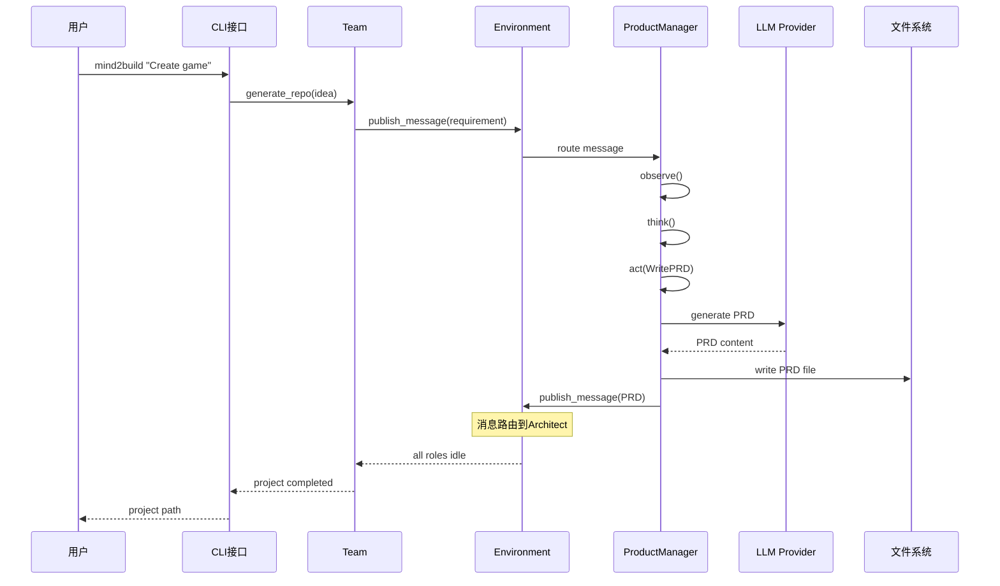
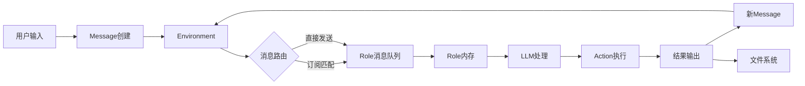
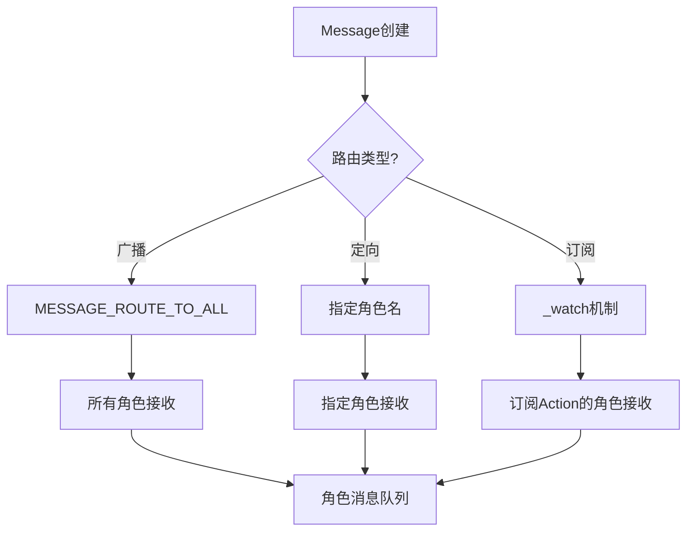
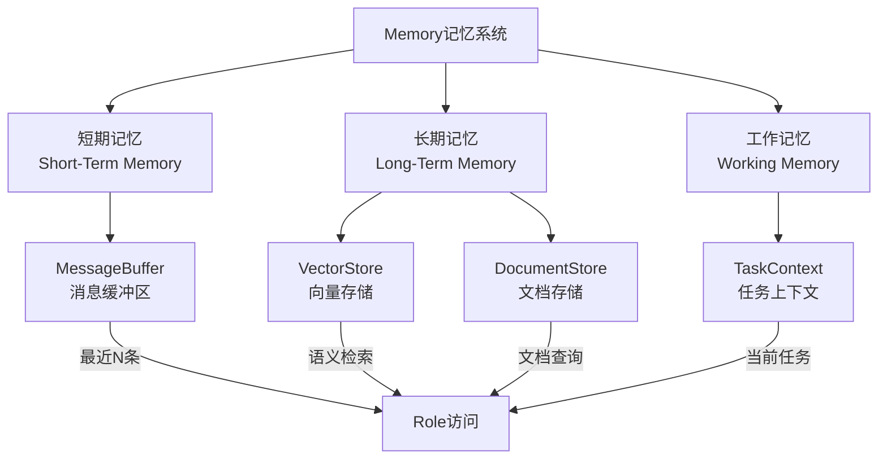
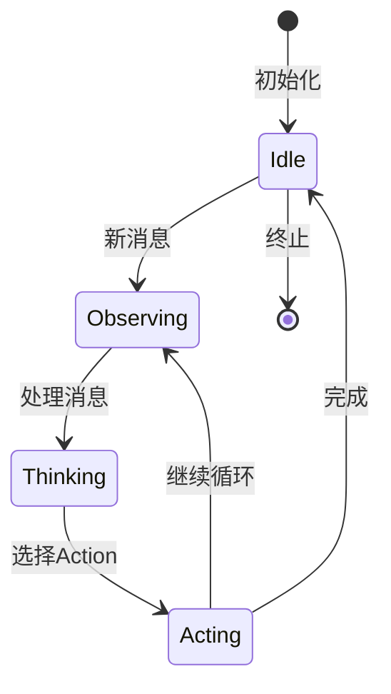
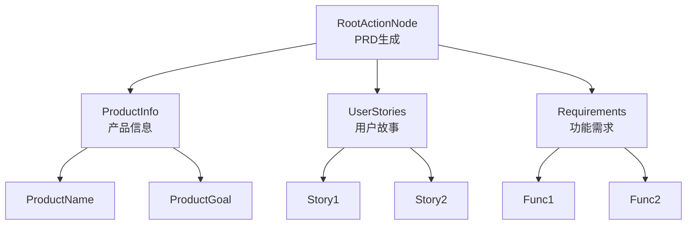
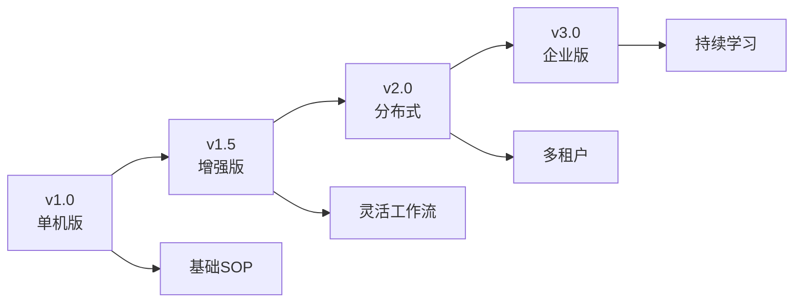
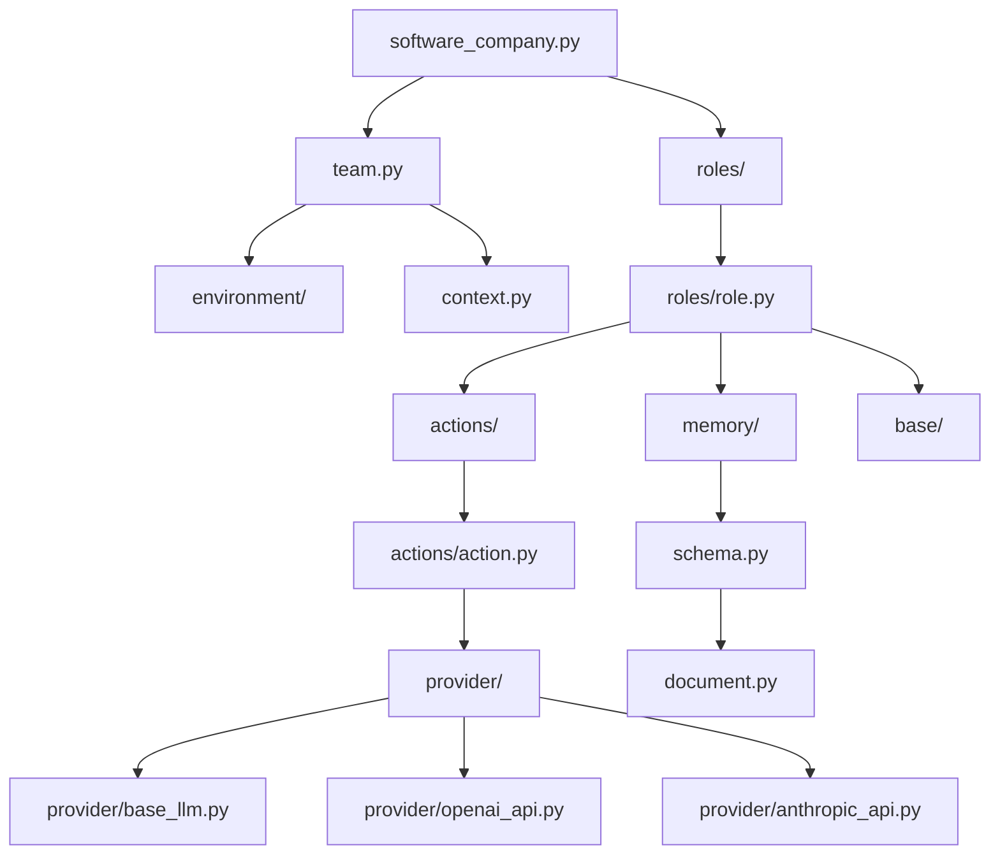

# 即思即成（Mind2Build）系统架构文档

**Slogan**: 让所思，即所得

**文档版本**: v1.1  
**创建日期**: 2025-12-24  
**最后更新**: 2026-01-06（根据实际代码实现更新架构细节）

---

## 目录

1. [架构概述](#1-架构概述)
2. [整体架构设计](#2-整体架构设计)
3. [核心模块详解](#3-核心模块详解)
4. [技术选型](#4-技术选型)
5. [扩展机制](#5-扩展机制)
6. [部署架构](#6-部署架构)

---

## 1. 架构概述

### 1.1 设计理念

即思即成（Mind2Build）的核心设计理念是 **`Code = SOP(Team)`**，即：
- **Code**: 最终产出的软件代码
- **SOP**: Standard Operating Procedure（标准操作流程）
- **Team**: 由多个 AI Agent 组成的协作团队

### 1.2 架构特点

- **多代理协作**: 模拟真实软件公司的角色分工
- **消息驱动**: 基于发布/订阅的消息系统
- **可扩展性**: 支持自定义角色、行动和工作流
- **LLM 无关**: 抽象层设计支持多种 LLM 提供商
- **异步执行**: 基于 Node.js Event Loop 的高效异步架构

### 1.3 核心组件

```mermaid
graph TB
    subgraph UserInterface[用户接口层]
        CLI[CLI命令行]
        API[REST API + WebSocket]
        WebUI[Web UI (Vue 3)]
    end
    
    subgraph OrchestrationLayer[编排层]
        Team[Team团队]
        Env[Environment环境]
    end
    
    subgraph RoleLayer[角色层]
        Sales[Salesperson]
        PM[ProductManager]
        Arch[Architect]
        Eng[Engineer]
        QA[QA Engineer]
        TL[Team Leader]
    end
    
    subgraph ActionLayer[行动层]
        WritePRD[WritePRD]
        WriteDesign[WriteDesign]
        WriteCode[WriteCode]
        WriteTest[WriteTest]
    end
    
    subgraph InfraLayer[基础设施层]
        Message[消息系统]
        Memory[记忆系统]
        Context[上下文管理]
    end
    
    subgraph ProviderLayer[提供商层]
        LLM[LLM抽象]
        OpenAI[OpenAI]
        Claude[Claude]
        Gemini[Gemini]
    end
    
    subgraph ToolLayer[工具层]
        Browser[Browser]
        Editor[Editor]
        Terminal[Terminal]
    end
    
    CLI --> Team
    API --> Team
    Team --> Env
    Env --> Sales
    Env --> PM
    Env --> Arch
    Env --> Eng
    Env --> QA
    Env --> TL
    
    PM --> WritePRD
    Arch --> WriteDesign
    Eng --> WriteCode
    QA --> WriteTest
    
    WritePRD --> Message
    WriteDesign --> Message
    WriteCode --> Message
    WriteTest --> Message
    
    PM --> Memory
    Arch --> Memory
    Eng --> Memory
    
    PM --> Context
    Context --> LLM
    LLM --> OpenAI
    LLM --> Claude
    LLM --> Gemini
    
    PM --> Browser
    Eng --> Editor
    Arch --> Terminal
```

---

## 2. 整体架构设计

### 2.1 分层架构

mind2build 采用六层架构设计：

```
┌─────────────────────────────────────────┐
│        用户接口层 (Interface Layer)       │  CLI, REST API, Web UI
├─────────────────────────────────────────┤
│        编排层 (Orchestration Layer)      │  Team, Environment
├─────────────────────────────────────────┤
│        角色层 (Role Layer)               │  PM, Architect, Engineer...
├─────────────────────────────────────────┤
│        行动层 (Action Layer)             │  WritePRD, WriteCode...
├─────────────────────────────────────────┤
│      基础设施层 (Infrastructure Layer)   │  Message, Memory, Context
├─────────────────────────────────────────┤
│       提供商层 (Provider Layer)          │  LLM, Tools
└─────────────────────────────────────────┘
```

#### 层次职责

| 层次 | 职责 | 关键组件 |
|------|------|---------|
| 用户接口层 | 提供用户交互入口 | CLI, generate_repo() |
| 编排层 | 管理角色生命周期和协作 | Team, Environment |
| 角色层 | 定义 AI 角色的行为和职责 | Role, ProductManager, Engineer |
| 行动层 | 实现具体的任务执行逻辑 | Action, WritePRD, WriteCode |
| 基础设施层 | 提供核心支撑服务 | Message, Memory, Context |
| 提供商层 | 对接外部服务 | BaseLLM, Browser, Editor |

### 2.2 核心交互流程



### 2.3 数据流架构



---

## 3. 核心模块详解

### 3.1 基础设施层

#### 3.1.1 消息系统 (Message System)

**设计目标**: 实现角色间解耦的通信机制

**核心类**:
```python
class Message(BaseModel):
    id: str                    # 消息唯一标识
    content: str               # 自然语言内容
    instruct_content: BaseModel # 结构化内容
    role: str                  # 角色类型
    cause_by: str              # 触发Action
    sent_from: str             # 发送者
    send_to: set[str]          # 接收者集合
    metadata: dict             # 元数据
```

**消息路由机制**:


**关键方法**:
- `Environment.publishMessage(message: Message)`: 发布消息到环境并路由到匹配的角色
- `Role.putMessage(message: Message)`: 将消息放入角色的消息缓冲区（MessageQueue）
- `Role.observe()`: 观察并获取新消息（从 msgBuffer 移动到 news）
- `Environment.isMessageFor(message: Message, role: Role)`: 判断消息是否应该发送给某个角色

**消息路由规则**:
1. **广播消息** (`MESSAGE_ROUTE_TO_ALL`): 所有角色接收
2. **订阅机制** (`watch`): 角色通过 `watch([ACTION_NAME])` 订阅特定 Action 的消息
3. **直接发送**: 消息的 `sendTo` 包含角色的地址（角色名称）

#### 3.1.2 记忆系统 (Memory System)

**设计目标**: 为角色提供上下文记忆能力

**记忆类型**:



**核心类**:
```typescript
class Memory {
    private storage: Message[];     // 消息存储数组
    private maxSize: number;        // 最大存储数量（默认100）
    
    add(message: Message): void;   // 添加消息（自动截断到maxSize）
    get(k?: number): Message[];     // 获取所有消息或最近k条
    getByRole(role: string): Message[];  // 按角色筛选
    getByAction(actionType: string | Function): Message[];  // 按Action类型筛选
    getByActions(actionTypes: Array<string | Function>): Message[];  // 按多个Action类型筛选
    searchByContent(query: string): Message[];  // 按内容搜索
}

class ShortTermMemory extends Memory {
    // 工作记忆，默认保留最近10条消息
}
```

**存储策略**:
- **Memory**: 长期记忆，默认保留最近 100 条消息（可配置）
- **ShortTermMemory**: 工作记忆，默认保留最近 10 条消息
- **MessageQueue**: 消息缓冲区，用于异步消息传递
- 未来计划：向量数据库集成用于语义检索

#### 3.1.3 上下文管理 (Context)

**设计目标**: 管理全局配置和共享资源

**核心职责**:
```python
class Context(BaseModel):
    config: Config             # 全局配置
    cost_manager: CostManager  # 成本管理
    kwargs: AttrDict           # 动态属性
    _llm: BaseLLM             # LLM实例
    
    def llm(self) -> BaseLLM:
        """返回LLM实例"""
        
    def serialize(self) -> dict:
        """序列化上下文"""
```

**配置管理**:
```yaml
# config2.yaml
llm:
  api_type: "openai"
  model: "gpt-4-turbo"
  api_key: "${OPENAI_API_KEY}"

workspace:
  path: "./workspace"
  
cost:
  max_budget: 10.0
```

### 3.2 角色层 (Role Layer)

#### 3.2.1 角色抽象

**设计模式**: 模板方法模式 + 策略模式

**类层次结构**:
```typescript
BaseRole (抽象基类)
  ├─ name: string
  ├─ profile: string
  ├─ isIdle: boolean
  ├─ observe(): Promise<number>  // 观察新消息
  ├─ think(): Promise<boolean>   // 思考决策
  ├─ act(): Promise<Message | null>  // 执行行动
  └─ run(): Promise<Message | null>  // 运行主循环

Role extends BaseRole (具体实现)
  ├─ goal: string
  ├─ constraints: string
  ├─ description: string
  ├─ actions: BaseAction[]
  ├─ rc: RoleContext
  ├─ context: Context
  ├─ watch(actions: string[]): void  // 订阅Action
  ├─ setActions(actions: BaseAction[]): void  // 设置Actions
  ├─ putMessage(message: Message): void  // 接收消息
  └─ getAddresses(): Set<string>  // 获取角色地址

ProductManager extends Role
Architect extends Role
Engineer extends Role
Salesperson extends Role
ProjectManager extends Role
QAEngineer extends Role
TeamLeader extends Role
DataAnalyst extends Role
```

**RoleContext (角色运行时上下文)**:
```typescript
class RoleContext {
    env?: Environment;              // 环境引用（由Environment设置）
    msgBuffer: MessageQueue;        // 消息缓冲区
    memory: Memory;                 // 长期记忆（默认100条）
    workingMemory: ShortTermMemory; // 工作记忆（默认10条）
    state: number;                  // 当前状态（-1=初始/终止）
    todo: BaseAction | null;        // 待执行的Action
    watch: Set<string>;             // 订阅的Action集合
    news: Message[];               // 新消息（临时存储）
    reactMode: RoleReactMode;       // React模式（默认BY_ORDER）
    maxReactLoop: number;           // 最大React循环次数（默认1）
}
```

**角色状态机**:


#### 3.2.2 React 模式

mind2build 支持三种 react 模式（通过 `RoleReactMode` 枚举）：

**1. REACT 模式** (标准 ReAct 循环)
```typescript
// LLM 动态选择 Action（当前未完全实现）
while actions_taken < max_react_loop:
    has_todo = await this.think();  // LLM 动态选择 Action
    if (!has_todo) break;
    await this.act();
    actions_taken++;
```

**2. BY_ORDER 模式** (按顺序执行，默认模式)
```typescript
// 按照 actions 列表顺序依次执行
this.setActions([new WritePRD(), new SearchEnhancedQA()]);
this.rc.reactMode = RoleReactMode.BY_ORDER;
// 每次 think() 会选择下一个未执行的 Action
```

**3. PLAN_AND_ACT 模式** (先规划后执行)
```typescript
// 先用 LLM 生成完整计划，再依次执行（未来实现）
const plan = await this.planner.plan();
for (const action of plan) {
    await action.run();
}
```

**当前实现**:
- 默认使用 `BY_ORDER` 模式
- `think()` 方法会根据 `reactMode` 选择下一个 Action
- 支持 `maxReactLoop` 控制最大执行次数（默认1）

#### 3.2.3 角色实现示例

**ProductManager**:
```typescript
class ProductManager extends Role {
    constructor(context: Context, name: string = 'ProductManager') {
        const config: IRoleConfig = {
            name,
            profile: 'ProductManager',
            goal: 'Create comprehensive Product Requirements Document (PRD) from Market Research Document (MRD)',
            constraints: 'Focus on user needs, market analysis, and clear feature specifications',
            description: 'Experienced product manager...',
        };
        
        super(config, context);
        
        // 订阅 WriteMRD action
        this.watch([ACTION_WRITE_MRD]);
        
        // 设置 Actions
        this.setActions([new WritePRD(), new SearchEnhancedQA()]);
    }
}
```

**Architect**:
```typescript
class Architect extends Role {
    constructor(context: Context, name: string = 'Architect') {
        const config: IRoleConfig = {
            name,
            profile: 'Architect',
            goal: 'Design comprehensive system architecture and technical specifications',
            constraints: 'Follow best practices, ensure scalability and maintainability',
            description: 'Senior architect who creates robust system designs',
        };
        
        super(config, context);
        
        // 订阅 WritePRD action
        this.watch([ACTION_WRITE_PRD]);
        
        // 设置 Actions
        this.setActions([new WriteDesign()]);
    }
}
```

### 3.3 行动层 (Action Layer)

#### 3.3.1 Action 抽象

**设计模式**: 命令模式

**核心接口**:
```typescript
abstract class BaseAction {
    name: string;              // Action 名称
    description?: string;      // Action 描述
    protected llm?: BaseLLM;   // LLM 实例（由Role注入）
    protected context?: Context; // Context 实例（由Role注入）
    
    abstract run(...args: any[]): Promise<IActionOutput>;
    
    // 辅助方法
    protected async aask(prompt: string, systemMsgs?: string[]): Promise<string>;
    protected async acompletion(messages: any[]): Promise<any>;
    protected async saveToWorkspace(filePath: string, content: string, options?: WorkspaceOptions): Promise<void>;
    protected getWorkspaceDir(options?: WorkspaceOptions): string;
    protected async readWorkspaceFile(filePath: string, options?: WorkspaceOptions): Promise<string | null>;
}
```

**Action 常量定义**:
```typescript
// shared/src/constants/index.ts
export const ACTION_WRITE_MRD = 'WriteMRD';
export const ACTION_WRITE_PRD = 'WritePRD';
export const ACTION_WRITE_DESIGN = 'WriteDesign';
export const ACTION_WRITE_CODE = 'WriteCode';
export const ACTION_WRITE_TEST = 'WriteTest';
export const ACTION_BREAKDOWN_TASKS = 'BreakdownTasks';
// ... 更多 Actions
```

#### 3.3.2 核心 Actions

**WritePRD** (编写产品需求文档):
```python
class WritePRD(Action):
    async def run(self, requirement: str) -> Document:
        # 1. 理解需求
        # 2. 构建 Prompt
        # 3. 调用 LLM 生成 PRD
        # 4. 格式化输出
        prompt = self._build_prompt(requirement)
        content = await self.llm.aask(prompt)
        return Document(filename="PRD.md", content=content)
```

**WriteDesign** (编写系统设计):
```python
class WriteDesign(Action):
    async def run(self, prd: Document) -> Document:
        # 1. 分析 PRD
        # 2. 设计系统架构
        # 3. 生成数据结构和API
        # 4. 输出设计文档
        pass
```

**WriteCode** (编写代码):
```python
class WriteCode(Action):
    async def run(self, design: Document) -> list[Document]:
        # 1. 解析设计文档
        # 2. 生成代码文件列表
        # 3. 为每个文件生成代码
        # 4. 返回代码文件集合
        pass
```

#### 3.3.3 ActionNode 树结构

ActionNode 支持构建复杂的任务树：



### 3.4 编排层 (Orchestration Layer)

#### 3.4.1 Environment (环境)

**职责**:
- 容器：管理多个 Role 实例
- 路由：分发消息到目标 Role
- 调度：协调 Role 的执行顺序

**核心方法**:
```typescript
class Environment {
    private roles: Map<string, Role>;  // 角色字典（key: 角色名称）
    private memberAddrs: Map<Role, Set<string>>;  // 角色地址映射
    public history: Message[];         // 消息历史
    private interactiveHandler?: InteractiveHandler;  // 交互式处理器
    
    addRoles(roles: Role[]): void;     // 添加角色到环境
    publishMessage(message: Message): boolean;  // 发布消息并路由
    async run(): Promise<void>;        // 运行所有活跃角色（一轮）
    async runForRounds(rounds: number): Promise<void>;  // 运行多轮
    get isIdle(): boolean;             // 检查所有角色是否空闲
    
    // 消息路由
    private isMessageFor(message: Message, role: Role): boolean {
        // 1. 广播消息：所有角色接收
        if (message.sendTo.has(MESSAGE_ROUTE_TO_ALL)) return true;
        
        // 2. 订阅机制：角色通过 watch 订阅特定 Action
        if (role.rc.watch.has(message.causeBy)) return true;
        
        // 3. 直接发送：消息的 sendTo 包含角色地址
        const addresses = role.getAddresses();
        return hasIntersection(message.sendTo, addresses);
    }
}
```

**执行模式**:
- **非交互模式**: 角色并行执行（`Promise.allSettled`）
- **交互模式**: 角色顺序执行，每个角色执行后等待用户确认

#### 3.4.2 Team (团队)

**职责**:
- 高层封装：提供简单的 API 接口
- 预算管理：控制 LLM 调用成本
- 项目管理：管理生成的项目文件
- 交互式模式：支持用户确认和编辑（通过 InteractiveHandler）

**交互式模式**:
- 支持 CLI 交互式确认（每个角色执行后等待用户确认）
- 支持 WebSocket 实时交互（通过 InteractiveSession）
- 用户操作：继续、编辑、重新生成、跳过、退出

**使用示例**:
```typescript
const context = new Context(config, maxBudget);
const team = new Team(context, interactive: false);
team.hire([
    new Salesperson(context),
    new ProductManager(context),
    new Architect(context),
    new Engineer(context)
]);
team.invest(10.0);  // 设置预算 $10
await team.run("Create a 2048 game", nRound: 5);
```

**成本管理**:
```typescript
class CostManager {
    totalPromptTokens: number = 0;
    totalCompletionTokens: number = 0;
    totalCost: number = 0.0;
    maxBudget: number = 10.0;
    
    updateCost(usage: ILLMUsage): void {
        // 更新Token和成本
        this.totalPromptTokens += usage.promptTokens || 0;
        this.totalCompletionTokens += usage.completionTokens || 0;
        this.totalCost += usage.cost || 0;
        
        if (this.totalCost >= this.maxBudget) {
            throw new NoMoneyException();
        }
    }
    
    getReport(): CostReport {
        return {
            totalCost: this.totalCost,
            totalTokens: this.totalPromptTokens + this.totalCompletionTokens,
            budgetRemaining: this.maxBudget - this.totalCost,
        };
    }
}
```

### 3.5 提供商层 (Provider Layer)

#### 3.5.1 LLM 抽象层

**设计模式**: 工厂模式 + 策略模式

**类层次结构**:
```typescript
abstract class BaseLLM {
    config: ILLMConfig;
    costManager?: CostManager;
    
    abstract async aask(prompt: string, systemMsgs?: string[]): Promise<string>;
    abstract async acompletion(messages: any[]): Promise<ILLMResponse>;
    abstract async achat(messages: any[]): Promise<ILLMResponse>;
}

OpenAILLM extends BaseLLM
ZhipuLLM extends BaseLLM
ArkLLM extends BaseLLM
CursorLLM extends BaseLLM
```

**LLM 工厂**:
```typescript
export function createLLM(config: ILLMConfig): BaseLLM {
    switch (config.provider) {
        case 'openai':
            return new OpenAILLM(config);
        case 'zhipuai':
            return new ZhipuLLM(config);
        case 'ark':
            return new ArkLLM(config);
        case 'cursor':
            return new CursorLLM(config);
        default:
            throw new Error(`Unsupported LLM provider: ${config.provider}`);
    }
}
```

**统一接口**:
```typescript
abstract class BaseLLM {
    config: ILLMConfig;
    costManager?: CostManager;
    
    abstract async aask(
        prompt: string,
        systemMsgs?: string[]
    ): Promise<string>;
    
    abstract async acompletion(
        messages: any[],
        timeout?: number
    ): Promise<ILLMResponse>;
    
    abstract async achat(
        messages: any[]
    ): Promise<ILLMResponse>;
}
```

#### 3.5.2 多 LLM 支持

**支持的提供商**:

| 提供商 | Provider | 实现类 | 状态 |
|--------|----------|--------|------|
| OpenAI | openai | OpenAILLM | ✅ 已实现 |
| 智谱AI | zhipuai | ZhipuLLM | ✅ 已实现 |
| Ark | ark | ArkLLM | ✅ 已实现 |
| Cursor Agent | cursor | CursorLLM | ✅ 已实现 |
| Anthropic | anthropic | - | ⏳ 计划中 |
| Google Gemini | gemini | - | ⏳ 计划中 |
| 百度千帆 | qianfan | - | ⏳ 计划中 |
| 阿里通义 | dashscope | - | ⏳ 计划中 |
| Ollama | ollama | - | ⏳ 计划中 |

**配置管理**:
- LLM 配置存储在 PostgreSQL 数据库的 `llm_configs` 表中
- 支持系统默认配置和角色特定配置
- 配置包含：`provider`, `model`, `apiKey`, `baseURL`, `temperature`, `maxTokens` 等
- 配置优先级：角色特定配置 > 系统默认配置

#### 3.5.3 工具层

**Browser** (浏览器工具):
```python
class Browser:
    async def browse(self, url: str) -> str:
        """访问网页并返回内容"""
        
    async def search(self, query: str) -> list[str]:
        """搜索并返回结果链接"""
```

**Editor** (编辑器工具):
```python
class Editor:
    async def write(self, file_path: str, content: str):
        """写入文件"""
        
    async def read(self, file_path: str) -> str:
        """读取文件"""
        
    async def similarity_search(self, query: str) -> list[str]:
        """语义搜索文件内容"""
```

**Terminal** (终端工具):
```python
class Terminal:
    async def run_command(self, command: str) -> str:
        """执行命令并返回输出"""
```

---

## 4. 技术选型

### 4.1 核心技术栈

| 类别 | 技术选型 | 版本要求 | 选型理由 |
|------|---------|---------|---------|
| **后端语言** | TypeScript/Node.js | v18+ | 类型安全，生态成熟，异步支持良好 |
| **后端框架** | Express | ^4.18.2 | 轻量高效，中间件丰富 |
| **前端框架** | Vue 3 | ^3.4.5 | 渐进式，易学易用，生态完善 |
| **UI组件库** | Element Plus | ^2.13.0 | 企业级UI组件库 |
| **状态管理** | Pinia | ^2.1.7 | Vue 3 官方推荐的状态管理 |
| **构建工具** | Vite | ^5.0.11 | 快速冷启动，HMR性能卓越 |
| **数据库** | PostgreSQL | v14+ | 开源稳定，功能强大，支持JSON |
| **数据库驱动** | pg | ^8.11.3 | PostgreSQL 官方驱动 |
| **WebSocket** | ws | ^8.18.3 | 实时通信支持 |
| **API规范** | RESTful + WebSocket | - | REST API + WebSocket 实时通信 |
| **测试框架** | Jest | ^29.7.0 | 功能丰富，社区活跃 |
| **代码规范** | ESLint, Prettier | latest | 自动化，标准化 |
| **LLM SDK** | openai | ^4.24.1 | OpenAI 官方SDK |
| **日志** | Winston + Pino | latest | 结构化日志 |
| **类型系统** | TypeScript | ^5.3.3 | 类型安全，开发体验好 |

### 4.2 依赖管理

**后端核心依赖** (package.json):
```json
{
  "dependencies": {
    "express": "^4.18.2",
    "pg": "^8.11.3",
    "openai": "^4.24.1",
    "axios": "^1.6.5",
    "dotenv": "^16.3.1",
    "ws": "^8.18.3",
    "winston": "^3.11.0",
    "pino": "^8.17.2",
    "uuid": "^9.0.1",
    "commander": "^11.1.0",
    "cors": "^2.8.5",
    "helmet": "^7.1.0",
    "joi": "^17.11.0",
    "jsonwebtoken": "^9.0.2",
    "archiver": "^7.0.1",
    "zod": "^3.22.4"
  },
  "devDependencies": {
    "typescript": "^5.3.3",
    "jest": "^29.7.0",
    "ts-jest": "^29.4.6",
    "tsx": "^4.7.0",
    "eslint": "^8.56.0",
    "prettier": "^3.1.1"
  }
}
```

**前端核心依赖** (package.json):
```json
{
  "dependencies": {
    "vue": "^3.4.5",
    "vue-router": "^4.2.5",
    "pinia": "^2.1.7",
    "axios": "^1.6.5",
    "element-plus": "^2.13.0",
    "@element-plus/icons-vue": "^2.3.2",
    "@vueuse/core": "^10.7.1",
    "markdown-it": "^14.1.0"
  },
  "devDependencies": {
    "vite": "^5.0.11",
    "@vitejs/plugin-vue": "^5.0.2",
    "typescript": "^5.3.3",
    "vue-tsc": "^3.2.1",
    "eslint": "^8.56.0",
    "prettier": "^3.1.1"
  }
}
```

**数据库依赖**:
```bash
# PostgreSQL 安装
brew install postgresql@14  # macOS
apt install postgresql-14    # Ubuntu/Debian
```

### 4.3 设计模式应用

| 设计模式 | 应用场景 | 具体实现 |
|---------|---------|---------|
| **工厂模式** | LLM 提供商创建 | `create_llm_instance()` |
| **策略模式** | React 模式切换 | `RoleReactMode` |
| **观察者模式** | 消息订阅 | `_watch()` 机制 |
| **命令模式** | Action 执行 | `Action.run()` |
| **模板方法** | Role 生命周期 | `observe-think-act` |
| **单例模式** | Config 配置 | `Config.default()` |
| **构建器模式** | ActionNode 构建 | `ActionNode` 树 |

---

## 5. 扩展机制

### 5.1 自定义角色

**扩展步骤**:

```typescript
// 1. 继承 Role
import { IRoleConfig } from '@mind2build/shared';
import { Role } from './Role';
import { Context } from '../core/context/Context';
import { CustomAction } from '../actions/CustomAction';
import { ACTION_SOME_ACTION } from '@mind2build/shared';

class CustomRole extends Role {
    constructor(context: Context, name: string = 'CustomRole') {
        const config: IRoleConfig = {
            name,
            profile: 'CustomRole',
            goal: 'Custom goal',
            constraints: 'Custom constraints',
            description: 'Custom description',
        };
        
        super(config, context);
        
        // 2. 订阅消息
        this.watch([ACTION_SOME_ACTION]);
        
        // 3. 设置 Actions
        this.setActions([new CustomAction()]);
    }
    
    // 4. 可选：重写方法
    // async act(): Promise<Message | null> {
    //     // 自定义执行逻辑
    // }
}

// 5. 使用自定义角色
team.hire([new CustomRole(context)]);
```

**扩展点**:
- `think()`: 自定义决策逻辑
- `act()`: 自定义执行逻辑
- `observe()`: 自定义观察逻辑（通常不需要重写）

### 5.2 自定义 Action

**扩展步骤**:

```typescript
// 1. 继承 BaseAction
import { BaseAction } from '../core/base/BaseAction';
import { IActionOutput } from '@mind2build/shared';
import { WorkspaceOptions } from '../utils/WorkspaceManager';

export class CustomAction extends BaseAction {
    constructor() {
        super('CustomAction', 'Custom action description');
    }
    
    async run(input: string, options?: WorkspaceOptions): Promise<IActionOutput> {
        // 2. 构建提示词
        const prompt = this.buildPrompt(input);
        
        // 3. 调用 LLM
        const content = await this.aask(prompt);
        
        // 4. 可选：保存到 workspace
        if (options?.applicationId) {
            await this.saveToWorkspace('output.md', content, options);
        }
        
        // 5. 返回结果
        return {
            content,
            data: {
                type: 'custom',
                timestamp: new Date().toISOString(),
            },
        };
    }
    
    private buildPrompt(input: string): string {
        return `Task: ${input}`;
    }
}

// 6. 在 shared/src/constants/index.ts 中添加常量（可选）
export const ACTION_CUSTOM = 'CustomAction';
```

### 5.3 自定义工作流

**固定 SOP 模式**:
```python
class CustomRole(Role):
    def __init__(self):
        super().__init__()
        # 设置固定的 Action 序列
        self.set_actions([Action1, Action2, Action3])
        self.rc.react_mode = RoleReactMode.BY_ORDER
```

**动态工作流**:
```python
class FlexibleRole(RoleZero):
    async def _think(self) -> bool:
        # 根据上下文动态选择 Action
        if condition1:
            self.rc.todo = Action1()
        elif condition2:
            self.rc.todo = Action2()
        return True
```

### 5.4 自定义 LLM 提供商

**扩展步骤**:

```python
# 1. 继承 BaseLLM
class CustomLLM(BaseLLM):
    async def _achat_completion(
        self,
        messages: list[dict],
        **kwargs
    ) -> dict:
        # 2. 实现 LLM 调用逻辑
        response = await custom_api_call(messages)
        return response
    
    async def acompletion_text(
        self,
        messages: list[dict],
        **kwargs
    ) -> str:
        # 3. 实现文本提取
        result = await self._achat_completion(messages)
        return result["content"]

# 4. 注册到工厂
LLM_REGISTRY["custom"] = CustomLLM
```

---

## 6. 部署架构

### 6.1 单机部署

**架构图**:
```
┌─────────────────────────────────┐
│         User Interface          │
│      (CLI / Python Script)      │
└────────────┬────────────────────┘
             │
┌────────────▼────────────────────┐
│       mind2build Process           │
│  ┌───────────────────────────┐  │
│  │  Team Orchestration       │  │
│  └───────────┬───────────────┘  │
│  ┌───────────▼───────────────┐  │
│  │  Role Executors           │  │
│  │  (Async Coroutines)       │  │
│  └───────────┬───────────────┘  │
│  ┌───────────▼───────────────┐  │
│  │  LLM API Calls            │  │
│  └───────────────────────────┘  │
└────────────┬────────────────────┘
             │
      ┌──────┴──────┐
      │             │
┌─────▼─────┐ ┌────▼────┐
│  LLM API  │ │FileSystem│
│ (OpenAI)  │ │ (Local) │
└───────────┘ └─────────┘
```

**资源需求**:
- CPU: 2+ 核
- 内存: 4+ GB
- 磁盘: 10+ GB
- 网络: 稳定的互联网连接

### 6.2 容器化部署

**Dockerfile** (示例):
```dockerfile
FROM node:18-alpine

WORKDIR /app

# 安装 pnpm
RUN npm install -g pnpm

# 复制依赖文件
COPY package.json pnpm-lock.yaml pnpm-workspace.yaml ./
COPY backend/package.json ./backend/
COPY frontend/package.json ./frontend/
COPY shared/package.json ./shared/

# 安装依赖
RUN pnpm install --frozen-lockfile

# 复制源代码
COPY . .

# 构建
RUN pnpm build

# 配置
ENV NODE_ENV=production
VOLUME ["/workspace"]

EXPOSE 3000

CMD ["node", "backend/dist/server.js"]
```

**docker-compose.yml**:
```yaml
version: '3.8'

services:
  mind2build:
    build: .
    volumes:
      - ./workspace:/workspace
      - ./config:/root/.mind2build
    environment:
      - OPENAI_API_KEY=${OPENAI_API_KEY}
    command: "Create a 2048 game"
```

### 6.3 扩展性考虑

**水平扩展** (未来支持):
```
Load Balancer
     │
     ├─── mind2build Instance 1
     ├─── mind2build Instance 2
     └─── mind2build Instance 3
          │
          └─── Shared Storage (S3/NFS)
```

**垂直扩展**:
- 增加并发 Role 数量
- 提升单机性能（CPU/内存）
- 优化 LLM 调用效率

---

## 7. 性能优化

### 7.1 异步并发

**优化策略**:
```python
# 多个角色并发执行
async def run(self):
    futures = []
    for role in self.roles.values():
        if not role.is_idle:
            futures.append(role.run())
    await asyncio.gather(*futures)
```

**效果**:
- 多角色可同时调用 LLM
- 减少总执行时间 50%+

### 7.2 Token 优化

**策略**:
1. **精简 Prompt**: 移除冗余描述
2. **上下文裁剪**: 只保留关键历史消息
3. **增量生成**: 避免重复生成已有内容
4. **缓存机制**: 缓存重复的 LLM 调用结果

**示例**:
```python
# 智能截断历史消息
def get_recent_messages(self, max_tokens: int = 2000):
    messages = []
    total_tokens = 0
    for msg in reversed(self.memory.storage):
        msg_tokens = count_tokens(msg.content)
        if total_tokens + msg_tokens > max_tokens:
            break
        messages.insert(0, msg)
        total_tokens += msg_tokens
    return messages
```

### 7.3 内存优化

**策略**:
1. **定期清理**: 清除旧的不重要消息
2. **延迟加载**: 按需加载大文件内容
3. **流式处理**: 对大型输出使用流式处理

---

## 8. 安全性设计

### 8.1 敏感信息保护

**API Key 管理**:
```python
# 从环境变量读取
import os
api_key = os.getenv("OPENAI_API_KEY")

# 或从配置文件读取（不提交到版本控制）
# .gitignore 中包含 config2.yaml
```

**日志脱敏**:
```python
def safe_log(api_key: str) -> str:
    """只显示前后各4位"""
    if len(api_key) > 8:
        return f"{api_key[:4]}****{api_key[-4:]}"
    return "****"
```

### 8.2 代码执行安全

**限制**:
- ❌ 不执行用户提供的任意代码
- ❌ 不执行危险的系统命令（rm -rf 等）
- ✅ Terminal 工具在沙箱环境执行
- ✅ 白名单机制限制可执行命令

### 8.3 数据隔离

**项目隔离**:
```python
# 每个项目独立目录
workspace/
  ├── project_1/
  ├── project_2/
  └── project_3/
```

---

## 9. 可观测性

### 9.1 日志系统

**日志层级**:
```python
import logging

logger.debug("Role state: Thinking")
logger.info("Completed action: WritePRD")
logger.warning("LLM response format invalid, retrying")
logger.error("LLM API call failed", exc_info=True)
```

**日志格式**:
```
[2025-12-24 10:30:45] [INFO] [ProductManager] WritePRD completed, tokens: 1234
[2025-12-24 10:30:46] [DEBUG] [Environment] Message routed to Architect
```

### 9.2 成本追踪

**实时监控**:
```python
class CostManager:
    def report(self) -> dict:
        return {
            "total_cost": self.total_cost,
            "total_tokens": self.total_tokens,
            "budget_remaining": self.max_budget - self.total_cost,
            "usage_percentage": self.total_cost / self.max_budget * 100
        }
```

**成本告警**:
```python
if cost_manager.total_cost > cost_manager.max_budget * 0.8:
    logger.warning("Cost is approaching budget limit!")
```

### 9.3 性能指标

**关键指标**:
- 端到端时间（Total Time）
- 各 Action 执行时间
- LLM 调用延迟
- Token 使用量
- 成功率

---

## 10. 故障恢复

### 10.1 序列化与恢复

**保存状态**:
```python
# 自动保存团队状态
team.serialize(stg_path=Path("./storage/team"))
```

**恢复状态**:
```python
# 从保存点恢复
team = Team.deserialize(stg_path=Path("./storage/team"), context=ctx)
await team.run(n_round=remaining_rounds)
```

### 10.2 重试机制

**LLM 调用重试**:
```python
from tenacity import retry, stop_after_attempt, wait_exponential

@retry(
    stop=stop_after_attempt(3),
    wait=wait_exponential(multiplier=1, min=2, max=10)
)
async def llm_call_with_retry(prompt: str):
    return await llm.aask(prompt)
```

### 10.3 错误处理

**分级处理**:
```python
try:
    result = await action.run()
except LLMAPIError as e:
    # 可重试错误
    logger.warning(f"LLM API error, retrying: {e}")
    await asyncio.sleep(2)
    result = await action.run()
except ValidationError as e:
    # 格式错误，请求重新生成
    logger.error(f"Output validation failed: {e}")
    result = await action.run_with_validation()
except NoMoneyException as e:
    # 预算耗尽，停止执行
    logger.error("Budget exhausted, stopping")
    raise
```

---

## 11. 架构演进

### 11.1 当前架构 (v1.1)

**特点**:
- ✅ 单机部署（支持 Docker）
- ✅ 异步工作流（Node.js Event Loop）
- ✅ PostgreSQL 数据库存储（配置、提示词）
- ✅ 文件系统存储（工作区）
- ✅ 交互式模式（CLI + WebSocket）
- ✅ Web UI（Vue 3 + Element Plus）
- ✅ REST API + WebSocket 实时通信
- ✅ 角色特定 LLM 配置
- ✅ 工作区管理（按应用ID和版本组织）
- ✅ 分步骤文档生成（MRD、PRD、Design）
- ✅ 任务拆分和执行（SubtaskManager）

### 11.2 近期规划 (v1.5)

**改进**:
- 支持 Web UI
- 更灵活的工作流编排
- 向量数据库集成
- 更多 LLM 提供商

### 11.3 长期规划 (v2.0+)

**愿景**:
- 分布式部署
- 实时协作
- 持续学习能力
- 多模态支持（图片、语音）
- 企业级权限管理

**架构演进路径**:


---

## 12. 最佳实践

### 12.1 角色设计

**原则**:
1. **单一职责**: 每个角色专注一个领域
2. **明确输入输出**: 清晰定义期望的输入和输出
3. **适当粒度**: 不要过细也不要过粗

**示例**:
```python
# ✅ 好的设计
class ProductManager(Role):
    goal: str = "Create PRD"
    actions = [WritePRD]

# ❌ 不好的设计
class SuperRole(Role):
    goal: str = "Do everything"
    actions = [WritePRD, WriteDesign, WriteCode]  # 职责过多
```

### 12.2 提示词工程

**技巧**:
1. **清晰的指令**: 明确告诉 LLM 要做什么
2. **示例学习**: 提供优质示例
3. **格式约束**: 指定输出格式
4. **角色设定**: 设定合适的角色背景

**示例**:
```python
PROMPT_TEMPLATE = """
You are a {role} with the goal to {goal}.

Context:
{context}

Requirements:
{requirements}

Please generate {output_type} following this structure:
{structure}

Example:
{example}
"""
```

### 12.3 测试策略

**分层测试**:
```python
# 单元测试
def test_message_routing():
    env = Environment()
    role = ProductManager()
    env.add_roles([role])
    msg = Message(content="test", send_to={"ProductManager"})
    env.publish_message(msg)
    assert len(role.rc.news) == 1

# 集成测试
async def test_prd_generation():
    team = Team()
    team.hire([ProductManager()])
    result = await team.run(idea="Create a TODO app")
    assert result is not None

# 端到端测试
async def test_full_workflow():
    result = generate_repo("Create a 2048 game")
    assert Path(result).exists()
    assert Path(result, "PRD.md").exists()
```

---

## 13. 总结

### 13.1 架构优势

1. **清晰的分层**: 职责明确，易于维护
2. **高度可扩展**: 支持自定义角色和 Action
3. **LLM 无关**: 抽象层设计支持多提供商
4. **异步高效**: 基于 Node.js Event Loop 的异步架构
5. **消息驱动**: 解耦的通信机制

### 13.2 技术亮点

- **多代理协作**: 模拟真实软件团队
- **SOP 标准化**: 可复用的工作流程
- **智能路由**: 灵活的消息分发机制
- **成本可控**: 完善的预算管理
- **故障恢复**: 状态序列化和恢复

### 13.3 应用场景

✅ **适合**:
- 中小型项目快速原型
- 标准化的软件开发流程
- 数据分析和报告生成
- 文档自动化生成

⚠️ **限制**:
- 大型企业级应用（> 10 万行）
- 需要精细控制的场景
- 对代码质量要求极高的项目
- 实时性要求很高的场景

---

## 附录

### A. 模块依赖图



### B. 关键路径分析

**关键路径**:
```
CLI → Team → Environment → Role → Action → LLM → Output
```

**性能瓶颈**:
1. **LLM API 调用** - 占用 80% 时间
2. **文件 I/O** - 占用 10% 时间
3. **消息路由** - 占用 5% 时间
4. **其他** - 占用 5% 时间

### C. 参考资源

- [官方文档](https://docs.deepwisdom.ai/)
- [GitHub 仓库](https://github.com/geekan/mind2build)
- [ReAct 论文](https://arxiv.org/abs/2210.03629)
- [mind2build 论文](https://openreview.net/forum?id=VtmBAGCN7o)

---

**文档维护**: 本文档随代码迭代持续更新  
**反馈渠道**: GitHub Issues / Discord 社区