# 即思即成（Mind2Build）系统架构文档

**Slogan**: 让所思，即所得

**文档版本**: v1.5  
**创建日期**: 2025-12-24  
**最后更新**: 2026-01-21（更新 QA 工作流、LLM 提供商架构、Actions 列表）

---

## 目录

1. [架构概述](#1-架构概述)
2. [整体架构设计](#2-整体架构设计)
3. [核心模块详解](#3-核心模块详解)
4. [数据库设计](#4-数据库设计)
5. [接口设计](#5-接口设计)
6. [前后端方案设计](#6-前后端方案设计)
7. [技术选型](#7-技术选型)
8. [扩展机制](#8-扩展机制)
9. [部署架构](#9-部署架构)

---

## 1. 架构概述

### 1.1 设计理念

即思即成（Mind2Build）的核心设计理念是 **`Code = SOP(Team)`**，即：
- **Code**: 最终产出的软件代码
- **SOP**: Standard Operating Procedure（标准操作流程）
- **Team**: 由多个 AI Agent 组成的协作团队

### 1.2 架构特点

- **多代理协作**: 模拟真实软件公司的角色分工
- **消息驱动**: 基于发布/订阅的消息系统
- **可扩展性**: 支持自定义角色、行动和工作流
- **LLM 无关**: 抽象层设计支持多种 LLM 提供商
- **异步执行**: 基于 Node.js Event Loop 的高效异步架构
- **知识库增强**: 通过RAG技术提供上下文知识支持
- **工作流编排**: 支持多角色串联和灵活的输入输出映射
- **独立调试**: 每个角色支持独立运行、测试和调试

### 1.3 核心组件

```mermaid
graph TB
    subgraph UserInterface[用户接口层]
        CLI[CLI命令行]
        API[REST API + WebSocket]
        WebUI[Web UI (Vue 3)]
    end
    
    subgraph OrchestrationLayer[编排层]
        Team[Team团队]
        Env[Environment环境]
    end
    
    subgraph RoleLayer[角色层]
        Sales[Salesperson]
        PM[ProductManager]
        Arch[Architect]
        Eng[Engineer]
        QA[QA Engineer]
        TL[Team Leader]
    end
    
    subgraph ActionLayer[行动层]
        DocActions[文档Actions<br/>WriteMRD/WritePRD/WriteDesign]
        ReviewActions[审查Actions<br/>MRDReview/PRDReview/DesignReview]
        ImproveActions[改进Actions<br/>ImprovePRD/ImproveMRD/ImproveDesign]
        CodeActions[代码Actions<br/>WriteCode/ExecuteSubtask/RunCode/FixBug]
        QAActions[QA Actions<br/>TestabilityReview/WriteTestPlan/WriteTest<br/>TestCaseReview/AutomationPlanning/QAConclusion]
    end
    
    subgraph InfraLayer[基础设施层]
        Message[消息系统]
        Memory[记忆系统]
        Context[上下文管理]
        KB[知识库系统<br/>RAG检索]
    end
    
    subgraph WorkflowLayer[工作流编排层]
        WFEngine[工作流引擎]
        WFDesigner[可视化设计器]
        IOMapping[输入输出映射]
    end
    
    subgraph ProviderLayer[提供商层]
        LLM[LLM抽象]
        OpenAI[OpenAI]
        Claude[Claude]
        Gemini[Gemini]
    end
    
    subgraph ToolLayer[工具层]
        Browser[Browser]
        Editor[Editor]
        Terminal[Terminal]
    end
    
    CLI --> Team
    API --> Team
    Team --> Env
    Env --> Sales
    Env --> PM
    Env --> Arch
    Env --> Eng
    Env --> QA
    Env --> TL
    
    PM --> WritePRD
    Arch --> WriteDesign
    Eng --> WriteCode
    QA --> WriteTest
    
    WritePRD --> Message
    WriteDesign --> Message
    WriteCode --> Message
    WriteTest --> Message
    
    PM --> Memory
    Arch --> Memory
    Eng --> Memory
    
    PM --> Context
    Context --> LLM
    LLM --> OpenAI
    LLM --> Claude
    LLM --> Gemini
    
    PM --> Browser
    Eng --> Editor
    Arch --> Terminal
    
    PM --> KB
    Arch --> KB
    Eng --> KB
    
    Team --> WFEngine
    WFEngine --> Env
    WFDesigner --> WFEngine
```

---

## 2. 整体架构设计

### 2.1 分层架构

mind2build 采用七层架构设计：

```
┌─────────────────────────────────────────┐
│        用户接口层 (Interface Layer)       │  CLI, REST API, Web UI
├─────────────────────────────────────────┤
│      工作流编排层 (Workflow Layer)        │  工作流引擎、可视化设计器
├─────────────────────────────────────────┤
│        编排层 (Orchestration Layer)      │  Team, Environment
├─────────────────────────────────────────┤
│        角色层 (Role Layer)               │  PM, Architect, Engineer...
├─────────────────────────────────────────┤
│        行动层 (Action Layer)             │  WritePRD, WriteCode...
├─────────────────────────────────────────┤
│      基础设施层 (Infrastructure Layer)   │  Message, Memory, Context, KnowledgeBase
├─────────────────────────────────────────┤
│       提供商层 (Provider Layer)          │  LLM, Tools
└─────────────────────────────────────────┘
```

#### 层次职责

| 层次 | 职责 | 关键组件 |
|------|------|---------|
| 用户接口层 | 提供用户交互入口 | CLI, REST API, Web UI |
| 工作流编排层 | 管理工作流定义和执行 | WorkflowEngine, WorkflowDesigner |
| 编排层 | 管理角色生命周期和协作 | Team, Environment |
| 角色层 | 定义 AI 角色的行为和职责 | Role, ProductManager, Engineer |
| 行动层 | 实现具体的任务执行逻辑 | Action, WritePRD, WriteCode |
| 基础设施层 | 提供核心支撑服务 | Message, Memory, Context, KnowledgeBase |
| 提供商层 | 对接外部服务 | BaseLLM, Browser, Editor |

### 2.2 核心交互流程

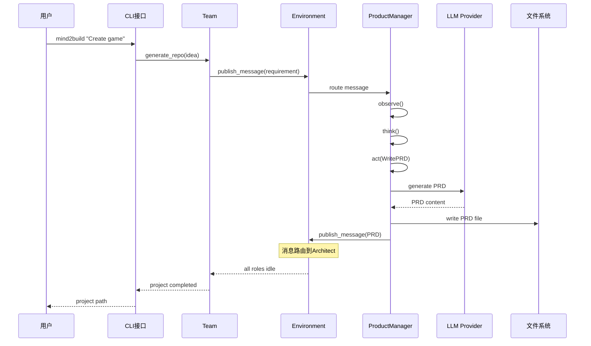

### 2.3 数据流架构

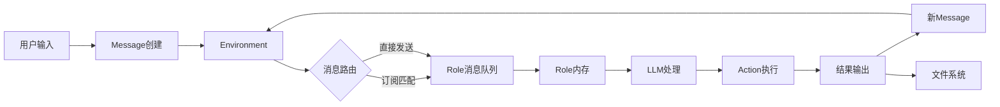

---

## 3. 核心模块详解

### 3.1 基础设施层

#### 3.1.1 消息系统 (Message System)

**设计目标**: 实现角色间解耦的通信机制

**核心类**:
```python
class Message(BaseModel):
    id: str                    # 消息唯一标识
    content: str               # 自然语言内容
    instruct_content: BaseModel # 结构化内容
    role: str                  # 角色类型
    cause_by: str              # 触发Action
    sent_from: str             # 发送者
    send_to: set[str]          # 接收者集合
    metadata: dict             # 元数据
```

**消息路由机制**:
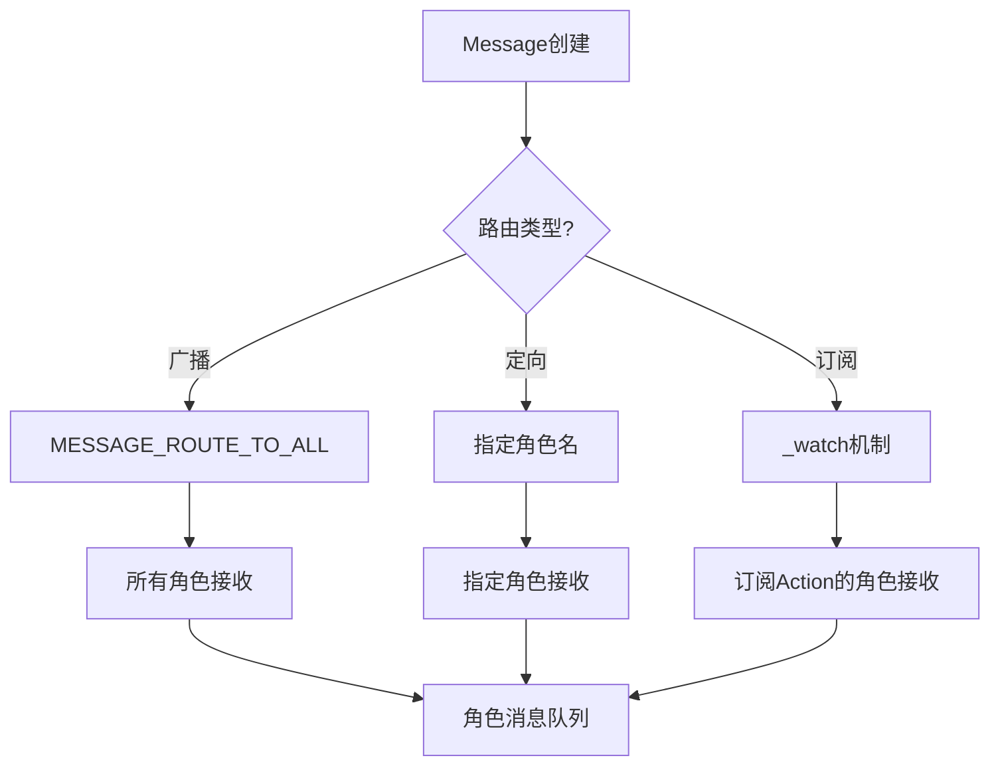

**关键方法**:
- `Environment.publishMessage(message: Message)`: 发布消息到环境并路由到匹配的角色
- `Role.putMessage(message: Message)`: 将消息放入角色的消息缓冲区（MessageQueue）
- `Role.observe()`: 观察并获取新消息（从 msgBuffer 移动到 news）
- `Environment.isMessageFor(message: Message, role: Role)`: 判断消息是否应该发送给某个角色

**消息路由规则**:
1. **广播消息** (`MESSAGE_ROUTE_TO_ALL`): 所有角色接收
2. **订阅机制** (`watch`): 角色通过 `watch([ACTION_NAME])` 订阅特定 Action 的消息
3. **直接发送**: 消息的 `sendTo` 包含角色的地址（角色名称）

#### 3.1.2 记忆系统 (Memory System)

**设计目标**: 为角色提供上下文记忆能力

**记忆类型**:

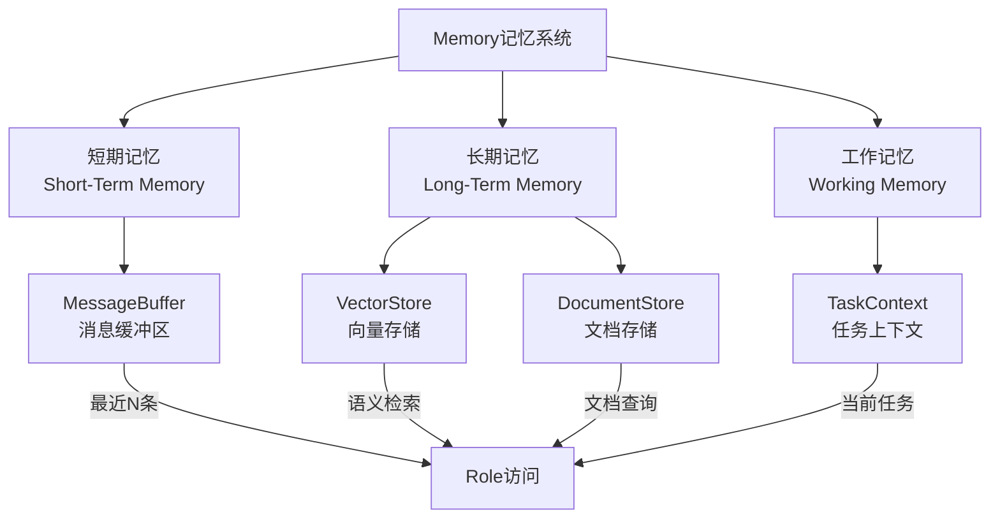

**核心类**:
```typescript
class Memory {
    private storage: Message[];     // 消息存储数组
    private maxSize: number;        // 最大存储数量（默认100）
    
    add(message: Message): void;   // 添加消息（自动截断到maxSize）
    get(k?: number): Message[];     // 获取所有消息或最近k条
    getByRole(role: string): Message[];  // 按角色筛选
    getByAction(actionType: string | Function): Message[];  // 按Action类型筛选
    getByActions(actionTypes: Array<string | Function>): Message[];  // 按多个Action类型筛选
    searchByContent(query: string): Message[];  // 按内容搜索
}

class ShortTermMemory extends Memory {
    // 工作记忆，默认保留最近10条消息
}
```

**存储策略**:
- **Memory**: 长期记忆，默认保留最近 100 条消息（可配置）
- **ShortTermMemory**: 工作记忆，默认保留最近 10 条消息
- **MessageQueue**: 消息缓冲区，用于异步消息传递
- 未来计划：向量数据库集成用于语义检索

#### 3.1.3 上下文管理 (Context)

**设计目标**: 管理全局配置和共享资源

**核心职责**:
```python
class Context(BaseModel):
    config: Config             # 全局配置
    cost_manager: CostManager  # 成本管理
    kwargs: AttrDict           # 动态属性
    _llm: BaseLLM             # LLM实例
    
    def llm(self) -> BaseLLM:
        """返回LLM实例"""
        
    def serialize(self) -> dict:
        """序列化上下文"""
```

**配置管理**:
```typescript
// config.ts
export interface LLMConfig {
  api_type: 'openai' | 'zhipuai' | 'ark' | 'cursor';
  model: string;
  api_key: string;
  base_url?: string;
}

export interface WorkspaceConfig {
  path: string;
}

export interface CostConfig {
  max_budget: number;
}

export const config = {
  llm: {
    api_type: process.env.LLM_PROVIDER || 'zhipuai',
    model: process.env.LLM_MODEL || 'glm-4-flash',
    api_key: process.env.ZHIPUAI_API_KEY || '',
  },
  workspace: {
    path: process.env.WORKSPACE_PATH || './workspace',
  },
  cost: {
    max_budget: parseFloat(process.env.MAX_BUDGET || '10.0'),
  },
};
```

### 3.2 角色层 (Role Layer)

#### 3.2.1 角色抽象

**设计模式**: 模板方法模式 + 策略模式

**类层次结构**:
```typescript
BaseRole (抽象基类)
  ├─ name: string
  ├─ profile: string
  ├─ isIdle: boolean
  ├─ observe(): Promise<number>  // 观察新消息
  ├─ think(): Promise<boolean>   // 思考决策
  ├─ act(): Promise<Message | null>  // 执行行动
  └─ run(): Promise<Message | null>  // 运行主循环

Role extends BaseRole (具体实现)
  ├─ goal: string
  ├─ constraints: string
  ├─ description: string
  ├─ actions: BaseAction[]
  ├─ rc: RoleContext
  ├─ context: Context
  ├─ watch(actions: string[]): void  // 订阅Action
  ├─ setActions(actions: BaseAction[]): void  // 设置Actions
  ├─ putMessage(message: Message): void  // 接收消息
  └─ getAddresses(): Set<string>  // 获取角色地址

ProductManager extends Role
Architect extends Role
Engineer extends Role
Salesperson extends Role
ProjectManager extends Role
QAEngineer extends Role
TeamLeader extends Role
DataAnalyst extends Role
```

**RoleContext (角色运行时上下文)**:
```typescript
class RoleContext {
    env?: Environment;              // 环境引用（由Environment设置）
    msgBuffer: MessageQueue;        // 消息缓冲区
    memory: Memory;                 // 长期记忆（默认100条）
    workingMemory: ShortTermMemory; // 工作记忆（默认10条）
    state: number;                  // 当前状态（-1=初始/终止）
    todo: BaseAction | null;        // 待执行的Action
    watch: Set<string>;             // 订阅的Action集合
    news: Message[];               // 新消息（临时存储）
    reactMode: RoleReactMode;       // React模式（默认BY_ORDER）
    maxReactLoop: number;           // 最大React循环次数（默认1）
}
```

**角色状态机**:
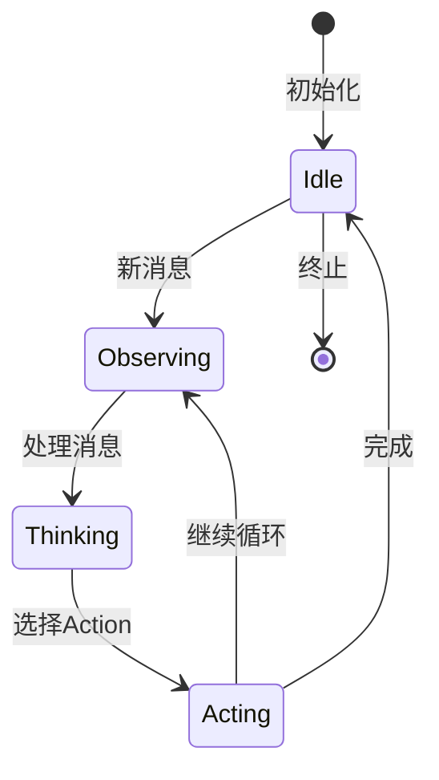

#### 3.2.2 React 模式

mind2build 支持三种 react 模式（通过 `RoleReactMode` 枚举）：

**1. REACT 模式** (标准 ReAct 循环)
```typescript
// LLM 动态选择 Action（当前未完全实现）
while actions_taken < max_react_loop:
    has_todo = await this.think();  // LLM 动态选择 Action
    if (!has_todo) break;
    await this.act();
    actions_taken++;
```

**2. BY_ORDER 模式** (按顺序执行，默认模式)
```typescript
// 按照 actions 列表顺序依次执行
this.setActions([new WritePRD(), new SearchEnhancedQA()]);
this.rc.reactMode = RoleReactMode.BY_ORDER;
// 每次 think() 会选择下一个未执行的 Action
```

**3. PLAN_AND_ACT 模式** (先规划后执行)
```typescript
// 先用 LLM 生成完整计划，再依次执行（未来实现）
const plan = await this.planner.plan();
for (const action of plan) {
    await action.run();
}
```

**当前实现**:
- 默认使用 `BY_ORDER` 模式
- `think()` 方法会根据 `reactMode` 选择下一个 Action
- 支持 `maxReactLoop` 控制最大执行次数（默认1）

#### 3.2.3 角色实现示例

**ProductManager**:
```typescript
class ProductManager extends Role {
    constructor(context: Context, name: string = 'ProductManager') {
        const config: IRoleConfig = {
            name,
            profile: 'ProductManager',
            goal: 'Create comprehensive Product Requirements Document (PRD) from Market Research Document (MRD)',
            constraints: 'Focus on user needs, market analysis, and clear feature specifications',
            description: 'Experienced product manager...',
        };
        
        super(config, context);
        
        // 订阅 WriteMRD action
        this.watch([ACTION_WRITE_MRD]);
        
        // 设置 Actions
        this.setActions([new WritePRD(), new SearchEnhancedQA()]);
    }
}
```

**Architect**:
```typescript
class Architect extends Role {
    constructor(context: Context, name: string = 'Architect') {
        const config: IRoleConfig = {
            name,
            profile: 'Architect',
            goal: 'Design comprehensive system architecture and technical specifications',
            constraints: 'Follow best practices, ensure scalability and maintainability',
            description: 'Senior architect who creates robust system designs',
        };
        
        super(config, context);
        
        // 订阅 WritePRD action
        this.watch([ACTION_WRITE_PRD]);
        
        // 设置 Actions
        this.setActions([new WriteDesign()]);
    }
}
```

### 3.3 行动层 (Action Layer)

#### 3.3.1 Action 抽象

**设计模式**: 命令模式

**核心接口**:
```typescript
abstract class BaseAction {
    name: string;              // Action 名称
    description?: string;      // Action 描述
    protected llm?: BaseLLM;   // LLM 实例（由Role注入）
    protected context?: Context; // Context 实例（由Role注入）
    
    abstract run(...args: any[]): Promise<IActionOutput>;
    
    // 辅助方法
    protected async aask(prompt: string, systemMsgs?: string[]): Promise<string>;
    protected async acompletion(messages: any[]): Promise<any>;
    protected async saveToWorkspace(filePath: string, content: string, options?: WorkspaceOptions): Promise<void>;
    protected getWorkspaceDir(options?: WorkspaceOptions): string;
    protected async readWorkspaceFile(filePath: string, options?: WorkspaceOptions): Promise<string | null>;
    // Git管理相关方法
    protected async initGitRepository(repoUrl?: string, options?: WorkspaceOptions): Promise<void>;
    protected async createVersionBranch(version: number, options?: WorkspaceOptions): Promise<void>;
    protected async commitToGit(message: string, options?: WorkspaceOptions): Promise<void>;
}
```

**Action 常量定义**:
```typescript
// shared/src/constants/index.ts
export const ACTION_WRITE_MRD = 'WriteMRD';
export const ACTION_WRITE_PRD = 'WritePRD';
export const ACTION_WRITE_DESIGN = 'WriteDesign';
export const ACTION_WRITE_CODE = 'WriteCode';
export const ACTION_WRITE_TEST = 'WriteTest';
export const ACTION_BREAKDOWN_TASKS = 'BreakdownTasks';
// ... 更多 Actions
```

#### 3.3.2 核心 Actions

**WritePRD** (编写产品需求文档):
```python
class WritePRD(Action):
    async def run(self, requirement: str) -> Document:
        # 1. 理解需求
        # 2. 构建 Prompt
        # 3. 调用 LLM 生成 PRD
        # 4. 格式化输出
        prompt = self._build_prompt(requirement)
        content = await self.llm.aask(prompt)
        return Document(filename="PRD.md", content=content)
```

**WriteDesign** (编写系统设计):
```python
class WriteDesign(Action):
    async def run(self, prd: Document) -> Document:
        # 1. 分析 PRD
        # 2. 设计系统架构
        # 3. 生成数据结构和API
        # 4. 输出设计文档
        pass
```

**WriteCode** (编写代码):
```python
class WriteCode(Action):
    async def run(self, design: Document) -> list[Document]:
        # 1. 解析设计文档
        # 2. 生成代码文件列表
        # 3. 为每个文件生成代码
        # 4. 返回代码文件集合
        pass
```

#### 3.3.3 ActionNode 树结构

ActionNode 支持构建复杂的任务树：

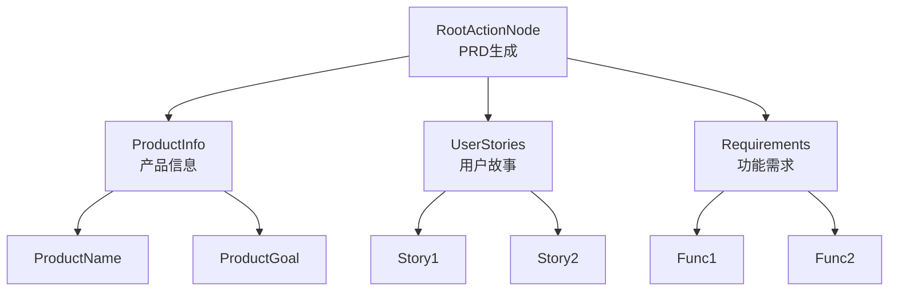

### 3.4 工作流编排层 (Workflow Layer)

#### 3.4.1 工作流引擎 (WorkflowEngine)

**职责**:
- 管理工作流的定义、执行和状态
- 处理多角色串联和输入输出映射
- 支持工作流的验证和优化

**核心方法**:
```typescript
class WorkflowEngine {
    private workflows: Map<string, Workflow>;
    
    createWorkflow(config: WorkflowConfig): Workflow;
    executeWorkflow(workflowId: string, input: any): Promise<any>;
    validateWorkflow(workflow: Workflow): ValidationResult;
    reorderSteps(workflowId: string, stepOrder: string[]): void;
    updateMapping(workflowId: string, stepId: string, mapping: IOMapping): void;
}
```

**工作流配置**:
```typescript
interface WorkflowConfig {
    name: string;
    description: string;
    chain: WorkflowStep[];
    version: string;
}

interface WorkflowStep {
    id: string;
    role: string;
    actions: string[];
    input: {
        source: string | string[];
        mapping: Record<string, string>;
    };
    output: {
        target: string | string[];
        mapping: Record<string, string>;
    };
    condition?: string;  // 可选执行条件
}
```

#### 3.4.2 可视化工作流设计器 (WorkflowDesigner)

**职责**:
- 提供拖拽式界面设计工作流
- 可视化编辑输入输出映射
- 实时预览工作流执行

**核心功能**:
- **拖拽式界面**: 直观拖拽角色节点
- **连线编辑**: 配置角色间的输入输出关系
- **顺序调整**: 拖拽调整角色执行顺序
- **映射编辑**: 可视化编辑数据映射
- **验证提示**: 实时验证工作流完整性

### 3.9 编排层 (Orchestration Layer)

#### 3.9.1 StateManager (状态管理器)

**职责**: 统一的状态管理入口

**核心功能**:
- 数据库作为单一数据源
- 状态读写统一入口
- 状态同步机制
- 回滚支持
- 位置: `backend/src/orchestration/StateManager.ts`

**关键方法**:
```typescript
class StateManager {
  async getState(projectId: string): Promise<WorkflowState>;
  async updateState(projectId: string, state: Partial<WorkflowState>): Promise<void>;
  async resetState(projectId: string, roleProfile?: string): Promise<void>;
  async syncRoleContext(projectId: string, roleProfile: string): Promise<void>;
}
```

#### 3.9.2 Environment (环境)

**职责**:
- 容器：管理多个 Role 实例
- 路由：分发消息到目标 Role
- 调度：协调 Role 的执行顺序

**核心方法**:
```typescript
class Environment {
    private roles: Map<string, Role>;  // 角色字典（key: 角色名称）
    private memberAddrs: Map<Role, Set<string>>;  // 角色地址映射
    public history: Message[];         // 消息历史
    private interactiveHandler?: InteractiveHandler;  // 交互式处理器
    
    addRoles(roles: Role[]): void;     // 添加角色到环境
    publishMessage(message: Message): boolean;  // 发布消息并路由
    async run(): Promise<void>;        // 运行所有活跃角色（一轮）
    async runForRounds(rounds: number): Promise<void>;  // 运行多轮
    get isIdle(): boolean;             // 检查所有角色是否空闲
    
    // 消息路由
    private isMessageFor(message: Message, role: Role): boolean {
        // 1. 广播消息：所有角色接收
        if (message.sendTo.has(MESSAGE_ROUTE_TO_ALL)) return true;
        
        // 2. 订阅机制：角色通过 watch 订阅特定 Action
        if (role.rc.watch.has(message.causeBy)) return true;
        
        // 3. 直接发送：消息的 sendTo 包含角色地址
        const addresses = role.getAddresses();
        return hasIntersection(message.sendTo, addresses);
    }
}
```

**执行模式**:
- **非交互模式**: 角色并行执行（`Promise.allSettled`）
- **交互模式**: 角色顺序执行，每个角色执行后等待用户确认

#### 3.9.3 Team (团队)

**职责**:
- 高层封装：提供简单的 API 接口
- 预算管理：控制 LLM 调用成本
- 项目管理：管理生成的项目文件
- 交互式模式：支持用户确认和编辑（通过 InteractiveHandler）

**交互式模式**:
- 支持 CLI 交互式确认（每个角色执行后等待用户确认）
- 支持 WebSocket 实时交互（通过 InteractiveSession）
- 用户操作：继续、编辑、重新生成、跳过、退出

**使用示例**:
```typescript
const context = new Context(config, maxBudget);
const team = new Team(context, interactive: false);
team.hire([
    new Salesperson(context),
    new ProductManager(context),
    new Architect(context),
    new Engineer(context)
]);
team.invest(10.0);  // 设置预算 $10
await team.run("Create a 2048 game", nRound: 5);
```

**成本管理**:
```typescript
class CostManager {
    totalPromptTokens: number = 0;
    totalCompletionTokens: number = 0;
    totalCost: number = 0.0;
    maxBudget: number = 10.0;
    
    updateCost(usage: ILLMUsage): void {
        // 更新Token和成本
        this.totalPromptTokens += usage.promptTokens || 0;
        this.totalCompletionTokens += usage.completionTokens || 0;
        this.totalCost += usage.cost || 0;
        
        if (this.totalCost >= this.maxBudget) {
            throw new NoMoneyException();
        }
    }
    
    getReport(): CostReport {
        return {
            totalCost: this.totalCost,
            totalTokens: this.totalPromptTokens + this.totalCompletionTokens,
            budgetRemaining: this.maxBudget - this.totalCost,
        };
    }
}
```

### 3.6 服务层 (Service Layer)

#### 3.6.1 核心服务列表

**WorkflowService** - 工作流配置和管理服务
- 管理工作流配置（创建、更新、删除）
- 获取默认工作流
- 工作流配置验证
- 位置: `backend/src/services/WorkflowService.ts`

**RAGService** - 检索增强生成服务
- Qdrant向量数据库集成
- 向量搜索和语义检索
- Rerank结果重排序
- 混合搜索（关键词+向量）
- 自动文档索引
- 位置: `backend/src/services/RAGService.ts`

**EmbeddingService** - 向量嵌入生成服务
- 支持多种embedding提供商（OpenAI, ZhipuAI, ARK）
- 文本向量化
- 批量处理
- 位置: `backend/src/services/EmbeddingService.ts`

**QdrantService** - Qdrant向量数据库服务
- 集合管理
- 向量存储和检索
- 批量操作
- 位置: `backend/src/services/QdrantService.ts`

**RerankService** - 结果重排序服务
- 交叉编码器重排序
- 提升检索结果相关性
- 位置: `backend/src/services/RerankService.ts`

**RoleActionFactory** - 角色和Action工厂
- 从数据库动态创建角色实例
- 从数据库动态创建Action实例
- 支持角色特定配置
- 位置: `backend/src/services/RoleActionFactory.ts`

**RoleActionService** - 角色Action管理服务
- 角色和Action元数据管理
- 角色Action关联查询
- 位置: `backend/src/services/RoleActionService.ts`

**SectionAdjustService** - 章节调整服务
- PRD/MRD章节调整
- 对话历史管理
- Workspace集成
- 位置: `backend/src/services/SectionAdjustService.ts`

**StagehandService** - Stagehand集成服务
- Stagehand API集成
- 代码生成和执行
- 位置: `backend/src/services/StagehandService.ts`

**DocumentArchiveService** - 文档归档服务
- 文档归档和版本管理
- 位置: `backend/src/services/DocumentArchiveService.ts`

**GitService** - Git仓库管理服务
- Git仓库初始化
- 版本分支管理
- 提交和推送
- 位置: `backend/src/services/GitService.ts`

#### 3.6.2 知识库系统 (Knowledge Base System)

**设计目标**: 通过RAG技术为角色提供上下文知识支持，确保完整迭代产出

**核心组件**:
```typescript
class KnowledgeBase {
    applicationId: string;
    version: string;
    documents: DocumentRepository;      // 文档知识库（数据库存储）
    knowledgeFiles: FileStorage;        // 知识文件（文件存储，CLI输入）
    vectorStore: QdrantService;         // 向量数据库（Qdrant）
    embeddingService: EmbeddingService; // 向量嵌入服务
    rerankService: RerankService;       // 重排序服务
    retrievalConfig: RetrievalConfig;   // 检索配置
}
```

**知识库类型**:
- **文档知识库**: 技术文档、规范、最佳实践（Markdown, PDF, Word）
- **代码仓库**: Git仓库或本地代码仓库（GitHub, GitLab, Gitee）
- **API文档库**: API文档、接口规范（OpenAPI, GraphQL Schema）
- **设计规范库**: UI/UX设计规范、组件库文档
- **测试用例库**: 测试用例、测试策略

#### 3.6.2 RAG检索机制

**检索流程**:
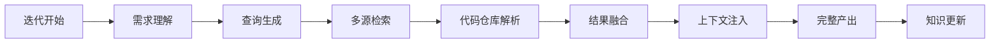

**检索优化**:
- **语义检索**: 向量数据库语义相似度匹配
- **代码仓库索引**: 代码结构分析和索引
- **关键词检索**: 结合传统关键词检索
- **重排序**: 交叉编码器重排序
- **上下文感知**: 根据任务类型调整检索策略

#### 3.6.3 知识库管理

**自动更新模式**:
- 每次迭代完成后自动提取产出
- 自动向量化和索引化
- 增量更新，避免重复内容

**版本管理**:
- 支持知识库版本控制
- 支持代码仓库版本管理（Git分支、标签）
- 支持回滚到历史版本
- 支持版本差异对比

### 3.7 执行器层 (Executor Layer)

#### 3.7.1 LLMExecutor

**职责**: 基于LLM的Action执行

**核心功能**:
- LLM调用封装
- Token使用统计
- 错误处理和重试
- 超时控制
- 位置: `backend/src/executors/LLMExecutor.ts`

#### 3.7.2 CLIExecutor

**职责**: 基于CLI工具的Action执行

**支持的CLI提供商**:
- **AiderCLIProvider**: Aider CLI集成
- **CursorCLIProvider**: Cursor Agent CLI集成

**核心功能**:
- CLI命令执行
- 输出解析
- 错误处理
- 超时控制
- 位置: `backend/src/executors/CLIExecutor.ts`

**CLI提供商工厂**:
- 动态创建CLI提供商实例
- 支持多种CLI工具
- 位置: `backend/src/executors/cli/CLIProviderFactory.ts`

### 3.8 提供商层 (Provider Layer)

#### 3.8.1 LLM 抽象层

**设计模式**: 工厂模式 + 策略模式

**类层次结构**:
```typescript
abstract class BaseLLM {
    config: ILLMConfig;
    costManager?: CostManager;
    
    abstract async aask(prompt: string, systemMsgs?: string[]): Promise<string>;
    abstract async acompletion(messages: any[]): Promise<ILLMResponse>;
    abstract async achat(messages: any[]): Promise<ILLMResponse>;
}

OpenAILLM extends BaseLLM
ZhipuLLM extends BaseLLM
ArkLLM extends BaseLLM
CursorLLM extends BaseLLM
```

**LLM 工厂**:
```typescript
export function createLLM(config: ILLMConfig): BaseLLM {
    switch (config.provider) {
        case 'openai':
            return new OpenAILLM(config);
        case 'zhipuai':
            return new ZhipuLLM(config);
        case 'ark':
            return new ArkLLM(config);
        case 'cursor':
            return new CursorLLM(config);
        default:
            throw new Error(`Unsupported LLM provider: ${config.provider}`);
    }
}
```

**统一接口**:
```typescript
abstract class BaseLLM {
    config: ILLMConfig;
    costManager?: CostManager;
    
    abstract async aask(
        prompt: string,
        systemMsgs?: string[]
    ): Promise<string>;
    
    abstract async acompletion(
        messages: any[],
        timeout?: number
    ): Promise<ILLMResponse>;
    
    abstract async achat(
        messages: any[]
    ): Promise<ILLMResponse>;
}
```

#### 3.8.2 多 LLM 支持

**支持的提供商**:

| 提供商 | Provider | 实现类 | 状态 |
|--------|----------|--------|------|
| OpenAI | openai | OpenAILLM | ✅ 已实现 |
| 智谱AI | zhipuai | ZhipuLLM | ✅ 已实现 |
| Ark | ark | ArkLLM | ✅ 已实现 |
| Cursor Agent | cursor | CursorLLM | ✅ 已实现 |
| Anthropic | anthropic | - | ⏳ 计划中 |
| Google Gemini | gemini | - | ⏳ 计划中 |
| 百度千帆 | qianfan | - | ⏳ 计划中 |
| 阿里通义 | dashscope | - | ⏳ 计划中 |
| Ollama | ollama | - | ⏳ 计划中 |

**配置管理**:
- LLM 配置存储在 PostgreSQL 数据库的 `llm_configs` 表中
- 支持系统默认配置和角色特定配置
- 配置包含：`provider`, `model`, `apiKey`, `baseURL`, `temperature`, `maxTokens` 等
- 配置优先级：角色特定配置 > 系统默认配置

#### 3.8.3 工具层

**Browser** (浏览器工具):
```python
class Browser:
    async def browse(self, url: str) -> str:
        """访问网页并返回内容"""
        
    async def search(self, query: str) -> list[str]:
        """搜索并返回结果链接"""
```

**Editor** (编辑器工具):
```python
class Editor:
    async def write(self, file_path: str, content: str):
        """写入文件"""
        
    async def read(self, file_path: str) -> str:
        """读取文件"""
        
    async def similarity_search(self, query: str) -> list[str]:
        """语义搜索文件内容"""
```

**Terminal** (终端工具):
```python
class Terminal:
    async def run_command(self, command: str) -> str:
        """执行命令并返回输出"""
```

---

## 4. 数据库设计

### 4.1 数据库架构

**数据库类型**: PostgreSQL v14+

**设计原则**:
- **可扩展性**: 支持水平扩展和分表
- **性能优化**: 合理的索引和分区策略
- **数据完整性**: 外键约束和数据验证
- **审计追踪**: 记录创建和更新时间
- **软删除**: 重要数据不物理删除

### 4.2 核心表结构

#### 4.2.1 用户相关表

**users (用户表)**:
```sql
CREATE TABLE users (
    id UUID PRIMARY KEY DEFAULT gen_random_uuid(),
    username VARCHAR(50) NOT NULL UNIQUE,
    email VARCHAR(100) NOT NULL UNIQUE,
    password_hash VARCHAR(255) NOT NULL,
    full_name VARCHAR(100),
    avatar_url VARCHAR(500),
    api_keys JSONB DEFAULT '{}',  -- 存储各种 LLM API Keys (加密)
    config JSONB DEFAULT '{}',     -- 用户配置
    status VARCHAR(20) DEFAULT 'active',
    created_at TIMESTAMP DEFAULT NOW(),
    updated_at TIMESTAMP DEFAULT NOW(),
    last_login_at TIMESTAMP,
    deleted_at TIMESTAMP
);
```

**applications (应用表)**:
```sql
CREATE TABLE applications (
    id UUID PRIMARY KEY DEFAULT gen_random_uuid(),
    user_id UUID NOT NULL REFERENCES users(id) ON DELETE CASCADE,
    name VARCHAR(200) NOT NULL,
    description TEXT,
    metadata JSONB DEFAULT '{}',
    created_at TIMESTAMP DEFAULT NOW(),
    updated_at TIMESTAMP DEFAULT NOW(),
    deleted_at TIMESTAMP
);
```

#### 4.2.2 项目相关表

**projects (项目表)**:
```sql
CREATE TABLE projects (
    id UUID PRIMARY KEY DEFAULT gen_random_uuid(),
    user_id UUID NOT NULL REFERENCES users(id) ON DELETE CASCADE,
    application_id UUID REFERENCES applications(id) ON DELETE SET NULL,
    name VARCHAR(200) NOT NULL,
    idea TEXT NOT NULL,
    description TEXT,
    status VARCHAR(50) DEFAULT 'pending',  -- pending, running, completed, failed, cancelled
    metadata JSONB DEFAULT '{}',
    created_at TIMESTAMP DEFAULT NOW(),
    updated_at TIMESTAMP DEFAULT NOW(),
    deleted_at TIMESTAMP
);
```

**teams (团队表)**:
```sql
CREATE TABLE teams (
    id UUID PRIMARY KEY DEFAULT gen_random_uuid(),
    project_id UUID NOT NULL REFERENCES projects(id) ON DELETE CASCADE,
    user_id UUID NOT NULL REFERENCES users(id) ON DELETE CASCADE,
    investment DECIMAL(10, 2) DEFAULT 10.0,
    status VARCHAR(50) DEFAULT 'idle',
    config JSONB DEFAULT '{}',
    state JSONB DEFAULT '{}',  -- 序列化的团队状态
    created_at TIMESTAMP DEFAULT NOW(),
    updated_at TIMESTAMP DEFAULT NOW()
);
```

#### 4.2.3 角色和消息表

**roles (角色表)**:
```sql
CREATE TABLE roles (
    id UUID PRIMARY KEY DEFAULT gen_random_uuid(),
    team_id UUID NOT NULL REFERENCES teams(id) ON DELETE CASCADE,
    name VARCHAR(100) NOT NULL,
    profile VARCHAR(100) NOT NULL,  -- ProductManager, Architect, etc.
    goal TEXT,
    constraints TEXT,
    state JSONB DEFAULT '{}',
    actions_list JSONB DEFAULT '[]',
    watch_actions JSONB DEFAULT '[]',
    created_at TIMESTAMP DEFAULT NOW(),
    updated_at TIMESTAMP DEFAULT NOW()
);
```

**messages (消息表)**:
```sql
CREATE TABLE messages (
    id UUID PRIMARY KEY DEFAULT gen_random_uuid(),
    project_id UUID NOT NULL REFERENCES projects(id) ON DELETE CASCADE,
    role_id VARCHAR(100),  -- 角色类型 (profile): ProductManager, Architect, Engineer, QAEngineer, TeamLeader, Salesperson, DataAnalyst, user表示用户消息
    message_uuid VARCHAR(36) UNIQUE NOT NULL,  -- Message对象的UUID
    content TEXT NOT NULL,
    instruct_content JSONB,
    role_type VARCHAR(50) DEFAULT 'user',  -- system, user, assistant
    cause_by VARCHAR(100),  -- Action类名
    sent_from VARCHAR(100),
    send_to JSONB DEFAULT '[]',  -- 接收者集合
    metadata JSONB DEFAULT '{}',
    created_at TIMESTAMP DEFAULT NOW()
);
```

#### 4.2.4 行动和文档表

**actions (行动表)**:
```sql
CREATE TABLE actions (
    id UUID PRIMARY KEY DEFAULT gen_random_uuid(),
    role_id UUID NOT NULL REFERENCES roles(id) ON DELETE CASCADE,
    message_id UUID REFERENCES messages(id) ON DELETE SET NULL,
    action_type VARCHAR(100) NOT NULL,  -- WritePRD, WriteCode, etc.
    input_data JSONB DEFAULT '{}',
    output_data JSONB DEFAULT '{}',
    status VARCHAR(50) DEFAULT 'pending',  -- pending, completed, failed
    duration INTEGER,  -- 执行时间（毫秒）
    created_at TIMESTAMP DEFAULT NOW()
);
```

**documents (文档表)**:
```sql
CREATE TABLE documents (
    id UUID PRIMARY KEY DEFAULT gen_random_uuid(),
    project_id UUID NOT NULL REFERENCES projects(id) ON DELETE CASCADE,
    filename VARCHAR(500) NOT NULL,
    doc_type VARCHAR(50),  -- PRD, MRD, DESIGN, CODE, TEST, etc.
    content TEXT,
    storage_path VARCHAR(1000),
    version INTEGER DEFAULT 1,
    is_deleted BOOLEAN DEFAULT FALSE,
    parent_id UUID REFERENCES documents(id) ON DELETE SET NULL,
    created_at TIMESTAMP DEFAULT NOW()
);
```

#### 4.2.5 成本和知识库表

**cost_records (成本记录表)**:
```sql
CREATE TABLE cost_records (
    id UUID PRIMARY KEY DEFAULT gen_random_uuid(),
    project_id UUID NOT NULL REFERENCES projects(id) ON DELETE CASCADE,
    role_id UUID REFERENCES roles(id) ON DELETE SET NULL,
    model VARCHAR(100),
    prompt_tokens INTEGER DEFAULT 0,
    completion_tokens INTEGER DEFAULT 0,
    total_tokens INTEGER DEFAULT 0,
    cost DECIMAL(10, 6) DEFAULT 0.0,
    created_at TIMESTAMP DEFAULT NOW()
);
```

**llm_configs (LLM配置表)**:
```sql
CREATE TABLE llm_configs (
    id UUID PRIMARY KEY DEFAULT gen_random_uuid(),
    user_id UUID REFERENCES users(id) ON DELETE CASCADE,
    role_name VARCHAR(100),  -- 角色特定配置，NULL表示系统默认配置
    provider VARCHAR(50) NOT NULL,  -- openai, zhipuai, ark, cursor
    model VARCHAR(100) NOT NULL,
    api_key VARCHAR(500),  -- 加密存储
    base_url VARCHAR(500),
    temperature DECIMAL(3, 2) DEFAULT 0.7,
    max_tokens INTEGER DEFAULT 8000,
    is_default BOOLEAN DEFAULT FALSE,
    created_at TIMESTAMP DEFAULT NOW(),
    updated_at TIMESTAMP DEFAULT NOW()
);
```

**prompts (提示词表)**:
```sql
CREATE TABLE prompts (
    id UUID PRIMARY KEY DEFAULT gen_random_uuid(),
    user_id UUID REFERENCES users(id) ON DELETE CASCADE,
    prompt_type VARCHAR(50) NOT NULL,  -- mrd, prd, design, code, test
    prompt_name VARCHAR(100) NOT NULL,  -- system_prompt, user_prompt, etc.
    content TEXT NOT NULL,
    version INTEGER DEFAULT 1,
    is_active BOOLEAN DEFAULT TRUE,
    created_at TIMESTAMP DEFAULT NOW(),
    updated_at TIMESTAMP DEFAULT NOW(),
    UNIQUE(user_id, prompt_type, prompt_name, version)
);
```

### 4.3 索引设计

**单列索引**:
```sql
-- 用户表索引
CREATE INDEX idx_users_username ON users(username);
CREATE INDEX idx_users_email ON users(email);
CREATE INDEX idx_users_status ON users(status);

-- 项目表索引
CREATE INDEX idx_projects_user_id ON projects(user_id);
CREATE INDEX idx_projects_application_id ON projects(application_id);
CREATE INDEX idx_projects_status ON projects(status);
CREATE INDEX idx_projects_created_at ON projects(created_at DESC);

-- 消息表索引
CREATE INDEX idx_messages_project_id ON messages(project_id);
CREATE INDEX idx_messages_role_id ON messages(role_id);
CREATE INDEX idx_messages_cause_by ON messages(cause_by);
CREATE INDEX idx_messages_created_at ON messages(created_at DESC);

-- 文档表索引
CREATE INDEX idx_documents_project_id ON documents(project_id);
CREATE INDEX idx_documents_doc_type ON documents(doc_type);
CREATE INDEX idx_documents_is_deleted ON documents(is_deleted);
```

**复合索引**:
```sql
-- 项目消息查询优化
CREATE INDEX idx_messages_project_time ON messages(project_id, created_at DESC);

-- 角色行动查询
CREATE INDEX idx_actions_role_status ON actions(role_id, status);

-- 成本分析
CREATE INDEX idx_cost_project_model ON cost_records(project_id, model, created_at);
```

### 4.4 ER 关系图

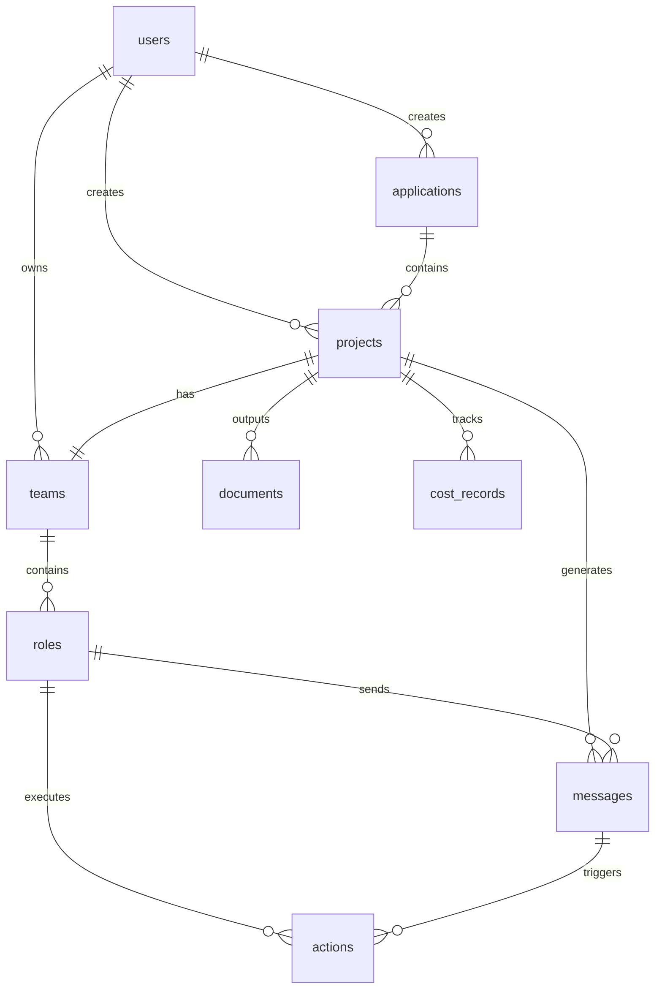

---

## 5. 接口设计

### 5.1 REST API 设计

#### 5.1.1 API 基础信息

**Base URL**: `http://localhost:3000/api`

**Content-Type**: `application/json`

**认证方式**: JWT Token（可选，MVP阶段可跳过）

**版本控制**: URL路径版本控制 `/api/v1/...`

#### 5.1.2 Git仓库管理接口

**Git仓库初始化**:
```http
POST /api/v1/projects/{projectId}/git/init
Content-Type: application/json

{
  "repositoryUrl": "https://github.com/user/project.git",
  "version": 1
}
```

**创建版本分支**:
```http
POST /api/v1/projects/{projectId}/git/branch
Content-Type: application/json

{
  "version": 2,
  "baseBranch": "main"
}
```

**提交到Git仓库**:
```http
POST /api/v1/projects/{projectId}/git/commit
Content-Type: application/json

{
  "message": "feat: 生成v1版本文档和代码",
  "version": 1
}
```

#### 5.1.3 项目管理接口

**创建项目**:
```http
POST /api/v1/projects
Content-Type: application/json

{
  "name": "项目名称",
  "idea": "项目需求描述",
  "description": "项目描述（可选）",
  "applicationId": "应用ID（可选）",
  "version": 1,
  "investment": 10.0,
  "nRound": 5,
  "interactive": false,
  "knowledgeBase": {
    "documents": ["./knowledge/tech-specs"],
    "codeRepository": {
      "type": "git",
      "url": "https://github.com/company/repo"
    }
  }
}

Response: 201 Created
{
  "success": true,
  "project": {
    "id": "uuid",
    "name": "项目名称",
    "status": "pending",
    "createdAt": "2025-12-25T00:00:00Z"
  }
}
```

**获取项目列表**:
```http
GET /api/v1/projects?page=1&limit=10&applicationId=xxx

Response: 200 OK
{
  "success": true,
  "data": [...],
  "total": 100,
  "page": 1,
  "limit": 10
}
```

**获取项目详情**:
```http
GET /api/v1/projects/:id

Response: 200 OK
{
  "success": true,
  "project": {
    "id": "uuid",
    "name": "项目名称",
    "status": "completed",
    "documents": [...],
    "messages": [...],
    "totalCost": 2.5
  }
}
```

**启动项目**:
```http
POST /api/v1/projects/:id/start

Response: 200 OK
{
  "success": true,
  "message": "Project started"
}
```

#### 5.1.3 交互式会话接口

**创建交互式会话**:
```http
POST /api/v1/projects/interactive
Content-Type: application/json

{
  "name": "项目名称",
  "idea": "项目需求",
  "investment": 10.0,
  "nRound": 5
}

Response: 201 Created
{
  "success": true,
  "sessionId": "uuid",
  "projectId": "uuid",
  "wsUrl": "ws://localhost:3000/api/interactive/:sessionId"
}
```

**发送用户操作**:
```http
POST /api/v1/interactive/:sessionId/action
Content-Type: application/json

{
  "action": "continue",  // continue, edit, regenerate, skip, quit
  "modifiedContent": "修改后的内容（可选，edit时必需）"
}

Response: 200 OK
{
  "success": true,
  "message": "Action processed successfully"
}
```

#### 5.1.4 工作流接口

**创建工作流**:
```http
POST /api/v1/workflow/create
Content-Type: application/json

{
  "name": "自定义串联工作流",
  "description": "ProductManager -> Architect -> Engineer",
  "chain": [
    {
      "id": "step1",
      "role": "ProductManager",
      "actions": ["WritePRD"],
      "input": {
        "source": "user",
        "mapping": {
          "idea": "${user.idea}"
        }
      },
      "output": {
        "target": "step2",
        "mapping": {
          "prd": "${output.prd}"
        }
      }
    }
  ]
}

Response: 201 Created
{
  "success": true,
  "workflowId": "uuid"
}
```

**执行工作流**:
```http
POST /api/v1/workflow/execute
Content-Type: application/json

{
  "workflowId": "uuid",
  "input": {
    "idea": "Create a todo app"
  }
}

Response: 200 OK
{
  "success": true,
  "result": {...}
}
```

**调整工作流顺序**:
```http
PUT /api/v1/workflow/:workflowId/reorder
Content-Type: application/json

{
  "stepOrder": ["step1", "step3", "step2"]
}

Response: 200 OK
{
  "success": true
}
```

#### 5.1.5 角色调试接口

**角色独立调试**:
```http
POST /api/v1/role/debug
Content-Type: application/json

{
  "roleName": "ProductManager",
  "input": {
    "mrd": "...",
    "context": {...}
  },
  "options": {
    "breakpoints": ["WritePRD"],
    "verbose": true,
    "saveLogs": true
  }
}

Response: 200 OK
{
  "success": true,
  "sessionId": "uuid",
  "result": {...},
  "logs": [...],
  "metrics": {...}
}
```

**获取调试日志**:
```http
GET /api/v1/role/:roleName/logs?sessionId=xxx

Response: 200 OK
{
  "success": true,
  "logs": [...]
}
```

#### 5.1.6 知识库接口

**关联知识库**:
```http
POST /api/v1/projects/:projectId/knowledge-base
Content-Type: application/json

{
  "documents": ["./knowledge/tech-specs"],
  "codeRepository": {
    "type": "git",
    "url": "https://github.com/company/repo",
    "branch": "main"
  },
  "apis": ["./knowledge/api/payment.ts"]  // TypeScript配置文件
}

Response: 200 OK
{
  "success": true
}
```

**检索知识库**:
```http
POST /api/v1/knowledge-base/search
Content-Type: application/json

{
  "applicationId": "xxx",
  "query": "支付模块设计",
  "topK": 5
}

Response: 200 OK
{
  "success": true,
  "results": [...]
}
```

### 5.2 WebSocket API 设计

#### 5.2.1 连接方式

**连接URL**: `ws://localhost:3000/api/interactive/:sessionId`

**连接参数**:
- `sessionId`: 会话ID（必需）

**连接示例**:
```typescript
const ws = new WebSocket('ws://localhost:3000/api/interactive/:sessionId');

ws.on('open', () => {
  console.log('WebSocket connected');
});

ws.on('message', (data) => {
  const message = JSON.parse(data);
  handleMessage(message);
});

ws.on('error', (error) => {
  console.error('WebSocket error:', error);
});
```

#### 5.2.2 消息格式

**服务端 -> 客户端消息类型**:

**角色开始工作**:
```typescript
{
  type: 'role_start',
  data: {
    role: 'ProductManager',
    action: 'WritePRD',
    timestamp: '2025-12-25T00:00:00Z'
  }
}
```

**需要确认**:
```typescript
{
  type: 'confirmation_required',
  data: {
    role: 'ProductManager',
    action: 'WritePRD',
    content: '生成的内容...',
    outputFiles: [
      { path: 'PRD.md', content: '...' }
    ],
    timestamp: '2025-12-25T00:00:00Z'
  }
}
```

**进度更新**:
```typescript
{
  type: 'progress',
  data: {
    currentRound: 1,
    totalRounds: 5,
    totalCost: 0.15,
    message: '正在执行...',
    timestamp: '2025-12-25T00:00:00Z'
  }
}
```

**Agent输出**:
```typescript
{
  type: 'agent_output',
  data: {
    id: 'message-uuid',
    role: 'Salesperson',
    action: 'WriteMRD',
    content: '消息内容',
    files: ['MRD.md'],
    timestamp: '2025-12-25T00:00:00Z'
  }
}
```

**完成**:
```typescript
{
  type: 'completed',
  data: {
    projectId: 'project-uuid',
    summary: {
      totalSteps: 3,
      totalCost: 0.45,
      duration: 180000
    },
    timestamp: '2025-12-25T00:00:00Z'
  }
}
```

**错误**:
```typescript
{
  type: 'error',
  data: {
    message: '错误信息',
    code: 'ERROR_CODE',
    timestamp: '2025-12-25T00:00:00Z'
  }
}
```

**客户端 -> 服务端消息类型**:

**用户操作**:
```typescript
{
  type: 'user_action',
  action: 'continue' | 'edit' | 'regenerate' | 'skip' | 'quit',
  modifiedContent?: string  // 仅 edit 时提供
}
```

### 5.3 配置管理（TypeScript格式）

#### 5.3.1 系统配置

**config.ts**:
```typescript
// backend/src/config/config.ts
export interface SystemConfig {
  server: {
    port: number;
    host: string;
  };
  database: {
    host: string;
    port: number;
    database: string;
    username: string;
    password: string;
    ssl?: boolean;
  };
  llm: {
    defaultProvider: 'openai' | 'zhipuai' | 'ark' | 'cursor';
    defaultModel: string;
    timeout: number;
    maxRetries: number;
  };
  workspace: {
    path: string;
    maxSize: number;
  };
  cost: {
    defaultBudget: number;
    warningThreshold: number;
  };
}

export const defaultConfig: SystemConfig = {
  server: {
    port: 3000,
    host: '0.0.0.0',
  },
  database: {
    host: process.env.DB_HOST || 'localhost',
    port: parseInt(process.env.DB_PORT || '5432'),
    database: process.env.DB_NAME || 'mind2build_db',
    username: process.env.DB_USER || 'postgres',
    password: process.env.DB_PASSWORD || '',
  },
  llm: {
    defaultProvider: (process.env.LLM_PROVIDER as any) || 'zhipuai',
    defaultModel: process.env.LLM_MODEL || 'glm-4-flash',
    timeout: parseInt(process.env.REQUEST_TIMEOUT || '300000'),
    maxRetries: 3,
  },
  workspace: {
    path: process.env.WORKSPACE_PATH || './workspace',
    maxSize: 10 * 1024 * 1024 * 1024, // 10GB
  },
  cost: {
    defaultBudget: parseFloat(process.env.DEFAULT_BUDGET || '10.0'),
    warningThreshold: 0.8,
  },
};
```

#### 5.3.2 工作流配置

**workflow.config.ts**:
```typescript
// backend/src/config/workflow.config.ts
export interface WorkflowStepConfig {
  id: string;
  role: string;
  actions: string[];
  input: {
    source: string | string[];
    mapping: Record<string, string>;
  };
  output: {
    target: string | string[];
    mapping: Record<string, string>;
  };
  condition?: string;
}

export interface WorkflowConfig {
  name: string;
  description: string;
  version: string;
  chain: WorkflowStepConfig[];
}

export const defaultWorkflowConfig: WorkflowConfig = {
  name: '标准软件开发流程',
  description: 'Salesperson -> ProductManager -> Architect -> Engineer -> QAEngineer',
  version: '1.0',
  chain: [
    {
      id: 'step1',
      role: 'Salesperson',
      actions: ['WriteMRD'],
      input: {
        source: 'user',
        mapping: {
          idea: '${user.idea}',
        },
      },
      output: {
        target: 'step2',
        mapping: {
          mrd: '${output.mrd}',
        },
      },
    },
    // ... 更多步骤
  ],
};
```

#### 5.3.3 知识库配置

**knowledge-base.config.ts**:
```typescript
// backend/src/config/knowledge-base.config.ts
export interface CodeRepositoryConfig {
  name: string;
  type: 'git' | 'local';
  url?: string;
  path?: string;
  branch?: string;
  languages?: string[];
  extractPatterns?: boolean;
  sync?: boolean;
}

export interface KnowledgeBaseConfig {
  applicationId: string;
  version: string;
  documents?: Array<{
    name: string;
    path: string;
    type: string;
  }>;
  codeRepository?: CodeRepositoryConfig;
  apis?: Array<{
    name: string;
    path: string;
    type: string;
  }>;
  retrieval: {
    topK: number;
    threshold: number;
    rerank: boolean;
  };
}

export const defaultKnowledgeBaseConfig: Partial<KnowledgeBaseConfig> = {
  retrieval: {
    topK: 5,
    threshold: 0.7,
    rerank: true,
  },
};
```

---

## 6. 前后端方案设计

### 6.1 目录结构

#### 6.1.1 后端目录结构

```
backend/
├── src/
│   ├── actions/              # 行动系统
│   │   ├── WriteMRD.ts
│   │   ├── WritePRD.ts
│   │   ├── WriteDesign.ts
│   │   ├── WriteCode.ts
│   │   └── ...
│   ├── api/                  # API层
│   │   ├── controllers/      # 控制器
│   │   │   ├── ProjectController.ts
│   │   │   ├── ApplicationController.ts
│   │   │   ├── PRDController.ts
│   │   │   ├── MRDController.ts
│   │   │   ├── LLMConfigController.ts
│   │   │   └── ...
│   │   ├── routes/           # 路由定义
│   │   │   ├── index.ts
│   │   │   ├── projects.ts
│   │   │   ├── applications.ts
│   │   │   ├── interactive.ts
│   │   │   └── config.ts
│   │   ├── middleware/       # 中间件
│   │   │   └── auth.ts
│   │   ├── websocket.ts      # WebSocket服务
│   │   └── index.ts          # API入口
│   ├── core/                 # 核心模块
│   │   ├── base/             # 基础类
│   │   │   ├── BaseRole.ts
│   │   │   └── BaseAction.ts
│   │   ├── context/          # 上下文管理
│   │   │   └── Context.ts
│   │   ├── message/          # 消息系统
│   │   │   └── Message.ts
│   │   └── memory/           # 记忆系统
│   │       └── Memory.ts
│   ├── database/             # 数据库层
│   │   ├── client.ts         # 数据库客户端
│   │   ├── repositories/     # 数据仓库
│   │   │   ├── ProjectRepository.ts
│   │   │   ├── DocumentRepository.ts
│   │   │   └── ...
│   │   └── migrations/       # 数据库迁移
│   │       └── 001_initial.sql
│   ├── orchestration/        # 编排层
│   │   ├── Team.ts
│   │   ├── Environment.ts
│   │   └── InteractiveSession.ts
│   ├── providers/            # 提供商层
│   │   └── llm/              # LLM提供商
│   │       ├── BaseLLM.ts
│   │       ├── OpenAILLM.ts
│   │       ├── ZhipuLLM.ts
│   │       └── factory.ts
│   ├── roles/                # 角色实现
│   │   ├── Role.ts
│   │   ├── ProductManager.ts
│   │   ├── Architect.ts
│   │   ├── Engineer.ts
│   │   └── ...
│   ├── services/             # 服务层
│   │   ├── RAGService.ts     # RAG检索服务
│   │   └── ...
│   ├── utils/                # 工具函数
│   │   ├── WorkspaceManager.ts
│   │   ├── GitManager.ts     # Git仓库管理
│   │   └── ...
│   ├── server.ts             # 服务器入口
│   └── index.ts              # 应用入口
├── dist/                     # 编译输出
├── tests/                    # 测试文件
├── package.json
├── tsconfig.json
└── README.md
```

#### 6.1.2 前端目录结构

```
frontend/
├── src/
│   ├── api/                  # API客户端
│   │   └── client.ts         # Axios客户端封装
│   ├── components/           # 可复用组件
│   │   ├── InteractiveConfirmation.vue  # 交互确认组件
│   │   └── SectionAdjuster.vue         # 章节调整组件
│   ├── router/               # 路由配置
│   │   └── index.ts
│   ├── stores/               # Pinia状态管理
│   │   ├── project.ts        # 项目状态
│   │   └── application.ts   # 应用状态
│   ├── views/                # 页面组件
│   │   ├── Dashboard.vue              # 控制面板
│   │   ├── ProjectCreate.vue          # 创建项目
│   │   ├── ProjectDetail.vue          # 项目详情
│   │   ├── ProjectInteractive.vue     # 交互式项目生成
│   │   ├── ApplicationList.vue        # 应用列表
│   │   ├── ApplicationDetail.vue      # 应用详情
│   │   ├── LLMConfig.vue              # LLM配置
│   │   ├── RoleLLMConfig.vue         # 角色LLM配置
│   │   └── PromptConfig.vue          # 提示词配置
│   ├── utils/                # 工具函数
│   │   └── polling.ts        # 轮询工具
│   ├── App.vue               # 根组件
│   ├── main.ts               # 入口文件
│   └── style.css             # 全局样式
├── dist/                     # 构建输出
├── index.html                # HTML模板
├── vite.config.ts            # Vite配置
├── tsconfig.json             # TypeScript配置
├── package.json
└── README.md
```

### 6.2 前后端接口对接

#### 6.2.1 API客户端设计

**前端API客户端（client.ts）**:
```typescript
// frontend/src/api/client.ts
import axios, { AxiosInstance } from 'axios';

class APIClient {
  private client: AxiosInstance;

  constructor() {
    this.client = axios.create({
      baseURL: import.meta.env.VITE_API_URL || 'http://localhost:3000/api',
      timeout: 60000,
      headers: {
        'Content-Type': 'application/json',
      },
    });

    // 请求拦截器（认证令牌）
    this.client.interceptors.request.use((config) => {
      const token = localStorage.getItem('auth_token');
      if (token) {
        config.headers.Authorization = `Bearer ${token}`;
      }
      return config;
    });

    // 响应拦截器（错误处理）
    this.client.interceptors.response.use(
      (response) => response.data,
      (error) => {
        // 统一错误处理
        return Promise.reject(error.response?.data || error);
      }
    );
  }

  // 项目管理接口
  async createProject(data: ProjectCreateData) {
    return this.client.post('/projects', data);
  }

  async getProject(id: string) {
    return this.client.get(`/projects/${id}`);
  }

  async startProject(id: string) {
    return this.client.post(`/projects/${id}/start`);
  }

  // 交互式会话接口
  async pollInteractiveMessages(sessionId: string, lastMessageId?: string) {
    return this.client.get(`/interactive/${sessionId}/poll`, {
      params: { lastMessageId },
    });
  }

  async sendInteractiveAction(sessionId: string, action: string, modifiedContent?: string) {
    return this.client.post(`/interactive/${sessionId}/action`, {
      action,
      modifiedContent,
    });
  }

  // ... 更多接口方法
}

export const apiClient = new APIClient();
```

#### 6.2.2 后端路由设计

**后端路由结构（routes/index.ts）**:
```typescript
// backend/src/api/routes/index.ts
import { Router } from 'express';
import projectRoutes from './projects';
import applicationRoutes from './applications';
import interactiveRoutes from './interactive';
import configRoutes from './config';

const router: Router = Router();

// API v1 routes
router.use('/applications', applicationRoutes);
router.use('/projects', projectRoutes);
router.use('/config', configRoutes);
router.use('/', interactiveRoutes);

// Health check
router.get('/health', (_req, res) => {
  res.json({ status: 'ok', service: 'mind2build-api', version: '1.0.0' });
});

export default router;
```

**项目路由（routes/projects.ts）**:
```typescript
// backend/src/api/routes/projects.ts
import { Router } from 'express';
import { ProjectController } from '../controllers/ProjectController';

const router = Router();
const controller = new ProjectController();

// 创建项目
router.post('/', controller.create.bind(controller));

// 获取项目列表
router.get('/', controller.list.bind(controller));

// 获取项目详情
router.get('/:id', controller.getById.bind(controller));

// 启动项目
router.post('/:id/start', controller.start.bind(controller));

// 获取项目消息
router.get('/:id/messages', controller.getMessages.bind(controller));

// 获取项目文档
router.get('/:id/documents', controller.getDocuments.bind(controller));

export default router;
```

### 6.3 前端状态管理

#### 6.3.1 Pinia Store设计

**项目Store（stores/project.ts）**:
```typescript
// frontend/src/stores/project.ts
import { defineStore } from 'pinia';
import { ref, computed } from 'vue';
import apiClient from '../api/client';

export interface Project {
  id: string;
  name: string;
  idea: string;
  status: 'pending' | 'running' | 'completed' | 'failed';
  progress?: number;
  totalCost?: number;
  createdAt: string;
  completedAt?: string;
}

export const useProjectStore = defineStore('project', () => {
  // 状态
  const projects = ref<Project[]>([]);
  const currentProject = ref<Project | null>(null);
  const messages = ref<any[]>([]);
  const documents = ref<any[]>([]);
  const loading = ref(false);
  const error = ref<string | null>(null);

  // 计算属性
  const projectCount = computed(() => projects.value.length);
  const completedCount = computed(
    () => projects.value.filter((p) => p.status === 'completed').length
  );

  // 操作方法
  async function fetchProjects() {
    loading.value = true;
    error.value = null;
    try {
      const response = await apiClient.getProjects();
      projects.value = response.projects || [];
    } catch (err: any) {
      error.value = err.message || '获取项目列表失败';
    } finally {
      loading.value = false;
    }
  }

  async function createProject(data: ProjectCreateData) {
    loading.value = true;
    error.value = null;
    try {
      const response = await apiClient.createProject(data);
      await fetchProjects(); // 刷新列表
      return response.project;
    } catch (err: any) {
      error.value = err.message || '创建项目失败';
      throw err;
    } finally {
      loading.value = false;
    }
  }

  async function fetchProject(id: string) {
    loading.value = true;
    error.value = null;
    try {
      const response = await apiClient.getProject(id);
      currentProject.value = response.project;
    } catch (err: any) {
      error.value = err.message || '获取项目失败';
    } finally {
      loading.value = false;
    }
  }

  return {
    // 状态
    projects,
    currentProject,
    messages,
    documents,
    loading,
    error,
    // 计算属性
    projectCount,
    completedCount,
    // 操作方法
    fetchProjects,
    createProject,
    fetchProject,
  };
});
```

**应用Store（stores/application.ts）**:
```typescript
// frontend/src/stores/application.ts
import { defineStore } from 'pinia';
import { ref, computed } from 'vue';
import apiClient from '../api/client';

export interface Application {
  id: string;
  name: string;
  description?: string;
  metadata?: Record<string, any>;
  createdAt: string;
  updatedAt: string;
}

export const useApplicationStore = defineStore('application', () => {
  const applications = ref<Application[]>([]);
  const currentApplication = ref<Application | null>(null);
  const loading = ref(false);
  const error = ref<string | null>(null);

  const applicationCount = computed(() => applications.value.length);

  async function fetchApplications() {
    loading.value = true;
    error.value = null;
    try {
      const response = await apiClient.getApplications();
      applications.value = response.applications || [];
    } catch (err: any) {
      error.value = err.message || '获取应用列表失败';
    } finally {
      loading.value = false;
    }
  }

  async function createApplication(data: ApplicationCreateData) {
    loading.value = true;
    error.value = null;
    try {
      const response = await apiClient.createApplication(data);
      await fetchApplications();
      return response.application;
    } catch (err: any) {
      error.value = err.message || '创建应用失败';
      throw err;
    } finally {
      loading.value = false;
    }
  }

  return {
    applications,
    currentApplication,
    loading,
    error,
    applicationCount,
    fetchApplications,
    createApplication,
  };
});
```

### 6.4 前端路由设计

**路由配置（router/index.ts）**:
```typescript
// frontend/src/router/index.ts
import { createRouter, createWebHistory } from 'vue-router';
import Dashboard from '../views/Dashboard.vue';
import ProjectCreate from '../views/ProjectCreate.vue';
import ProjectDetail from '../views/ProjectDetail.vue';
import ProjectInteractive from '../views/ProjectInteractive.vue';
import ApplicationList from '../views/ApplicationList.vue';
import ApplicationDetail from '../views/ApplicationDetail.vue';
import LLMConfig from '../views/LLMConfig.vue';
import RoleLLMConfig from '../views/RoleLLMConfig.vue';
import PromptConfig from '../views/PromptConfig.vue';

const router = createRouter({
  history: createWebHistory(),
  routes: [
    {
      path: '/',
      name: 'Dashboard',
      component: Dashboard,
      meta: { title: '控制面板' },
    },
    {
      path: '/applications',
      name: 'ApplicationList',
      component: ApplicationList,
      meta: { title: '应用列表' },
    },
    {
      path: '/application/:id',
      name: 'ApplicationDetail',
      component: ApplicationDetail,
      props: true,
      meta: { title: '应用详情' },
    },
    {
      path: '/create',
      name: 'ProjectCreate',
      component: ProjectCreate,
      meta: { title: '创建项目' },
    },
    {
      path: '/project/interactive',
      name: 'ProjectInteractive',
      component: ProjectInteractive,
      meta: { title: '交互式项目生成' },
    },
    {
      path: '/project/:id',
      name: 'ProjectDetail',
      component: ProjectDetail,
      props: true,
      meta: { title: '项目详情' },
    },
    {
      path: '/config/llm',
      name: 'LLMConfig',
      component: LLMConfig,
      meta: { title: 'LLM配置' },
    },
    {
      path: '/config/role-llm',
      name: 'RoleLLMConfig',
      component: RoleLLMConfig,
      meta: { title: '角色LLM配置' },
    },
    {
      path: '/config/prompts',
      name: 'PromptConfig',
      component: PromptConfig,
      meta: { title: '提示词配置' },
    },
  ],
});

export default router;
```

### 6.5 前端交互流程

#### 6.5.1 项目创建流程

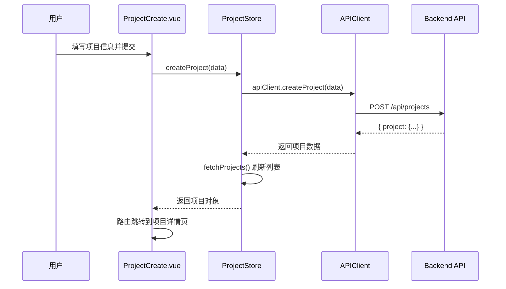

#### 6.5.2 交互式项目生成流程

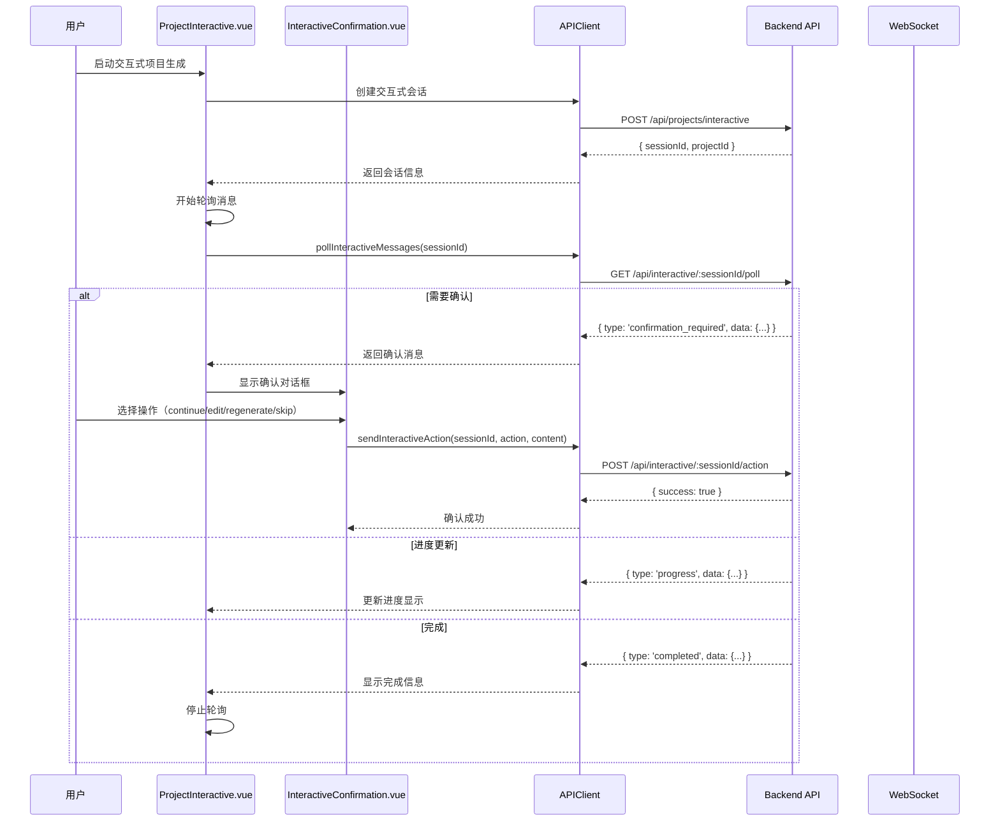

#### 6.5.3 轮询机制实现

**轮询工具（utils/polling.ts）**:
```typescript
// frontend/src/utils/polling.ts
export interface PollingOptions {
  interval?: number;        // 轮询间隔（毫秒）
  maxAttempts?: number;     // 最大尝试次数
  onMessage?: (data: any) => void;
  onError?: (error: any) => void;
  onComplete?: () => void;
}

export class PollingService {
  private timer: number | null = null;
  private attempts = 0;

  start(
    pollFn: () => Promise<any>,
    options: PollingOptions = {}
  ) {
    const {
      interval = 2000,
      maxAttempts = Infinity,
      onMessage,
      onError,
      onComplete,
    } = options;

    const poll = async () => {
      try {
        const data = await pollFn();
        this.attempts++;

        if (onMessage) {
          onMessage(data);
        }

        // 检查是否完成
        if (data.type === 'completed' || data.status === 'completed') {
          this.stop();
          if (onComplete) {
            onComplete();
          }
          return;
        }

        // 检查最大尝试次数
        if (this.attempts >= maxAttempts) {
          this.stop();
          return;
        }

        // 继续轮询
        this.timer = window.setTimeout(poll, interval);
      } catch (error) {
        if (onError) {
          onError(error);
        }
        // 错误后继续轮询
        this.timer = window.setTimeout(poll, interval);
      }
    };

    poll();
  }

  stop() {
    if (this.timer !== null) {
      clearTimeout(this.timer);
      this.timer = null;
    }
    this.attempts = 0;
  }
}
```

### 6.6 前端组件设计

#### 6.6.1 交互确认组件

**InteractiveConfirmation.vue**:
```typescript
// frontend/src/components/InteractiveConfirmation.vue
<template>
  <el-card class="confirmation-card">
    <template #header>
      <div class="card-header">
        <div class="role-info">
          <h3>{{ roleInfo.role }}</h3>
          <el-tag>{{ roleInfo.action }}</el-tag>
        </div>
        <el-tag type="warning">等待确认</el-tag>
      </div>
    </template>

    <div class="content-section">
      <el-tabs v-model="viewMode">
        <el-tab-pane label="预览" name="preview">
          <div class="content-preview" v-html="formattedContent"></div>
        </el-tab-pane>
        <el-tab-pane label="编辑" name="edit">
          <el-input
            v-model="editedContent"
            type="textarea"
            :rows="20"
            placeholder="编辑内容..."
          />
        </el-tab-pane>
      </el-tabs>

      <div class="action-buttons">
        <el-button type="primary" @click="handleContinue">
          <el-icon><Check /></el-icon>
          确认继续
        </el-button>
        <el-button type="warning" @click="handleEdit" v-if="viewMode === 'edit'">
          <el-icon><Edit /></el-icon>
          保存并继续
        </el-button>
        <el-button @click="handleRegenerate">
          <el-icon><Refresh /></el-icon>
          重新生成
        </el-button>
        <el-button type="info" @click="handleSkip">
          <el-icon><ArrowRight /></el-icon>
          跳过
        </el-button>
      </div>
    </div>
  </el-card>
</template>

<script setup lang="ts">
import { ref, computed } from 'vue';
import { useProjectStore } from '../stores/project';
import apiClient from '../api/client';

const props = defineProps<{
  sessionId: string;
  roleInfo: { role: string; action: string };
  content: string;
}>();

const emit = defineEmits<{
  (e: 'action', action: string, content?: string): void;
}>();

const viewMode = ref<'preview' | 'edit'>('preview');
const editedContent = ref(props.content);

const formattedContent = computed(() => {
  // 使用 markdown-it 格式化内容
  return props.content;
});

async function handleContinue() {
  await apiClient.sendInteractiveAction(props.sessionId, 'continue');
  emit('action', 'continue');
}

async function handleEdit() {
  await apiClient.sendInteractiveAction(
    props.sessionId,
    'edit',
    editedContent.value
  );
  emit('action', 'edit', editedContent.value);
}

async function handleRegenerate() {
  await apiClient.sendInteractiveAction(props.sessionId, 'regenerate');
  emit('action', 'regenerate');
}

async function handleSkip() {
  await apiClient.sendInteractiveAction(props.sessionId, 'skip');
  emit('action', 'skip');
}
</script>
```

#### 6.6.2 项目详情组件

**ProjectDetail.vue 核心功能**:
- 项目基本信息展示
- 实时进度显示
- 消息流可视化
- 文档列表和预览
- 成本统计

### 6.7 前后端数据流

#### 6.7.1 项目创建数据流

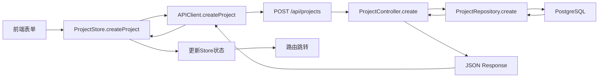

#### 6.7.2 交互式会话数据流

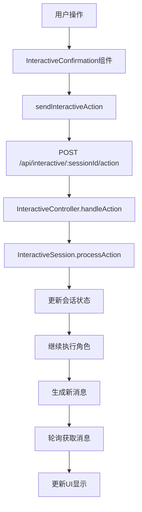

### 6.8 前端页面设计

#### 6.8.1 控制面板（Dashboard.vue）

**功能**:
- 项目统计概览（总数、完成数、进行中）
- 最近项目列表
- 快速创建项目入口
- 成本统计图表

**布局**:
```typescript
<template>
  <div class="dashboard">
    <!-- 统计卡片 -->
    <el-row :gutter="20">
      <el-col :span="6">
        <el-statistic title="总项目数" :value="projectCount" />
      </el-col>
      <el-col :span="6">
        <el-statistic title="已完成" :value="completedCount" />
      </el-col>
      <el-col :span="6">
        <el-statistic title="总成本" :value="totalCost" suffix="USD" />
      </el-col>
      <el-col :span="6">
        <el-statistic title="平均时间" :value="avgDuration" suffix="分钟" />
      </el-col>
    </el-row>

    <!-- 最近项目列表 -->
    <el-card>
      <template #header>
        <span>最近项目</span>
        <el-button type="primary" @click="$router.push('/create')">
          创建新项目
        </el-button>
      </template>
      <el-table :data="recentProjects">
        <!-- 表格列 -->
      </el-table>
    </el-card>
  </div>
</template>
```

#### 6.8.2 交互式项目生成页面（ProjectInteractive.vue）

**功能**:
- 项目信息展示
- 执行进度时间线
- 交互确认对话框
- 实时消息流
- 操作按钮组

**核心状态管理**:
```typescript
const state = reactive({
  sessionId: '',
  projectId: '',
  projectName: '',
  userIdea: '',
  currentRound: 0,
  maxRounds: 5,
  status: 'idle' as 'idle' | 'running' | 'paused' | 'completed',
  completedSteps: [] as Step[],
  currentStep: null as Step | null,
  pollingService: null as PollingService | null,
});
```

### 6.9 错误处理和加载状态

#### 6.9.1 统一错误处理

**API错误处理**:
```typescript
// frontend/src/api/client.ts
this.client.interceptors.response.use(
  (response) => response.data,
  (error) => {
    const errorData = error.response?.data || {};
    
    // 统一错误格式
    const formattedError = {
      message: errorData.message || '请求失败',
      code: errorData.code || 'UNKNOWN_ERROR',
      status: error.response?.status || 500,
    };
    
    // 根据错误类型处理
    if (error.response?.status === 401) {
      // 未授权，跳转到登录页
      router.push('/login');
    } else if (error.response?.status === 409) {
      // 冲突错误（如项目名重复）
      ElMessage.warning(formattedError.message);
    } else {
      ElMessage.error(formattedError.message);
    }
    
    return Promise.reject(formattedError);
  }
);
```

#### 6.9.2 加载状态管理

**全局加载状态**:
```typescript
// stores/loading.ts
export const useLoadingStore = defineStore('loading', () => {
  const loading = ref(false);
  const loadingText = ref('加载中...');

  function setLoading(value: boolean, text?: string) {
    loading.value = value;
    if (text) {
      loadingText.value = text;
    }
  }

  return { loading, loadingText, setLoading };
});
```

### 6.10 响应式设计

#### 6.10.1 移动端适配

- 使用 Element Plus 的响应式栅格系统
- 移动端优化布局（单列显示）
- 触摸友好的交互元素
- 适配不同屏幕尺寸

#### 6.10.2 主题配置

**主题配置（config/theme.ts）**:
```typescript
// frontend/src/config/theme.ts
export const themeConfig = {
  primaryColor: '#409EFF',
  successColor: '#67C23A',
  warningColor: '#E6A23C',
  dangerColor: '#F56C6C',
  infoColor: '#909399',
};
```

---

## 7. 技术选型

### 4.1 核心技术栈

| 类别 | 技术选型 | 版本要求 | 选型理由 |
|------|---------|---------|---------|
| **后端语言** | TypeScript/Node.js | v18+ | 类型安全，生态成熟，异步支持良好 |
| **后端框架** | Express | ^4.18.2 | 轻量高效，中间件丰富 |
| **前端框架** | Vue 3 | ^3.4.5 | 渐进式，易学易用，生态完善 |
| **UI组件库** | Element Plus | ^2.13.0 | 企业级UI组件库 |
| **状态管理** | Pinia | ^2.1.7 | Vue 3 官方推荐的状态管理 |
| **构建工具** | Vite | ^5.0.11 | 快速冷启动，HMR性能卓越 |
| **数据库** | PostgreSQL | v14+ | 开源稳定，功能强大，支持JSON |
| **数据库驱动** | pg | ^8.11.3 | PostgreSQL 官方驱动 |
| **WebSocket** | ws | ^8.18.3 | 实时通信支持 |
| **API规范** | RESTful + WebSocket | - | REST API + WebSocket 实时通信 |
| **测试框架** | Jest | ^29.7.0 | 功能丰富，社区活跃 |
| **代码规范** | ESLint, Prettier | latest | 自动化，标准化 |
| **LLM SDK** | openai | ^4.24.1 | OpenAI 官方SDK |
| **日志** | Winston + Pino | latest | 结构化日志 |
| **类型系统** | TypeScript | ^5.3.3 | 类型安全，开发体验好 |

### 4.2 依赖管理

**后端核心依赖** (package.json):
```json
{
  "dependencies": {
    "express": "^4.18.2",
    "pg": "^8.11.3",
    "openai": "^4.24.1",
    "axios": "^1.6.5",
    "dotenv": "^16.3.1",
    "ws": "^8.18.3",
    "winston": "^3.11.0",
    "pino": "^8.17.2",
    "uuid": "^9.0.1",
    "commander": "^11.1.0",
    "cors": "^2.8.5",
    "helmet": "^7.1.0",
    "joi": "^17.11.0",
    "jsonwebtoken": "^9.0.2",
    "archiver": "^7.0.1",
    "zod": "^3.22.4"
  },
  "devDependencies": {
    "typescript": "^5.3.3",
    "jest": "^29.7.0",
    "ts-jest": "^29.4.6",
    "tsx": "^4.7.0",
    "eslint": "^8.56.0",
    "prettier": "^3.1.1"
  }
}
```

**前端核心依赖** (package.json):
```json
{
  "dependencies": {
    "vue": "^3.4.5",
    "vue-router": "^4.2.5",
    "pinia": "^2.1.7",
    "axios": "^1.6.5",
    "element-plus": "^2.13.0",
    "@element-plus/icons-vue": "^2.3.2",
    "@vueuse/core": "^10.7.1",
    "markdown-it": "^14.1.0"
  },
  "devDependencies": {
    "vite": "^5.0.11",
    "@vitejs/plugin-vue": "^5.0.2",
    "typescript": "^5.3.3",
    "vue-tsc": "^3.2.1",
    "eslint": "^8.56.0",
    "prettier": "^3.1.1"
  }
}
```

**数据库依赖**:
```bash
# PostgreSQL 安装
brew install postgresql@14  # macOS
apt install postgresql-14    # Ubuntu/Debian
```

### 4.3 设计模式应用

| 设计模式 | 应用场景 | 具体实现 |
|---------|---------|---------|
| **工厂模式** | LLM 提供商创建 | `create_llm_instance()` |
| **策略模式** | React 模式切换 | `RoleReactMode` |
| **观察者模式** | 消息订阅 | `_watch()` 机制 |
| **命令模式** | Action 执行 | `Action.run()` |
| **模板方法** | Role 生命周期 | `observe-think-act` |
| **单例模式** | Config 配置 | `Config.default()` |
| **构建器模式** | ActionNode 构建 | `ActionNode` 树 |

---

## 8. 扩展机制

### 5.1 自定义角色

**扩展步骤**:

```typescript
// 1. 继承 Role
import { IRoleConfig } from '@mind2build/shared';
import { Role } from './Role';
import { Context } from '../core/context/Context';
import { CustomAction } from '../actions/CustomAction';
import { ACTION_SOME_ACTION } from '@mind2build/shared';

class CustomRole extends Role {
    constructor(context: Context, name: string = 'CustomRole') {
        const config: IRoleConfig = {
            name,
            profile: 'CustomRole',
            goal: 'Custom goal',
            constraints: 'Custom constraints',
            description: 'Custom description',
        };
        
        super(config, context);
        
        // 2. 订阅消息
        this.watch([ACTION_SOME_ACTION]);
        
        // 3. 设置 Actions
        this.setActions([new CustomAction()]);
    }
    
    // 4. 可选：重写方法
    // async act(): Promise<Message | null> {
    //     // 自定义执行逻辑
    // }
}

// 5. 使用自定义角色
team.hire([new CustomRole(context)]);
```

**扩展点**:
- `think()`: 自定义决策逻辑
- `act()`: 自定义执行逻辑
- `observe()`: 自定义观察逻辑（通常不需要重写）

### 5.2 自定义 Action

**扩展步骤**:

```typescript
// 1. 继承 BaseAction
import { BaseAction } from '../core/base/BaseAction';
import { IActionOutput } from '@mind2build/shared';
import { WorkspaceOptions } from '../utils/WorkspaceManager';

export class CustomAction extends BaseAction {
    constructor() {
        super('CustomAction', 'Custom action description');
    }
    
    async run(input: string, options?: WorkspaceOptions): Promise<IActionOutput> {
        // 2. 构建提示词
        const prompt = this.buildPrompt(input);
        
        // 3. 调用 LLM
        const content = await this.aask(prompt);
        
        // 4. 可选：保存到 workspace
        if (options?.applicationId) {
            await this.saveToWorkspace('output.md', content, options);
        }
        
        // 5. 返回结果
        return {
            content,
            data: {
                type: 'custom',
                timestamp: new Date().toISOString(),
            },
        };
    }
    
    private buildPrompt(input: string): string {
        return `Task: ${input}`;
    }
}

// 6. 在 shared/src/constants/index.ts 中添加常量（可选）
export const ACTION_CUSTOM = 'CustomAction';
```

### 5.3 自定义工作流

**固定 SOP 模式**:
```python
class CustomRole(Role):
    def __init__(self):
        super().__init__()
        # 设置固定的 Action 序列
        self.set_actions([Action1, Action2, Action3])
        self.rc.react_mode = RoleReactMode.BY_ORDER
```

**动态工作流**:
```python
class FlexibleRole(RoleZero):
    async def _think(self) -> bool:
        # 根据上下文动态选择 Action
        if condition1:
            self.rc.todo = Action1()
        elif condition2:
            self.rc.todo = Action2()
        return True
```

### 5.4 自定义 LLM 提供商

**扩展步骤**:

```python
# 1. 继承 BaseLLM
class CustomLLM(BaseLLM):
    async def _achat_completion(
        self,
        messages: list[dict],
        **kwargs
    ) -> dict:
        # 2. 实现 LLM 调用逻辑
        response = await custom_api_call(messages)
        return response
    
    async def acompletion_text(
        self,
        messages: list[dict],
        **kwargs
    ) -> str:
        # 3. 实现文本提取
        result = await self._achat_completion(messages)
        return result["content"]

# 4. 注册到工厂
LLM_REGISTRY["custom"] = CustomLLM
```

---

## 9. 部署架构

### 6.1 单机部署

**架构图**:
```
┌─────────────────────────────────┐
│         User Interface          │
│      (CLI / Python Script)      │
└────────────┬────────────────────┘
             │
┌────────────▼────────────────────┐
│       mind2build Process           │
│  ┌───────────────────────────┐  │
│  │  Team Orchestration       │  │
│  └───────────┬───────────────┘  │
│  ┌───────────▼───────────────┐  │
│  │  Role Executors           │  │
│  │  (Async Coroutines)       │  │
│  └───────────┬───────────────┘  │
│  ┌───────────▼───────────────┐  │
│  │  LLM API Calls            │  │
│  └───────────────────────────┘  │
└────────────┬────────────────────┘
             │
      ┌──────┴──────┐
      │             │
┌─────▼─────┐ ┌────▼────┐
│  LLM API  │ │FileSystem│
│ (OpenAI)  │ │ (Local) │
└───────────┘ └─────────┘
```

**资源需求**:
- CPU: 2+ 核
- 内存: 4+ GB
- 磁盘: 10+ GB
- 网络: 稳定的互联网连接

### 6.2 容器化部署

**Dockerfile** (示例):
```dockerfile
FROM node:18-alpine

WORKDIR /app

# 安装 pnpm
RUN npm install -g pnpm

# 复制依赖文件
COPY package.json pnpm-lock.yaml pnpm-workspace.yaml ./
COPY backend/package.json ./backend/
COPY frontend/package.json ./frontend/
COPY shared/package.json ./shared/

# 安装依赖
RUN pnpm install --frozen-lockfile

# 复制源代码
COPY . .

# 构建
RUN pnpm build

# 配置
ENV NODE_ENV=production
VOLUME ["/workspace"]

EXPOSE 3000

CMD ["node", "backend/dist/server.js"]
```

**docker-compose.yml**:
```yaml
# docker-compose.yml (Docker配置文件仍使用YAML)
version: '3.8'

services:
  mind2build:
    build: .
    volumes:
      - ./workspace:/workspace
      - ./config:/root/.mind2build
    environment:
      - OPENAI_API_KEY=${OPENAI_API_KEY}
    command: "Create a 2048 game"
```

### 6.3 扩展性考虑

**水平扩展** (未来支持):
```
Load Balancer
     │
     ├─── mind2build Instance 1
     ├─── mind2build Instance 2
     └─── mind2build Instance 3
          │
          └─── Shared Storage (S3/NFS)
```

**垂直扩展**:
- 增加并发 Role 数量
- 提升单机性能（CPU/内存）
- 优化 LLM 调用效率

---

## 7. 性能优化

### 7.1 异步并发

**优化策略**:
```python
# 多个角色并发执行
async def run(self):
    futures = []
    for role in self.roles.values():
        if not role.is_idle:
            futures.append(role.run())
    await asyncio.gather(*futures)
```

**效果**:
- 多角色可同时调用 LLM
- 减少总执行时间 50%+

### 7.2 Token 优化

**策略**:
1. **精简 Prompt**: 移除冗余描述
2. **上下文裁剪**: 只保留关键历史消息
3. **增量生成**: 避免重复生成已有内容
4. **缓存机制**: 缓存重复的 LLM 调用结果

**示例**:
```python
# 智能截断历史消息
def get_recent_messages(self, max_tokens: int = 2000):
    messages = []
    total_tokens = 0
    for msg in reversed(self.memory.storage):
        msg_tokens = count_tokens(msg.content)
        if total_tokens + msg_tokens > max_tokens:
            break
        messages.insert(0, msg)
        total_tokens += msg_tokens
    return messages
```

### 7.3 内存优化

**策略**:
1. **定期清理**: 清除旧的不重要消息
2. **延迟加载**: 按需加载大文件内容
3. **流式处理**: 对大型输出使用流式处理

---

## 8. 安全性设计

### 8.1 敏感信息保护

**API Key 管理**:
```python
# 从环境变量读取
import os
api_key = os.getenv("OPENAI_API_KEY")

# 或从TypeScript配置文件读取（不提交到版本控制）
# .gitignore 中包含 config.ts（如果包含敏感信息）
```

**日志脱敏**:
```python
def safe_log(api_key: str) -> str:
    """只显示前后各4位"""
    if len(api_key) > 8:
        return f"{api_key[:4]}****{api_key[-4:]}"
    return "****"
```

### 8.2 代码执行安全

**限制**:
- ❌ 不执行用户提供的任意代码
- ❌ 不执行危险的系统命令（rm -rf 等）
- ✅ Terminal 工具在沙箱环境执行
- ✅ 白名单机制限制可执行命令

### 8.3 数据隔离

**项目隔离**:
```python
# 每个项目独立目录
workspace/
  ├── project_1/
  ├── project_2/
  └── project_3/
```

---

## 9. 可观测性

### 9.1 日志系统

**日志层级**:
```python
import logging

logger.debug("Role state: Thinking")
logger.info("Completed action: WritePRD")
logger.warning("LLM response format invalid, retrying")
logger.error("LLM API call failed", exc_info=True)
```

**日志格式**:
```
[2025-12-24 10:30:45] [INFO] [ProductManager] WritePRD completed, tokens: 1234
[2025-12-24 10:30:46] [DEBUG] [Environment] Message routed to Architect
```

### 9.2 成本追踪

**实时监控**:
```python
class CostManager:
    def report(self) -> dict:
        return {
            "total_cost": self.total_cost,
            "total_tokens": self.total_tokens,
            "budget_remaining": self.max_budget - self.total_cost,
            "usage_percentage": self.total_cost / self.max_budget * 100
        }
```

**成本告警**:
```python
if cost_manager.total_cost > cost_manager.max_budget * 0.8:
    logger.warning("Cost is approaching budget limit!")
```

### 9.3 性能指标

**关键指标**:
- 端到端时间（Total Time）
- 各 Action 执行时间
- LLM 调用延迟
- Token 使用量
- 成功率

---

## 10. 故障恢复

### 10.1 序列化与恢复

**保存状态**:
```python
# 自动保存团队状态
team.serialize(stg_path=Path("./storage/team"))
```

**恢复状态**:
```python
# 从保存点恢复
team = Team.deserialize(stg_path=Path("./storage/team"), context=ctx)
await team.run(n_round=remaining_rounds)
```

### 10.2 重试机制

**LLM 调用重试**:
```python
from tenacity import retry, stop_after_attempt, wait_exponential

@retry(
    stop=stop_after_attempt(3),
    wait=wait_exponential(multiplier=1, min=2, max=10)
)
async def llm_call_with_retry(prompt: str):
    return await llm.aask(prompt)
```

### 10.3 错误处理

**分级处理**:
```python
try:
    result = await action.run()
except LLMAPIError as e:
    # 可重试错误
    logger.warning(f"LLM API error, retrying: {e}")
    await asyncio.sleep(2)
    result = await action.run()
except ValidationError as e:
    # 格式错误，请求重新生成
    logger.error(f"Output validation failed: {e}")
    result = await action.run_with_validation()
except NoMoneyException as e:
    # 预算耗尽，停止执行
    logger.error("Budget exhausted, stopping")
    raise
```

---

## 11. 架构演进

### 11.1 当前架构 (v1.2)

**特点**:
- ✅ 单机部署（支持 Docker）
- ✅ 异步工作流（Node.js Event Loop）
- ✅ PostgreSQL 数据库存储（配置、提示词）
- ✅ 文件系统存储（工作区）
- ✅ 交互式模式（CLI + WebSocket）
- ✅ Web UI（Vue 3 + Element Plus）
- ✅ REST API + WebSocket 实时通信
- ✅ 角色特定 LLM 配置
- ✅ 工作区管理（按应用ID和版本组织）
- ✅ 分步骤文档生成（MRD、PRD、Design）
- ✅ 任务拆分和执行（SubtaskManager）
- ✅ 知识库系统（RAG检索、代码仓库关联）
- ✅ 多角色串联工作流（输入输出映射）
- ✅ 角色独立调试能力

### 11.2 近期规划 (v1.5)

**改进**:
- 支持 Web UI
- 更灵活的工作流编排
- 向量数据库集成
- 更多 LLM 提供商

### 11.3 长期规划 (v2.0+)

**愿景**:
- 分布式部署
- 实时协作
- 持续学习能力
- 多模态支持（图片、语音）
- 企业级权限管理

**架构演进路径**:
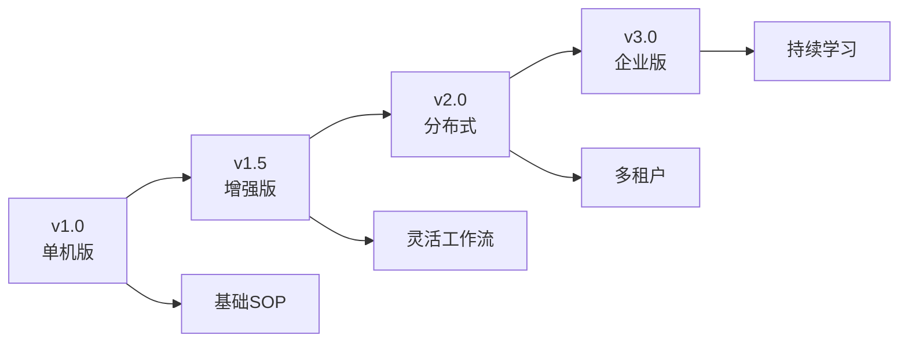

---

## 12. 最佳实践

### 12.1 角色设计

**原则**:
1. **单一职责**: 每个角色专注一个领域
2. **明确输入输出**: 清晰定义期望的输入和输出
3. **适当粒度**: 不要过细也不要过粗

**示例**:
```python
# ✅ 好的设计
class ProductManager(Role):
    goal: str = "Create PRD"
    actions = [WritePRD]

# ❌ 不好的设计
class SuperRole(Role):
    goal: str = "Do everything"
    actions = [WritePRD, WriteDesign, WriteCode]  # 职责过多
```

### 12.2 提示词工程

**技巧**:
1. **清晰的指令**: 明确告诉 LLM 要做什么
2. **示例学习**: 提供优质示例
3. **格式约束**: 指定输出格式
4. **角色设定**: 设定合适的角色背景

**示例**:
```python
PROMPT_TEMPLATE = """
You are a {role} with the goal to {goal}.

Context:
{context}

Requirements:
{requirements}

Please generate {output_type} following this structure:
{structure}

Example:
{example}
"""
```

### 12.3 测试策略

**分层测试**:
```python
# 单元测试
def test_message_routing():
    env = Environment()
    role = ProductManager()
    env.add_roles([role])
    msg = Message(content="test", send_to={"ProductManager"})
    env.publish_message(msg)
    assert len(role.rc.news) == 1

# 集成测试
async def test_prd_generation():
    team = Team()
    team.hire([ProductManager()])
    result = await team.run(idea="Create a TODO app")
    assert result is not None

# 端到端测试
async def test_full_workflow():
    result = generate_repo("Create a 2048 game")
    assert Path(result).exists()
    assert Path(result, "PRD.md").exists()
```

---

## 13. 总结

### 13.1 架构优势

1. **清晰的分层**: 职责明确，易于维护
2. **高度可扩展**: 支持自定义角色和 Action
3. **LLM 无关**: 抽象层设计支持多提供商
4. **异步高效**: 基于 Node.js Event Loop 的异步架构
5. **消息驱动**: 解耦的通信机制

### 13.2 技术亮点

- **多代理协作**: 模拟真实软件团队
- **SOP 标准化**: 可复用的工作流程
- **智能路由**: 灵活的消息分发机制
- **成本可控**: 完善的预算管理
- **故障恢复**: 状态序列化和恢复

### 13.3 应用场景

✅ **适合**:
- 中小型项目快速原型
- 标准化的软件开发流程
- 数据分析和报告生成
- 文档自动化生成

⚠️ **限制**:
- 大型企业级应用（> 10 万行）
- 需要精细控制的场景
- 对代码质量要求极高的项目
- 实时性要求很高的场景

---

## 附录

### A. 模块依赖图

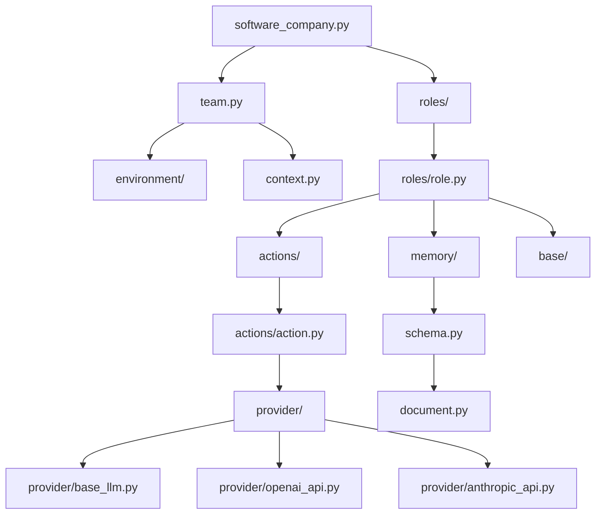

### B. 关键路径分析

**关键路径**:
```
CLI → Team → Environment → Role → Action → LLM → Output
```

**性能瓶颈**:
1. **LLM API 调用** - 占用 80% 时间
2. **文件 I/O** - 占用 10% 时间
3. **消息路由** - 占用 5% 时间
4. **其他** - 占用 5% 时间

### C. 参考资源

- [官方文档](https://docs.deepwisdom.ai/)
- [GitHub 仓库](https://github.com/geekan/mind2build)
- [ReAct 论文](https://arxiv.org/abs/2210.03629)
- [mind2build 论文](https://openreview.net/forum?id=VtmBAGCN7o)

---

**文档维护**: 本文档随代码迭代持续更新  
**反馈渠道**: GitHub Issues / Discord 社区