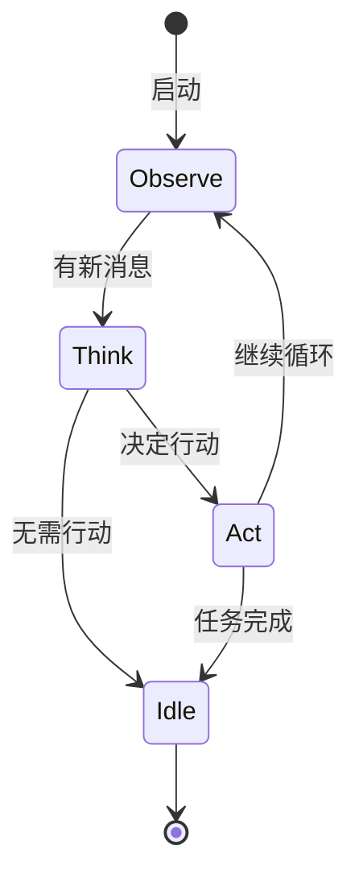
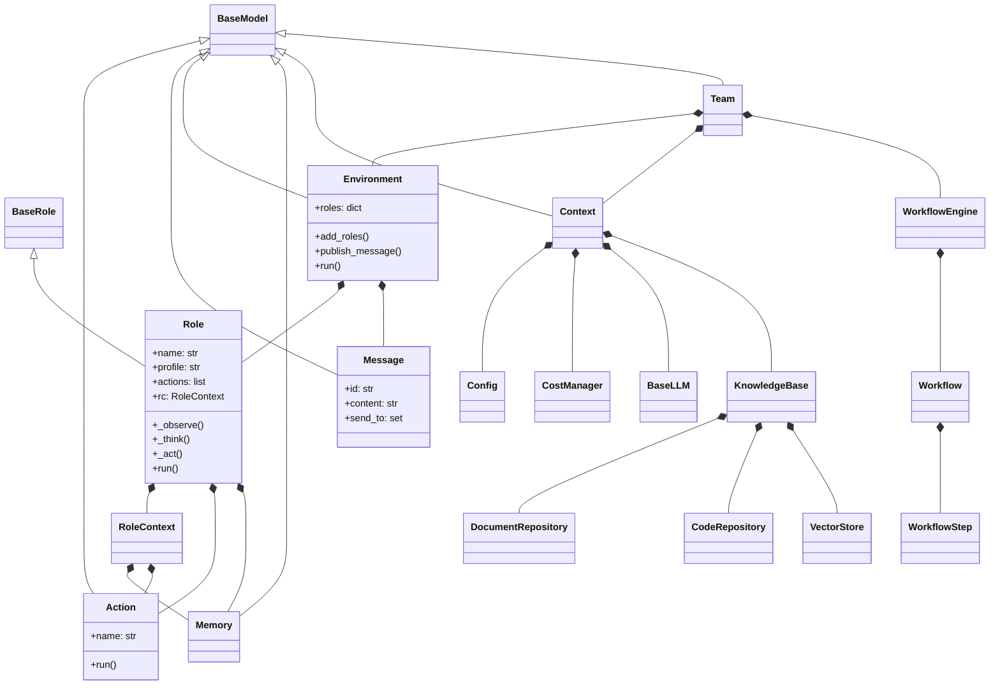

# mind2build 核心类设计文档

**文档版本**: v1.1  
**创建日期**: 2025-12-24  
**最后更新**: 2026-01-07（根据PRD更新，添加知识库系统和工作流编排相关类）

---

## 目录

1. [BaseRole / Role](#1-baserole--role)
2. [Action](#2-action)
3. [Message](#3-message)
4. [Environment](#4-environment)
5. [Memory](#5-memory)
6. [Context](#6-context)
7. [Team](#7-team)
8. [KnowledgeBase](#8-knowledgebase)
9. [WorkflowEngine](#9-workflowengine)

---

## 1. BaseRole / Role

### 1.1 BaseRole (抽象基类)

**位置**: `mind2build/base/base_role.py`

**设计目的**: 定义所有角色的统一接口

```python
class BaseRole(BaseSerialization):
    """角色抽象基类"""
    
    name: str  # 角色名称
    
    @property
    def is_idle(self) -> bool:
        """角色是否空闲"""
        raise NotImplementedError
    
    @abstractmethod
    async def think(self):
        """思考：决定下一步行动"""
        raise NotImplementedError
    
    @abstractmethod
    async def act(self):
        """行动：执行当前任务"""
        raise NotImplementedError
    
    @abstractmethod
    async def react(self) -> Message:
        """响应：观察-思考-行动循环"""
        raise NotImplementedError
    
    @abstractmethod
    async def run(self, with_message: Optional[Message] = None) -> Optional[Message]:
        """运行：主入口"""
        raise NotImplementedError
    
    @abstractmethod
    def get_memories(self, k: int = 0) -> list[Message]:
        """获取记忆"""
        raise NotImplementedError
```

### 1.2 Role (具体实现)

**位置**: `mind2build/roles/role.py`

**核心属性**:
```python
class Role(BaseRole, SerializationMixin, ContextMixin, BaseModel):
    name: str = ""
    profile: str = ""
    goal: str = ""
    constraints: str = ""
    desc: str = ""
    
    # 核心组件
    actions: list[Action] = Field(default_factory=list)
    rc: RoleContext = Field(default_factory=RoleContext)
    
    # 配置
    enable_memory: bool = True
    use_fixed_sop: bool = False
```

**核心方法**:

```python
async def _observe(self) -> int:
    """观察环境，获取新消息
    
    Returns:
        新消息数量
    """
    if not self.rc.env:
        return 0
    
    # 从环境获取消息
    news = self.rc.env.get_messages_for_role(self)
    self.rc.news = news
    return len(news)

async def _think(self) -> bool:
    """思考并决定下一步行动
    
    Returns:
        是否有任务要执行
    """
    if self.rc.react_mode == RoleReactMode.BY_ORDER:
        # 按顺序执行
        return self._think_by_order()
    elif self.rc.react_mode == RoleReactMode.PLAN_AND_ACT:
        # 先计划后执行
        return await self._think_plan_and_act()
    else:
        # 动态选择 (ReAct)
        return await self._think_react()

async def _act(self) -> Message:
    """执行当前 Action
    
    Returns:
        Action 的输出消息
    """
    if not self.rc.todo:
        return None
    
    # 执行 Action
    result = await self.rc.todo.run(self.rc.memory.get())
    
    # 发布消息
    msg = Message(content=result, cause_by=type(self.rc.todo))
    self.publish_message(msg)
    
    return msg
```

**React 模式**:



---

## 2. Action

### 2.1 Action 基类

**位置**: `mind2build/actions/action.py`

```python
class Action(SerializationMixin, ContextMixin, BaseModel):
    """行动基类"""
    
    name: str = ""
    i_context: Union[dict, str, None] = ""  # 输入上下文
    prefix: str = ""  # System prompt 前缀
    desc: str = ""  # 描述（用于 skill manager）
    node: ActionNode = None  # ActionNode 树
    llm_name_or_type: Optional[str] = None  # LLM 类型
    
    async def run(self, *args, **kwargs):
        """执行 Action
        
        子类必须实现此方法
        """
        if self.node:
            return await self._run_action_node(*args, **kwargs)
        raise NotImplementedError("Subclass must implement run")
    
    async def _aask(self, prompt: str, system_msgs: Optional[list[str]] = None) -> str:
        """调用 LLM"""
        return await self.llm.aask(prompt, system_msgs)
```

### 2.2 ActionNode

**设计目的**: 支持结构化输出

```python
class ActionNode:
    """ActionNode 树节点"""
    
    key: str  # 节点键名
    expected_type: Type  # 期望类型
    instruction: str  # 指令
    example: Any  # 示例
    content: str  # 内容
    children: dict[str, ActionNode]  # 子节点
    
    async def fill(self, req: str, llm: BaseLLM) -> dict:
        """填充节点内容"""
        # 构建提示词
        prompt = self._build_prompt(req)
        
        # 调用 LLM
        response = await llm.aask(prompt)
        
        # 解析并填充
        self.content = self._parse_response(response)
        
        # 递归填充子节点
        for child in self.children.values():
            await child.fill(self.content, llm)
        
        return self.to_dict()
```

---

## 3. Message

### 3.1 Message 类

**位置**: `mind2build/schema.py`

```python
class Message(BaseModel):
    """消息类"""
    
    id: str = Field(default="", validate_default=True)
    content: str  # 自然语言内容
    instruct_content: Optional[BaseModel] = None  # 结构化内容
    role: str = "user"  # 角色类型
    cause_by: str = Field(default="", validate_default=True)  # 触发的 Action
    sent_from: str = Field(default="", validate_default=True)  # 发送者
    send_to: set[str] = Field(default={MESSAGE_ROUTE_TO_ALL})  # 接收者
    metadata: Dict[str, Any] = Field(default_factory=dict)  # 元数据
    
    @field_validator("id", mode="before")
    @classmethod
    def check_id(cls, id: str) -> str:
        return id if id else uuid.uuid4().hex
    
    @field_validator("cause_by", mode="before")
    @classmethod
    def check_cause_by(cls, cause_by: Any) -> str:
        return any_to_str(cause_by if cause_by else UserRequirement)
```

### 3.2 路由常量

```python
MESSAGE_ROUTE_TO_ALL = "<all>"  # 广播
MESSAGE_ROUTE_TO_SELF = "<self>"  # 自己
```

---

## 4. Environment

### 4.1 Environment 类

**位置**: `mind2build/environment/base_env.py`

```python
class Environment(ExtEnv):
    """环境类：管理角色和消息路由"""
    
    roles: dict[str, Role] = Field(default_factory=dict)
    member_addrs: dict[Role, set[str]] = Field(default_factory=dict)
    history: list[Message] = Field(default_factory=list)
    
    def add_roles(self, roles: Iterable[Role]):
        """添加角色"""
        for role in roles:
            self.roles[role.name] = role
            self.member_addrs[role] = {role.name, role.profile, any_to_str(role)}
            role.set_env(self)
    
    def publish_message(self, message: Message, peekable: bool = True) -> bool:
        """发布消息并路由"""
        found = False
        for role, addrs in self.member_addrs.items():
            if is_send_to(message, addrs):
                role.put_message(message)
                found = True
        
        if not found:
            logger.warning(f"Message no recipients: {message.dump()}")
        
        self.history.add(message)
        return True
    
    async def run(self, k=1):
        """运行所有角色"""
        for _ in range(k):
            futures = []
            for role in self.roles.values():
                if not role.is_idle:
                    futures.append(role.run())
            
            if futures:
                await asyncio.gather(*futures)
```

---

## 5. Memory

### 5.1 Memory 类

**位置**: `mind2build/memory/memory.py`

```python
class Memory(BaseModel):
    """记忆系统"""
    
    storage: list[Message] = Field(default_factory=list)
    index: dict = Field(default_factory=dict)
    
    def add(self, message: Message):
        """添加消息"""
        self.storage.append(message)
        self._update_index(message)
    
    def get(self, k: int = 0) -> list[Message]:
        """获取最近 k 条消息"""
        if k == 0:
            return self.storage
        return self.storage[-k:]
    
    def get_by_role(self, role: str) -> list[Message]:
        """按角色过滤"""
        return [m for m in self.storage if m.role == role]
    
    def get_by_action(self, action: Type[Action]) -> list[Message]:
        """按 Action 过滤"""
        action_str = any_to_str(action)
        return [m for m in self.storage if m.cause_by == action_str]
    
    def clear(self):
        """清空记忆"""
        self.storage.clear()
        self.index.clear()
```

---

## 6. Context

### 6.1 Context 类

**位置**: `mind2build/context.py`

```python
class Context(BaseModel):
    """全局上下文"""
    
    config: Config = Field(default_factory=Config.default)
    cost_manager: CostManager = CostManager()
    kwargs: AttrDict = AttrDict()
    _llm: Optional[BaseLLM] = None
    
    def llm(self) -> BaseLLM:
        """获取 LLM 实例"""
        if self._llm is None:
            self._llm = create_llm_instance(self.config.llm)
            if self._llm.cost_manager is None:
                self._llm.cost_manager = self.cost_manager
        return self._llm
    
    def serialize(self) -> dict:
        """序列化"""
        return {
            "kwargs": {k: v for k, v in self.kwargs.__dict__.items()},
            "cost_manager": self.cost_manager.model_dump_json(),
        }
    
    def deserialize(self, serialized_data: dict):
        """反序列化"""
        if not serialized_data:
            return
        
        kwargs = serialized_data.get("kwargs")
        if kwargs:
            for k, v in kwargs.items():
                self.kwargs.set(k, v)
        
        cost_manager = serialized_data.get("cost_manager")
        if cost_manager:
            self.cost_manager.model_validate_json(cost_manager)
```

---

## 7. Team

### 7.1 Team 类

**位置**: `mind2build/team.py`

```python
class Team(BaseModel):
    """团队类：高层编排"""
    
    env: Optional[Environment] = None
    investment: float = Field(default=10.0)
    idea: str = Field(default="")
    use_mgx: bool = Field(default=True)
    
    def hire(self, roles: list[Role]):
        """雇佣角色"""
        self.env.add_roles(roles)
    
    def invest(self, investment: float):
        """投资预算"""
        self.investment = investment
        self.cost_manager.max_budget = investment
        logger.info(f"Investment: ${investment}.")
    
    def run_project(self, idea: str, send_to: str = ""):
        """启动项目"""
        self.idea = idea
        self.env.publish_message(Message(content=idea))
    
    async def run(self, n_round=3, idea="", send_to="", auto_archive=True):
        """运行团队"""
        if idea:
            self.run_project(idea=idea, send_to=send_to)
        
        while n_round > 0:
            if self.env.is_idle:
                logger.debug("All roles are idle.")
                break
            n_round -= 1
            self._check_balance()
            await self.env.run()
            logger.debug(f"max {n_round=} left.")
        
        self.env.archive(auto_archive)
        return self.env.history
    
    def serialize(self, stg_path: Path = None):
        """序列化团队状态"""
        stg_path = SERDESER_PATH.joinpath("team") if stg_path is None else stg_path
        team_info_path = stg_path.joinpath("team.json")
        serialized_data = self.model_dump()
        serialized_data["context"] = self.env.context.serialize()
        write_json_file(team_info_path, serialized_data)
    
    @classmethod
    def deserialize(cls, stg_path: Path, context: Context = None) -> "Team":
        """反序列化团队状态"""
        team_info_path = stg_path.joinpath("team.json")
        team_info: dict = read_json_file(team_info_path)
        ctx = context or Context()
        ctx.deserialize(team_info.pop("context", None))
        team = Team(**team_info, context=ctx)
        return team
```

---

## 附录：类图



---

**文档维护**: 随代码更新  
**参考源码**: mind2build GitHub 仓库
