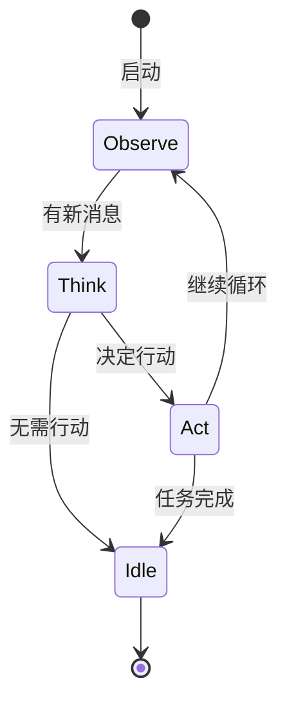
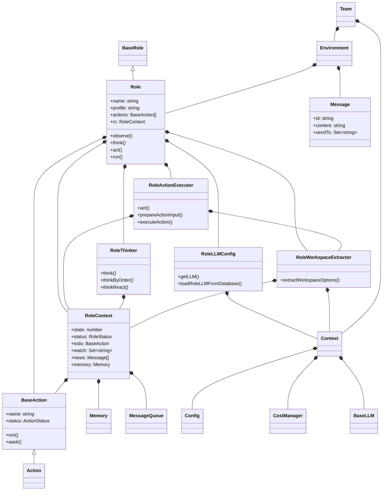

# mind2build 核心类设计文档

**文档版本**: v2.1  
**创建日期**: 2025-12-24  
**最后更新**: 2026-01-21（与最新代码实现同步）

---

## 目录

1. [BaseRole / Role](#1-baserole--role)
2. [Action](#2-action)
3. [Message](#3-message)
4. [Environment](#4-environment)
5. [Memory](#5-memory)
6. [Context](#6-context)
7. [Team](#7-team)
8. [RoleContext](#8-rolecontext)
9. [RoleActionExecutor](#9-roleactionexecutor)
10. [RoleThinker](#10-rolethinker)
11. [RoleLLMConfig](#11-rolellmconfig)
12. [RoleWorkspaceExtractor](#12-roleworkspaceextractor)

---

## 1. BaseRole / Role

### 1.1 BaseRole (抽象基类)

**位置**: `backend/src/core/base/BaseRole.ts`

**设计目的**: 定义所有角色的统一接口

```typescript
export abstract class BaseRole {
  name: string;
  profile: string;

  constructor(name: string, profile: string) {
    this.name = name;
    this.profile = profile;
  }

  /**
   * Check if role is idle (no pending work)
   */
  abstract get isIdle(): boolean;

  /**
   * Observe environment and receive messages
   * @returns Number of new messages received
   */
  abstract observe(): Promise<number>;

  /**
   * Think about what action to take next
   * @returns True if there's work to do, false otherwise
   */
  abstract think(): Promise<boolean>;

  /**
   * Execute the current action
   * @returns Message produced by the action
   */
  abstract act(): Promise<Message | null>;

  /**
   * Main execution loop: observe -> think -> act
   * @returns Message produced or null
   */
  abstract run(): Promise<Message | null>;

  /**
   * Get recent memories/messages
   * @param k - Number of recent messages to retrieve (0 = all)
   */
  abstract getMemories(k?: number): Message[];
}
```

### 1.2 Role (具体实现)

**位置**: `backend/src/roles/Role.ts`

**核心属性**:
```typescript
export class Role extends BaseRole {
  goal: string;
  constraints: string;
  description: string;
  actions: BaseAction[] = [];
  rc: RoleContext;
  context: Context;
  private addresses: Set<string> = new Set();

  // 模块化组件
  private llmConfig: RoleLLMConfig;
  private thinker: RoleThinker;
  private actionExecutor: RoleActionExecutor;
  private workspaceExtractor: RoleWorkspaceExtractor;
}
```

**核心方法**:

```typescript
/**
 * Observe: Get new messages from buffer
 */
async observe(): Promise<number> {
  const messages = this.rc.getBufferedMessages();
  
  if (messages.length > 0) {
    // Replace news with new messages (don't accumulate)
    this.rc.news = messages;
    // Add messages to memory
    messages.forEach((msg) => this.rc.addToMemory(msg));
  }
  
  return messages.length;
}

/**
 * Think: Decide what action to take next
 */
async think(): Promise<boolean> {
  return await this.thinker.think();
}

/**
 * Act: Execute the current action
 */
async act(): Promise<Message | null> {
  return await this.actionExecutor.act();
}

/**
 * Main run loop: observe -> think -> act
 */
async run(): Promise<Message | null> {
  // Observe new messages
  const newMessages = await this.observe();
  
  // Think about what to do
  const hasTodo = await this.think();
  
  if (!hasTodo) {
    return null;
  }
  
  // Execute action
  const message = await this.act();
  
  return message;
}
```

**模块化组件**:

Role类将职责分离到以下组件：
- **RoleActionExecutor**: 处理action执行逻辑
- **RoleThinker**: 处理决策逻辑
- **RoleLLMConfig**: 管理LLM配置
- **RoleWorkspaceExtractor**: 提取workspace选项

**React 模式**:



---

## 2. Action

### 2.1 BaseAction 基类

**位置**: `backend/src/core/base/BaseAction.ts`

```typescript
export abstract class BaseAction {
  name: string;
  description?: string;
  llm?: any;  // LLM实例（由Role注入）
  context?: Context;  // 上下文实例（由Role注入）
  status: ActionStatus = ActionStatus.PENDING;

  constructor(name: string, description?: string) {
    this.name = name;
    this.description = description;
  }

  /**
   * 执行Action（子类必须实现）
   */
  abstract run(...args: any[]): Promise<IActionOutput>;

  /**
   * 调用LLM生成内容
   */
  protected async aask(prompt: string, systemMsgs?: string[]): Promise<string> {
    if (!this.llm) {
      throw new Error('LLM not set for action');
    }
    return await this.llm.aask(prompt, systemMsgs);
  }

  /**
   * LLM聊天完成接口
   */
  protected async acompletion(messages: any[]): Promise<any> {
    if (!this.llm) {
      throw new Error('LLM not set for action');
    }
    return await this.llm.acompletion(messages);
  }

  /**
   * 设置LLM实例
   */
  setLLM(llm: any): void {
    this.llm = llm;
  }

  /**
   * 保存文件到工作区
   */
  protected async saveToWorkspace(
    filePath: string,
    content: string,
    options?: WorkspaceOptions
  ): Promise<void> {
    // 实现工作区文件保存逻辑
  }

  /**
   * 批量保存文件到工作区
   */
  protected async saveFilesToWorkspace(
    files: Array<{path: string; content: string}>,
    options?: WorkspaceOptions
  ): Promise<void> {
    // 实现批量保存逻辑
  }

  /**
   * 获取工作区目录路径
   */
  protected getWorkspaceDir(options?: WorkspaceOptions): string {
    // 实现工作区目录路径获取逻辑
  }

  /**
   * 读取工作区文件
   */
  protected async readWorkspaceFile(
    filePath: string,
    options?: WorkspaceOptions
  ): Promise<string | null> {
    // 实现文件读取逻辑
  }

  /**
   * 读取工作区所有文件
   */
  protected async readAllFromWorkspace(
    options?: WorkspaceOptions,
    filter?: (filename: string) => boolean
  ): Promise<string> {
    // 实现批量读取逻辑
  }
}
```

---

## 3. Message

### 3.1 Message 类

**位置**: `backend/src/core/message/Message.ts`

```typescript
export class Message {
  id: string;
  content: string;  // 自然语言内容
  instructContent?: any;  // 结构化内容
  role: string = "user";  // 角色类型
  causeBy: string;  // 触发的Action名称
  sentFrom: string;  // 发送者
  sendTo: Set<string> = new Set(["<all>"]);  // 接收者
  metadata: Record<string, any> = {};  // 元数据

  constructor(params: {
    content: string;
    role?: string;
    causeBy?: string;
    sentFrom?: string;
    sendTo?: Set<string> | string[];
    instructContent?: any;
    metadata?: Record<string, any>;
  }) {
    this.id = uuid.v4();
    this.content = params.content;
    this.role = params.role || "user";
    this.causeBy = params.causeBy || "UserRequirement";
    this.sentFrom = params.sentFrom || "";
    this.sendTo = params.sendTo 
      ? (params.sendTo instanceof Set ? params.sendTo : new Set(params.sendTo))
      : new Set(["<all>"]);
    this.instructContent = params.instructContent;
    this.metadata = params.metadata || {};
  }
}
```

### 3.2 路由常量

```typescript
export const MESSAGE_ROUTE_TO_ALL = "<all>";  // 广播
export const MESSAGE_ROUTE_TO_SELF = "<self>";  // 自己
```

---

## 4. Environment

### 4.1 Environment 类

**位置**: `mind2build/environment/base_env.py`

```python
class Environment(ExtEnv):
    """环境类：管理角色和消息路由"""
    
    roles: dict[str, Role] = Field(default_factory=dict)
    member_addrs: dict[Role, set[str]] = Field(default_factory=dict)
    history: list[Message] = Field(default_factory=list)
    
    def add_roles(self, roles: Iterable[Role]):
        """添加角色"""
        for role in roles:
            self.roles[role.name] = role
            self.member_addrs[role] = {role.name, role.profile, any_to_str(role)}
            role.set_env(self)
    
    def publish_message(self, message: Message, peekable: bool = True) -> bool:
        """发布消息并路由"""
        found = False
        for role, addrs in self.member_addrs.items():
            if is_send_to(message, addrs):
                role.put_message(message)
                found = True
        
        if not found:
            logger.warning(f"Message no recipients: {message.dump()}")
        
        self.history.add(message)
        return True
    
    async def run(self, k=1):
        """运行所有角色"""
        for _ in range(k):
            futures = []
            for role in self.roles.values():
                if not role.is_idle:
                    futures.append(role.run())
            
            if futures:
                await asyncio.gather(*futures)
```

---

## 5. Memory

### 5.1 Memory 类

**位置**: `mind2build/memory/memory.py`

```python
class Memory(BaseModel):
    """记忆系统"""
    
    storage: list[Message] = Field(default_factory=list)
    index: dict = Field(default_factory=dict)
    
    def add(self, message: Message):
        """添加消息"""
        self.storage.append(message)
        self._update_index(message)
    
    def get(self, k: int = 0) -> list[Message]:
        """获取最近 k 条消息"""
        if k == 0:
            return self.storage
        return self.storage[-k:]
    
    def get_by_role(self, role: str) -> list[Message]:
        """按角色过滤"""
        return [m for m in self.storage if m.role == role]
    
    def get_by_action(self, action: Type[Action]) -> list[Message]:
        """按 Action 过滤"""
        action_str = any_to_str(action)
        return [m for m in self.storage if m.cause_by == action_str]
    
    def clear(self):
        """清空记忆"""
        self.storage.clear()
        self.index.clear()
```

---

## 6. Context

### 6.1 Context 类

**位置**: `mind2build/context.py`

```python
class Context(BaseModel):
    """全局上下文"""
    
    config: Config = Field(default_factory=Config.default)
    cost_manager: CostManager = CostManager()
    kwargs: AttrDict = AttrDict()
    _llm: Optional[BaseLLM] = None
    
    def llm(self) -> BaseLLM:
        """获取 LLM 实例"""
        if self._llm is None:
            self._llm = create_llm_instance(self.config.llm)
            if self._llm.cost_manager is None:
                self._llm.cost_manager = self.cost_manager
        return self._llm
    
    def serialize(self) -> dict:
        """序列化"""
        return {
            "kwargs": {k: v for k, v in self.kwargs.__dict__.items()},
            "cost_manager": self.cost_manager.model_dump_json(),
        }
    
    def deserialize(self, serialized_data: dict):
        """反序列化"""
        if not serialized_data:
            return
        
        kwargs = serialized_data.get("kwargs")
        if kwargs:
            for k, v in kwargs.items():
                self.kwargs.set(k, v)
        
        cost_manager = serialized_data.get("cost_manager")
        if cost_manager:
            self.cost_manager.model_validate_json(cost_manager)
```

---

## 7. Team

### 7.1 Team 类

**位置**: `mind2build/team.py`

```python
class Team(BaseModel):
    """团队类：高层编排"""
    
    env: Optional[Environment] = None
    investment: float = Field(default=10.0)
    idea: str = Field(default="")
    use_mgx: bool = Field(default=True)
    
    def hire(self, roles: list[Role]):
        """雇佣角色"""
        self.env.add_roles(roles)
    
    def invest(self, investment: float):
        """投资预算"""
        self.investment = investment
        self.cost_manager.max_budget = investment
        logger.info(f"Investment: ${investment}.")
    
    def run_project(self, idea: str, send_to: str = ""):
        """启动项目"""
        self.idea = idea
        self.env.publish_message(Message(content=idea))
    
    async def run(self, n_round=3, idea="", send_to="", auto_archive=True):
        """运行团队"""
        if idea:
            self.run_project(idea=idea, send_to=send_to)
        
        while n_round > 0:
            if self.env.is_idle:
                logger.debug("All roles are idle.")
                break
            n_round -= 1
            self._check_balance()
            await self.env.run()
            logger.debug(f"max {n_round=} left.")
        
        self.env.archive(auto_archive)
        return self.env.history
    
    def serialize(self, stg_path: Path = None):
        """序列化团队状态"""
        stg_path = SERDESER_PATH.joinpath("team") if stg_path is None else stg_path
        team_info_path = stg_path.joinpath("team.json")
        serialized_data = self.model_dump()
        serialized_data["context"] = self.env.context.serialize()
        write_json_file(team_info_path, serialized_data)
    
    @classmethod
    def deserialize(cls, stg_path: Path, context: Context = None) -> "Team":
        """反序列化团队状态"""
        team_info_path = stg_path.joinpath("team.json")
        team_info: dict = read_json_file(team_info_path)
        ctx = context or Context()
        ctx.deserialize(team_info.pop("context", None))
        team = Team(**team_info, context=ctx)
        return team
```

---

## 8. RoleContext

### 8.1 RoleContext 类

**位置**: `backend/src/core/context/RoleContext.ts`

**设计目的**: 管理角色的运行时上下文状态

```typescript
export class RoleContext {
  // Environment引用（由Environment设置）
  env?: any;

  // 消息缓冲区（用于异步更新）
  msgBuffer: MessageQueue = new MessageQueue();

  // 记忆系统
  memory: Memory = new Memory(100);
  workingMemory: ShortTermMemory = new ShortTermMemory(10);

  // 当前状态（-1 = 初始/终止）
  state: number = -1;

  // 角色状态
  status: RoleStatus = RoleStatus.IDLE;

  // 当前待执行的action
  todo: BaseAction | null = null;

  // 角色监听的action类型
  watch: Set<string> = new Set();

  // 最近的消息（临时存储）
  news: Message[] = [];

  // React模式
  reactMode: RoleReactMode = RoleReactMode.BY_ORDER;

  // 最大React循环次数
  maxReactLoop: number = 1;
}
```

**核心方法**:
- `putMessage(message: Message)`: 添加消息到缓冲区
- `getBufferedMessages(): Message[]`: 获取所有缓冲的消息
- `addToMemory(message: Message)`: 添加消息到记忆系统
- `get importantMemory(): Message[]`: 获取重要记忆（来自监听的actions）

---

## 9. RoleActionExecutor

### 9.1 RoleActionExecutor 类

**位置**: `backend/src/roles/RoleActionExecutor.ts`

**设计目的**: 处理action执行逻辑，包括输入准备、执行和状态管理

**核心功能**:
- 支持workspace options的actions列表
- 特殊输入处理（WriteTest, MRDReview, PRDReview等）
- 序列继续处理（BY_ORDER模式）
- 状态管理（RUNNING, COMPLETED, FAILED）

**关键方法**:
```typescript
async act(): Promise<Message | null> {
  // 1. 准备action输入
  const actionInput = this.prepareActionInput(action);
  const workspaceOptions = this.workspaceExtractor.extractWorkspaceOptions(action.name);
  
  // 2. 执行action
  const result = await this.executeAction(action, actionInput, workspaceOptions);
  
  // 3. 创建消息
  const message = new Message({...});
  
  // 4. 更新状态
  action.status = ActionStatus.COMPLETED;
  this.rc.status = RoleStatus.IDLE;
  
  // 5. 处理序列继续
  this.handleSequenceContinuation();
  
  return message;
}
```

---

## 10. RoleThinker

### 10.1 RoleThinker 类

**位置**: `backend/src/roles/RoleThinker.ts`

**设计目的**: 处理角色决策逻辑，决定下一步要执行的action

**支持的React模式**:
- **BY_ORDER**: 按顺序执行actions
- **REACT**: LLM动态决策（MVP阶段使用简单逻辑）
- **PLAN_AND_ACT**: 先计划后执行（MVP阶段类似BY_ORDER）

**关键方法**:
```typescript
async think(): Promise<boolean> {
  if (this.rc.reactMode === RoleReactMode.BY_ORDER) {
    return this.thinkByOrder();
  } else if (this.rc.reactMode === RoleReactMode.PLAN_AND_ACT) {
    return await this.thinkPlanAndAct();
  } else {
    return await this.thinkReact();
  }
}
```

---

## 11. RoleLLMConfig

### 11.1 RoleLLMConfig 类

**位置**: `backend/src/roles/RoleLLMConfig.ts`

**设计目的**: 管理角色的LLM配置，支持从数据库加载角色特定配置

**配置优先级**:
1. 数据库配置（角色特定，最高优先级）
2. 显式配置（构造函数传入）
3. 默认配置（系统默认，最低优先级）

**关键方法**:
```typescript
/**
 * 从数据库加载角色特定的LLM配置
 */
private async loadRoleLLMFromDatabase(): Promise<void> {
  // 1. 尝试加载角色特定配置
  const dbConfig = await this.roleLLMConfigRepo.findByProfile(userId, this.profile);
  
  // 2. Fallback到active LLM config
  if (!dbConfig) {
    const activeConfig = await this.llmConfigRepo.findActive(userId);
    // ...
  }
  
  // 3. 创建LLM实例
  this.roleLLM = createLLM(llmConfig);
  this.roleLLM.costManager = this.context.costManager;
}
```

---

## 12. RoleWorkspaceExtractor

### 12.1 RoleWorkspaceExtractor 类

**位置**: `backend/src/roles/RoleWorkspaceExtractor.ts`

**设计目的**: 从消息和上下文中提取workspace选项

**提取策略**:
1. 从`rc.news`中查找消息的`instructContent`
2. 从`rc.memory`中查找WritePRD、WriteDesign、WriteMRD的消息
3. 解析`workspaceDir`路径（支持新格式和旧格式）
4. Fallback到context中的applicationId和projectId

**支持的路径格式**:
- 新格式: `workspace/{applicationId}/{projectId}/v{version}/{documentType}/`
- 旧格式: `workspace/{applicationId}/v{version}/{documentType}/`
- 遗留格式: `{applicationId}-v{version}-{documentType}`

---

## 附录：类图



---

**文档维护**: 随代码更新  
**参考源码**: `backend/src/` 目录
