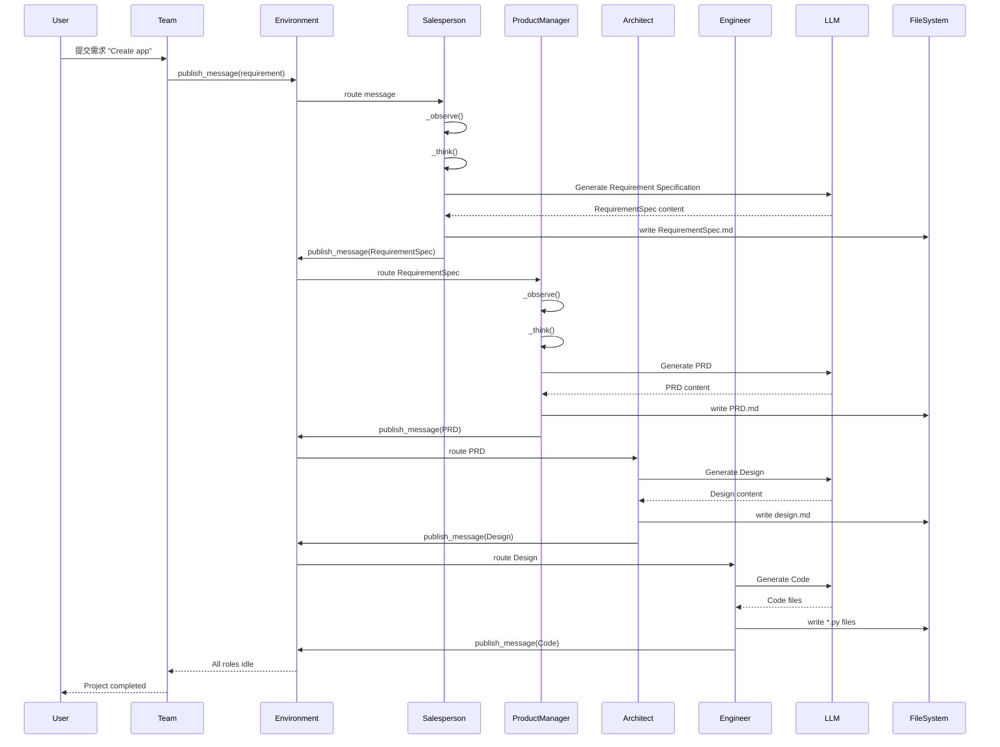
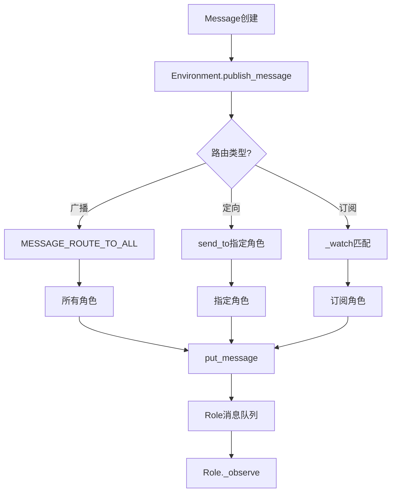
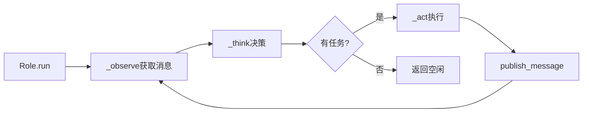
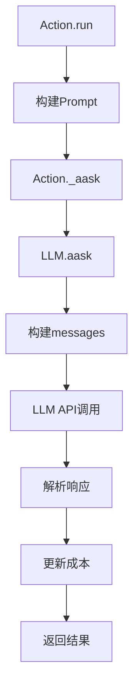
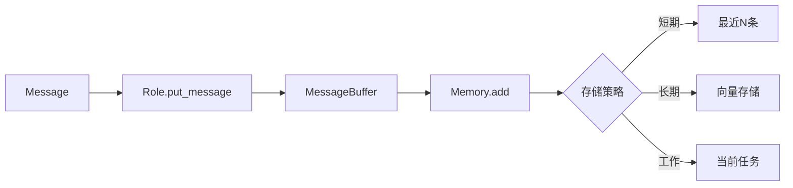

# 即思即成（Mind2Build）数据流文档

**Slogan**: 让所思，即所得

**文档版本**: v1.0  
**创建日期**: 2025-12-24

## 1. 典型软件开发流程

```mermaid
sequenceDiagram
    participant User
    participant Team
    participant Env as Environment
    participant Sales as Salesperson
    participant PM as ProductManager
    participant Arch as Architect
    participant Eng as Engineer
    participant LLM
    participant FS as FileSystem
    
    User->>Team: 提交需求 "Create app"
    Team->>Env: publish_message(requirement)
    Env->>Sales: route message
    
    Sales->>Sales: _observe()
    Sales->>Sales: _think()
    Sales->>LLM: Generate Requirement Specification
    LLM-->>Sales: RequirementSpec content
    Sales->>FS: write RequirementSpec.md
    Sales->>Env: publish_message(RequirementSpec)
    
    Env->>PM: route RequirementSpec
    
    PM->>PM: _observe()
    PM->>PM: _think()
    PM->>LLM: Generate PRD
    LLM-->>PM: PRD content
    PM->>FS: write PRD.md
    PM->>Env: publish_message(PRD)
    
    Env->>Arch: route PRD
    Arch->>LLM: Generate Design
    LLM-->>Arch: Design content
    Arch->>FS: write design.md
    Arch->>Env: publish_message(Design)
    
    Env->>Eng: route Design
    Eng->>LLM: Generate Code
    LLM-->>Eng: Code files
    Eng->>FS: write *.py files
    Eng->>Env: publish_message(Code)
    
    Env-->>Team: All roles idle
    Team-->>User: Project completed
```

## 2. 消息路由流程

```mermaid
graph TB
    A[Message创建] --> B[Environment.publish_message]
    B --> C{路由类型?}
    C -->|广播| D[MESSAGE_ROUTE_TO_ALL]
    C -->|定向| E[send_to指定角色]
    C -->|订阅| F[_watch匹配]
    
    D --> G[所有角色]
    E --> H[指定角色]
    F --> I[订阅角色]
    
    G --> J[put_message]
    H --> J
    I --> J
    
    J --> K[Role消息队列]
    K --> L[Role._observe]
```

## 3. 角色执行流程

```mermaid
graph LR
    A[Role.run] --> B[_observe获取消息]
    B --> C[_think决策]
    C --> D{有任务?}
    D -->|是| E[_act执行]
    D -->|否| F[返回空闲]
    E --> G[publish_message]
    G --> B
```

## 4. LLM 调用流程

```mermaid
graph TB
    A[Action.run] --> B[构建Prompt]
    B --> C[Action._aask]
    C --> D[LLM.aask]
    D --> E[构建messages]
    E --> F[LLM API调用]
    F --> G[解析响应]
    G --> H[更新成本]
    H --> I[返回结果]
```

## 5. 内存管理流程

```mermaid
graph LR
    A[Message] --> B[Role.put_message]
    B --> C[MessageBuffer]
    C --> D[Memory.add]
    D --> E{存储策略}
    E -->|短期| F[最近N条]
    E -->|长期| G[向量存储]
    E -->|工作| H[当前任务]
```

---

**参考**: 完整流程见架构文档
