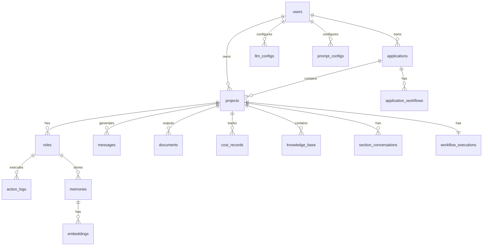

# Mind2Build 数据库设计文档 V2

**文档版本**: v2.1  
**创建日期**: 2025-12-24  
**最后更新**: 2026-01-26（添加project_versions表说明，更新Git相关字段说明）  
**数据库类型**: PostgreSQL  
**主键类型**: UUID (使用 `uuid_generate_v4()`)

---

## 目录

1. [概述](#1-概述)
2. [ER 图](#2-er-图)
3. [表结构设计](#3-表结构设计)
4. [索引设计](#4-索引设计)
5. [数据字典](#5-数据字典)
6. [SQL 脚本](#6-sql-脚本)

---

## 1. 概述

### 1.1 设计原则

- **简洁性**: 合并冗余表（teams 合并到 projects）
- **统一性**: LLM 配置统一为单一表
- **可扩展性**: JSONB 字段支持灵活扩展
- **数据完整性**: 外键约束和数据验证
- **审计追踪**: 记录创建和更新时间
- **软删除**: 重要数据不物理删除

### 1.2 核心实体（共18张表，包含project_versions和role_llm_configs）

| 实体 | 说明 | 优先级 |
|------|------|--------|
| users | 用户信息 | P0 |
| applications | 应用/业务线 | P0 |
| projects | 项目信息（合并 teams） | P0 |
| project_versions | 项目版本（Git分支管理） | P0 |
| roles | 角色运行实例 | P0 |
| messages | 消息记录 | P0 |
| action_logs | 行动执行日志 | P1 |
| documents | 生成的文档 | P1 |
| cost_records | 成本记录 | P1 |
| memories | 长期记忆 | P2 |
| embeddings | 向量嵌入 | P2 |
| llm_configs | 统一 LLM 配置 | P1 |
| role_llm_configs | 角色特定LLM配置 | P1 |
| prompt_configs | Prompt 配置 | P1 |
| knowledge_base | 知识库 | P1 |
| section_conversations | 章节对话 | P1 |
| role_definitions | 角色元定义 | P0 |
| action_definitions | Action 元定义 | P0 |
| application_workflows | 应用工作流配置 | P1 |
| workflow_executions | 工作流执行实例 | P0 |

### 1.3 V2 主要变更

| 变更 | 说明 |
|------|------|
| **teams 合并到 projects** | 消除 1:1 冗余关系 |
| **actions 改名为 action_logs** | 更清晰表达日志性质 |
| **LLM 配置统一** | 三表合并为 llm_configs |
| **删除废弃表** | interactive_session_* 等 |
| **messages.role_id 改名** | 改为 role_profile |

---

## 2. ER 图



---

## 3. 表结构设计

### 3.1 users (用户表)

```sql
CREATE TABLE users (
    id UUID PRIMARY KEY DEFAULT uuid_generate_v4(),
    username VARCHAR(50) NOT NULL UNIQUE,
    email VARCHAR(100) NOT NULL UNIQUE,
    password_hash VARCHAR(255) NOT NULL,
    full_name VARCHAR(100),
    avatar_url VARCHAR(500),
    status VARCHAR(20) DEFAULT 'active',  -- active, inactive, banned
    config JSONB DEFAULT '{}',
    created_at TIMESTAMP DEFAULT NOW(),
    updated_at TIMESTAMP DEFAULT NOW(),
    deleted_at TIMESTAMP
);
```

### 3.2 applications (应用表)

```sql
CREATE TABLE applications (
    id UUID PRIMARY KEY DEFAULT uuid_generate_v4(),
    user_id UUID NOT NULL REFERENCES users(id) ON DELETE CASCADE,
    name VARCHAR(200) NOT NULL,
    description TEXT,
    metadata JSONB DEFAULT '{}',
    created_at TIMESTAMP DEFAULT NOW(),
    updated_at TIMESTAMP DEFAULT NOW(),
    deleted_at TIMESTAMP
);
```

### 3.3 projects (项目表 - 合并 teams)

```sql
CREATE TABLE projects (
    id UUID PRIMARY KEY DEFAULT uuid_generate_v4(),
    user_id UUID NOT NULL REFERENCES users(id) ON DELETE CASCADE,
    application_id UUID REFERENCES applications(id) ON DELETE SET NULL,
    
    -- 基本信息
    name VARCHAR(200) NOT NULL,
    idea TEXT NOT NULL,
    description TEXT,
    
    -- 路径和仓库
    workspace_path VARCHAR(500),
    git_repo_url VARCHAR(500),
    
    -- 状态和进度
    status VARCHAR(20) DEFAULT 'pending',
    progress INT DEFAULT 0 CHECK (progress >= 0 AND progress <= 100),
    
    -- 预算和成本
    budget DECIMAL(10,2) DEFAULT 10.0,
    total_cost DECIMAL(10,2) DEFAULT 0.0,
    
    -- 团队配置（原 teams 表字段）
    team_status VARCHAR(20) DEFAULT 'idle',
    team_config JSONB DEFAULT '{}',
    team_state JSONB DEFAULT '{}',
    
    metadata JSONB DEFAULT '{}',
    started_at TIMESTAMP,
    completed_at TIMESTAMP,
    created_at TIMESTAMP DEFAULT NOW(),
    updated_at TIMESTAMP DEFAULT NOW(),
    deleted_at TIMESTAMP
);
```

**字段说明**:
- `status`: pending, running, completed, failed, cancelled
- `team_status`: idle, running, stopped
- `team_config`: 团队配置（JSON）
- `team_state`: 团队运行时状态（JSON）
- `git_repo_url`: Git仓库URL，如果提供则自动管理版本分支

### 3.4 project_versions (项目版本表)

```sql
CREATE TABLE project_versions (
    id UUID PRIMARY KEY DEFAULT uuid_generate_v4(),
    project_id UUID NOT NULL REFERENCES projects(id) ON DELETE CASCADE,
    
    -- 版本信息
    version_name VARCHAR(50) NOT NULL,        -- 如 v1.0, v1.1, v2.0
    description TEXT,                         -- 版本描述
    idea TEXT,                               -- 版本需求描述
    
    -- Git 分支信息
    branch_name VARCHAR(200) NOT NULL,        -- 自动生成: {project-slug}/{version}
    workspace_path VARCHAR(500),              -- 版本工作空间路径
    
    -- 状态
    is_active BOOLEAN DEFAULT false,          -- 是否为当前激活版本
    
    -- 元数据
    metadata JSONB DEFAULT '{}',
    
    created_at TIMESTAMP DEFAULT NOW(),
    updated_at TIMESTAMP DEFAULT NOW(),
    deleted_at TIMESTAMP,
    
    -- 约束：同一项目下版本名唯一
    UNIQUE(project_id, version_name),
    -- 约束：同一项目下分支名唯一
    UNIQUE(project_id, branch_name)
);
```

**字段说明**:
- `version_name`: 版本名称，如 v1.0, v2.0
- `branch_name`: Git分支名，格式: `{project-slug}/{version}`（如：`my-project/v1.0`）
- `is_active`: 是否为当前激活版本，每个项目只能有一个激活版本
- `workspace_path`: 版本对应的工作空间路径

**触发器**: 自动确保每个项目只有一个激活版本

### 3.5 roles (角色运行实例表)

```sql
CREATE TABLE roles (
    id UUID PRIMARY KEY DEFAULT uuid_generate_v4(),
    project_id UUID NOT NULL REFERENCES projects(id) ON DELETE CASCADE,
    
    profile VARCHAR(100) NOT NULL,
    name VARCHAR(100) NOT NULL,
    goal TEXT,
    constraints TEXT,
    description TEXT,
    
    is_idle BOOLEAN DEFAULT true,
    react_mode VARCHAR(20) DEFAULT 'react',
    
    actions_list JSONB DEFAULT '[]',
    watch_actions JSONB DEFAULT '[]',
    state JSONB DEFAULT '{}',
    
    created_at TIMESTAMP DEFAULT NOW(),
    updated_at TIMESTAMP DEFAULT NOW(),
    
    UNIQUE(project_id, profile)
);
```

**字段说明**:
- `profile`: 角色类型（ProductManager, Architect, Engineer 等）
- `react_mode`: react, by_order, plan_and_act
- `state`: 序列化的 RoleContext 数据

### 3.6 messages (消息记录表)

```sql
CREATE TABLE messages (
    id UUID PRIMARY KEY DEFAULT uuid_generate_v4(),
    project_id UUID NOT NULL REFERENCES projects(id) ON DELETE CASCADE,
    
    message_uuid UUID NOT NULL UNIQUE,
    role_profile VARCHAR(100),  -- 发送者角色类型，'user' 表示用户消息
    
    content TEXT NOT NULL,
    instruct_content JSONB,
    
    role_type VARCHAR(50) NOT NULL,  -- system, user, assistant
    cause_by VARCHAR(100) NOT NULL,
    sent_from VARCHAR(100) NOT NULL,
    send_to JSONB NOT NULL DEFAULT '[]',
    
    metadata JSONB DEFAULT '{}',
    created_at TIMESTAMP DEFAULT NOW()
);
```

### 3.7 action_logs (行动执行日志表)

```sql
CREATE TABLE action_logs (
    id UUID PRIMARY KEY DEFAULT uuid_generate_v4(),
    project_id UUID NOT NULL REFERENCES projects(id) ON DELETE CASCADE,
    role_id UUID REFERENCES roles(id) ON DELETE SET NULL,
    message_id UUID REFERENCES messages(id) ON DELETE SET NULL,
    
    action_type VARCHAR(100) NOT NULL,
    status VARCHAR(20) DEFAULT 'pending',  -- pending, running, completed, failed
    
    input_data JSONB,
    output_data JSONB,
    
    duration_ms INT,
    error_message TEXT,
    
    created_at TIMESTAMP DEFAULT NOW()
);
```

### 3.8 documents (文档表)

```sql
CREATE TABLE documents (
    id UUID PRIMARY KEY DEFAULT uuid_generate_v4(),
    project_id UUID NOT NULL REFERENCES projects(id) ON DELETE CASCADE,
    
    filename VARCHAR(255) NOT NULL,
    doc_type VARCHAR(50) NOT NULL,  -- mrd, prd, design, code, test, readme, other
    content TEXT NOT NULL,
    storage_path VARCHAR(500),
    
    version INT DEFAULT 1,
    parent_id UUID REFERENCES documents(id) ON DELETE SET NULL,
    is_deleted BOOLEAN DEFAULT FALSE,
    
    metadata JSONB DEFAULT '{}',
    created_at TIMESTAMP DEFAULT NOW(),
    deleted_at TIMESTAMP
);
```

### 3.9 cost_records (成本记录表)

```sql
CREATE TABLE cost_records (
    id UUID PRIMARY KEY DEFAULT uuid_generate_v4(),
    project_id UUID NOT NULL REFERENCES projects(id) ON DELETE CASCADE,
    role_id UUID REFERENCES roles(id) ON DELETE SET NULL,
    
    provider VARCHAR(50) NOT NULL,
    model VARCHAR(100) NOT NULL,
    
    prompt_tokens INT NOT NULL,
    completion_tokens INT NOT NULL,
    total_tokens INT NOT NULL,
    cost DECIMAL(10,6) NOT NULL,
    
    created_at TIMESTAMP DEFAULT NOW()
);
```

### 3.10 memories (长期记忆表)

```sql
CREATE TABLE memories (
    id UUID PRIMARY KEY DEFAULT uuid_generate_v4(),
    role_id UUID NOT NULL REFERENCES roles(id) ON DELETE CASCADE,
    
    memory_type VARCHAR(50) NOT NULL,
    content TEXT NOT NULL,
    metadata JSONB DEFAULT '{}',
    
    created_at TIMESTAMP DEFAULT NOW(),
    expires_at TIMESTAMP
);
```

### 3.11 embeddings (向量嵌入表)

```sql
CREATE TABLE embeddings (
    id UUID PRIMARY KEY DEFAULT uuid_generate_v4(),
    memory_id UUID NOT NULL REFERENCES memories(id) ON DELETE CASCADE,
    
    vector JSONB NOT NULL,
    model VARCHAR(100) NOT NULL,
    
    created_at TIMESTAMP DEFAULT NOW()
);
```

### 3.12 llm_configs (统一 LLM 配置表)

```sql
CREATE TABLE llm_configs (
    id UUID PRIMARY KEY DEFAULT uuid_generate_v4(),
    user_id UUID NOT NULL REFERENCES users(id) ON DELETE CASCADE,
    
    config_scope VARCHAR(20) NOT NULL DEFAULT 'provider',  -- provider, role
    provider VARCHAR(50) NOT NULL,
    role_profile VARCHAR(100),
    
    api_key TEXT,
    base_url VARCHAR(500),
    
    model VARCHAR(100) NOT NULL,
    temperature DECIMAL(3,2) DEFAULT 0.7,
    max_tokens INT DEFAULT 8000,
    
    -- Cursor Agent 专用
    repository VARCHAR(500),
    branch_name VARCHAR(100),
    auto_create_pr BOOLEAN DEFAULT true,
    
    is_active BOOLEAN DEFAULT false,
    
    created_at TIMESTAMP DEFAULT NOW(),
    updated_at TIMESTAMP DEFAULT NOW(),
    deleted_at TIMESTAMP
);
```

**配置查询优先级**:
1. `config_scope='role' AND role_profile=?` - 角色专属配置
2. `config_scope='provider' AND is_active=true` - 提供商默认配置
3. 环境变量默认值

### 3.13 role_llm_configs (角色特定LLM配置表)

```sql
CREATE TABLE role_llm_configs (
    id UUID PRIMARY KEY DEFAULT uuid_generate_v4(),
    role_profile VARCHAR(100) NOT NULL UNIQUE,  -- 角色类型
    
    provider VARCHAR(50) NOT NULL,
    model VARCHAR(100) NOT NULL,
    api_key VARCHAR(500),
    base_url VARCHAR(500),
    temperature DECIMAL(3, 2) DEFAULT 0.7,
    max_tokens INTEGER DEFAULT 8000,
    
    -- Cursor Agent 专用字段
    repository VARCHAR(500),
    branch_name VARCHAR(200),
    auto_create_pr BOOLEAN DEFAULT false,
    
    created_at TIMESTAMP DEFAULT NOW(),
    updated_at TIMESTAMP DEFAULT NOW()
);
```

**字段说明**:
- `role_profile`: 角色类型（ProductManager, Architect等），唯一约束
- 其他字段与 `llm_configs` 表相同
- 优先级高于系统默认LLM配置

### 3.14 prompt_configs (Prompt 配置表)

```sql
CREATE TABLE prompt_configs (
    id UUID PRIMARY KEY DEFAULT uuid_generate_v4(),
    user_id UUID NOT NULL REFERENCES users(id) ON DELETE CASCADE,
    
    prompt_type VARCHAR(50) NOT NULL,
    prompt_key VARCHAR(100) NOT NULL,
    content TEXT NOT NULL,
    description TEXT,
    
    is_active BOOLEAN DEFAULT true,
    
    created_at TIMESTAMP DEFAULT NOW(),
    updated_at TIMESTAMP DEFAULT NOW(),
    deleted_at TIMESTAMP,
    
    UNIQUE(user_id, prompt_type, prompt_key)
);
```

### 3.15 knowledge_base (知识库表)

```sql
CREATE TABLE knowledge_base (
    id UUID PRIMARY KEY DEFAULT uuid_generate_v4(),
    project_id UUID NOT NULL REFERENCES projects(id) ON DELETE CASCADE,
    
    title VARCHAR(255) NOT NULL,
    content TEXT NOT NULL,
    description TEXT,
    
    tags TEXT[] DEFAULT '{}',
    metadata JSONB DEFAULT '{}',
    
    is_active BOOLEAN DEFAULT TRUE,
    created_by VARCHAR(255),
    
    created_at TIMESTAMP DEFAULT NOW(),
    updated_at TIMESTAMP DEFAULT NOW(),
    deleted_at TIMESTAMP
);
```

### 3.16 section_conversations (章节对话表)

```sql
CREATE TABLE section_conversations (
    id UUID PRIMARY KEY DEFAULT uuid_generate_v4(),
    project_id UUID NOT NULL REFERENCES projects(id) ON DELETE CASCADE,
    document_id UUID REFERENCES documents(id) ON DELETE SET NULL,
    
    document_type VARCHAR(50) NOT NULL DEFAULT 'prd',
    section_number INT NOT NULL,
    version INT DEFAULT 1,
    
    messages JSONB NOT NULL DEFAULT '[]',
    
    created_at TIMESTAMP DEFAULT NOW(),
    updated_at TIMESTAMP DEFAULT NOW(),
    
    UNIQUE(project_id, document_type, section_number, version)
);
```

### 3.17 role_definitions (角色元定义表)

```sql
CREATE TABLE role_definitions (
    id UUID PRIMARY KEY DEFAULT uuid_generate_v4(),
    
    profile VARCHAR(100) NOT NULL UNIQUE,
    name VARCHAR(100) NOT NULL,
    display_name VARCHAR(200),
    
    goal TEXT,
    constraints TEXT,
    description TEXT,
    class_name VARCHAR(100) NOT NULL,
    
    is_active BOOLEAN DEFAULT true,
    metadata JSONB DEFAULT '{}',
    
    created_at TIMESTAMP DEFAULT NOW(),
    updated_at TIMESTAMP DEFAULT NOW()
);
```

### 3.18 action_definitions (Action 元定义表)

```sql
CREATE TABLE action_definitions (
    id UUID PRIMARY KEY DEFAULT uuid_generate_v4(),
    
    name VARCHAR(100) NOT NULL UNIQUE,
    display_name VARCHAR(200),
    description TEXT,
    class_name VARCHAR(100) NOT NULL,
    category VARCHAR(50),  -- document_writing, review, improvement, execution, planning, analysis
    
    is_active BOOLEAN DEFAULT true,
    metadata JSONB DEFAULT '{}',
    
    created_at TIMESTAMP DEFAULT NOW(),
    updated_at TIMESTAMP DEFAULT NOW()
);
```

### 3.19 application_workflows (应用工作流配置表)

```sql
CREATE TABLE application_workflows (
    id UUID PRIMARY KEY DEFAULT uuid_generate_v4(),
    application_id UUID NOT NULL REFERENCES applications(id) ON DELETE CASCADE,
    
    name VARCHAR(200) NOT NULL,
    description TEXT,
    is_default BOOLEAN DEFAULT false,
    
    workflow_config JSONB NOT NULL DEFAULT '{}',
    
    created_at TIMESTAMP DEFAULT NOW(),
    updated_at TIMESTAMP DEFAULT NOW()
);
```

**workflow_config 结构**:
```json
{
  "roles": [
    {
      "profile": "ProductManager",
      "name": "Product Manager",
      "order": 0,
      "actions": ["WriteMRD", "WritePRD"],
      "watch_actions": ["MRDReview", "PRDReview"]
    }
  ]
}
```

### 3.20 workflow_executions (工作流执行实例表)

```sql
CREATE TABLE workflow_executions (
    id UUID PRIMARY KEY DEFAULT uuid_generate_v4(),
    project_id UUID NOT NULL UNIQUE REFERENCES projects(id) ON DELETE CASCADE,
    
    workflow_snapshot JSONB NOT NULL,
    state VARCHAR(30) NOT NULL DEFAULT 'initialized',
    
    current_position JSONB,  -- { roleIndex, actionIndex }
    steps JSONB NOT NULL DEFAULT '[]',
    
    pending_confirmation JSONB,
    last_error JSONB,
    execution_context JSONB DEFAULT '{}',
    
    version INT NOT NULL DEFAULT 0,
    
    created_at TIMESTAMP DEFAULT NOW(),
    updated_at TIMESTAMP DEFAULT NOW()
);
```

**state 值**:
- `initialized`: 初始化完成
- `running`: 执行中
- `waiting_confirmation`: 等待确认
- `paused`: 暂停
- `completed`: 完成
- `failed`: 失败

---

## 4. 索引设计

### 4.1 主要索引

| 表名 | 索引类型 | 索引字段 | 用途 |
|------|---------|---------|------|
| users | UNIQUE | username, email | 唯一性约束 |
| projects | B-tree | user_id, status | 查询优化 |
| messages | B-tree | project_id, created_at | 时间序列查询 |
| cost_records | B-tree | project_id, provider | 成本统计 |
| llm_configs | UNIQUE | user_id, provider, role_profile | 配置唯一性 |

---

## 5. 数据字典

### 5.1 项目状态 (projects.status)

| 值 | 说明 |
|---|------|
| pending | 待开始 |
| running | 运行中 |
| completed | 已完成 |
| failed | 失败 |
| cancelled | 已取消 |

### 5.2 角色类型 (role_definitions.profile)

| 值 | 说明 |
|---|------|
| ProductManager | 产品经理 |
| Architect | 架构师 |
| Engineer | 工程师 |
| QAEngineer | QA工程师 |
| ProjectManager | 项目经理 |
| TeamLeader | 团队负责人 |
| Salesperson | 销售 |
| DataAnalyst | 数据分析师 |
| AutomationEngineer | 自动化工程师 |

### 5.3 文档类型 (documents.doc_type)

| 值 | 说明 |
|---|------|
| mrd | 市场需求文档 |
| prd | 产品需求文档 |
| design | 设计文档 |
| code | 源代码 |
| test | 测试代码 |
| readme | 说明文档 |
| other | 其他 |

### 5.4 Action 分类 (action_definitions.category)

| 值 | 说明 |
|---|------|
| document_writing | 文档编写 |
| review | 评审 |
| improvement | 改进 |
| execution | 执行 |
| planning | 规划 |
| analysis | 分析 |

---

## 6. SQL 脚本

### 6.1 完整建表脚本

位置: `backend/src/database/migrations/000_schema_v2.sql`

```bash
# 执行建表
npx ts-node src/database/migrations/run_schema_v2.ts
```

### 6.2 种子数据脚本

位置: `backend/src/database/migrations/seed_data_v2.ts`

```bash
# 执行种子数据
npx ts-node src/database/migrations/seed_data_v2.ts
```

### 6.3 完整初始化流程

```bash
cd backend

# 1. 重建数据库结构
npx ts-node src/database/migrations/run_schema_v2.ts

# 2. 插入种子数据
npx ts-node src/database/migrations/seed_data_v2.ts
```

---

## 附录

### A. 删除的表（V1 → V2）

| 表名 | 删除原因 |
|------|---------|
| teams | 合并到 projects |
| llm_provider_configs | 合并到 llm_configs |
| role_llm_configs | 合并到 llm_configs |
| interactive_session_workflows | 被 workflow_executions 替代 |
| interactive_session_running_state | 被 workflow_executions 替代 |
| interactive_session_step_state | 被 workflow_executions 替代 |
| application_roles | 信息在 workflow_config 中 |
| application_actions | 信息在 workflow_config 中 |
| system_default_workflow_templates | 通过种子数据实现 |

### B. 表空间估算

假设 1000 个活跃项目，每个项目平均：
- 消息：500 条
- 文档：20 个
- 成本记录：100 条

预估存储：
- messages: ~500MB
- documents: ~2GB
- cost_records: ~50MB
- **总计**: ~3-5GB

---

**文档维护**: 随系统演进更新  
**最后更新**: 2026-01-25 (Schema V2)
