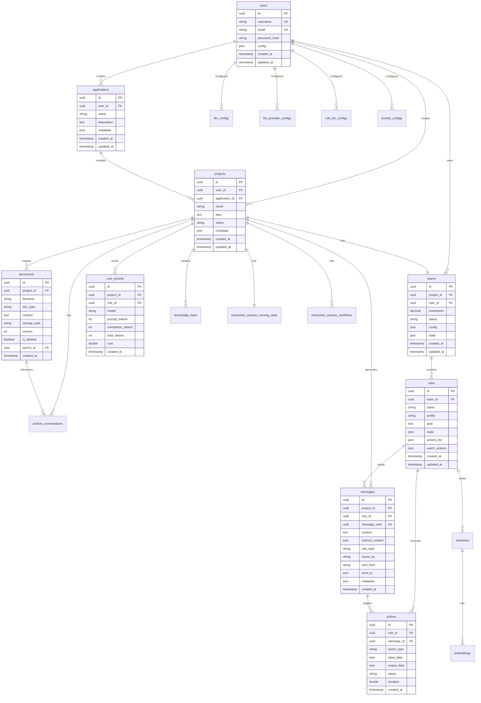

# mind2build 数据库设计文档

**文档版本**: v2.0  
**创建日期**: 2025-12-24  
**最后更新**: 2025-01-XX  
**数据库类型**: PostgreSQL  
**主键类型**: UUID (使用 `uuid_generate_v4()`)

**重要说明**: 本文档已根据代码实际使用情况重新设计，包含所有新增的表和字段。

---

## 目录

1. [概述](#1-概述)
2. [ER 图](#2-er-图)
3. [表结构设计](#3-表结构设计)
4. [索引设计](#4-索引设计)
5. [数据字典](#5-数据字典)
6. [SQL 脚本](#6-sql-脚本)

---

## 1. 概述

### 1.1 设计原则

- **可扩展性**: 支持水平扩展和分表
- **性能优化**: 合理的索引和分区策略
- **数据完整性**: 外键约束和数据验证
- **审计追踪**: 记录创建和更新时间
- **软删除**: 重要数据不物理删除

### 1.2 核心实体

| 实体 | 说明 | 优先级 |
|------|------|--------|
| users | 用户信息 | P0 |
| applications | 应用信息（组织项目） | P0 |
| projects | 项目信息 | P0 |
| teams | 团队信息 | P0 |
| roles | 角色实例 | P0 |
| messages | 消息记录 | P0 |
| actions | 行动记录 | P1 |
| documents | 生成的文档 | P1 |
| cost_records | 成本记录 | P1 |
| memories | 长期记忆 | P2 |
| embeddings | 向量嵌入 | P2 |
| llm_configs | LLM配置 | P1 |
| llm_provider_configs | LLM提供商配置 | P1 |
| role_llm_configs | 角色LLM配置 | P1 |
| prompt_configs | Prompt配置 | P1 |
| knowledge_base | 知识库 | P1 |
| section_conversations | 章节对话 | P1 |
| interactive_session_workflows | 交互式会话工作流 | P1 |
| interactive_session_running_state | 交互式会话运行状态 | P1 |

---

## 2. ER 图



---

## 3. 表结构设计

### 3.1 users (用户表)

**用途**: 存储用户账户信息

```sql
CREATE TABLE users (
    id UUID PRIMARY KEY DEFAULT uuid_generate_v4(),
    username VARCHAR(50) NOT NULL UNIQUE,
    email VARCHAR(100) NOT NULL UNIQUE,
    password_hash VARCHAR(255) NOT NULL,
    full_name VARCHAR(100),
    avatar_url VARCHAR(500),
    api_keys JSONB DEFAULT '{}',  -- 存储各种 LLM API Keys (加密)
    config JSONB DEFAULT '{}',     -- 用户配置
    status VARCHAR(20) DEFAULT 'active',  -- active, inactive, banned
    created_at TIMESTAMP DEFAULT NOW(),
    updated_at TIMESTAMP DEFAULT NOW(),
    last_login_at TIMESTAMP,
    deleted_at TIMESTAMP
);

CREATE INDEX idx_users_username ON users(username);
CREATE INDEX idx_users_email ON users(email);
CREATE INDEX idx_users_status ON users(status);
```

**字段说明**:
- `id`: UUID主键，使用`uuid_generate_v4()`自动生成
- `api_keys`: 加密存储的 API Keys (OpenAI, Claude 等)
- `config`: 用户偏好配置 (默认模型、预算等)
- `deleted_at`: 软删除标记

---

### 3.2 applications (应用表)

**用途**: 存储应用信息，用于组织相关项目

```sql
CREATE TABLE applications (
    id UUID PRIMARY KEY DEFAULT uuid_generate_v4(),
    user_id UUID NOT NULL REFERENCES users(id) ON DELETE CASCADE,
    name VARCHAR(200) NOT NULL,
    description TEXT,
    metadata JSONB DEFAULT '{}',
    created_at TIMESTAMP DEFAULT NOW(),
    updated_at TIMESTAMP DEFAULT NOW(),
    deleted_at TIMESTAMP
);

CREATE INDEX idx_applications_user_id ON applications(user_id);
CREATE INDEX idx_applications_created_at ON applications(created_at DESC);
```

**字段说明**:
- `id`: UUID主键
- `user_id`: 所属用户
- `name`: 应用名称
- `description`: 应用描述
- `metadata`: 额外元数据
- `deleted_at`: 软删除标记

---

### 3.3 projects (项目表)

**用途**: 存储项目基本信息

```sql
CREATE TABLE projects (
    id UUID PRIMARY KEY DEFAULT uuid_generate_v4(),
    user_id UUID NOT NULL REFERENCES users(id) ON DELETE CASCADE,
    application_id UUID REFERENCES applications(id) ON DELETE SET NULL,
    name VARCHAR(200) NOT NULL,
    idea TEXT NOT NULL,                    -- 项目需求/想法
    description TEXT,
    project_path VARCHAR(500),             -- 项目文件路径
    status VARCHAR(20) DEFAULT 'pending',  -- pending, running, completed, failed
    progress INT DEFAULT 0,                 -- 进度 0-100
    n_round INT DEFAULT 5,                  -- 计划轮数
    current_round INT DEFAULT 0,            -- 当前轮数
    investment DECIMAL(10,2) DEFAULT 10.0,          -- 预算
    total_cost DECIMAL(10,2) DEFAULT 0.0,           -- 实际花费
    metadata JSONB DEFAULT '{}',            -- 其他元数据
    started_at TIMESTAMP,
    completed_at TIMESTAMP,
    created_at TIMESTAMP DEFAULT NOW(),
    updated_at TIMESTAMP DEFAULT NOW(),
    deleted_at TIMESTAMP
);

CREATE INDEX idx_projects_user_id ON projects(user_id);
CREATE INDEX idx_projects_application_id ON projects(application_id);
CREATE INDEX idx_projects_status ON projects(status);
CREATE INDEX idx_projects_created_at ON projects(created_at DESC);
```

**字段说明**:
- `id`: UUID主键
- `application_id`: 所属应用（可选，用于组织项目）
- `status`: 
  - `pending`: 待开始
  - `running`: 运行中
  - `completed`: 已完成
  - `failed`: 失败
  - `cancelled`: 已取消
- `metadata`: 存储额外配置 (code_review, run_tests 等)

---

### 3.4 teams (团队表)

**用途**: 存储团队信息（一个项目对应一个团队）

```sql
CREATE TABLE teams (
    id UUID PRIMARY KEY DEFAULT gen_random_uuid(),
    project_id UUID NOT NULL UNIQUE REFERENCES projects(id) ON DELETE CASCADE,
    user_id UUID NOT NULL REFERENCES users(id),
    investment DECIMAL(10,2) DEFAULT 10.0,
    idea TEXT NOT NULL,
    use_mgx BOOLEAN DEFAULT true,
    env_type VARCHAR(50) DEFAULT 'Environment',  -- Environment, MGXEnv
    status VARCHAR(20) DEFAULT 'idle',  -- idle, running, stopped
    config JSONB DEFAULT '{}',
    state JSONB DEFAULT '{}',           -- 序列化的团队状态
    created_at TIMESTAMP DEFAULT NOW(),
    updated_at TIMESTAMP DEFAULT NOW()
);

CREATE INDEX idx_teams_project_id ON teams(project_id);
CREATE INDEX idx_teams_status ON teams(status);
```

---

### 3.5 roles (角色表)

**用途**: 存储角色实例信息

```sql
CREATE TABLE roles (
    id UUID PRIMARY KEY DEFAULT gen_random_uuid(),
    team_id UUID NOT NULL REFERENCES teams(id) ON DELETE CASCADE,
    name VARCHAR(100) NOT NULL,
    profile VARCHAR(100) NOT NULL,        -- ProductManager, Architect, Engineer
    goal TEXT,
    constraints TEXT,
    description TEXT,
    is_idle BOOLEAN DEFAULT true,
    state_index INT DEFAULT 0,
    max_react_loop INT DEFAULT 1,
    react_mode VARCHAR(20) DEFAULT 'react',  -- react, by_order, plan_and_act
    enable_memory BOOLEAN DEFAULT true,
    use_fixed_sop BOOLEAN DEFAULT false,
    tools JSONB DEFAULT '[]',              -- 工具列表
    actions_list JSONB DEFAULT '[]',            -- Action 类型列表（注意：字段名为actions_list）
    watch_actions JSONB DEFAULT '[]',      -- 订阅的 Action
    state JSONB DEFAULT '{}',              -- 序列化的角色状态
    created_at TIMESTAMP DEFAULT NOW(),
    updated_at TIMESTAMP DEFAULT NOW()
);

CREATE INDEX idx_roles_team_id ON roles(team_id);
CREATE INDEX idx_roles_profile ON roles(profile);
CREATE INDEX idx_roles_is_idle ON roles(is_idle);
```

**字段说明**:
- `id`: UUID主键
- `profile`: 角色类型 (ProductManager, Architect, Engineer, QAEngineer, TeamLeader, Salesperson, DataAnalyst)
- `actions_list`: Action类型列表（注意：实际字段名为`actions_list`而非`actions`）
- `state`: 完整的 RoleContext 序列化数据

---

### 3.6 messages (消息表)

**用途**: 存储所有消息记录

```sql
CREATE TABLE messages (
    id UUID PRIMARY KEY DEFAULT gen_random_uuid(),
    message_uuid UUID UNIQUE NOT NULL,  -- Message.id (UUID格式)
    project_id UUID NOT NULL REFERENCES projects(id) ON DELETE CASCADE,
    role_id VARCHAR(100),              -- 角色类型 (profile): ProductManager, Architect, Engineer, QAEngineer, TeamLeader, Salesperson, DataAnalyst, user表示用户消息
    content TEXT NOT NULL,
    instruct_content JSONB,                    -- 结构化内容
    role_type VARCHAR(50) NOT NULL,      -- system, user, assistant
    cause_by VARCHAR(100) NOT NULL,                     -- 触发的 Action 类名
    sent_from VARCHAR(100) NOT NULL,                    -- 发送者标识
    send_to JSONB NOT NULL,                -- 接收者列表
    metadata JSONB DEFAULT '{}',
    created_at TIMESTAMP DEFAULT NOW()
);

CREATE INDEX idx_messages_project_id ON messages(project_id);
CREATE INDEX idx_messages_role_id ON messages(role_id);
CREATE INDEX idx_messages_cause_by ON messages(cause_by);
CREATE INDEX idx_messages_created_at ON messages(created_at DESC);
```

**字段说明**:
- `id`: UUID主键
- `role_id`: 角色类型 (profile)，存储角色的 profile 值（如 ProductManager、Architect），'user' 表示用户消息
- `message_uuid`: 对应 Message.id (UUID格式)
- `instruct_content`: 结构化的指令内容
- `cause_by`: 触发此消息的 Action 类名

---

### 3.7 actions (行动记录表)

**用途**: 记录所有 Action 的执行

```sql
CREATE TABLE actions (
    id UUID PRIMARY KEY DEFAULT gen_random_uuid(),
    role_id UUID NOT NULL REFERENCES roles(id) ON DELETE CASCADE,
    message_id UUID REFERENCES messages(id) ON DELETE SET NULL,  -- 触发的消息
    action_type VARCHAR(100) NOT NULL,          -- WritePRD, WriteDesign, WriteCode
    input_data JSONB,                           -- 输入数据
    output_data JSONB,                          -- 输出数据
    status VARCHAR(20) DEFAULT 'pending',       -- pending, running, completed, failed
    duration DOUBLE PRECISION,                     -- 执行时长（秒）
    created_at TIMESTAMP DEFAULT NOW()
);

CREATE INDEX idx_actions_role_id ON actions(role_id);
CREATE INDEX idx_actions_message_id ON actions(message_id);
CREATE INDEX idx_actions_action_type ON actions(action_type);
CREATE INDEX idx_actions_status ON actions(status);
```

**字段说明**:
- `id`: UUID主键
- `action_type`: Action 类名 (WritePRD, WriteDesign, WriteCode, ExecuteSubtask等)
- `duration`: 执行时长，用于性能分析

---

### 3.8 documents (文档表)

**用途**: 存储生成的文档（支持版本管理和软删除）

```sql
CREATE TABLE documents (
    id UUID PRIMARY KEY DEFAULT gen_random_uuid(),
    project_id UUID NOT NULL REFERENCES projects(id) ON DELETE CASCADE,
    filename VARCHAR(255) NOT NULL,
    doc_type VARCHAR(50) NOT NULL,          -- PRD, Design, Code, Test, README
    content TEXT NOT NULL,                            -- 文档内容
    storage_path VARCHAR(500),               -- 外部存储路径
    metadata JSONB DEFAULT '{}',
    version INT DEFAULT 1,                   -- 版本号
    is_deleted BOOLEAN DEFAULT FALSE,        -- 软删除标记
    deleted_at TIMESTAMP,
    parent_id UUID REFERENCES documents(id) ON DELETE SET NULL,  -- 父版本引用
    created_at TIMESTAMP DEFAULT NOW()
);

CREATE INDEX idx_documents_project_id ON documents(project_id);
CREATE INDEX idx_documents_doc_type ON documents(doc_type);
CREATE INDEX idx_documents_version ON documents(version);
CREATE INDEX idx_documents_parent_id ON documents(parent_id);
CREATE INDEX idx_documents_is_deleted ON documents(is_deleted);
CREATE INDEX idx_documents_prd_version ON documents(project_id, doc_type, version) WHERE doc_type = 'prd';
```

**字段说明**:
- `id`: UUID主键
- `doc_type`: PRD, Design, Code, Test, README, Config
- `version`: 文档版本号，从1开始
- `is_deleted`: 软删除标记，用于PRD版本管理
- `parent_id`: 指向父版本，形成版本链

---

### 3.9 cost_records (成本记录表)

**用途**: 跟踪 LLM 调用成本

```sql
CREATE TABLE cost_records (
    id UUID PRIMARY KEY DEFAULT gen_random_uuid(),
    project_id UUID NOT NULL REFERENCES projects(id) ON DELETE CASCADE,
    role_id UUID REFERENCES roles(id) ON DELETE SET NULL,
    model VARCHAR(50) NOT NULL,
    prompt_tokens INT NOT NULL,
    completion_tokens INT NOT NULL,
    total_tokens INT NOT NULL,
    cost DOUBLE PRECISION NOT NULL,
    created_at TIMESTAMP DEFAULT NOW()
);

CREATE INDEX idx_cost_records_project_id ON cost_records(project_id);
CREATE INDEX idx_cost_records_role_id ON cost_records(role_id);
CREATE INDEX idx_cost_records_created_at ON cost_records(created_at DESC);
```

**字段说明**:
- `id`: UUID主键
- `cost`: 成本（美元）

---

### 3.10 memories (长期记忆表)

**用途**: 存储角色的长期记忆

```sql
CREATE TABLE memories (
    id UUID PRIMARY KEY DEFAULT gen_random_uuid(),
    role_id UUID NOT NULL REFERENCES roles(id) ON DELETE CASCADE,
    type VARCHAR(20) NOT NULL,
    content TEXT NOT NULL,
    metadata JSONB DEFAULT '{}',
    created_at TIMESTAMP DEFAULT NOW(),
    expires_at TIMESTAMP
);

CREATE INDEX idx_memories_role_id ON memories(role_id);
CREATE INDEX idx_memories_type ON memories(type);
CREATE INDEX idx_memories_expires_at ON memories(expires_at);
```

---

### 3.11 embeddings (向量嵌入表)

**用途**: 存储文本的向量嵌入（用于语义搜索）

```sql
CREATE TABLE embeddings (
    id UUID PRIMARY KEY DEFAULT uuid_generate_v4(),
    memory_id UUID NOT NULL REFERENCES memories(id) ON DELETE CASCADE,
    vector JSONB NOT NULL,
    model VARCHAR(50) NOT NULL,
    metadata JSONB DEFAULT '{}',
    created_at TIMESTAMP DEFAULT NOW()
);

CREATE INDEX idx_embeddings_memory_id ON embeddings(memory_id);
```

**注意**: 当前实现使用JSONB存储向量，未来可考虑使用pgvector扩展

---

### 3.12 llm_configs (LLM配置表)

**用途**: 存储用户的LLM模型配置（API keys和base URLs请使用llm_provider_configs表）

```sql
CREATE TABLE llm_configs (
    id UUID PRIMARY KEY DEFAULT uuid_generate_v4(),
    user_id UUID NOT NULL REFERENCES users(id) ON DELETE CASCADE,
    provider VARCHAR(50) NOT NULL,
    model VARCHAR(100) NOT NULL,
    temperature DECIMAL(3,2) DEFAULT 0.7,
    max_tokens INT DEFAULT 8000,
    is_active BOOLEAN DEFAULT false,
    created_at TIMESTAMP DEFAULT NOW(),
    updated_at TIMESTAMP DEFAULT NOW(),
    deleted_at TIMESTAMP
);
```

**字段说明**:
- `provider`: LLM提供商 (openai, zhipuai, ark等)
- `model`: 模型名称
- `temperature`: 温度参数
- `max_tokens`: 最大token数
- `is_active`: 是否为激活配置

**注意**: API keys和base URLs已迁移到`llm_provider_configs`表，请使用该表进行配置

---

### 3.13 llm_provider_configs (LLM提供商配置表)

**用途**: 存储提供商级别的配置（API keys和base URLs）

```sql
CREATE TABLE llm_provider_configs (
    id UUID PRIMARY KEY DEFAULT uuid_generate_v4(),
    user_id UUID NOT NULL REFERENCES users(id) ON DELETE CASCADE,
    provider VARCHAR(50) NOT NULL,
    api_key VARCHAR(500),
    base_url VARCHAR(500),
    model VARCHAR(100),
    created_at TIMESTAMP DEFAULT NOW(),
    updated_at TIMESTAMP DEFAULT NOW(),
    deleted_at TIMESTAMP
);
```

**字段说明**:
- `provider`: LLM提供商名称
- `model`: 提供商的默认模型（可选）

---

### 3.14 role_llm_configs (角色LLM配置表)

**用途**: 存储每个角色配置文件的LLM配置

```sql
CREATE TABLE role_llm_configs (
    id UUID PRIMARY KEY DEFAULT uuid_generate_v4(),
    user_id UUID NOT NULL REFERENCES users(id) ON DELETE CASCADE,
    role_profile VARCHAR(100) NOT NULL,
    provider VARCHAR(50) NOT NULL,
    api_key TEXT,
    base_url TEXT,
    model VARCHAR(100) NOT NULL,
    temperature DECIMAL(3,2),
    max_tokens INTEGER,
    repository TEXT,
    branch_name TEXT,
    auto_create_pr BOOLEAN DEFAULT true,
    created_at TIMESTAMP DEFAULT NOW(),
    updated_at TIMESTAMP DEFAULT NOW(),
    UNIQUE(user_id, role_profile)
);
```

**字段说明**:
- `role_profile`: 角色配置文件名称 (Engineer, ProductManager等)
- `repository`: GitHub仓库URL（用于Cursor Agent）
- `branch_name`: 分支名称（用于Cursor Agent）
- `auto_create_pr`: 是否自动创建PR（用于Cursor Agent）

---

### 3.15 prompt_configs (Prompt配置表)

**用途**: 存储不同提示类型的模板和系统提示词

```sql
CREATE TABLE prompt_configs (
    id UUID PRIMARY KEY DEFAULT uuid_generate_v4(),
    user_id UUID NOT NULL REFERENCES users(id) ON DELETE CASCADE,
    prompt_type VARCHAR(50) NOT NULL,
    prompt_key VARCHAR(100) NOT NULL,
    content TEXT NOT NULL,
    description TEXT,
    is_active BOOLEAN DEFAULT true,
    created_at TIMESTAMP DEFAULT NOW(),
    updated_at TIMESTAMP DEFAULT NOW(),
    deleted_at TIMESTAMP,
    UNIQUE(user_id, prompt_type, prompt_key)
);
```

**字段说明**:
- `prompt_type`: 提示类型 (prd, design, code, test, task)
- `prompt_key`: 提示键 (system_prompt, template, review_system_prompt等)
- `content`: 实际的提示内容

---

### 3.16 knowledge_base (知识库表)

**用途**: 存储项目级别的知识库文档，用于RAG检索

```sql
CREATE TABLE knowledge_base (
    id UUID PRIMARY KEY DEFAULT uuid_generate_v4(),
    project_id UUID NOT NULL REFERENCES projects(id) ON DELETE CASCADE,
    title VARCHAR(255) NOT NULL,
    content TEXT NOT NULL,
    description TEXT,
    tags TEXT[],
    metadata JSONB DEFAULT '{}',
    is_active BOOLEAN DEFAULT TRUE,
    created_by VARCHAR(255),
    created_at TIMESTAMP DEFAULT NOW(),
    updated_at TIMESTAMP DEFAULT NOW(),
    deleted_at TIMESTAMP
);
```

**字段说明**:
- `tags`: 标签数组，用于分类和过滤文档
- `is_active`: 文档是否激活并可搜索

---

### 3.17 section_conversations (章节对话表)

**用途**: 存储章节调整的对话历史

```sql
CREATE TABLE section_conversations (
    id UUID PRIMARY KEY DEFAULT uuid_generate_v4(),
    project_id UUID NOT NULL REFERENCES projects(id) ON DELETE CASCADE,
    document_id UUID REFERENCES documents(id) ON DELETE SET NULL,
    section_number INT NOT NULL,
    document_type VARCHAR(50) NOT NULL DEFAULT 'PRD',
    application_id UUID,
    version INT DEFAULT 1,
    messages JSONB NOT NULL DEFAULT '[]',
    created_at TIMESTAMP DEFAULT NOW(),
    updated_at TIMESTAMP DEFAULT NOW(),
    UNIQUE(project_id, section_number, document_type, version)
);
```

**字段说明**:
- `section_number`: 章节编号
- `document_type`: 文档类型 (PRD, Design等)
- `messages`: 对话消息数组，包含role、content和timestamp

---

### 3.18 interactive_session_workflows (交互式会话工作流表)

**用途**: 存储交互式会话中所有角色和行动的状态

```sql
CREATE TABLE interactive_session_workflows (
    id UUID PRIMARY KEY DEFAULT uuid_generate_v4(),
    project_id UUID NOT NULL REFERENCES projects(id) ON DELETE CASCADE,
    role VARCHAR(100) NOT NULL,
    action VARCHAR(100),
    status VARCHAR(20) DEFAULT 'pending',
    created_at TIMESTAMP DEFAULT NOW(),
    updated_at TIMESTAMP DEFAULT NOW(),
    UNIQUE(project_id, role, action)
);
```

**字段说明**:
- `role`: 角色名称
- `action`: 行动名称
- `status`: 工作流项状态 (pending, running, completed, failed)

---

### 3.19 interactive_session_running_state (交互式会话运行状态表)

**用途**: 存储当前运行的角色和行动

```sql
CREATE TABLE interactive_session_running_state (
    id UUID PRIMARY KEY DEFAULT uuid_generate_v4(),
    project_id UUID UNIQUE NOT NULL REFERENCES projects(id) ON DELETE CASCADE,
    current_role VARCHAR(100),
    current_action VARCHAR(100),
    updated_at TIMESTAMP DEFAULT NOW(),
    created_at TIMESTAMP DEFAULT NOW()
);
```

**字段说明**:
- `current_role`: 当前运行的角色
- `current_action`: 当前运行的行动

---

### 3.20 project_snapshots (项目快照表) [可选]

**用途**: 保存项目状态快照，用于恢复（当前未实现）

```sql
CREATE TABLE project_snapshots (
    id UUID PRIMARY KEY DEFAULT uuid_generate_v4(),
    project_id UUID NOT NULL REFERENCES projects(id) ON DELETE CASCADE,
    snapshot_name VARCHAR(200),
    snapshot_type VARCHAR(20) DEFAULT 'manual',  -- manual, auto, checkpoint
    team_state JSONB NOT NULL,                   -- 序列化的 Team 状态
    environment_state JSONB,                     -- 序列化的 Environment 状态
    roles_state JSONB,                           -- 所有角色状态
    messages_count INT,
    documents_count INT,
    total_cost DECIMAL(10,2),
    description TEXT,
    created_at TIMESTAMP DEFAULT NOW()
);

CREATE INDEX idx_snapshots_project_id ON project_snapshots(project_id);
CREATE INDEX idx_snapshots_created_at ON project_snapshots(created_at DESC);
```

---

### 3.13 audit_logs (审计日志表) [可选]

**用途**: 记录所有重要操作（当前未实现）

```sql
CREATE TABLE audit_logs (
    id UUID PRIMARY KEY DEFAULT uuid_generate_v4(),
    user_id UUID REFERENCES users(id),
    entity_type VARCHAR(50) NOT NULL,    -- project, team, role, message
    entity_id UUID NOT NULL,
    action VARCHAR(50) NOT NULL,         -- create, update, delete, execute
    old_value JSONB,
    new_value JSONB,
    ip_address INET,
    user_agent TEXT,
    created_at TIMESTAMP DEFAULT NOW()
);

CREATE INDEX idx_audit_user_id ON audit_logs(user_id);
CREATE INDEX idx_audit_entity ON audit_logs(entity_type, entity_id);
CREATE INDEX idx_audit_created_at ON audit_logs(created_at DESC);
```

---

## 4. 索引设计

### 4.1 主要索引

| 表名 | 索引类型 | 索引字段 | 用途 |
|------|---------|---------|------|
| users | UNIQUE | username, email | 唯一性约束 |
| projects | B-tree | user_id, status | 查询优化 |
| messages | B-tree | project_id, created_at | 时间序列查询 |
| cost_records | B-tree | project_id, model | 成本统计 |
| embeddings | IVFFlat | embedding_vector | 向量相似度搜索 |

### 4.2 复合索引

```sql
-- 项目消息查询优化
CREATE INDEX idx_messages_project_time ON messages(project_id, created_at DESC);

-- 角色行动查询
CREATE INDEX idx_actions_role_status ON actions(role_id, status);

-- 成本分析
CREATE INDEX idx_cost_project_model ON cost_records(project_id, model, created_at);
```

---

## 5. 数据字典

### 5.1 状态枚举

**项目状态 (project.status)**:
- `pending`: 待开始
- `running`: 运行中
- `completed`: 已完成
- `failed`: 失败
- `cancelled`: 已取消

**角色类型 (role.profile)**:
- `ProductManager`: 产品经理
- `Architect`: 架构师
- `Engineer`: 工程师
- `QAEngineer`: QA 工程师
- `TeamLeader`: 团队领导
- `DataInterpreter`: 数据解释器

**文档类型 (document.doc_type)**:
- `PRD`: 产品需求文档
- `Design`: 设计文档
- `Code`: 源代码
- `Test`: 测试代码
- `README`: 说明文档
- `Config`: 配置文件

---

## 6. SQL 脚本

### 6.1 完整建表脚本

完整的数据库初始化脚本位于：`backend/src/database/migrations/000_complete_schema.sql`

**使用方法**：

```bash
# 连接到PostgreSQL数据库
psql -U postgres -d your_database_name

# 执行完整建表脚本
\i backend/src/database/migrations/000_complete_schema.sql
```

或者使用psql命令行：

```bash
psql -U postgres -d your_database_name -f backend/src/database/migrations/000_complete_schema.sql
```

**脚本包含内容**：
- 启用uuid-ossp扩展
- 创建所有19个表（包含索引、外键约束和注释）
- 插入默认用户数据
- 完整的表关系说明

**表创建顺序**（已按依赖关系排序）：
1. users（用户表）
2. applications（应用表）
3. projects（项目表）
4. teams（团队表）
5. roles（角色表）
6. messages（消息表）
7. actions（行动记录表）
8. documents（文档表）
9. cost_records（成本记录表）
10. memories（长期记忆表）
11. embeddings（向量嵌入表）
12. llm_configs（LLM配置表）
13. llm_provider_configs（LLM提供商配置表）
14. role_llm_configs（角色LLM配置表）
15. prompt_configs（Prompt配置表）
16. knowledge_base（知识库表）
17. section_conversations（章节对话表）
18. interactive_session_workflows（交互式会话工作流表）
19. interactive_session_running_state（交互式会话运行状态表）

### 6.2 常用查询示例

**查询项目总成本**:
```sql
SELECT 
    p.id,
    p.name,
    SUM(cr.cost) as total_cost,
    SUM(cr.total_tokens) as total_tokens
FROM projects p
LEFT JOIN cost_records cr ON p.id = cr.project_id
WHERE p.user_id = $1::uuid
GROUP BY p.id, p.name
ORDER BY total_cost DESC;
```

**查询角色消息历史**:
```sql
SELECT 
    m.*,
    r.name as role_name,
    r.profile
FROM messages m
JOIN roles r ON m.role_id = r.id
WHERE m.project_id = $1::uuid
ORDER BY m.created_at ASC
LIMIT 100;
```

**项目进度统计**:
```sql
SELECT 
    p.id,
    p.name,
    p.status,
    p.current_round,
    p.n_round,
    COUNT(DISTINCT r.id) as role_count,
    COUNT(DISTINCT m.id) as message_count,
    COUNT(DISTINCT d.id) as document_count,
    SUM(cr.cost) as total_cost
FROM projects p
LEFT JOIN teams t ON p.id = t.project_id
LEFT JOIN roles r ON t.id = r.team_id
LEFT JOIN messages m ON p.id = m.project_id
LEFT JOIN documents d ON p.id = d.project_id
LEFT JOIN cost_records cr ON p.id = cr.project_id
WHERE p.id = $1::uuid
GROUP BY p.id;
```

---

## 7. TypeScript/Node.js 模型示例

当前项目使用TypeScript + PostgreSQL，使用原生SQL查询和Repository模式。

**Repository示例**:
```typescript
// backend/src/database/repositories/ProjectRepository.ts
export class ProjectRepository {
  async create(data: CreateProjectData): Promise<Project> {
    const result = await db.query(
      `INSERT INTO projects (id, user_id, name, idea, ...)
       VALUES (gen_random_uuid(), $1, $2, $3, ...)
       RETURNING *`,
      [data.userId, data.name, data.idea, ...]
    );
    return result.rows[0];
  }
  
  async findById(id: string): Promise<Project | null> {
    const result = await db.query(
      'SELECT * FROM projects WHERE id = $1::uuid',
      [id]
    );
    return result.rows[0] || null;
  }
}
```

**注意**: 
- 所有ID字段使用UUID类型
- 使用参数化查询防止SQL注入
- 使用`uuid_generate_v4()`生成UUID（需要uuid-ossp扩展）

---

## 8. 数据库初始化

### 8.1 初始化新数据库

对于全新的数据库，直接执行完整建表脚本：

```bash
# 创建数据库（如果不存在）
createdb -U postgres mind2build_db

# 执行完整建表脚本
psql -U postgres -d mind2build_db -f backend/src/database/migrations/000_complete_schema.sql
```

### 8.2 初始化配置数据

建表完成后，可以初始化默认配置：

```bash
# 初始化LLM配置（如果需要）
cd backend
pnpm db:init-llm

# 初始化Prompt配置（如果需要）
pnpm db:init-prompts
```

### 8.3 数据备份

```bash
# 备份
pg_dump mind2build_db > backup_$(date +%Y%m%d).sql

# 恢复
psql mind2build_db < backup_20251224.sql
```

---

## 9. 性能优化建议

### 9.1 分区策略

对于大数据量表，建议分区：

```sql
-- messages 表按月分区
CREATE TABLE messages (
    -- 字段定义...
) PARTITION BY RANGE (created_at);

CREATE TABLE messages_2025_01 PARTITION OF messages
    FOR VALUES FROM ('2025-01-01') TO ('2025-02-01');
```

### 9.2 缓存策略

- 使用 Redis 缓存热点数据
- 项目列表缓存 5 分钟
- 用户配置缓存 30 分钟
- 成本统计缓存 1 小时

### 9.3 读写分离

- 主库：写操作
- 从库：读操作和统计查询
- 使用 PostgreSQL 流复制

---

## 10. 安全建议

1. **API Key 加密**: 使用 AES-256 加密存储
2. **SQL 注入防护**: 使用参数化查询
3. **访问控制**: 行级安全策略 (RLS)
4. **审计日志**: 记录所有敏感操作
5. **备份策略**: 每日全量备份 + 增量备份

---

## 附录

### A. 表空间估算

假设 1000 个活跃项目，每个项目平均：
- 消息：500 条
- 文档：20 个
- 成本记录：100 条

预估存储：
- messages: ~500MB
- documents: ~2GB (内容)
- cost_records: ~50MB
- **总计**: ~3-5GB

### B. 参考资料

- PostgreSQL 官方文档
- SQLAlchemy 文档
- pgvector 扩展文档

---

**文档维护**: 随系统演进更新  
**最后更新**: 2025-12-25

**重要变更**:
- ✅ 所有主键使用UUID类型
- ✅ 添加applications表用于组织项目
- ✅ documents表支持版本管理和软删除
- ✅ roles表的actions字段实际名为actions_list
- ✅ 添加LLM配置相关表（llm_configs, llm_provider_configs, role_llm_configs）
- ✅ 添加Prompt配置表（prompt_configs）
- ✅ 添加知识库表（knowledge_base）
- ✅ 添加章节对话表（section_conversations）
- ✅ 添加交互式会话相关表（interactive_session_workflows, interactive_session_running_state）
- ✅ llm_configs表不包含api_key和base_url字段（这些字段在llm_provider_configs表中）
- ✅ 完整表结构SQL文件：`backend/src/database/migrations/000_complete_schema.sql`
