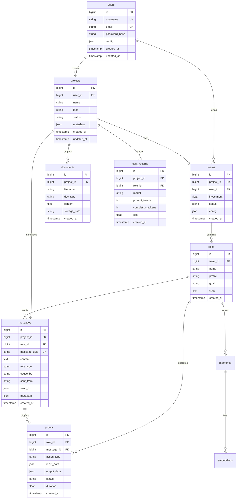

# mind2build 数据库设计文档

**文档版本**: v1.0  
**创建日期**: 2025-12-24  
**数据库类型**: PostgreSQL / MySQL  
**ORM 推荐**: SQLAlchemy

---

## 目录

1. [概述](#1-概述)
2. [ER 图](#2-er-图)
3. [表结构设计](#3-表结构设计)
4. [索引设计](#4-索引设计)
5. [数据字典](#5-数据字典)
6. [SQL 脚本](#6-sql-脚本)

---

## 1. 概述

### 1.1 设计原则

- **可扩展性**: 支持水平扩展和分表
- **性能优化**: 合理的索引和分区策略
- **数据完整性**: 外键约束和数据验证
- **审计追踪**: 记录创建和更新时间
- **软删除**: 重要数据不物理删除

### 1.2 核心实体

| 实体 | 说明 | 优先级 |
|------|------|--------|
| users | 用户信息 | P0 |
| projects | 项目信息 | P0 |
| teams | 团队信息 | P0 |
| roles | 角色实例 | P0 |
| messages | 消息记录 | P0 |
| actions | 行动记录 | P1 |
| documents | 生成的文档 | P1 |
| cost_records | 成本记录 | P1 |
| memories | 长期记忆 | P2 |
| embeddings | 向量嵌入 | P2 |

---

## 2. ER 图



---

## 3. 表结构设计

### 3.1 users (用户表)

**用途**: 存储用户账户信息

```sql
CREATE TABLE users (
    id BIGSERIAL PRIMARY KEY,
    username VARCHAR(50) NOT NULL UNIQUE,
    email VARCHAR(100) NOT NULL UNIQUE,
    password_hash VARCHAR(255) NOT NULL,
    full_name VARCHAR(100),
    avatar_url VARCHAR(500),
    api_keys JSONB DEFAULT '{}',  -- 存储各种 LLM API Keys (加密)
    config JSONB DEFAULT '{}',     -- 用户配置
    status VARCHAR(20) DEFAULT 'active',  -- active, inactive, banned
    created_at TIMESTAMP DEFAULT CURRENT_TIMESTAMP,
    updated_at TIMESTAMP DEFAULT CURRENT_TIMESTAMP,
    last_login_at TIMESTAMP,
    deleted_at TIMESTAMP
);

CREATE INDEX idx_users_username ON users(username);
CREATE INDEX idx_users_email ON users(email);
CREATE INDEX idx_users_status ON users(status);
```

**字段说明**:
- `api_keys`: 加密存储的 API Keys (OpenAI, Claude 等)
- `config`: 用户偏好配置 (默认模型、预算等)
- `deleted_at`: 软删除标记

---

### 3.2 projects (项目表)

**用途**: 存储项目基本信息

```sql
CREATE TABLE projects (
    id BIGSERIAL PRIMARY KEY,
    user_id BIGINT NOT NULL REFERENCES users(id) ON DELETE CASCADE,
    name VARCHAR(200) NOT NULL,
    idea TEXT NOT NULL,                    -- 项目需求/想法
    description TEXT,
    project_path VARCHAR(500),             -- 项目文件路径
    status VARCHAR(20) DEFAULT 'pending',  -- pending, running, completed, failed
    progress INT DEFAULT 0,                 -- 进度 0-100
    n_round INT DEFAULT 5,                  -- 计划轮数
    current_round INT DEFAULT 0,            -- 当前轮数
    investment FLOAT DEFAULT 10.0,          -- 预算
    total_cost FLOAT DEFAULT 0.0,           -- 实际花费
    metadata JSONB DEFAULT '{}',            -- 其他元数据
    started_at TIMESTAMP,
    completed_at TIMESTAMP,
    created_at TIMESTAMP DEFAULT CURRENT_TIMESTAMP,
    updated_at TIMESTAMP DEFAULT CURRENT_TIMESTAMP,
    deleted_at TIMESTAMP
);

CREATE INDEX idx_projects_user_id ON projects(user_id);
CREATE INDEX idx_projects_status ON projects(status);
CREATE INDEX idx_projects_created_at ON projects(created_at DESC);
```

**字段说明**:
- `status`: 
  - `pending`: 待开始
  - `running`: 运行中
  - `completed`: 已完成
  - `failed`: 失败
  - `cancelled`: 已取消
- `metadata`: 存储额外配置 (code_review, run_tests 等)

---

### 3.3 teams (团队表)

**用途**: 存储团队信息（一个项目对应一个团队）

```sql
CREATE TABLE teams (
    id BIGSERIAL PRIMARY KEY,
    project_id BIGINT NOT NULL UNIQUE REFERENCES projects(id) ON DELETE CASCADE,
    user_id BIGINT NOT NULL REFERENCES users(id),
    investment FLOAT DEFAULT 10.0,
    idea TEXT NOT NULL,
    use_mgx BOOLEAN DEFAULT true,
    env_type VARCHAR(50) DEFAULT 'Environment',  -- Environment, MGXEnv
    status VARCHAR(20) DEFAULT 'idle',  -- idle, running, stopped
    config JSONB DEFAULT '{}',
    state JSONB DEFAULT '{}',           -- 序列化的团队状态
    created_at TIMESTAMP DEFAULT CURRENT_TIMESTAMP,
    updated_at TIMESTAMP DEFAULT CURRENT_TIMESTAMP
);

CREATE INDEX idx_teams_project_id ON teams(project_id);
CREATE INDEX idx_teams_status ON teams(status);
```

---

### 3.4 roles (角色表)

**用途**: 存储角色实例信息

```sql
CREATE TABLE roles (
    id BIGSERIAL PRIMARY KEY,
    team_id BIGINT NOT NULL REFERENCES teams(id) ON DELETE CASCADE,
    name VARCHAR(100) NOT NULL,
    profile VARCHAR(100) NOT NULL,        -- ProductManager, Architect, Engineer
    goal TEXT,
    constraints TEXT,
    description TEXT,
    is_idle BOOLEAN DEFAULT true,
    state_index INT DEFAULT 0,
    max_react_loop INT DEFAULT 1,
    react_mode VARCHAR(20) DEFAULT 'react',  -- react, by_order, plan_and_act
    enable_memory BOOLEAN DEFAULT true,
    use_fixed_sop BOOLEAN DEFAULT false,
    tools JSONB DEFAULT '[]',              -- 工具列表
    actions JSONB DEFAULT '[]',            -- Action 类型列表
    watch_actions JSONB DEFAULT '[]',      -- 订阅的 Action
    state JSONB DEFAULT '{}',              -- 序列化的角色状态
    created_at TIMESTAMP DEFAULT CURRENT_TIMESTAMP,
    updated_at TIMESTAMP DEFAULT CURRENT_TIMESTAMP
);

CREATE INDEX idx_roles_team_id ON roles(team_id);
CREATE INDEX idx_roles_profile ON roles(profile);
CREATE INDEX idx_roles_is_idle ON roles(is_idle);
```

**字段说明**:
- `profile`: 角色类型 (ProductManager, Architect, Engineer, QAEngineer, TeamLeader)
- `state`: 完整的 RoleContext 序列化数据

---

### 3.5 messages (消息表)

**用途**: 存储所有消息记录

```sql
CREATE TABLE messages (
    id BIGSERIAL PRIMARY KEY,
    message_uuid VARCHAR(32) NOT NULL UNIQUE,  -- Message.id
    project_id BIGINT NOT NULL REFERENCES projects(id) ON DELETE CASCADE,
    role_id BIGINT REFERENCES roles(id),       -- 发送者角色 (NULL 表示用户)
    content TEXT NOT NULL,
    instruct_content JSONB,                    -- 结构化内容
    role_type VARCHAR(20) DEFAULT 'user',      -- system, user, assistant
    cause_by VARCHAR(200),                     -- 触发的 Action 类名
    sent_from VARCHAR(200),                    -- 发送者标识
    send_to JSONB DEFAULT '[]',                -- 接收者列表
    metadata JSONB DEFAULT '{}',
    created_at TIMESTAMP DEFAULT CURRENT_TIMESTAMP
);

CREATE INDEX idx_messages_project_id ON messages(project_id);
CREATE INDEX idx_messages_role_id ON messages(role_id);
CREATE INDEX idx_messages_uuid ON messages(message_uuid);
CREATE INDEX idx_messages_cause_by ON messages(cause_by);
CREATE INDEX idx_messages_created_at ON messages(created_at DESC);

-- 分区策略（可选，大数据量时）
-- PARTITION BY RANGE (created_at);
```

**字段说明**:
- `message_uuid`: 对应 Message.id (UUID)
- `instruct_content`: 结构化的指令内容
- `cause_by`: 触发此消息的 Action 类名

---

### 3.6 actions (行动记录表)

**用途**: 记录所有 Action 的执行

```sql
CREATE TABLE actions (
    id BIGSERIAL PRIMARY KEY,
    project_id BIGINT NOT NULL REFERENCES projects(id) ON DELETE CASCADE,
    role_id BIGINT NOT NULL REFERENCES roles(id) ON DELETE CASCADE,
    message_id BIGINT REFERENCES messages(id),  -- 触发的消息
    action_type VARCHAR(100) NOT NULL,          -- WritePRD, WriteDesign, WriteCode
    action_name VARCHAR(200),
    input_data JSONB,                           -- 输入数据
    output_data JSONB,                          -- 输出数据
    status VARCHAR(20) DEFAULT 'pending',       -- pending, running, completed, failed
    error_message TEXT,
    duration_seconds FLOAT,                     -- 执行时长（秒）
    started_at TIMESTAMP,
    completed_at TIMESTAMP,
    created_at TIMESTAMP DEFAULT CURRENT_TIMESTAMP
);

CREATE INDEX idx_actions_project_id ON actions(project_id);
CREATE INDEX idx_actions_role_id ON actions(role_id);
CREATE INDEX idx_actions_type ON actions(action_type);
CREATE INDEX idx_actions_status ON actions(status);
CREATE INDEX idx_actions_created_at ON actions(created_at DESC);
```

**字段说明**:
- `action_type`: Action 类名 (WritePRD, WriteDesign, WriteCode)
- `duration_seconds`: 执行时长，用于性能分析

---

### 3.7 documents (文档表)

**用途**: 存储生成的文档

```sql
CREATE TABLE documents (
    id BIGSERIAL PRIMARY KEY,
    project_id BIGINT NOT NULL REFERENCES projects(id) ON DELETE CASCADE,
    action_id BIGINT REFERENCES actions(id),
    filename VARCHAR(255) NOT NULL,
    doc_type VARCHAR(50) NOT NULL,          -- PRD, Design, Code, Test, README
    file_path VARCHAR(500),                  -- 文件路径
    content TEXT,                            -- 文档内容（可选，大文件存储到对象存储）
    content_hash VARCHAR(64),                -- 内容哈希
    size_bytes BIGINT,                       -- 文件大小
    mime_type VARCHAR(100),
    language VARCHAR(20),                    -- 编程语言或自然语言
    version INT DEFAULT 1,                   -- 版本号
    storage_type VARCHAR(20) DEFAULT 'db',   -- db, s3, local
    storage_path VARCHAR(500),               -- 外部存储路径
    metadata JSONB DEFAULT '{}',
    created_at TIMESTAMP DEFAULT CURRENT_TIMESTAMP,
    updated_at TIMESTAMP DEFAULT CURRENT_TIMESTAMP
);

CREATE INDEX idx_documents_project_id ON documents(project_id);
CREATE INDEX idx_documents_type ON documents(doc_type);
CREATE INDEX idx_documents_filename ON documents(filename);
CREATE INDEX idx_documents_created_at ON documents(created_at DESC);
```

**字段说明**:
- `doc_type`: PRD, Design, Code, Test, README, Config
- `storage_type`: 
  - `db`: 直接存储在数据库
  - `s3`: 存储在 S3 或兼容对象存储
  - `local`: 存储在本地文件系统

---

### 3.8 cost_records (成本记录表)

**用途**: 跟踪 LLM 调用成本

```sql
CREATE TABLE cost_records (
    id BIGSERIAL PRIMARY KEY,
    project_id BIGINT NOT NULL REFERENCES projects(id) ON DELETE CASCADE,
    role_id BIGINT REFERENCES roles(id),
    action_id BIGINT REFERENCES actions(id),
    provider VARCHAR(50) NOT NULL,           -- openai, anthropic, gemini
    model VARCHAR(100) NOT NULL,              -- gpt-4-turbo, claude-3-opus
    prompt_tokens INT DEFAULT 0,
    completion_tokens INT DEFAULT 0,
    total_tokens INT DEFAULT 0,
    cost DECIMAL(10, 6) DEFAULT 0.0,         -- 成本（美元）
    currency VARCHAR(3) DEFAULT 'USD',
    request_duration_ms INT,                  -- 请求时长（毫秒）
    metadata JSONB DEFAULT '{}',
    created_at TIMESTAMP DEFAULT CURRENT_TIMESTAMP
);

CREATE INDEX idx_cost_project_id ON cost_records(project_id);
CREATE INDEX idx_cost_role_id ON cost_records(role_id);
CREATE INDEX idx_cost_model ON cost_records(model);
CREATE INDEX idx_cost_created_at ON cost_records(created_at DESC);

-- 用于统计的物化视图
CREATE MATERIALIZED VIEW project_cost_summary AS
SELECT 
    project_id,
    SUM(cost) as total_cost,
    SUM(total_tokens) as total_tokens,
    COUNT(*) as total_requests,
    AVG(request_duration_ms) as avg_duration_ms
FROM cost_records
GROUP BY project_id;
```

**字段说明**:
- `cost`: 精确到小数点后 6 位
- 支持按项目、角色、模型等维度统计成本

---

### 3.9 memories (长期记忆表)

**用途**: 存储角色的长期记忆

```sql
CREATE TABLE memories (
    id BIGSERIAL PRIMARY KEY,
    role_id BIGINT NOT NULL REFERENCES roles(id) ON DELETE CASCADE,
    message_id BIGINT REFERENCES messages(id),
    memory_type VARCHAR(20) DEFAULT 'short_term',  -- short_term, long_term, working
    content TEXT NOT NULL,
    importance_score FLOAT DEFAULT 0.5,           -- 重要性评分 0-1
    access_count INT DEFAULT 0,                    -- 访问次数
    last_accessed_at TIMESTAMP,
    expires_at TIMESTAMP,                          -- 过期时间（可选）
    metadata JSONB DEFAULT '{}',
    created_at TIMESTAMP DEFAULT CURRENT_TIMESTAMP,
    updated_at TIMESTAMP DEFAULT CURRENT_TIMESTAMP
);

CREATE INDEX idx_memories_role_id ON memories(role_id);
CREATE INDEX idx_memories_type ON memories(memory_type);
CREATE INDEX idx_memories_importance ON memories(importance_score DESC);
CREATE INDEX idx_memories_created_at ON memories(created_at DESC);
```

---

### 3.10 embeddings (向量嵌入表)

**用途**: 存储文本的向量嵌入（用于语义搜索）

```sql
CREATE TABLE embeddings (
    id BIGSERIAL PRIMARY KEY,
    memory_id BIGINT REFERENCES memories(id) ON DELETE CASCADE,
    document_id BIGINT REFERENCES documents(id) ON DELETE CASCADE,
    embedding_key VARCHAR(200) NOT NULL,
    embedding_vector VECTOR(1536),              -- 使用 pgvector 扩展
    embedding_model VARCHAR(50) DEFAULT 'text-embedding-ada-002',
    metadata JSONB DEFAULT '{}',
    created_at TIMESTAMP DEFAULT CURRENT_TIMESTAMP,
    
    CONSTRAINT chk_one_ref CHECK (
        (memory_id IS NOT NULL AND document_id IS NULL) OR
        (memory_id IS NULL AND document_id IS NOT NULL)
    )
);

CREATE INDEX idx_embeddings_memory_id ON embeddings(memory_id);
CREATE INDEX idx_embeddings_document_id ON embeddings(document_id);
-- 向量索引（需要 pgvector 扩展）
CREATE INDEX idx_embeddings_vector ON embeddings USING ivfflat (embedding_vector vector_cosine_ops);
```

**注意**: 需要安装 PostgreSQL pgvector 扩展

---

### 3.11 project_snapshots (项目快照表)

**用途**: 保存项目状态快照，用于恢复

```sql
CREATE TABLE project_snapshots (
    id BIGSERIAL PRIMARY KEY,
    project_id BIGINT NOT NULL REFERENCES projects(id) ON DELETE CASCADE,
    snapshot_name VARCHAR(200),
    snapshot_type VARCHAR(20) DEFAULT 'manual',  -- manual, auto, checkpoint
    team_state JSONB NOT NULL,                   -- 序列化的 Team 状态
    environment_state JSONB,                     -- 序列化的 Environment 状态
    roles_state JSONB,                           -- 所有角色状态
    messages_count INT,
    documents_count INT,
    total_cost FLOAT,
    description TEXT,
    created_at TIMESTAMP DEFAULT CURRENT_TIMESTAMP
);

CREATE INDEX idx_snapshots_project_id ON project_snapshots(project_id);
CREATE INDEX idx_snapshots_created_at ON project_snapshots(created_at DESC);
```

---

### 3.12 audit_logs (审计日志表)

**用途**: 记录所有重要操作

```sql
CREATE TABLE audit_logs (
    id BIGSERIAL PRIMARY KEY,
    user_id BIGINT REFERENCES users(id),
    entity_type VARCHAR(50) NOT NULL,    -- project, team, role, message
    entity_id BIGINT NOT NULL,
    action VARCHAR(50) NOT NULL,         -- create, update, delete, execute
    old_value JSONB,
    new_value JSONB,
    ip_address INET,
    user_agent TEXT,
    created_at TIMESTAMP DEFAULT CURRENT_TIMESTAMP
);

CREATE INDEX idx_audit_user_id ON audit_logs(user_id);
CREATE INDEX idx_audit_entity ON audit_logs(entity_type, entity_id);
CREATE INDEX idx_audit_created_at ON audit_logs(created_at DESC);
```

---

## 4. 索引设计

### 4.1 主要索引

| 表名 | 索引类型 | 索引字段 | 用途 |
|------|---------|---------|------|
| users | UNIQUE | username, email | 唯一性约束 |
| projects | B-tree | user_id, status | 查询优化 |
| messages | B-tree | project_id, created_at | 时间序列查询 |
| cost_records | B-tree | project_id, model | 成本统计 |
| embeddings | IVFFlat | embedding_vector | 向量相似度搜索 |

### 4.2 复合索引

```sql
-- 项目消息查询优化
CREATE INDEX idx_messages_project_time ON messages(project_id, created_at DESC);

-- 角色行动查询
CREATE INDEX idx_actions_role_status ON actions(role_id, status);

-- 成本分析
CREATE INDEX idx_cost_project_model ON cost_records(project_id, model, created_at);
```

---

## 5. 数据字典

### 5.1 状态枚举

**项目状态 (project.status)**:
- `pending`: 待开始
- `running`: 运行中
- `completed`: 已完成
- `failed`: 失败
- `cancelled`: 已取消

**角色类型 (role.profile)**:
- `ProductManager`: 产品经理
- `Architect`: 架构师
- `Engineer`: 工程师
- `QAEngineer`: QA 工程师
- `TeamLeader`: 团队领导
- `DataInterpreter`: 数据解释器

**文档类型 (document.doc_type)**:
- `PRD`: 产品需求文档
- `Design`: 设计文档
- `Code`: 源代码
- `Test`: 测试代码
- `README`: 说明文档
- `Config`: 配置文件

---

## 6. SQL 脚本

### 6.1 完整建表脚本

```sql
-- 启用必要的扩展
CREATE EXTENSION IF NOT EXISTS "uuid-ossp";
CREATE EXTENSION IF NOT EXISTS "vector";  -- 用于向量搜索

-- 创建数据库
CREATE DATABASE mind2build_db
    WITH 
    ENCODING = 'UTF8'
    LC_COLLATE = 'en_US.UTF-8'
    LC_CTYPE = 'en_US.UTF-8';

\c mind2build_db;

-- 创建所有表（顺序很重要，考虑外键依赖）
-- 1. users
-- 2. projects
-- 3. teams
-- 4. roles
-- 5. messages
-- 6. actions
-- 7. documents
-- 8. cost_records
-- 9. memories
-- 10. embeddings
-- 11. project_snapshots
-- 12. audit_logs

-- (完整 SQL 见上面各表定义)
```

### 6.2 常用查询示例

**查询项目总成本**:
```sql
SELECT 
    p.id,
    p.name,
    SUM(cr.cost) as total_cost,
    SUM(cr.total_tokens) as total_tokens
FROM projects p
LEFT JOIN cost_records cr ON p.id = cr.project_id
WHERE p.user_id = ?
GROUP BY p.id, p.name
ORDER BY total_cost DESC;
```

**查询角色消息历史**:
```sql
SELECT 
    m.*,
    r.name as role_name,
    r.profile
FROM messages m
JOIN roles r ON m.role_id = r.id
WHERE m.project_id = ?
ORDER BY m.created_at ASC
LIMIT 100;
```

**项目进度统计**:
```sql
SELECT 
    p.id,
    p.name,
    p.status,
    p.current_round,
    p.n_round,
    COUNT(DISTINCT r.id) as role_count,
    COUNT(DISTINCT m.id) as message_count,
    COUNT(DISTINCT d.id) as document_count,
    SUM(cr.cost) as total_cost
FROM projects p
LEFT JOIN teams t ON p.id = t.project_id
LEFT JOIN roles r ON t.id = r.team_id
LEFT JOIN messages m ON p.id = m.project_id
LEFT JOIN documents d ON p.id = d.project_id
LEFT JOIN cost_records cr ON p.id = cr.project_id
WHERE p.id = ?
GROUP BY p.id;
```

---

## 7. SQLAlchemy 模型示例

```python
from sqlalchemy import Column, Integer, BigInteger, String, Text, Float, Boolean, TIMESTAMP, JSON, ForeignKey
from sqlalchemy.ext.declarative import declarative_base
from sqlalchemy.orm import relationship
from datetime import datetime

Base = declarative_base()

class User(Base):
    __tablename__ = 'users'
    
    id = Column(BigInteger, primary_key=True)
    username = Column(String(50), unique=True, nullable=False)
    email = Column(String(100), unique=True, nullable=False)
    password_hash = Column(String(255), nullable=False)
    config = Column(JSON, default={})
    created_at = Column(TIMESTAMP, default=datetime.utcnow)
    updated_at = Column(TIMESTAMP, default=datetime.utcnow, onupdate=datetime.utcnow)
    
    # 关系
    projects = relationship("Project", back_populates="user")

class Project(Base):
    __tablename__ = 'projects'
    
    id = Column(BigInteger, primary_key=True)
    user_id = Column(BigInteger, ForeignKey('users.id'), nullable=False)
    name = Column(String(200), nullable=False)
    idea = Column(Text, nullable=False)
    status = Column(String(20), default='pending')
    investment = Column(Float, default=10.0)
    total_cost = Column(Float, default=0.0)
    metadata = Column(JSON, default={})
    created_at = Column(TIMESTAMP, default=datetime.utcnow)
    updated_at = Column(TIMESTAMP, default=datetime.utcnow, onupdate=datetime.utcnow)
    
    # 关系
    user = relationship("User", back_populates="projects")
    team = relationship("Team", back_populates="project", uselist=False)
    messages = relationship("Message", back_populates="project")
    documents = relationship("Document", back_populates="project")

# ... 其他模型类似
```

---

## 8. 数据迁移策略

### 8.1 版本管理

使用 Alembic 进行数据库迁移：

```bash
# 初始化
alembic init alembic

# 创建迁移
alembic revision --autogenerate -m "Initial tables"

# 执行迁移
alembic upgrade head

# 回滚
alembic downgrade -1
```

### 8.2 数据备份

```bash
# 备份
pg_dump mind2build_db > backup_$(date +%Y%m%d).sql

# 恢复
psql mind2build_db < backup_20251224.sql
```

---

## 9. 性能优化建议

### 9.1 分区策略

对于大数据量表，建议分区：

```sql
-- messages 表按月分区
CREATE TABLE messages (
    -- 字段定义...
) PARTITION BY RANGE (created_at);

CREATE TABLE messages_2025_01 PARTITION OF messages
    FOR VALUES FROM ('2025-01-01') TO ('2025-02-01');
```

### 9.2 缓存策略

- 使用 Redis 缓存热点数据
- 项目列表缓存 5 分钟
- 用户配置缓存 30 分钟
- 成本统计缓存 1 小时

### 9.3 读写分离

- 主库：写操作
- 从库：读操作和统计查询
- 使用 PostgreSQL 流复制

---

## 10. 安全建议

1. **API Key 加密**: 使用 AES-256 加密存储
2. **SQL 注入防护**: 使用参数化查询
3. **访问控制**: 行级安全策略 (RLS)
4. **审计日志**: 记录所有敏感操作
5. **备份策略**: 每日全量备份 + 增量备份

---

## 附录

### A. 表空间估算

假设 1000 个活跃项目，每个项目平均：
- 消息：500 条
- 文档：20 个
- 成本记录：100 条

预估存储：
- messages: ~500MB
- documents: ~2GB (内容)
- cost_records: ~50MB
- **总计**: ~3-5GB

### B. 参考资料

- PostgreSQL 官方文档
- SQLAlchemy 文档
- pgvector 扩展文档

---

**文档维护**: 随系统演进更新  
**最后更新**: 2025-12-24
