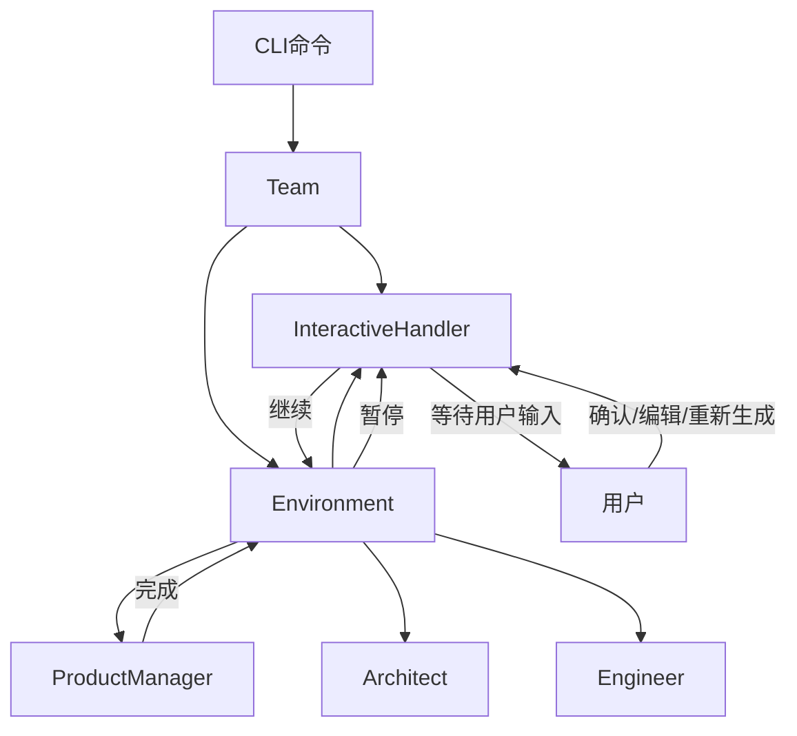

# 交互模式使用指南

## 概述

交互模式允许您在项目生成过程中的每个关键节点（SOP节点）进行人工审查和确认。这让您可以：
- 在每个角色完成任务后暂停并查看输出
- 修改输出内容后再继续下一步
- 重新生成不满意的输出
- 完全控制整个生成流程

**支持方式**: CLI命令行和Web UI两种方式

## 启用方式

### 命令行参数

使用 `--interactive` 或 `-i` 参数启用交互模式：

```bash
# 完整参数
mind2build generate "Create a 2048 game" --interactive --output ./my-game

# 简写参数
mind2build generate "Create a todo app" -i -o ./todo-app
```

### 配置文件

在 `config.yaml` 中配置（未来版本）：

```yaml
workflow:
  mode: "interactive"  # 或 "auto"
  autoSave: true       # 自动保存每个节点的输出
```

## 工作流程

### 1. 启动项目生成

```bash
$ mind2build generate "Create a REST API for a blog" -i -o ./blog-api

🚀 Mind2Build - AI Multi-Agent Project Generator

💡 Idea: Create a REST API for a blog

💰 Budget: $10
🔄 Max Rounds: 5
🎯 Mode: Interactive (手动确认)

👥 Hiring team members...
   ✅ ProductManager (Alice)
   ✅ Architect (Bob)
   ✅ Engineer (Charlie)

ℹ️  交互模式已启用:
   - 每个角色完成后会暂停等待您的确认
   - 您可以查看、编辑或重新生成输出
   - 使用 c=继续, e=编辑, r=重新生成, v=查看, s=跳过, q=退出

🔨 Starting project generation...
```

### 2. ProductManager 完成 PRD

```
━━━━━━━━━━━━━━━━━━━━━━━━━━━━━━━━━━━━━━━━━━━━━━━

🎯 [ProductManager] 完成 WritePRD

📄 生成的文件:
   - PRD.md

📋 内容预览:
# Blog REST API - 产品需求文档

## 1. 产品概述
本项目旨在创建一个功能完整的博客系统 REST API...

## 2. 核心功能
- 用户认证与授权
- 文章 CRUD 操作
- 评论系统
... (查看全文请输入 v)

━━━━━━━━━━━━━━━━━━━━━━━━━━━━━━━━━━━━━━━━━━━━━━━

🛑 等待确认 (c=继续, e=编辑, r=重新生成, v=查看全文, s=跳过, q=退出): 
```

### 3. 用户操作选项

#### 选项 A: 继续 (Continue)

```bash
🛑 等待确认: c
✅ 继续下一步
```

输入 `c` 或 `continue` 接受当前输出并继续到下一个节点。

#### 选项 B: 编辑 (Edit)

```bash
🛑 等待确认: e

📝 正在打开编辑器 (vim)...
   文件路径: /tmp/mind2build_WritePRD_1234567890.md
   保存并关闭编辑器以继续

# 编辑器打开，用户修改内容...
# 保存并退出编辑器

✅ 检测到内容修改
✅ 已保存修改，继续下一步
```

输入 `e` 或 `edit` 打开编辑器修改内容。修改保存后会使用新内容继续。

**支持的编辑器**：
- 使用 `$EDITOR` 环境变量指定的编辑器
- 使用 `$VISUAL` 环境变量指定的编辑器
- 默认使用 `vi`

**设置编辑器**：
```bash
export EDITOR=nano  # 或 vim, emacs, code, etc.
```

#### 选项 C: 重新生成 (Regenerate)

```bash
🛑 等待确认: r
🔄 请求重新生成...

# 当前角色会重新执行，生成新的输出
# 然后再次暂停等待确认
```

输入 `r` 或 `regenerate` 要求当前角色重新生成输出。

#### 选项 D: 查看全文 (View)

```bash
🛑 等待确认: v

================================================================================
完整内容:
================================================================================
# Blog REST API - 产品需求文档

## 1. 产品概述
本项目旨在创建一个功能完整的博客系统 REST API...

[完整内容显示]

================================================================================

🛑 等待确认 (c=继续, e=编辑, r=重新生成, v=查看全文, s=跳过, q=退出): 
```

输入 `v` 或 `view` 查看完整输出内容。

#### 选项 E: 跳过 (Skip)

```bash
🛑 等待确认: s
⏭️  跳过当前节点
```

输入 `s` 或 `skip` 跳过当前节点，不发布此消息到下游角色。

#### 选项 F: 退出 (Quit)

```bash
🛑 等待确认: q
🛑 退出流程

❌ Error: User quit the interactive session
```

输入 `q` 或 `quit` 退出整个流程。当前状态会被保存。

### 4. 完整流程示例

```
[ProductManager] 完成 WritePRD
🛑 等待确认: c
✅ 继续下一步

[Architect] 完成 WriteDesign  
🛑 等待确认: e
📝 正在打开编辑器...
✅ 已保存修改，继续下一步

[Engineer] 完成 WriteCode
🛑 等待确认: v
[显示完整代码]
🛑 等待确认: c
✅ 继续下一步

━━━━━━━━━━━━━━━━━━━━━━━━━━━━━━━━━━━━━━━━━━━━━━━
📊 交互式会话摘要

1. [ProductManager] WritePRD → ✅ continue
2. [Architect] WriteDesign → ✏️ edit
3. [Engineer] WriteCode → ✅ continue

━━━━━━━━━━━━━━━━━━━━━━━━━━━━━━━━━━━━━━━━━━━━━━━

✅ Project generation completed!

📊 Cost Report:
   Prompt Tokens: 12450
   Completion Tokens: 8920
   Total Cost: $0.2137

💾 Saving output to ./blog-api...
   ✅ Saved PRD.md
   ✅ Saved DESIGN.md
   ✅ Saved src/main.ts
   ✅ Saved src/api/routes.ts
   ...

✅ Project saved to ./blog-api
```

## 命令快捷键总览

| 快捷键 | 完整命令 | 功能 | 说明 |
|--------|---------|------|------|
| `c` | `continue` | 继续 | 接受当前输出，继续下一步 |
| `e` | `edit` | 编辑 | 打开编辑器修改输出 |
| `r` | `regenerate`/`regen` | 重新生成 | 要求角色重新生成输出 |
| `v` | `view` | 查看 | 查看完整输出内容 |
| `s` | `skip` | 跳过 | 跳过当前节点 |
| `q` | `quit`/`exit` | 退出 | 保存状态并退出 |

## 使用场景

### 场景 1: 需求审查

在 ProductManager 完成 PRD 后，您可以：
1. 查看 PRD 的完整内容
2. 根据实际需求修改功能点
3. 确认后让 Architect 基于修改后的 PRD 进行设计

### 场景 2: 架构调整

在 Architect 完成系统设计后，您可以：
1. 检查技术栈选择是否合适
2. 修改架构设计
3. 调整模块划分

### 场景 3: 代码审查

在 Engineer 完成代码后，您可以：
1. 查看生成的代码
2. 修改不符合规范的部分
3. 如果质量不满意，要求重新生成

### 场景 4: 迭代优化

如果某个角色的输出不满意：
1. 使用 `r` 重新生成
2. 多次重新生成直到满意
3. 或使用 `e` 手动调整

## 最佳实践

### 1. 逐步确认

建议在以下关键节点仔细审查：
- **PRD 阶段**：确保需求理解正确
- **设计阶段**：确保技术选型和架构合理
- **编码阶段**：确保代码质量和规范

### 2. 编辑器配置

设置您熟悉的编辑器：
```bash
# 在 ~/.bashrc 或 ~/.zshrc 中添加
export EDITOR=code  # VS Code
# 或
export EDITOR=vim   # Vim
# 或
export EDITOR=nano  # Nano
```

### 3. 保存历史

系统会在会话结束时显示交互历史，帮助您了解整个流程。

### 4. 预算管理

交互模式下，重新生成会消耗额外的 Token。建议：
- 设置合理的预算 `--budget`
- 谨慎使用重新生成功能
- 优先使用编辑功能进行小改动

## 与自动模式对比

| 特性 | 自动模式 | 交互模式 |
|------|---------|---------|
| 人工干预 | ❌ 无 | ✅ 每个节点 |
| 内容修改 | ❌ 不支持 | ✅ 支持编辑 |
| 重新生成 | ❌ 不支持 | ✅ 支持 |
| 执行速度 | ⚡ 快速 | 🐢 需等待确认 |
| Token 消耗 | 💰 固定 | 💰💰 可能更多（重新生成） |
| 适用场景 | 快速原型 | 精细控制 |

## 常见问题

### Q: 编辑器打不开怎么办？

A: 检查 `$EDITOR` 环境变量是否设置正确：
```bash
echo $EDITOR
export EDITOR=nano  # 设置为简单的编辑器
```

### Q: 可以中途退出并恢复吗？

A: 当前版本退出后需要重新开始。未来版本会支持状态保存和恢复。

### Q: 交互模式会增加多少成本？

A: 
- 正常流程：与自动模式相同
- 使用重新生成：每次重新生成会额外消耗 Token
- 使用编辑：不消耗额外 Token

### Q: 可以在 CI/CD 中使用吗？

A: 不建议。交互模式需要人工输入，不适合自动化流程。CI/CD 请使用自动模式。

## 技术实现

### 架构



### 关键类

- **InteractiveHandler**: 处理用户交互逻辑
- **Environment**: 管理角色执行流程，在交互模式下等待确认
- **Team**: 协调整体流程，传递交互模式配置

### 代码位置

- `backend/src/utils/InteractiveHandler.ts` - 交互处理器
- `backend/src/orchestration/Environment.ts` - 环境管理（包含交互逻辑）
- `backend/src/orchestration/Team.ts` - 团队协调（交互模式配置）
- `backend/src/cli/commands/generate.ts` - CLI 命令
- `backend/src/cli/index.ts` - CLI 参数定义

## 未来规划

- [ ] 支持状态保存和恢复
- [ ] Web UI 交互界面
- [ ] 实时协作（多人同时审查）
- [ ] 审查历史记录和回放
- [ ] 自定义交互节点（配置哪些节点需要确认）
- [ ] 批注和评论功能

## 示例项目

查看 `examples/interactive-mode/` 目录中的完整示例项目。

---

**相关文档**：
- [产品需求文档 (PRD)](./02_产品需求文档_PRD.md) - US-2.2.3
- [工作流文档](./10_工作流文档_WORKFLOW.md)
- [开发指南](./14_开发指南_DEVELOPMENT.md)

