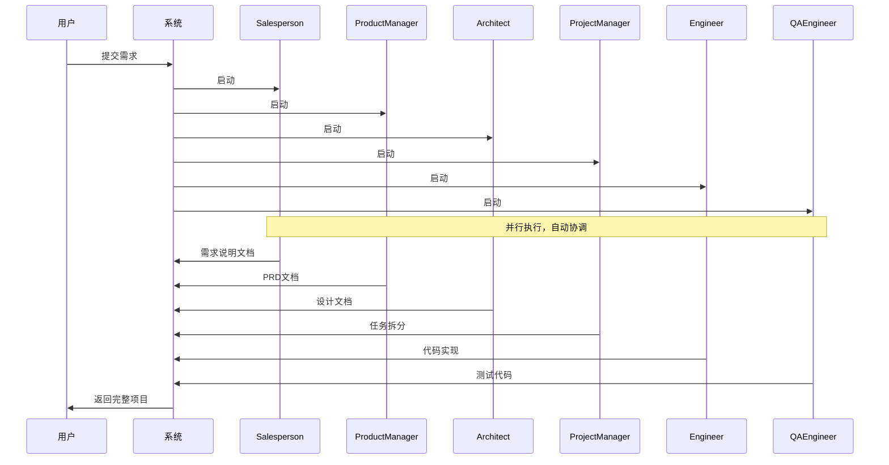
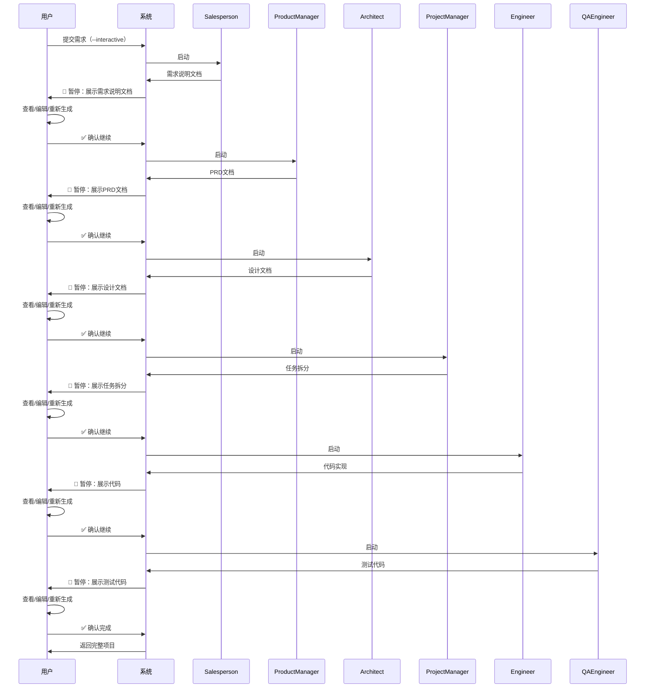
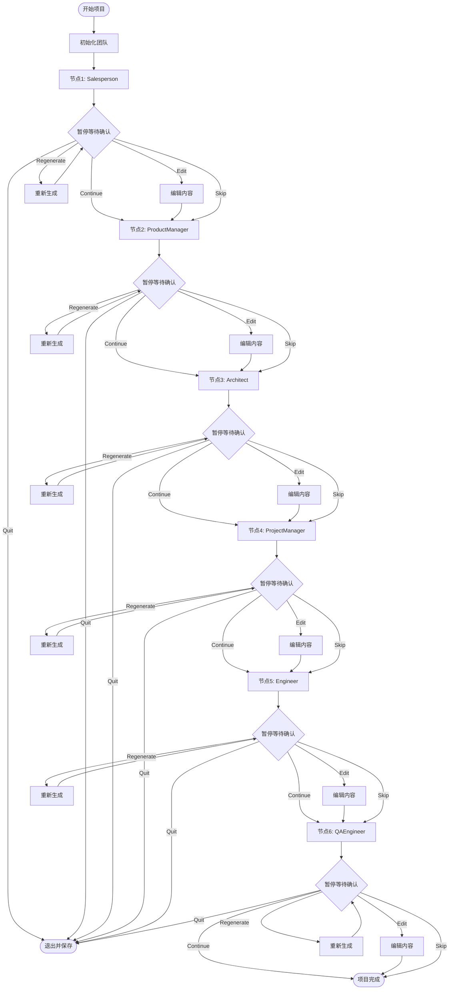

# SOP流程对比与优势分析

**文档版本**: v1.0  
**创建日期**: 2025-12-25

---

## 目录

1. [概述](#1-概述)
2. [原有流程（自动模式）](#2-原有流程自动模式)
3. [新流程（交互模式）](#3-新流程交互模式)
4. [流程对比](#4-流程对比)
5. [优势分析](#5-优势分析)
6. [新SOP详细说明](#6-新sop详细说明)
7. [使用场景建议](#7-使用场景建议)

---

## 1. 概述

Mind2Build 系统支持两种工作模式：

- **自动模式（Auto Mode）**: 传统模式，系统自动执行完整流程，无需人工干预
- **交互模式（Interactive Mode）**: 新引入的模式，在每个关键节点暂停等待用户确认

本文档详细说明两种模式的区别、优势，以及新的SOP流程。

---

## 2. 原有流程（自动模式）

### 2.1 流程描述

自动模式采用**并行执行**策略，所有角色同时工作，系统自动协调：



### 2.2 执行特点

- ✅ **执行速度快**: 角色并行工作，充分利用系统资源
- ✅ **无需人工干预**: 完全自动化，适合CI/CD场景
- ✅ **成本可控**: Token消耗固定，易于预算管理
- ❌ **无法中途调整**: 一旦开始，无法修改中间产物
- ❌ **质量不可控**: 无法及时发现问题并修正
- ❌ **黑盒过程**: 用户无法了解中间步骤的执行情况

### 2.3 SOP节点

自动模式的SOP节点是**隐式的**，系统内部自动处理：

1. **Salesperson** → WriteRequirementSpec → 需求说明文档
2. **ProductManager** → WritePRD → PRD文档
3. **Architect** → WriteDesign → 设计文档
4. **ProjectManager** → BreakdownTasks → 任务拆分
5. **Engineer** → WriteCode → 代码实现
6. **QAEngineer** → WriteTest → 测试代码

**注意**: 这些节点在自动模式下是**不可见的**，用户只能看到最终结果。

---

## 3. 新流程（交互模式）

### 3.1 流程描述

交互模式采用**顺序执行**策略，每个角色依次工作，在每个SOP节点暂停等待用户确认：



### 3.2 执行特点

- ✅ **完全可控**: 每个步骤都可以审查和调整
- ✅ **质量保证**: 及时发现问题并修正
- ✅ **过程透明**: 用户了解每个步骤的执行情况
- ✅ **灵活调整**: 支持编辑、重新生成等操作
- ⚠️ **执行速度慢**: 需要等待用户确认，总时间较长
- ⚠️ **需要人工参与**: 不适合完全自动化场景
- ⚠️ **可能增加成本**: 重新生成会消耗额外Token

### 3.3 SOP节点

交互模式的SOP节点是**显式的**，每个节点都会暂停等待用户确认：

1. **Salesperson** → WriteRequirementSpec → 🛑 **暂停确认**
2. **ProductManager** → WritePRD → 🛑 **暂停确认**
3. **Architect** → WriteDesign → 🛑 **暂停确认**
4. **ProjectManager** → BreakdownTasks → 🛑 **暂停确认**
5. **Engineer** → WriteCode → 🛑 **暂停确认**
6. **QAEngineer** → WriteTest → 🛑 **暂停确认**

**注意**: 每个节点都会展示生成内容，用户可以选择继续、编辑、重新生成、跳过或退出。

---

## 4. 流程对比

### 4.1 执行方式对比

| 特性 | 自动模式 | 交互模式 |
|------|---------|---------|
| **执行策略** | 并行执行 | 顺序执行 |
| **人工干预** | ❌ 无 | ✅ 每个节点 |
| **执行速度** | ⚡ 快速（5-10分钟） | 🐢 较慢（30-60分钟） |
| **过程可见性** | ❌ 黑盒 | ✅ 完全透明 |
| **中途调整** | ❌ 不支持 | ✅ 支持编辑/重新生成 |
| **质量保证** | ⚠️ 依赖AI | ✅ 人工审查 |
| **适用场景** | 快速原型、CI/CD | 生产项目、精细控制 |

### 4.2 用户操作对比

| 操作 | 自动模式 | 交互模式 |
|------|---------|---------|
| **查看中间产物** | ❌ 只能看最终结果 | ✅ 每个节点都可查看 |
| **修改内容** | ❌ 不支持 | ✅ 支持在线编辑 |
| **重新生成** | ❌ 不支持 | ✅ 支持重新生成 |
| **跳过步骤** | ❌ 不支持 | ✅ 支持跳过 |
| **退出保存** | ❌ 不支持 | ✅ 支持退出并保存 |

### 4.3 成本对比

| 项目 | 自动模式 | 交互模式 |
|------|---------|---------|
| **基础Token消耗** | 固定 | 固定（相同） |
| **重新生成消耗** | 0 | 每次重新生成额外消耗 |
| **编辑操作消耗** | 0 | 0（不消耗Token） |
| **总成本** | 💰 可预测 | 💰💰 可能更高 |

---

## 5. 优势分析

### 5.1 交互模式的优势

#### 1. **质量保证** ⭐⭐⭐⭐⭐

**优势**:
- 每个关键节点都有人工审查，确保质量
- 可以及时发现并修正AI生成的问题
- 避免错误向下游传播

**示例**:
```
自动模式：PRD有错误 → 设计基于错误PRD → 代码实现错误 → 最终产品有问题
交互模式：PRD有错误 → 用户发现并修正 → 设计基于正确PRD → 代码实现正确
```

#### 2. **过程透明** ⭐⭐⭐⭐⭐

**优势**:
- 用户了解每个步骤的执行情况
- 可以看到AI的思考过程
- 便于学习和理解系统工作原理

**示例**:
- 可以看到ProductManager如何分析需求
- 可以看到Architect如何设计架构
- 可以看到Engineer如何实现代码

#### 3. **灵活调整** ⭐⭐⭐⭐⭐

**优势**:
- 支持在线编辑，快速调整内容
- 支持重新生成，直到满意为止
- 支持跳过不需要的步骤

**示例**:
- PRD中某个功能点不符合需求，可以直接编辑修改
- 设计文档的技术选型不合适，可以要求重新生成
- 某个步骤的输出已经满足要求，可以跳过后续步骤

#### 4. **风险控制** ⭐⭐⭐⭐

**优势**:
- 可以随时退出并保存当前状态
- 避免浪费Token在不满意的结果上
- 可以分阶段完成项目

**示例**:
- 如果发现需求理解有误，可以退出并重新开始
- 如果预算不足，可以保存当前进度，稍后继续

#### 5. **学习价值** ⭐⭐⭐⭐

**优势**:
- 可以看到AI如何分析和解决问题
- 可以学习最佳实践
- 可以理解不同角色的工作方式

### 5.2 自动模式的优势

#### 1. **执行效率** ⭐⭐⭐⭐⭐

**优势**:
- 并行执行，充分利用系统资源
- 无需等待人工确认，执行速度快
- 适合批量处理

#### 2. **自动化** ⭐⭐⭐⭐⭐

**优势**:
- 完全自动化，适合CI/CD场景
- 可以集成到自动化流程中
- 无需人工参与

#### 3. **成本可控** ⭐⭐⭐⭐

**优势**:
- Token消耗固定，易于预算管理
- 不会因为重新生成而增加成本

---

## 6. 新SOP详细说明

### 6.1 SOP节点定义

新的SOP（Standard Operating Procedure）包含以下**显式节点**：

#### 节点1: 需求收集与整理
- **角色**: Salesperson
- **Action**: WriteRequirementSpec
- **输出**: 需求说明文档（RequirementSpecification.md）
- **用户操作**: 查看、编辑、重新生成、继续、跳过、退出

#### 节点2: PRD编写
- **角色**: ProductManager
- **Action**: WritePRD
- **输出**: PRD文档（PRD.md）
- **用户操作**: 查看、编辑、重新生成、继续、跳过、退出

#### 节点3: 系统设计
- **角色**: Architect
- **Action**: WriteDesign
- **输出**: 设计文档（DESIGN.md）
- **用户操作**: 查看、编辑、重新生成、继续、跳过、退出

#### 节点4: 任务拆分
- **角色**: ProjectManager
- **Action**: BreakdownTasks
- **输出**: 任务拆分文档（TASK_BREAKDOWN.md）
- **用户操作**: 查看、编辑、重新生成、继续、跳过、退出

#### 节点5: 代码实现
- **角色**: Engineer
- **Action**: WriteCode
- **输出**: 源代码文件（多个文件）
- **用户操作**: 查看、编辑、重新生成、继续、跳过、退出

#### 节点6: 测试编写
- **角色**: QAEngineer
- **Action**: WriteTest
- **输出**: 测试代码文件
- **用户操作**: 查看、编辑、重新生成、继续、跳过、退出

### 6.2 用户操作说明

在每个SOP节点，用户可以选择以下操作：

#### 操作1: Continue (继续) - `c`
- **功能**: 接受当前输出，继续到下一个节点
- **Token消耗**: 0（不额外消耗）
- **使用场景**: 对当前输出满意，继续下一步

#### 操作2: Edit (编辑) - `e`
- **功能**: 打开编辑器修改输出内容，然后继续
- **Token消耗**: 0（不额外消耗）
- **使用场景**: 需要小幅调整内容

#### 操作3: Regenerate (重新生成) - `r`
- **功能**: 要求当前角色重新生成输出
- **Token消耗**: 额外消耗（重新调用LLM）
- **使用场景**: 对当前输出不满意，希望重新生成

#### 操作4: View (查看) - `v`
- **功能**: 查看完整输出内容
- **Token消耗**: 0（不额外消耗）
- **使用场景**: 需要查看完整内容再做决定

#### 操作5: Skip (跳过) - `s`
- **功能**: 跳过当前节点，不发布消息到下游
- **Token消耗**: 0（不额外消耗）
- **使用场景**: 当前节点输出不需要，跳过继续

#### 操作6: Quit (退出) - `q`
- **功能**: 保存当前状态并退出
- **Token消耗**: 0（不额外消耗）
- **使用场景**: 需要暂停，稍后继续

### 6.3 SOP执行流程



### 6.4 SOP节点检查清单

在每个SOP节点，建议检查以下内容：

#### 节点1: 需求说明文档
- [ ] 需求描述是否清晰完整？
- [ ] 目标用户画像是否准确？
- [ ] 核心功能列表是否完整？
- [ ] 竞品分析是否充分？
- [ ] 预算和时间估算是否合理？

#### 节点2: PRD文档
- [ ] 产品概述是否准确？
- [ ] 功能需求是否详细？
- [ ] 非功能需求是否考虑？
- [ ] 用户故事是否完整？
- [ ] 验收标准是否明确？

#### 节点3: 设计文档
- [ ] 技术选型是否合适？
- [ ] 架构设计是否合理？
- [ ] 数据结构设计是否完整？
- [ ] API设计是否规范？
- [ ] 数据库设计是否合理？

#### 节点4: 任务拆分
- [ ] 任务粒度是否合适（1-3天）？
- [ ] 任务依赖关系是否清晰？
- [ ] 任务优先级是否合理？
- [ ] 验收标准是否明确？

#### 节点5: 代码实现
- [ ] 代码结构是否清晰？
- [ ] 代码规范是否遵循？
- [ ] 功能实现是否完整？
- [ ] 错误处理是否充分？
- [ ] 注释是否充分？

#### 节点6: 测试代码
- [ ] 测试覆盖率是否足够？
- [ ] 测试用例是否完整？
- [ ] 边界情况是否考虑？
- [ ] 测试代码是否可运行？

---

## 7. 使用场景建议

### 7.1 推荐使用交互模式的场景

1. **生产项目开发**
   - 需要高质量输出
   - 需要人工审查和调整
   - 时间相对充裕

2. **学习和技术研究**
   - 想了解AI如何工作
   - 想学习最佳实践
   - 想理解不同角色的工作方式

3. **复杂项目**
   - 需求复杂，需要多次调整
   - 技术选型需要仔细考虑
   - 架构设计需要反复优化

4. **团队协作**
   - 需要多人审查
   - 需要记录决策过程
   - 需要可追溯的变更历史

### 7.2 推荐使用自动模式的场景

1. **快速原型开发**
   - 需要快速验证想法
   - 对质量要求不高
   - 时间紧迫

2. **CI/CD集成**
   - 需要完全自动化
   - 无需人工干预
   - 批量处理

3. **简单项目**
   - 需求简单明确
   - 技术栈成熟
   - 不需要复杂调整

4. **成本敏感场景**
   - 预算有限
   - 需要严格控制成本
   - 不需要重新生成

### 7.3 混合使用策略

**建议**: 根据项目阶段选择不同模式

1. **需求阶段**: 使用交互模式，确保需求准确
2. **设计阶段**: 使用交互模式，确保架构合理
3. **实现阶段**: 可以使用自动模式，快速生成代码
4. **测试阶段**: 使用交互模式，确保测试完整

---

## 8. 总结

### 8.1 核心区别

| 维度 | 自动模式 | 交互模式 |
|------|---------|---------|
| **SOP节点** | 隐式，自动处理 | 显式，用户确认 |
| **执行方式** | 并行执行 | 顺序执行 |
| **用户控制** | 无 | 完全控制 |
| **质量保证** | 依赖AI | 人工审查 |
| **适用场景** | 快速原型 | 生产项目 |

### 8.2 新SOP的核心价值

1. **质量保证**: 每个节点都有人工审查，确保输出质量
2. **过程透明**: 用户了解每个步骤的执行情况
3. **灵活调整**: 支持编辑、重新生成等操作
4. **风险控制**: 可以随时退出并保存状态
5. **学习价值**: 可以看到AI的工作过程

### 8.3 最佳实践建议

1. **生产项目**: 优先使用交互模式，确保质量
2. **快速原型**: 可以使用自动模式，快速验证
3. **混合使用**: 根据项目阶段选择合适模式
4. **成本管理**: 合理使用重新生成功能，控制成本
5. **质量检查**: 在每个SOP节点仔细审查，及时发现问题

---

**相关文档**:
- [交互模式使用指南](./22_交互模式使用指南_INTERACTIVE.md)
- [前端交互模式实现指南](./23_前端交互模式实现指南_FRONTEND_INTERACTIVE.md)
- [产品需求文档](./02_产品需求文档_PRD.md)
- [工作流文档](./10_工作流文档_WORKFLOW.md)

