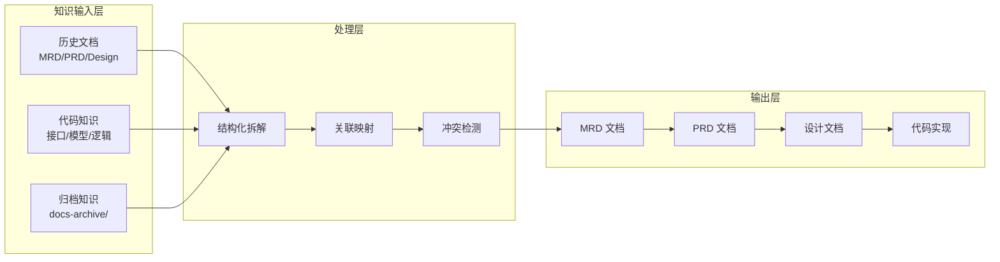
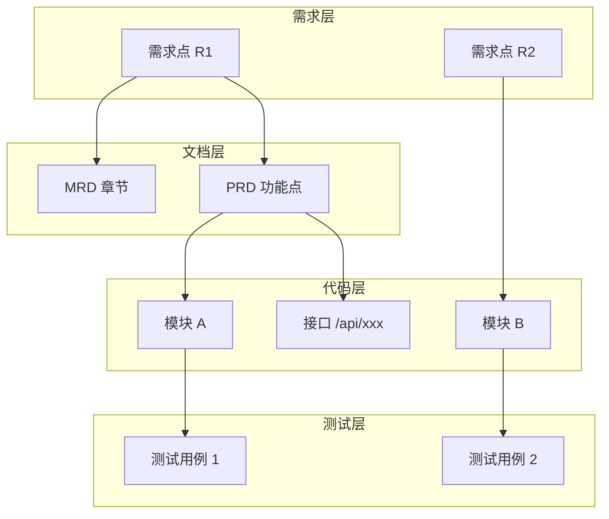
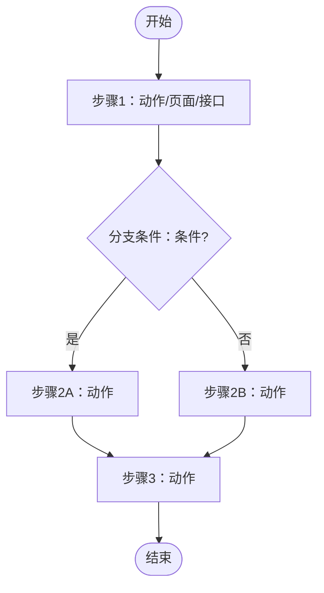

# 利用历史文档与代码构建高效知识输入体系

**文档版本**: v1.0  
**创建日期**: 2026-01-26  
**最后更新**: 2026-01-26  
**相关文档**:
  - `MRD-GENERATION-PROMPT.md` - MRD 生成规范
  - `prd-template/prd-template.md` - PRD 模板
  - `31_CLI知识库设计方案_CLI_KNOWLEDGE_BASE.md` - 知识输入实现方案

---

## 目录

1. [引言](#1-引言)
2. [为什么用"历史文档+代码"作为知识输入](#2-为什么用历史文档代码作为知识输入)
3. [知识结构化与映射](#3-知识结构化与映射)
4. [MRD 模板设计](#4-mrd-模板设计)
5. [PRD 模板设计](#5-prd-模板设计)
6. [知识输入的工程实现](#6-知识输入的工程实现)
7. [真实案例展示](#7-真实案例展示)
8. [总结与最佳实践](#8-总结与最佳实践)

---

## 1. 引言

在现代产品研发中，尤其是 AI 驱动的智能产品开发场景下，如何有效利用现有的历史文档和代码资源，构建一套准确、可执行且面向 AI 和开发双重角色的知识输入体系，成为提升产品交付效率和质量的关键。

### 1.1 Mind2Build 的设计理念

Mind2Build（即思即成）是一个多智能体协作框架，其核心设计理念是：

```
Code = SOP(Team)
```

- **Code**: 最终产出的软件代码
- **SOP**: Standard Operating Procedure（标准操作流程）
- **Team**: 由多个 AI Agent 组成的协作团队

在这个框架中，9 个 AI 角色（Salesperson、ProductManager、Architect、ProjectManager、Engineer、QAEngineer 等）通过 30 个 Actions 协作完成从需求到代码的全流程。知识输入体系是连接业务意图与代码实现的桥梁。

### 1.2 知识流转架构



本文围绕"历史文档+代码"作为知识输入的理念，探讨如何设计一套适配该输入形式的 MRD（市场需求文档）和 PRD（产品需求文档）模板。

---

## 2. 为什么用"历史文档+代码"作为知识输入

### 2.1 历史文档的价值

**历史文档**是产品演进的业务记忆，涵盖：

| 文档类型 | 包含内容 | 价值 |
|---------|---------|------|
| MRD | 市场需求、用户反馈、竞品分析 | 理解业务背景和市场定位 |
| PRD | 功能规格、交互流程、验收标准 | 了解已有功能边界 |
| 设计文档 | 架构决策、技术选型、接口定义 | 确保技术一致性 |
| 版本记录 | 需求变更、问题修复、优化历史 | 避免重复踩坑 |

### 2.2 代码知识的价值

**代码**是产品功能的最终体现，承载了：

- **接口定义**: API 契约、数据格式、错误码规范
- **数据模型**: 实体关系、字段约束、业务规则
- **业务逻辑**: 流程控制、状态机、算法实现
- **测试用例**: 边界条件、异常场景、预期行为

### 2.3 结合的必要性

将两者结合，能够实现：

```
┌─────────────────────────────────────────────────────────────┐
│                    避免信息断层                              │
├─────────────────────────────────────────────────────────────┤
│  ❌ 仅靠文档：设计脱离实现，导致"文档说一套，代码做一套"      │
│  ❌ 仅靠代码：缺少业务背景，导致"知其然不知其所以然"          │
│  ✅ 文档+代码：业务意图与实现细节深度融合，需求可追溯、可验证  │
└─────────────────────────────────────────────────────────────┘
```

### 2.4 Mind2Build 中的实践

在 Mind2Build 项目中，通过 CLI 知识库方案实现了这一理念：

```typescript
const prompt = `
【重要：知识输入】
请参考以下目录中的历史文档和代码作为知识输入：
1. 归档历史文档：docs-archive/mrd/, docs-archive/prd/
2. 当前文档：docs/mrd/, docs/prd/
3. 代码实现：ainative-app/src/, ainative-backend/, ainative-shadow/src/

【功能冲突检测】
如果发现与现有功能冲突，请明确指出冲突点和建议解决方案。
`;
```

---

## 3. 知识结构化与映射

### 3.1 知识拆解与标签化

#### 历史文档拆解

| 模块 | 内容 | 标签示例 |
|------|------|---------|
| 背景信息 | 业务现状、市场环境、竞争态势 | `#background` `#market` |
| 用户场景 | 用户画像、使用场景、痛点描述 | `#user` `#scenario` `#pain-point` |
| 需求动因 | 为什么做、不做的后果 | `#motivation` `#impact` |
| 限制条件 | 时间、技术、成本、合规约束 | `#constraint` `#deadline` |
| 版本信息 | 版本号、更新时间、变更记录 | `#version` `#changelog` |

#### 代码知识拆解

| 模块 | 内容 | 标签示例 |
|------|------|---------|
| 接口定义 | API 路径、请求/响应格式、错误码 | `#api` `#contract` |
| 数据模型 | 实体、字段、关系、约束 | `#model` `#schema` |
| 核心算法 | 业务计算、状态转换、规则引擎 | `#algorithm` `#logic` |
| 流程状态机 | 状态定义、转换条件、触发动作 | `#state-machine` `#workflow` |

### 3.2 建立关联映射

通过需求点与代码模块、业务文档和测试用例之间的映射，确保：



**映射关系确保**：
- 需求变更 → 可追溯影响范围
- 开发实现 → 可验证符合需求
- 测试覆盖 → 有据可依

### 3.3 工作目录结构

Mind2Build 采用标准化的 workspace 目录结构管理知识：

```
workspace/
  {applicationId}/
    {projectId}/
      {versionId}/
        docs/                    # 当前正在生成的文档
        │   ├── mrd/             # 当前 MRD
        │   └── prd/             # 当前 PRD
        docs-archive/            # 归档的历史文档
        │   ├── mrd/
        │   │   ├── v1-2026-01-20/
        │   │   └── v2-2026-01-25/
        │   └── prd/
        │       └── v1-2026-01-21/
        MRD/                     # 市场调研文档输出
        PRD/                     # 产品需求文档输出
        DESIGN/                  # 设计文档输出
        CODE/                    # 代码文件输出
        TEST/                    # 测试文件输出
```

---

## 4. MRD 模板设计

MRD（Market Requirements Document）侧重于表达市场与业务需求，是 PRD 的输入源。

### 4.1 MRD 边界定义

```
┌─────────────────────────────────────────────────────────────┐
│  ✅ MRD 写什么                  │  ❌ MRD 不写什么            │
├─────────────────────────────────┼───────────────────────────┤
│  市场需求、用户场景             │  技术实现细节              │
│  业务目标、成功标准             │  接口设计、数据库设计      │
│  范围边界（做/不做）            │  代码示例                  │
│  约束条件、风险识别             │  详细交互流程              │
└─────────────────────────────────┴───────────────────────────┘
```

### 4.2 MRD 七章结构

#### 第 1 章：背景与问题定义（200-400字）

**必需子章节**：
- **核心问题**：要解决的核心痛点（2-3 个要点）
- **行业背景**：基于研究补充的行业背景或竞品动态
- **不解决的后果**：对用户和业务的影响

**示例**：
```markdown
### 核心问题

**问题1：教学资源管理分散** ✓ 用户
- 老师的教学视频、练习题、文档等资源分散在各处
- 缺少统一的资源库，资源难以复用和共享

**问题2：学习任务布置低效** ✓ 用户
- 老师需要每天手动通过微信群布置任务，重复性高
- 跨班级、跨老师时，优质任务内容无法复用
```

> **标记说明**：
> - `✓ 用户`：来自用户输入的内容
> - `⚡ AI`：AI 基于研究补充的内容

#### 第 2 章：目标用户和使用场景（200-400字）

**必需子章节**：
- **目标用户**：主要用户、用户规模、核心诉求
- **典型场景**：2-3 个场景，每个包含触发条件、用户目标、当前痛点

#### 第 3 章：需求目标与成功标准（200-300字）

**必需子章节**：
- **业务目标**：1-2 个主要目标
- **成功标准**：可量化的指标（必须有至少 1 个量化指标）

**示例**：
```markdown
### 成功标准（可量化）

**效率指标（P0）** ✓ 用户
- 任务布置时间：从每天30分钟降低到一次性设置（提升90%+）
- 资源查找时间：从10分钟降低到1分钟内

**学习效果指标（P0）** ⚡ AI
- 学生任务完成率：≥70%（行业基准）
- 练习题平均正确率：提升10%+
```

#### 第 4 章：核心需求范围（300-500字）⚠️ 重点

**必需子章节**：
- **4.1 核心功能需求**：P0 功能 2-5 个，P1 功能 0-3 个
- **4.2 明确不做的范围**：至少 3 项，每项说明原因，使用 ❌ 符号

**不做范围示例**：
```markdown
### 4.2 明确不做的范围

| 功能 | 不做原因 | 后续规划 |
|------|----------|----------|
| ❌ 复杂任务依赖（前置条件） | 用户明确选择简单线性排列 | V2.0可考虑 |
| ❌ 学生之间互动（讨论区、PK） | 非核心流程，优先保证基础功能 | V2.0可增加 |
| ❌ 微信/App主动推送通知 | 用户选择系统内展示 | 如需提升活跃度可后续添加 |
```

#### 第 5 章：关键约束（200-300字）

**必需子章节**：
- 时间约束、技术约束、成本约束、合规约束、待确认约束

#### 第 6 章：不确定的点和风险（200-300字）

**必需子章节**：
- **需要确认的问题**：1-3 个问题，包含影响范围和确认时间
- **已识别的风险**：技术/进度/业务风险，包含应对措施

#### 第 7 章：备注（200-400字）

**必需子章节**：
- **竞品与参考**：1-3 个主要竞品
- **技术参考**：技术方案、开源项目、最佳实践
- **工程评估辅助信息**：数据实体、核心流程、复杂度评估

### 4.3 MRD 质量检查清单

```markdown
### 结构完整性
- [ ] 包含所有 7 个章节
- [ ] 有"明确不做的范围"章节（至少 3 项）
- [ ] 有 Sources 章节
- [ ] 总长度 2000-4000 字

### 内容质量
- [ ] 至少 2 个典型场景
- [ ] 至少 1 个量化指标
- [ ] "明确不做的范围"有具体原因
- [ ] 至少 1 类约束条件
- [ ] 至少 1 个风险或不确定项

### 边界检查
- [ ] 没有接口设计
- [ ] 没有数据库设计
- [ ] 没有代码示例
- [ ] 没有详细技术实现
```

---

## 5. PRD 模板设计

PRD（Product Requirements Document）强调功能细节与执行方案，是开发和测试的直接依据。

### 5.1 PRD 设计原则

**适用场景**：
- 用 MRD 作为输入，自动生成 PRD
- 人只做"审阅/退回重写"，不在 PRD 内协作补写

**生成要求**：
- 生成后不得保留任何占位符（如 `<...>`）
- 不得出现 `TBD/TODO`
- 信息不足时，必须在「约束与假设」中写明假设与影响

### 5.2 PRD 分层阅读设计

```
┌─────────────────────────────────────────────────────────────┐
│                     PRD 文档结构                             │
├─────────────────────────────────────────────────────────────┤
│  【主干内容】所有角色必读                                     │
│  ├── 0. 基本信息                                            │
│  ├── 1. 背景与目标                                          │
│  ├── 2. 范围（In Scope / Out of Scope）                     │
│  ├── 3. 用户与场景                                          │
│  ├── 4. 核心流程                                            │
│  ├── 5. 功能与交互                                          │
│  ├── 6. 业务规则与数据口径                                   │
│  ├── 7. 权限与安全                                          │
│  ├── 8. 异常与边界                                          │
│  ├── 9. 埋点与观测                                          │
│  └── 10. 验收标准                                           │
├─────────────────────────────────────────────────────────────┤
│  【角色关注块】按需展开（可折叠）                              │
│  ├── UI 设计师关注块                                        │
│  ├── 前端工程师关注块                                        │
│  ├── 后端工程师关注块                                        │
│  └── 测试工程师关注块                                        │
└─────────────────────────────────────────────────────────────┘
```

### 5.3 主干内容详解

#### 0. 基本信息

| 项 | 内容 |
|---|---|
| PRD 标题 | `<产品/功能名>` |
| PRD 编号 | `<PRD-001>` |
| 版本 | `v0.1` |
| 状态 | `草稿 / 评审中 / 已冻结 / 已上线` |
| MRD 来源 | `<MRD 标题/版本/链接>` |
| 负责人 | PM `<@>` / UI `<@>` / FE `<@>` / BE `<@>` / QA `<@>` |
| 里程碑 | 评审 / 联调 / 提测 / 灰度 / 全量 |

#### 4. 核心流程

**必须包含 Mermaid 流程图**：



#### 5. 功能与交互

**关键页面说明格式**：

```markdown
#### 页面/流程节点 A

- **目标**：用户要完成什么
- **核心操作**（按"用户动作 -> 系统反馈"逐条写清楚）：
  - O-1：`<动作名>`
    - 入口：`<按钮/手势/快捷键/自动触发>`
    - 前置：`<权限/状态/数据>`
    - 输入：`<字段/校验/提示>`
    - 请求：`<接口/参数/幂等/节流>`
    - 成功：`<状态变化/跳转/反馈>`
    - 失败：`<错误码/提示/重试>`
    - 副作用：`<埋点/日志/通知>`
```

#### 10. 验收标准

```markdown
### 10.1 功能验收（可测试、可量化）
- AC-1：当 `<前置条件>`，执行 `<步骤>`，应得到 `<期望结果>`

### 10.2 非功能指标
- 性能：`<如接口 P95、首屏、列表渲染>`
- 兼容：`<浏览器/设备/系统版本矩阵>`

### 10.3 上线与回滚
- 灰度策略：`<开关/人群/比例>`
- 回滚条件：`<触发阈值与决策人>`
```

### 5.4 角色关注块设计

使用 HTML `<details>` 标签实现可折叠：

```markdown
<details>
<summary><strong>前端工程师（展开阅读）</strong></summary>

## FE-1 路由、页面拆分与权限
- 路由：`<path/参数/重定向>`
- 页面拆分：`<模块边界/复用组件>`
- 权限：`<鉴权点/无权限落地页/按钮级权限>`

## FE-2 状态与交互逻辑
- 状态机：`<核心状态与转换条件>`
- 表单校验：`<规则/触发时机/提示文案>`
- 异常策略：`<超时/重试/兜底/离线>`

## FE-3 接口契约（联调必备）
- 接口列表（逐条列出）：
  - `<接口名>`：`<METHOD> <URL>`
    - 请求：`字段/类型/必填/枚举/分页/排序/过滤`
    - 响应：`字段/类型/枚举/默认值`
    - 错误码：`code -> 前端文案/处理策略`

</details>
```

**各角色关注块内容**：

| 角色 | 关注块内容 |
|------|-----------|
| UI 设计师 | 信息架构、关键交互、组件规范、视觉适配、交付物 |
| 前端工程师 | 路由权限、状态逻辑、接口契约、埋点性能、发布回滚 |
| 后端工程师 | 领域模型、API 设计、业务规则、性能可靠性、上线迁移 |
| 测试工程师 | 测试范围、用例设计、环境数据、接口校验、上线验证 |

---

## 6. 知识输入的工程实现

### 6.1 简化方案：直接使用目录结构

**核心思路**：利用 CLI 的原生上下文能力，无需复杂的知识库封装层。

```typescript
// 方式一：使用预定义的 prompt 函数
import { buildMRDPromptWithKnowledge } from '../prompts/mrd';
import { buildPRDPromptWithKnowledge } from '../prompts/prd';

// MRD 生成（包含知识输入引用和冲突检测）
const mrdPrompt = buildMRDPromptWithKnowledge(userIdea);

// PRD 生成（包含知识输入引用和冲突检测）
const prdPrompt = buildPRDPromptWithKnowledge(mrdContent);

await this.executeCLI(mrdPrompt, { workDir: ainativeWorkspace });
```

```typescript
// 方式二：直接在 prompt 中引用目录
const prompt = `
【重要：知识输入】
请参考以下目录中的历史文档和代码作为知识输入：
1. 归档历史文档：docs-archive/mrd/, docs-archive/prd/
2. 当前文档：docs/mrd/, docs/prd/
3. 代码实现：ainative-app/src/, ainative-backend/

【功能冲突检测】
如果发现与现有功能冲突，请明确指出冲突点和建议解决方案。

请基于用户需求生成 MRD 文档。
${userIdea}
`;
```

### 6.2 文档归档机制

文档归档只在**整个工作流完全执行完成后**触发：

```
MRD → PRD → Design → Code → Test → 工作流完成 → 【归档所有文档】
```

```typescript
import { documentArchiveService } from '../services/DocumentArchiveService';

// 归档单个文档
await documentArchiveService.archiveDocument(workspacePath, 'mrd');

// 归档所有文档（工作流完成后调用）
await documentArchiveService.archiveAllDocuments(workspacePath);
```

### 6.3 知识输入标准 Prompt 模板

```typescript
/**
 * 构建包含知识输入的 MRD 生成 Prompt
 */
export function buildMRDPromptWithKnowledge(userIdea: string): string {
  return `
【知识输入参考】
请参考以下目录中的历史文档和代码作为知识输入：

1. **归档历史文档**（了解产品演进历史）：
   - docs-archive/mrd/  - 历史 MRD 版本
   - docs-archive/prd/  - 历史 PRD 版本

2. **当前文档**（了解当前产品状态）：
   - docs/mrd/  - 当前 MRD
   - docs/prd/  - 当前 PRD

3. **代码实现**（了解技术现状和接口定义）：
   - ainative-app/src/     - 移动端代码
   - ainative-backend/     - 后端代码
   - ainative-shadow/src/  - 管理后台代码

【功能冲突检测】
在生成新需求时，请：
1. 检查是否与现有功能存在冲突
2. 如有冲突，明确指出冲突点
3. 提供建议的解决方案（复用/扩展/替换）

【用户需求】
${userIdea}

请按照 MRD 七章结构生成文档，确保：
- 包含所有 7 个章节
- "明确不做的范围"至少 3 项
- 至少 1 个可量化的成功标准
- 至少 2 个典型使用场景
- 总长度 2000-4000 字
`;
}
```

### 6.4 核心收益

| 收益 | 说明 |
|------|------|
| 简化架构 | 减少 CLI 调用次数（4次 → 1次） |
| 知识输入完整 | 历史文档 + 代码 + 开发规范 |
| 冲突检测 | 自动识别新功能与现有功能的冲突 |
| 易于维护 | 无需维护复杂的知识库索引和检索逻辑 |

---

## 7. 真实案例展示

以下是基于 Mind2Build 项目的真实 MRD 案例精简版。

### 自习室任务管理系统 MRD（精简版）

#### 1. 背景与问题定义

**核心问题**：

| 问题 | 描述 | 来源 |
|------|------|------|
| 教学资源管理分散 | 老师的资源分散在各处，难以复用和共享 | ✓ 用户 |
| 学习任务布置低效 | 每天手动布置任务，重复性高 | ✓ 用户 |
| 学生学习过程不透明 | 无法提前发现学习问题 | ✓ 用户 |
| 数据价值未挖掘 | 缺少分析工具，无法数据驱动决策 | ⚡ AI |

#### 2. 目标用户和使用场景

**目标用户**：

| 用户角色 | 特征 | 核心诉求 |
|---------|------|---------|
| 老师 | 负责课程教学、任务布置 | 高效管理资源、快速布置任务 |
| 学生 | 在自习室学习 | 清晰的任务指引、便捷的提交 |
| 管理层 | 关注整体教学质量 | 掌握全局数据、识别问题 |

**典型场景**：
1. **老师上传资源**：登录后台 → 上传视频/文档 → 打标签 → 入库
2. **系统自动发布**：到达设定时间 → 自动推送任务 → 更新状态
3. **学生完成任务**：查看任务 → 观看视频 → 完成练习 → 查看进度

#### 3. 需求目标与成功标准

**成功标准（可量化）**：

| 指标类型 | 指标 | 目标值 |
|---------|------|--------|
| 效率指标 | 任务布置时间 | 从 30分钟/天 → 一次性设置 |
| 效率指标 | 资源查找时间 | 从 10分钟 → 1分钟内 |
| 学习效果 | 学生任务完成率 | ≥70% |
| 学习效果 | 练习题正确率 | 提升 10%+ |

#### 4. 核心需求范围

**4.1 核心功能需求**：

| 优先级 | 功能 | 说明 |
|--------|------|------|
| P0 | 资源库管理 | 视频、练习题、文档统一管理 |
| P0 | 任务编排与模板 | 按天编排任务，支持模板复用 |
| P0 | 自动定时发布 | 到点自动推送任务 |
| P0 | CRM 集成 | 学员数据互通 |
| P1 | AI 智能分析 | 学习报告、学情预警 |

**4.2 明确不做的范围**：

| 功能 | 不做原因 | 后续规划 |
|------|----------|----------|
| ❌ 复杂任务依赖 | 用户选择简单线性排列 | V2.0 |
| ❌ 学生互动功能 | 非核心流程 | V2.0 |
| ❌ 推送通知 | 用户选择系统内展示 | 按需添加 |
| ❌ 直播课功能 | 暂无直播需求 | 未来考虑 |

#### 5. 关键约束

- **技术约束**：必须与现有 CRM 系统对接
- **性能要求**：视频加载 <3秒，练习提交响应 <1秒
- **兼容性**：管理端 PC 浏览器，学生端移动端优先

#### 6. 风险识别

| 风险 | 严重程度 | 缓解措施 |
|------|---------|---------|
| CRM 集成难度未知 | 高 | 优先与供应商沟通 API 能力 |
| 视频存储成本 | 中 | 优先使用第三方平台链接 |
| AI 分析准确性 | 中 | 设置数据阈值，数据不足时不启用 |

---

## 8. 总结与最佳实践

### 8.1 知识输入体系核心要点

```
┌─────────────────────────────────────────────────────────────┐
│                    知识输入体系三要素                         │
├─────────────────────────────────────────────────────────────┤
│  1. 结构化                                                  │
│     - 历史文档：按模块拆解，附加标签                          │
│     - 代码知识：按层次组织，标注依赖关系                      │
│                                                             │
│  2. 关联映射                                                │
│     - 需求 ↔ 文档 ↔ 代码 ↔ 测试                              │
│     - 确保可追溯、可验证、有据可依                            │
│                                                             │
│  3. 工程实现                                                │
│     - 标准目录结构（docs/ + docs-archive/）                  │
│     - Prompt 模板（知识引用 + 冲突检测）                      │
│     - 归档机制（工作流完成后自动归档）                        │
└─────────────────────────────────────────────────────────────┘
```

### 8.2 MRD/PRD 模板最佳实践

**MRD 最佳实践**：
1. 严格遵循七章结构，不遗漏任何章节
2. "明确不做的范围"是必需的，至少 3 项
3. 至少 1 个量化指标，至少 2 个典型场景
4. 使用 `✓ 用户` 和 `⚡ AI` 标记内容来源
5. 控制长度在 2000-4000 字

**PRD 最佳实践**：
1. 按角色分层阅读，主干内容所有人必读
2. 角色关注块使用可折叠设计
3. 核心流程必须有 Mermaid 图
4. 功能点按"用户动作 → 系统反馈"格式描述
5. 验收标准必须可测试、可量化

### 8.3 知识输入实现建议

| 场景 | 推荐方案 |
|------|---------|
| 常规项目 | 直接在 Prompt 中引用目录（简化方案） |
| 跨项目知识检索 | 使用 RAG + 向量数据库 |
| 超大项目（>500文件） | 使用 CLI 知识库封装层预筛选 |

### 8.4 持续优化

1. **定期归档**：工作流完成后自动归档文档
2. **版本管理**：历史文档按版本号组织
3. **冲突检测**：新需求生成时自动检测与现有功能的冲突
4. **模板迭代**：根据团队反馈持续优化模板结构

---

## 附录

### A. 相关文档索引

| 文档 | 路径 | 说明 |
|------|------|------|
| MRD 生成规范 | `doc/MRD-GENERATION-PROMPT.md` | MRD 生成的详细 Prompt 模板 |
| PRD 模板 | `doc/prd-template/prd-template.md` | 完整的 PRD 模板 |
| MRD 示例 | `doc/prd-template/自习室任务管理系统-MRD.md` | 真实 MRD 案例 |
| CLI 知识库方案 | `doc/31_CLI知识库设计方案_CLI_KNOWLEDGE_BASE.md` | 知识输入实现方案 |

### B. Prompt 模板速查

```typescript
// MRD 知识输入 Prompt
const mrdKnowledgePrompt = `
【知识输入】参考 docs-archive/ 和代码目录
【冲突检测】检查与现有功能的冲突
【生成要求】七章结构，2000-4000字
`;

// PRD 知识输入 Prompt
const prdKnowledgePrompt = `
【知识输入】参考 MRD 和代码接口定义
【生成要求】主干内容 + 角色关注块，无占位符
`;
```

---

**文档维护者**：Mind2Build 团队  
**版本**：v1.0  
**最后更新**：2026-01-26
