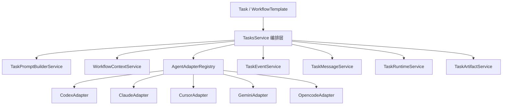

# AINative Agent Orchestration 具体改造方案（基于当前仓库）

## 1. 文档目标

本文档用于回答下面这个核心问题：

> AINative 到底应该被实现成“Prompt 流平台”，还是“可调用不同 Agent CLI 的可观测工作流平台”？

结合当前仓库实现，结论如下：

- 产品对外概念可以继续使用“工作流”。
- 系统内部应明确定位为 **可观测的 Agent CLI Orchestration 平台**。
- “Prompt 流”不是独立产品模型，而是工作流里最基础的一类 `agent` 节点执行方式。
- “持续对话”不应再依赖“重新拼接一次 prompt”来伪装，而应逐步升级为 **消息流 + 会话状态 + 节点上下文** 的组合能力。

本文档重点给出：

- 面向当前仓库的目标架构
- 需要新增或调整的数据模型
- 后端与前端的具体改造点
- 分阶段落地路径
- 每一阶段的验收标准

---

## 2. 当前仓库评估

## 2.1 已有能力

当前项目已经具备可观测编排平台的基础骨架：

| 能力 | 当前实现 | 说明 |
|---|---|---|
| 任务模型 | `Task` + `TaskNode` | 已支持任务、节点、状态机、审批、重试 |
| 工作流模板 | `WorkflowTemplate` | 已支持线性串行节点模板 |
| Agent 运行器 | `AgentRunnerService` | 已支持 `codex / cursor / claude / gemini / opencode` |
| 运行时沙箱 | `TaskRuntimeService` | 已支持目录隔离与 git worktree |
| Worker 调度 | `TasksService.scheduleQueuedNodes()` | 已支持 DB worker 调度和租约心跳 |
| 执行日志流 | `task_logs` + SSE | 已支持增量流式日志 |
| 终端调试 | `TaskTerminalService` | 已支持打开任务工作区 shell |
| 业务线级 CLI 配置 | `AgentToolConfig` | 已支持同一种 CLI 的多套配置 |

这意味着：

- **不需要推翻重做**。
- 正确做法是在现有 `Task / TaskNode / WorkflowTemplate / AgentToolConfig` 基础上升级，而不是另起一个“prompt flow”子系统。

## 2.2 关键问题

### 问题 1：持续对话目前不是真持续

当前 `reply` 的行为本质是：

1. 写入一条用户日志
2. 将一个节点重新改回 `todo`
3. 重新触发该节点执行

这不是会话恢复，而是“重新跑一次节点”。

当前仓库现状：

- `reply` 只是记录用户消息并重新排队：`backend/src/tasks/tasks.service.ts`
- 实际执行 prompt 只使用节点 prompt、任务 title、任务 prompt：`backend/src/tasks/agent-runner.service.ts`

带来的问题：

- 历史上下文不完整
- Agent 无法知道之前真正说过什么
- 节点级多轮对话体验不稳定

### 问题 2：工作流节点级 CLI 选择前后端没打通

前端工作流模板编辑器已经允许每个节点单独选择：

- `cliToolId`
- `agentToolConfigId`

但后端运行时当前只读取：

- `task.cliToolId`
- `task.agentToolConfigId`

没有读取 `node.input` 里的节点级配置。

结果是：

- UI 看起来支持“每个节点选不同 Agent CLI”
- 实际执行仍然可能落到任务级默认 CLI

### 问题 3：前端类型声明了 `skill / mcp`，后端实际上不支持

当前前端类型已经声明节点类型：

- `agent`
- `skill`
- `mcp`
- `manual`

但后端 `TaskNodeType` / `WorkflowNodeType` 只有：

- `agent`
- `manual`

并且后端对未知节点类型采用“静默降级为 `agent`”的方式处理。这个行为短期省事，但长期很危险，会导致：

- 模板配置与实际运行语义不一致
- 用户误以为 `skill/mcp` 已生效
- 排查问题困难

### 问题 4：节点可观测性还停留在日志层

当前任务详情页能看到：

- 任务日志流
- 节点状态
- 文件 / git / terminal

但还缺少以下核心视图：

- 节点真实输入（本次执行看到的 prompt）
- 节点真实输出（结构化 output、stdout、stderr、耗时）
- 节点使用的 CLI / 配置 / 命令行参数
- 节点事件时间线（开始、stdout chunk、审批等待、完成、失败）

### 问题 5：执行日志与对话消息混在一起

现在 `task_logs` 既承担执行日志，也承担对话消息来源。这会带来几个问题：

- 用户消息和系统日志混用
- assistant 回复没有稳定模型
- 后续做会话摘要、上下文裁剪、消息检索都不方便

### 问题 6：当前 runner 是“一次性进程调用”，不是会话型适配层

当前 runner 逻辑是：

1. `spawn(command, args)`
2. 把 prompt 写进 stdin
3. 等待 CLI 退出
4. 收集 stdout / stderr

这很适合做单次节点执行，但不适合做：

- 真正的多轮对话恢复
- 流式回显
- 长时间 session
- 更复杂的 agent 工具调用观察

---

## 3. 目标产品模型

## 3.1 目标定位

AINative 的目标产品模型应定义为：

> 一个支持不同 Agent CLI 统一接入、可通过节点工作流编排、并且具备强可观测性的 Agent 执行平台。

对内统一抽象如下：

| 概念 | 定义 | 说明 |
|---|---|---|
| Task | 用户提交的一次完整任务实例 | 对应一次任务入口 |
| WorkflowTemplate | 可复用的编排模板 | 定义节点顺序与节点输入 schema |
| TaskNode | 工作流实例中的单个执行节点 | 可为 `agent / human_approval / skill / mcp / shell` |
| AgentAdapter | 外部 Agent CLI 适配器 | 屏蔽不同 CLI 的调用差异 |
| AgentSession | 某个节点或任务级会话状态 | 用于持续对话与恢复 |
| TaskMessage | 用户 / assistant / system 消息 | 用于对话语义与上下文构建 |
| TaskEvent | 节点运行事件 | 用于观测、SSE、时间线 |
| WorkflowContext | 节点间共享的结构化上下文 | 用于上游节点产物传给下游节点 |

## 3.2 产品语义约定

建议统一以下语义：

- `conversation` 本质上是“只有一个 `agent` 节点的 workflow”
- `workflow` 是多个节点串行或将来可扩展的编排实例
- “Prompt 流”只是某类 workflow 的最简表达，不再单独建模

这能保证：

- 产品概念统一
- 数据结构统一
- 前端与后端无需分两套执行体系

---

## 4. 目标架构设计

## 4.1 目标分层



### 分层职责

| 层 | 职责 |
|---|---|
| 编排层 | 决定执行哪个节点、是否审批、是否重试、如何推进状态机 |
| Prompt 构建层 | 从任务、节点、消息、上下文、产物构建最终 prompt |
| Adapter 层 | 统一调用不同 Agent CLI |
| Event / Message 层 | 分离执行事件与对话消息 |
| Runtime 层 | 管理 worktree、cwd、终端、工作区文件 |
| Artifact 层 | 管理 diff、报告、生成文件、预览 |

## 4.2 AgentAdapter 统一接口

建议新增适配器接口：

```ts
interface AgentAdapter {
  readonly adapterId: 'codex' | 'claude' | 'cursor' | 'gemini' | 'opencode'

  executeOnce(input: ExecuteOnceInput): Promise<ExecuteOnceResult>

  startSession?(input: StartSessionInput): Promise<StartSessionResult>

  sendMessage?(input: SendMessageInput): Promise<SendMessageResult>

  stopSession?(input: StopSessionInput): Promise<void>
}
```

### 设计原则

- 第一阶段必须实现 `executeOnce()`
- 第二阶段按 CLI 支持情况逐步实现 `startSession()/sendMessage()`
- 不支持真会话的 CLI 使用“伪会话策略”兼容：最近消息 + 摘要 + 上下文重建

## 4.3 Prompt 构建策略

建议新增 `TaskPromptBuilderService`，统一生成最终 prompt，而不是让 `AgentRunnerService` 直接拼字符串。

最终 prompt 由以下部分组成：

1. 节点系统提示词（node prompt）
2. 任务主提示词（task prompt）
3. 项目上下文（可选）
4. 最近用户 / assistant 消息
5. 上游节点输出摘要
6. 上游产物引用信息
7. 当前节点执行约束（例如输出格式、审批要求）

### 推荐 prompt 结构

```text
[Node Role / Goal]
[Task Goal]
[Context Summary]
[Relevant Conversation Messages]
[Previous Node Outputs]
[Artifacts and Workspace Hints]
[Output Contract]
```

### 上下文来源建议

| 来源 | 是否第一阶段接入 | 说明 |
|---|---|---|
| `task.title` / `task.prompt` | 是 | 基础上下文 |
| `node.input.prompt` | 是 | 节点主提示词 |
| 用户 reply 历史 | 是 | 至少带最近 N 条 |
| 上游节点 `output.summary` | 是 | 构建链路上下文 |
| 产物列表 | 第二阶段 | 用于更精准引用 |
| 项目知识/技能内容 | 第二阶段 | 避免第一阶段过重 |

---

## 5. 数据模型设计

## 5.1 保留并复用的现有模型

以下模型建议继续沿用：

- `tasks`
- `task_nodes`
- `task_logs`
- `task_artifacts`
- `workflow_templates`
- `agent_tool_configs`

原因：

- 主干模型已经合理
- 状态机和 worker 调度已可复用
- 现有前端页面也围绕这些实体构建

## 5.2 新增表建议

### 表 1：`task_messages`

用于承载真正的对话语义，而不是继续把消息塞进 `task_logs`。

| 字段 | 类型 | 说明 |
|---|---|---|
| id | uuid | 主键 |
| taskId | uuid | 关联任务 |
| taskNodeId | uuid nullable | 关联节点，可空 |
| role | enum | `user / assistant / system / tool / error` |
| kind | varchar(32) | `reply / result / summary / notice / error` |
| content | text | 消息正文 |
| metadata | jsonb nullable | token、adapter、config、command 等 |
| createdBy | uuid nullable | 用户消息可记录操作者 |
| createdAt | timestamp | 创建时间 |

作用：

- 支持持续对话
- 支持消息摘要与裁剪
- 支持后续 session 恢复

### 表 2：`task_events`

用于承载运行时事件流。

| 字段 | 类型 | 说明 |
|---|---|---|
| id | uuid | 主键 |
| taskId | uuid | 关联任务 |
| taskNodeId | uuid nullable | 关联节点 |
| eventType | varchar(64) | 事件类型 |
| source | varchar(32) | `system / worker / agent / terminal / user` |
| level | varchar(16) | `info / warn / error / debug` |
| message | text nullable | 人类可读消息 |
| data | jsonb nullable | 结构化载荷 |
| sequence | bigint | 同任务内递增序号 |
| createdAt | timestamp | 创建时间 |

推荐事件类型：

- `task.queued`
- `node.started`
- `node.stdout.chunk`
- `node.stderr.chunk`
- `node.waiting_approval`
- `node.completed`
- `node.failed`
- `artifact.created`
- `session.started`
- `session.restored`
- `session.closed`

### 表 3：`task_agent_sessions`

第二阶段建议引入，用于管理 session 化 agent。

| 字段 | 类型 | 说明 |
|---|---|---|
| id | uuid | 主键 |
| taskId | uuid | 关联任务 |
| taskNodeId | uuid nullable | 关联节点 |
| adapter | varchar(32) | `codex / claude / cursor / ...` |
| cliToolId | varchar(64) | 原始 CLI 工具标识 |
| agentToolConfigId | uuid nullable | 关联配置 |
| status | varchar(32) | `active / idle / closed / failed` |
| sessionKey | varchar(255) nullable | 外部 CLI 会话标识 |
| cwd | text | 工作目录 |
| stateJson | jsonb nullable | 额外状态 |
| lastMessageAt | timestamp nullable | 最后消息时间 |
| createdAt | timestamp | 创建时间 |
| updatedAt | timestamp | 更新时间 |

## 5.3 现有表字段策略

### `task_nodes`

短期不建议立刻把所有节点配置拆字段，继续放在 `input` / `output` JSON 中即可。

原因：

- 当前仓库已经采用 JSON 承载节点输入输出
- 节点配置仍在快速演进阶段
- 过早拆字段会让迁移成本变高

建议的节点输入 schema：

```ts
type WorkflowNodeInput = {
  prompt?: string
  cliToolId?: string
  agentToolConfigId?: string
  sessionStrategy?: 'single_turn' | 'task_shared' | 'node_isolated'
  contextPolicy?: {
    includeTaskPrompt?: boolean
    includeRecentMessages?: number
    includePreviousNodeOutputs?: boolean
    includeArtifacts?: boolean
  }
  outputContract?: {
    format?: 'text' | 'markdown' | 'json'
    saveAs?: string
  }
  skillId?: string
  mcpId?: string
  shellCommand?: string
}
```

---

## 6. 后端具体改造方案

## 6.1 目标：保留现有主干，拆清职责

建议保留：

- `TasksService` 作为总编排入口
- `TaskRuntimeService` 作为运行时与沙箱管理器

建议新增：

- `TaskPromptBuilderService`
- `TaskEventService`
- `TaskMessageService`
- `AgentAdapterRegistry`
- `adapters/` 目录（每个 CLI 一个 adapter）

## 6.2 重点文件改造建议

### A. `backend/src/tasks/agent-runner.service.ts`

当前职责过重，建议拆为两层：

1. `AgentAdapterRegistry`：根据 adapter 选择实现
2. `AgentProcessBridge`：管理 `spawn`、stdout/stderr、timeout、kill

`AgentRunnerService` 保留为兼容层，最终只做：

- 解析运行配置
- 调用对应 adapter
- 返回标准结果

### B. `backend/src/tasks/tasks.service.ts`

建议保留其编排职责，但新增以下改造：

#### 改造点 1：节点级 CLI 配置优先级明确化

建议运行优先级：

1. `node.input.agentToolConfigId`
2. `node.input.cliToolId`
3. `task.agentToolConfigId`
4. `task.cliToolId`
5. 项目默认配置
6. 业务线默认配置
7. 系统默认 adapter

#### 改造点 2：不再静默降级未知节点类型

当前未知类型会回退为 `agent`。建议改为：

- 第一阶段：模板保存时直接校验并拒绝不支持类型
- 第二阶段：当 `skill/mcp/shell` 运行时真正实现后再开放

#### 改造点 3：执行时写入标准化事件与消息

节点执行过程中建议同时写：

- `task_events`：给前端做实时观测
- `task_messages`：给对话上下文和消息面板使用

#### 改造点 4：节点成功时写入 assistant 消息

当前成功后只写 summary 和 artifact，建议增加：

- 若 agent 有可展示结果，写入 `task_messages(role=assistant)`
- 若只产出结构化 JSON，则写系统摘要消息

### C. `backend/src/workflow-templates/*`

建议调整模板校验逻辑：

- 第一阶段仅允许 `agent / manual`
- 第二阶段逐步开放 `skill / mcp / shell`

同时要保证：

- 前端展示的节点类型集合与后端校验完全一致
- 不再允许“前端能配、后端偷换”的情况

## 6.3 推荐新增模块目录

```text
backend/src/tasks/
├── adapters/
│   ├── agent-adapter.interface.ts
│   ├── agent-adapter.registry.ts
│   ├── codex.adapter.ts
│   ├── claude.adapter.ts
│   ├── cursor.adapter.ts
│   ├── gemini.adapter.ts
│   └── opencode.adapter.ts
├── task-prompt-builder.service.ts
├── task-event.service.ts
├── task-message.service.ts
├── task-session.service.ts
└── task-event-stream.service.ts
```

## 6.4 SSE / 事件流改造

当前 `/tasks/:id/stream` 已能返回日志流，建议升级为“兼容扩展”模式：

- 第一阶段：保留现有日志流接口，新增事件 payload 字段
- 第二阶段：新增 `/tasks/:id/events/stream`

推荐事件流返回结构：

```json
{
  "id": "evt-001",
  "type": "node.stdout.chunk",
  "taskId": "...",
  "taskNodeId": "...",
  "source": "agent",
  "sequence": 12,
  "createdAt": "2026-03-06T12:00:00.000Z",
  "data": {
    "chunk": "Planning files...",
    "adapter": "codex"
  }
}
```

## 6.5 节点执行策略

建议定义三种会话策略：

| 策略 | 说明 | 适用场景 |
|---|---|---|
| `single_turn` | 每次节点执行都重新调用 CLI | 线性执行、一次性任务 |
| `task_shared` | 整个任务共享同一个 agent session | 对话型任务 |
| `node_isolated` | 每个节点一个独立 session | 多节点但互不干扰 |

第一阶段建议先实现：

- `single_turn`
- `task_shared`（伪 session 版本）

真正的 CLI session 化放到第二阶段。

---

## 7. 前端具体改造方案

## 7.1 任务创建页

改造目标：

- 保留当前“conversation / workflow”入口形式
- 但在内部认知上统一为 workflow 实例创建

第一阶段无需大改 UI，只需保证：

- conversation 模式仍然创建一个默认 `agent` 节点
- workflow 模式创建模板节点时，节点级配置可真实生效

## 7.2 工作流模板编辑页

建议改造：

### 第一阶段

- UI 中仅开放 `agent`、`manual`
- `skill / mcp` 保留在规划文档，不在 UI 中暴露可选项
- 节点表单保留以下字段：
  - 名称
  - prompt
  - cliToolId
  - agentToolConfigId
  - requiresApproval
  - sessionStrategy

### 第二阶段

- 增加 `skill / mcp / shell` 节点表单
- 增加上下文策略配置
- 增加输出契约配置

## 7.3 任务详情页

当前详情页已经具备：

- 节点条
- 执行面板
- 文件 / git / terminal 右侧面板

建议升级为以下结构：

### 中间主区域

1. `Execution Timeline`
   - 显示 `task_events`
   - 支持过滤节点
   - 支持区分 stdout / stderr / 状态事件

2. `Conversation`
   - 显示 `task_messages`
   - 用户 / assistant / system 分区

3. `Node Output`
   - 显示所选节点的：
     - summary
     - stdout
     - stderr
     - duration
     - exitCode
     - adapter
     - config

### 右侧辅助区域

保留：

- files
- git
- terminal

新增或调整：

- artifacts
- node details

## 7.4 前端类型定义统一

必须同步修正前端与后端类型不一致问题。

建议策略：

### 第一阶段

- 前端 `WorkflowNodeType` 与 `TaskNodeType` 改成只声明后端已支持类型
- 或者保留更大 union，但 UI 层只允许配置后端已支持类型

### 第二阶段

- 等后端实现 `skill/mcp/shell` 后再全量放开

---

## 8. 分阶段实施计划

## 8.1 第一阶段：把“现有 workflow 真正打通”

### 目标

让用户真正获得以下能力：

- 每个节点可以选择不同 Agent CLI
- reply 能够真正影响下一次执行上下文
- 节点输出可被观察
- 前后端节点类型定义一致

### 改造范围

#### 后端

- 修复节点级 CLI 配置读取逻辑
- 新增 `TaskPromptBuilderService`
- `reply` 历史接入 prompt 构建
- 节点成功后写 assistant 消息或结构化摘要消息
- `TaskDetailDto` 返回更完整的 `node.input / node.output`
- 未支持节点类型改为显式拒绝

#### 前端

- 任务详情页显示节点 output
- 执行面板展示命令、耗时、stdout/stderr 摘要
- 工作流模板编辑器隐藏暂未实现的节点类型

### 第一阶段验收标准

- [ ] workflow 模板中不同节点选择不同 CLI 时，执行结果符合节点配置
- [ ] 用户 reply 后，下一次节点执行 prompt 能包含最近消息上下文
- [ ] 任务详情页可看到节点 output 和执行摘要
- [ ] 前后端不再存在 `skill/mcp` 假支持状态

## 8.2 第二阶段：建立消息流与事件流基础设施

### 目标

让平台从“任务日志页面”升级为“可观测执行平台”。

### 改造范围

- 新增 `task_messages`
- 新增 `task_events`
- 新增 `/tasks/:id/events` 与 `/tasks/:id/events/stream`
- stdout/stderr chunk 流式事件化
- assistant 回复从日志中剥离为正式消息
- 前端增加 timeline 视图和 message 视图

### 第二阶段验收标准

- [ ] 执行时间线与对话消息分离
- [ ] SSE 能实时看到节点 stdout/stderr chunk
- [ ] 任务详情页可按节点过滤事件与消息
- [ ] 前端刷新后仍能回放历史事件与消息

## 8.3 第三阶段：引入 session 与工具节点

### 目标

让 AINative 从“线性 prompt 编排”升级到“真正的 agent workflow”。

### 改造范围

- 新增 `task_agent_sessions`
- 支持 `task_shared` / `node_isolated` session 策略
- 实现 `skill` 节点
- 实现 `mcp` 节点
- 视情况新增 `shell` 节点
- 节点间通过 `WorkflowContext` 传递结构化输出

### 第三阶段验收标准

- [ ] conversation 任务可以恢复历史 session 或伪 session 上下文
- [ ] workflow 中至少支持 `agent + manual + skill` 三类节点
- [ ] 节点上游输出可被下游节点稳定引用

## 8.4 第四阶段：高级编排能力（非近期优先级）

不建议近期立刻做，放在能力成熟后推进：

- 条件分支
- 并行节点
- 回滚 / 补偿节点
- Planner 节点
- 自动选择最佳 Agent

---

## 9. 具体代码改造清单

## 9.1 第一阶段必改文件

### 后端

- `backend/src/tasks/agent-runner.service.ts`
- `backend/src/tasks/tasks.service.ts`
- `backend/src/tasks/dto/task-node-type.enum.ts`
- `backend/src/workflow-templates/dto/workflow-node-type.enum.ts`
- `backend/src/workflow-templates/workflow-templates.service.ts`
- `backend/src/tasks/dto/task-detail.dto.ts`
- `backend/src/tasks/domain/task-node.ts`

建议新增：

- `backend/src/tasks/task-prompt-builder.service.ts`

### 前端

- `frontend/src/types/api/tasks.ts`
- `frontend/src/types/api/workflow.ts`
- `frontend/src/components/business/settings/BusinessLineModal.vue`
- `frontend/src/components/tasks/TaskCreatePanel.vue`
- `frontend/src/views/tasks/detail.vue`
- `frontend/src/components/tasks/detail/ExecutionPanel.vue`
- `frontend/src/components/tasks/detail/WorkflowCard.vue`

## 9.2 第二阶段新增文件

### 后端

- `backend/src/tasks/domain/task-message.ts`
- `backend/src/tasks/domain/task-event.ts`
- `backend/src/tasks/domain/task-agent-session.ts`
- `backend/src/tasks/task-message.service.ts`
- `backend/src/tasks/task-event.service.ts`
- `backend/src/tasks/task-session.service.ts`
- `backend/src/tasks/infrastructure/persistence/...`

### 前端

- `frontend/src/components/tasks/detail/EventTimelinePanel.vue`
- `frontend/src/components/tasks/detail/ConversationPanel.vue`
- `frontend/src/components/tasks/detail/NodeOutputPanel.vue`

---

## 10. 风险与取舍

## 10.1 不建议一开始就做的事

以下方向短期不建议直接开做：

### 1. 一开始就做并行 DAG

原因：

- 当前任务状态机是线性节点模型
- 调度、审批、重试、上下文合并都会复杂化

### 2. 一开始就做“全自动多智能体协作”

原因：

- 当前平台还在建立 Agent CLI 标准化调用模型
- 先把单 Agent 节点可观测、可恢复、可复用做好更重要

### 3. 一开始就做重 DSL

原因：

- 用户现在最重要的是能配节点、选 CLI、看到执行、继续对话
- DSL 学习成本高，且会延缓产品上线

## 10.2 当前最有价值的投资顺序

优先级建议如下：

1. **打通节点级 CLI 配置**
2. **补齐消息上下文注入**
3. **补齐节点输出展示**
4. **分离消息流和事件流**
5. **再做 session 与 skill/mcp 节点**

---

## 11. 推荐实施结论

最终建议如下：

### 产品层面

- 继续使用“工作流”这个名称
- 但内部模型必须升级为 `Agent CLI Orchestration`

### 架构层面

- 不新建“prompt-flow”子系统
- 直接升级现有 `Task / TaskNode / WorkflowTemplate / AgentToolConfig`

### 实施层面

- 第一阶段只做“现有链路打通”
- 第二阶段补“消息 + 事件 + 流式观测”
- 第三阶段补“session + skill/mcp 节点”

### 预期结果

完成前三阶段后，AINative 将具备以下统一能力：

- 可以按节点选择不同 Agent CLI 执行
- 可以持续对话，而不是简单重跑 prompt
- 可以观察每个节点的输入、输出、事件、产物
- 可以逐步演化到真正的 agent workflow，而不是停留在 prompt 串联

---

## 12. 建议的下一步动作

建议接下来直接按第一阶段启动开发，并先输出一份“Phase 1 可执行开发清单”，拆成：

- 数据契约变更
- 后端接口改造
- 前端页面改造
- 测试用例补充

如果需要，我可以继续基于本文档再输出一版：

1. **Phase 1 开发任务拆解清单**
2. **数据库 / DTO / API 变更表**
3. **后端类图与执行时序图**

