# AINative 需求设计文档（结构化版）

## 1. 概述

### 1.1 项目背景
随着 AI Agent 技术的成熟，研发团队需要一个统一平台来管理和执行 Agent 驱动的任务，避免各团队重复建设、能力分散。

### 1.2 目标
建设 AINative 平台，通过 Agent 执行器（集成 Codex/Cursor/Claude 等外部 Agent CLI）执行任务，实现"任务-项目-工作流-知识"的统一管理与可观测。

### 1.3 核心价值
| 价值维度 | 描述 | 量化目标 |
|---------|------|---------|
| 效率提升 | 降低任务交付成本 | 任务创建到产出时间减少 50% |
| 质量保障 | 提升执行质量与可追溯性 | 任务成功率 > 90% |
| 能力复用 | 统一多 Agent 能力的复用与治理 | Skills/MCP 复用率 > 60% |

### 1.4 术语与边界（结合当前仓库）
| 术语 | 含义 | 边界说明 |
|------|------|---------|
| AINative Web UI | 平台的 Web 管理端 | 对应 `frontend/`（Vue 3 + Vite） |
| AINative API | 平台对外 API 服务 | 对应 `backend/`（NestJS + TypeORM） |
| AINative CLI | 平台命令行客户端（可选） | 用于触发/查看任务等；本仓库暂未实现独立 CLI（可后续补齐） |
| Agent（外部） | Codex / Cursor Agent / Claude Code 等 | 可能以 CLI/SDK 形式存在，平台通过“适配层 + 执行器”调用 |
| Agent 执行器（Runner/Executor） | 平台侧执行运行时 | 负责创建 worktree/sandbox、拉起外部 Agent、采集日志/产物并回传 |
| Skill | 可复用能力模块 | 形态可为脚本/流程片段/模板；需支持版本与权限治理 |
| MCP | 外部工具/协议的集成能力 | 形态可为连接器（HTTP/DB/CI 等）；需密钥与权限治理 |
| 任务（Task） | 可执行需求单元 | 归属项目；由工作流模板实例化后执行 |
| 工作流模板（WorkflowTemplate） | 可复用编排蓝图 | 定义工作节点类型、串行顺序（`node_order`）、输入输出；发布后可被任务引用 |
| 产物（Artifact） | 任务执行产生的可交付内容 | 如 diff、文件包、报告、预览链接等；受权限与生命周期控制 |

## 2. 目标用户与核心场景

### 2.1 用户角色
| 角色 | 职责 | 核心诉求 |
|------|------|---------|
| 研发人员 | 创建并执行任务，查看日志与产物 | 快速完成任务、清晰的执行反馈 |
| 项目负责人 | 配置项目、管理任务、调优工作流 | 项目进度可控、资源合理分配 |
| 平台管理员 | 配置全局模板、Skills/MCP 市场、权限治理 | 平台稳定、安全合规 |

### 2.2 用户故事
**US-001 研发人员创建任务**
> 作为研发人员，我希望选择工作流模板并填写验收标准来创建任务，以便 Agent 能明确产出目标。
> - 验收标准：任务创建后状态为 todo，包含模板快照和验收 Checklist。

**US-002 研发人员查看执行结果**
> 作为研发人员，我希望实时查看任务执行日志和产物，以便及时了解进度和排查问题。
> - 验收标准：日志流式输出延迟 < 3s，产物支持在线预览。

**US-003 项目负责人配置项目**
> 作为项目负责人，我希望配置项目使用的 Agent 和 Skills，以便控制项目的执行能力边界。
> - 验收标准：配置变更即时生效，历史配置可追溯。

### 2.3 典型场景流程
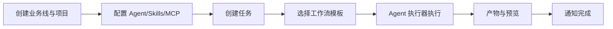

## 3. 范围（Scope）

### 3.1 MVP 范围
| 模块 | 功能点 | 优先级 |
|------|--------|--------|
| 全局配置 | 工作流模板（默认模板）管理 | P0 |
| Skills | Skills 市场与管理（浏览、读取、版本治理） | P1 |
| MCP | MCP 市场与管理（浏览、读取、配置、密钥） | P1 |
| 业务线 | 增删改查与项目归属 | P0 |
| 用户管理 | 增删改查、业务线成员管理、项目权限 | P0 |
| 项目 | 增删改查、Git 地址、项目配置（Agent/Skills/MCP）、项目上下文读取（非 RAG） | P0 |
| 任务 | 创建/详情/执行（手动触发） | P0 |
| 任务体验 | 通知、文件预览、部署预览 | P1 |
| 工作流 | 工作节点串行编排、基础可视化编辑 | P0 |
| Agent 集成与执行器 | 对话展示、统一入口、支持 Codex/Cursor/Claude | P0 |
| 执行与调度 | 触发、队列、并发与超时保护 | P1 |
| 运行时与资源 | 环境规格、隔离与配额 | P1 |
| 权限与身份 | 登录/认证、RBAC | P0 |
| 可观测性 | 状态、指标、告警、结构化日志 | P1 |
| 产物与版本 | 存储、生命周期、版本回溯 | P1 |
| API 与 UI | 核心 API 列表与关键页面 | P0 |

### 3.2 非范围（明确排除）
| 排除项 | 原因 | 后续规划 |
|--------|------|---------|
| 深度 RAG 知识增强 | 技术复杂度高，MVP 先采用项目上下文读取 | Phase 2 |
| 高复杂度编排 DSL | 用户学习成本高，先用可视化编辑 | Phase 3 |
| 全自动 CI/CD 替代 | 定位不同，AINative 聚焦 Agent 任务 | 不规划 |

## 4. 需求合理性与可实现性评估

### 4.1 评估结论
现有需求整体合理、可实现，建议分阶段落地。

| 模块 | 需求合理性 | 可实现性 | 风险等级 | 备注 |
|------|-----------|---------|---------|------|
| 全局配置（模板/市场） | 高 | 高 | 低 | 常见后台配置能力 |
| 业务线管理 | 高 | 高 | 低 | 业务组织模型基础能力 |
| 用户管理与权限 | 高 | 中 | 中 | 需明确 RBAC 边界 |
| 项目管理与配置 | 高 | 高 | 低 | 与 Git 和 Agent 关联清晰 |
| 任务与工作流 | 高 | 中 | 中 | 需明确状态机与重新执行策略 |
| Agent 集成/执行器统一入口 | 高 | 中 | 高 | 多 Agent 适配需规范接口 |
| 执行与调度 | 高 | 中 | 中 | 需要队列与并发治理策略 |
| 运行时与资源隔离 | 高 | 中 | 高 | 容器化可落地，需成本评估 |
| 可观测性与监控 | 高 | 中 | 中 | 依赖日志与指标体系建设 |
| 产物与版本追踪 | 中 | 中 | 中 | 需定义产物元数据与存储方案 |
| API 与 UI | 高 | 高 | 低 | 常规平台开发能力 |

### 4.2 分阶段落地计划


### 4.3 阶段交付目标
| 阶段 | 核心交付 | 验收标准 |
|------|---------|---------|
| 第一阶段 | 项目/任务/工作流/Agent 执行器核心闭环 + 基础权限 | 能完成一个完整任务的创建→执行→产出流程 |
| 第二阶段 | 调度、监控、产物与版本、通知 | 支持并发任务调度，执行过程可观测 |
| 第三阶段 | 市场生态（Skills/MCP）与更高级编排 | Skills/MCP 可读取复用，工作流支持更复杂串行编排 |

## 5. 模块关联关系
### 5.1 关系说明（文本版）
- 用户通过 `business_line_members` 关联业务线（多对多），通过 `project_members` 关联项目（多对多）。
- 业务线包含多个项目；业务线 owner/admin 对其下所有项目有隐式访问权。
- 项目绑定 Git 地址、配置 Agent 执行器（Agent 集成），并从项目读取 Skills/MCP/知识文档上下文。
- 任务归属项目，选择工作流模板；创建时从模板快照生成 N 个有序任务节点（TaskNode）。
- 任务节点（TaskNode）同时承载"节点定义"与"执行状态/结果"，不再维护独立的 WorkflowRun / WorkNodeRun 中间层。
- 任务状态由其所有 TaskNode 的状态聚合计算得出。
- 执行产生产物与日志，进入可观测与通知模块。
- 权限体系贯穿业务线、项目与任务的访问与执行。

### 5.2 关系示意图（Mermaid）
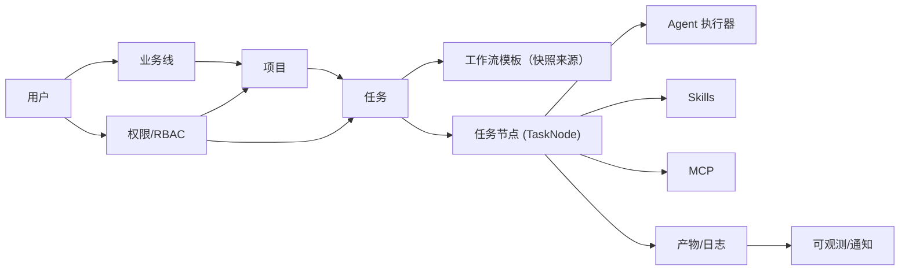

## 6. 逻辑架构设计图（Mermaid）
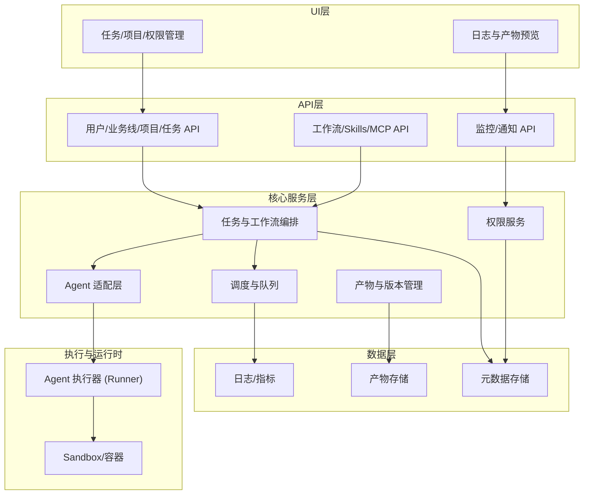

## 7. 功能需求（更清晰拆解）
本节把平台能力按“域/模块”拆解，并用统一结构描述：目标 / 核心对象 / MVP 功能 / 关键规则与边界 / 依赖 / 产出。

### 7.1 身份与权限域（Auth/RBAC）
- 目标：保证平台访问安全、权限可控。
- 核心对象
  - 用户（User）：`uuid` 主键、`username/password/salt`、`nickname/avatar`、`status`、`is_admin`
  - 业务线成员（BusinessLineMember）：用户-业务线-角色绑定（owner/admin/member）
  - 项目成员（ProjectMember）：用户-项目-角色绑定（owner/maintainer/developer/viewer）
- MVP 功能
  1. 登录/认证：账号登录（可扩展 SSO/LDAP），发放 Token/Session。
  2. 用户管理：新增/编辑/禁用/删除（删除建议软删除）。
  3. 业务线成员管理：添加/移除/变更角色；用户可归属多条业务线。
  4. 项目权限：项目成员管理（添加/移除/变更角色）；添加项目成员时校验用户为对应业务线成员或平台管理员。
- 权限继承规则
  - 平台管理员（`is_admin=true`）：拥有全部权限。
  - 业务线 owner/admin：对其下所有项目有隐式访问权，无需逐个加入 `project_members`。
  - 业务线 member：仅表示有资格被加入该业务线下的项目，需显式添加到 `project_members`。
  - 默认最小权限：未授权用户不可见/不可执行；权限变更可追踪。
- 依赖：无（基础域，其他模块全部依赖）。
- 产出：用户/角色/授权数据。

### 7.2 组织与项目域（BusinessLine/Project）
- 目标：为任务执行提供组织结构、代码入口与项目级配置。
- 核心对象：业务线（BusinessLine）、业务线成员（BusinessLineMember）、项目（Project）、项目成员（ProjectMember）、Git 仓库信息。
- MVP 功能
  1. 业务线管理：CRUD；通过 `business_line_members` 管理业务线成员与角色。
  2. 项目管理：CRUD（项目名称、Git 地址、默认分支）；项目归属业务线。
  3. 项目成员与权限：项目级成员管理（依赖 7.1 的 RBAC）。
  4. 项目配置（建议按“配置项组”呈现，降低理解成本）
     - Agent 执行器配置：选择 Agent 适配器（Codex/Cursor/Claude）、运行模式（本地/远程）、权限开关（网络/文件系统）。
     - Skills/MCP 白名单：通过 `projects.config_json` 声明可用 Skills/MCP 与版本约束（不再维护项目安装表）。
     - 资源与并发策略：并发上限、优先级（默认继承全局）。
  5. 项目上下文读取（非 RAG）：从项目仓库读取文档/配置（如 README、`docs/`、SPEC）作为执行上下文。
- 关键规则与边界
  - Git 地址与认证方式必须明确（HTTP(S)/SSH、Token/Key 存储策略）；建议 MVP 先支持一种稳定方案。
- 依赖：身份与权限域（7.1）。
- 产出：项目配置快照（用于任务执行时可复现）；项目上下文快照（来源路径/版本）；任务工具版本快照来源。

### 7.3 资产与市场域（Template/Skills/MCP）
- 目标：沉淀可复用能力（模板、技能、外部工具连接），降低重复劳动并实现治理。
- 核心对象：工作流模板（WorkflowTemplate）、Skill、MCP Connector、版本（Version）。
- MVP 功能
  1. 工作流模板：全局模板 CRUD、启用/禁用、版本；项目选择可用模板集合。
  2. Skills 市场：浏览/搜索/详情；执行时按项目配置或项目仓库声明读取可用 Skills。
  3. MCP 市场：浏览/搜索/详情；执行时按项目配置读取可用 MCP 与参数（含密钥引用）。
- 关键规则与边界
  - 版本锁定：任务运行时必须记录使用的模板/Skill/MCP 版本快照（如 `workflow_template_version`、`tool_versions_snapshot`），保证可复现与可回滚。
  - 使用授权：成员是否能执行某个 Skill/MCP 需要与项目权限联动（避免越权使用高风险工具）。
- 依赖：项目域（7.2）、权限域（7.1）、密钥管理（见第 12.1 节安全要求）。
- 产出：可复用资产目录；项目读取到的能力清单（来自项目配置/仓库）。

### 7.4 任务与工作流域（Task/TaskNode）
- 目标：把"需求"变成可执行的任务节点序列，并能追踪每一步结果与责任边界。
- 核心对象：任务（Task）、任务节点（TaskNode）、工作流模板（WorkflowTemplate）。
- 设计原则（参考极简状态模型）
  - **去除 WorkflowRun / WorkNodeRun 中间层**：任务本身即为一次执行实例，不再维护独立的"运行记录"表。
  - **TaskNode 同时承载"节点定义"与"执行状态/结果"**：每个节点仅一条生命周期记录，不再拆分为"定义表 + 运行表"。
  - **Task 状态由 TaskNode 聚合计算**：`tasks.status` 仅用于列表展示，实际状态由所有 `task_nodes.status` 聚合得出。
  - **conversation 视为"单节点 workflow"**：统一调度逻辑，不区分任务类型。
- MVP 功能
  1. 任务管理
     - 创建任务：标题、描述、验收标准、关联项目、选择模板、可选分支/环境
     - 查询与详情：状态、节点拓扑、日志、产物
  2. 任务节点实例化
     - 从模板快照生成 N 个有序 TaskNode（workflow 模式）或 1 个 TaskNode（conversation 模式）
     - 节点按 `node_order` 顺序执行，同一时刻最多 1 个执行中节点（数据库唯一索引保证）
  3. 节点类型（建议 MVP 最少落地 2 类，便于形成闭环）
     - Agent 执行节点：基于对话/指令执行
     - Skill 执行节点：复用脚本/流程片段
     - MCP 调用节点：调用外部工具/服务（可选）
     - 人工确认节点：发布/合并前拦截（可选）
  4. 任务操作：执行、审批、重新执行（更细状态见第 8 节）。
  5. 工作流模板编辑（基础）：节点增删改、顺序编辑、模板版本发布。
- 关键规则与边界
  - 节点输入输出必须规范化（字段名、类型、是否敏感），否则编排与复用会失控。
  - 任务"验收标准"建议作为结构化字段（可选：Checklist），便于 Agent 更稳定地产出结果。
  - 异常时统一停止等待人工处理（进入 `in_review` 状态），不支持跳过出错节点继续执行。
- 依赖：项目域（7.2）、资产域（7.3）、执行与调度（7.5）、可观测与产物（7.6）。
- 产出：可追踪的执行链路（任务→任务节点→日志/产物）。

### 7.5 执行与调度域（Scheduler/Runtime/Git/Sandbox）
- 目标：可靠、可控地运行工作节点，解决并发、隔离、成本与安全问题。
- 核心对象：执行请求（ExecutionRequest）、队列（Queue）、执行器（Executor）、运行环境（Runtime）、worktree、资源配额（Quota）。
- MVP 功能
  1. 触发方式：手动触发（必须）；定时/事件触发（可选）。
  2. 队列与并发
     - 全局并发上限
     - 项目级并发上限
     - 优先级（紧急/普通/低）与排队策略
     - 超时保护
  3. 运行时与隔离
     - 任务级 sandbox（容器/隔离目录）
     - 资源配额：CPU/内存/磁盘/运行超时
     - 网络访问策略：默认最小化，按项目白名单放开
  4. Git worktree（建议 MVP 默认开启）
     - 每次任务创建独立 worktree
     - 记录 branch/commit 信息
     - 清理策略：成功自动清理；失败保留一段时间用于排障
  5. 异常处理：记录错误并进入 `in_review`；超时进入 `in_review`；支持人工触发重新执行（MVP 可先做“停止并保留现场”）。
- 关键规则与边界
  - sandbox 安全边界必须明确：若不能完全隔离网络/文件系统，需要明确限制并在 UI 提示风险。
- 依赖：项目配置（7.2）、权限（7.1）、Agent 适配（与第 6 节架构一致）。
- 产出：可复现的运行记录（环境、版本、输入输出）；可治理的调度数据。

### 7.6 产物、可观测与通知域（Artifacts/Observability/Notification）
- 目标：让任务结果“看得见、拿得到、追得回”，并及时通知相关人。
- 核心对象：日志流（LogStream）、指标（Metrics）、产物（Artifact）、预览链接（PreviewLink）、通知事件（NotificationEvent）。
- MVP 功能
  1. 日志：流式输出、按工作节点聚合、支持检索与下载。
  2. 产物
     - 文件产物：压缩包/目录/关键文件
     - 代码变更：diff、提交信息
     - 报告类产物：摘要、测试结果、发布说明
  3. 预览
     - 文件预览：diff、文件树
     - 部署预览：产出预览链接/环境地址（可选）
  4. 指标：成功率、耗时、队列长度、资源使用（MVP 可先做基础指标）。
  5. 通知：`done` / `in_review`（需人工介入）；支持邮件/IM/Webhook；支持去重与频率限制。
- 关键规则与边界
  - 产物生命周期（保留期/清理策略/访问控制/是否加密）需要在项目或全局可配置。
- 依赖：执行与调度（7.5）、权限（7.1）、数据层（日志/产物存储）。
- 产出：可观测数据（日志/指标）与可交付产物。

### 7.7 MVP 功能清单（带优先级与依赖）

| 编号 | 功能 | 优先级 | 依赖 | 阶段 |
|------|------|--------|------|------|
| FR-001 | 登录/认证（账号体系） | P0 | - | 1 |
| FR-002 | 用户 CRUD + 禁用/启用 | P0 | FR-001 | 1 |
| FR-003 | 业务线 CRUD + 负责人 | P0 | FR-001 | 1 |
| FR-004 | 项目 CRUD（含 Git 地址/默认分支/归属业务线） | P0 | FR-003 | 1 |
| FR-005 | 项目成员与角色授权 | P0 | FR-002, FR-004 | 1 |
| FR-006 | 项目配置（Agent/Skills/MCP/资源与并发策略） | P0 | FR-004 | 1 |
| FR-007 | 工作流模板 CRUD + 版本 + 项目选择 | P0 | FR-004 | 1 |
| FR-008 | 任务创建（选择模板，填写验收标准） | P0 | FR-004, FR-007 | 1 |
| FR-009 | 任务触发执行（手动）+ 重新执行 | P0 | FR-008 | 1 |
| FR-010 | 工作节点执行（至少支持 Agent 工作节点与日志流式展示） | P0 | FR-009 | 1 |
| FR-011 | 产物列表 + 文件预览（diff/文件树） | P1 | FR-010 | 2 |
| FR-012 | 通知（`done` / `in_review`） | P1 | FR-010 | 2 |
| FR-013 | 队列与并发（基础：全局+项目上限） | P1 | FR-009 | 2 |
| FR-014 | sandbox/worktree（基础隔离 + 清理策略） | P1 | FR-010 | 2 |
| FR-015 | 可观测性（基础指标/检索/告警占位） | P1 | FR-010, FR-013 | 2 |
| FR-016 | Skills 市场（浏览/读取/版本锁定，按项目配置生效） | P1 | FR-004, FR-006 | 3 |
| FR-017 | MCP 市场（浏览/读取/配置，按项目配置生效） | P1 | FR-004, FR-006 | 3 |
| FR-018 | 项目上下文读取（从项目仓库读取文档/配置用于任务上下文） | P1 | FR-004 | 3 |
| FR-019 | 工作流可视化编辑（增强：校验/拖拽/模板发布） | P1 | FR-007 | 3 |

> 说明：FR 编号按当前 MVP 范围连续维护（FR-001~FR-019）；Phase 2/3 新增需求从下一个编号继续递增。

**依赖关系图：**
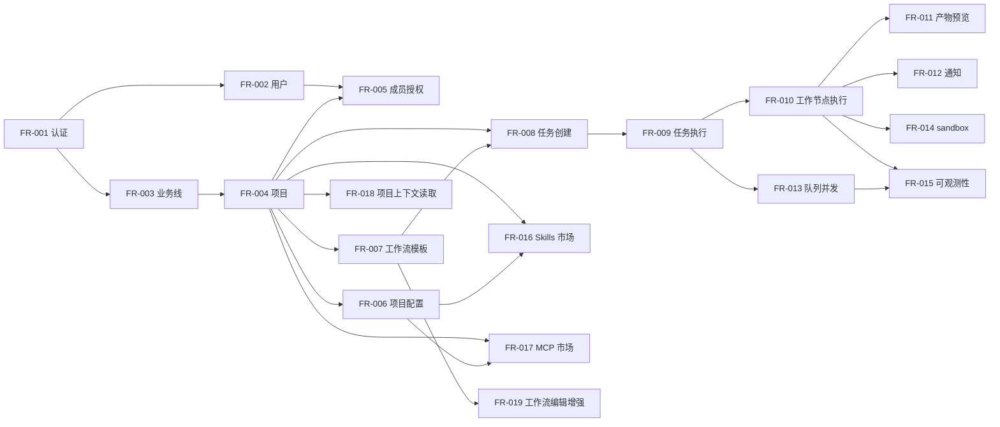

## 8. 状态机与错误分类

### 8.1 设计原则

借鉴极简状态模型，将任务与节点的状态统一为 **4 个核心状态**：`todo` / `in_progress` / `in_review` / `done`，并通过聚合规则从节点状态推导任务状态：

- Task 与 TaskNode 使用完全相同的 4 个状态，状态语义统一。
- Task 状态由 TaskNode 聚合计算，不独立维护。
- 异常时统一进入 `in_review` 等待人工处理，不支持自动跳过。
- 每个任务在数据库层保证"同一时刻最多一个执行中节点"。

### 8.2 TaskNode 状态机（核心）

节点状态：`todo` / `in_progress` / `in_review` / `done`

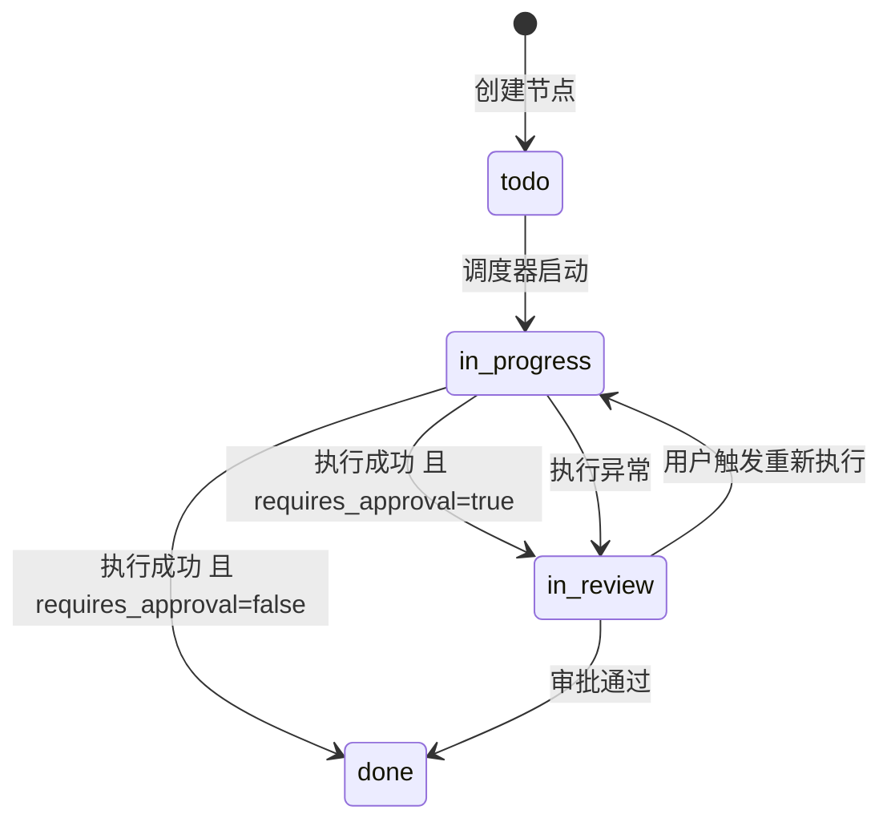


**合法状态转换表：**

| 当前状态 | 目标状态 | 触发条件 |
|---------|---------|---------|
| `todo` | `in_progress` | 调度器启动节点（前置节点已完成） |
| `in_progress` | `done` | 执行成功 且 `requires_approval=false` |
| `in_progress` | `in_review` | 执行成功 且 `requires_approval=true` |
| `in_progress` | `in_review` | 执行异常 |
| `in_review` | `done` | 审批通过 |
| `in_review` | `in_progress` | 用户触发重新执行 |

### 8.3 Task 状态聚合

Task 状态与 TaskNode 状态完全一致：`todo` / `in_progress` / `in_review` / `done`

`tasks.status` 仅用于任务列表与主视图展示，由 `task_nodes.status` 聚合计算：

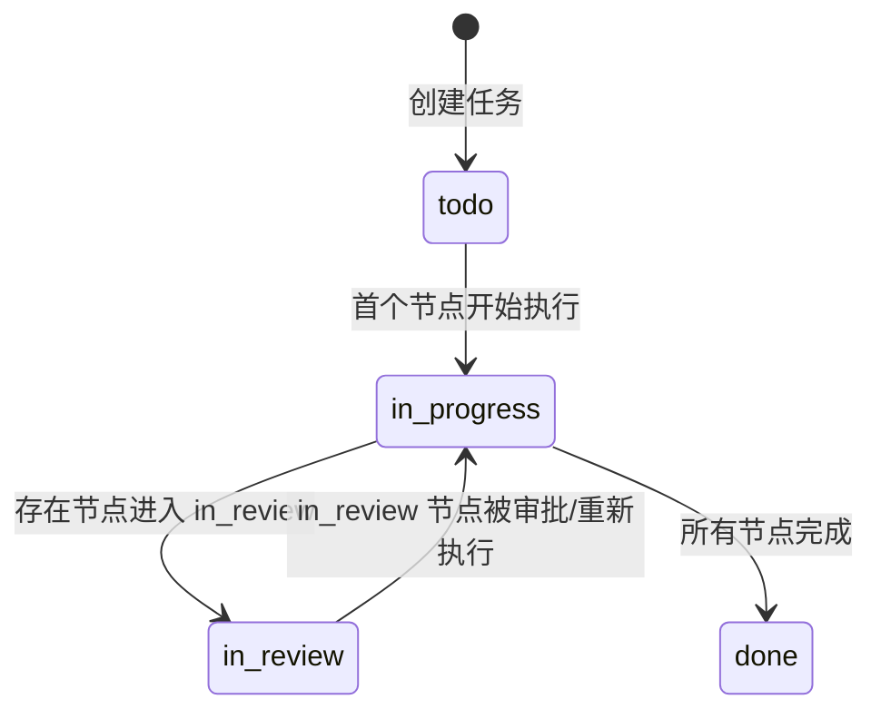

**聚合规则（按优先级从高到低）：**

| 优先级 | 节点状态组合 | Task 状态 |
|-------|------------|----------|
| 1 | 任一节点为 `in_progress` | `in_progress` |
| 2 | 无 `in_progress`，任一节点为 `in_review` | `in_review` |
| 3 | 存在 `done` + 存在 `todo`（无 `in_progress`/`in_review`） | `in_progress` |
| 4 | 全部节点为 `done` | `done` |
| 5 | 全部节点为 `todo` | `todo` |

**聚合 SQL：**
```sql
SELECT
  CASE
    WHEN SUM(CASE WHEN status = 'in_progress' THEN 1 ELSE 0 END) > 0
      THEN 'in_progress'
    WHEN SUM(CASE WHEN status = 'in_review' THEN 1 ELSE 0 END) > 0
      THEN 'in_review'
    WHEN SUM(CASE WHEN status = 'todo' THEN 1 ELSE 0 END) > 0
         AND SUM(CASE WHEN status = 'done' THEN 1 ELSE 0 END) > 0
      THEN 'in_progress'
    WHEN SUM(CASE WHEN status = 'done' THEN 1 ELSE 0 END) = COUNT(*)
         AND COUNT(*) > 0
      THEN 'done'
    WHEN SUM(CASE WHEN status = 'todo' THEN 1 ELSE 0 END) = COUNT(*)
         AND COUNT(*) > 0
      THEN 'todo'
    ELSE 'todo'
  END AS task_status
FROM task_nodes
WHERE task_id = $1;
```

### 8.4 对话模式 / 工作流模式状态机对齐

| 模式 | Node 编排 | Task 状态来源 | 关键行为 |
|------|----------|-------------|---------|
| `conversation` | 固定 1 个节点 | 该节点状态的一一映射 | `todo → in_progress → (in_review) → done` |
| `workflow` | N 个有序节点 | N 个节点按 8.3 聚合 | 节点逐个推进；中间出现 `in_review` 时任务进入 `in_review` |

> `conversation` 被视作"单节点 workflow"，状态推进逻辑完全一致，不再区分两套状态机。

### 8.5 错误分类与处理策略

| 错误类型 | 错误码前缀 | 处理策略 |
|---------|-----------|---------|
| 配置错误 | `CFG_` | 节点进入 `in_review`，提示用户修正配置 |
| 权限错误 | `AUTH_` | 节点进入 `in_review`，提示权限不足 |
| 环境错误 | `ENV_` | 节点进入 `in_review`，等待环境恢复后用户触发重新执行 |
| Agent 错误 | `AGENT_` | 节点进入 `in_review`，用户可触发重新执行 |
| 执行超时 | `TIMEOUT_` | 节点进入 `in_review`，记录超时信息 |
| 未知错误 | `UNKNOWN_` | 节点进入 `in_review`，记录详细日志、告警 |

> 所有异常统一进入 `in_review` 状态等待人工处理，不再区分"可重试/不可重试"。用户在 `in_review` 状态下可选择"审批通过"或"重新执行"。

## 9. 数据模型

> 设计原则：借鉴极简状态模型，去除 WorkflowRun / WorkNodeRun 中间层，用 `tasks` + `task_nodes` 两张核心表承载任务执行全链路。
> 当前 `backend/` 主要是 NestJS boilerplate（已包含 user 等基础实体）。本节为 AINative 目标数据模型。

### 9.1 ER 图

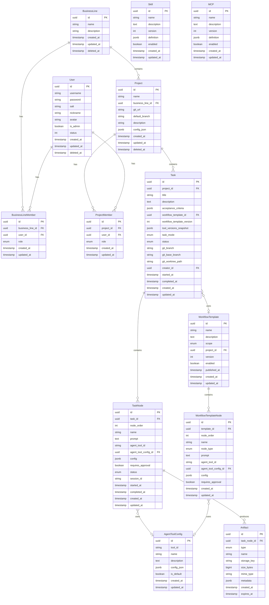

### 9.2 完整 PostgreSQL DDL

> 以下 DDL 以 PostgreSQL 为目标数据库，包含完整的表定义、约束、索引。TypeORM 实体定义应与此 DDL 对齐。

```sql
-- =====================================================
-- 1) 用户（与现有系统对齐）
-- =====================================================
CREATE TABLE "public"."user" (
    "id" uuid NOT NULL DEFAULT gen_random_uuid(),
    "username" varchar NOT NULL,
    "password" varchar,
    "salt" varchar NOT NULL,
    "nickname" varchar,
    "avatar" varchar,
    "is_admin" boolean,
    "status" int4 NOT NULL DEFAULT 1,
    "created_at" timestamptz NOT NULL,
    "updated_at" timestamptz NOT NULL,
    "deleted_at" timestamptz,
    PRIMARY KEY ("id")
);

-- =====================================================
-- 2) 业务线
-- =====================================================
CREATE TABLE business_lines (
  id UUID PRIMARY KEY DEFAULT gen_random_uuid(),
  name VARCHAR(100) NOT NULL,
  description TEXT,
  created_at TIMESTAMPTZ NOT NULL DEFAULT NOW(),
  updated_at TIMESTAMPTZ NOT NULL DEFAULT NOW(),
  deleted_at TIMESTAMPTZ
);

CREATE UNIQUE INDEX uniq_business_lines_name
  ON business_lines(name) WHERE deleted_at IS NULL;

-- =====================================================
-- 3) 项目
-- =====================================================
CREATE TABLE projects (
  id UUID PRIMARY KEY DEFAULT gen_random_uuid(),
  name VARCHAR(200) NOT NULL,
  business_line_id UUID NOT NULL REFERENCES business_lines(id) ON DELETE CASCADE,
  git_url VARCHAR(500),
  default_branch VARCHAR(100) DEFAULT 'main',
  description TEXT,
  config_json JSONB NOT NULL DEFAULT '{}',
  created_at TIMESTAMPTZ NOT NULL DEFAULT NOW(),
  updated_at TIMESTAMPTZ NOT NULL DEFAULT NOW(),
  deleted_at TIMESTAMPTZ
);

CREATE INDEX idx_projects_business_line ON projects(business_line_id);
CREATE INDEX idx_projects_name ON projects(name);
CREATE UNIQUE INDEX uniq_projects_git_url
  ON projects(git_url) WHERE git_url IS NOT NULL AND deleted_at IS NULL;

-- =====================================================
-- 4) 项目成员
-- =====================================================
CREATE TABLE project_members (
  id UUID PRIMARY KEY DEFAULT gen_random_uuid(),
  project_id UUID NOT NULL REFERENCES projects(id) ON DELETE CASCADE,
  user_id UUID NOT NULL REFERENCES "user"(id) ON DELETE CASCADE,
  role VARCHAR(20) NOT NULL
    CHECK (role IN ('owner', 'maintainer', 'developer', 'viewer')),
  created_at TIMESTAMPTZ NOT NULL DEFAULT NOW(),
  updated_at TIMESTAMPTZ NOT NULL DEFAULT NOW(),
  UNIQUE (project_id, user_id)
);

CREATE INDEX idx_project_members_user ON project_members(user_id);

-- =====================================================
-- 5) 业务线成员
-- =====================================================
CREATE TABLE business_line_members (
  id UUID PRIMARY KEY DEFAULT gen_random_uuid(),
  business_line_id UUID NOT NULL REFERENCES business_lines(id) ON DELETE CASCADE,
  user_id UUID NOT NULL REFERENCES "user"(id) ON DELETE CASCADE,
  role VARCHAR(20) NOT NULL
    CHECK (role IN ('owner', 'admin', 'member')),
  created_at TIMESTAMPTZ NOT NULL DEFAULT NOW(),
  updated_at TIMESTAMPTZ NOT NULL DEFAULT NOW(),
  UNIQUE (business_line_id, user_id)
);

CREATE INDEX idx_bl_members_user ON business_line_members(user_id);

-- =====================================================
-- 6) Agent 工具配置
-- =====================================================
CREATE TABLE agent_tool_configs (
  id UUID PRIMARY KEY DEFAULT gen_random_uuid(),
  tool_id VARCHAR(30) NOT NULL
    CHECK (tool_id IN (
      'claude-code', 'cursor-agent', 'codex-cli', 'gemini-cli', 'opencode'
    )),
  name VARCHAR(200) NOT NULL,
  description TEXT,
  config_json JSONB NOT NULL DEFAULT '{}',
  is_default BOOLEAN NOT NULL DEFAULT false,
  created_at TIMESTAMPTZ NOT NULL DEFAULT NOW(),
  updated_at TIMESTAMPTZ NOT NULL DEFAULT NOW()
);

CREATE UNIQUE INDEX uniq_agent_tool_config_name
  ON agent_tool_configs(tool_id, name);
CREATE UNIQUE INDEX uniq_agent_tool_config_default
  ON agent_tool_configs(tool_id) WHERE is_default = true;
CREATE INDEX idx_agent_tool_configs_tool ON agent_tool_configs(tool_id);

-- =====================================================
-- 7) 工作流模板（任务创建时的快照来源）
-- =====================================================
CREATE TABLE workflow_templates (
  id UUID PRIMARY KEY DEFAULT gen_random_uuid(),
  name VARCHAR(200) NOT NULL,
  description TEXT,
  scope VARCHAR(20) NOT NULL DEFAULT 'global'
    CHECK (scope IN ('global', 'project')),
  project_id UUID REFERENCES projects(id) ON DELETE CASCADE,
  version INT NOT NULL DEFAULT 1,
  enabled BOOLEAN NOT NULL DEFAULT true,
  published_at TIMESTAMPTZ,
  created_at TIMESTAMPTZ NOT NULL DEFAULT NOW(),
  updated_at TIMESTAMPTZ NOT NULL DEFAULT NOW()
);

CREATE UNIQUE INDEX uniq_global_template_name
  ON workflow_templates(name, version) WHERE scope = 'global';
CREATE UNIQUE INDEX uniq_project_template_name
  ON workflow_templates(project_id, name, version) WHERE scope = 'project';
CREATE INDEX idx_workflow_templates_scope_name_enabled
  ON workflow_templates(scope, name, enabled);

-- =====================================================
-- 8) 工作流模板节点
-- =====================================================
CREATE TABLE workflow_template_nodes (
  id UUID PRIMARY KEY DEFAULT gen_random_uuid(),
  template_id UUID NOT NULL REFERENCES workflow_templates(id) ON DELETE CASCADE,
  node_order INT NOT NULL CHECK (node_order >= 1),
  name VARCHAR(200) NOT NULL,
  node_type VARCHAR(30) NOT NULL
    CHECK (node_type IN ('agent', 'skill', 'mcp', 'human_review')),
  prompt TEXT NOT NULL,
  agent_tool_id VARCHAR(30)
    CHECK (agent_tool_id IS NULL OR agent_tool_id IN (
      'claude-code', 'cursor-agent', 'codex-cli', 'gemini-cli', 'opencode'
    )),
  agent_tool_config_id UUID REFERENCES agent_tool_configs(id) ON DELETE SET NULL,
  config JSONB DEFAULT '{}',
  requires_approval BOOLEAN NOT NULL DEFAULT false,
  created_at TIMESTAMPTZ NOT NULL DEFAULT NOW(),
  updated_at TIMESTAMPTZ NOT NULL DEFAULT NOW(),
  UNIQUE (template_id, node_order)
);

CREATE INDEX idx_wf_template_nodes_template ON workflow_template_nodes(template_id);

-- =====================================================
-- 9) 任务（吸收原 WorkflowRun，成为执行实例）
-- =====================================================
CREATE TABLE tasks (
  id UUID PRIMARY KEY DEFAULT gen_random_uuid(),
  project_id UUID NOT NULL REFERENCES projects(id) ON DELETE CASCADE,
  title VARCHAR(500) NOT NULL,
  description TEXT,

  acceptance_criteria JSONB NOT NULL DEFAULT '{}',

  workflow_template_id UUID REFERENCES workflow_templates(id) ON DELETE SET NULL,
  workflow_template_version INT,
  tool_versions_snapshot JSONB NOT NULL DEFAULT '{}',

  task_mode VARCHAR(20) NOT NULL DEFAULT 'workflow'
    CHECK (task_mode IN ('conversation', 'workflow')),
  status VARCHAR(20) NOT NULL DEFAULT 'todo'
    CHECK (status IN ('todo', 'in_progress', 'in_review', 'done')),

  git_branch VARCHAR(200),
  git_base_branch VARCHAR(200),
  git_worktree_path VARCHAR(500),

  creator_id UUID NOT NULL REFERENCES "user"(id),

  -- 以下字段由 task_nodes 聚合计算
  started_at TIMESTAMPTZ,
  completed_at TIMESTAMPTZ,

  created_at TIMESTAMPTZ NOT NULL DEFAULT NOW(),
  updated_at TIMESTAMPTZ NOT NULL DEFAULT NOW()
);

CREATE INDEX idx_tasks_project ON tasks(project_id);
CREATE INDEX idx_tasks_status ON tasks(status);
CREATE INDEX idx_tasks_project_status ON tasks(project_id, status);
CREATE INDEX idx_tasks_created_at ON tasks(created_at DESC);
CREATE INDEX idx_tasks_creator ON tasks(creator_id);

CREATE UNIQUE INDEX uniq_tasks_git_worktree_path
  ON tasks(git_worktree_path) WHERE git_worktree_path IS NOT NULL;
CREATE UNIQUE INDEX uniq_tasks_project_git_branch
  ON tasks(project_id, git_branch)
  WHERE git_branch IS NOT NULL;

-- =====================================================
-- 10) 任务节点（核心：节点定义 + 执行状态 + 执行结果）
-- =====================================================
CREATE TABLE task_nodes (
  id UUID PRIMARY KEY DEFAULT gen_random_uuid(),
  task_id UUID NOT NULL REFERENCES tasks(id) ON DELETE CASCADE,

  node_order INT NOT NULL CHECK (node_order >= 1),
  name VARCHAR(200) NOT NULL,
  prompt TEXT NOT NULL,

  agent_tool_id VARCHAR(30)
    CHECK (agent_tool_id IS NULL OR agent_tool_id IN (
      'claude-code', 'cursor-agent', 'codex-cli', 'gemini-cli', 'opencode'
    )),
  agent_tool_config_id UUID REFERENCES agent_tool_configs(id) ON DELETE SET NULL,
  config JSONB DEFAULT '{}',
  requires_approval BOOLEAN NOT NULL DEFAULT false,

  status VARCHAR(20) NOT NULL DEFAULT 'todo'
    CHECK (status IN ('todo', 'in_progress', 'in_review', 'done')),

  session_id VARCHAR(100),

  started_at TIMESTAMPTZ,
  completed_at TIMESTAMPTZ,
  created_at TIMESTAMPTZ NOT NULL DEFAULT NOW(),
  updated_at TIMESTAMPTZ NOT NULL DEFAULT NOW(),

  UNIQUE (task_id, node_order)
);

CREATE INDEX idx_task_nodes_task ON task_nodes(task_id);
CREATE INDEX idx_task_nodes_status ON task_nodes(status);
CREATE INDEX idx_task_nodes_task_status_order
  ON task_nodes(task_id, status, node_order);
CREATE INDEX idx_task_nodes_session ON task_nodes(session_id)
  WHERE session_id IS NOT NULL;

-- 同一 task 同一时刻最多 1 个执行中的节点
CREATE UNIQUE INDEX uniq_task_nodes_single_in_progress
  ON task_nodes(task_id)
  WHERE status = 'in_progress';

-- =====================================================
-- 11) 产物
-- =====================================================
CREATE TABLE artifacts (
  id UUID PRIMARY KEY DEFAULT gen_random_uuid(),
  task_node_id UUID NOT NULL REFERENCES task_nodes(id) ON DELETE CASCADE,
  type VARCHAR(30) NOT NULL
    CHECK (type IN ('file', 'diff', 'report', 'preview_link', 'archive')),
  name VARCHAR(500) NOT NULL,
  storage_key VARCHAR(500),
  size_bytes BIGINT,
  mime_type VARCHAR(100),
  metadata JSONB DEFAULT '{}',
  created_at TIMESTAMPTZ NOT NULL DEFAULT NOW(),
  expires_at TIMESTAMPTZ
);

CREATE INDEX idx_artifacts_task_node ON artifacts(task_node_id);
CREATE INDEX idx_artifacts_expires ON artifacts(expires_at)
  WHERE expires_at IS NOT NULL;

-- =====================================================
-- 12) Skills 市场
-- =====================================================
CREATE TABLE skills (
  id UUID PRIMARY KEY DEFAULT gen_random_uuid(),
  name VARCHAR(200) NOT NULL,
  description TEXT,
  version INT NOT NULL DEFAULT 1,
  definition JSONB NOT NULL,
  enabled BOOLEAN NOT NULL DEFAULT true,
  created_at TIMESTAMPTZ NOT NULL DEFAULT NOW(),
  updated_at TIMESTAMPTZ NOT NULL DEFAULT NOW()
);

CREATE UNIQUE INDEX uniq_skills_name_version
  ON skills(name, version);
CREATE INDEX idx_skills_name_enabled
  ON skills(name, enabled);

-- =====================================================
-- 13) MCP 市场
-- =====================================================
CREATE TABLE mcps (
  id UUID PRIMARY KEY DEFAULT gen_random_uuid(),
  name VARCHAR(200) NOT NULL,
  description TEXT,
  version INT NOT NULL DEFAULT 1,
  definition JSONB NOT NULL,
  enabled BOOLEAN NOT NULL DEFAULT true,
  created_at TIMESTAMPTZ NOT NULL DEFAULT NOW(),
  updated_at TIMESTAMPTZ NOT NULL DEFAULT NOW()
);

CREATE UNIQUE INDEX uniq_mcps_name_version
  ON mcps(name, version);
CREATE INDEX idx_mcps_name_enabled
  ON mcps(name, enabled);

-- =====================================================
-- 14) 其他扩展表（预留）
-- =====================================================
```

### 9.3 Task 聚合更新逻辑

每次 `task_nodes` 状态变更时，由 `TaskService` 统一刷新 `tasks` 的聚合字段：

```sql
UPDATE tasks SET
  started_at    = (SELECT MIN(started_at)  FROM task_nodes WHERE task_id = $1 AND started_at IS NOT NULL),
  completed_at  = (SELECT MAX(completed_at) FROM task_nodes WHERE task_id = $1 AND completed_at IS NOT NULL),
  status = (
    SELECT CASE
      WHEN SUM(CASE WHEN status = 'in_progress' THEN 1 ELSE 0 END) > 0 THEN 'in_progress'
      WHEN SUM(CASE WHEN status = 'in_review' THEN 1 ELSE 0 END) > 0 THEN 'in_review'
      WHEN SUM(CASE WHEN status = 'todo' THEN 1 ELSE 0 END) > 0
           AND SUM(CASE WHEN status = 'done' THEN 1 ELSE 0 END) > 0 THEN 'in_progress'
      WHEN SUM(CASE WHEN status = 'done' THEN 1 ELSE 0 END) = COUNT(*) THEN 'done'
      ELSE 'todo'
    END
    FROM task_nodes WHERE task_id = $1
  ),
  updated_at = NOW()
WHERE id = $1;
```

### 9.4 执行流程

#### 9.4.1 创建任务

**conversation 模式：**
1. 创建 `tasks`（`task_mode='conversation'`, `status='todo'`）
2. 插入 1 条 `task_nodes`（`node_order=1`, `name='Conversation'`, `prompt=tasks.description`）

**workflow 模式：**
1. 创建 `tasks`（`task_mode='workflow'`, `status='todo'`）
2. 从模板快照插入 N 条 `task_nodes`

#### 9.4.2 调度下一节点

```sql
SELECT * FROM task_nodes
WHERE task_id = $1 AND status = 'todo'
ORDER BY node_order ASC
LIMIT 1;
```

在事务中：
1. `UPDATE task_nodes SET status='in_progress', session_id=$2, started_at=NOW(), updated_at=NOW() WHERE id=$3 AND status='todo'`
2. 聚合刷新 `tasks`

#### 9.4.3 节点完成/异常

**成功完成：**
1. 按 `requires_approval` 更新状态：`false` → `done`，`true` → `in_review`
2. 回填 `completed_at`
3. 若当前节点变为 `done`，继续调度下一 `todo` 节点
4. 聚合更新 `tasks`

**执行异常：**
1. `task_nodes.status = 'in_review'`
2. 停止在当前节点，等待人工处理
3. 聚合更新 `tasks`

#### 9.4.4 审批与重新执行

**审批通过：**
```sql
UPDATE task_nodes SET status='done', updated_at=NOW()
WHERE id = $1 AND status = 'in_review';
```

**重新执行：**
```sql
UPDATE task_nodes SET
  status = 'in_progress',
  completed_at = NULL,
  session_id = $2, updated_at = NOW()
WHERE id = $1 AND status = 'in_review';
```

### 9.5 常用查询

#### 任务进度
```sql
SELECT
  SUM(CASE WHEN status = 'done' THEN 1 ELSE 0 END) AS finished,
  SUM(CASE WHEN status = 'in_progress' THEN 1 ELSE 0 END) AS running,
  SUM(CASE WHEN status = 'in_review' THEN 1 ELSE 0 END) AS reviewing,
  SUM(CASE WHEN status = 'todo' THEN 1 ELSE 0 END) AS pending,
  COUNT(*) AS total
FROM task_nodes WHERE task_id = $1;
```

#### 当前活跃节点
```sql
SELECT * FROM task_nodes
WHERE task_id = $1
  AND status IN ('in_progress', 'in_review', 'todo')
ORDER BY
  CASE status WHEN 'in_progress' THEN 1 WHEN 'in_review' THEN 2 ELSE 3 END,
  node_order ASC
LIMIT 1;
```

### 9.6 与旧模型对比

| 操作 | 旧模型 | 新模型 | 说明 |
|------|-------|-------|------|
| 删除 | WorkflowRun | - | 任务本身即为执行实例 |
| 删除 | WorkNodeRun | - | 被 TaskNode 替代 |
| 新增 | - | task_nodes | 统一节点定义 + 执行状态 |
| 简化 | Task(10 种状态) | Task(4 种状态) | todo/in_progress/in_review/done |
| 简化 | WorkNode(6 种状态) | TaskNode(4 种状态) | todo/in_progress/in_review/done |
| 保留 | WorkflowTemplate | WorkflowTemplate | 仅作为创建任务时的快照来源 |

### 9.7 核心实体索引汇总

| 实体 | 核心字段 | PostgreSQL 索引 |
|------|---------|----------------|
| User | id(uuid), username, status, is_admin | `PRIMARY KEY(id)` |
| BusinessLine | id, name | `UNIQUE(name) WHERE deleted_at IS NULL` |
| Project | id, name, business_line_id, git_url, config_json | `INDEX(business_line_id)`, `UNIQUE(git_url)` |
| ProjectMember | id, project_id, user_id, role | `UNIQUE(project_id, user_id)`, `INDEX(user_id)` |
| BusinessLineMember | id, business_line_id, user_id, role | `UNIQUE(business_line_id, user_id)`, `INDEX(user_id)` |
| WorkflowTemplate | id, scope, name, version, enabled | `UNIQUE(name,version)@global`, `UNIQUE(project_id,name,version)@project`, `INDEX(scope,name,enabled)` |
| Task | id, project_id, status, creator_id, workflow_template_version | `INDEX(project_id, status)`, `INDEX(created_at DESC)` |
| TaskNode | id, task_id, node_order, status | `UNIQUE(task_id, node_order)`, `UNIQUE(task_id) WHERE status='in_progress'` |
| Artifact | id, task_node_id, type | `INDEX(task_node_id)`, `INDEX(expires_at)` |
| Skill | id, name, version, enabled | `UNIQUE(name,version)`, `INDEX(name,enabled)` |
| MCP | id, name, version, enabled | `UNIQUE(name,version)`, `INDEX(name,enabled)` |

### 9.8 数据库迁移

使用 TypeORM 迁移管理数据库变更：

```bash
cd backend

# 生成迁移
npm run migration:generate -- -n CreateAINativeTables

# 运行迁移
npm run migration:run

# 回滚迁移
npm run migration:revert
```

### 9.9 权限矩阵

| 权限范围 | 平台管理员 | BL owner | BL admin | BL member | 项目 owner | 项目 maintainer | 项目 developer | 项目 viewer |
|---------|-----------|----------|----------|-----------|-----------|----------------|---------------|------------|
| 全局配置/市场 | ✅ | ❌ | ❌ | ❌ | ❌ | ❌ | ❌ | ❌ |
| 业务线管理 | ✅ | ✅(所属) | ❌ | ❌ | ❌ | ❌ | ❌ | ❌ |
| 业务线成员管理 | ✅ | ✅(所属) | ✅(所属) | ❌ | ❌ | ❌ | ❌ | ❌ |
| 项目 CRUD | ✅ | ✅(所属BL) | ✅(所属BL) | ❌ | ✅(所属) | ❌ | ❌ | ❌ |
| 项目配置 | ✅ | ✅(所属BL) | ✅(所属BL) | ❌ | ✅(所属) | ✅(所属) | ❌ | ❌ |
| 项目成员管理 | ✅ | ✅(所属BL) | ✅(所属BL) | ❌ | ✅(所属) | ❌ | ❌ | ❌ |
| 任务创建/执行 | ✅ | ✅(所属BL) | ✅(所属BL) | ❌ | ✅ | ✅ | ✅ | ❌ |
| 产物查看 | ✅ | ✅(所属BL) | ✅(所属BL) | ❌ | ✅ | ✅ | ✅ | ✅ |
| 用户管理 | ✅ | ❌ | ❌ | ❌ | ❌ | ❌ | ❌ | ❌ |

> **权限继承**：BL owner/admin 对其业务线下所有项目拥有隐式权限，无需逐个加入 `project_members`。BL member 仅表示有资格被加入该 BL 下的项目。

## 10. 技术架构与选型

### 10.1 技术选型（基于当前项目）

本项目为 **Monorepo-style** 目录结构（`frontend/` + `backend/`），前后端分离（当前依赖安装与脚本运行按目录独立进行），技术栈如下：

#### 前端技术栈
| 类别 | 技术 | 版本 | 说明 |
|------|------|------|------|
| 核心框架 | Vue 3 | 3.5.x | Composition API + `<script setup>` |
| 类型系统 | TypeScript | 5.9.x | 完整类型支持 |
| 构建工具 | Vite | 7.x | 快速热更新、ESM 原生支持 |
| 路由 | Vue Router | 5.x | 官方路由，支持代码分割 |
| 状态管理 | Pinia | 3.x | Vue 3 官方推荐 |
| CSS 方案 | Tailwind CSS | 4.x | 原子化 CSS + 自定义主题系统 |
| 单元测试 | Vitest | 4.x | Vite 原生支持 |
| E2E 测试 | Playwright | 1.58.x | 跨浏览器自动化测试 |
| 代码规范 | ESLint + Prettier | - | 代码质量与格式化 |

#### 后端技术栈
| 类别 | 技术 | 版本 | 说明 |
|------|------|------|------|
| 核心框架 | NestJS | 11.x | 企业级 Node.js 框架，模块化架构 |
| 类型系统 | TypeScript | 5.9.x | 与前端统一 |
| ORM | TypeORM | 0.3.x | 支持迁移、关系映射 |
| 数据库 | PostgreSQL | - | 关系型数据库，JSON 支持好 |
| 认证 | Passport + JWT | - | 无状态认证，支持多策略 |
| API 文档 | Swagger | - | OpenAPI 3.0 自动生成 |
| 文件存储 | AWS S3 | - | 产物存储，支持预签名 URL |
| 数据验证 | class-validator | - | 装饰器风格的 DTO 验证 |
| 邮件 | Nodemailer | - | 通知邮件发送 |
| 国际化 | nestjs-i18n | - | 多语言支持 |

#### 现有代码可复用点（结合当前仓库）
- `backend/` 已包含基础模块：认证（`backend/src/auth`）、用户（`backend/src/users`）、角色/状态（`backend/src/roles`、`backend/src/statuses`）、会话（`backend/src/session`）、邮件（`backend/src/mail`、`backend/src/mailer`）、文件存储（`backend/src/files`）。
- 对应需求映射：FR-001/FR-002 可直接在现有实现上扩展；产物/附件能力可复用 Files 模块的 S3 上传与预签名 URL；通知可复用 Mail/Mailer。

#### 基础设施
| 类别 | 技术 | 说明 |
|------|------|------|
| 容器化 | Docker + Docker Compose | 开发与部署环境一致 |
| 包管理 | pnpm（frontend）/ npm（backend，现状） | 当前按目录独立安装依赖；可后续统一为 pnpm workspace |
| Git Hooks | Husky + Commitlint | 提交规范与自动检查 |
| 代码生成 | Hygen | 模块/组件脚手架 |

### 10.2 系统架构图
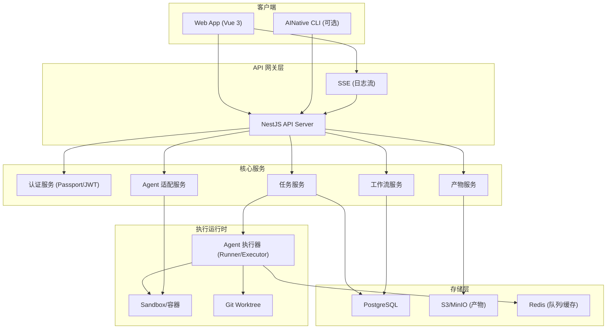

> 说明：Redis 在当前 `backend/docker-compose.yaml` 中为可选项（默认注释），主要用于队列/缓存（第二阶段能力）。

### 10.2.1 执行拓扑与进程边界（API vs Runner）
本项目的核心难点不在 CRUD，而在“长时间运行的任务执行”如何与 API 服务解耦。建议在架构上明确两类进程（或服务）：

| 模块/能力 | 建议归属 | 主要职责 | 备注 |
|---|---|---|---|
| 认证/RBAC | API Server | 登录、鉴权、授权 | 当前 `backend/` 已具备雏形 |
| 业务元数据（业务线/项目/任务/模板） | API Server | CRUD、状态机流转、权限校验 | 任务执行只写“请求”，不做重活 |
| 调度与队列 | API Server（+ Redis 可选） | 入队、并发控制、重新执行/超时策略 | MVP 可先不引入 Redis，后续再加 |
| Agent 执行器（Runner/Executor） | Runner | 创建 sandbox/worktree、拉起外部 Agent CLI、采集日志/产物 | **长耗时/高资源消耗**，应与 API 解耦 |
| Agent 适配层（Codex/Cursor/Claude） | Runner | 将不同 Agent 的调用方式统一为一个接口 | 可与 Runner 同进程/同容器 |
| 产物上传与预览 | Runner（上传）+ API（鉴权/签名） | Runner 产出并上传；API 负责权限与下载签名 | 可复用 `backend/src/files` |
| 日志流（SSE） | API Server | 向 Web 推送任务日志/状态 | 多实例时需要跨进程日志通道（后续） |

MVP 的折中方案（可行，但要写清楚限制）：
- 第一阶段可以先把 Runner 以内嵌模块的形式跑在 API 进程里（便于快速 demo），但需要明确限制：
  - API 进程会被长任务占用（影响 P99）
  - 无法水平扩展
  - 多任务并发/隔离能力有限

### 10.2.2 部署架构（建议输出多套方案）
#### 方案 A（第一阶段 Demo）：单体 API + 内嵌 Runner
适用于快速验证闭环（创建任务 → 执行 → 产物/日志），不建议长期演进使用。

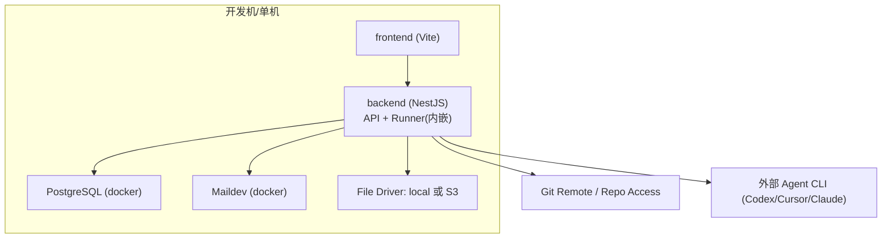

#### 方案 B（推荐演进）：API + Runner Worker（可选 Redis）
适用于并发、隔离、稳定性要求更高的场景；与“第二阶段调度/队列”天然对齐。

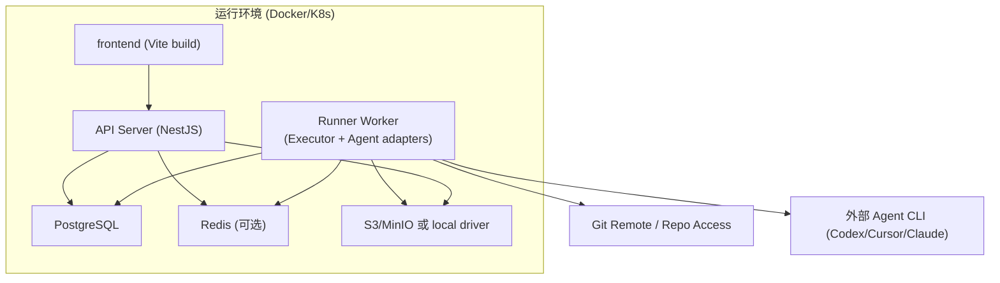

#### 方案 C（最快落地）：AINative CLI 拉取任务，在开发机执行（Pull Runner）
适用于“任务执行依赖本地代码仓库/本地凭据”的场景：平台负责任务管理、权限、产物汇总；执行由运行在开发机的 AINative CLI 完成。

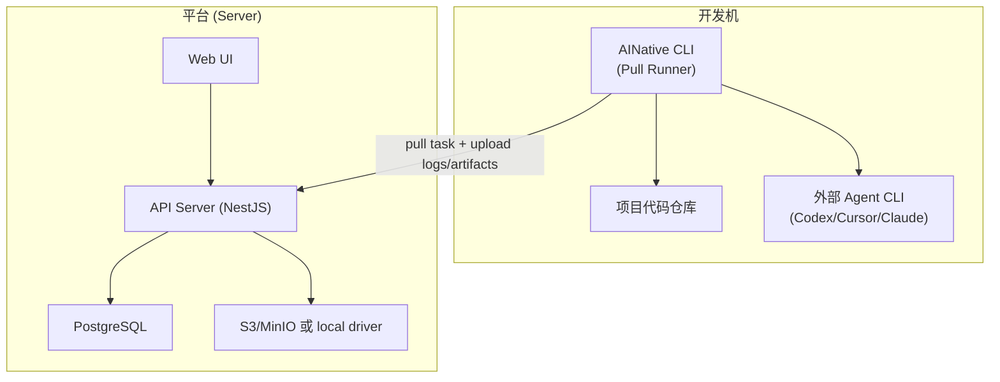

### 10.2.3 推荐路线（结合当前仓库现状）
- 第一阶段（建议二选一，取决于你的执行场景）：
  - 方案 A：更像“平台托管执行”，便于统一治理，但需要平台侧拿到 Git/密钥/运行环境。
  - 方案 C：更像“Agent CLI 作为执行工作节点”，最快落地，天然利用开发机上的仓库与凭据。
  - 无论选哪种，都建议把 Runner 接口、日志通道、产物上传接口先抽象出来，方便第二阶段迁移。
- 第二阶段：引入 Redis 队列与独立 Runner Worker（方案 B），把长任务完全从 API 进程剥离出来，并补齐并发、重新执行、资源配额等治理能力。

### 10.3 Agent 适配层设计
> 说明：当前仓库尚未实现独立的 Agent 模块与 Runner Worker；本节为 AINative 规划设计（建议新增 `backend/src/agent` 等模块）。
> 第一阶段可先用“内嵌 Runner”跑通闭环，第二阶段再拆分为独立 Worker（见 10.2.3）。

基于 NestJS 的模块化架构，Agent 适配层采用**策略模式**实现：

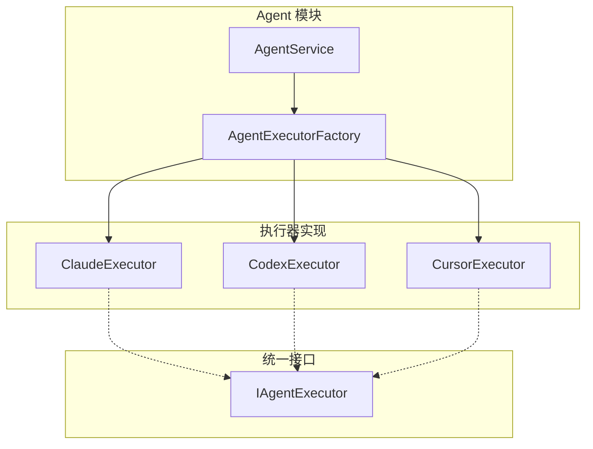

**统一接口定义（TypeScript）：**
```typescript
// backend/src/agent/interfaces/agent-executor.interface.ts

export interface ExecuteRequest {
  prompt: string;                    // 执行指令
  context: Record<string, any>;      // 上下文变量
  workDir: string;                   // 工作目录
  timeout: number;                   // 超时时间（ms）
  permissions: AgentPermissions;     // 权限配置
}

export interface ExecuteResult {
  status: 'done' | 'in_review';
  output: string;                    // 执行输出
  artifacts: ArtifactRef[];          // 产物引用
  metrics: ExecutionMetrics;         // 执行指标
}

export interface IAgentExecutor {
  execute(request: ExecuteRequest): Promise<ExecuteResult>;
  streamOutput(callback: (chunk: string) => void): void;
  getStatus(): Promise<AgentStatus>;
}

export interface AgentPermissions {
  allowNetwork: boolean;             // 允许网络访问
  allowFileSystem: boolean;          // 允许文件系统访问
  allowShell: boolean;               // 允许执行 Shell 命令
  networkWhitelist?: string[];       // 网络白名单
}
```

**NestJS 模块结构：**
```typescript
// backend/src/agent/agent.module.ts

@Module({
  imports: [ConfigModule, HttpModule],
  providers: [
    AgentService,
    AgentExecutorFactory,
    ClaudeExecutor,
    CodexExecutor,
    CursorExecutor,
  ],
  exports: [AgentService],
})
export class AgentModule {}
```

### 10.4 数据库设计

> 完整 DDL 与 ER 图见第 9 节。本节补充 TypeORM 实体与 Service 层的实现建议。

#### 10.4.1 核心实体与 Service 方法

基于新模型（`tasks` + `task_nodes`），需要实现以下核心 Service 方法：

| 方法 | 职责 |
|------|------|
| `createTask(dto)` | 创建任务（todo 状态），同时生成 TaskNode |
| `createTaskNodesFromTemplate(taskId, workflowTemplateId)` | 从工作流模板创建节点 |
| `createConversationNode(taskId, prompt, config)` | 创建单节点（conversation 模式） |
| `startNextTaskNode(taskId)` | 调度下一个 todo 节点 |
| `completeTaskNode(nodeId, result)` | 节点执行完成 |
| `markTaskNodeReview(nodeId, error)` | 节点执行异常，进入 in_review |
| `approveTaskNode(nodeId)` | 审批通过 |
| `rerunTaskNode(nodeId, sessionId)` | 重新执行 in_review 节点 |
| `syncTaskStatus(taskId)` | 聚合更新 task 状态和指标 |

#### 10.4.2 状态推进原则

- 所有状态变更必须在事务内完成（节点状态 + task 聚合）。
- 并发控制依赖 `uniq_task_nodes_single_in_progress` 唯一索引。
- 每次节点状态变更后，必须调用 `syncTaskStatus()` 刷新 task 聚合字段。
- 非法状态转换应在 Service 层抛出错误。

#### 10.4.3 TypeORM 实体示例（Task）

```typescript
// backend/src/tasks/infrastructure/persistence/relational/entities/task.entity.ts

export enum TaskStatus {
  TODO = 'todo',
  IN_PROGRESS = 'in_progress',
  IN_REVIEW = 'in_review',
  DONE = 'done',
}

export enum TaskMode {
  CONVERSATION = 'conversation',
  WORKFLOW = 'workflow',
}

@Entity({ name: 'tasks' })
export class TaskEntity extends EntityRelationalHelper {
  @PrimaryGeneratedColumn('uuid')
  id: string;

  @Column()
  title: string;

  @Column('text', { nullable: true })
  description: string | null;

  @Column({ type: 'enum', enum: TaskMode, default: TaskMode.WORKFLOW })
  taskMode: TaskMode;

  @Column({ type: 'enum', enum: TaskStatus, default: TaskStatus.TODO })
  status: TaskStatus;

  @Column({ nullable: true })
  gitBranch: string | null;

  @ManyToOne(() => ProjectEntity, { onDelete: 'CASCADE' })
  @JoinColumn({ name: 'project_id' })
  project: ProjectEntity;

  @ManyToOne(() => WorkflowTemplateEntity, { nullable: true, onDelete: 'SET NULL' })
  @JoinColumn({ name: 'workflow_template_id' })
  template: WorkflowTemplateEntity | null;

  @OneToMany(() => TaskNodeEntity, (node) => node.task, { cascade: true })
  taskNodes: TaskNodeEntity[];

  @Column({ nullable: true })
  startedAt: Date | null;

  @Column({ nullable: true })
  completedAt: Date | null;

  @CreateDateColumn()
  createdAt: Date;

  @UpdateDateColumn()
  updatedAt: Date;
}
```

### 10.5 前端架构

建议演进为如下模块化目录结构（当前 `frontend/src/` 仍是脚手架模板结构）：

```
frontend/src/
├── App.vue                      # 根组件
├── main.ts                      # 应用入口
├── assets/                      # 静态资源
│   ├── main.css                # Tailwind 入口
│   └── theme.css               # 主题变量
├── components/                  # 通用组件
│   ├── ui/                     # 基础 UI 组件
│   └── business/               # 业务组件
├── composables/                 # 组合式函数
│   ├── useAuth.ts
│   ├── useTask.ts
│   └── useTaskStream.ts
├── layouts/                     # 布局组件
│   └── AppShell.vue
├── modules/                     # 功能模块
│   ├── auth/                   # 认证模块
│   ├── project/                # 项目管理
│   ├── task/                   # 任务管理
│   ├── workflow/               # 工作流
│   └── settings/               # 设置
├── router/                      # 路由配置
├── stores/                      # Pinia 状态
│   ├── auth.ts
│   ├── project.ts
│   └── task.ts
├── services/                    # API 服务
│   └── api.ts
└── types/                       # 类型定义
```

### 10.6 实时日志流方案

使用 **Server-Sent Events (SSE)** 实现任务执行日志的实时推送：

**后端实现（NestJS）：**
```typescript
// backend/src/tasks/task.controller.ts

@Controller('tasks')
export class TaskController {
  @Get(':taskId/stream')
  @Sse()
  streamLogs(@Param('taskId') taskId: string): Observable<MessageEvent> {
    return this.taskService.getLogStream(taskId).pipe(
      map((log) => ({
        data: JSON.stringify(log),
        type: log.type, // 'status' | 'log' | 'artifact' | 'done'
      })),
    );
  }
}
```

**前端实现（Vue 3）：**
```typescript
// frontend/src/composables/useTaskStream.ts

export function useTaskStream(taskId: string) {
  const logs = ref<LogEntry[]>([]);
  const status = ref<TaskStatus>('todo');

  const connect = () => {
    // Web UI 建议使用 Cookie 认证；跨域时需要后端开启 CORS credentials 支持
    const eventSource = new EventSource(`/api/v1/tasks/${taskId}/stream`, {
      withCredentials: true,
    });

    eventSource.addEventListener('log', (e) => {
      logs.value.push(JSON.parse(e.data));
    });

    eventSource.addEventListener('status', (e) => {
      status.value = JSON.parse(e.data).status;
    });

    eventSource.addEventListener('done', () => {
      eventSource.close();
    });

    return eventSource;
  };

  return { logs, status, connect };
}
```

## 11. API 设计
> 说明：当前 `backend/` 已实现认证/用户/文件等基础能力；本章的 business-lines/projects/tasks/workflows 等接口为 AINative 目标 API 设计，需要后续新增控制器与服务实现。

### 11.1 RESTful 资源路径

基于 NestJS 控制器的 API 设计：

| 模块 | 方法 | 路径 | 说明 |
|------|------|------|------|
| **认证** | POST | /api/v1/auth/login | 用户登录（账号密码） |
| | POST | /api/v1/auth/refresh | 刷新 Access Token |
| | POST | /api/v1/auth/logout | 用户登出 |
| | GET | /api/v1/auth/me | 获取当前用户 |
| **用户** | GET | /api/v1/users | 用户列表 |
| | POST | /api/v1/users | 创建用户 |
| | GET | /api/v1/users/:userId | 用户详情 |
| | PATCH | /api/v1/users/:userId | 更新用户 |
| | DELETE | /api/v1/users/:userId | 删除用户（软删除） |
| **业务线** | GET | /api/v1/business-lines | 业务线列表 |
| | POST | /api/v1/business-lines | 创建业务线 |
| | GET | /api/v1/business-lines/:businessLineId | 业务线详情 |
| | PATCH | /api/v1/business-lines/:businessLineId | 更新业务线 |
| | DELETE | /api/v1/business-lines/:businessLineId | 删除业务线（软删除） |
| | GET | /api/v1/business-lines/:businessLineId/members | 业务线成员列表 |
| | POST | /api/v1/business-lines/:businessLineId/members | 添加业务线成员 |
| | PATCH | /api/v1/business-lines/:businessLineId/members/:userId | 更新业务线成员角色 |
| | DELETE | /api/v1/business-lines/:businessLineId/members/:userId | 移除业务线成员 |
| **项目** | GET | /api/v1/projects | 项目列表 |
| | POST | /api/v1/projects | 创建项目 |
| | GET | /api/v1/projects/:projectId | 项目详情 |
| | PATCH | /api/v1/projects/:projectId | 更新项目 |
| | DELETE | /api/v1/projects/:projectId | 删除项目（软删除） |
| | GET | /api/v1/projects/:projectId/config | 获取项目配置 |
| | PUT | /api/v1/projects/:projectId/config | 更新项目配置 |
| | GET | /api/v1/projects/:projectId/members | 项目成员列表 |
| | POST | /api/v1/projects/:projectId/members | 添加成员 |
| | PATCH | /api/v1/projects/:projectId/members/:userId | 更新成员角色 |
| | DELETE | /api/v1/projects/:projectId/members/:userId | 移除成员 |
| **任务** | GET | /api/v1/projects/:projectId/tasks | 任务列表 |
| | POST | /api/v1/projects/:projectId/tasks | 创建任务 |
| | GET | /api/v1/tasks/:taskId | 任务详情 |
| | PATCH | /api/v1/tasks/:taskId | 更新任务 |
| | POST | /api/v1/tasks/:taskId/executions | 触发执行（命令型接口） |
| | GET | /api/v1/tasks/:taskId/stream | 日志流（SSE） |
| **任务节点** | GET | /api/v1/tasks/:taskId/nodes | 任务节点列表 |
| | GET | /api/v1/task-nodes/:taskNodeId | 节点详情 |
| | GET | /api/v1/tasks/:taskId/current-node | 当前活跃节点 |
| | POST | /api/v1/task-nodes/:taskNodeId/approve | 审批通过节点（命令型接口） |
| | POST | /api/v1/task-nodes/:taskNodeId/rerun | 重新执行 in_review 节点（命令型接口） |
| | GET | /api/v1/task-nodes/:taskNodeId/logs | 节点日志 |
| **产物** | GET | /api/v1/tasks/:taskId/artifacts | 产物列表 |
| | GET | /api/v1/artifacts/:artifactId | 产物详情 |
| | GET | /api/v1/artifacts/:artifactId/download | 产物下载（预签名 URL） |
| **模板** | GET | /api/v1/workflow-templates | 模板列表 |
| | POST | /api/v1/workflow-templates | 创建模板 |
| | GET | /api/v1/workflow-templates/:templateId | 模板详情 |
| | PATCH | /api/v1/workflow-templates/:templateId | 更新模板 |
| | DELETE | /api/v1/workflow-templates/:templateId | 删除模板（仅清理未使用模板） |
| | POST | /api/v1/workflow-templates/:templateId/publish | 发布新版本（命令型接口） |
| | GET | /api/v1/workflow-templates/:templateId/nodes | 模板节点列表 |
| | POST | /api/v1/workflow-templates/:templateId/nodes | 新增模板节点 |
| | PATCH | /api/v1/workflow-template-nodes/:nodeId | 更新模板节点 |
| | DELETE | /api/v1/workflow-template-nodes/:nodeId | 删除模板节点 |
| | PUT | /api/v1/workflow-templates/:templateId/nodes/reorder | 模板节点重排（命令型接口） |
| **Skills** | GET | /api/v1/skills | Skills 列表（市场） |
| | GET | /api/v1/skills/:skillId | Skill 详情 |
| **MCP** | GET | /api/v1/mcps | MCP 列表（市场） |
| | GET | /api/v1/mcps/:mcpId | MCP 详情 |
| **项目上下文** | GET | /api/v1/projects/:projectId/context | 读取项目上下文（README、`docs/`、SPEC 等） |

> 约定：`/executions`、`/approve`、`/rerun`、`/publish`、`/nodes/reorder` 为命令型接口；其余接口遵循资源 CRUD 语义。
> 删除语义：`users`/`business-lines`/`projects` 使用软删除（`deleted_at`）；成员关系接口使用硬删除；`workflow-templates` 的 `DELETE` 仅用于清理未使用模板，常规下优先通过 `enabled=false` 禁用。

### 11.2 认证方式

基于 Passport + JWT 的认证方案：

| 场景 | 认证方式 | 说明 |
|------|---------|------|
| Web UI | JWT（Bearer 或 Cookie） | 当前 `backend/` 登录接口返回 token/refreshToken；如需原生 EventSource（SSE）携带认证信息，建议改为 HttpOnly Cookie |
| API 调用 | Bearer Token | Authorization: Bearer {token} |
| CLI/自动化 | Bearer Token | Authorization: Bearer {token} |

**JWT Payload 结构：**
```typescript
interface JwtPayload {
  sub: string;           // 用户 ID（uuid）
  username?: string;
  roles: string[];       // 角色列表
  businessLineId?: string;
  iat: number;           // 签发时间
  exp: number;           // 过期时间
}
```

### 11.3 关键接口示例

**创建任务 DTO：**
```typescript
// backend/src/tasks/dto/create-task.dto.ts

export class CreateTaskDto {
  @IsString()
  @IsNotEmpty()
  title: string;

  @IsString()
  @IsOptional()
  description?: string;

  @IsObject()
  @IsOptional()
  acceptanceCriteria?: Record<string, any>; // 验收标准/Checklist

  @IsUUID()
  workflowTemplateId: string;

  @IsString()
  @IsOptional()
  gitBranch?: string;
}
```

**请求示例：**
```http
POST /api/v1/projects/3fa85f64-5717-4562-b3fc-2c963f66afa6/tasks
Authorization: Bearer <jwt>
Content-Type: application/json

{
  "title": "实现用户登录功能",
  "description": "基于 JWT 实现用户登录",
  "acceptanceCriteria": {
    "checklist": ["登录成功返回 token", "失败时返回明确错误"],
    "definitionOfDone": "接口联调通过并可演示"
  },
  "workflowTemplateId": "7c9e6679-7425-40de-944b-e07fc1f90ae7",
  "gitBranch": "feature/login"
}
```

**响应示例：**
```json
{
  "id": "c56a4180-65aa-42ec-a945-5fd21dec0538",
  "title": "实现用户登录功能",
  "status": "todo",
  "project": {
    "id": "3fa85f64-5717-4562-b3fc-2c963f66afa6",
    "name": "AINative"
  },
  "template": {
    "id": "7c9e6679-7425-40de-944b-e07fc1f90ae7",
    "name": "标准开发流程"
  },
  "createdAt": "2026-02-10T10:30:00Z"
}
```

**任务执行日志流（SSE）：**
> 注意：浏览器原生 `EventSource` 无法设置 `Authorization` Header。
> - Web UI：建议使用 HttpOnly Cookie 维持登录态，SSE 自动携带 Cookie。
> - CLI/自动化：可用 Bearer Token（如 curl）读取 `text/event-stream`。
```
GET /api/v1/tasks/c56a4180-65aa-42ec-a945-5fd21dec0538/stream
Accept: text/event-stream

event: status
data: {"status": "in_progress", "taskNodeId": "tn_001", "taskNodeName": "代码分析"}

event: log
data: {"taskNodeId": "tn_001", "level": "info", "message": "Analyzing requirements...", "timestamp": "2026-02-10T10:31:00Z"}

event: log
data: {"taskNodeId": "tn_001", "level": "info", "message": "Generating code...", "timestamp": "2026-02-10T10:31:05Z"}

event: artifact
data: {"type": "file", "path": "src/auth/login.ts", "action": "created"}

event: status
data: {"status": "done", "taskNodeId": "tn_001"}

event: done
data: {"status": "done", "artifactCount": 3}
```

### 11.4 错误响应格式

统一的错误响应结构：

```typescript
// backend/src/common/filters/http-exception.filter.ts

interface ErrorResponse {
  statusCode: number;
  error: string;
  message: string | string[];
  code: string;          // 业务错误码，如 AUTH_001
  timestamp: string;
  path: string;
}
```

**示例：**
```json
{
  "statusCode": 403,
  "error": "Forbidden",
  "message": "您没有权限执行此任务",
  "code": "AUTH_003",
  "timestamp": "2026-02-10T10:30:00Z",
  "path": "/api/v1/tasks/c56a4180-65aa-42ec-a945-5fd21dec0538/executions"
}
```

### 11.5 Swagger 文档

API 文档通过 `@nestjs/swagger` 自动生成。
当前 `backend/` 现状访问地址：`/docs`（未启用 useGlobalPrefix）。如需挂载到全局前缀下，可使用 `/api/docs`（`useGlobalPrefix: true`）。

```typescript
// backend/src/main.ts

const config = new DocumentBuilder()
  .setTitle('AINative API')
  .setDescription('AINative 平台 API 文档')
  .setVersion('1.0')
  .addBearerAuth()
  .addTag('auth', '认证相关')
  .addTag('users', '用户管理')
  .addTag('projects', '项目管理')
  .addTag('tasks', '任务管理')
  .build();

const document = SwaggerModule.createDocument(app, config);
SwaggerModule.setup('docs', app, document); // => /docs
// 如需挂载到全局前缀（/api/docs），可启用：SwaggerModule.setup('docs', app, document, { useGlobalPrefix: true });
```

## 12. 非功能需求

### 12.1 安全要求
| 要求 | 描述 | 实现方案 |
|------|------|---------|
| 身份认证 | 所有 API 需认证 | Passport + JWT，NestJS Guards |
| 权限控制 | 基于 RBAC 的细粒度控制 | 自定义装饰器 + Guards |
| 数据隔离 | 项目间数据隔离 | Guard 鉴权 + Repository/Service 层显式注入 projectId/businessLineId 过滤（基于 Membership） |
| 密钥管理 | Git Token 等敏感信息 | 加密存储（AES-256-GCM/信封加密）；主密钥来自环境变量或 KMS；密码仍用 bcrypt |
| 执行隔离 | 任务执行环境隔离 | Docker 容器 + 网络策略 |
| 日志脱敏 | 敏感信息不落日志 | NestJS Interceptor + 正则过滤 |
| 输入验证 | 防止注入攻击 | class-validator + ValidationPipe |

**权限守卫示例：**
```typescript
// backend/src/roles/roles.guard.ts

@Injectable()
export class RolesGuard implements CanActivate {
  constructor(private reflector: Reflector) {}

  canActivate(context: ExecutionContext): boolean {
    const requiredRoles = this.reflector.getAllAndOverride<Role[]>(
      ROLES_KEY,
      [context.getHandler(), context.getClass()],
    );
    if (!requiredRoles) return true;

    const { user } = context.switchToHttp().getRequest();
    return requiredRoles.some((role) => user.roles?.includes(role));
  }
}

// 使用方式
@Roles(Role.ProjectOwner, Role.Admin)
@UseGuards(JwtAuthGuard, RolesGuard)
@Post(':taskId/executions')
async executeTask(@Param('taskId') taskId: string) { ... }
```

### 12.2 性能指标
| 指标 | 目标值 | 测量方式 |
|------|--------|---------|
| API 响应时间 | P99 < 500ms | NestJS Interceptor + Prometheus |
| 任务调度延迟 | < 5s | Redis 队列监控 |
| 日志流延迟 | < 3s | SSE 端到端测量 |
| 并发任务数 | > 100 | 压测（k6/Artillery） |
| 系统可用性 | 99.9%（MVP 可放宽至 99%） | 健康检查 + 告警 |
| 数据库连接池 | 最大 20 连接 | TypeORM 配置 |

### 12.3 可扩展性
- **Skills/MCP 插件化**：基于 NestJS 动态模块，支持运行时加载
- **Agent 适配层**：策略模式，新增 Agent 只需实现 `IAgentExecutor` 接口
- **工作节点类型**：工厂模式，支持自定义工作节点处理器
- **存储后端**：S3 兼容接口，可切换 MinIO/阿里云 OSS 等

### 12.4 可观测性

基于 NestJS 生态的监控方案：

```typescript
// backend/src/common/interceptors/logging.interceptor.ts

@Injectable()
export class LoggingInterceptor implements NestInterceptor {
  private readonly logger = new Logger('HTTP');

  intercept(context: ExecutionContext, next: CallHandler): Observable<any> {
    const request = context.switchToHttp().getRequest();
    const { method, url } = request;
    const now = Date.now();

    return next.handle().pipe(
      tap(() => {
        const response = context.switchToHttp().getResponse();
        this.logger.log(
          `${method} ${url} ${response.statusCode} - ${Date.now() - now}ms`,
        );
      }),
    );
  }
}
```

**健康检查端点：**
> 说明：当前 `backend/` 依赖中尚未引入 `@nestjs/terminus` 与 Redis 客户端；如启用健康检查与 Redis 队列，需要补齐依赖与模块。
```typescript
// backend/src/health/health.controller.ts

@Controller('health')
export class HealthController {
  constructor(
    private health: HealthCheckService,
    private db: TypeOrmHealthIndicator,
    private redis: RedisHealthIndicator,
  ) {}

  @Get()
  @HealthCheck()
  check() {
    return this.health.check([
      () => this.db.pingCheck('database'),
      () => this.redis.pingCheck('redis'),
    ]);
  }
}
```

## 13. 风险管理

### 13.1 风险评估与应对
| 风险 | 影响 | 概率 | 风险等级 | 应对方案 | 负责人 |
|------|------|------|---------|---------|--------|
| Git worktree 多任务冲突 | 高 | 中 | 高 | 任务级锁 + 分支隔离 + worktree 池化 | TBD |
| 容器隔离成本过高 | 中 | 高 | 高 | 按需扩缩 + 资源池化 + 轻量级隔离方案 | TBD |
| 多 Agent 接口不统一 | 高 | 中 | 高 | 定义标准接口 + 适配层抽象 + 版本兼容 | TBD |
| 产物存储成本增长 | 中 | 高 | 中 | 生命周期管理 + 自动清理 + 分级存储 | TBD |
| Agent 执行不稳定 | 高 | 中 | 高 | 超时控制 + 人工介入（`in_review`）+ 重新执行 | TBD |
| 权限模型复杂度 | 中 | 中 | 中 | MVP 简化模型 + 渐进增强 | TBD |

### 13.2 待定项（需进一步讨论）
| 待定项 | 影响范围 | 决策时间点 | 当前建议 |
|--------|---------|-----------|---------|
| Git 认证方式 | 项目配置 | 2026-02-12 前 | MVP 先采用 HTTP Token（加密存储），后续补 SSH Key/OAuth |
| 容器 vs 进程隔离 | 执行运行时 | 2026-02-12 前 | MVP 先用隔离目录 + 权限收敛，第二阶段演进容器化 |
| 执行器部署形态 | 执行运行时 | 2026-02-12 前 | MVP 采用方案 A（内嵌 Runner），第二阶段迁移方案 B |
| SSE 鉴权方式 | 可观测性/前端 | 2026-02-12 前 | Web 采用 HttpOnly Cookie；CLI 采用 Bearer Token |
| 日志存储方案 | 可观测性 | 第二阶段启动前 | 第一阶段进程内 + DB 持久化，第二阶段评估 Loki/ES/ClickHouse |

## 14. 交付物与里程碑

### 14.1 交付物清单
| 交付物 | 描述 | 交付阶段 |
|--------|------|---------|
| 需求设计文档 | 本文档 | 启动前 |
| 数据模型设计 | ER 图 + DDL | 第一阶段 |
| API 接口文档 | OpenAPI 3.0 规范 | 第一阶段 |
| 技术架构文档 | 详细设计 + 部署架构 | 第一阶段 |
| 测试用例 | 单元测试 + 集成测试 + E2E | 各阶段 |
| 用户手册 | 操作指南 + FAQ | 上线前 |
| 运维手册 | 部署 + 监控 + 故障处理 | 上线前 |

### 14.2 里程碑
| 里程碑 | 目标 | 验收标准 |
|--------|------|---------|
| M1: 技术方案评审 | 完成技术选型与架构设计 | 评审通过 |
| M2: 核心闭环 Demo | 完成任务创建→执行→产出流程 | 可演示 |
| M3: Alpha 版本 | 第一阶段功能完成 | 内部试用 |
| M4: Beta 版本 | 第二阶段功能完成 | 小范围试用 |
| M5: GA 版本 | 全部 MVP 功能完成 | 正式上线 |

### 14.3 验收标准
**功能验收：**
- 所有 FR-xxx 功能点通过测试
- 用户故事 US-xxx 验收通过
- 无 P0/P1 级别 Bug

**性能验收：**
- API P99 响应时间 < 500ms
- 支持 100+ 并发任务
- 系统可用性 > 99%

**安全验收：**
- 通过安全扫描（SAST/DAST）
- 权限控制测试通过
- 敏感信息无泄露

### 14.4 第一阶段实施拆解（结合当前仓库）
本节用于把“文档 → 代码落地”拆成可执行的工程任务，并尽量复用当前 `backend/` 模板已有模块。

#### 14.4.1 后端（backend/）拆解
**可直接复用/在现有模块上扩展：**
- 认证与用户（FR-001/FR-002）：复用 `backend/src/auth`、`backend/src/users`、`backend/src/roles`、`backend/src/session`。
  - 数据模型建议对齐：用户主键使用 `uuid`，并包含 `username/password/salt/nickname/avatar/is_admin/status` 字段；通过 `business_line_members` 管理用户与业务线的多对多关系（见第 9 节数据模型）。
- 文件与产物底座：复用 `backend/src/files` 的 local/S3 driver，把“Artifact（业务产物）”作为业务表，引用 `FileEntity` 或直接记录文件 key。
  - 目标：支持产物列表、下载（预签名 URL）与权限校验。
- 通知邮件：复用 `backend/src/mail`、`backend/src/mailer`，用于任务 `done` / `in_review` 通知（FR-012）。

**需要新增的业务模块（建议按依赖顺序）：**
1) 业务线（FR-003）
   - 新增 `BusinessLinesModule`（实体/CRUD/权限：管理员或业务线 owner）
   - 数据模型：BusinessLine(id uuid, name, timestamps)
   - 新增 `BusinessLineMembersModule`（业务线成员管理）
   - 数据模型：BusinessLineMember(id uuid, business_line_id, user_id, role, timestamps)
2) 项目（FR-004/FR-006）
   - 新增 `ProjectsModule`（实体/CRUD）
   - ProjectConfig：在 `projects.config_json` 中保存项目配置快照（Agent 适配器选择、资源/并发策略、允许的 Skills/MCP 列表）
3) 项目成员与项目角色（FR-005）
   - 新增 `MembershipsModule` 或 `ProjectMembersModule`
   - 注意：当前 `RoleEntity/RoleEnum` 是平台级（admin/user），项目级角色建议独立建表或独立枚举（owner/maintainer/developer/viewer）
4) 工作流模板（FR-007）
   - 新增 `WorkflowTemplatesModule`
   - MVP 推荐：模板内容用 `jsonb` 保存有序工作节点（基于 `node_order` 的串行编排，避免 DSL 过早复杂化）
5) 任务与任务节点（FR-008/FR-009/FR-010）
   - 新增 `TasksModule`、`TaskNodesModule`（去除 WorkflowRunsModule / WorkNodeRunsModule）
   - 任务创建时从工作流模板生成 TaskNode，并写入 `acceptance_criteria` 与模板/工具版本快照
   - TaskNode 同时承载节点定义与执行状态/结果（见第 9 节数据模型）
   - 任务状态由 TaskNode 聚合计算（见第 8.3 节聚合规则）
   - 任务执行：第一阶段可先"同步/内嵌 Runner"（见 10.2.3），第二阶段迁移到 Worker + 队列
6) 日志流（SSE）
   - 新增 `GET /api/v1/tasks/:taskId/stream`
   - 第一阶段允许进程内 EventBus；第二阶段需跨进程日志通道（Redis PubSub/DB tail/日志系统）

#### 14.4.2 前端（frontend/）拆解
- 路由与页面（P0）
  - 登录页（对接 `/api/v1/auth/login`）
  - 项目列表/项目详情（含配置入口）
  - 任务列表/任务详情（含执行按钮、状态、日志流、产物列表）
- 日志流（P1）
  - Web 使用 SSE 展示 TaskNode 日志
  - 认证方式需与后端一致：若用原生 `EventSource`，建议后端提供 Cookie 登录态（见第 11 节说明）

#### 14.4.3 基础设施（docker-compose）建议
- 保持 `backend/docker-compose.yaml` 现状用于第一阶段开发（Postgres + Maildev + API）。
- 第二阶段再启用 Redis（当前已预留）与独立 Runner Worker 服务。

#### 14.4.4 第一阶段“可演示闭环”定义
- 能在 Web UI 创建一个项目并绑定 Git 地址
- 能创建一个任务（选择模板 + 填写验收标准）
- 点击执行后看到：状态流转 + 实时日志 + 至少 1 个产物（如 diff 或压缩包）
- 执行完成后可触发通知（邮件或 Webhook 任一）

#### 14.4.5 当前实现边界（2026-02）
- 队列与并发（FR-013）：当前采用 Postgres 协调 + 独立 Worker 进程；API 仅负责入队与查询。未引入 Redis/BullMQ。
- 通知（FR-012）：已支持 `done` / `in_review` 的 in-app + Webhook + SMTP 邮件（`AINATIVE_SMTP_*`）；当用户 `username` 非邮箱格式时跳过邮件发送。
- 产物预览（FR-011）：已支持 diff 结构化预览（含变更文件与文件树）与 text/external 模式；大型文本预览按 200KB 截断。
- sandbox/worktree（FR-014）：继续采用目录级隔离与清理策略，补充路径白名单、权限收敛（0700）与清理二次校验；不宣称容器级强隔离。
