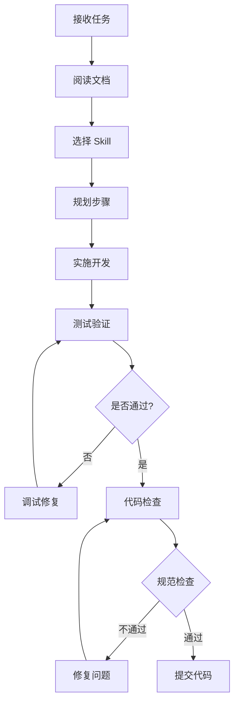

# ainative 项目 AI 开发入口

欢迎使用 AI 辅助开发 ainative 项目!

## 快速开始

### 我是 AI Agent,应该从哪里开始?

1. **首先阅读**: [AI 工作流指南](AI-WORKFLOW-GUIDE.md)
2. **了解项目**: 阅读各子项目的 README
3. **选择 Skill**: 根据任务类型选择合适的 Skill

### 可用 Skills

| Skill 路径 | 用途 | 何时使用 |
|-----------|------|---------|
| `@.cursor/skills/create-ainative-app-page/SKILL.md` | 创建小程序页面 | 需要在小程序中添加新页面/功能 |
| `@.cursor/skills/create-ainative-shadow-page/SKILL.md` | 创建管理后台页面 | 需要在管理后台添加新页面/功能 |
| `@.cursor/skills/create-ainative-backend-api/SKILL.md` | 创建后端 API | 需要添加新的后端接口 |
| `@.cursor/skills/debug-ainative-projects/SKILL.md` | 调试问题 | 遇到错误需要排查 |
| `@.cursor/skills/code-review-ainative/SKILL.md` | 代码规范检查 | 提交前检查代码质量 |

### 项目文档索引

#### ainative-app (小程序)
- [开发指南](ainative-app/README.md)
- [API 规范](ainative-app/references/api-http-patterns.md)
- [Vue 规范](ainative-app/references/vue-typescript-patterns.md)
- [样式规范](ainative-app/references/styling-css-patterns.md)

#### ainative-shadow (管理后台)
- [开发指南](ainative-shadow/README.md)
- [API 调用](ainative-shadow/references/api-http.md)
- [组件开发](ainative-shadow/references/component-development.md)
- [路由配置](ainative-shadow/references/router-config.md)

#### ainative-backend (后端)
- [开发指南](ainative-backend/README.md)
- [架构概览](ainative-backend/references/architecture.md)
- [分层编码](ainative-backend/references/layer.md)
- [数据库设计](ainative-backend/references/database.md)

## 常见任务快速指引

### 任务: 创建新功能 (全栈)

**步骤**:
1. 阅读 [AI 工作流指南](AI-WORKFLOW-GUIDE.md) 中的"任务 1: 新增功能模块"
2. 后端: 使用 `@skills/create-ainative-backend-api`
3. 前端: 使用 `@skills/create-ainative-shadow-page` 或 `@skills/create-ainative-app-page`

### 任务: 修复 Bug

**步骤**:
1. 使用 `@skills/debug-ainative-projects` 定位问题
2. 根据问题所在层修改代码
3. 使用 `@skills/code-review-ainative` 检查修复

### 任务: 添加新字段

**后端**:
```bash
# 1. 修改数据库表
# 2. 重新生成代码
make gorm TABLES=表名
# 3. 更新 Proto
# 4. 重新生成 API
make api
```

**前端**:
```typescript
// 1. 更新类型定义
// 2. 更新页面显示
```

### 任务: 代码优化

**步骤**:
1. 使用 `@skills/code-review-ainative` 检查问题
2. 根据检查结果优化代码
3. 运行 lint 和测试

## 开发规范总结

### 命名规范

**前端**:
- 组件: `PascalCase`
- 变量/函数: `camelCase`
- 常量: `UPPER_SNAKE_CASE`
- 类型: `PascalCase`

**后端**:
- 导出: `PascalCase`
- 私有: `camelCase`
- 接口: `XxxRepo`, `XxxService`

### 文件组织

**前端页面**:
```
src/pages/module/
├── index.vue           # 主页面
├── service.ts          # API 调用
├── components/         # 页面组件
└── index.config.ts     # 配置(仅 app)
```

**后端模块**:
```
internal/
├── service/shadow_v1_module.go    # Service 层
├── biz/shadow_v1_module.go        # Biz 层
└── data/module.go                 # Data 层
```

### 常用命令

**前端**:
```bash
pnpm dev              # 开发
pnpm build:prod       # 构建
pnpm lint             # 检查
pnpm lint:fix         # 修复
```

**后端**:
```bash
make gorm TABLES=x    # 生成 GORM
make api              # 生成 API
make wire             # 依赖注入
make build            # 构建
make lint             # 检查
```

## 重要提醒

### ⚠️ 注意事项

1. **不要修改生成的代码**
   - `internal/data/gorm/` 目录的文件
   - `*.pb.go`, `*.pb.validate.go` 等文件
   - 业务逻辑写在对应的业务文件中

2. **保持代码风格一致**
   - 遵循项目的 ESLint/Go Lint 规范
   - 使用项目的代码格式化配置
   - 参考现有代码的写法

3. **完善错误处理**
   - 前端: 统一使用拦截器处理
   - 后端: 使用项目的 errorx 包
   - 添加合适的日志记录

4. **及时测试**
   - 每完成一个功能就测试
   - 运行 lint 检查代码质量
   - 确保构建成功

### 📋 开发 Checklist

开始开发前:
- [ ] 阅读相关文档
- [ ] 了解现有实现
- [ ] 规划实施步骤

开发过程中:
- [ ] 遵循代码规范
- [ ] 添加必要注释
- [ ] 处理错误情况
- [ ] 及时提交代码

开发完成后:
- [ ] 运行 lint 检查
- [ ] 功能测试通过
- [ ] 构建成功
- [ ] 更新文档(如需要)

## 获取帮助

### 查找信息

1. **搜索代码**: 使用 Grep/SemanticSearch
2. **查看文档**: 阅读 `docs/dev-spec/` 目录
3. **参考现有实现**: 找类似的功能参考

### 调试问题

1. **前端问题**: 
   - 查看 Console 和 Network
   - 使用 Vue Devtools
   - 参考 `@skills/debug-ainative-projects`

2. **后端问题**:
   - 查看日志文件
   - 使用 Postman 测试接口
   - 参考 `@skills/debug-ainative-projects`

### 代码质量

使用 `@skills/code-review-ainative` 进行代码检查和优化。

## 开发流程图



---

**祝开发顺利!** 如有问题,请参考相关文档或使用对应的 Skill。
