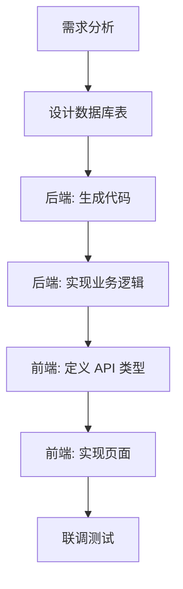

# ainative AI 工作流指南

本指南为 AI Agent 提供在 ainative 项目中进行迭代开发的完整工作流程。

## 项目概览

ainative 是一个教育研学 Monorepo 项目,包含三个子项目:

| 项目 | 技术栈 | 用途 |
|-----|--------|------|
| **ainative-app** | Taro + Vue3 + TypeScript | 跨平台小程序(微信/支付宝) |
| **ainative-shadow** | Vue3 + Element Plus + TypeScript | 管理后台 |
| **ainative-backend** | Go + Kratos + gRPC | 后端服务 |

## 核心原则

### 1. 最小化修改
- 只修改必要的文件
- 不改变现有代码格式(除非必要)
- 遵循项目现有的代码风格

### 2. 类型安全
- 所有前端代码使用 TypeScript 严格模式
- 后端使用 Go 的类型系统
- API 接口使用 Proto 定义,自动生成类型

### 3. 分层架构
- **前端**: Component → API → Store (可选)
- **后端**: API → Server → Service → Biz → Data

### 4. 自动化优先
- 使用 Makefile 命令生成代码
- 使用 Proto 定义接口,自动生成 gRPC/HTTP 代码
- 使用数据库工具生成 GORM Model

## 常见任务工作流

### 任务 1: 新增功能模块 (全栈)

#### 步骤概览


#### 详细步骤

**1. 后端开发** (ainative-backend)

```bash
# 1.1 创建数据库表 (使用 MCP 工具或手动)
# 表名: module_info

# 1.2 生成 GORM 代码
make gorm TABLES=module_info

# 1.3 生成 Proto 文件
make sqltopb shadow module_info  # 管理后台
make sqltopb wechat module_info  # 小程序端

# 1.4 编辑 Proto 文件,添加业务接口
# 编辑 api/shadow/v1/module_info.proto

# 1.5 格式化并生成 API 代码
make buf
make api

# 1.6 生成骨架代码
make protocode

# 1.7 实现业务逻辑
# - internal/data/module_info.go (Data 层)
# - internal/biz/shadow_v1_moduleinfo.go (Biz 层)
# - internal/service/shadow_v1_moduleinfo.go (Service 层)

# 1.8 注册服务
# 编辑 internal/server/http.go

# 1.9 生成依赖注入代码
make wire

# 1.10 测试
make build
./bin/backend -conf configs/development.yaml
```

**2. 管理后台开发** (ainative-shadow)

```bash
# 2.1 定义 API 类型
# 编辑 src/types/api/module.ts

# 2.2 创建 service
# 创建 src/pages/moduleManagement/service.ts

# 2.3 实现列表页面
# 创建 src/pages/moduleManagement/index.vue

# 2.4 实现表单弹窗
# 创建 src/pages/moduleManagement/components/FormDialog.vue

# 2.5 配置路由
# 创建 src/routers/modules/module.ts

# 2.6 测试
pnpm dev
```

**3. 小程序开发** (ainative-app)

```bash
# 3.1 创建 API 文件
# 创建 src/api/module.ts

# 3.2 创建页面
# 创建 src/pages/module/index.vue
# 创建 src/pages/module/index.config.ts

# 3.3 配置路由
# 编辑 src/app.config.ts

# 3.4 测试
pnpm dev:weapp
```

**使用 Skill 辅助**:
- 后端: 参考 `@skills/create-ainative-backend-api`
- 管理后台: 参考 `@skills/create-ainative-shadow-page`
- 小程序: 参考 `@skills/create-ainative-app-page`

### 任务 2: 修改现有功能

#### 步骤概览

1. **定位代码**: 使用 Grep/SemanticSearch 找到相关文件
2. **分析依赖**: 了解修改影响范围
3. **修改代码**: 按照分层架构修改
4. **更新类型**: 如果修改了接口,更新 TypeScript 类型
5. **测试验证**: 本地测试,确保功能正常

#### 示例: 修改用户列表添加字段

**后端**:
```bash
# 1. 修改数据库表 (添加字段)
# 2. 重新生成 GORM 代码
make gorm TABLES=user

# 3. 更新 Proto 文件
# 编辑 api/shadow/v1/user.proto
# 添加新字段: string new_field = 10;

# 4. 重新生成 API 代码
make api

# 5. 更新 Data 层 DTO 转换
# 编辑 internal/data/user.go

# 6. 测试
make wire && make build
```

**前端**:
```bash
# 1. 更新 API 类型
# 编辑 src/types/api/user.ts

# 2. 更新页面显示
# 编辑 src/pages/user/index.vue

# 3. 测试
pnpm dev
```

### 任务 3: Bug 修复

**使用调试 Skill**:
```
@skills/debug-ainative-projects
```

**调试流程**:

1. **复现问题**: 确保能稳定复现
2. **定位问题**: 
   - 前端: 查看 Console 和 Network
   - 后端: 查看日志和数据库
3. **分析原因**: 找到根本原因
4. **修复代码**: 最小化修改
5. **验证修复**: 确保问题解决且无副作用

### 任务 4: 代码重构

**重构原则**:
- 保持功能不变
- 逐步重构,每次只改一小部分
- 每次修改后都要测试
- 使用版本控制,方便回滚

**常见重构场景**:

1. **提取公共组件**
2. **抽取公共逻辑到 Hooks/工具函数**
3. **优化数据库查询**
4. **拆分过长的函数**
5. **统一错误处理**

## 开发规范速查

### 前端规范

**命名**:
```typescript
// 组件: PascalCase
export default defineComponent({ name: 'UserList' })

// 变量/函数: camelCase
const userName = ref('')
function handleSubmit() {}

// 常量: UPPER_SNAKE_CASE
const MAX_COUNT = 100

// 类型: PascalCase
interface UserInfo {}
type UserId = string
```

**文件组织**:
```
src/pages/user/
├── index.vue              # 主页面
├── service.ts             # API 调用
├── components/            # 页面组件
│   ├── UserForm.vue
│   └── UserDetail.vue
└── index.config.ts        # 页面配置(仅 app)
```

**API 调用**:
```typescript
// 定义类型
export interface UserListParams {
  current: number
  size: number
  name?: string
}

// API 函数
export function fetchUserList(params: UserListParams) {
  return request.get<Api.User.ListResponse>({
    url: '/api/user/list',
    params,
  })
}
```

### 后端规范

**命名**:
```go
// 导出: PascalCase
func GetUserList() {}
var MaxCount = 100

// 私有: camelCase
func getUserById() {}
var defaultSize = 10

// 接口: 通常以 Repo/Service 结尾
type UserRepo interface {}
```

**分层职责**:
```
API 层 (Proto)     : 接口定义,参数校验
Server 层          : 服务器配置,中间件
Service 层         : 协议转换,调用 Biz
Biz 层            : 业务逻辑,调用 Data
Data 层           : 数据访问,DTO 转换
```

**错误处理**:
```go
import "gitlab.yc345.tv/ainative/ainative-backend/internal/data/errorx"

// 返回错误
return nil, errorx.ParamErr.Err()

// 包装错误
return nil, errorx.DataSQLErr.WithError(err).Err()
```

## 常用命令速查

### ainative-app

```bash
# 开发
pnpm dev:weapp          # 微信小程序
pnpm dev:h5             # H5

# 构建
pnpm build:weapp:production  # 生产环境

# 检查
pnpm lint               # ESLint
pnpm lint:fix           # 自动修复
pnpm type-check         # 类型检查
```

### ainative-shadow

```bash
# 开发
pnpm dev                # 开发环境

# 构建
pnpm build:prod         # 生产环境

# 检查
pnpm lint               # ESLint
pnpm lint:prettier      # Prettier
pnpm lint:stylelint     # Stylelint
```

### ainative-backend

```bash
# 代码生成
make gorm TABLES=表名   # 生成 GORM 代码
make sqltopb shadow 表名 # 生成 Proto 文件
make api                # 生成 API 代码
make protocode          # 生成骨架代码
make wire               # 生成依赖注入

# 开发
make build              # 构建
make lint               # 代码检查

# 工具
make buf                # 格式化 Proto
make gci                # 格式化 Go import
make errcode            # 导出错误码
```

## AI Agent 工作建议

### 1. 开始任务前

- **理解需求**: 确保完全理解任务需求
- **查看文档**: 阅读相关的开发指南和规范
- **搜索现有代码**: 看是否有类似的实现可以参考
- **规划步骤**: 列出详细的实施步骤

### 2. 实施过程中

- **分步执行**: 不要一次修改太多文件
- **及时测试**: 每完成一个步骤就测试一次
- **记录日志**: 记录修改的内容和原因
- **处理错误**: 遇到错误立即处理,不要跳过

### 3. 完成任务后

- **代码检查**: 运行 lint 和 type-check
- **功能测试**: 确保功能正常工作
- **清理代码**: 删除调试代码和注释
- **更新文档**: 如有必要,更新相关文档

### 4. 遇到问题时

- **查看日志**: 前端 Console,后端日志文件
- **使用调试工具**: Devtools, pprof, Postman
- **参考文档**: 查看项目文档和规范
- **寻求帮助**: 使用 `@skills/debug-ainative-projects`

## 可用 Skills 清单

| Skill | 用途 | 使用场景 |
|-------|------|---------|
| `@skills/create-ainative-app-page` | 创建小程序页面 | 新增小程序功能 |
| `@skills/create-ainative-shadow-page` | 创建管理后台页面 | 新增管理功能 |
| `@skills/create-ainative-backend-api` | 创建后端 API | 新增后端接口 |
| `@skills/debug-ainative-projects` | 调试问题 | 问题排查,错误修复 |
| `@skills/code-review-ainative` | 代码规范检查 | 提交前检查,代码优化 |

## 相关文档

### 入口文档
- [ainative-app 开发指南](/Users/moyan/myWorkPlace/yanxue-main/docs/dev-spec/ainative-app/README.md)
- [ainative-shadow 开发指南](/Users/moyan/myWorkPlace/yanxue-main/docs/dev-spec/ainative-shadow/README.md)
- [ainative-backend 开发指南](/Users/moyan/myWorkPlace/yanxue-main/docs/dev-spec/ainative-backend/README.md)

### 详细规范
- [前端 API 规范](/Users/moyan/myWorkPlace/yanxue-main/docs/dev-spec/ainative-shadow/references/api-http.md)
- [后端分层架构](/Users/moyan/myWorkPlace/yanxue-main/docs/dev-spec/ainative-backend/references/layer.md)
- [数据库设计规范](/Users/moyan/myWorkPlace/yanxue-main/docs/dev-spec/ainative-backend/references/database.md)

### 工具文档
- [Makefile 命令](/Users/moyan/myWorkPlace/yanxue-main/docs/dev-spec/ainative-backend/references/makefile.md)
- [错误码规范](/Users/moyan/myWorkPlace/yanxue-main/docs/dev-spec/ainative-backend/references/error-codes.md)

## 常见问题 FAQ

**Q: 如何判断修改哪个项目?**

A: 根据需求类型判断:
- 用户端功能 → ainative-app
- 管理功能 → ainative-shadow
- 数据/逻辑/接口 → ainative-backend

**Q: 后端生成代码会覆盖手写代码吗?**

A: 部分会,需要注意:
- `make gorm` 生成的代码在 `internal/data/gorm/`,不要修改
- 业务逻辑写在 `internal/data/表名.go`
- `make api` 会覆盖 `*.pb.go` 等文件,只修改 `.proto` 文件

**Q: 前端类型定义在哪里?**

A:
- 全局类型: `src/types/api/` (shadow) 或 `src/types/` (app)
- 组件 Props: 在组件文件中定义
- API 响应: 使用全局命名空间 `Api.Module.Response`

**Q: 如何处理跨域问题?**

A:
- 开发环境: 配置代理 (vite.config.ts / rsbuild.config.ts)
- 生产环境: 配置 Nginx 或后端 CORS 中间件

**Q: 如何添加新的权限?**

A:
1. 后端: 在菜单管理添加权限项
2. 前端: 使用 `v-auth` 指令控制按钮显示
3. 路由: 在 route meta 中配置权限

## 最佳实践

1. **优先使用现有组件和工具**
   - ainative-shadow: `CommonTable`, `FileUpload`
   - ainative-app: `CustomNavBar`, `Loading`

2. **保持代码简洁**
   - 函数不超过 50 行
   - 文件不超过 500 行
   - 及时拆分和重构

3. **注重性能**
   - 前端: 使用虚拟滚动,懒加载
   - 后端: 添加索引,使用缓存

4. **完善错误处理**
   - 前端: 显示友好的错误提示
   - 后端: 记录详细的错误日志

5. **编写清晰的注释**
   - 复杂逻辑必须注释
   - 公共函数添加 JSDoc/GoDoc
   - 注释说明"为什么",不是"做什么"

---

**开始愉快的开发吧!** 🚀
