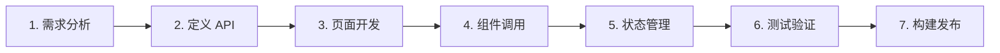

# ainative-app 小程序开发指南

本文档提供 Taro + Vue3 微信小程序开发流程概览和规范索引。详细规范请参阅
[`docs/dev-spec/ainative-app/references/`](docs/dev-spec/ainative-app/references/) 目录下的对应文档。

---

## 项目概览

`ainative-app` 是一个基于 Taro + Vue3 的微信小程序应用。

### 技术栈

| 技术 | 版本 | 说明 |
|------|------|------|
| Taro | 3.6.23 | 跨端开发框架 |
| Vue | 3.3.4 | 前端框架 |
| TypeScript | 5.4.5 | 类型系统 |
| Pinia | 2.1.7 | 状态管理 |
| Less | 4.2.0 | CSS 预处理器 |
| Webpack | 5.78.0 | 构建工具 |

---

## 最近更新

### v1.0.0 (2026-01-28)

**核心依赖升级**
- Taro 框架降级至 3.6.23（提供更好的稳定性）
- 构建工具切换至 Webpack 5（替代 Vite）
- Pinia 升级至 2.1.7
- Vue 升级至 3.3.4

**配置优化**
- 优化 pxtransform 转换规则，适配 Taro 3 的转换机制

**应用初始化重构**
- 简化路由守卫初始化流程，直接在 `app.ts` 中集成
- 优化数据采集初始化，自动从 store 获取用户信息
- 全局注册 `v-track` 和 `v-track-view` 埋点指令

**组件样式调整**
- 移除所有组件的 `scoped` 样式属性，统一样式管理

---

## 快速开始

### 环境准备

```bash
# 安装依赖
cd ainative-app
pnpm install

# 启动微信小程序开发
pnpm dev:weapp
```

### 微信开发者工具

1. 使用微信开发者工具打开 `ainative-app/dist` 目录
2. 如首次使用，需配置 AppID

### 本地联调（绕过公网）

在测试环境下，如需连接本地沙箱后端进行前后端联调（不经过公网）：

1. **启动沙箱**（项目根目录）：
   ```bash
   SANDBOX_ENV=test make sandbox
   ```

2. **启动小程序（local 模式）**：
   ```bash
   cd ainative-app
   pnpm dev:weapp:local
   ```

3. **微信开发者工具**：打开 `ainative-app/dist`，在「详情 → 本地设置」中勾选：
   - **不校验合法域名、web-view（业务域名）、TLS 版本以及 HTTPS 证书**

4. 小程序将请求 `http://localhost:8070/api`，由沙箱 Nginx 转发到本地后端。

> 真机调试需手机与电脑同网段，并将 `env.ts` 中 `local` 的 API 地址改为本机 IP（如 `http://192.168.1.100:8070/api`）。

### 开发流程



---

## 项目结构

```
ainative-app/
├── config/                    # Taro 构建配置
│   ├── index.ts              # 主配置（Webpack 5）
│   ├── dev.ts                # 开发环境配置
│   └── prod.ts               # 生产环境配置
├── src/
│   ├── api/                  # API 接口层
│   │   ├── request.ts        # 请求封装
│   │   └── example/          # API 示例
│   ├── components/           # 通用组件库
│   │   ├── NavBar/           # 自定义导航栏
│   │   ├── TabBar/           # 自定义 TabBar
│   │   ├── TabBarLayout/     # TabBar 布局容器
│   │   ├── Loading/          # 加载组件
│   │   ├── Modal/            # 模态框组件
│   │   ├── EmptyState/       # 空状态组件
│   │   ├── Toast/            # 提示组件
│   │   └── Ui/               # UI 基础组件
│   ├── config/               # 环境配置
│   │   └── env.ts            # 多环境配置
│   ├── pages/                # 页面组件
│   │   ├── index/            # 首页
│   │   └── user/             # 用户相关页面
│   ├── store/                # 状态管理
│   │   ├── userStore.ts      # 用户状态
│   │   ├── configStore.ts    # 全局配置
│   │   └── tabBarStore.ts    # TabBar 状态
│   ├── styles/               # 样式系统
│   │   ├── variables.less    # 设计变量
│   │   ├── common.less       # 通用样式
│   │   ├── mixins.less       # Less Mixins
│   │   └── platform.less     # 平台特定样式
│   ├── types/                # 类型定义
│   ├── utils/                # 工具方法库
│   │   ├── analytics.ts      # 数据采集
│   │   ├── routerGuard.ts    # 路由守卫
│   │   ├── upload/           # 文件上传
│   │   ├── formatDate.ts     # 日期格式化
│   │   ├── formatPrice.ts    # 价格格式化
│   │   └── statusBar.ts      # 状态栏适配
│   ├── app.ts                # 应用入口
│   ├── app.config.ts         # 路由配置
│   └── app.less              # 全局样式
├── types/                    # 全局类型声明
├── .env.*                    # 环境变量
└── package.json
```

---

## 核心功能

### 1. 网络请求

基于 Taro.request 封装的请求层，支持：

- Token 自动注入
- 401 自动跳转登录（带防抖）
- 白名单机制
- 统一错误处理

```typescript
import { get, post } from "@/api/request"

// GET 请求
const data = await get<UserInfo>("/api/v1/user/info")

// POST 请求
const result = await post("/api/v1/user/update", { name: "新名称" })
```

→ 详见 [API 请求规范](references/api-request.md)

### 2. 状态管理

使用 Pinia + pinia-plugin-persistedstate：

```typescript
import { useUserStore } from "@/store/userStore"

const userStore = useUserStore()

// 读取状态
console.log(userStore.isLoggedIn)

// 修改状态
userStore.setToken("xxx")
userStore.setUserInfo({ nickname: "用户" })
```

**Taro 存储适配**：Pinia 已配置使用 Taro 的 `getStorageSync` 和 `setStorageSync` 进行数据持久化，确保跨端兼容。

→ 详见 [状态管理规范](references/state-management.md)

### 3. 路由守卫

自动拦截需要登录的页面：

```typescript
// 在 src/utils/routerGuard.ts 中配置需要登录的页面
const authPages = [
  "/pages/user/profile/index"
]
```

**自动初始化**：路由守卫已在 `app.ts` 中自动初始化，无需手动调用。

→ 详见 [路由守卫规范](references/router-guard.md)

### 4. 数据采集

Vue 指令和方法调用两种方式：

```vue
<!-- 点击埋点 -->
<button v-track="{ event: 'click_button', params: { id: 1 } }">按钮</button>

<!-- 曝光埋点 -->
<view v-track-view="{ event: 'view_card', params: { id: 1 } }">卡片</view>
```

```typescript
import { track, trackPageView } from "@/utils/analytics"

// 手动埋点
track("custom_event", { key: "value" })
```

**全局指令**：`v-track` 和 `v-track-view` 已在应用启动时全局注册，可直接在模板中使用。

→ 详见 [数据采集规范](references/analytics.md)

### 5. 文件上传

支持图片压缩、格式转换、并发控制：

```typescript
import { handleTaroFileUpload } from "@/utils/upload"

const result = await handleTaroFileUpload({
  tempFilePath: "/path/to/file",
  shouldCompress: true,
  maxSize: 1024 * 1024,
  getToken: async () => "your-upload-token"
})
```

→ 详见 [文件上传规范](references/file-upload.md)

---

## 组件库

### 布局组件

| 组件 | 说明 | 使用场景 |
|------|------|----------|
| NavBar | 自定义导航栏 | 页面顶部导航 |
| TabBar | 自定义 TabBar | 底部导航 |
| TabBarLayout | TabBar 布局容器 | TabBar 页面布局 |
| StatusBar | 状态栏适配 | 全面屏适配 |

### 反馈组件

| 组件 | 说明 | 使用场景 |
|------|------|----------|
| Loading | 加载组件 | 数据加载中 |
| Modal | 模态框 | 弹窗确认 |
| Toast | 提示组件 | 操作反馈 |
| EmptyState | 空状态 | 无数据展示 |

### UI 基础组件

| 组件 | 说明 | 使用场景 |
|------|------|----------|
| UiButton | 按钮组件 | 各类按钮操作 |

→ 详见 [组件使用文档](references/components.md)

---

## 样式系统

### 设计变量

```less
@import "@/styles/variables.less";

// 颜色
@primary-color: #1890ff;
@text-color: #333333;
@text-color-secondary: #666666;

// 间距
@spacing-xs: 8rpx;
@spacing-sm: 16rpx;
@spacing-md: 24rpx;
@spacing-lg: 32rpx;
@spacing-xl: 48rpx;

// 字体
@font-size-sm: 24rpx;
@font-size-md: 28rpx;
@font-size-lg: 32rpx;
```

### Mixins

```less
@import "@/styles/mixins.less";

// 单行文本省略
.text-ellipsis();

// 多行文本省略
.multi-line-ellipsis(2);

// 安全区底部适配
.safe-area-bottom();

// 1px 边框
.border-1px(@color, @direction);
```

→ 详见 [样式开发规范](references/style-guide.md)

---

## 构建

### 微信小程序

```bash
# 开发
pnpm dev:weapp

# 构建
pnpm build:weapp
```

---

## 环境配置

### 构建工具

项目使用 **Webpack 5** 作为构建工具，配置位于 `config/index.ts`：

```typescript
// 基础配置
const config: UserConfigExport = {
  projectName: "ainative-app",
  designWidth: 750,
  framework: "vue3",
  compiler: "webpack5",  // 使用 Webpack 5
  // ...
}
```

**关键特性**：
- 微信小程序构建
- 内置路径别名配置（`@/` 指向 `src/`）
- 自动 px 转换（rpx 单位）
- 支持 Less 预处理器

### 环境变量

```env
# .env.development
TARO_APP_API_BASE_URL=http://localhost:8000
TARO_APP_ENV=development

# .env.production
TARO_APP_API_BASE_URL=https://api.example.com
TARO_APP_ENV=production
```

→ 详见 [环境配置规范](references/environment.md)

---

## 开发规范

### 代码规范

- 使用 TypeScript 严格模式
- 遵循 Vue 3 Composition API 风格
- 组件文件使用 PascalCase 命名
- 工具函数使用 camelCase 命名

### Git 提交规范

```bash
# 功能
feat: 新增登录功能

# 修复
fix: 修复按钮点击问题

# 样式
style: 调整首页布局

# 重构
refactor: 重构请求封装
```

### 检查清单

开发完成后确认：

- [ ] TypeScript 类型完整
- [ ] 错误处理完善
- [ ] 小程序功能测试
- [ ] `pnpm lint` 无错误
- [ ] 构建成功

---

## 常见问题

### 1. 为什么使用 Taro 3.6.23 而不是最新版本？

Taro 3.6.23 经过长期验证，提供了更好的稳定性和生态兼容性。对于生产环境，稳定性优先于新特性。

### 2. Webpack 5 vs Vite

项目使用 Webpack 5 作为构建工具，原因：
- 更成熟的跨端构建方案
- 更好的小程序平台支持
- 丰富的插件生态

### 3. 微信开发者工具报错

确保使用最新版微信开发者工具，并正确配置 AppID。

### 4. 样式不生效

- 使用 `rpx` 单位
- 检查是否正确导入 `variables.less`
- 确认设计稿宽度为 750px

---

## 快速链接

- [完整更新日志](CHANGELOG.md)
- [Taro 官方文档](https://taro-docs.jd.com/)
- [Vue 3 文档](https://cn.vuejs.org/)
- [Pinia 文档](https://pinia.vuejs.org/zh/)
- [微信小程序文档](https://developers.weixin.qq.com/miniprogram/dev/framework/)
