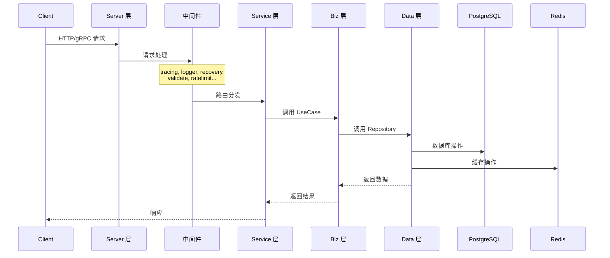
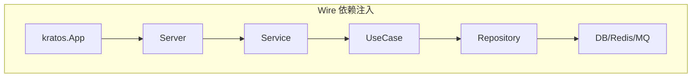

# 架构概览

## 洋葱架构 (Onion Architecture)

本项目采用洋葱架构,核心思想是**依赖方向由外向内**,内层不依赖外层。

```
┌─────────────────────────────────────────────────────────────┐
│                      Server 层                               │
│  (HTTP/gRPC 服务器, 中间件, 路由注册)                          │
├─────────────────────────────────────────────────────────────┤
│                      Service 层                              │
│  (协议转换, 调用 Biz 层)                                      │
├─────────────────────────────────────────────────────────────┤
│                      Biz 层 (核心)                           │
│  (业务逻辑, UseCase, 定义 Repository 接口)                    │
├─────────────────────────────────────────────────────────────┤
│                      Data 层                                 │
│  (实现 Repository 接口, 数据库/缓存/RPC 访问)                  │
└─────────────────────────────────────────────────────────────┘
```

## 请求处理流程



## 各层职责

### Server 层

**位置**: `internal/server/`

**职责**:
- 创建和配置 HTTP/gRPC 服务器
- 注册路由和中间件
- 管理服务器生命周期

**关键文件**:
| 文件 | 说明 |
|-----|------|
| `http.go` | HTTP 服务器配置,注册 Service 到路由 |
| `grpc.go` | gRPC 服务器配置 |
| `cron.go` | 定时任务 |
| `rabbitmq.go` | 消息队列消费者 |

### Service 层

**位置**: `internal/service/`

**职责**:
- 接收请求参数 (Protobuf 消息)
- 调用 Biz 层处理业务
- 返回响应 (Protobuf 消息)
- **不包含业务逻辑**

**代码示例**:
```go
// internal/service/app_v1_auth.go
func (a *AppV1AuthService) AuthLogin(ctx context.Context, req *pb.AuthLoginReq) (*pb.AuthLoginReply, error) {
    return a.appV1AuthUseCase.AuthLogin(ctx, req)
}
```

### Biz 层

**位置**: `internal/biz/`

**职责**:
- 实现核心业务逻辑
- 定义 Repository 接口 (依赖倒置)
- 编排多个 Repository 调用
- 处理业务规则和校验

**关键概念**:
- `UseCase` - 业务用例,如 `AppV1AuthUseCase`
- `Repository 接口` - 在 `biz.go` 中定义,由 Data 层实现

**代码示例**:
```go
// internal/biz/biz.go - 定义接口
type SysAdminRepo interface {
    ainative_backend_repo.ISysAdminRepo
    ExpiredToken(ctx context.Context, adminIds []string) error
    GenerateJwTToken(ctx context.Context, kv map[string]interface{}) (*jwt.Token, error)
}

// internal/biz/app_v1_auth_authlogin.go - 业务逻辑
func (a *AppV1AuthUseCase) AuthLogin(ctx context.Context, req *pb.AuthLoginReq) (*pb.AuthLoginReply, error) {
    // 业务逻辑实现
}
```

### Data 层

**位置**: `internal/data/`

**职责**:
- 实现 Biz 层定义的 Repository 接口
- 数据库 CRUD 操作
- 缓存读写
- 外部服务 RPC 调用
- 数据转换 (Model → DTO)

**代码结构**:
```
data/
├── data.go              # Wire Provider, 基础设施初始化
├── common.go            # 通用方法 (事务, 分布式锁, 缓存清理)
├── sysadmin.go          # 自定义 SysAdminRepo (实现 biz.SysAdminRepo)
├── gorm/                # 自动生成
│   ├── ainative_backend_model/   # 数据模型
│   ├── ainative_backend_dao/     # DAO 查询对象
│   └── ainative_backend_repo/    # 基础 Repository
└── ...
```

**代码示例**:
```go
// internal/data/sysadmin.go
var _ biz.SysAdminRepo = (*SysAdminRepo)(nil)  // 确保实现接口

type SysAdminRepo struct {
    *ainative_backend_repo.SysAdminRepo  // 嵌入自动生成的基础 Repo
    log    *log.Helper
    config *conf.Bootstrap
    data   *Data
    jwt    *jwt.Jwt
}

func (s *SysAdminRepo) GenerateJwTToken(ctx context.Context, kv map[string]interface{}) (*jwt.Token, error) {
    // 自定义方法实现
}
```

## 依赖注入 (Wire)

项目使用 Google Wire 进行依赖注入。

### Provider 注册

每层都有 `ProviderSet`:

```go
// internal/data/data.go
var ProviderSet = wire.NewSet(
    NewDB,
    NewRedis,
    NewData,
    NewSysAdminRepo,
    // ...
)

// internal/biz/biz.go
var ProviderSet = wire.NewSet(
    NewAppV1AuthUseCase,
    NewShadowV1SysAdminUseCase,
    // ...
)

// internal/service/service.go
var ProviderSet = wire.NewSet(
    NewAppV1AuthService,
    NewShadowV1SysAdminService,
    // ...
)
```

### Wire 配置

``` 
// cmd/server/wire.go
func wireApp(*conf.Bootstrap, log.Logger) (*kratos.App, func(), error) {
    panic(wire.Build(
        server.ProviderSet,
        service.ProviderSet,
        biz.ProviderSet,
        data.ProviderSet,
        newApp,
    ))
}
```

### 依赖关系



## 中间件链

HTTP 请求经过的中间件 (按顺序):

| 中间件 | 说明 |
|-------|------|
| `tracing.Server()` | 链路追踪 |
| `metrics.KratosMiddleware()` | 指标收集 |
| `logger.HTTPLogger()` | 请求日志 |
| `recovery.Recovery()` | Panic 恢复 |
| `metadata.Server()` | 元数据传递 |
| `validate.Validator()` | 参数校验 |
| `ratelimit.Server()` | 限流 |
| `requestCancel.KratosMiddleware()` | 请求超时控制 |

## 错误处理

### 错误码定义

位置: `internal/data/errorx/code.go`

```go
var TokenExpired = errx.New(4001, "token已过期", "Token expired")
var TokenInvalid = errx.New(4002, "无效token", "Invalid token")
```

### 错误返回

```go
// 返回错误
return nil, errorx.TokenExpired.Err()

// 包装原始错误
return nil, errorx.DataSQLErr.WithError(err).Err()
```

## 缓存策略

项目使用 RocksCache 实现弱一致性缓存:

```go
// 带缓存的查询
admin, err := s.FindOneCacheByID(ctx, adminId)

// 更新后删除缓存
err = s.UpdateOneCache(ctx, newData, oldData)
```

缓存 Key 前缀定义在各 Repo 中:
```go
var CacheSysAdminByIDPrefix = "DBCache:devices_demo:SysAdminByID"
```

## 相关文档

- [开发流程](../README.md) - 新增接口的完整流程
- [分层指南](layer.md) - 各层代码编写详解
