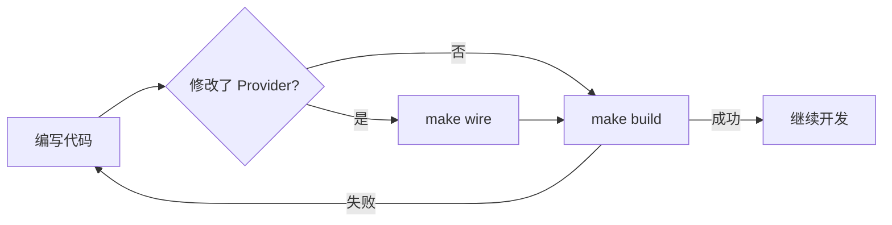

# 代码检查规范

## 概述

本规范定义了开发过程中必须执行的代码检查步骤，确保代码质量和项目可构建性。

## 检查命令速查

| 命令 | 作用 | 执行时机 |
|-----|------|---------|
| `make wire` | 依赖注入检查 | 修改 Provider 后 |
| `make build` | 编译检查 | 提交代码前 |
| `make lint` | 代码规范检查 | 提交代码前 |
| `make gosec` | 安全漏洞检查 | 提交代码前 |
| `make gci` | Import 格式化 | 提交代码前 |
| `make buf` | Proto 格式化 | 修改 Proto 后 |

## 检查流程

### 开发阶段检查



### 提交前检查

```bash
# 完整检查流程（推荐）
make gci && make lint && make gosec && make build
```

## 详细说明

### 1. 依赖注入检查 (`make wire`)

**必须执行的场景：**

| 场景 | 说明 |
|-----|------|
| 新增 Provider | 在任意层新增了 `func NewXxx()` 函数 |
| 修改 Provider 签名 | 修改了构造函数的参数或返回值 |
| 修改 ProviderSet | 在 `wire.NewSet()` 中添加/删除 Provider |
| 新增依赖 | 构造函数新增了依赖参数 |

**执行命令：**

```bash
make wire
```

**常见错误及解决：**

| 错误信息 | 原因 | 解决方法 |
|---------|------|---------|
| `no provider found for X` | 缺少 Provider | 将 Provider 添加到 ProviderSet |
| `multiple providers for X` | 重复提供 | 检查 ProviderSet 是否重复注册 |
| `cycle detected` | 循环依赖 | 重构代码，打破循环依赖 |
| `unused provider` | Provider 未使用 | 从 ProviderSet 移除或添加使用方 |

**示例：**

```go
// internal/biz/biz.go - 添加新的 Provider
var ProviderSet = wire.NewSet(
    NewUserUseCase,
    NewOrderUseCase,  // 新增
)

// 执行 make wire 生成依赖注入代码
```

### 2. 编译检查 (`make build`)

**执行命令：**

```bash
make build
```

**检查内容：**
- 语法错误
- 类型错误
- 未使用的变量和导入
- 接口实现完整性

**输出位置：** `bin/backend`

**常见错误：**

| 错误类型 | 示例 | 解决方法 |
|---------|------|---------|
| 未定义 | `undefined: XXX` | 检查是否导入或定义 |
| 类型不匹配 | `cannot use X as Y` | 修正类型转换 |
| 未实现接口 | `X does not implement Y` | 补充缺失的方法 |

### 3. 代码规范检查 (`make lint`)

**执行命令：**

```bash
make lint
```

**检查规则配置：** `.golangci.yml`

**常见检查项：**

| 检查器 | 作用 |
|-------|------|
| `errcheck` | 检查未处理的错误返回 |
| `govet` | 检查可疑代码 |
| `staticcheck` | 静态分析 |
| `unused` | 未使用的代码 |
| `ineffassign` | 无效赋值 |

**常见问题及修复：**

```go
// 错误：未处理 error
file, _ := os.Open("file.txt")

// 正确：处理 error
file, err := os.Open("file.txt")
if err != nil {
    return err
}
```

### 4. 安全检查 (`make gosec`)

**执行命令：**

```bash
make gosec
```

**检查内容：**
- SQL 注入风险
- 硬编码密钥
- 不安全的随机数
- 路径遍历风险
- 弱加密算法

**排除规则：**

当前已排除的检查项（在 Makefile 中配置）：
- `G104` - 审计错误未检查
- `G108` - Profiling endpoint
- `G403` - RSA 弱密钥
- `G501` - Blacklisted import MD5
- `G502` - Blacklisted import DES

### 5. Import 格式化 (`make gci`)

**执行命令：**

```bash
make gci
```

**格式化规则：**

```go
// 标准库
import (
    "context"
    "fmt"
)

// 第三方库
import (
    "github.com/go-kratos/kratos/v2/log"
)

// 项目内部包
import (
    "gitlab.yc345.tv/backend/ainative-backend/internal/biz"
)
```

### 6. Proto 格式化 (`make buf`)

**执行命令：**

```bash
make buf
```

**执行时机：** 修改 `.proto` 文件后

## 提交前检查清单

在提交代码前，请确保完成以下检查：

```bash
# 1. 格式化 Import
make gci

# 2. 格式化 Proto（如果修改了 proto 文件）
make buf

# 3. 依赖注入检查（如果修改了 Provider）
make wire

# 4. 代码规范检查
make lint

# 5. 安全检查
make gosec

# 6. 编译检查
make build
```

**一键执行（推荐）：**

```bash
# 完整检查
make gci && make wire && make lint && make gosec && make build

# 快速检查（跳过安全检查）
make gci && make wire && make lint && make build
```

## CI/CD 集成

### Git Hooks 配置

项目已配置 pre-commit 钩子，提交时自动执行检查：

```bash
# .husky/pre-commit 或 .git/hooks/pre-commit
make lint
make build
```

### 流水线检查

CI 流水线会执行以下检查：

| 阶段 | 检查项 |
|-----|--------|
| lint | `make lint` |
| security | `make gosec` |
| build | `make build` |
| test | `go test ./...` |

## 常见问题

### Q: `make wire` 报错 `no provider found`？

**解决步骤：**

1. 确认 Provider 函数已定义
2. 确认已添加到对应层的 `ProviderSet`
3. 确认 `cmd/server/wire.go` 引用了该 ProviderSet

### Q: `make lint` 太慢？

**解决方法：**

```bash
# 只检查修改的文件
golangci-lint run --new-from-rev=HEAD~1

# 指定检查目录
golangci-lint run ./internal/biz/...
```

### Q: 如何忽略某个 lint 警告？

```go
// 方法 1：行内忽略
result, _ := doSomething() //nolint:errcheck

// 方法 2：函数级忽略
//nolint:funlen
func longFunction() {
    // ...
}

// 方法 3：文件级忽略（文件开头）
//nolint:dupl
package xxx
```

### Q: `make gosec` 报安全问题但确认是误报？

在 Makefile 中添加排除规则，或使用注释忽略：

```go
// #nosec G104 -- 此处忽略安全性合理
_ = file.Close()
```

## 检查频率建议

| 检查项 | 本地开发 | 提交前 | CI |
|-------|---------|--------|-----|
| `make wire` | 按需 | 必须 | 必须 |
| `make build` | 频繁 | 必须 | 必须 |
| `make lint` | 可选 | 必须 | 必须 |
| `make gosec` | 可选 | 推荐 | 必须 |
| `make gci` | 按需 | 必须 | - |
