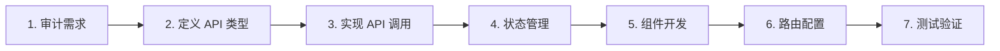

# ainative-shadow 前端开发指南

本文档提供前端开发流程概览和规范索引。详细规范请参阅
[`docs/dev-spec/ainative-shadow/references/`](docs/dev-spec/ainative-shadow/references/) 目录下的对应文档。

---

## 快速开始

### 开发流程



### 从哪一步开始?

| 场景             | 起始步骤                |
| ---------------- | ----------------------- |
| 新增页面模块     | 第 2 步 - 定义 API 类型 |
| 已有页面新增功能 | 第 4 步 - 状态管理      |
| 仅修改 UI 样式   | 第 5 步 - 组件开发      |
| 新增路由菜单     | 第 6 步 - 路由配置      |

---

## 开发流程详解

### 1. 审计需求

分析需求，评估当前项目情况，确定从哪一步开始执行。需要关注：

- 是否需要调用新的后端接口
- 是否需要新增页面或组件
- 是否需要更新权限和菜单

### 2. 定义 API 类型

在 `src/types/api/api.d.ts` 中定义接口类型：

```typescript
declare namespace Api {
  namespace ModuleName {
    // 请求参数类型
    interface RequestParams {
      id: string
      name: string
    }

    // 响应数据类型
    interface ResponseData {
      id: string
      name: string
      status: number
    }

    // 列表响应类型
    type ListResponse = Api.Common.PaginatedResponse<ResponseData>
  }
}
```

→ 详见 [API 类型定义规范](docs/dev-spec/ainative-shadow/references/api-types.md)

### 3. 实现 API 调用

在 `src/api/` 目录创建 API 模块：

```typescript
import request from "@/utils/http"

export function fetchList(params: Api.ModuleName.RequestParams) {
  return request.get<Api.ModuleName.ListResponse>({
    url: "/api/module/list",
    params,
  })
}
```

→ 详见 [API 调用规范](docs/dev-spec/ainative-shadow/references/api-http.md)

### 4. 状态管理

根据需要在 `src/store/modules/` 创建状态模块：

```typescript
import { defineStore } from "pinia"

export const useModuleStore = defineStore("module", () => {
  const data = ref([])

  const fetchData = async () => {
    // 调用 API
  }

  return { data, fetchData }
})
```

→ 详见 [状态管理规范](docs/dev-spec/ainative-shadow/references/state-management.md)

### 5. 组件开发

#### 5.1 页面组件

在 `src/views/` 创建页面组件，使用企业级 Hooks：

```vue
<script setup lang="ts">
import { useTable } from "@/hooks/core/useTable"
import { fetchList } from "@/api/module"

const { data, loading, pagination, searchParams, fetchData, refreshData } =
  useTable({
    core: {
      apiFn: fetchList,
      immediate: true,
    },
  })
</script>
```

→ 详见 [组件开发规范](docs/dev-spec/ainative-shadow/references/component-development.md)

#### 5.2 公共组件

复用 `src/components/core/` 下的企业级组件：

```vue
<template>
  <art-table :data="data" :loading="loading">
    <el-table-column prop="name" label="名称" />
  </art-table>
</template>
```

→ 详见 [核心组件库](docs/dev-spec/ainative-shadow/references/core-components.md)

### 6. 路由配置

#### 6.1 静态路由

在 `src/router/routes/staticRoutes.ts` 添加：

```typescript
export const staticRoutes = [
  {
    path: "/module",
    name: "Module",
    component: () => import("@/views/module/index.vue"),
    meta: { title: "模块名称" },
  },
]
```

#### 6.2 动态路由

后端返回菜单数据，前端自动注册路由。需要配置：

- 后端菜单管理添加菜单项
- 前端路由文件存在即可自动加载

→ 详见 [路由配置规范](docs/dev-spec/ainative-shadow/references/router-config.md)

### 7. 测试验证

```bash
# 启动开发服务器
pnpm dev

# 代码检查
pnpm lint

# 代码格式化
pnpm lint:prettier

# 样式检查
pnpm lint:stylelint

# 构建生产版本
pnpm build
```

→ 详见 [测试与构建](docs/dev-spec/ainative-shadow/references/testing-build.md)

---

## 常见开发场景

### 场景 1: 新增数据列表页面

1. 定义 API 类型（`src/types/api/api.d.ts`）
2. 实现 API 调用（`src/api/xxx.ts`）
3. 创建页面组件（`src/views/xxx/index.vue`）
4. 使用 `useTable` Hook 实现列表功能
5. 配置路由和菜单

### 场景 2: 新增表单页面

1. 定义 API 类型
2. 实现保存/更新 API
3. 创建表单组件，使用 `art-form`
4. 实现表单校验和提交
5. 配置路由

### 场景 3: 添加新的业务组件

1. 在 `src/components/` 创建组件
2. 使用 TypeScript 定义组件 Props 和 Emits
3. 添加组件文档注释
4. 在页面中引入使用

→ 详见 [常见开发场景](docs/dev-spec/ainative-shadow/references/common-scenarios.md)

---

## 规范文档索引

### 入门必读

| 文档                                                                    | 说明                         |
| ----------------------------------------------------------------------- | ---------------------------- |
| [架构概览](docs/dev-spec/ainative-shadow/references/architecture.md)    | 项目架构、技术栈、目录结构   |
| [开发环境](docs/dev-spec/ainative-shadow/references/dev-environment.md) | 环境配置、工具安装、开发准备 |

### 核心开发规范

| 文档                                                                              | 说明                            |
| --------------------------------------------------------------------------------- | ------------------------------- |
| [API 调用规范](docs/dev-spec/ainative-shadow/references/api-http.md)              | HTTP 请求封装、拦截器、错误处理 |
| [API 类型定义](docs/dev-spec/ainative-shadow/references/api-types.md)             | TypeScript 类型定义、接口规范   |
| [状态管理规范](docs/dev-spec/ainative-shadow/references/state-management.md)      | Pinia Store 使用、持久化        |
| [组件开发规范](docs/dev-spec/ainative-shadow/references/component-development.md) | Vue 组件编写、最佳实践          |
| [路由配置规范](docs/dev-spec/ainative-shadow/references/router-config.md)         | 路由守卫、动态路由、权限控制    |

### 进阶指南

| 文档                                                                      | 说明                             |
| ------------------------------------------------------------------------- | -------------------------------- |
| [核心 Hooks](docs/dev-spec/ainative-shadow/references/core-hooks.md)      | useTable、useAuth 等企业级 Hooks |
| [核心组件库](docs/dev-spec/ainative-shadow/references/core-components.md) | art-table、art-form 等封装组件   |
| [样式开发规范](docs/dev-spec/ainative-shadow/references/style-guide.md)   | SCSS、TailwindCSS、主题定制      |
| [工具函数](docs/dev-spec/ainative-shadow/references/utils.md)             | 通用工具函数、辅助方法           |

### 工程化

| 文档                                                                    | 说明                         |
| ----------------------------------------------------------------------- | ---------------------------- |
| [测试与构建](docs/dev-spec/ainative-shadow/references/testing-build.md) | 单元测试、E2E 测试、构建优化 |
| [代码规范](docs/dev-spec/ainative-shadow/references/code-standards.md)  | ESLint、Prettier、提交规范   |
| [性能优化](docs/dev-spec/ainative-shadow/references/performance.md)     | 打包优化、懒加载、性能监控   |

---

## 开发检查清单

开发完成后，确认以下事项：

- [ ] TypeScript 类型定义完整
- [ ] API 错误处理完善
- [ ] 组件 Props 和 Emits 类型声明
- [ ] 路由权限配置正确
- [ ] `pnpm lint` 无错误
- [ ] `pnpm build` 构建成功
- [ ] 功能测试通过
- [ ] 响应式布局适配

### 代码质量注意事项

- 使用 TypeScript 严格模式，避免 `any` 类型
- 组件和函数添加详细注释
- 遵循 Vue 3 Composition API 最佳实践
- 使用 Hooks 封装可复用逻辑
- 合理使用核心组件库，避免重复造轮子
- 注意性能优化，使用懒加载和按需加载

---

## 技术栈

- **框架**: Vue 3 + TypeScript
- **构建工具**: Vite
- **UI 组件库**: Element Plus
- **状态管理**: Pinia
- **路由**: Vue Router
- **HTTP 客户端**: Axios
- **样式**: SCSS + TailwindCSS
- **图表**: ECharts
- **富文本编辑器**: WangEditor
- **工具库**: VueUse

---

## 快速链接

- [后端 API 文档](http://your-api-docs-url)
- [项目 Wiki](http://your-wiki-url)
- [设计规范](http://your-design-url)
- [Element Plus 文档](https://element-plus.org/)
- [Vue 3 文档](https://cn.vuejs.org/)
- [TypeScript 手册](https://www.typescriptlang.org/zh/docs/)
