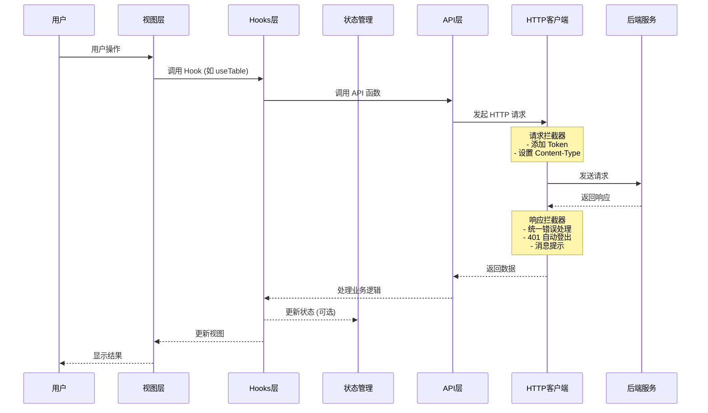
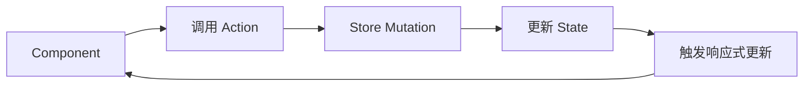

# 架构概览

## 项目架构

ainative-shadow 采用现代化的前端架构设计，基于 Vue 3 + TypeScript + Vite 构建。

```
┌─────────────────────────────────────────────────────────────┐
│                      视图层 (Views)                          │
│  页面组件、业务逻辑、用户交互                                  │
├─────────────────────────────────────────────────────────────┤
│                      组件层 (Components)                     │
│  核心组件库、业务组件、通用组件                                │
├─────────────────────────────────────────────────────────────┤
│                      逻辑层 (Hooks/Store)                    │
│  业务 Hooks、状态管理、数据处理                               │
├─────────────────────────────────────────────────────────────┤
│                      数据层 (API/Utils)                      │
│  HTTP 请求、工具函数、类型定义                                │
└─────────────────────────────────────────────────────────────┘
```

## 请求处理流程



## 目录结构

```
ainative-shadow/
├── src/
│   ├── api/                    # API 接口定义
│   │   ├── auth.ts            # 认证相关接口
│   │   └── system-manage.ts   # 系统管理接口
│   │
│   ├── assets/                 # 静态资源
│   │   ├── images/            # 图片资源
│   │   ├── styles/            # 全局样式
│   │   └── svg/               # SVG 图标
│   │
│   ├── components/             # 组件库
│   │   └── core/              # 核心组件
│   │       ├── base/          # 基础组件
│   │       ├── forms/         # 表单组件
│   │       ├── tables/        # 表格组件
│   │       ├── charts/        # 图表组件
│   │       └── layouts/       # 布局组件
│   │
│   ├── config/                 # 配置文件
│   │   ├── index.ts           # 配置入口
│   │   ├── setting.ts         # 系统设置
│   │   └── modules/           # 模块配置
│   │
│   ├── directives/             # 自定义指令
│   │   ├── core/              # 核心指令
│   │   └── business/          # 业务指令
│   │
│   ├── enums/                  # 枚举定义
│   │   ├── appEnum.ts         # 应用枚举
│   │   └── formEnum.ts        # 表单枚举
│   │
│   ├── hooks/                  # Hooks 函数
│   │   ├── core/              # 核心 Hooks
│   │   │   ├── useTable.ts    # 表格管理
│   │   │   ├── useAuth.ts     # 认证管理
│   │   │   └── useChart.ts    # 图表管理
│   │   └── index.ts           # 导出入口
│   │
│   ├── locales/                # 国际化
│   │   ├── zh-CN.json         # 中文
│   │   ├── en-US.json         # 英文
│   │   └── index.ts           # 配置
│   │
│   ├── router/                 # 路由配置
│   │   ├── core/              # 路由核心逻辑
│   │   ├── guards/            # 路由守卫
│   │   ├── modules/           # 路由模块
│   │   ├── routes/            # 路由定义
│   │   └── index.ts           # 路由入口
│   │
│   ├── store/                  # 状态管理
│   │   ├── modules/           # Store 模块
│   │   │   ├── user.ts        # 用户状态
│   │   │   ├── menu.ts        # 菜单状态
│   │   │   ├── setting.ts     # 设置状态
│   │   │   └── worktab.ts     # 标签页状态
│   │   └── index.ts           # Store 入口
│   │
│   ├── types/                  # 类型定义
│   │   ├── api/               # API 类型
│   │   ├── common/            # 通用类型
│   │   ├── component/         # 组件类型
│   │   ├── config/            # 配置类型
│   │   └── router/            # 路由类型
│   │
│   ├── utils/                  # 工具函数
│   │   ├── http/              # HTTP 工具
│   │   │   ├── index.ts       # HTTP 实例
│   │   │   ├── error.ts       # 错误处理
│   │   │   └── status.ts      # 状态码
│   │   ├── storage/           # 存储工具
│   │   ├── table/             # 表格工具
│   │   ├── router/            # 路由工具
│   │   └── ...                # 其他工具
│   │
│   ├── views/                  # 页面视图
│   │   ├── dashboard/         # 仪表盘
│   │   ├── system/            # 系统管理
│   │   ├── login/             # 登录页面
│   │   └── ...                # 其他页面
│   │
│   ├── App.vue                 # 根组件
│   └── main.ts                 # 应用入口
│
├── public/                     # 公共资源
├── vite.config.ts              # Vite 配置
├── tsconfig.json               # TypeScript 配置
├── package.json                # 项目依赖
└── README.md                   # 项目说明
```

## 技术栈详解

### 核心框架

| 技术       | 版本 | 说明                          |
| ---------- | ---- | ----------------------------- |
| Vue        | 3.5+ | 渐进式 JavaScript 框架        |
| TypeScript | 5.6+ | JavaScript 超集，提供类型系统 |
| Vite       | 7.1+ | 下一代前端构建工具            |

### UI 和样式

| 技术         | 版本  | 说明            |
| ------------ | ----- | --------------- |
| Element Plus | 2.11+ | Vue 3 组件库    |
| TailwindCSS  | 4.1+  | 原子化 CSS 框架 |
| SCSS         | 1.81+ | CSS 预处理器    |

### 状态和路由

| 技术                        | 版本 | 说明             |
| --------------------------- | ---- | ---------------- |
| Pinia                       | 3.0+ | Vue 3 状态管理   |
| Vue Router                  | 4.5+ | Vue 官方路由     |
| pinia-plugin-persistedstate | 4.3+ | Pinia 持久化插件 |

### 工具库

| 技术       | 版本  | 说明                   |
| ---------- | ----- | ---------------------- |
| Axios      | 1.12+ | HTTP 客户端            |
| VueUse     | 13.9+ | Vue Composition 工具集 |
| ECharts    | 6.0+  | 数据可视化图表库       |
| WangEditor | 5.1+  | 富文本编辑器           |

### 开发工具

| 技术      | 版本   | 说明           |
| --------- | ------ | -------------- |
| ESLint    | 9.9+   | 代码检查工具   |
| Prettier  | 3.5+   | 代码格式化工具 |
| Stylelint | 16.20+ | 样式检查工具   |
| Husky     | 9.1+   | Git Hooks 工具 |

## 核心设计模式

### 1. Composition API

项目全面采用 Vue 3 Composition API：

```typescript
<script setup lang="ts">
import { ref, computed, onMounted } from 'vue'

// 响应式数据
const count = ref(0)

// 计算属性
const doubleCount = computed(() => count.value * 2)

// 生命周期
onMounted(() => {
  console.log('组件已挂载')
})
</script>
```

### 2. Hooks 模式

封装可复用的业务逻辑：

```typescript
// hooks/core/useTable.ts
export function useTable(config) {
  const data = ref([])
  const loading = ref(false)

  const fetchData = async () => {
    loading.value = true
    // 获取数据逻辑
    loading.value = false
  }

  return { data, loading, fetchData }
}
```

### 3. 依赖注入

使用 provide/inject 进行跨组件通信：

```typescript
// 父组件
provide("theme", themeConfig)

// 子组件
const theme = inject("theme")
```

### 4. 插件系统

使用 Vite 插件扩展功能：

```typescript
// vite.config.ts
export default defineConfig({
  plugins: [
    vue(),
    AutoImport({
      /* 自动导入 API */
    }),
    Components({
      /* 自动导入组件 */
    }),
    // ...
  ],
})
```

## 数据流

### 单向数据流

```
用户操作 → 触发 Action → 更新 State → 触发视图更新
```

### 状态管理流程



## 权限控制

### 1. 路由级权限

通过路由守卫 `beforeEach` 控制页面访问：

```typescript
router.beforeEach(async (to, from, next) => {
  // 检查登录状态
  if (!userStore.isLogin && to.path !== "/login") {
    next("/login")
    return
  }

  // 检查路由权限
  if (!hasPermission(to.path)) {
    next("/403")
    return
  }

  next()
})
```

### 2. 按钮级权限

通过自定义指令 `v-auth` 控制按钮显示：

```vue
<template>
  <el-button v-auth="'user:add'">新增</el-button>
</template>
```

### 3. 动态路由

根据用户权限动态注册路由：

```typescript
// 获取用户菜单
const menuList = await fetchGetMenuList()

// 动态注册路由
routeRegistry.register(menuList)
```

## 性能优化策略

### 1. 代码分割

使用 Vite 的动态导入实现路由懒加载：

```typescript
{
  path: '/dashboard',
  component: () => import('@/views/dashboard/index.vue')
}
```

### 2. 组件缓存

使用 `KeepAlive` 缓存组件状态：

```vue
<template>
  <router-view v-slot="{ Component }">
    <keep-alive :include="keepAliveList">
      <component :is="Component" />
    </keep-alive>
  </router-view>
</template>
```

### 3. 请求缓存

在 `useTable` Hook 中实现智能缓存：

```typescript
const { data, loading } = useTable({
  core: { apiFn: fetchList },
  performance: {
    enableCache: true,
    cacheTime: 5 * 60 * 1000, // 5分钟
  },
})
```

### 4. 资源优化

- 图片使用 WebP 格式
- 开启 Gzip 压缩
- 按需加载第三方库
- 使用 CDN 加速

## 相关文档

- [开发环境配置](dev-environment.md)
- [组件开发规范](component-development.md)
- [状态管理规范](state-management.md)
- [路由配置规范](router-config.md)
