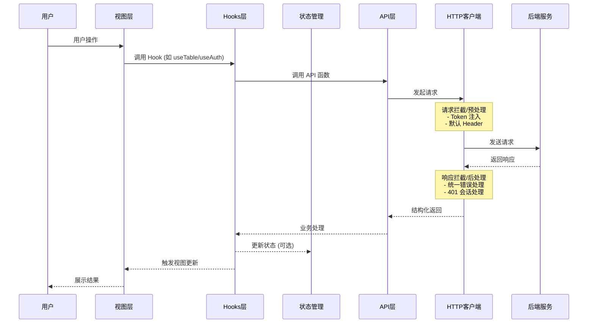
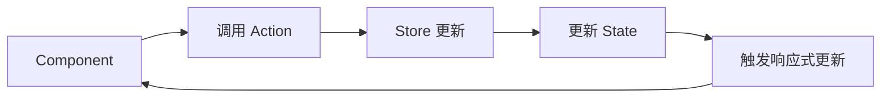

# 架构概览

## 文档修订（先处理不合理项）

在进入重构前，先把原文档里和当前项目不一致或过于绑定实现的内容修正：

1. 目录根名从 `ainative-shadow/` 改为当前仓库实际的 `frontend/`。
2. 状态管理目录统一为 `stores/`（与 Pinia 生态和现有代码一致）。
3. HTTP 层不强绑 Axios，定义为“可替换客户端适配层”。
4. 技术栈拆分为“当前已落地依赖”和“可选扩展依赖”，避免文档与代码长期漂移。
5. 权限与动态路由定义为可分阶段落地，避免与 MVP 登录流程冲突。

## 项目架构

frontend 采用 Vue 3 + TypeScript + Vite，按“分层 + 模块化”组织：

```
┌─────────────────────────────────────────────────────────────┐
│                      视图层 (Views)                          │
│  页面组件、业务编排、用户交互                                  │
├─────────────────────────────────────────────────────────────┤
│                      组件层 (Components)                     │
│  核心组件库、业务组件、通用组件                                │
├─────────────────────────────────────────────────────────────┤
│                  逻辑层 (Hooks/Stores)                       │
│  业务 Hooks(Composables)、状态管理、数据编排                    │
├─────────────────────────────────────────────────────────────┤
│                      数据层 (API/Utils)                      │
│  HTTP 客户端、API 封装、工具函数、类型定义                      │
└─────────────────────────────────────────────────────────────┘
```

## 请求处理流程



## 目录结构

```
frontend/
├── src/
│   ├── api/                    # API 接口定义
│   │   ├── auth.ts
│   │   └── system-manage.ts
│   │
│   ├── assets/                 # 静态资源
│   │   ├── images/
│   │   ├── styles/
│   │   └── svg/
│   │
│   ├── components/             # 组件
│   │   ├── core/
│   │   │   ├── base/
│   │   │   ├── forms/
│   │   │   ├── tables/
│   │   │   ├── charts/
│   │   │   └── layouts/
│   │   └── business/
│   │
│   ├── config/                 # 全局配置
│   │   ├── index.ts
│   │   ├── setting.ts
│   │   └── modules/
│   │
│   ├── directives/             # 自定义指令
│   │   ├── core/
│   │   └── business/
│   │
│   ├── enums/                  # 枚举定义
│   │   ├── appEnum.ts
│   │   └── formEnum.ts
│   │
│   ├── hooks/                  # 业务 Hooks (Composables)
│   │   ├── core/
│   │   │   ├── useTable.ts
│   │   │   ├── useAuth.ts
│   │   │   └── useChart.ts
│   │   └── index.ts
│   │
│   ├── locales/
│   │   ├── zh-CN.json
│   │   ├── en-US.json
│   │   └── index.ts
│   │
│   ├── router/
│   │   ├── core/
│   │   ├── guards/
│   │   ├── modules/
│   │   ├── routes/
│   │   └── index.ts
│   │
│   ├── stores/                 # Pinia 状态管理
│   │   ├── modules/
│   │   │   ├── user.ts
│   │   │   ├── menu.ts
│   │   │   ├── setting.ts
│   │   │   └── worktab.ts
│   │   └── index.ts
│   │
│   ├── types/
│   │   ├── api/
│   │   ├── common/
│   │   ├── component/
│   │   ├── config/
│   │   └── router/
│   │
│   ├── utils/
│   │   ├── http/
│   │   │   ├── index.ts
│   │   │   ├── error.ts
│   │   │   └── status.ts
│   │   ├── storage/
│   │   ├── table/
│   │   ├── router/
│   │   └── ...
│   │
│   ├── views/
│   │   ├── dashboard/
│   │   ├── projects/
│   │   ├── tasks/
│   │   ├── login/
│   │   └── ...
│   │
│   ├── App.vue
│   └── main.ts
│
├── public/
├── vite.config.ts
├── tsconfig.json
├── package.json
└── README.md
```

## 技术栈（当前与规划）

### 当前已落地（以仓库依赖为准）

| 技术       | 版本（当前仓库） | 说明                  |
| ---------- | ---------------- | --------------------- |
| Vue        | ^3.5.27          | 核心框架              |
| TypeScript | ~5.9.3           | 类型系统              |
| Vite       | ^7.3.1           | 构建与开发服务器      |
| Tailwind   | ^4.0.0           | 原子化样式            |
| Pinia      | ^3.0.4           | 状态管理              |
| Router     | ^5.0.1           | 路由管理              |
| Vitest     | ^4.0.18          | 单元测试              |
| Playwright | ^1.58.1          | 端到端测试            |

### 可选扩展（按业务需要引入）

- Axios：如需更成熟的中间件生态可接入。
- pinia-plugin-persistedstate：如需通用持久化策略可接入。
- Element Plus / ECharts / WangEditor：在对应业务模块落地时按需引入。

## 核心设计模式

### 1. Composition API

Vue SFC 统一采用 `<script setup lang="ts">`。

### 2. Hooks（Composables）模式

可复用的状态与副作用放到 `hooks/core`，视图层只做编排。

### 3. 依赖注入

跨层共享上下文时使用 provide/inject，避免层层透传。

### 4. 插件系统

Vite 插件以“必要优先、按需扩展”为原则：

```typescript
export default defineConfig({
  plugins: [tailwindcss(), vue(), vueJsx(), vueDevTools()],
})
```

## 数据流

### 单向数据流

```
用户操作 → 触发 Action → 更新 State → 视图响应
```

### 状态管理流程



## 权限控制（分阶段落地）

### 阶段 1：基础守卫

基于 `meta.requiresAuth` 的登录守卫：

```typescript
router.beforeEach((to) => {
  if (to.meta.requiresAuth && !userStore.isLogin) return '/login'
  return true
})
```

### 阶段 2：按钮级权限

通过 `v-auth` 控制元素可见性：

```vue
<template>
  <button v-auth="'user:add'">新增</button>
</template>
```

### 阶段 3：动态路由

按用户菜单/角色动态注册业务路由。

## 性能优化策略

### 1. 代码分割

路由组件统一懒加载：

```typescript
{
  path: '/dashboard',
  component: () => import('@/views/dashboard/index.vue'),
}
```

### 2. 组件缓存

针对需要保活的视图启用 `KeepAlive`。

### 3. 请求缓存

在 `useTable` 等 hooks 里按场景实现缓存（可配置过期时间）。

### 4. 资源优化

- 图片优先 WebP/AVIF。
- 生产构建开启压缩与分包。
- 第三方库按需加载。
