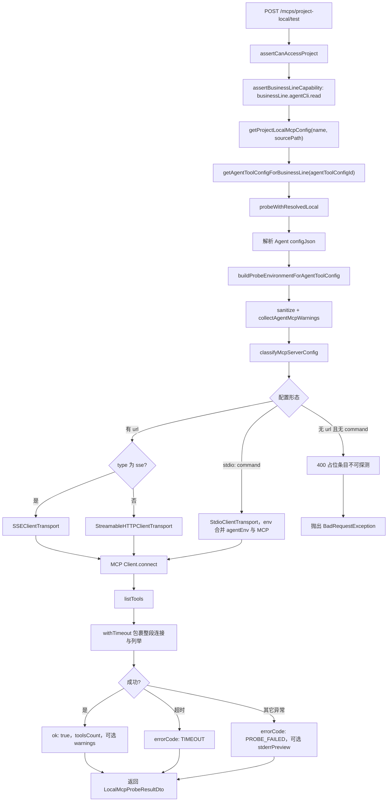

# 本地 MCP 探测（Local MCP Probe）

使用 `@modelcontextprotocol/sdk` 的 `Client` 连接 MCP Server（stdio / SSE / HTTP），执行 `listTools` 并统计工具数量。探测时子进程/请求所用的 **环境变量** 与真实控制面执行 Agent CLI 时一致，由 `AgentCliSmokeTestService.buildProbeEnvironmentForAgentToolConfig` 根据所选业务线 Agent 工具配置生成。

---

## 目标

- 针对**项目维度**解析出的本地 MCP 条目（名称、`sourcePath`、服务端配置），验证能否完成 MCP 握手并 **`listTools`**。
- **stdio**：子进程环境 = 上述 Agent 环境 + MCP 配置中的 `env`。
- **远程 URL**（`url` 存在）：按 `type === 'sse'` 走 SSE，否则走 Streamable HTTP；支持自定义 `headers`。

## 探测流程图

## 核心实现

| 项目 | 说明 |
|------|------|
| 服务类 | `backend/src/business-lines/local-mcp-probe.service.ts`（`LocalMcpProbeService`） |
| SDK | `@modelcontextprotocol/sdk`：`Client` + `StdioClientTransport` / `SSEClientTransport` / `StreamableHTTPClientTransport` |
| 环境对齐 | `AgentCliSmokeTestService.buildProbeEnvironmentForAgentToolConfig({ toolId, configJson })` |
| 超时 | 默认与 Agent CLI 嗅探共用同一套上限；优先读 `AINATIVE_LOCAL_MCP_PROBE_TIMEOUT_MS`，未设置则回落到 `AINATIVE_AGENT_CLI_SMOKE_TEST_TIMEOUT_MS` 的解析结果（见 `resolveLocalMcpProbeTimeoutMs`） |

## 配置分类（`classifyMcpServerConfig`）

- 有 **`url`**：`type` 为 `sse` → `transport: sse`；否则 → `transport: http`；均可带 `headers`。
- 无 `url`：必须提供 **`command`**（stdio）；`args` 为字符串数组，`env` 为 string 键值对。
- 既无 `url` 又无 `command`：返回 `400`，提示占位条目无法探测。

## 与 Agent CLI 配置的一致性警告（非阻断）

在探测成功或失败时都可能附带 `warnings`：

| 代码 | 含义（简述） |
|------|----------------|
| `AGENT_MCP_CONFIG_MAY_NOT_REFERENCE_BUSINESS_LINE_FILE` | Claude：`mcp_config` 列表中可能未包含当前业务线 MCP 配置文件解析路径 |
| `AGENT_GEMINI_MCP_MAY_NOT_REFERENCE_BUSINESS_LINE_FILE_OR_NAME` | Gemini：`extensions` 与 `allowed_mcp_server_names` 可能都未引用当前文件或 MCP 名 |

## 错误码

- 超时：`errorCode: TIMEOUT`，`message` 含耗时说明。
- 其他失败：`errorCode: PROBE_FAILED`；若 stdio 有收集到 stderr，会带 `stderrPreview`。

## HTTP API

- **方法/路径**：`POST /api/v1/mcps/project-local/test`
- **请求体**（`TestProjectLocalMcpDto`）：
  - `projectId`（UUID）
  - `name`：MCP 服务名
  - `sourcePath`：配置文件路径（用于解析该 server 块）
  - `agentToolConfigId`：用于对齐环境变量的业务线 Agent 工具配置 ID
- **鉴权**：JWT；需能访问项目，且具备 `businessLine.agentCli.read` 能力（见 `McpsService.testProjectLocalMcp`）。

## 响应 DTO

`LocalMcpProbeResultDto`（`backend/src/business-lines/dto/local-mcp-probe-result.dto.ts`）：

- 成功：`ok: true`，`transport`，`toolsCount`，可选 `warnings`
- 失败：`ok: false`，`transport`，`errorCode`，`message`，可选 `stderrPreview`、`warnings`

## 前端入口

- API：`frontend/src/api/mcps.ts` → `testProjectLocalMcp`
- MCP 页面：`frontend/src/pages/mcp/use-mcp-page.ts` → `testProjectLocalMcp`；按 MCP 来源（provider）过滤可选的 Agent CLI 配置，需用户先选择「用于探测的 Agent CLI 配置」；文案映射见同文件内 `formatMcpProbeWarnings` 与 `mcp-probe-provider-map.ts`。

## 环境变量

| 变量 | 作用 |
|------|------|
| `AINATIVE_LOCAL_MCP_PROBE_TIMEOUT_MS` | MCP 探测超时（毫秒，有与 smoke 相同的上限）；未设置则沿用 Agent CLI 嗅探测试的超时配置 |

## 模块归属

`LocalMcpProbeService` 源码在 `business-lines`，由 `McpsModule` 引入并在 `McpsController` 上暴露 `project-local/test`。

## 自动化测试

`backend/src/business-lines/local-mcp-probe.service.spec.ts`：stdio 探测与工具数量等（测试中对 `AgentCliSmokeTestService` 使用 mock）。

## 扩展 Agent CLI 类型时（与 MCP 联动）

若新适配器需要在 MCP 侧做「配置是否引用本文件」的启发式警告，需在 `LocalMcpProbeService.collectAgentMcpWarnings` 中补充对应字段逻辑；环境变量覆盖需保证 `buildProbeEnvironmentForAgentToolConfig` 已包含所需密钥。
