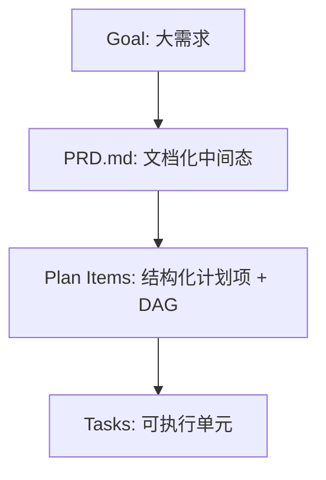
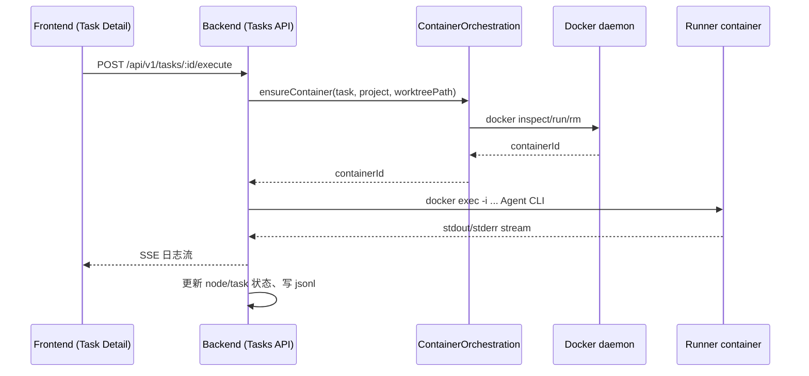

# AINative 技术分享（可演讲版）：从“聊天壳”到“工程控制系统”

> 说明：本文是把《技术分享文章模板》**直接套到 AINative 仓库**后的“可演讲版稿子”。每节都包含**讲述要点**，适合做 20–40 分钟分享（按需取舍）。  
> 关联材料：  
> - 分享正文（更像“可阅读文章”）：[ainative-tech-sharing.md](./ainative-tech-sharing.md)  
> - 代码到架构映射分析（结论更密）：[ainative-codebase-technical-analysis.md](./ainative-codebase-technical-analysis.md)

---

# 《AINative 技术分享：把 AI 执行纳入工程控制链》

> 受众：跨团队（产品 / 前端 / 后端 / 平台 / 测试 / 运维）  
> 一句话总结：AINative 通过 **Goal → PRD → Plan → Task** 的治理链路 + **控制面/执行面分离（Runner 容器 + docker exec）**，把 AI 编码从“随机对话输出”升级为“可治理、可审计、可复盘的工程执行系统”。

---

## 1. 背景与业务价值（Why）

### 1.1 业务背景
AINative 面向的是“真实研发协作”，而不是单人玩具式的 AI 编码：
- 需求通常较大、角色多（产品/研发/测试/平台协作）。
- 一次性对话式执行难以承载稳定交付（上下文爆炸、方向易偏、难审计、难回滚）。

**证据入口（仓库内既有结论）**：  
- [AINative 代码库技术分析](./ainative-codebase-technical-analysis.md)

#### 讲述要点（建议 2–3 分钟）
- “我们不是在做一个聊天 UI，而是在做一个**研发流程工作台**。”
- 对比常见 AI Coding 工具：它们强在“单次产出”，弱在“协作交付”；AINative 的定位是把 AI 放进工程链条里。

### 1.2 为什么现在必须做
触发因素（可按你们真实情况取舍表述）：
- 需求规模变大后，“一次执行做完”失败率上升，返工成本高。
- 需要把 AI 行为纳入审计/评审/权限治理（尤其是涉及代码写入、环境执行、依赖安装等）。
- 需要让多个任务并行推进，但仍保持依赖可控、执行可复现。

#### 讲述要点（建议 1–2 分钟）
- 不是“模型不够强”，而是“**缺少工程控制面**”：缺少中间态、缺少边界、缺少可观测与可回滚。

### 1.3 目标与成功标准（更偏工程视角）
可用“我们希望系统具备这些性质”表达：
- 可治理：大需求能拆分、依赖能校验、推进可控。
- 可审计：任务/节点有状态、日志、产物，链路可复盘。
- 可复现：执行环境隔离，不依赖个人本机差异。
- 可协作：前后端/后端/平台边界清晰，能长期演进。

**工程门禁线索**（说明“这不是口号”）：  
- 根脚本：dev / quality-gate / docker lifecycle：[package.json](../../package.json)  

#### 讲述要点（建议 1–2 分钟）
- 分享时不要堆指标，先讲“我们要把 AI 行为变成工程行为”，指标是后续落地自然产物。

---

## 2. 现状与问题分析（What）

### 2.1 系统现状概览（仓库结构与运行方式）
仓库是全栈工作区：
- `frontend/`：Vue 3 + Vite 的工作台前端
- `backend/`：NestJS 控制面（API/Worker）
- `runner/`：执行面镜像与 entrypoint/config 渲染
- `docs/technical/`：核心技术文档沉淀

启动方式与依赖：
- [README.md](../../README.md)
- [docker-compose.yml](../../docker-compose.yml)

#### 讲述要点（建议 2–3 分钟）
- 给听众一个“地图”：三块（前端工作台、后端控制面、runner 执行面）+ 一套门禁（quality-gate）。

### 2.2 根因分析（为什么“聊天壳”不够）
把根因讲成 3 类（跨团队易懂）：
1) **需求/计划不可治理**：大需求没有结构化中间态，难拆解、难表达依赖。  
2) **执行不可复现**：本机环境差异导致执行链路不稳定。  
3) **交付不可审计**：缺少统一状态机、日志与产物沉淀，评审点太晚。

#### 讲述要点（建议 2–3 分钟）
- “AI 写代码”这件事，真正的工程难点是：**怎么保证它在团队协作中稳定可控**。

---

## 3. 方案设计（How）—核心设计原则

### 3.1 设计原则
1) **先治理再执行**：把“大需求”拆成可编辑、可校验的结构化对象，再进入执行域。  
2) **控制面/执行面分离**：控制面负责治理（权限/调度/状态/Git/容器编排），执行面负责隔离执行（runner 容器）。  
3) **边界可执行（可被工具校验）**：前端五分区用 ESLint boundaries 落地，后端边界用模块分区与文档约束落地。  

#### 讲述要点（建议 2–3 分钟）
- 强调“边界”不是 PPT，而是写进配置/代码/门禁里（后面会展示证据文件）。

---

## 4. 方案设计（How）—方案选型与关键权衡

### 4.1 需求治理：直接生成 Task vs 引入 Goal 中间态
**推荐方案：Goal → PRD → Plan → Task**

| 选项 | 优点 | 缺点 | 结论 |
|---|---|---|---|
| 直接生成 Task | 链路短 | 上下文爆炸、依赖难表达、纠偏晚 | 不作为主路径 |
| Goal 中间态（推荐） | 可编辑/可审计/可表达依赖 | 需要新增对象与页面/接口 | 主路径 |

证据：  
- [goal-task-decomposition-design.md](./goal-task-decomposition-design.md)

#### 讲述要点（建议 3–5 分钟）
- 解释“中间态”的价值：把“规划错误”与“执行错误”分阶段处理，降低返工成本。

### 4.2 执行环境：本机执行 vs runner 容器执行
**推荐：runner 容器 + docker exec（隔离执行）**

| 选项 | 优点 | 缺点 | 结论 |
|---|---|---|---|
| 本机执行 | 低成本、调试方便 | 不可复现、污染宿主、权限边界弱 | 仅个人实验 |
| runner 容器执行 | 可复现/隔离/可控 | 需要 Docker 与编排能力 | 主路径 |

证据：  
- [task-container-execution-boundaries.md](../../backend/docs/task-container-execution-boundaries.md)  
- [task-container-lifecycle-lessons.md](../../backend/docs/task-container-lifecycle-lessons.md)

#### 讲述要点（建议 3–5 分钟）
- 强调：AINative 的“可靠性”来自“执行的工程化”，不是来自某个模型更聪明。

---

## 5. 目标架构（To-Be）：三层边界 + 一条可追溯链路

### 5.1 总体架构（容器图）

```mermaid
flowchart LR
  U[用户/浏览器] --> FE[Frontend: Vue SPA]
  FE -->|/api/v1| BE[Backend: NestJS Control Plane]
  BE --> PG[(PostgreSQL)]
  BE --> RD[(Redis)]
  BE -->|docker.sock| DK[Docker daemon]
  DK --> RC[Runner containers: ainative-task-*/ainative-run-*]
  RC -->|bind mount| WT[Git worktree (/workspace)]
```

#### 讲述要点（建议 2–3 分钟）
- 听众只要记住一句话：**后端是控制面，Runner 是执行面**；执行通过 docker exec 进入容器完成。

---

## 6. 核心流程（关键链路拆解）

### 6.1 链路 A：Goal → PRD → Plan → Task（先治理再执行）



关键实现证据：
- Plan DAG：环检测与拓扑顺序  
  - [backend/src/goals/goal-plan-dag.ts](../../backend/src/goals/goal-plan-dag.ts)
- GoalsService（权限校验、依赖校验、任务物化等入口）  
  - [backend/src/goals/goals.service.ts](../../backend/src/goals/goals.service.ts)

#### 讲述要点（建议 4–6 分钟）
- 讲清楚 DAG 的业务意义：依赖可表达、可校验、可按拓扑物化任务，避免“靠人脑排顺序”。

### 6.2 链路 B：执行一个 Task Node（容器 ensure + docker exec + 日志/状态回写）



关键实现证据：
- 容器编排门面（ensure/reuse/slot heartbeat/画像选择）：  
  - [backend/src/containers/container-orchestration.service.ts](../../backend/src/containers/container-orchestration.service.ts)
- 节点执行编排（确保 runtime/worktree、触发 runner 执行等）：  
  - [backend/src/tasks/application/task-node-execution.service.ts](../../backend/src/tasks/application/task-node-execution.service.ts)
- 控制面 vs 执行面边界说明：  
  - [task-container-execution-boundaries.md](../../backend/docs/task-container-execution-boundaries.md)

#### 讲述要点（建议 5–8 分钟）
- 强调“runner-only”的特点：容器可能只有占位进程，真正执行靠 docker exec；排障要看控制面写的 jsonl 与状态，而不是只看 docker logs。  
  - 证据： [task-container-lifecycle-lessons.md](../../backend/docs/task-container-lifecycle-lessons.md)

### 6.3 链路 C：前端任务详情页（薄壳 pages → feature 编排 → api 契约）
证据路径（可在演讲中选 1 条链路快速展示）：
- pages 薄壳：  
  - [frontend/src/pages/tasks/detail.vue](../../frontend/src/pages/tasks/detail.vue)
- feature 编排：  
  - [frontend/src/features/tasks/TaskDetailPage.vue](../../frontend/src/features/tasks/TaskDetailPage.vue)
  - [frontend/src/features/tasks/use-task-detail-page.ts](../../frontend/src/features/tasks/use-task-detail-page.ts)
- api 契约：  
  - [frontend/src/api/tasks.ts](../../frontend/src/api/tasks.ts)

#### 讲述要点（建议 3–5 分钟）
- 讲清楚“为什么页面要薄”：减少耦合、方便复用、提升可维护性；复杂度收敛在 feature。

---

## 7. 前端架构落地：五分区如何变成门禁

### 7.1 五分区（app/pages/features/api/shared）的协作价值
前端架构说明（用语统一、便于跨团队沟通）：  
- [docs/dev-spec/frontend/ARCHITECTURE.md](../dev-spec/frontend/ARCHITECTURE.md)

### 7.2 boundaries 规则：禁止跨域 deep import 等
证据（直接写在 ESLint 配置里）：  
- [frontend/eslint.config.ts](../../frontend/eslint.config.ts)

#### 讲述要点（建议 2–4 分钟）
- 强调“边界可执行”：架构约束能被自动化校验，比靠 code review 更稳定。

---

## 8. 状态机与交付：为什么只有 4 个状态也能跑通复杂流程

任务与节点共用 4 态：`todo / in_progress / in_review / done`，但语义不同：
- 任务级 `in_review`：保留给“所有节点 done 后的最终人工确认”
- 节点级 `in_review`：统一表示“必须人工介入”（成功待审批/失败/取消/超时等）

证据：  
- [task-status-state-machine.md](./task-status-state-machine.md)

#### 讲述要点（建议 2–4 分钟）
- “少状态不是简陋，是为了让交互语义更一致、门禁更清晰。”

---

## 9. 效果与收益（Result）—建议你们补充的数据位置

> 说明：仓库内更多是工程实现证据；如果你要做更强的“业务价值证明”，建议在演讲时补充你们自己的指标（例如：任务成功率、平均交付周期、返工率、审阅效率、执行失败原因占比）。

建议按“Before/After”组织：
- 稳定性：执行失败率 / 回滚次数 / 排障耗时
- 研发效率：从需求到可交付 PR 的周期、并行能力
- 可维护性：跨域耦合减少、模块演进速度提升

#### 讲述要点
- 业务方听“收益”，技术方听“证据链路”，两者都要给。

---

## 10. 经验复盘（Learn）—可复用的方法论

1) **中间态建模**：PRD/Plan 不只是文本，是可编辑、可校验、可再生成的治理对象。  
2) **边界分离**：控制面（治理）与执行面（隔离执行）分离，提升可控性与安全边界。  
3) **门禁落地**：规范 + 工具校验（ESLint/quality-gate）比“靠人记住”更可靠。  
4) **状态机统一语义**：少状态 + 强约束 + 明确门禁，让协作成本更低。

#### 讲述要点
- 把经验讲成“什么时候适用/不适用”，让听众能带回自己的团队用。

---

## 11. 后续规划（Next）—不写排期，只写方向与可度量目标

可选方向（结合仓库现状）：
- 观测与诊断：把容器/slot/执行失败的诊断链路做成标准化报告。
- 执行能力泛化：在 runner 中标准化更多工程命令入口（测试、构建、lint 等）。
- 编排复杂度治理：对 tasks/application 的 orchestrator 拆分与测试覆盖增强。

---

## 附录：演讲时推荐的“展示顺序”（最省时间但信息密度高）

1) 先讲一句话定位：“AINative 是工程控制系统，不是聊天壳”  
2) 放 1 张容器图（3 层边界）  
3) 讲 Goal → Plan（DAG）为什么能治理复杂需求  
4) 讲 Task Node 执行链路（ensure container + docker exec）为什么可复现  
5) 用前端五分区 + boundaries 规则展示“边界是可执行的”  
6) 用 4 态状态机解释“为什么能支撑审阅与人工介入”

